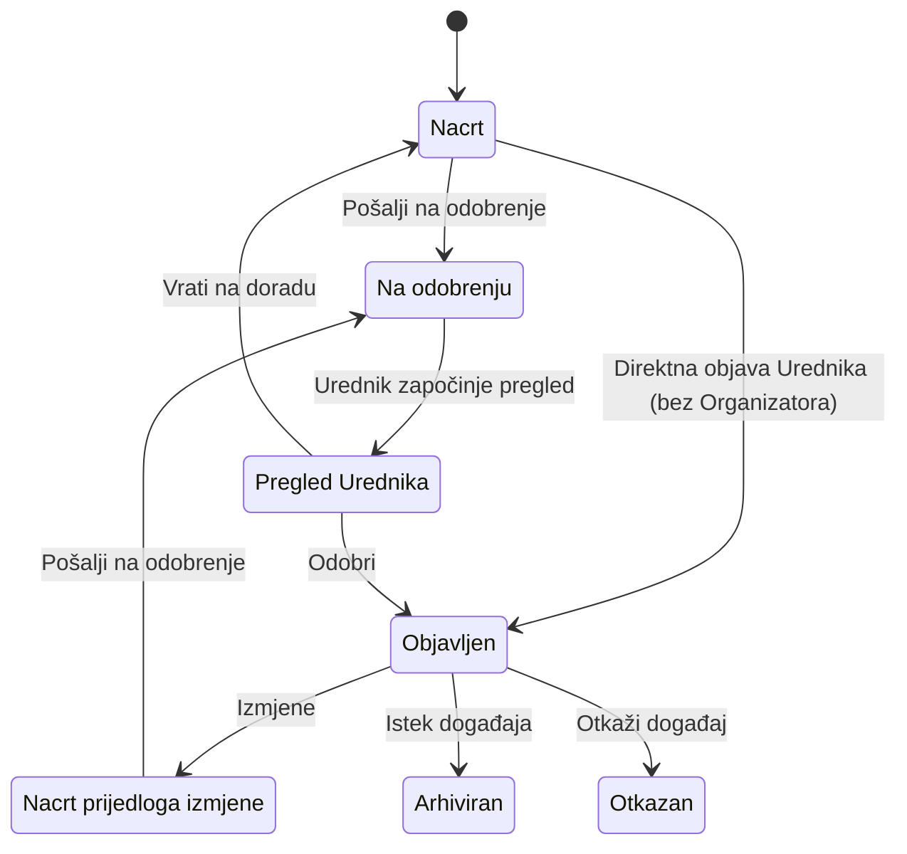

# Digital Kotor
# Functional Specification
## Modul: Kalendar kulture

**Status dokumenta:** U IZRADI
**Verzija:** 0.1

---

# Istorija verzija

| Verzija / PATCH | Datum | Opis |
|-----------------|--------|------|
| 0.1 | 2026-07-26 | Uspostavljena metodologija rada Functional Specification modula Kalendar kulture. Usvojene tačke FS-001 / 1. Svrha, FS-001 / 2. Korisnici, FS-001 / 3. Preduslovi i Platformsko pravilo. |
| PATCH-FS-001 | 2026-07-26 | Terminološka migracija usklađena sa Business Modelom (PATCH-023): Termin = datum i vrijeme; Održavanje događaja = jedno konkretno održavanje. Poslovna logika nije proširena. |
| PATCH-FS-002 | 2026-07-26 | Usklađivanje sa BM PATCH-024: Datum održavanja je obavezan, a vrijeme može biti definisano. Usklađeni 5.4.2, 5.4.3, 5.5 i 5.5.3. |
| PATCH-FS-003 | 2026-07-26 | FS-001 / 5.7.1 Upravljanje terminima događaja – Approved. Usvojena poslovna pravila BR-056–BR-061. |
| PATCH-FS-004 | 2026-07-26 | FS-001 / 5.7.2 Upravljanje statusom događaja – Approved. Usvojena poslovna pravila BR-062–BR-066. |
| PATCH-FS-005 | 2026-07-26 | FS-001 / 5.7.3 Upravljanje statusom termina – Approved. Usvojena poslovna pravila BR-067–BR-069. |
| PATCH-FS-006 | 2026-07-26 | FS-001 / 5.8 Upravljanje moderatorima – Approved. Usvojena poslovna pravila BR-070–BR-073 (uklanjanje Moderatora). |
| PATCH-FS-007 | 2026-07-26 | FS-001 / 5.9 Upravljanje lokacijama – Approved. Usvojena poslovna pravila BR-074–BR-080. |
| PATCH-FS-008 | 2026-07-26 | FS-001 / 5.10 Upravljanje kategorijama i oznakama – Approved. Usvojena poslovna pravila BR-081–BR-085. |
| PATCH-FS-009 | 2026-07-26 | FS-001 / 5.11 Upravljanje medijima – Approved. Usvojena poslovna pravila BR-086–BR-091. |
| PATCH-FS-010 | 2026-07-26 | FS-001 / 5.12 Upravljanje manifestacijama – Approved. Usvojena poslovna pravila BR-092–BR-101. |
| PATCH-FS-011 | 2026-07-26 | FS-001 / 5.13 Javni portal — pregled, pretraga i prikaz – Approved. Usvojena poslovna pravila BR-102–BR-115. |
| PATCH-FS-012 | 2026-07-26 | FS-001 / 5.13 usklađen sa BM PATCH-025: BR-102–BR-115; uklonjeno sortiranje (BR-108); dodati BR-116 (javno objavljen sadržaj) i BR-117 (istaknuti događaj). |
| PATCH-FS-013 | 2026-07-26 | FS-001 / 5.14.1 Namjena i položaj Uredničkog portala – Approved. Usvojena poslovna pravila BR-118–BR-121. |
| PATCH-FS-014 | 2026-07-26 | FS-001 / 5.14.2 Korisnici, ovlašćenja i saradnja – Approved. Usvojena poslovna pravila BR-122–BR-125. |
| PATCH-FS-015 | 2026-07-26 | FS-001 / 5.14.3 Funkcionalni obuhvat Uredničkog portala – Approved. Usvojena poslovna pravila BR-126–BR-128. |
| PATCH-FS-016 | 2026-07-26 | FS-001 / 5.14: podpoglavlje 5.14.4 Primjena poslovnih pravila nije uvedeno. BM-EP-04, BM-EP-08 i BM-EP-10 već pokriveni BR-120, BR-121, BR-123 i BR-127; bez novih BR. Zadržana kontinuirana numeracija 5.14.1–5.14.3 i BR-001–BR-128. |
| PATCH-FS-017 | 2026-07-26 | Terminološko usklađivanje sa BM: „održavanje događaja“ = poslovni entitet; „termin" = isključivo datum i eventualno vrijeme. Usklađeni 5.7.1, 5.7.3, BR-056–BR-061, BR-065, BR-067–BR-069, BR-126, BR-127 i sadržaj. Poslovna logika nije mijenjana. |
| PATCH-FS-018 | 2026-07-26 | Terminološko usklađivanje: u jednom trenutku javni portal prikazuje jedan istaknuti događaj (usklađeno sa BM-PK-15 / BR-117). Ispravljeni množinski oblici u 1. Svrha i 5.3. |
| PATCH-FS-019 | 2026-07-26 | FS-001 / 5.4: oznake su dio V1 detalja događaja i prikazuju se na javnom portalu (usklađeno sa BM-KO-01, BM-PK-05, BM-PK-11, BR-106, BR-112). Uklonjena kontradikcija iz 5.4.9; dopunjen 5.4.2. |
| PATCH-FS-020 | 2026-07-26 | Metodološko usklađivanje hijerarhije dokumentacije: Business Model definiše poslovna pravila; Functional Specification razrađuje funkcionalne zahtjeve. Izmijenjen BR-121; dopunjena Pravila upravljanja Functional Specification. |
| PATCH-FS-021 | 2026-07-26 | Functional Specification je usklađen sa Business Model-om kroz definisanje funkcionalnog workflow-a statusa „Odgođen“ za održavanje događaja. Usklađeni BR-067 i BR-069; dodati BR-129–BR-131 (BM-TR-09, BM-TR-10, BM-TR-12–BM-TR-15). |
| PATCH-FS-022 | 2026-07-27 | Functional Specification usklađen sa Business Model-om kroz definisanje ovlašćenja za upravljanje statusima održavanja. Usklađen BR-061 (BM-TR-08); dodati BR-132–BR-134 (BM-TR-16–BM-TR-18). |
| PATCH-FS-023 | 2026-07-27 | FS-001 / 5.14.3: BR-126 dopunjen stavkom „pregled statusa entiteta“ radi potpunog prenosa BM-EP-03. |
| PATCH-FS-024 | 2026-07-27 | Usklađivanje sa BM PATCH-029: Organizator = poslovni entitet; zahtjev za kreiranje Organizatora sa predloženim Moderatorom; Urednik isključiva uloga; aktivni kontekst Organizatora (BR-047, BR-051, BR-132, BR-135–BR-137; Platformsko pravilo; 5.6). |
| PATCH-FS-025 | 2026-07-27 | BR-056 dopunjen potpunim prenosom BM-TR-02 (veza održavanja i događaja). |
| PATCH-FS-026 | 2026-07-27 | Prenos BM-ST-01: definicija životnog ciklusa događaja u 5.7.2; terminološko usklađivanje 5.5.1/5.5.2 (workflow izmjena umjesto „životni ciklus“). |
| PATCH-FS-027 | 2026-07-27 | Potpuni prenos BM-ST-03: početni status Nacrt; uređivanje nacrta sa/bez Organizatora (BR-013, BR-015, BR-021; 5.5.4.1). |
| PATCH-FS-028 | 2026-07-27 | Potpuni prenos BM-ST-04: direktna objava Urednika bez Organizatora kao jedini izuzetak od odobravanja (BR-018, BR-028, BR-045; dijagram 5.5.6a). |
| PATCH-FS-029 | 2026-07-27 | Prenos BM-ST-09: opšte pravilo promjene statusa događaja u uvodu §5.7.2. |
| PATCH-FS-030 | 2026-07-27 | §5.5.4.1 usklađen sa BR-021: uklonjena zastarjela rečenica o „drugim poslovnim pravilima“. |
| PATCH-FS-031 | 2026-07-27 | Potpuna funkcionalna specifikacija Newslettera (BM-13 / BM-NL-01–BM-NL-09 + V1 odluke): novo poglavlje 5.15, BR-138–BR-157. |
| PATCH-FS-032 | 2026-07-27 | Newsletter zasnovan na novoobjavljenim događajima (usklađeno sa BM PATCH-031): objavljivanje = okidač; periodična provjera; bez fiksnog sedmičnog perioda; BR-147–BR-153, BR-148, BR-149, BR-157 usklađeni; dodati BR-158–BR-159. |
| PATCH-FS-033 | 2026-07-27 | Newsletter: poslovno značajne promjene kao okidači (usklađeno sa BM PATCH-032); prioritetna obavještenja; publika = pretplatnici kojima je događaj već poslat; BR-138, BR-147–BR-150, BR-157–BR-159 usklađeni; dodati BR-160–BR-165. |
| PATCH-FS-034 | 2026-07-27 | Newsletter: višestruke poslovno značajne promjene → posljednje važeće stanje; objedinjavanje prioritetnih obavještenja uz blagovremenost; zabrana kontradiktornih poruka (usklađeno sa BM PATCH-033). Usklađeni BR-151, BR-163; dodati BR-166–BR-169. |
| PATCH-FS-035 | 2026-07-27 | Novo poglavlje 5.16 Evidencija aktivnosti (BM-14 / BM-AL-01–BM-AL-08): razgraničenje centralne evidencije i lokalnih tragova; kriterijum; V1 katalog (Organizatori, Moderator, događaji, Newsletter); granice V1. BR-170–BR-188. |

Napomena:

Ovo poglavlje služi isključivo za evidenciju razvoja dokumenta.

Kod svake naredne verzije dodaje se novi red u tabeli.

Ne mijenjaju se postojeći redovi.

Svaki PATCH dobija:

- jedinstvenu oznaku (PATCH-001, PATCH-002...),
- datum,
- kratak naziv,
- kratak opis izmjene.

Naziv PATCH-a predstavlja zvanični naziv izmjene i koristi se u istoriji verzija.

---

## Svrha dokumenta

Dokument predstavlja referentnu funkcionalnu specifikaciju za planiranje, razvoj, testiranje i održavanje sistema.

---

# Status razvoja Functional Specification

| Poglavlje | Status |
|-----------|--------|
| FS-001 – Javni portal – Početna stranica | U IZRADI |

---

# Pravila upravljanja Functional Specification

1. Functional Specification predstavlja zvaničnu funkcionalnu specifikaciju modula Kalendar kulture.

2. Business Model je jedini izvor poslovnih pravila (Single Source of Truth za poslovni model). Functional Specification razrađuje i opisuje funkcionalne zahtjeve koji proizlaze iz Business Model-a. Functional Specification ne mijenja, ne proširuje niti redefiniše poslovna pravila Business Model-a. Implementacija mora biti usklađena sa Functional Specification-om, a Functional Specification mora biti usklađena sa Business Model-om.

3. Posljednja usvojena verzija Functional Specification predstavlja jedini izvor istine (Single Source of Truth) za funkcionalne zahtjeve.

4. Poglavlja i tačke sa statusom Approved mijenjaju se isključivo kroz PATCH koji predstavlja novu usvojenu odluku ili usvojenu izmjenu dokumenta.

5. Kompletan Functional Specification generiše se isključivo na izričit zahtjev.

6. Cursor ima ulogu urednika verzionisanog dokumenta i ne smije samostalno prepisivati, preformulisati ili reorganizovati usvojeni sadržaj.

7. Ako postoji razlika između implementacije sistema i Functional Specification, implementacija se usklađuje sa Functional Specification, osim ako se odlukom ne izmijeni sama Functional Specification.

---

# Upravljanje promjenama

Svaka izmjena Functional Specification mora biti rezultat usvojene odluke i evidentirana kroz odgovarajući PATCH.

---

## Pravilo verifikacije implementacije

Prilikom analize postojeće implementacije cilj nije pronaći što veći broj potencijalnih izmjena, već utvrditi da li implementacija ispunjava poslovnu svrhu definisanu Business Modelom.

Change Request otvara se isključivo kada postoji jedan od sljedećih razloga:

1. Implementacija nije usklađena sa usvojenim Business Modelom.
2. Implementacija može dovesti korisnika do pogrešnog razumijevanja ili pogrešne upotrebe sistema.
3. Postoji funkcionalna, tehnička ili bezbjednosna greška koja zahtijeva izmjenu ponašanja sistema.

Ako postojeća implementacija ispunjava poslovnu svrhu i ne postoji nijedan od navedenih razloga, ponašanje se smatra prihvatljivim i dokumentuje se u Functional Specification bez otvaranja Change Request-a.

---

## Sadržaj

1. FS-001 – Javni portal – Početna stranica
   - 5.7.1 Upravljanje održavanjima događaja (BR-056–BR-061)
   - 5.7.2 Upravljanje statusom događaja (BR-062–BR-066)
   - 5.7.3 Upravljanje statusom održavanja (BR-067–BR-069, BR-129–BR-134)
   - 5.8 Upravljanje moderatorima (BR-070–BR-073)
   - 5.9 Upravljanje lokacijama (BR-074–BR-080)
   - 5.10 Upravljanje kategorijama i oznakama (BR-081–BR-085)
   - 5.11 Upravljanje medijima (BR-086–BR-091)
   - 5.12 Upravljanje manifestacijama (BR-092–BR-101)
   - 5.13 Javni portal — pregled, pretraga i prikaz (BR-102–BR-117)
   - 5.6 Upravljanje organizatorima (BR-045–BR-055, BR-135–BR-137)
   - 5.14.1 Namjena i položaj Uredničkog portala (BR-118–BR-121)
   - 5.14.2 Korisnici, ovlašćenja i saradnja (BR-122–BR-125)
   - 5.14.3 Funkcionalni obuhvat Uredničkog portala (BR-126–BR-128)
   - 5.15 Newsletter (BR-138–BR-169)
   - 5.16 Evidencija aktivnosti (BR-170–BR-188)

---

# FS-001 – Javni portal – Početna stranica

## 1. Svrha

Početna stranica predstavlja osnovni pregled modula Kalendar kulture unutar platforme Digital Kotor. Korisnicima omogućava pregled objavljenih kulturnih događaja kroz statističke pokazatelje, mjesečni kalendar, naredne događaje i istaknuti događaj, kontaktne informacije, te pristup funkcionalnosti Newslettera u skladu sa poglavljem 5.15.

**Status:** Approved

---

## 2. Korisnici

Početnoj stranici mogu pristupiti korisnici Kalendara kulture koji imaju registrovan, aktivan i verifikovan korisnički nalog na platformi Digital Kotor.

Osnovni sadržaj početne stranice dostupan je:

* običnim registrovanim korisnicima bez posebnih ovlašćenja u modulu;
* Moderatorima;
* Urednicima Kalendara kulture;
* Administratoru platforme.

Organizator nije korisnik niti korisnička uloga i ne navodi se među korisnicima koji pristupaju stranici.

Pojedine navigacione i upravljačke akcije mogu se razlikovati u zavisnosti od ovlašćenja korisnika, ali se osnovni pregled objavljenih događaja ne mijenja.

**Status:** Approved

---

## 3. Preduslovi

Da bi korisnik mogao pristupiti početnoj stranici modula Kalendar kulture, moraju biti ispunjeni sljedeći preduslovi:

#### P-001

Korisnik ima registrovan, aktivan i verifikovan korisnički nalog na platformi Digital Kotor.

#### P-002

Korisnik je uspješno autentifikovan na platformi Digital Kotor.

#### P-003

Korisnik ima pravo pristupa modulu Kalendar kulture u skladu sa pravilima platforme Digital Kotor.

**Napomena:** Pravo pristupa modulu uređuje se na nivou platforme Digital Kotor i nije predmet ove funkcionalne specifikacije.

#### P-004

Modul Kalendar kulture je dostupan i operativan.

**Status:** Approved

---

## Platformsko pravilo

Svi korisnici Kalendara kulture moraju imati registrovan i aktivan korisnički nalog na platformi Digital Kotor.

Uloge Administrator platforme i Urednik Kalendara kulture dodjeljuju se kroz centralnu administraciju platforme Digital Kotor.

Organizator je poslovni entitet i nosilac sadržaja. Organizator nije korisnik sistema i nije korisnička uloga. Entitet Organizatora kreira se i njime se upravlja unutar modula Kalendar kulture.

Moderator je zasebna poslovna uloga registrovanog korisnika i nije isto što i Urednik. Moderator izvršava radnje u ime konkretnog Organizatora. Status Moderatora dodjeljuje se i njime se upravlja unutar modula Kalendar kulture, u skladu sa Business Modelom.

Urednik je isključiva administrativna uloga Uredničkog portala. Urednik nije Organizator, nije Moderator i ne kombinuje ulogu Urednika sa statusom običnog registrovanog korisnika u poslovnom modelu Kalendara kulture. Urednik uvijek postupa kao Urednik i ne mijenja aktivnu poslovnu ulogu.

Zahtjev za kreiranje Organizatora podnosi registrovani korisnik. Podnošenjem zahtjeva korisnik ne postaje Organizator niti Moderator. Nakon odobrenja Urednika, predloženi korisnik dobija ovlašćenje početnog Moderatora. Svakog narednog Moderatora predlaže postojeći Moderator; ovlašćenja dodjeljuje isključivo Urednik.

Funkcionalnost zahtjeva za kreiranje Organizatora usvojena je u Business Modelu, ali trenutno još nije implementirana. (Raniji naziv „Postani organizator“ zamijenjen je poslovno preciznijim nazivom.)

Urednička i moderatorska ovlašćenja ograničena su na modul Kalendar kulture i ne daju korisniku prava u drugim modulima platforme.

Administrator platforme pripada sistemskoj administraciji i nije običan registrovani korisnik, Organizator, Moderator ni Urednik.

---

## 4. Poslovna pravila

### BR-001 – Prikaz samo objavljenih događaja

Na početnoj stranici prikazuju se isključivo događaji sa statusom **Objavljen (Published)**.

Događaji u statusima **Nacrt**, **Na odobrenju**, **Otkazan**, **Arhiviran** ili drugim internim statusima nisu vidljivi korisnicima na početnoj stranici.

---

### BR-002 – Jedinstven prikaz sadržaja

Svi korisnici kojima je dozvoljen pristup početnoj stranici vide isti skup objavljenih događaja.

Korisnička uloga ne utiče na sadržaj početne stranice, već isključivo na dostupne navigacione i upravljačke funkcije unutar sistema.

---

### BR-003 – Hronološka tačnost

Prikaz događaja mora biti zasnovan na podacima koji su evidentirani u sistemu.

Prilikom prikaza koriste se termini (datumi i vremena) održavanja događaja, bez ručnih izmjena ili prilagođavanja prilikom prikaza.

---

### BR-004 – Automatska ažurnost

Početna stranica automatski odražava trenutno stanje objavljenih događaja.

Nakon objave, izmjene ili isteka događaja, sadržaj početne stranice mora biti usklađen sa trenutnim stanjem podataka u sistemu.

---

### BR-005 – Istek događaja

Događaj kojem su završena sva održavanja više se ne prikazuje među aktivnim ili predstojećim događajima.

Arhiviranje događaja obavlja sistem u skladu sa pravilima modula Kalendar kulture.

**Status:** Approved

---

## 5. Funkcionalni opis

### 5.1 Hero sekcija

#### FR-001 – Prikaz Hero sekcije

Početna stranica prikazuje Hero sekciju kao uvodni dio modula Kalendar kulture.

Hero sekcija korisniku predstavlja naziv i osnovnu namjenu modula.

---

#### FR-002 – Statički sadržaj

Naslov, opis i ostali tekstualni elementi Hero sekcije prikazuju se u skladu sa sadržajem definisanim u aplikaciji.

Sadržaj Hero sekcije nije zavisan od korisničke uloge.

---

#### FR-003 – Jedinstven prikaz

Svim korisnicima koji imaju pristup početnoj stranici prikazuje se ista Hero sekcija.

Korisnička uloga ne utiče na sadržaj Hero sekcije.

---

#### FR-004 – Navigacione akcije

Ako Hero sekcija sadrži dugmad ili druge navigacione akcije, njihove destinacije i dostupnost određuju se u skladu sa postojećom implementacijom i ovlašćenjima korisnika.

Hero sekcija sama po sebi ne dodjeljuje niti mijenja korisnička ovlašćenja.

---

#### FR-005 – Pozicija na stranici

Hero sekcija prikazuje se na početku sadržaja početne stranice, prije statističkih pokazatelja, kalendara i pregleda događaja.

**Status:** Approved

---

### 5.2 Statistički pokazatelji

#### Poslovna odluka

Statistički prikaz treba da razlikuje:

* **Ukupan broj događaja** za posmatrani period (sedmica ili mjesec).
* **Predstojeće događaje**, odnosno sve objavljene događaje koji još nisu završeni.

Predstojeći događaji obuhvataju:

* događaje koji su trenutno u toku;
* događaje koji će se održati u budućnosti.

Završeni događaji ne ulaze u broj predstojećih događaja.

Napomena:

Ova odluka predstavlja usvojeno poslovno pravilo. Ako trenutna implementacija ne odgovara ovom ponašanju, potrebno je evidentirati Change Request prije izmjene koda.

**Status:** Approved

---

#### Statistički pokazatelji

Početna stranica Kalendara kulture prikazuje četiri statističke kartice:

##### 1. Danas

Prikazuje ukupan broj objavljenih događaja koji se održavaju na današnji datum.

---

##### 2. Ove sedmice

Prikazuje ukupan broj objavljenih događaja koji pripadaju tekućoj kalendarskoj sedmici (ponedjeljak–nedjelja), bez obzira da li su već održani ili tek slijede.

---

##### 3. Ovog mjeseca

Prikazuje ukupan broj objavljenih događaja koji pripadaju mjesecu koji je trenutno prikazan u kalendaru.

---

##### 4. Predstojeći događaji

Prikazuje ukupan broj objavljenih događaja koji još nisu završeni.

Predstojeći događaji uključuju:

* događaje koji su trenutno u toku;
* događaje koji će se održati u budućnosti.

Završeni događaji ne ulaze u ovaj pokazatelj.

---

#### Napomena

Trenutna implementacija nije u potpunosti usklađena sa ovim poslovnim pravilima.

Prije izmjene implementacije potrebno je otvoriti Change Request kojim će se uskladiti način izračunavanja statističkih pokazatelja sa usvojenom Functional Specification.

**Status:** Approved

---

### 5.3 Izbor perioda i pregled sadržaja

#### Poslovna odluka

Početna stranica Kalendara kulture:

* nema tekstualnu pretragu;
* nema filtriranje;
* nema sortiranje;
* nema naprednu pretragu.

Njena svrha je:

* pregled aktuelnih događaja;
* navigacija kroz vrijeme izborom mjeseca i dana.

Napredna pretraga i filtriranje nisu dio početne stranice.

**Status:** Approved

---

#### 5.3.1 Izbor mjeseca

Početna stranica omogućava izbor mjeseca koji se prikazuje u kalendaru.

Podrazumijevani mjesec je tekući kalendarski mjesec.

Korisnik može izabrati mjesec u opsegu od tekućeg kalendarskog mjeseca do mjeseca koji je najviše 12 mjeseci unaprijed.

Ako je vrijednost izbora mjeseca nevažeća ili van dozvoljenog opsega, sistem primjenjuje tekući kalendarski mjesec.

Izbor mjeseca utiče na:

* prikaz mjesečnog kalendara;
* pokazatelj „Ovog mjeseca“.

Izbor mjeseca ne utiče na pokazatelje „Danas“ i „Ove sedmice“, niti na sekciju istaknutog događaja.

---

#### 5.3.2 Izbor dana

Korisnik može izabrati dan iz prikazanog mjesečnog kalendara.

Za običnog korisnika:

* dan sa događajima je izaberiv;
* dan bez događaja nije izaberiv;
* nakon izbora dana, ispod kalendara prikazuje se lista događaja za taj dan;
* ako za izabrani dan nema događaja, prikazuje se odgovarajuća poruka o praznom stanju.

Za Urednika (u trenutnoj implementaciji uloga `kk_admin`):

* klik na dan ne otvara listu događaja na početnoj stranici;
* klik na dan vodi u tok kreiranja događaja sa unaprijed popunjenim datumom početka.

Uloga `kk_admin` odgovara Uredniku Kalendara kulture i **nije** uloga Moderatora.

Dok nije izabran dan, ispod kalendara prikazuje se sekcija narednih događaja.

---

#### 5.3.3 Uticaj izbora na sadržaj stranice

Izbor mjeseca utiče na:

* mjesečni kalendar;
* pokazatelj „Ovog mjeseca“.

Izbor dana utiče na:

* listu događaja ispod kalendara;
* zamjenu prikaza narednih događaja listom događaja za izabrani dan.

Izbor mjeseca i izbor dana ne utiču na:

* Hero sekciju;
* pokazatelj „Danas“;
* pokazatelj „Ove sedmice“;
* sekciju istaknutog događaja;
* pristup podešavanjima Newslettera (poglavlje 5.15);
* kontaktne informacije.

---

#### 5.3.4 URL i stanje stranice

Izabrani mjesec i izabrani dan prenose se kroz URL parametre početne stranice.

Nakon osvježavanja stranice zadržava se stanje izbora koje je sadržano u URL-u.

Link sa izabranim mjesecom i, po potrebi, izabranim danom može se dijeliti.

Browser Back i Forward vraćaju prethodno stanje stranice u skladu sa historijom URL-ova.

---

#### 5.3.5 Prazna stanja i nevažeći parametri

Kada je izabran dan za koji nema objavljenih događaja, sistem prikazuje poruku da nema događaja za odabrani datum.

Nevažeća vrijednost parametra mjeseca rezultuje primjenom tekućeg kalendarskog mjeseca.

Nevažeća vrijednost parametra dana rezultuje time da se lista događaja za dan ne prikazuje i da se zadržava podrazumijevani prikaz narednih događaja.

**Status:** Approved

---

### 5.4 Detalj događaja

Stranica detalja događaja omogućava korisniku pregled pojedinačnog objavljenog događaja sa osnovnim podacima potrebnim za informisanje o njegovom sadržaju, vremenu i mjestu održavanja.

**Status:** Approved

---

#### 5.4.1 Ulazak i pristup

Korisnik otvara detalj događaja izborom događaja sa:

* početne stranice Kalendara kulture;
* pregleda događaja;
* arhive događaja.

Sistem prikazuje detalj isključivo za objavljeni događaj.

Ako događaj ne postoji ili nije objavljen, sistem ga ne prikazuje korisniku i vraća stanje nedostupne stranice.

Pristup detalju događaja podliježe opštim pravilima pristupa modulu Kalendar kulture.

---

#### 5.4.2 Prikazane informacije

Sistem na detalju događaja prikazuje sljedeći skup informacija.

Obavezne informacije na prikazu:

* naslov događaja;
* naslovnu fotografiju;
* najmanje jedno održavanje sa terminom (Datum održavanja je obavezan, a vrijeme može biti definisano.);
* kategoriju.

Opcione informacije, koje se prikazuju samo kada su unesene:

* dodatna održavanja (ako događaj ima više održavanja);
* vrijeme unutar termina, kada je uneseno;
* lokaciju održavanja;
* opis događaja;
* oznake.

Ako opcioni podatak nije unesen, sistem ne prikazuje odgovarajući red ili prikazuje jasno prazno stanje, u skladu sa pravilima ovog poglavlja.

---

#### 5.4.3 Održavanja, termin i lokacija

Događaj ima jedno ili više održavanja. Svako održavanje ima termin. Datum održavanja je obavezan, a vrijeme može biti definisano. Termin nije samostalan poslovni entitet.

Sistem na detalju događaja prikazuje sva javno objavljena održavanja sa njihovim terminima i, kada su unesene, lokacijama.

Za održavanje sa istim datumom početka i završetka sistem prikazuje taj datum.

Za održavanje čiji se datum početka i datum završetka razlikuju sistem prikazuje oba datuma u terminu.

Ako vrijeme nije uneseno u termin, sistem ne prikazuje informaciju o vremenu.

Ako je uneseno vrijeme početka, sistem ga prikazuje.

Ako su unesena vrijeme početka i vrijeme završetka, sistem prikazuje oba vremena.

Lokacija pripada održavanju i prikazuje se samo ako je unesena.

U V1 lokacija je tekstualni podatak.

Sistem ne prikazuje mapu niti obavezan GPS prikaz lokacije.

Napomena: Trenutna implementacija može čuvati datum, vrijeme i lokaciju direktno na događaju bez zasebnog modela održavanja. To je implementaciono odstupanje i evidentira se u Technical Overview-u; funkcionalni zahtjev ostaje usklađen sa Business Modelom.

---

#### 5.4.4 Fotografija događaja

Sistem prikazuje jednu naslovnu fotografiju događaja.

Ako Moderator ili Urednik ne postavi fotografiju događaja, sistem automatski prikazuje podrazumijevanu fotografiju povezanu sa kategorijom događaja.

Korisnik nikada ne vidi događaj bez naslovne fotografije.

Galerija fotografija nije dio V1 detalja događaja.

---

#### 5.4.5 Opis događaja

Sistem prikazuje puni opis događaja kada je opis unesen.

Ako opis nije unesen, sistem prikazuje jasno prazno stanje.

Sistem ne prikazuje tehničku grešku zbog odsustva opisa.

---

#### 5.4.6 Navigacija nazad

Korisnik može se vratiti na prethodni relevantni pregled unutar Kalendara kulture.

Sistem ne koristi spoljne ili nedozvoljene povratne putanje.

Ako prethodna dozvoljena putanja nije dostupna, korisnik se vraća na pregled događaja.

---

#### 5.4.7 Nedostupna i prazna stanja

Nedostupan događaj:

* ako događaj ne postoji, sistem vraća stanje nedostupne stranice;
* ako događaj nije objavljen, sistem vraća stanje nedostupne stranice.

Događaj koji postoji, ali nema neki opcioni podatak:

* ako opis nije unesen, sistem prikazuje jasno prazno stanje za opis;
* ako lokacija nije unesena, sistem ne prikazuje lokaciju;
* ako vrijeme nije uneseno u terminu, sistem ne prikazuje vrijeme;
* ako fotografija nije unesena, sistem prikazuje podrazumijevanu fotografiju kategorije događaja.

---

#### 5.4.8 Responzivni prikaz

Detalj događaja mora biti čitljiv na desktop, tablet i mobilnim uređajima.

Fotografija i sadržaj prilagođavaju raspored širini ekrana.

Nijedna ključna informacija ne smije postati nedostupna na manjem ekranu.

---

#### 5.4.9 Granice funkcionalnosti V1

Sljedeće funkcije i podaci nisu dio V1 detalja događaja:

* galerija fotografija;
* mapa;
* GPS prikaz;
* dijeljenje;
* štampanje kao posebna funkcija;
* dodavanje u lični kalendar;
* podaci o organizatoru;
* kontakt podaci;
* internet stranica;
* društvene mreže;
* dokumenti;
* cijena;
* rezervacije;
* posebni SEO podaci specifični za događaj.

Odsustvo navedenih funkcija nije greška niti automatski Change Request.

Proširenje ovog opsega sprovodi se kroz buduću poslovnu odluku i Change Request.

**Status:** Approved

---

### 5.5 Kreiranje i upravljanje događajem

Poglavlje opisuje ciljni funkcionalni model kreiranja i upravljanja događajem u modulu Kalendar kulture.

Poglavlje opisuje funkcionalnosti koje proizvod treba da ima nakon implementacije usvojenog poslovnog modela i ne opisuje privremena tehnička ograničenja trenutne implementacije.

U skladu sa Business Modelom: događaj ima jedno ili više održavanja; svako održavanje ima termin (Datum održavanja je obavezan, a vrijeme može biti definisano.) i može imati lokaciju, status i druga svojstva. Termin nije samostalan poslovni entitet.

**Status:** Approved

---

#### 5.5.1 Workflow izmjena objavljenog događaja

Nakon što je događaj objavljen, Moderator može predložiti izmjene, ali one nisu odmah javno vidljive.

Sistem mora obezbijediti da javni portal uvijek prikazuje posljednju odobrenu verziju događaja.

Tok procesa:

1. Moderator uređuje objavljeni događaj.
2. Sistem čuva izmjene kao prijedlog.
3. Posljednja odobrena verzija ostaje javno vidljiva.
4. Urednik pregleda prijedlog izmjena.
5. Urednik može:

   * odobriti izmjene;
   * vratiti izmjene na doradu;
   * izvršiti dodatne uredničke izmjene prije odobravanja.
6. Nakon odobrenja nova verzija postaje javno vidljiva.
7. Ako se prijedlog vrati na doradu, javni portal nastavlja prikazivati posljednju odobrenu verziju.

**Status:** Approved

---

#### 5.5.2 Poslovna pravila izmjena objavljenog događaja

##### BR-006 – Javno vidljiva verzija događaja

Objavljen događaj uvijek prikazuje posljednju odobrenu verziju.

---

##### BR-007 – Opseg ovlašćenja Moderatora

Moderator može uređivati isključivo događaje svog Organizatora.

---

##### BR-008 – Odobravanje izmjena prije objave

Moderatorove izmjene nisu javno vidljive dok ih Urednik ne odobri.

---

##### BR-009 – Ovlašćenja Urednika nad prijedlogom izmjena

Urednik može:

* odobriti izmjene;
* vratiti izmjene na doradu;
* dopuniti ili ispraviti sadržaj prije odobravanja.

---

##### BR-010 – Zamjena verzije nakon odobrenja

Nakon odobrenja nova verzija zamjenjuje prethodnu verziju na javnom portalu.

---

##### BR-011 – Vraćanje izmjena na doradu

Ako izmjene budu vraćene na doradu, javni portal i dalje prikazuje posljednju odobrenu verziju.

---

##### BR-012 – Jedan aktivan prijedlog izmjena

U jednom trenutku može postojati samo jedan aktivan prijedlog izmjena za isti događaj.

Dok postoji aktivan prijedlog izmjena koji čeka odluku Urednika, nije moguće otvoriti novi prijedlog izmjena za isti događaj.

**Status:** Approved

---

#### 5.5.3 Kreiranje događaja

Tok procesa:

1. Moderator pokreće kreiranje novog događaja.
2. Sistem otvara obrazac za unos podataka.
3. Moderator unosi podatke o događaju, uključujući najmanje jedno održavanje sa terminom (Datum održavanja je obavezan, a vrijeme može biti definisano.), u skladu sa pravilima za slanje na odobrenje.
4. Moderator može:

   * sačuvati događaj kao nacrt;
   * poslati događaj na odobrenje.
5. Ako je događaj sačuvan kao nacrt:

   * nije javno vidljiv;
   * dostupan je Moderatorima Organizatora i Uredniku.
6. Ako je događaj poslat na odobrenje:

   * ulazi u urednički proces pregleda;
   * čeka odluku Urednika.

Napomena:

Ovo poglavlje opisuje ciljni poslovni model, a ne trenutnu implementaciju.

---

##### BR-013 – Opseg kreiranja događaja

Svaki novi događaj nastaje u statusu Nacrt.

Moderator može kreirati novi događaj isključivo za Organizatora kojem pripada.

---

##### BR-014 – Automatska evidencija pri kreiranju

Prilikom kreiranja događaja sistem automatski evidentira:

* datum i vrijeme kreiranja;
* korisnika koji je kreirao događaj;
* Organizatora kojem događaj pripada.

Navedene vrijednosti korisnik ne može ručno mijenjati.

---

##### BR-015 – Čuvanje nacrta

Sistem mora omogućiti čuvanje događaja kao nacrta u bilo kojem trenutku, bez slanja na odobrenje.

Događaj u statusu Nacrt može biti sačuvan bez svih podataka potrebnih za njegovo objavljivanje.

---

##### BR-016 – Vidljivost nacrta

Nacrt nije javno vidljiv.

Nacrt mogu pregledati isključivo:

* Moderatori Organizatora;
* Urednik.

---

##### BR-017 – Validacija prije slanja na odobrenje

Prije slanja događaja na odobrenje sistem mora provjeriti da li su popunjena sva obavezna polja, uključujući najmanje jedno održavanje sa terminom.

Ako validacija nije uspješna, slanje na odobrenje nije dozvoljeno.

---

##### BR-018 – Pripadnost događaja Organizatoru

Jedan događaj pripada tačno jednom Organizatoru.

Događaj nije moguće povezati sa više Organizatora.

Izuzetno, ako Organizator nije registrovan u sistemu, Urednik može kreirati događaj bez registrovanog Organizatora, u skladu sa BR-045 i BR-052. Takav događaj nastaje u statusu Nacrt i može biti direktno objavljen, bez postupka odobravanja. Ovo je jedini poslovni izuzetak od standardnog procesa odobravanja.

---

##### BR-019 – Napuštanje obrasca bez čuvanja

Ako Moderator napusti obrazac prije čuvanja događaja, nijedna izmjena se ne evidentira.

Sistem ne kreira automatske nacrte osim ako takva funkcionalnost bude uvedena u nekoj budućoj verziji.

---

##### BR-020 – Broj nacrta i odnos prema BR-012

Moderator može istovremeno imati neograničen broj nacrta događaja za svog Organizatora.

Ograničenje iz BR-012 odnosi se isključivo na aktivne prijedloge izmjena istog već objavljenog događaja i ne primjenjuje se na kreiranje novih događaja.

**Status:** Approved

---

#### 5.5.4 Uređivanje događaja

Poglavlje opisuje tri poslovna scenarija uređivanja događaja.

Napomena:

Ovo poglavlje opisuje ciljni poslovni model, a ne trenutnu implementaciju.

---

##### 5.5.4.1 Uređivanje nacrta

Ako događaj ima registrovanog Organizatora, Moderator tog Organizatora može neograničeno uređivati događaj koji se nalazi u statusu nacrta.

Ako događaj nema registrovanog Organizatora, nacrt uređuje Urednik.

Može mijenjati sva polja događaja, uključujući:

* naslov;
* opis;
* kategoriju;
* održavanja događaja (termin, lokaciju i ostala svojstva održavanja);
* fotografije;
* ostale podatke definisane događajem.

Nacrt nije javno vidljiv.

---

##### 5.5.4.2 Uređivanje događaja koji čeka odobrenje

Nakon slanja događaja na odobrenje, Moderator može nastaviti uređivanje sve dok Urednik ne započne postupak pregleda.

Onog trenutka kada Urednik započne pregled prijedloga:

* sistem zaključava prijedlog za uređivanje;
* Moderator više ne može mijenjati sadržaj;
* zaključavanje traje do donošenja uredničke odluke.

Ako Urednik vrati događaj na doradu:

* zaključavanje se automatski uklanja;
* Moderator može nastaviti uređivanje;
* nakon izmjena ponovo šalje događaj na odobrenje.

---

##### 5.5.4.3 Uređivanje objavljenog događaja

Objavljen događaj se ne uređuje direktno.

Sve izmjene nastaju kao novi prijedlog izmjena.

Javni portal tokom cijelog procesa prikazuje posljednju odobrenu verziju događaja.

Nova verzija postaje javno vidljiva tek nakon odobrenja Urednika.

---

##### BR-021 – Uređivanje nacrta

Ako događaj ima registrovanog Organizatora, Moderator tog Organizatora može neograničeno uređivati događaj koji se nalazi u statusu nacrta.

Ako događaj nema registrovanog Organizatora, nacrt uređuje Urednik.

---

##### BR-022 – Uređivanje dok traje čekanje odobrenja

Moderator može uređivati događaj koji čeka odobrenje sve dok Urednik ne započne postupak pregleda.

---

##### BR-023 – Zaključavanje prijedloga pri pokretanju pregleda

Pokretanjem uredničkog pregleda sistem automatski zaključava prijedlog događaja za uređivanje.

Zaključavanje traje do donošenja uredničke odluke.

---

##### BR-024 – Uklanjanje zaključavanja nakon vraćanja na doradu

Ako Urednik vrati događaj na doradu, zaključavanje se automatski uklanja i Moderator može nastaviti uređivanje.

---

##### BR-025 – Uređivanje objavljenog događaja

Objavljen događaj se ne uređuje direktno.

Sve izmjene evidentiraju se kao novi prijedlog izmjena u skladu sa pravilima BR-006 do BR-012.

---

##### BR-026 – Automatska evidencija izmjene

Svaka izmjena događaja automatski evidentira:

* datum i vrijeme posljednje izmjene;
* korisnika koji je izvršio izmjenu.

Ovi podaci služe za audit i nisu ručno izmjenjivi.

---

##### BR-027 – Odgovornost tokom uredničkog pregleda

Otvaranjem postupka uredničkog pregleda odgovornost za prijedlog privremeno prelazi sa Moderatora na Urednika.

Zaključavanje prijedloga sprečava paralelne izmjene tokom pregleda i obezbjeđuje da Urednik uvijek pregleda stabilnu verziju događaja.

**Status:** Approved

---

#### 5.5.5 Slanje na odobrenje

Tok procesa:

1. Moderator pokreće akciju **"Pošalji na odobrenje"**.
2. Sistem automatski provjerava:

   * obavezna polja;
   * poslovna pravila;
   * validnost unesenih podataka.
3. Ako validacija nije uspješna:

   * događaj ostaje u statusu nacrta;
   * prikazuju se greške;
   * slanje nije dozvoljeno.
4. Ako je validacija uspješna:

   * događaj prelazi u status **„Na odobrenju“**;
   * Moderator može nastaviti uređivanje događaja i po potrebi povući zahtjev za odobrenje sve dok Urednik ne započne postupak pregleda;
   * pokretanjem uredničkog pregleda primjenjuju se pravila zaključavanja definisana u BR-023;
   * Urednik dobija obavještenje da postoji novi prijedlog za pregled.

Napomena:

Ovo poglavlje opisuje ciljni poslovni model, a ne trenutnu implementaciju.

---

##### BR-028 – Uslovi za slanje na odobrenje

Moderator može poslati događaj na odobrenje samo ako su ispunjeni svi obavezni uslovi.

Događaj koji je kreirao Moderator u ime registrovanog Organizatora ne može biti direktno objavljen; objavljivanje slijedi nakon postupka odobravanja.

---

##### BR-029 – Validacija prije slanja

Prije slanja sistem automatski izvršava kompletnu validaciju događaja.

Ako validacija nije uspješna:

* događaj ostaje nacrt;
* prikazuju se greške;
* slanje nije dozvoljeno.

---

##### BR-030 – Prelazak u status „Na odobrenju“

Nakon uspješnog slanja događaj prelazi u status **"Na odobrenju"**.

---

##### BR-031 – Automatska evidencija slanja

Sistem automatski evidentira:

* datum i vrijeme slanja;
* Moderatora koji je poslao događaj na odobrenje.

Ovi podaci služe za audit i nisu ručno izmjenjivi.

---

##### BR-032 – Obavještavanje Urednika

Nakon uspješnog slanja sistem mora obavijestiti Urednika da postoji novi događaj koji čeka pregled.

Functional Specification definiše poslovnu obavezu obavještavanja.

Način isporuke obavještenja (e-mail, aplikacijska notifikacija, push i sl.) biće definisan u tehničkoj dokumentaciji ili tokom implementacije.

---

##### BR-033 – Povlačenje zahtjeva prije početka pregleda

Moderator može povući zahtjev za odobrenje isključivo dok Urednik nije započeo postupak pregleda.

Povlačenjem zahtjeva:

* događaj se vraća u status nacrta;
* uklanja se zaključavanje uređivanja;
* Moderator može nastaviti uređivanje.

---

##### BR-034 – Zabranjeno povlačenje nakon početka pregleda

Ako je Urednik već započeo pregled, zahtjev za odobrenje više nije moguće povući.

Dalji tok procesa određuje isključivo urednička odluka.

---

##### BR-035 – Interna napomena za Urednika

Prilikom slanja događaja na odobrenje Moderator može dodati internu napomenu namijenjenu Uredniku.

Interna napomena:

* nije javno vidljiva;
* nije dio sadržaja događaja;
* prikazuje se isključivo učesnicima uredničkog procesa;
* služi za internu komunikaciju između Moderatora i Urednika.

**Status:** Approved

---

#### 5.5.6 Pregled i odobravanje događaja

Tok procesa:

1. Događaj se nalazi u statusu **„Na odobrenju“**.
2. Urednik pokreće postupak pregleda.
3. Pokretanjem pregleda:

   * Urednik preuzima odgovornost za prijedlog;
   * sistem zaključava prijedlog u skladu sa BR-023;
   * Moderator više ne može uređivati prijedlog niti povući zahtjev.
4. Urednik pregleda sadržaj i može:

   * urediti prijedlog prije donošenja odluke;
   * odobriti prijedlog;
   * vratiti prijedlog na doradu.
5. Ako Urednik odobri prijedlog:

   * novi događaj postaje javno vidljiv;
   * kod izmjene objavljenog događaja nova odobrena verzija zamjenjuje prethodnu javnu verziju.
6. Ako Urednik vrati prijedlog na doradu:

   * obavezno unosi razlog vraćanja;
   * prijedlog se otključava;
   * Moderator ponovo preuzima odgovornost;
   * Moderator može nastaviti uređivanje i ponovo poslati prijedlog na odobrenje.
7. Sistem evidentira sve uredničke izmjene i odluke u auditu.

U V1 ne postoji trajno odbijanje prijedloga. Dozvoljene završne uredničke odluke su isključivo **odobri** i **vrati na doradu**. Status i akcija **„Odbijeno“ / „Odbij“** nisu dio V1.

Napomena:

Ovo poglavlje opisuje ciljni poslovni model, a ne trenutnu implementaciju.

---

##### BR-036 – Pregled događaja na odobrenju

Urednik može pregledati svaki događaj koji se nalazi u statusu **„Na odobrenju“**.

---

##### BR-037 – Preuzimanje odgovornosti i zaključavanje

Pokretanjem postupka pregleda Urednik preuzima odgovornost za prijedlog, a sistem primjenjuje zaključavanje definisano u BR-023.

Od tog trenutka Moderator ne može:

* uređivati prijedlog;
* povući zahtjev za odobrenje.

---

##### BR-038 – Uređivanje prijedloga tokom pregleda

Tokom pregleda Urednik može izmijeniti sadržaj prijedloga prije donošenja uredničke odluke.

Sve uredničke izmjene automatski se evidentiraju u auditu.

---

##### BR-039 – Odobravanje prijedloga

Urednik može odobriti prijedlog.

Ako se radi o:

* novom događaju — događaj postaje javno vidljiv;
* prijedlogu izmjene postojećeg događaja — nova odobrena verzija zamjenjuje prethodnu javno objavljenu verziju, u skladu sa BR-006 do BR-011.

---

##### BR-040 – Vraćanje na doradu

Urednik može vratiti prijedlog na doradu.

Prilikom vraćanja na doradu unos razloga vraćanja je obavezan.

---

##### BR-041 – Vidljivost razloga vraćanja

Razlog vraćanja na doradu:

* vidljiv je Moderatorima pripadajućeg Organizatora i Uredniku;
* predstavlja dio interne uredničke komunikacije;
* nije javno vidljiv;
* ne prikazuje se na javnom portalu.

---

##### BR-042 – Stanje nakon vraćanja na doradu

Nakon vraćanja prijedloga na doradu:

* zaključavanje se automatski uklanja;
* prijedlog se vraća u status **Nacrt**, u skladu sa postojećom terminologijom FS-a i Business Modelom (BM-ST-05);
* odgovornost se vraća Moderatoru;
* Moderator može nastaviti uređivanje i ponovo poslati prijedlog na odobrenje.

Ako se vraća prijedlog izmjene već objavljenog događaja, javni portal i dalje prikazuje posljednju odobrenu verziju, u skladu sa BR-006 i BR-011.

---

##### BR-043 – Audit uredničke odluke

Svaka urednička odluka automatski evidentira:

* Urednika koji je donio odluku;
* datum i vrijeme odluke;
* vrstu odluke.

Ovi audit podaci nisu ručno izmjenjivi.

---

##### BR-044 – Granice V1 uredničkih odluka

U V1 Urednik nema mogućnost trajnog odbijanja prijedloga.

Dozvoljene uredničke odluke su isključivo:

* odobravanje;
* vraćanje na doradu.

Ne uvoditi status **„Odbijeno“** niti akciju **„Odbij“**.

**Status:** Approved

---

#### 5.5.6a Dijagram uredničkog workflow-a

Objašnjenje:

* Dijagram predstavlja objedinjeni vizuelni prikaz već usvojenih poslovnih pravila iz poglavlja 5.5.1–5.5.6 (BR-006 do BR-044) i izuzetka BR-018.
* Ne definiše nova poslovna pravila i ne mijenja postojeća.
* Služi lakšem razumijevanju kompletnog uredničkog workflow-a.
* Može predstavljati osnovu za buduću implementaciju state machine modela.

Napomena:

* Stanje **„Pregled Urednika“** predstavlja fazu zaključanog pregleda (BR-023, BR-037), a ne zaseban status događaja iz BM-ST-02.
* Stanje **„Nacrt prijedloga izmjene“** vizuelno prikazuje radni prijedlog izmjene objavljenog događaja (BR-025); javni portal tokom procesa zadržava posljednju odobrenu verziju (BR-006, BR-011).
* Prelaz **Odobri** → **Objavljen** za prijedlog izmjene znači da nova odobrena verzija postaje javna (BR-010, BR-039).
* Prelaz **Vrati na doradu** → **Nacrt** usklađen je sa BR-042 i BM-ST-05.
* Prelaz **Nacrt → Objavljen** (direktna objava Urednika bez registrovanog Organizatora) usklađen je sa BR-018 i BM-ST-04; u tom slučaju ne provodi se postupak odobravanja.

**Status:** Approved

---

### 5.6 Upravljanje organizatorima

#### Poslovna svrha

Organizator predstavlja poslovni entitet i nosioca sadržaja u Kalendaru kulture.

Organizator:

* nije korisnik sistema i nije korisnička uloga;
* nema korisnički nalog na osnovu statusa Organizatora;
* ne prijavljuje se i ne pristupa portalu kao Organizator;
* ne izvršava neposredno radnje u sistemu;
* može imati jednog ili više Moderatora;
* posjeduje istoriju svojih događaja;
* može biti aktivan ili deaktiviran.

Svi događaji vode se u ime Organizatora, osim u izuzetku kada Urednik kreira i objavljuje događaj bez registrovanog Organizatora radi javnog interesa i pravovremenog informisanja građana (BR-045, BR-052).

Organizator ne pristupa uredničkom portalu.

Sve aktivnosti u ime Organizatora obavljaju njegovi Moderatori.

---

#### Poslovni tok

Tok procesa kreiranja Organizatora:

1. Registrovani korisnik podnosi zahtjev za kreiranje Organizatora (iniciranje zahtjeva).
2. Zahtjev sadrži podatke o predloženom Organizatoru, identifikaciju predloženog početnog Moderatora i podatak da li je predloženi Moderator sam podnosilac ili drugi registrovani korisnik.
3. Urednik pregleda zahtjev i odobrava ili odbija zahtjev.
4. Ako je zahtjev odobren:

   * kreira se, odnosno odobrava se novi entitet Organizatora;
   * predloženi korisnik dobija ovlašćenje početnog Moderatora za tog Organizatora;
   * uspostavlja se poslovna veza između Moderatora i Organizatora.
5. Ako je zahtjev odbijen:

   * Organizator se ne odobrava kao aktivan poslovni entitet;
   * predloženi korisnik ne dobija moderatorska ovlašćenja;
   * podnosilac ne dobija novu ulogu.

Tok procesa dodavanja narednog Moderatora:

1. Postojeći aktivni Moderator Organizatora podnosi zahtjev za novog Moderatora (iniciranje zahtjeva).
2. Moderator ne dodjeljuje ovlašćenja; samo podnosi zahtjev.
3. Urednik pregleda i odobrava ili odbija zahtjev (odobravanje zahtjeva).
4. Tek nakon odobrenja Urednik dodjeljuje pristup i ovlašćenja; novi Moderator postaje aktivan (dodjela ovlašćenja).

Napomena:

Ovo poglavlje opisuje ciljni poslovni model, a ne trenutnu implementaciju.

Raniji naziv funkcionalnosti „Postani organizator“ zamijenjen je nazivom „zahtjev za kreiranje Organizatora“.

---

##### BR-045 – Pripadnost događaja Organizatoru

Svaki događaj mora biti povezan sa tačno jednim Organizatorom.

Izuzetno, ako Organizator nije registrovan u sistemu, Urednik može kreirati događaj bez registrovanog Organizatora radi ostvarivanja javnog interesa i pravovremenog informisanja građana. Takav događaj nastaje u statusu Nacrt i može biti direktno objavljen, bez postupka odobravanja, u skladu sa BR-018.

---

##### BR-046 – Broj događaja po Organizatoru

Jedan Organizator može imati neograničen broj događaja.

---

##### BR-047 – Moderatori Organizatora

Jedan Organizator može imati jednog ili više Moderatora.

Najmanje jedan Moderator mora biti aktivan dok je Organizator aktivan.

Nakon odobrenja zahtjeva za kreiranje Organizatora, predloženi korisnik dobija ovlašćenje početnog Moderatora za tog Organizatora. Predloženi Moderator može biti podnosilac zahtjeva ili drugi registrovani korisnik. Moderatorska ovlašćenja nastaju tek nakon odobrenja Urednika.

---

##### BR-048 – Pristup uredničkom portalu

Organizator nema mogućnost prijave niti pristupa uredničkom portalu.

Pristup uredničkom portalu ostvaruju isključivo Moderatori i Urednici.

---

##### BR-049 – Brisanje i deaktivacija Organizatora

Brisanje Organizatora nije dozvoljeno ako postoje povezani događaji.

Organizator može biti deaktiviran, ali istorijski podaci i veze sa događajima moraju ostati sačuvani.

---

##### BR-050 – Deaktiviran Organizator

Dok je Organizator deaktiviran:

* Moderatori ne mogu u njegovo ime kreirati nove događaje;
* Moderatori ne mogu u njegovo ime slati nove prijedloge niti izmjene;
* postojeći objavljeni događaji ostaju dostupni u skladu sa pravilima otkazivanja i arhiviranja.

---

##### BR-051 – Aktivni kontekst Organizatora

U V1 jedan Moderator može biti povezan sa jednim ili više Organizatora.

Pri svakoj radnji Moderator postupa u kontekstu konkretnog Organizatora (aktivni kontekst Organizatora).

Sistem mora jasno evidentirati za kojeg Organizatora Moderator u datom trenutku izvršava radnju, kako bi se obezbijedili ispravan audit, pripadnost događaja i primjena poslovnih pravila.

Aktivni kontekst Organizatora nije isto što i izbor aktivne korisničke uloge. Ne propisivati tehnički način izbora aktivnog Organizatora u ovom poglavlju.

---

##### BR-052 – Naknadno povezivanje sa Organizatorom

Ako je događaj kreiran bez registrovanog Organizatora, sistem mora omogućiti njegovo naknadno povezivanje sa Organizatorom kada isti bude registrovan.

Naknadno povezivanje:

* ne smije mijenjati audit;
* ne smije mijenjati istoriju događaja;
* ne smije uticati na javno objavljene verzije događaja;
* predstavlja administrativnu dopunu podataka.

---

##### BR-053 – Predlaganje narednog Moderatora

Svaki naredni Moderator može biti predložen isključivo od strane postojećeg aktivnog Moderatora povezanog sa tim Organizatorom.

Moderator ne dodjeljuje ovlašćenja.

Moderator samo podnosi zahtjev.

---

##### BR-054 – Dodjela ovlašćenja Moderatoru

Pristup i ovlašćenja novom Moderatoru dodjeljuje isključivo Urednik nakon pregleda i odobrenja zahtjeva.

Tek nakon odobrenja Urednika novi Moderator postaje aktivan.

---

##### BR-055 – Audit zahtjeva za Organizatora i Moderatore

Sistem trajno evidentira za zahtjeve za kreiranje Organizatora i zahtjeve za dodjelu ovlašćenja Moderatoru:

* ko je podnio zahtjev;
* predloženog Moderatora, gdje je primjenjivo;
* datum i vrijeme podnošenja zahtjeva;
* ko je odlučio o zahtjevu;
* datum i vrijeme odluke.

Ovi podaci predstavljaju dio trajnog audita i nisu ručno izmjenjivi.

---

##### BR-135 – Sadržaj zahtjeva za kreiranje Organizatora

Zahtjev za kreiranje Organizatora sadrži:

* podatke o predloženom Organizatoru kao poslovnom entitetu;
* podatke potrebne za identifikovanje predloženog početnog Moderatora;
* podatak da li je predloženi Moderator sam podnosilac zahtjeva ili drugi registrovani korisnik.

Podnosilac može sebe predložiti za Moderatora, ali to nije obavezno. Samo podnošenje zahtjeva ne daje moderatorska ovlašćenja ni podnosiocu ni predloženom korisniku.

---

##### BR-136 – Broj zahtjeva za kreiranje Organizatora

Jedan registrovani korisnik može podnijeti zahtjev za kreiranje neograničenog broja Organizatora.

Svaki zahtjev predstavlja poseban postupak i razmatra se nezavisno od drugih zahtjeva istog korisnika.

---

##### BR-137 – Odbijanje zahtjeva za kreiranje Organizatora

Ako Urednik odbije zahtjev za kreiranje Organizatora:

* Organizator se ne odobrava kao aktivan poslovni entitet;
* predloženi korisnik ne dobija moderatorska ovlašćenja;
* podnosilac zahtjeva ne dobija novu ulogu niti druga posebna prava.

Odbijanje ne sprečava podnošenje novog zahtjeva.

**Status:** Approved

---

### 5.7.1 Upravljanje održavanjima događaja

#### BR-056 – Održavanja događaja

Događaj može imati jedno ili više održavanja.

Održavanje uvijek pripada jednom događaju. Održavanje ne može postojati samostalno niti može biti povezano sa više događaja.

---

#### BR-057 – Termin održavanja

Svako održavanje događaja ima svoj termin.

Datum održavanja je obavezan, a vrijeme može biti definisano.

---

#### BR-058 – Lokacija održavanja

Za svako održavanje događaja može biti određena lokacija.

Održavanje može biti definisano i bez lokacije.

---

#### BR-059 – Cjelodnevno održavanje

Održavanje događaja može biti označeno kao cjelodnevno.

Za cjelodnevno održavanje definiše se samo datum održavanja.

---

#### BR-060 – Ponavljanje održavanja

Održavanja događaja mogu se dodavati pojedinačno ili kreirati korišćenjem dnevnog, sedmičnog ili mjesečnog ponavljanja.

Svako generisano ili ručno dodato održavanje ima svoj termin.

Održavanja se mogu dodavati i ručno.

---

#### BR-061 – Izmjena pojedinačnog održavanja

Pojedinačno održavanje događaja može biti izmijenjeno ili otkazano bez uticaja na ostala održavanja istog događaja.

Pomjeranje održavanja predstavlja promjenu njegovog termina.

Izmjene podataka održavanja objavljenog događaja, osim postavljanja statusa **Planiran**, **Odgođen** i **Otkazan** uređenih pravilima BR-132 i BR-133, podliježu istim pravilima uređivanja i odobravanja koja važe za događaj.

**Status:** Approved

---

### 5.7.2 Upravljanje statusom događaja

Životni ciklus događaja predstavlja skup poslovnih statusa kroz koje događaj prolazi od kreiranja do automatskog arhiviranja u modulu Kalendara kulture.

Promjena statusa događaja može se izvršiti isključivo u skladu sa poslovnim pravilima modula Kalendara kulture i ovlašćenjima korisničkih uloga. Sistem ne dozvoljava promjenu statusa koja nije definisana poslovnim pravilima.

#### BR-062 – Status događaja

Događaj može imati jedan od sljedećih statusa:

- Nacrt
- Na odobrenju
- Objavljen
- Otkazan
- Arhiviran

---

#### BR-063 – Otkazivanje događaja

Objavljen događaj može biti otkazan.

Otkazan događaj ostaje dostupan u skladu sa pravilima prikaza definisanim za javni portal.

---

#### BR-064 – Ponovna objava događaja

Otkazan događaj može biti ponovo objavljen.

Ponovna objava mijenja status događaja u **Objavljen**.

---

#### BR-065 – Automatsko arhiviranje

Događaj se automatski arhivira nakon završetka svih njegovih održavanja, u skladu sa poslovnim pravilima.

---

#### BR-066 – Arhivirani događaji

Arhivirani događaji ostaju sačuvani u sistemu.

Prikaz arhiviranih događaja definiše se pravilima javnog portala.

**Status:** Approved

---

### 5.7.3 Upravljanje statusom održavanja

#### BR-067 – Status održavanja

Svako održavanje događaja ima sopstveni status, nezavisno od statusa ostalih održavanja istog događaja.

Status održavanja nije status događaja.

Održavanje može imati jedan od sljedećih statusa:

- **Planiran** — održavanje je aktivno i biće održano prema objavljenim podacima.
- **Odgođen** — održavanje neće biti održano u planiranom terminu i očekuje se određivanje novog termina. Status **Odgođen** odnosi se isključivo na održavanje i nije status događaja.
- **Otkazan** — održavanje neće biti održano.
- **Završen** — održavanje je održano ili je prošao njegov termin.

---

#### BR-068 – Automatski završetak održavanja

Održavanje automatski dobija status **Završen** nakon isteka datuma i vremena njegovog termina.

Kada vrijeme nije definisano, održavanje dobija status **Završen** nakon isteka datuma održavanja.

---

#### BR-069 – Status otkazanog održavanja

Otkazivanjem pojedinačnog održavanja njegov status se mijenja u **Otkazan**.

Održavanje može biti otkazano iz statusa **Planiran** ili iz statusa **Odgođen**.

Otkazivanje pojedinačnog održavanja ne utiče na statuse ostalih održavanja istog događaja.

---

#### BR-129 – Tranzicije iz statusa Planiran

Iz statusa **Planiran** održavanje može preći u status:

- **Odgođen**
- **Otkazan**
- **Završen**

---

#### BR-130 – Tranzicije iz statusa Odgođen

Iz statusa **Odgođen** održavanje može preći u status:

- **Planiran**, nakon određivanja novog termina
- **Otkazan**

Druge tranzicije iz statusa **Odgođen** nisu dozvoljene.

---

#### BR-131 – Povratak iz statusa Odgođen u Planiran

Prilikom prelaska iz statusa **Odgođen** u status **Planiran** radi se o istom održavanju događaja.

Novo održavanje se ne kreira.

Istorija održavanja ostaje sačuvana.

---

#### BR-132 – Ovlašćenja za status održavanja sa registrovanim Organizatorom

Kada održavanje pripada događaju sa registrovanim Organizatorom:

* Moderator može u ime Organizatora zatražiti odgađanje ili promjenu termina.
* Organizator ne mijenja direktno status objavljenog održavanja (Organizator nije korisnik i ne izvršava radnje u sistemu).
* Moderator postavlja status **Odgođen**, **Planiran** (nakon određivanja novog termina) i **Otkazan**, u skladu sa poslovnim pravilima tranzicija statusa održavanja.

---

#### BR-133 – Ovlašćenja za status održavanja bez registrovanog Organizatora

Kada održavanje pripada događaju bez registrovanog Organizatora, ista ovlašćenja za postavljanje statusa **Odgođen**, **Planiran** (nakon određivanja novog termina) i **Otkazan** ima Urednik.

---

#### BR-134 – Obuhvat ovlašćenja za status održavanja

Pravila BR-132 i BR-133 odnose se isključivo na status održavanja.

Ne mijenjaju status događaja niti postojeći urednički workflow događaja.

**Status:** Approved

---

### 5.8 Upravljanje moderatorima

#### BR-070 – Pokretanje uklanjanja Moderatora

Moderator može pokrenuti zahtjev za uklanjanje drugog Moderatora istog Organizatora.

---

#### BR-071 – Odobrenje uklanjanja Moderatora

Zahtjev za uklanjanje Moderatora odobrava ili odbija Urednik.

Moderator se uklanja tek nakon odobrenja zahtjeva.

---

#### BR-072 – Zabrana uklanjanja posljednjeg aktivnog Moderatora

Nije dozvoljeno ukloniti posljednjeg aktivnog Moderatora Organizatora.

Organizator u svakom trenutku mora imati najmanje jednog aktivnog Moderatora.

---

#### BR-073 – Evidencija zahtjeva za uklanjanje Moderatora

Sistem vodi evidenciju svih zahtjeva za uklanjanje Moderatora, uključujući njihovo podnošenje, obradu i konačnu odluku.

**Status:** Approved

---

### 5.9 Upravljanje lokacijama

#### BR-074 – Lokacija

Lokacija predstavlja mjesto na kojem se održava događaj.

Lokacija se čuva u katalogu lokacija.

---

#### BR-075 – Korišćenje lokacije

Ista lokacija može biti korišćena za više događaja.

Postojeća lokacija bira se iz kataloga lokacija i ne kreira se ponovo.

---

#### BR-076 – Podaci o lokaciji

Naziv lokacije je obavezan.

Ostali podaci o lokaciji mogu biti definisani.

---

#### BR-077 – Određivanje lokacije

Lokacija može biti određena ili promijenjena naknadno.

Događaj može biti kreiran i bez određene lokacije.

---

#### BR-078 – Aktivnost lokacije

Lokacija može biti aktivna ili neaktivna.

Samo aktivna lokacija može biti izabrana za novi događaj.

Deaktiviranje lokacije ne utiče na događaje kojima je ta lokacija ranije dodijeljena.

---

#### BR-079 – Predlaganje nove lokacije

Moderator može predložiti dodavanje nove lokacije u katalog lokacija.

Predložena lokacija nije dostupna za korišćenje dok ne bude odobrena.

---

#### BR-080 – Odobravanje nove lokacije

Urednik pregleda prijedlog nove lokacije i može ga odobriti ili odbiti.

Odobrena lokacija postaje dostupna za korišćenje u katalogu lokacija.

**Status:** Approved

---

### 5.10 Upravljanje kategorijama i oznakama

#### BR-081 – Kategorije i oznake

Kategorije i oznake koriste se za klasifikaciju događaja.

---

#### BR-082 – Primarna kategorija događaja

Događaj može biti kreiran bez određene kategorije dok je u statusu nacrta.

Prije slanja na odobrenje događaj mora imati jednu primarnu kategoriju.

Objavljen događaj mora imati jednu primarnu kategoriju.

---

#### BR-083 – Oznake događaja

Događaju može biti dodijeljena jedna ili više oznaka.

Dodjela oznaka nije obavezna.

---

#### BR-084 – Upravljanje katalogom kategorija i oznaka

Katalogom kategorija i oznaka upravlja Urednik.

---

#### BR-085 – Aktivnost kategorija i oznaka

Kategorija ili oznaka može biti aktivna ili neaktivna.

Neaktivna kategorija ili oznaka ne može biti dodijeljena novom događaju.

Deaktiviranje ne utiče na događaje kojima je kategorija ili oznaka ranije dodijeljena.

**Status:** Approved

---

### 5.11 Upravljanje medijima

#### BR-086 – Mediji

Mediji se koriste za vizuelno ili dokumentaciono predstavljanje događaja, manifestacija i lokacija.

---

#### BR-087 – Povezivanje medija

Jedan medij može biti povezan sa jednim ili više događaja, manifestacija ili lokacija.

---

#### BR-088 – Namjena medija

Svaki medij ima definisanu namjenu koja određuje njegovu poslovnu ulogu.

---

#### BR-089 – Aktivnost medija

Medij može biti aktivan ili neaktivan.

Neaktivan medij ne može biti povezan sa novim događajima, manifestacijama ili lokacijama.

Deaktiviranje medija ne utiče na postojeća povezivanja.

---

#### BR-090 – Korišćenje medija

Moderator dodaje medije prilikom uređivanja događaja.

Urednik odlučuje o njihovom korišćenju u postupku odobravanja i objavljivanja događaja.

---

#### BR-091 – Naslovna fotografija događaja

Svaki događaj ima naslovnu fotografiju.

Ako naslovna fotografija nije određena, koristi se podrazumijevana fotografija kategorije događaja.

**Status:** Approved

---

### 5.12 Upravljanje manifestacijama

#### BR-092 – Manifestacija

Manifestacija predstavlja programsku cjelinu koja objedinjuje povezane događaje pod zajedničkim identitetom.

---

#### BR-093 – Događaji u manifestaciji

Manifestacija može sadržati jedan ili više događaja.

Manifestacija u statusu nacrta može biti kreirana bez događaja.

Prije slanja na odobrenje manifestacija mora sadržati najmanje jedan događaj.

---

#### BR-094 – Pripadnost događaja manifestaciji

Događaj može pripadati najviše jednoj manifestaciji.

Pripadnost događaja manifestaciji nije obavezna.

---

#### BR-095 – Održavanja i manifestacija

Manifestacija nema sopstvena održavanja.

Održavanja pripadaju isključivo događajima koji čine manifestaciju.

---

#### BR-096 – Trajanje manifestacije

Početak, završetak i trajanje manifestacije određuju se automatski na osnovu termina održavanja svih događaja koji joj pripadaju.

---

#### BR-097 – Automatsko arhiviranje manifestacije

Manifestacija se automatski arhivira nakon završetka posljednjeg održavanja posljednjeg događaja koji joj pripada.

Manifestacija se ne arhivira ručno.

---

#### BR-098 – Otkazivanje manifestacije

Manifestacija može biti otkazana.

Otkazana manifestacija ostaje evidentirana u sistemu.

Otkazivanje manifestacije ne utiče na događaje koji joj pripadaju.

---

#### BR-099 – Podaci manifestacije

Manifestacija ima sopstvene podatke.

Podaci manifestacije ne nasljeđuju se od događaja.

---

#### BR-100 – Kreiranje manifestacije

Moderator može kreirati manifestaciju u ime svog Organizatora.

Urednik može kreirati manifestaciju u ime bilo kojeg Organizatora ili bez registrovanog Organizatora.

---

#### BR-101 – Nacrt i slanje manifestacije na odobrenje

Manifestacija u statusu nacrta može se uređivati.

Prije slanja na odobrenje moraju biti ispunjena poslovna pravila definisana za manifestaciju.

**Status:** Approved

---

### 5.13 Javni portal — pregled, pretraga i prikaz

#### BR-102 – Portal Kalendara kulture

Javni portal Kalendara kulture predstavlja funkcionalni dio modula Kalendara kulture namijenjen pregledu, pretrazi i korišćenju sadržaja objavljenih u skladu sa poslovnim pravilima modula Kalendara kulture.

---

#### BR-103 – Odnos portala i platforme

Javni portal Kalendara kulture predstavlja funkcionalni dio platforme Digital Kotor.

Za korišćenje javnog portala zahtijeva se registracija korisnika.

Upravljanje korisničkim identitetom, registracijom, prijavom i korisničkim profilom nije dio poslovnog domena javnog portala, već platforme Digital Kotor.

---

#### BR-104 – Pregled događaja

Javni portal omogućava pregled događaja objavljenih u skladu sa poslovnim pravilima modula Kalendara kulture.

Pregled događaja obuhvata informacije potrebne za informisanje korisnika o održavanju kulturnih sadržaja.

---

#### BR-105 – Pregled manifestacija

Javni portal omogućava pregled manifestacija objavljenih u skladu sa poslovnim pravilima modula Kalendara kulture.

Pregled manifestacije obuhvata informacije o javno objavljenoj manifestaciji i događajima povezanim sa tom manifestacijom.

---

#### BR-106 – Detaljan prikaz

Javni portal omogućava pregled detaljnih informacija o objavljenim događajima i manifestacijama, uključujući sa njima povezana održavanja (sa terminima i lokacijama), kategorije, oznake, medije i druge javno objavljene podatke u skladu sa poslovnim pravilima modula Kalendara kulture.

---

#### BR-107 – Pretraga

Javni portal omogućava pretragu objavljenih događaja i manifestacija korišćenjem kriterijuma definisanih poslovnim pravilima modula Kalendara kulture.

---

#### BR-108 – Filtriranje

Javni portal omogućava filtriranje objavljenih događaja i manifestacija korišćenjem kriterijuma definisanih poslovnim pravilima modula Kalendara kulture.

---

#### BR-109 – Načini prikaza

Javni portal omogućava prikaz objavljenih događaja i manifestacija kroz jedan ili više načina prikaza, u skladu sa poslovnim pravilima modula Kalendara kulture.

---

#### BR-110 – Prikaz održavanja na portalu

Javni portal omogućava pregled svih javno objavljenih održavanja događaja, uključujući termin svakog održavanja.

Datum održavanja je obavezan, a vrijeme može biti definisano.

Kada događaj ima više održavanja, portal prikazuje sva održavanja sa njihovim terminima i lokacijama, u skladu sa poslovnim pravilima modula Kalendara kulture.

---

#### BR-111 – Prikaz lokacija

Javni portal omogućava pregled lokacija povezanih sa objavljenim događajima i manifestacijama, kada su one definisane u skladu sa poslovnim pravilima modula Kalendara kulture.

---

#### BR-112 – Prikaz kategorija i oznaka

Javni portal omogućava prikaz primarnih kategorija i oznaka povezanih sa objavljenim događajima i manifestacijama, u skladu sa poslovnim pravilima modula Kalendara kulture.

---

#### BR-113 – Prikaz medija

Javni portal omogućava prikaz medija povezanih sa objavljenim događajima, manifestacijama i lokacijama, u skladu sa poslovnim pravilima modula Kalendara kulture.

---

#### BR-114 – Prikaz otkazanih i arhiviranih

Javni portal omogućava prikaz otkazanih i arhiviranih događaja u skladu sa poslovnim pravilima modula Kalendara kulture.

Status otkazanog ili arhiviranog događaja mora biti jasno prikazan korisniku.

---

#### BR-115 – Povezani događaji i manifestacije

Javni portal može prikazivati međusobno povezane događaje i manifestacije u skladu sa njihovim poslovnim vezama definisanim u modulu Kalendara kulture.

---

#### BR-116 – Javno objavljen sadržaj

Javni portal prikazuje isključivo javno objavljen sadržaj.

---

#### BR-117 – Istaknuti događaj

Javni portal može imati istaknuti događaj.

Istaknuti događaj mora biti javno objavljen događaj.

Urednik odlučuje koji događaj je istaknut.

U istom trenutku može biti istaknut najviše jedan događaj.

Isticanje događaja ne mijenja njegov osnovni status.

Događaj prestaje biti istaknut kada Urednik ukloni isticanje ili kada događaj više ne ispunjava uslove za javni prikaz.

**Status:** Approved

---

### 5.14.1 Namjena i položaj Uredničkog portala

#### BR-118 – Namjena Uredničkog portala

Urednički portal omogućava upravljanje kulturnim sadržajem i sprovođenje uredničkog procesa od kreiranja sadržaja do njegovog objavljivanja.

---

#### BR-119 – Položaj Uredničkog portala

Urednički portal predstavlja dio modula Kalendara kulture u okviru platforme Digital Kotor.

---

#### BR-120 – Jedinstvena poslovna pravila

Urednički portal koristi iste poslovne entitete i poslovna pravila definisana za modul Kalendara kulture.

Korišćenje Uredničkog portala ne mijenja poslovna pravila koja se odnose na događaje, manifestacije, održavanja, lokacije, kategorije, oznake, medije i druge sadržaje modula.

---

#### BR-121 – Primjena poslovnih pravila

Poslovna pravila definiše Business Model.

Functional Specification opisuje funkcionalnu primjenu i razradu tih poslovnih pravila.

Sve radnje koje se obavljaju kroz Urednički portal primjenjuju poslovna pravila definisana Business Model-om kroz funkcionalne zahtjeve opisane u Functional Specification-u.

**Status:** Approved

---

### 5.14.2 Korisnici, ovlašćenja i saradnja

#### BR-122 – Korisnici Uredničkog portala

Urednički portal koriste Moderatori i Urednici u skladu sa poslovnim ulogama definisanim za modul Kalendara kulture.

Organizator nije korisnik portala i ne pristupa Uredničkom portalu.

Urednik je isključiva uloga Uredničkog portala i ne kombinuje je sa ulogom Moderatora niti sa statusom običnog registrovanog korisnika u poslovnom modelu Kalendara kulture.

---

#### BR-123 – Poslovna ovlašćenja

Korisnici Uredničkog portala obavljaju poslovne radnje u skladu sa ovlašćenjima definisanim za njihove poslovne uloge.

Urednički portal ne proširuje niti ograničava poslovna ovlašćenja definisana Business Model-om.

---

#### BR-124 – Poslovna odgovornost i vidljivost

Korisnicima Uredničkog portala dostupni su podaci i funkcionalnosti u skladu sa poslovnim ovlašćenjima njihove uloge.

Svaki korisnik odgovoran je za radnje koje obavlja u okviru svojih poslovnih ovlašćenja.

---

#### BR-125 – Saradnja poslovnih uloga

Moderatori i Urednici sarađuju kroz poslovne procese modula Kalendara kulture.

Svaka poslovna uloga izvršava isključivo radnje koje su joj dodijeljene Business Model-om.

**Status:** Approved

---

### 5.14.3 Funkcionalni obuhvat Uredničkog portala

#### BR-126 – Funkcionalni obuhvat Uredničkog portala

Urednički portal omogućava:

* upravljanje podacima Organizatora;
* upravljanje događajima;
* upravljanje manifestacijama;
* upravljanje održavanjima događaja;
* upravljanje medijima;
* pregled statusa entiteta;
* sprovođenje uredničkog procesa;
* pregled poslovnih obavještenja;
* pregled sistemskih informacija.

---

#### BR-127 – Primjena pravila funkcionalnih cjelina

Upravljanje Organizatorima, događajima, manifestacijama, održavanjima događaja i medijima kroz Urednički portal obavlja se u skladu sa poslovnim pravilima definisanim u odgovarajućim poglavljima Functional Specification-a.

Urednički portal omogućava primjenu tih pravila, ali ih ne mijenja niti ponovo definiše.

---

#### BR-128 – Poslovna obavještenja i sistemske informacije

Urednički portal omogućava Moderatorima i Urednicima pregled poslovnih obavještenja i sistemskih informacija.

Poslovna obavještenja Uredničkog portala nisu Newsletter. Newsletter je zasebna funkcionalna cjelina opisana u poglavlju 5.15 i ne koristi se za poslovnu komunikaciju između Organizatora, Moderatora, Urednika i Administratora platforme.

**Status:** Approved

---

### 5.15 Newsletter

#### Poslovna svrha

Newsletter predstavlja funkcionalnost modula Kalendara kulture namijenjenu informisanju registrovanih i verifikovanih korisnika platforme Digital Kotor o novoobjavljenim javno dostupnim kulturnim događajima i o poslovno značajnim promjenama događaja koje utiču na odluku o prisustvu.

Newsletter služi isključivo informisanju o kulturnim događajima i o njihovim poslovno značajnim promjenama u Kalendaru kulture.

Javno objavljivanje događaja predstavlja poslovni okidač za prvo uključivanje događaja u Newsletter. Događaj ne mora biti poslat istog trenutka kada je objavljen; postaje kandidat za naredni odgovarajući Newsletter.

Otkazivanje, odlaganje, promjena datuma, vremena ili lokacije održavanja takođe predstavljaju Newsletter okidače. Ta obavještenja šalju se bez nepotrebnog odlaganja kako bi pretplatnici blagovremeno bili informisani.

Newsletter nije vezan za fiksni dan u sedmici niti za unaprijed definisanu kalendarsku sedmicu.

Newsletter nije dio uredničkog procesa i nije kanal poslovne komunikacije između Organizatora, Moderatora, Urednika i Administratora platforme.

Organizator je poslovni entitet i nije korisnička uloga. Moderator djeluje u ime Organizatora, ali nema ovlašćenja nad Newsletter pretplatnicima niti samostalno šalje Newsletter.

---

#### Odnos prema drugim funkcionalnim cjelinama

Newsletter je odvojen od:

* poslovnih obavještenja Uredničkog portala (BR-128);
* sistemskih informacija Uredničkog portala;
* uredničkog workflow-a odobravanja događaja;
* komunikacije Organizatora ili Moderatora prema korisnicima.

Pretplata na Newsletter nema uticaja na prava korisnika, korisničke uloge, statuse događaja niti na druge poslovne procese modula.

---

#### Funkcionalni tokovi

##### Tok pretplate

1. Registrovani i verifikovani korisnik otvara podešavanja Newslettera.
2. Aktivira pretplatu.
3. Bira sve Organizatore ili jednog ili više konkretnih Organizatora.
4. Potvrđuje izbor.
5. Sistem evidentira aktivnu pretplatu.
6. Pri prvoj aktivaciji pretplate sistem šalje potvrdu o aktiviranoj pretplati.

##### Tok izmjene izbora

1. Pretplatnik otvara podešavanja Newslettera.
2. Mijenja izbor Organizatora.
3. Potvrđuje izbor.
4. Sistem novi izbor koristi pri budućim Newsletter slanjima.
5. Izmjena izbora ne zahtijeva retroaktivno slanje ranije objavljenih događaja.

##### Tok pripreme i slanja novoobjavljenih događaja

1. Sistem periodično pokreće provjeru Newsletter sadržaja.
2. Sistem pronalazi događaje koji su novoobjavljeni od prethodno relevantnog slanja ili još nisu poslati odgovarajućim pretplatnicima.
3. Sistem zadržava samo događaje sa statusom **Objavljen**.
4. Sistem zadržava samo događaje sa najmanje jednim budućim terminom.
5. Sistem pronalazi aktivne pretplatnike kojima događaj odgovara prema izboru Organizatora.
6. Sistem isključuje događaje koji su konkretnom pretplatniku već poslati kao novoobjavljeni sadržaj.
7. Sistem grupiše više odgovarajućih događaja u jednu poruku.
8. Sistem grupiše sadržaj po Organizatoru.
9. Sistem ne duplira događaj zbog više termina.
10. Sistem u jednoj stavci prikazuje relevantne buduće termine događaja.
11. Sistem dodaje link ka detaljima svakog događaja.
12. Sistem dodaje link ka objavljenom pregledu događaja svakog Organizatora na portalu Kalendara kulture.
13. Sistem dodaje mogućnost odjave.
14. Sistem ne šalje poruku pretplatniku bez odgovarajućih događaja.
15. Sistem šalje jedan objedinjeni Newsletter svakom odgovarajućem pretplatniku.
16. Sistem funkcionalno evidentira da su uključeni događaji poslati tom pretplatniku kao novoobjavljeni sadržaj kako se ne bi ponovili u narednoj provjeri.

##### Tok prioritetnog obavještenja o poslovno značajnoj promjeni

1. Nastaje jedna ili više uzastopnih poslovno značajnih promjena događaja: otkazivanje, odlaganje, promjena datuma, vremena ili lokacije održavanja.
2. Sistem utvrđuje da li se promjena odnosi na jedan termin ili na kompletan događaj.
3. Sistem pronalazi aktivne pretplatnike kojima je isti događaj prethodno bio uključen u Newsletter.
4. Sistem isključuje pretplatnike kojima je ista promjena istog događaja (ili istog termina) već poslata.
5. Ako je nad istim događajem nastalo više uzastopnih poslovno značajnih promjena prije slanja, sistem priprema jedinstveno obavještenje koje odražava posljednje važeće stanje; ne šalje istoriju niti međukorake.
6. Sistem ne priprema međusobno kontradiktorna obavještenja za isti događaj u okviru istog ciklusa pripreme.
7. Sistem šalje obavještenje bez nepotrebnog odlaganja; više gotovo istovremenih promjena može biti objedinjeno ako time nije ugrožena blagovremenost.
8. Sistem funkcionalno evidentira da je konačno poslovno stanje te promjene poslato tom pretplatniku.

##### Tok odjave

1. Pretplatnik bira odjavu kroz Newsletter poruku ili kroz podešavanja pretplate.
2. Sistem deaktivira Newsletter pretplatu.
3. Sistem potvrđuje uspješnu odjavu.
4. Korisnik zadržava Digital Kotor nalog i pristup drugim modulima platforme.

---

#### Poslovna pravila

##### BR-138 – Definicija i svrha Newslettera

Newsletter predstavlja funkcionalnost modula Kalendara kulture namijenjenu informisanju zainteresovanih korisnika o novoobjavljenim javno dostupnim kulturnim događajima i o poslovno značajnim promjenama događaja koje utiču na odluku o prisustvu.

Newsletter služi isključivo informisanju korisnika o kulturnim događajima i o njihovim poslovno značajnim promjenama u Kalendaru kulture.

---

##### BR-139 – Dostupnost Newslettera

Newsletter je dostupan isključivo korisniku koji ima registrovan i verifikovan korisnički nalog na platformi Digital Kotor.

Newsletter nije dostupan anonimnom, neprijavljenom posjetiocu.

---

##### BR-140 – Dobrovoljna pretplata

Pretplata na Newsletter je dobrovoljna.

Pretplata na Newsletter nije uslov za korišćenje Kalendara kulture niti drugih modula platforme Digital Kotor.

---

##### BR-141 – Upravljanje pretplatom

Registrovani i verifikovani korisnik može:

* aktivirati Newsletter pretplatu;
* mijenjati izbor Organizatora;
* deaktivirati pretplatu (odjava);
* ponovo aktivirati ranije odjavljenu pretplatu.

---

##### BR-142 – Izbor Organizatora

Pretplatnik može izabrati:

* sve Organizatore, odnosno sve događaje koji ispunjavaju pravila Newslettera; ili
* jednog ili više konkretnih Organizatora.

Ako korisnik ne izabere nijednog konkretnog Organizatora, sistem smatra da je izabrao sve Organizatore.

---

##### BR-143 – Izbor Organizatora kao filter sadržaja

Izbor Organizatora predstavlja isključivo filter sadržaja Newslettera.

Izbor Organizatora:

* ne daje nikakva prava nad Organizatorom;
* ne daje prava nad događajima;
* ne utiče na urednički workflow;
* ne utiče na statuse događaja;
* ne daje Organizatoru ili Moderatoru uvid u identitet pretplatnika;
* ne omogućava Organizatoru ili Moderatoru da šalju Newsletter;
* ne predstavlja komunikacioni kanal Organizatora prema korisnicima.

---

##### BR-144 – Odnos prema uredničkom procesu

Newsletter nije dio uredničkog procesa i ne koristi se za poslovnu komunikaciju između Organizatora, Moderatora, Urednika i Administratora platforme.

Organizator, Moderator i Urednik nemaju upravljanje Newsletter pretplatnicima, ne pokreću ručno slanje Newslettera i ne biraju ručno događaje za Newsletter.

---

##### BR-145 – Nezavisnost od poslovnih procesa

Pretplata na Newsletter nema uticaja na prava korisnika niti na poslovne procese definirane Business Modelom i Functional Specification-om.

Poslovni procesi funkcionišu nezavisno od prijave ili odjave korisnika na Newsletter.

---

##### BR-146 – Automatski izbor sadržaja

Sistem automatski bira događaje za Newsletter.

Ručni izbor pojedinačnih događaja od strane Urednika nije dio V1.

---

##### BR-147 – Dozvoljeni događaji u Newsletteru

Prvo uključivanje događaja u Newsletter kao novoobjavljenog sadržaja moguće je isključivo za događaje u statusu **Objavljen**.

Javno objavljivanje događaja predstavlja poslovni okidač za to prvo uključivanje.

Događaj može biti uključen kao novoobjavljeni sadržaj samo ako:

* ima status **Objavljen**;
* javno je dostupan u skladu sa pravilima portala;
* ima najmanje jedno buduće održavanje u trenutku pripreme Newslettera;
* odgovara izboru Organizatora konkretnog pretplatnika;
* prethodno nije već poslat tom pretplatniku kao novoobjavljeni sadržaj.

Kao novoobjavljeni sadržaj Newsletter ne uključuje događaje u statusima **Nacrt**, **Na odobrenju**, **Arhiviran** niti **Otkazan**.

Napomena o odnosu prema BR-114: javni portal može prikazati otkazane događaje sa jasnim statusom (BR-114). To pravilo ne proširuje prvo uključivanje u Newsletter. Prioritetno obavještenje o otkazivanju događaja ili termina koji je pretplatniku prethodno bio poslat nije isto što i prvo uključivanje novoobjavljenog sadržaja.

---

##### BR-148 – Periodična provjera i prioritetna obavještenja

Sistem periodično provjerava da li postoje novoobjavljeni događaji koji odgovaraju aktivnim pretplatama i, kada postoje, šalje objedinjeni Newsletter odgovarajućim pretplatnicima.

Newsletter nije vezan za fiksni dan u sedmici niti za unaprijed definisanu kalendarsku sedmicu.

Događaj ne mora biti poslat istog trenutka kada je objavljen; postaje kandidat za naredni odgovarajući Newsletter.

Više događaja objavljenih u kratkom vremenskom periodu može se objediniti u jednu Newsletter poruku.

Obavještenja o otkazivanju, odlaganju ili promjeni datuma, vremena ili lokacije predstavljaju prioritetna obavještenja i šalju se bez nepotrebnog odlaganja kako bi pretplatnici blagovremeno bili informisani.

---

##### BR-149 – Aktivni pretplatnik

Aktivni pretplatnik je registrovani i verifikovani korisnik sa aktivnom Newsletter pretplatom koji nije izvršio odjavu.

Postojanje odgovarajućih događaja nije dio definicije aktivnog pretplatnika.

Newsletter se šalje samo aktivnim pretplatnicima.

---

##### BR-150 – Ne-slati prazan Newsletter

Ako za konkretnog aktivnog pretplatnika u trenutku pripreme nema nijednog odgovarajućeg novoobjavljenog događaja niti prioritetnog obavještenja prema pravilima slanja, Newsletter mu se ne šalje.

Sistem ne smije dodavati događaje drugih Organizatora samo da bi Newsletter sadržao podatke.

---

##### BR-151 – Oblik sadržaja Newslettera

Newsletter sadrži kratak pregled događaja u samom e-mailu.

Prikazani podaci odražavaju posljednje poslovno važeće stanje događaja u trenutku pripreme poruke.

Za svaki događaj Newsletter sadrži najmanje:

* naziv događaja;
* datum održavanja;
* vrijeme održavanja, ako je definisano;
* lokaciju, ako je definisana;
* kratak pregled budućih termina relevantnih u trenutku pripreme Newslettera, kada događaj ima više termina;
* vezu ka detaljima događaja.

---

##### BR-152 – Veza ka pregledu Organizatora

Za svakog Organizatora čiji se događaji prikazuju u Newsletteru, Newsletter sadrži vezu ka objavljenom pregledu događaja tog Organizatora na portalu Kalendara kulture.

---

##### BR-153 – Grupisanje i jedinstvenost

Kada Newsletter obuhvata više događaja:

* događaji se grupišu po Organizatoru;
* isti događaj se ne prikazuje više puta;
* događaj se ne duplira zbog više termina;
* pretplatnik dobija jedan objedinjeni Newsletter, a ne poseban e-mail za svaki događaj niti nužno poseban e-mail za svakog Organizatora.

---

##### BR-154 – Odjava

Pretplatnik može izvršiti odjavu u svakom trenutku.

Odjava je dostupna iz Newsletter poruke i kroz korisnički interfejs podešavanja pretplate.

Odjava:

* deaktivira Newsletter pretplatu;
* ne briše Digital Kotor korisnički nalog;
* ne utiče na pristup drugim modulima;
* ne utiče na korisničke uloge.

---

##### BR-155 – Mogućnost odjave u poruci

Svaki poslati Newsletter sadrži jasnu mogućnost odjave.

---

##### BR-156 – Potvrda prve aktivacije

Nakon prve uspješne aktivacije Newsletter pretplate sistem korisniku šalje potvrdu o aktiviranoj pretplati.

Potvrda nije double opt-in. Double opt-in nije dio V1.

Pri ponovnoj aktivaciji pretplate sistem može prikazati potvrdu u korisničkom interfejsu; ponovno slanje početne potvrde nije obavezno.

---

##### BR-157 – Granice V1 Newslettera

Za V1 nisu dio opsega Newslettera:

* izbor kategorija događaja kao filter pretplate;
* personalizacija prema ponašanju korisnika;
* preporuke;
* automatsko profilisanje;
* ručni izbor pojedinačnih događaja od strane Urednika;
* posebne Newsletter kampanje Organizatora;
* ručno slanje Newslettera;
* različiti Newsletteri po ulozi korisnika;
* definisanje tačnog tehničkog intervala periodične ili prioritetne isporuke.

---

##### BR-158 – Zaštita od ponovnog slanja prvog uključivanja

Isti događaj se istom pretplatniku ne šalje ponovo kao novoobjavljeni sadržaj samo zato što sistem ponovo izvršava periodičnu provjeru.

Događaj objavljen nakon prethodnog Newsletter slanja može biti uključen u naredno slanje, pod uslovom da je i dalje relevantan i da odgovara aktivnoj pretplati korisnika.

---

##### BR-159 – Uređivačke izmjene nisu okidač

Ispravka pravopisnih grešaka, izmjena opisa, izmjena ili dodavanje fotografija, izmjena dodatnih informacija koje ne utiču na održavanje događaja i druge uređivačke izmjene koje ne mijenjaju način održavanja događaja ne predstavljaju Newsletter okidač.

---

##### BR-160 – Poslovno značajne promjene kao okidač

Sljedeće promjene predstavljaju poslovno značajne izmjene događaja i Newsletter okidače:

* otkazivanje događaja;
* odlaganje događaja;
* promjena datuma održavanja;
* promjena vremena održavanja;
* promjena lokacije održavanja.

---

##### BR-161 – Publika obavještenja o promjeni

Obavještenje o poslovno značajnoj promjeni događaja šalje se isključivo aktivnim pretplatnicima kojima je isti događaj prethodno bio uključen u Newsletter.

Pretplatnici koji nisu dobili prvobitnu informaciju o događaju ne dobijaju obavještenje o njegovom otkazivanju ili izmjeni.

---

##### BR-162 – Promjene kod događaja sa više termina

Ako je promijenjen ili otkazan samo jedan termin događaja sa više termina:

* obavještenje se odnosi samo na taj termin;
* ne tretira se kao otkazivanje cijelog događaja.

Ako promjena utiče na kompletan događaj:

* obavještenje se odnosi na cijeli događaj.

---

##### BR-163 – Prioritetna obavještenja

Obavještenja o otkazivanju, odlaganju ili promjeni datuma, vremena ili lokacije šalju se bez nepotrebnog odlaganja kako bi pretplatnici blagovremeno bili informisani.

Prioritetna obavještenja mogu biti objedinjena ako time nije ugrožena njihova blagovremenost.

Objedinjavanje više novoobjavljenih događaja u jednu poruku ostaje dozvoljeno za tip sadržaja prvog uključivanja.

---

##### BR-164 – Zaštita od ponovnog slanja iste promjene

Ista poslovno značajna promjena istog događaja (ili istog termina) ne smije biti više puta poslata istom pretplatniku.

Ovo pravilo je odvojeno od zaštite od ponovnog slanja prvog uključivanja događaja (BR-158).

---

##### BR-165 – Razlika tipova Newsletter sadržaja

Newsletter razlikuje:

1. prvo uključivanje novoobjavljenog događaja;
2. prioritetno obavještenje o poslovno značajnoj promjeni događaja koji je pretplatniku prethodno bio poslat;
3. uređivačke izmjene koje nisu Newsletter okidač.

---

##### BR-166 – Višestruke poslovno značajne promjene prije slanja

Ako prije slanja Newslettera nad istim događajem nastane više uzastopnih poslovno značajnih promjena, pretplatniku se dostavlja jedinstveno obavještenje koje odražava posljednje važeće stanje događaja.

Ne šalje se istorija svih promjena.

Ne šalju se međukoraci.

---

##### BR-167 – Posljednje važeće stanje

Newsletter i prioritetna obavještenja prikazuju posljednje poslovno važeće stanje događaja u trenutku pripreme poruke.

---

##### BR-168 – Objedinjavanje prioritetnih promjena

Prioritetna obavještenja mogu biti objedinjena ako time nije ugrožena njihova blagovremenost.

Više gotovo istovremenih poslovno značajnih promjena može biti predstavljeno jednom porukom, uz zadržavanje zahtjeva za blagovremenim informisanjem pretplatnika.

---

##### BR-169 – Zabranjena kontradiktorna obavještenja

Pretplatniku se ne šalju međusobno kontradiktorna obavještenja za isti događaj u okviru istog ciklusa pripreme Newslettera.

Korisnik dobija jedno konačno poslovno stanje događaja.

**Status:** Approved

---

### 5.16 Evidencija aktivnosti

**Feature ID:** FT-003
**Izvor:** BM-14 (BM-AL-01–BM-AL-08), BM-EP-09, BM-GL-09, BM-GL-20

#### Poslovna svrha

Evidencija aktivnosti predstavlja funkcionalnost modula Kalendara kulture namijenjenu dokumentovanju poslovno značajnih radnji, utvrđivanju odgovornosti korisnika te omogućavanju kontrole i naknadne provjere (revizije).

Evidencija aktivnosti nije sredstvo komunikacije i nije poslovno obavještenje.

Evidencija aktivnosti ne zamjenjuje tehničke sistemske logove platforme Digital Kotor.

---

#### Razgraničenje: centralna Evidencija aktivnosti i lokalni audit tragovi

Sistem razlikuje dva koncepta:

1. **Centralna Evidencija aktivnosti** — zaseban sistemski pregled poslovno značajnih aktivnosti modula Kalendar kulture. Direktan pristup ima isključivo **Administrator platforme**.
2. **Lokalni audit tragovi** — audit informacije kao sastavne dijelove poslovnog entiteta (npr. ko je kreirao događaj, kada je poslat na odobrenje, ko je donio uredničku odluku), vidljive ovlašćenim ulogama u okviru rada nad entitetom.

Prikaz lokalnih audit informacija na entitetu **ne smatra se direktnim pristupom** centralnoj Evidenciji aktivnosti u smislu BM-AL-06.

Postojeća pravila BR-014, BR-026, BR-031, BR-043, BR-055, BR-073 i slična ostaju lokalni funkcionalni audit tragovi. Radnja ulazi u centralnu Evidenciju aktivnosti samo ako pripada V1 katalogu ovog poglavlja.

---

#### Kriterijum poslovno značajne aktivnosti

U centralnu Evidenciju aktivnosti evidentiraju se isključivo poslovno značajne aktivnosti koje omogućavaju naknadno utvrđivanje ko je, kada i nad kojim poslovnim objektom izvršio radnju koja utiče na odgovornost, reviziju, poslovne odluke, prava korisnika ili javno dostupne podatke sistema.

Po pravilu ulaze: poslovne odluke; promjene statusa poslovnih objekata; promjene korisničkih ovlašćenja u modulu; administrativne intervencije u opsegu kataloga; radnje koje utiču na javno objavljeni sadržaj ili njegovu dostupnost; druge aktivnosti značajne za odgovornost, kontrolu i reviziju.

Po pravilu ne ulaze: tehnički logovi; serverski događaji; browser i user-agent podaci; session ID; sistemski tehnički događaji bez poslovnog značaja; lokalni audit tragovi samo zato što postoje na entitetu.

---

#### Funkcionalni tokovi

##### Tok automatskog evidentiranja

1. U modulu Kalendar kulture nastaje radnja iz V1 kataloga poslovno značajnih aktivnosti.
2. Sistem utvrđuje tip aktivnosti, poslovni objekat i izvršioca (korisnik ili **Sistem**).
3. Ako je radnja izvršena u kontekstu Organizatora, sistem bilježi aktivni kontekst Organizatora kao atribut zapisa, bez zasebnog zapisa o samoj promjeni konteksta.
4. Sistem kreira jedan ili više zapisa Evidencije aktivnosti, u skladu sa vrstom izvršene poslovne aktivnosti i pravilima definisanim katalogom.
5. Zapis postaje trajni dio evidencije u skladu sa BM-AL-04 (bez izmjene ili brisanja kroz redovno korišćenje).

##### Tok pristupa centralnoj Evidenciji aktivnosti

1. Administrator platforme pristupa centralnoj Evidenciji aktivnosti.
2. Organizator, Moderator, Urednik i obični registrovani korisnici nemaju direktan pristup centralnoj Evidenciji aktivnosti.
3. Ovlašćene uloge mogu i dalje vidjeti lokalne audit informacije na entitetima kojima pristupaju u skladu sa svojim ovlašćenjima.

Napomena: detaljni funkcionalni pregled (filteri, pretraga, sortiranje, izvoz, retention izuzeci) **nije dio opsega ovog PATCH-a** (vidi Granice V1).

---

#### V1 katalog poslovno značajnih aktivnosti

##### Van opsega kataloga — autentikacija i korisnički nalog

Sljedeće aktivnosti **ne ulaze** u V1 katalog Evidencije aktivnosti Kalendara kulture i ostaju u nadležnosti platforme Digital Kotor:

* uspješna i neuspješna prijava;
* odjava;
* zaključavanje i otključavanje korisničkog naloga;
* verifikacija naloga;
* reset i promjena lozinke;
* kreiranje naloga;
* izmjena osnovnih podataka profila;
* aktivacija i deaktivacija naloga;
* dodjela i ukidanje platformske uloge Urednik;
* dodjela i ukidanje uloge Administrator platforme.

Kalendar kulture koristi dodijeljene platformske uloge, ali ne preuzima audit odgovornost za njihovu dodjelu i ukidanje.

##### Katalog — Moderator (modulska ovlašćenja)

U centralnu Evidenciju ulaze:

* podnošenje prijedloga ili zahtjeva za dodjelu ovlašćenja Moderatora;
* odobravanje dodjele ovlašćenja Moderatora;
* odbijanje zahtjeva za dodjelu ovlašćenja Moderatora;
* pokretanje zahtjeva za uklanjanje ovlašćenja Moderatora;
* odobravanje uklanjanja ovlašćenja Moderatora;
* odbijanje zahtjeva za uklanjanje ovlašćenja Moderatora.

Uključuju se i zahtjevi i konačne odluke. Svaka aktivnost je zaseban zapis. Ista aktivnost se ne duplira zbog pripadnosti oblasti „Korisnici i uloge“ i „Organizatori“.

Promjena aktivnog konteksta Organizatora **ne ulazi** u centralnu Evidenciju; kontekst se bilježi kao atribut drugih zapisa kada je primjenjivo.

##### Katalog — Organizatori

U centralnu Evidenciju ulaze:

* podnošenje zahtjeva za kreiranje Organizatora;
* odobravanje zahtjeva za kreiranje Organizatora;
* odbijanje zahtjeva za kreiranje Organizatora;
* deaktivacija Organizatora;
* naknadno povezivanje događaja sa Organizatorom;
* izmjene poslovno značajnih podataka Organizatora koje utiču na identitet, status, odgovornost, javno predstavljanje, mogućnost upravljanja događajima ili druge poslovno ključne odnose.

Sitne tekstualne, tehničke ili redakcijske izmjene podataka Organizatora ne ulaze automatski u centralnu evidenciju.

Vraćanje zahtjeva za kreiranje Organizatora na dopunu ne ulazi (nije dio usvojenog V1 modela).

Ponovna aktivacija Organizatora ne ulazi: nije eksplicitno usvojena u BM/FS i ne uvodi se ovim poglavljem.

Pri odobrenju zahtjeva za kreiranje Organizatora nastaju **dva zapisa**:

1. odobrenje zahtjeva i kreiranje entiteta Organizatora;
2. dodjela početnog ovlašćenja Moderatora.

Ne smije postojati treći duplirani zapis iste dodjele Moderatora.

##### Katalog — Događaji

U centralnu Evidenciju ulaze:

* kreiranje događaja;
* slanje događaja na odobrenje;
* vraćanje događaja na doradu;
* ponovno slanje događaja na odobrenje;
* odobravanje događaja;
* direktna objava događaja od strane Urednika (gdje je dozvoljena modelom);
* isticanje događaja;
* uklanjanje isticanja događaja;
* otkazivanje događaja;
* ponovna objava događaja (u skladu sa BM-ST-07 / BR-064);
* odlaganje održavanja (status **Odgođen** na održavanju, u skladu sa BM-TR);
* otkazivanje pojedinačnog održavanja;
* promjena termina održavanja;
* promjena lokacije održavanja;
* podnošenje prijedloga izmjena objavljenog događaja;
* odobravanje prijedloga izmjena;
* vraćanje prijedloga izmjena na doradu;
* automatsko arhiviranje događaja (izvršilac: **Sistem**).

Ne ulaze u centralnu Evidenciju:

* uređivanje nacrta;
* sitne uređivačke izmjene i tekstualne korekcije;
* zaključavanje i otključavanje prijedloga;
* pregled događaja bez izmjena;
* druge operativne radnje bez poslovnog značaja.

Napomena za kasniju razradu (van ovog PATCH-a kao novi tip aktivnosti): izmjene objavljenog događaja koje mijenjaju poslovno značajne karakteristike (npr. kategorija) mogu se tretirati kao poslovno značajne; precizan obuhvat nije dio ovog PATCH-a.

##### Katalog — Newsletter

U centralnu Evidenciju ulaze:

* aktivacija Newsletter pretplate;
* odjava sa Newsletter pretplate;
* ponovna aktivacija Newsletter pretplate;
* promjena izbora Organizatora koje korisnik prati;
* slanje redovnog Newslettera (izvršilac: **Sistem**);
* slanje prioritetnog Newsletter obavještenja (izvršilac: **Sistem**).

Ne ulaze:

* tehničke greške slanja, SMTP i infrastrukturne greške, retry pokušaji;
* potvrda aktivacije kao zaseban audit zapis;
* pregled postavki bez izmjena;
* urednička poslovna obavještenja (BR-128).

Slanje Newslettera je zasebna aktivnost od promjena događaja i ne duplira zapise iz kataloga događaja.

---

#### Poslovna pravila

##### BR-170 – Definicija centralne Evidencije aktivnosti

Centralna Evidencija aktivnosti predstavlja poslovni zapis o poslovno značajnim radnjama izvršenim u modulu Kalendara kulture.

Svrha je dokumentovanje izvršenih poslovnih radnji, utvrđivanje odgovornosti korisnika i omogućavanje kontrole i naknadne provjere.

Evidencija aktivnosti nije sredstvo komunikacije niti poslovno obavještenje.

Evidencija aktivnosti predstavlja centralnu i nezavisnu evidenciju, u skladu sa BM-AL-05. Poslovni procesi i moduli evidentiraju definisane aktivnosti, ali ne upravljaju sadržajem, integritetom niti životnim ciklusom već nastalih zapisa. Njeno postojanje niti sadržaj ne utiču na tok poslovnih procesa, poslovna pravila niti prava korisnika.

---

##### BR-171 – Razgraničenje od lokalnih audit tragova

Lokalne audit informacije na poslovnom entitetu i centralna Evidencija aktivnosti predstavljaju dva različita poslovna koncepta.

Lokalni tragovi (uključujući BR-014, BR-026, BR-031, BR-043, BR-055, BR-073) ne predstavljaju sami po sebi direktan pristup centralnoj Evidenciji aktivnosti.

---

##### BR-172 – Odnos prema tehničkim logovima

Centralna Evidencija aktivnosti ne zamjenjuje tehničke sistemske logove niti bezbjednosne logove platforme Digital Kotor.

---

##### BR-173 – Kriterijum poslovno značajne aktivnosti

U centralnu Evidenciju aktivnosti ulaze isključivo aktivnosti koje omogućavaju naknadno utvrđivanje ko je, kada i nad kojim poslovnim objektom izvršio radnju koja utiče na odgovornost, reviziju, poslovne odluke, prava korisnika u modulu ili javno dostupne podatke.

---

##### BR-174 – Pristup centralnoj Evidenciji aktivnosti

Direktan pristup centralnoj Evidenciji aktivnosti ima isključivo Administrator platforme.

Organizator, Moderator, Urednik i ostali korisnici nemaju direktan pristup centralnoj Evidenciji aktivnosti.

---

##### BR-175 – Značenje direktnog pristupa

Prikaz lokalnih audit informacija na poslovnom entitetu, potreban za rad ovlašćene uloge, ne smatra se direktnim pristupom centralnoj Evidenciji aktivnosti.

---

##### BR-176 – Van opsega: autentikacija, nalog i platformske uloge

Autentikacija, upravljanje korisničkim nalogom i dodjela ili ukidanje platformske uloge Urednik ili Administrator platforme nisu dio V1 kataloga Evidencije aktivnosti Kalendara kulture.

---

##### BR-177 – Katalog — Moderator

Sistem evidentira u centralnoj Evidenciji aktivnosti podnošenje, odobravanje i odbijanje zahtjeva za dodjelu ili uklanjanje ovlašćenja Moderatora, u skladu sa katalogom ovog poglavlja.

---

##### BR-178 – Katalog — Organizatori

Sistem evidentira u centralnoj Evidenciji aktivnosti podnošenje, odobravanje i odbijanje zahtjeva za kreiranje Organizatora, deaktivaciju Organizatora, naknadno povezivanje događaja sa Organizatorom i izmjene poslovno značajnih podataka Organizatora, u skladu sa katalogom ovog poglavlja.

---

##### BR-179 – Dva zapisa pri odobrenju kreiranja Organizatora

Pri odobrenju zahtjeva za kreiranje Organizatora sistem kreira:

1. zapis o odobrenju i kreiranju Organizatora;
2. zaseban zapis o dodjeli početnog ovlašćenja Moderatora.

Ne smije se kreirati treći duplirani zapis iste dodjele Moderatora.

---

##### BR-180 – Jedinstvenost zapisa Moderator aktivnosti

Ista Moderator aktivnost evidentira se samo jednom. Ne duplira se zbog paralelne pripadnosti katalogu Organizatora i katalogu moderatorskih ovlašćenja.

---

##### BR-181 – Aktivni kontekst Organizatora

Promjena aktivnog konteksta Organizatora ne predstavlja zapis u centralnoj Evidenciji aktivnosti.

Kada je primjenjivo, aktivni kontekst Organizatora bilježi se kao atribut drugih poslovno značajnih aktivnosti.

---

##### BR-182 – Katalog — Događaji

Sistem evidentira u centralnoj Evidenciji aktivnosti aktivnosti navedene u katalogu Događaji ovog poglavlja, uključujući urednički tok, isticanje, otkazivanje, odlaganje održavanja, promjenu termina i lokacije, prijedloge izmjena i automatsko arhiviranje.

---

##### BR-183 – Događaji — aktivnosti van centralne evidencije

Uređivanje nacrta, sitne uređivačke izmjene, tekstualne korekcije, zaključavanje i otključavanje prijedloga te pregled bez izmjena ne ulaze u centralnu Evidenciju aktivnosti.

---

##### BR-184 – Izvršilac Sistem

Za automatsko arhiviranje događaja i za slanje redovnog ili prioritetnog Newslettera izvršilac u centralnoj Evidenciji aktivnosti je **Sistem**, a ne Administrator platforme niti drugi korisnik.

---

##### BR-185 – Katalog — Newsletter

Sistem evidentira u centralnoj Evidenciji aktivnosti aktivaciju, odjavu i ponovnu aktivaciju Newsletter pretplate, promjenu izbora Organizatora te slanje redovnog i prioritetnog Newslettera, u skladu sa katalogom ovog poglavlja.

---

##### BR-186 – Newsletter — aktivnosti van centralne evidencije

Tehničke greške slanja, SMTP i infrastrukturne greške, retry pokušaji, potvrda aktivacije kao zaseban audit zapis, pregled postavki bez izmjena i urednička poslovna obavještenja (BR-128) ne ulaze u centralnu Evidenciju aktivnosti.

---

##### BR-187 – Nepromjenjivost kroz redovno korišćenje

Jednom evidentirana aktivnost u centralnoj Evidenciji aktivnosti ne može se naknadno mijenjati niti brisati kroz redovno korišćenje sistema, u skladu sa BM-AL-04.

---

##### BR-188 – Granice V1 ovog PATCH-a

Van opsega ovog PATCH-a (nije dio V1 razrade ovog poglavlja dok se posebno ne usvoji) jesu:

* katalog administrativnih sistemskih postavki i konfiguracija platforme u okviru Evidencije aktivnosti Kalendara;
* detaljna struktura polja zapisa (prethodno/novo stanje, IP, uređaj i sl.);
* povezani pregled istorije kao poslovne cjeline objekta (izvan hronološke liste zapisa);
* funkcionalni pregled sa filterima, pretragom, sortiranjem i izvozom;
* retention, arhiviranje zapisa, izuzeci od brisanja i anonimizacija;
* izvoz (PDF, Excel, CSV, štampa, API);
* Technical Specification i implementacija.

**Status:** Approved

---

## Change Log

| Datum | Izmjena |
|-------|---------|
| 2026-07-26 | Usvojene tačke: FS-001 / 1. Svrha; FS-001 / 2. Korisnici; FS-001 / 3. Preduslovi; Platformsko pravilo. |
| 2026-07-26 | FS-001 / 4. Poslovna pravila – Approved. |
| 2026-07-26 | FS-001 / 5.1 Hero sekcija – Approved. |
| 2026-07-26 | Usvojeno pravilo verifikacije implementacije i kriterijumi za otvaranje Change Request-a. |
| 2026-07-26 | FS-001 / 5.2 – Usvojena definicija statističkog pokazatelja „Predstojeći događaji“. |
| 2026-07-26 | FS-001 / 5.2 – Usvojena konačna struktura statističkih pokazatelja (četiri kartice). |
| 2026-07-26 | FS-001 / 5.3 Izbor perioda i pregled sadržaja – Approved. |
| 2026-07-26 | FS-001 / 5.4 Detalj događaja – Approved. |
| 2026-07-26 | Usklađivanje sa BM: Moderator kao zasebna uloga; napomena o neimplementiranoj funkciji „Postani organizator“; ispravka pravila naslovne fotografije (podrazumijevana fotografija kategorije); pojašnjenje da `kk_admin` odgovara Uredniku, a ne Moderatoru. |
| 2026-07-26 | FS-001 / 5.5 Kreiranje i upravljanje događajem – Approved. Usvojen životni ciklus objavljenog događaja (Moderator → prijedlog izmjena → odluka Urednika) i poslovna pravila BR-006–BR-012. |
| 2026-07-26 | FS-001 / 5.5.3 Kreiranje događaja – Approved. Usvojen tok kreiranja (nacrt / slanje na odobrenje) i poslovna pravila BR-013–BR-020. |
| 2026-07-26 | FS-001 / 5.5.4 Uređivanje događaja – Approved. Usvojena tri scenarija uređivanja (nacrt, na odobrenju, objavljen) i poslovna pravila BR-021–BR-027. |
| 2026-07-26 | FS-001 / 5.5.5 Slanje na odobrenje – Approved. Usvojen tok slanja, povlačenje zahtjeva, interna napomena i poslovna pravila BR-028–BR-035. |
| 2026-07-26 | Redakcijski usklađen tekst FS-001 / 5.5.5 sa BR-022, BR-023, BR-033 i BR-034; poslovni model i poslovna pravila nisu mijenjani. |
| 2026-07-26 | FS-001 / 5.5.6 Pregled i odobravanje događaja – Approved. Usvojen urednički tok (odobri / vrati na doradu) i poslovna pravila BR-036–BR-044; V1 bez trajnog odbijanja. |
| 2026-07-26 | Redakcijsko usklađivanje sa BR-044: iz BR-001 uklonjena referenca na status „Odbijen“; V1 model ne sadrži status niti akciju trajnog odbijanja. |
| 2026-07-26 | FS-001 / 5.5.6a – Dodat objedinjeni Mermaid dijagram uredničkog workflow-a radi lakšeg razumijevanja funkcionalnog modela; poslovna pravila nisu mijenjana. |
| 2026-07-26 | FS-001 / 5.6 Upravljanje organizatorima – Approved. Usvojen poslovni tok „Postani organizator“ i poslovna pravila BR-045–BR-051. |
| 2026-07-26 | Usklađivanje BM i FS sa izuzetkom za događaje bez registrovanog Organizatora (javni interes): izmijenjen BR-045, dodat BR-052, usklađen BR-018; proširenje poslovnog modela. |
| 2026-07-26 | Usklađivanje dokumentacije sa konačnim modelom upravljanja Moderatorima: prvi Moderator = podnosilac zahtjeva; naredne predlažu Moderatori; ovlašćenja dodjeljuje Urednik; BR-047/048 dopunjeni; dodati BR-053–BR-055 (audit). |
| 2026-07-26 | Terminološka migracija (usklađivanje sa BM PATCH-023): Termin = datum i vrijeme; Održavanje događaja = jedno konkretno održavanje. Usklađeni BR-003, BR-005, 5.4.2, 5.4.3, 5.5, 5.5.3, BR-017, 5.5.4.1. Poslovna logika nije proširena. |
| 2026-07-26 | Usklađivanje sa BM PATCH-024: Datum održavanja je obavezan, a vrijeme može biti definisano. Usklađeni 5.4.2, 5.4.3, 5.5 i 5.5.3. |
| 2026-07-26 | FS-001 / 5.7.1 Upravljanje terminima događaja – Approved. Usvojena poslovna pravila BR-056–BR-061. |
| 2026-07-26 | FS-001 / 5.7.2 Upravljanje statusom događaja – Approved. Usvojena poslovna pravila BR-062–BR-066. |
| 2026-07-26 | FS-001 / 5.7.3 Upravljanje statusom termina – Approved. Usvojena poslovna pravila BR-067–BR-069. |
| 2026-07-26 | FS-001 / 5.8 Upravljanje moderatorima – Approved. Usvojena poslovna pravila BR-070–BR-073 (uklanjanje Moderatora). |
| 2026-07-26 | FS-001 / 5.9 Upravljanje lokacijama – Approved. Usvojena poslovna pravila BR-074–BR-080. |
| 2026-07-26 | FS-001 / 5.10 Upravljanje kategorijama i oznakama – Approved. Usvojena poslovna pravila BR-081–BR-085. |
| 2026-07-26 | FS-001 / 5.11 Upravljanje medijima – Approved. Usvojena poslovna pravila BR-086–BR-091. |
| 2026-07-26 | FS-001 / 5.12 Upravljanje manifestacijama – Approved. Usvojena poslovna pravila BR-092–BR-101. |
| 2026-07-26 | FS-001 / 5.13 Javni portal — pregled, pretraga i prikaz – Approved. Usvojena poslovna pravila BR-102–BR-115. |
| 2026-07-26 | FS-001 / 5.13 usklađen sa BM PATCH-025: BR-102–BR-115; uklonjeno sortiranje (BR-108); dodati BR-116 (javno objavljen sadržaj) i BR-117 (istaknuti događaj). |
| 2026-07-26 | FS-001 / 5.14.1 Namjena i položaj Uredničkog portala – Approved. Usvojena poslovna pravila BR-118–BR-121. |
| 2026-07-26 | FS-001 / 5.14.2 Korisnici, ovlašćenja i saradnja – Approved. Usvojena poslovna pravila BR-122–BR-125. |
| 2026-07-26 | FS-001 / 5.14.3 Funkcionalni obuhvat Uredničkog portala – Approved. Usvojena poslovna pravila BR-126–BR-128. |
| 2026-07-26 | FS-001 / 5.14: podpoglavlje 5.14.4 Primjena poslovnih pravila nije uvedeno. BM-EP-04, BM-EP-08 i BM-EP-10 već pokriveni BR-120, BR-121, BR-123 i BR-127; bez novih BR. Zadržana kontinuirana numeracija 5.14.1–5.14.3 i BR-001–BR-128. |
| 2026-07-26 | Terminološko usklađivanje sa BM (PATCH-FS-017): „održavanje događaja" = poslovni entitet; „termin" = isključivo datum i eventualno vrijeme. Usklađeni 5.7.1, 5.7.3, BR-056–BR-061, BR-065, BR-067–BR-069, BR-126, BR-127 i sadržaj. Poslovna logika nije mijenjana. |
| 2026-07-26 | Terminološko usklađivanje (PATCH-FS-018): u jednom trenutku javni portal prikazuje jedan istaknuti događaj (usklađeno sa BM-PK-15 / BR-117). Ispravljeni množinski oblici u 1. Svrha i 5.3. |
| 2026-07-26 | FS-001 / 5.4 (PATCH-FS-019): oznake su dio V1 detalja događaja i prikazuju se na javnom portalu u skladu sa BM i BR-106/BR-112. Uklonjena kontradikcija iz 5.4.9; dopunjen 5.4.2. |
| 2026-07-26 | Metodološko usklađivanje (PATCH-FS-020): Business Model definiše poslovna pravila, Functional Specification razrađuje funkcionalne zahtjeve. Izmijenjen BR-121; dopunjena Pravila upravljanja Functional Specification. |
| 2026-07-26 | FS-001 / 5.7.3 (PATCH-FS-021): Functional Specification je usklađen sa Business Model-om kroz definisanje funkcionalnog workflow-a statusa „Odgođen“ za održavanje događaja. Usklađeni BR-067 i BR-069; dodati BR-129–BR-131. Konačni raspon BR-001–BR-131. |
| 2026-07-27 | FS-001 / 5.7 (PATCH-FS-022): Functional Specification usklađen sa Business Model-om kroz definisanje ovlašćenja za upravljanje statusima održavanja. Usklađen BR-061; dodati BR-132–BR-134. Konačni raspon BR-001–BR-134. |
| 2026-07-27 | FS-001 / 5.14.3 (PATCH-FS-023): BR-126 dopunjen stavkom „pregled statusa entiteta“ radi potpunog prenosa BM-EP-03. |
| 2026-07-27 | FS-001 (PATCH-FS-024): Usklađivanje sa BM PATCH-029 — Organizator kao poslovni entitet; zahtjev za kreiranje Organizatora; predloženi Moderator; Urednik isključiva uloga; aktivni kontekst Organizatora. BR-001–BR-137. |
| 2026-07-27 | FS-001 / 5.7.1 (PATCH-FS-025): BR-056 dopunjen potpunim prenosom BM-TR-02 (veza održavanja i događaja). |
| 2026-07-27 | FS-001 (PATCH-FS-026): Prenos BM-ST-01 — definicija životnog ciklusa događaja u 5.7.2; 5.5.1/5.5.2 preimenovani u workflow / poslovna pravila izmjena objavljenog događaja. |
| 2026-07-27 | FS-001 (PATCH-FS-027): Potpuni prenos BM-ST-03 — početni status Nacrt; uređivanje nacrta sa/bez registrovanog Organizatora (BR-013, BR-015, BR-021; 5.5.4.1). |
| 2026-07-27 | FS-001 (PATCH-FS-028): Potpuni prenos BM-ST-04 — direktna objava Urednika bez Organizatora kao jedini izuzetak od odobravanja (BR-018, BR-028, BR-045; dijagram 5.5.6a). |
| 2026-07-27 | FS-001 / 5.7.2 (PATCH-FS-029): Prenos BM-ST-09 — opšte pravilo promjene statusa događaja u uvodu §5.7.2. |
| 2026-07-27 | FS-001 / 5.5.4.1 (PATCH-FS-030): Opisni tekst usklađen sa BR-021 — uklonjena zastarjela rečenica o „drugim poslovnim pravilima“. |
| 2026-07-27 | FS-001 / 5.15 (PATCH-FS-031): Potpuna funkcionalna specifikacija Newslettera (BM-NL-01–BM-NL-09 + V1 odluke). Dodati BR-138–BR-157; usklađeni §1, §5.3.3 i BR-128 (odvajanje od uredničkih obavještenja). |
| 2026-07-27 | FS-001 / 5.15 (PATCH-FS-032): Newsletter zasnovan na novoobjavljenim događajima (usklađeno sa BM PATCH-031). Uklonjen fiksni sedmični model; dodati BR-158–BR-159. |
| 2026-07-27 | FS-001 / 5.15 (PATCH-FS-033): Newsletter — poslovno značajne promjene kao okidači (usklađeno sa BM PATCH-032). Usklađeni BR-138, BR-147–BR-150, BR-157–BR-159; dodati BR-160–BR-165. |
| 2026-07-27 | FS-001 / 5.15 (PATCH-FS-034): Newsletter — višestruke poslovno značajne promjene → posljednje važeće stanje; objedinjavanje prioritetnih obavještenja; zabrana kontradiktornih poruka (usklađeno sa BM PATCH-033). Usklađeni BR-151, BR-163; dodati BR-166–BR-169. |
| 2026-07-27 | FS-001 / 5.16 (PATCH-FS-035): Evidencija aktivnosti — razgraničenje centralne evidencije i lokalnih tragova; kriterijum; V1 katalog; BR-170–BR-188. Feature ID FT-003. |
