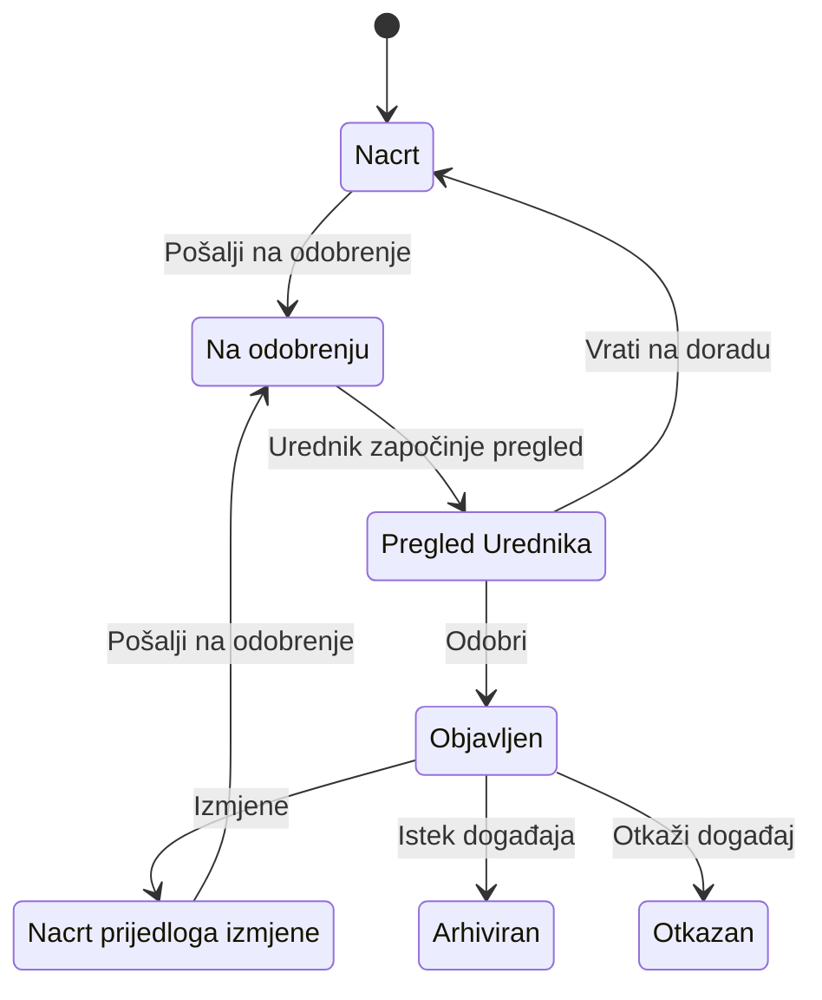

# Digital Kotor
# Functional Specification
## Modul: Kalendar kulture

**Status dokumenta:** U IZRADI
**Verzija:** 0.1

---

# Istorija verzija

| Verzija / PATCH | Datum | Opis |
|-----------------|--------|------|
| 0.1 | 2026-07-26 | Uspostavljena metodologija rada Functional Specification modula Kalendar kulture. Usvojene tačke FS-001 / 1. Svrha, FS-001 / 2. Korisnici, FS-001 / 3. Preduslovi i Platformsko pravilo. |
| PATCH-FS-001 | 2026-07-26 | Terminološka migracija usklađena sa Business Modelom (PATCH-023): Termin = datum i vrijeme; Održavanje događaja = jedno konkretno održavanje. Poslovna logika nije proširena. |

Napomena:

Ovo poglavlje služi isključivo za evidenciju razvoja dokumenta.

Kod svake naredne verzije dodaje se novi red u tabeli.

Ne mijenjaju se postojeći redovi.

Svaki PATCH dobija:

- jedinstvenu oznaku (PATCH-001, PATCH-002...),
- datum,
- kratak naziv,
- kratak opis izmjene.

Naziv PATCH-a predstavlja zvanični naziv izmjene i koristi se u istoriji verzija.

---

## Svrha dokumenta

Dokument predstavlja referentnu funkcionalnu specifikaciju za planiranje, razvoj, testiranje i održavanje sistema.

---

# Status razvoja Functional Specification

| Poglavlje | Status |
|-----------|--------|
| FS-001 – Javni portal – Početna stranica | U IZRADI |

---

# Pravila upravljanja Functional Specification

1. Functional Specification predstavlja zvaničnu funkcionalnu specifikaciju modula Kalendar kulture.

2. Posljednja usvojena verzija Functional Specification predstavlja jedini izvor istine (Single Source of Truth) za funkcionalne zahtjeve.

3. Poglavlja i tačke sa statusom Approved mijenjaju se isključivo kroz PATCH koji predstavlja novu usvojenu odluku ili usvojenu izmjenu dokumenta.

4. Kompletan Functional Specification generiše se isključivo na izričit zahtjev.

5. Cursor ima ulogu urednika verzionisanog dokumenta i ne smije samostalno prepisivati, preformulisati ili reorganizovati usvojeni sadržaj.

6. Ako postoji razlika između implementacije sistema i Functional Specification, implementacija se usklađuje sa Functional Specification, osim ako se odlukom ne izmijeni sama Functional Specification.

---

# Upravljanje promjenama

Svaka izmjena Functional Specification mora biti rezultat usvojene odluke i evidentirana kroz odgovarajući PATCH.

---

## Pravilo verifikacije implementacije

Prilikom analize postojeće implementacije cilj nije pronaći što veći broj potencijalnih izmjena, već utvrditi da li implementacija ispunjava poslovnu svrhu definisanu Business Modelom.

Change Request otvara se isključivo kada postoji jedan od sljedećih razloga:

1. Implementacija nije usklađena sa usvojenim Business Modelom.
2. Implementacija može dovesti korisnika do pogrešnog razumijevanja ili pogrešne upotrebe sistema.
3. Postoji funkcionalna, tehnička ili bezbjednosna greška koja zahtijeva izmjenu ponašanja sistema.

Ako postojeća implementacija ispunjava poslovnu svrhu i ne postoji nijedan od navedenih razloga, ponašanje se smatra prihvatljivim i dokumentuje se u Functional Specification bez otvaranja Change Request-a.

---

## Sadržaj

1. FS-001 – Javni portal – Početna stranica

---

# FS-001 – Javni portal – Početna stranica

## 1. Svrha

Početna stranica predstavlja osnovni pregled modula Kalendar kulture unutar platforme Digital Kotor. Korisnicima omogućava pregled objavljenih kulturnih događaja kroz statističke pokazatelje, mjesečni kalendar, naredne i istaknute događaje, kao i pristup newsletteru i kontaktnim informacijama.

**Status:** Approved

---

## 2. Korisnici

Početnoj stranici mogu pristupiti korisnici Kalendara kulture koji imaju registrovan, aktivan i verifikovan korisnički nalog na platformi Digital Kotor.

Osnovni sadržaj početne stranice dostupan je:

* korisnicima bez posebnih ovlašćenja u modulu;
* Organizatorima;
* Moderatorima;
* Urednicima Kalendara kulture;
* Administratoru platforme.

Pojedine navigacione i upravljačke akcije mogu se razlikovati u zavisnosti od ovlašćenja korisnika, ali se osnovni pregled objavljenih događaja ne mijenja.

**Status:** Approved

---

## 3. Preduslovi

Da bi korisnik mogao pristupiti početnoj stranici modula Kalendar kulture, moraju biti ispunjeni sljedeći preduslovi:

#### P-001

Korisnik ima registrovan, aktivan i verifikovan korisnički nalog na platformi Digital Kotor.

#### P-002

Korisnik je uspješno autentifikovan na platformi Digital Kotor.

#### P-003

Korisnik ima pravo pristupa modulu Kalendar kulture u skladu sa pravilima platforme Digital Kotor.

**Napomena:** Pravo pristupa modulu uređuje se na nivou platforme Digital Kotor i nije predmet ove funkcionalne specifikacije.

#### P-004

Modul Kalendar kulture je dostupan i operativan.

**Status:** Approved

---

## Platformsko pravilo

Svi korisnici Kalendara kulture moraju imati registrovan i aktivan korisnički nalog na platformi Digital Kotor.

Uloge Administrator platforme i Urednik Kalendara kulture dodjeljuju se kroz centralnu administraciju platforme Digital Kotor.

Status Organizatora dodjeljuje se i njime se upravlja unutar modula Kalendar kulture.

Moderator je zasebna poslovna uloga i nije isto što i Urednik. Moderator je operativni korisnik Organizatora. Status Moderatora dodjeljuje se i njime se upravlja unutar modula Kalendar kulture, u skladu sa Business Modelom.

Podnosilac zahtjeva „Postani organizator“, nakon odobrenja Urednika, automatski postaje prvi Moderator. Svakog narednog Moderatora predlaže postojeći Moderator; ovlašćenja dodjeljuje isključivo Urednik.

Funkcija „Postani organizator“ usvojena je u Business Modelu, ali trenutno još nije implementirana.

Urednička i moderatorska ovlašćenja ograničena su na modul Kalendar kulture i ne daju korisniku prava u drugim modulima platforme.

---

## 4. Poslovna pravila

### BR-001 – Prikaz samo objavljenih događaja

Na početnoj stranici prikazuju se isključivo događaji sa statusom **Objavljen (Published)**.

Događaji u statusima **Nacrt**, **Na odobrenju**, **Otkazan**, **Arhiviran** ili drugim internim statusima nisu vidljivi korisnicima na početnoj stranici.

---

### BR-002 – Jedinstven prikaz sadržaja

Svi korisnici kojima je dozvoljen pristup početnoj stranici vide isti skup objavljenih događaja.

Korisnička uloga ne utiče na sadržaj početne stranice, već isključivo na dostupne navigacione i upravljačke funkcije unutar sistema.

---

### BR-003 – Hronološka tačnost

Prikaz događaja mora biti zasnovan na podacima koji su evidentirani u sistemu.

Prilikom prikaza koriste se termini (datumi i vremena) održavanja događaja, bez ručnih izmjena ili prilagođavanja prilikom prikaza.

---

### BR-004 – Automatska ažurnost

Početna stranica automatski odražava trenutno stanje objavljenih događaja.

Nakon objave, izmjene ili isteka događaja, sadržaj početne stranice mora biti usklađen sa trenutnim stanjem podataka u sistemu.

---

### BR-005 – Istek događaja

Događaj kojem su završena sva održavanja više se ne prikazuje među aktivnim ili predstojećim događajima.

Arhiviranje događaja obavlja sistem u skladu sa pravilima modula Kalendar kulture.

**Status:** Approved

---

## 5. Funkcionalni opis

### 5.1 Hero sekcija

#### FR-001 – Prikaz Hero sekcije

Početna stranica prikazuje Hero sekciju kao uvodni dio modula Kalendar kulture.

Hero sekcija korisniku predstavlja naziv i osnovnu namjenu modula.

---

#### FR-002 – Statički sadržaj

Naslov, opis i ostali tekstualni elementi Hero sekcije prikazuju se u skladu sa sadržajem definisanim u aplikaciji.

Sadržaj Hero sekcije nije zavisan od korisničke uloge.

---

#### FR-003 – Jedinstven prikaz

Svim korisnicima koji imaju pristup početnoj stranici prikazuje se ista Hero sekcija.

Korisnička uloga ne utiče na sadržaj Hero sekcije.

---

#### FR-004 – Navigacione akcije

Ako Hero sekcija sadrži dugmad ili druge navigacione akcije, njihove destinacije i dostupnost određuju se u skladu sa postojećom implementacijom i ovlašćenjima korisnika.

Hero sekcija sama po sebi ne dodjeljuje niti mijenja korisnička ovlašćenja.

---

#### FR-005 – Pozicija na stranici

Hero sekcija prikazuje se na početku sadržaja početne stranice, prije statističkih pokazatelja, kalendara i pregleda događaja.

**Status:** Approved

---

### 5.2 Statistički pokazatelji

#### Poslovna odluka

Statistički prikaz treba da razlikuje:

* **Ukupan broj događaja** za posmatrani period (sedmica ili mjesec).
* **Predstojeće događaje**, odnosno sve objavljene događaje koji još nisu završeni.

Predstojeći događaji obuhvataju:

* događaje koji su trenutno u toku;
* događaje koji će se održati u budućnosti.

Završeni događaji ne ulaze u broj predstojećih događaja.

Napomena:

Ova odluka predstavlja usvojeno poslovno pravilo. Ako trenutna implementacija ne odgovara ovom ponašanju, potrebno je evidentirati Change Request prije izmjene koda.

**Status:** Approved

---

#### Statistički pokazatelji

Početna stranica Kalendara kulture prikazuje četiri statističke kartice:

##### 1. Danas

Prikazuje ukupan broj objavljenih događaja koji se održavaju na današnji datum.

---

##### 2. Ove sedmice

Prikazuje ukupan broj objavljenih događaja koji pripadaju tekućoj kalendarskoj sedmici (ponedjeljak–nedjelja), bez obzira da li su već održani ili tek slijede.

---

##### 3. Ovog mjeseca

Prikazuje ukupan broj objavljenih događaja koji pripadaju mjesecu koji je trenutno prikazan u kalendaru.

---

##### 4. Predstojeći događaji

Prikazuje ukupan broj objavljenih događaja koji još nisu završeni.

Predstojeći događaji uključuju:

* događaje koji su trenutno u toku;
* događaje koji će se održati u budućnosti.

Završeni događaji ne ulaze u ovaj pokazatelj.

---

#### Napomena

Trenutna implementacija nije u potpunosti usklađena sa ovim poslovnim pravilima.

Prije izmjene implementacije potrebno je otvoriti Change Request kojim će se uskladiti način izračunavanja statističkih pokazatelja sa usvojenom Functional Specification.

**Status:** Approved

---

### 5.3 Izbor perioda i pregled sadržaja

#### Poslovna odluka

Početna stranica Kalendara kulture:

* nema tekstualnu pretragu;
* nema filtriranje;
* nema sortiranje;
* nema naprednu pretragu.

Njena svrha je:

* pregled aktuelnih događaja;
* navigacija kroz vrijeme izborom mjeseca i dana.

Napredna pretraga i filtriranje nisu dio početne stranice.

**Status:** Approved

---

#### 5.3.1 Izbor mjeseca

Početna stranica omogućava izbor mjeseca koji se prikazuje u kalendaru.

Podrazumijevani mjesec je tekući kalendarski mjesec.

Korisnik može izabrati mjesec u opsegu od tekućeg kalendarskog mjeseca do mjeseca koji je najviše 12 mjeseci unaprijed.

Ako je vrijednost izbora mjeseca nevažeća ili van dozvoljenog opsega, sistem primjenjuje tekući kalendarski mjesec.

Izbor mjeseca utiče na:

* prikaz mjesečnog kalendara;
* pokazatelj „Ovog mjeseca“.

Izbor mjeseca ne utiče na pokazatelje „Danas“ i „Ove sedmice“, niti na sekciju istaknutih događaja.

---

#### 5.3.2 Izbor dana

Korisnik može izabrati dan iz prikazanog mjesečnog kalendara.

Za običnog korisnika:

* dan sa događajima je izaberiv;
* dan bez događaja nije izaberiv;
* nakon izbora dana, ispod kalendara prikazuje se lista događaja za taj dan;
* ako za izabrani dan nema događaja, prikazuje se odgovarajuća poruka o praznom stanju.

Za Urednika (u trenutnoj implementaciji uloga `kk_admin`):

* klik na dan ne otvara listu događaja na početnoj stranici;
* klik na dan vodi u tok kreiranja događaja sa unaprijed popunjenim datumom početka.

Uloga `kk_admin` odgovara Uredniku Kalendara kulture i **nije** uloga Moderatora.

Dok nije izabran dan, ispod kalendara prikazuje se sekcija narednih događaja.

---

#### 5.3.3 Uticaj izbora na sadržaj stranice

Izbor mjeseca utiče na:

* mjesečni kalendar;
* pokazatelj „Ovog mjeseca“.

Izbor dana utiče na:

* listu događaja ispod kalendara;
* zamjenu prikaza narednih događaja listom događaja za izabrani dan.

Izbor mjeseca i izbor dana ne utiču na:

* Hero sekciju;
* pokazatelj „Danas“;
* pokazatelj „Ove sedmice“;
* sekciju istaknutih događaja;
* newsletter formu;
* kontaktne informacije.

---

#### 5.3.4 URL i stanje stranice

Izabrani mjesec i izabrani dan prenose se kroz URL parametre početne stranice.

Nakon osvježavanja stranice zadržava se stanje izbora koje je sadržano u URL-u.

Link sa izabranim mjesecom i, po potrebi, izabranim danom može se dijeliti.

Browser Back i Forward vraćaju prethodno stanje stranice u skladu sa historijom URL-ova.

---

#### 5.3.5 Prazna stanja i nevažeći parametri

Kada je izabran dan za koji nema objavljenih događaja, sistem prikazuje poruku da nema događaja za odabrani datum.

Nevažeća vrijednost parametra mjeseca rezultuje primjenom tekućeg kalendarskog mjeseca.

Nevažeća vrijednost parametra dana rezultuje time da se lista događaja za dan ne prikazuje i da se zadržava podrazumijevani prikaz narednih događaja.

**Status:** Approved

---

### 5.4 Detalj događaja

Stranica detalja događaja omogućava korisniku pregled pojedinačnog objavljenog događaja sa osnovnim podacima potrebnim za informisanje o njegovom sadržaju, vremenu i mjestu održavanja.

**Status:** Approved

---

#### 5.4.1 Ulazak i pristup

Korisnik otvara detalj događaja izborom događaja sa:

* početne stranice Kalendara kulture;
* pregleda događaja;
* arhive događaja.

Sistem prikazuje detalj isključivo za objavljeni događaj.

Ako događaj ne postoji ili nije objavljen, sistem ga ne prikazuje korisniku i vraća stanje nedostupne stranice.

Pristup detalju događaja podliježe opštim pravilima pristupa modulu Kalendar kulture.

---

#### 5.4.2 Prikazane informacije

Sistem na detalju događaja prikazuje sljedeći skup informacija.

Obavezne informacije na prikazu:

* naslov događaja;
* naslovnu fotografiju;
* najmanje jedno održavanje sa terminom (datum i vrijeme);
* kategoriju.

Opcione informacije, koje se prikazuju samo kada su unesene:

* dodatna održavanja (ako događaj ima više održavanja);
* vrijeme unutar termina, kada je uneseno;
* lokaciju održavanja;
* opis događaja.

Ako opcioni podatak nije unesen, sistem ne prikazuje odgovarajući red ili prikazuje jasno prazno stanje, u skladu sa pravilima ovog poglavlja.

---

#### 5.4.3 Održavanja, termin i lokacija

Događaj ima jedno ili više održavanja. Svako održavanje ima termin (datum i vrijeme). Termin nije samostalan poslovni entitet.

Sistem na detalju događaja prikazuje sva javno objavljena održavanja sa njihovim terminima i, kada su unesene, lokacijama.

Za održavanje sa istim datumom početka i završetka sistem prikazuje taj datum.

Za održavanje čiji se datum početka i datum završetka razlikuju sistem prikazuje oba datuma u terminu.

Ako vrijeme nije uneseno u termin, sistem ne prikazuje informaciju o vremenu.

Ako je uneseno vrijeme početka, sistem ga prikazuje.

Ako su unesena vrijeme početka i vrijeme završetka, sistem prikazuje oba vremena.

Lokacija pripada održavanju i prikazuje se samo ako je unesena.

U V1 lokacija je tekstualni podatak.

Sistem ne prikazuje mapu niti obavezan GPS prikaz lokacije.

Napomena: Trenutna implementacija može čuvati datum, vrijeme i lokaciju direktno na događaju bez zasebnog modela održavanja. To je implementaciono odstupanje i evidentira se u Technical Overview-u; funkcionalni zahtjev ostaje usklađen sa Business Modelom.

---

#### 5.4.4 Fotografija događaja

Sistem prikazuje jednu naslovnu fotografiju događaja.

Ako Moderator ili Urednik ne postavi fotografiju događaja, sistem automatski prikazuje podrazumijevanu fotografiju povezanu sa kategorijom događaja.

Korisnik nikada ne vidi događaj bez naslovne fotografije.

Galerija fotografija nije dio V1 detalja događaja.

---

#### 5.4.5 Opis događaja

Sistem prikazuje puni opis događaja kada je opis unesen.

Ako opis nije unesen, sistem prikazuje jasno prazno stanje.

Sistem ne prikazuje tehničku grešku zbog odsustva opisa.

---

#### 5.4.6 Navigacija nazad

Korisnik može se vratiti na prethodni relevantni pregled unutar Kalendara kulture.

Sistem ne koristi spoljne ili nedozvoljene povratne putanje.

Ako prethodna dozvoljena putanja nije dostupna, korisnik se vraća na pregled događaja.

---

#### 5.4.7 Nedostupna i prazna stanja

Nedostupan događaj:

* ako događaj ne postoji, sistem vraća stanje nedostupne stranice;
* ako događaj nije objavljen, sistem vraća stanje nedostupne stranice.

Događaj koji postoji, ali nema neki opcioni podatak:

* ako opis nije unesen, sistem prikazuje jasno prazno stanje za opis;
* ako lokacija nije unesena, sistem ne prikazuje lokaciju;
* ako vrijeme nije uneseno u terminu, sistem ne prikazuje vrijeme;
* ako fotografija nije unesena, sistem prikazuje podrazumijevanu fotografiju kategorije događaja.

---

#### 5.4.8 Responzivni prikaz

Detalj događaja mora biti čitljiv na desktop, tablet i mobilnim uređajima.

Fotografija i sadržaj prilagođavaju raspored širini ekrana.

Nijedna ključna informacija ne smije postati nedostupna na manjem ekranu.

---

#### 5.4.9 Granice funkcionalnosti V1

Sljedeće funkcije i podaci nisu dio V1 detalja događaja:

* galerija fotografija;
* mapa;
* GPS prikaz;
* dijeljenje;
* štampanje kao posebna funkcija;
* dodavanje u lični kalendar;
* podaci o organizatoru;
* kontakt podaci;
* internet stranica;
* društvene mreže;
* dokumenti;
* cijena;
* rezervacije;
* oznake;
* posebni SEO podaci specifični za događaj.

Odsustvo navedenih funkcija nije greška niti automatski Change Request.

Proširenje ovog opsega sprovodi se kroz buduću poslovnu odluku i Change Request.

**Status:** Approved

---

### 5.5 Kreiranje i upravljanje događajem

Poglavlje opisuje ciljni funkcionalni model kreiranja i upravljanja događajem u modulu Kalendar kulture.

Poglavlje opisuje funkcionalnosti koje proizvod treba da ima nakon implementacije usvojenog poslovnog modela i ne opisuje privremena tehnička ograničenja trenutne implementacije.

U skladu sa Business Modelom: događaj ima jedno ili više održavanja; svako održavanje ima termin (datum i vrijeme) i može imati lokaciju, status i druga svojstva. Termin nije samostalan poslovni entitet.

**Status:** Approved

---

#### 5.5.1 Životni ciklus objavljenog događaja

Nakon što je događaj objavljen, Moderator može predložiti izmjene, ali one nisu odmah javno vidljive.

Sistem mora obezbijediti da javni portal uvijek prikazuje posljednju odobrenu verziju događaja.

Tok procesa:

1. Moderator uređuje objavljeni događaj.
2. Sistem čuva izmjene kao prijedlog.
3. Posljednja odobrena verzija ostaje javno vidljiva.
4. Urednik pregleda prijedlog izmjena.
5. Urednik može:

   * odobriti izmjene;
   * vratiti izmjene na doradu;
   * izvršiti dodatne uredničke izmjene prije odobravanja.
6. Nakon odobrenja nova verzija postaje javno vidljiva.
7. Ako se prijedlog vrati na doradu, javni portal nastavlja prikazivati posljednju odobrenu verziju.

**Status:** Approved

---

#### 5.5.2 Poslovna pravila životnog ciklusa objavljenog događaja

##### BR-006 – Javno vidljiva verzija događaja

Objavljen događaj uvijek prikazuje posljednju odobrenu verziju.

---

##### BR-007 – Opseg ovlašćenja Moderatora

Moderator može uređivati isključivo događaje svog Organizatora.

---

##### BR-008 – Odobravanje izmjena prije objave

Moderatorove izmjene nisu javno vidljive dok ih Urednik ne odobri.

---

##### BR-009 – Ovlašćenja Urednika nad prijedlogom izmjena

Urednik može:

* odobriti izmjene;
* vratiti izmjene na doradu;
* dopuniti ili ispraviti sadržaj prije odobravanja.

---

##### BR-010 – Zamjena verzije nakon odobrenja

Nakon odobrenja nova verzija zamjenjuje prethodnu verziju na javnom portalu.

---

##### BR-011 – Vraćanje izmjena na doradu

Ako izmjene budu vraćene na doradu, javni portal i dalje prikazuje posljednju odobrenu verziju.

---

##### BR-012 – Jedan aktivan prijedlog izmjena

U jednom trenutku može postojati samo jedan aktivan prijedlog izmjena za isti događaj.

Dok postoji aktivan prijedlog izmjena koji čeka odluku Urednika, nije moguće otvoriti novi prijedlog izmjena za isti događaj.

**Status:** Approved

---

#### 5.5.3 Kreiranje događaja

Tok procesa:

1. Moderator pokreće kreiranje novog događaja.
2. Sistem otvara obrazac za unos podataka.
3. Moderator unosi podatke o događaju, uključujući najmanje jedno održavanje sa terminom (datum i vrijeme), u skladu sa pravilima za slanje na odobrenje.
4. Moderator može:

   * sačuvati događaj kao nacrt;
   * poslati događaj na odobrenje.
5. Ako je događaj sačuvan kao nacrt:

   * nije javno vidljiv;
   * dostupan je Moderatorima Organizatora i Uredniku.
6. Ako je događaj poslat na odobrenje:

   * ulazi u urednički proces pregleda;
   * čeka odluku Urednika.

Napomena:

Ovo poglavlje opisuje ciljni poslovni model, a ne trenutnu implementaciju.

---

##### BR-013 – Opseg kreiranja događaja

Moderator može kreirati novi događaj isključivo za Organizatora kojem pripada.

---

##### BR-014 – Automatska evidencija pri kreiranju

Prilikom kreiranja događaja sistem automatski evidentira:

* datum i vrijeme kreiranja;
* korisnika koji je kreirao događaj;
* Organizatora kojem događaj pripada.

Navedene vrijednosti korisnik ne može ručno mijenjati.

---

##### BR-015 – Čuvanje nacrta

Sistem mora omogućiti čuvanje događaja kao nacrta u bilo kojem trenutku, bez slanja na odobrenje.

---

##### BR-016 – Vidljivost nacrta

Nacrt nije javno vidljiv.

Nacrt mogu pregledati isključivo:

* Moderatori Organizatora;
* Urednik.

---

##### BR-017 – Validacija prije slanja na odobrenje

Prije slanja događaja na odobrenje sistem mora provjeriti da li su popunjena sva obavezna polja, uključujući najmanje jedno održavanje sa terminom.

Ako validacija nije uspješna, slanje na odobrenje nije dozvoljeno.

---

##### BR-018 – Pripadnost događaja Organizatoru

Jedan događaj pripada tačno jednom Organizatoru.

Događaj nije moguće povezati sa više Organizatora.

Izuzetno, ako Organizator nije registrovan u sistemu, Urednik može kreirati i objaviti događaj bez registrovanog Organizatora, u skladu sa BR-045 i BR-052.

---

##### BR-019 – Napuštanje obrasca bez čuvanja

Ako Moderator napusti obrazac prije čuvanja događaja, nijedna izmjena se ne evidentira.

Sistem ne kreira automatske nacrte osim ako takva funkcionalnost bude uvedena u nekoj budućoj verziji.

---

##### BR-020 – Broj nacrta i odnos prema BR-012

Moderator može istovremeno imati neograničen broj nacrta događaja za svog Organizatora.

Ograničenje iz BR-012 odnosi se isključivo na aktivne prijedloge izmjena istog već objavljenog događaja i ne primjenjuje se na kreiranje novih događaja.

**Status:** Approved

---

#### 5.5.4 Uređivanje događaja

Poglavlje opisuje tri poslovna scenarija uređivanja događaja.

Napomena:

Ovo poglavlje opisuje ciljni poslovni model, a ne trenutnu implementaciju.

---

##### 5.5.4.1 Uređivanje nacrta

Moderator može neograničeno uređivati događaj koji se nalazi u statusu nacrta.

Može mijenjati sva polja događaja, uključujući:

* naslov;
* opis;
* kategoriju;
* održavanja događaja (termin, lokaciju i ostala svojstva održavanja);
* fotografije;
* ostale podatke definisane događajem.

Nacrt nije javno vidljiv.

---

##### 5.5.4.2 Uređivanje događaja koji čeka odobrenje

Nakon slanja događaja na odobrenje, Moderator može nastaviti uređivanje sve dok Urednik ne započne postupak pregleda.

Onog trenutka kada Urednik započne pregled prijedloga:

* sistem zaključava prijedlog za uređivanje;
* Moderator više ne može mijenjati sadržaj;
* zaključavanje traje do donošenja uredničke odluke.

Ako Urednik vrati događaj na doradu:

* zaključavanje se automatski uklanja;
* Moderator može nastaviti uređivanje;
* nakon izmjena ponovo šalje događaj na odobrenje.

---

##### 5.5.4.3 Uređivanje objavljenog događaja

Objavljen događaj se ne uređuje direktno.

Sve izmjene nastaju kao novi prijedlog izmjena.

Javni portal tokom cijelog procesa prikazuje posljednju odobrenu verziju događaja.

Nova verzija postaje javno vidljiva tek nakon odobrenja Urednika.

---

##### BR-021 – Uređivanje nacrta

Moderator može neograničeno uređivati događaj koji se nalazi u statusu nacrta.

---

##### BR-022 – Uređivanje dok traje čekanje odobrenja

Moderator može uređivati događaj koji čeka odobrenje sve dok Urednik ne započne postupak pregleda.

---

##### BR-023 – Zaključavanje prijedloga pri pokretanju pregleda

Pokretanjem uredničkog pregleda sistem automatski zaključava prijedlog događaja za uređivanje.

Zaključavanje traje do donošenja uredničke odluke.

---

##### BR-024 – Uklanjanje zaključavanja nakon vraćanja na doradu

Ako Urednik vrati događaj na doradu, zaključavanje se automatski uklanja i Moderator može nastaviti uređivanje.

---

##### BR-025 – Uređivanje objavljenog događaja

Objavljen događaj se ne uređuje direktno.

Sve izmjene evidentiraju se kao novi prijedlog izmjena u skladu sa pravilima BR-006 do BR-012.

---

##### BR-026 – Automatska evidencija izmjene

Svaka izmjena događaja automatski evidentira:

* datum i vrijeme posljednje izmjene;
* korisnika koji je izvršio izmjenu.

Ovi podaci služe za audit i nisu ručno izmjenjivi.

---

##### BR-027 – Odgovornost tokom uredničkog pregleda

Otvaranjem postupka uredničkog pregleda odgovornost za prijedlog privremeno prelazi sa Moderatora na Urednika.

Zaključavanje prijedloga sprečava paralelne izmjene tokom pregleda i obezbjeđuje da Urednik uvijek pregleda stabilnu verziju događaja.

**Status:** Approved

---

#### 5.5.5 Slanje na odobrenje

Tok procesa:

1. Moderator pokreće akciju **"Pošalji na odobrenje"**.
2. Sistem automatski provjerava:

   * obavezna polja;
   * poslovna pravila;
   * validnost unesenih podataka.
3. Ako validacija nije uspješna:

   * događaj ostaje u statusu nacrta;
   * prikazuju se greške;
   * slanje nije dozvoljeno.
4. Ako je validacija uspješna:

   * događaj prelazi u status **„Na odobrenju“**;
   * Moderator može nastaviti uređivanje događaja i po potrebi povući zahtjev za odobrenje sve dok Urednik ne započne postupak pregleda;
   * pokretanjem uredničkog pregleda primjenjuju se pravila zaključavanja definisana u BR-023;
   * Urednik dobija obavještenje da postoji novi prijedlog za pregled.

Napomena:

Ovo poglavlje opisuje ciljni poslovni model, a ne trenutnu implementaciju.

---

##### BR-028 – Uslovi za slanje na odobrenje

Moderator može poslati događaj na odobrenje samo ako su ispunjeni svi obavezni uslovi.

---

##### BR-029 – Validacija prije slanja

Prije slanja sistem automatski izvršava kompletnu validaciju događaja.

Ako validacija nije uspješna:

* događaj ostaje nacrt;
* prikazuju se greške;
* slanje nije dozvoljeno.

---

##### BR-030 – Prelazak u status „Na odobrenju“

Nakon uspješnog slanja događaj prelazi u status **"Na odobrenju"**.

---

##### BR-031 – Automatska evidencija slanja

Sistem automatski evidentira:

* datum i vrijeme slanja;
* Moderatora koji je poslao događaj na odobrenje.

Ovi podaci služe za audit i nisu ručno izmjenjivi.

---

##### BR-032 – Obavještavanje Urednika

Nakon uspješnog slanja sistem mora obavijestiti Urednika da postoji novi događaj koji čeka pregled.

Functional Specification definiše poslovnu obavezu obavještavanja.

Način isporuke obavještenja (e-mail, aplikacijska notifikacija, push i sl.) biće definisan u tehničkoj dokumentaciji ili tokom implementacije.

---

##### BR-033 – Povlačenje zahtjeva prije početka pregleda

Moderator može povući zahtjev za odobrenje isključivo dok Urednik nije započeo postupak pregleda.

Povlačenjem zahtjeva:

* događaj se vraća u status nacrta;
* uklanja se zaključavanje uređivanja;
* Moderator može nastaviti uređivanje.

---

##### BR-034 – Zabranjeno povlačenje nakon početka pregleda

Ako je Urednik već započeo pregled, zahtjev za odobrenje više nije moguće povući.

Dalji tok procesa određuje isključivo urednička odluka.

---

##### BR-035 – Interna napomena za Urednika

Prilikom slanja događaja na odobrenje Moderator može dodati internu napomenu namijenjenu Uredniku.

Interna napomena:

* nije javno vidljiva;
* nije dio sadržaja događaja;
* prikazuje se isključivo učesnicima uredničkog procesa;
* služi za internu komunikaciju između Moderatora i Urednika.

**Status:** Approved

---

#### 5.5.6 Pregled i odobravanje događaja

Tok procesa:

1. Događaj se nalazi u statusu **„Na odobrenju“**.
2. Urednik pokreće postupak pregleda.
3. Pokretanjem pregleda:

   * Urednik preuzima odgovornost za prijedlog;
   * sistem zaključava prijedlog u skladu sa BR-023;
   * Moderator više ne može uređivati prijedlog niti povući zahtjev.
4. Urednik pregleda sadržaj i može:

   * urediti prijedlog prije donošenja odluke;
   * odobriti prijedlog;
   * vratiti prijedlog na doradu.
5. Ako Urednik odobri prijedlog:

   * novi događaj postaje javno vidljiv;
   * kod izmjene objavljenog događaja nova odobrena verzija zamjenjuje prethodnu javnu verziju.
6. Ako Urednik vrati prijedlog na doradu:

   * obavezno unosi razlog vraćanja;
   * prijedlog se otključava;
   * Moderator ponovo preuzima odgovornost;
   * Moderator može nastaviti uređivanje i ponovo poslati prijedlog na odobrenje.
7. Sistem evidentira sve uredničke izmjene i odluke u auditu.

U V1 ne postoji trajno odbijanje prijedloga. Dozvoljene završne uredničke odluke su isključivo **odobri** i **vrati na doradu**. Status i akcija **„Odbijeno“ / „Odbij“** nisu dio V1.

Napomena:

Ovo poglavlje opisuje ciljni poslovni model, a ne trenutnu implementaciju.

---

##### BR-036 – Pregled događaja na odobrenju

Urednik može pregledati svaki događaj koji se nalazi u statusu **„Na odobrenju“**.

---

##### BR-037 – Preuzimanje odgovornosti i zaključavanje

Pokretanjem postupka pregleda Urednik preuzima odgovornost za prijedlog, a sistem primjenjuje zaključavanje definisano u BR-023.

Od tog trenutka Moderator ne može:

* uređivati prijedlog;
* povući zahtjev za odobrenje.

---

##### BR-038 – Uređivanje prijedloga tokom pregleda

Tokom pregleda Urednik može izmijeniti sadržaj prijedloga prije donošenja uredničke odluke.

Sve uredničke izmjene automatski se evidentiraju u auditu.

---

##### BR-039 – Odobravanje prijedloga

Urednik može odobriti prijedlog.

Ako se radi o:

* novom događaju — događaj postaje javno vidljiv;
* prijedlogu izmjene postojećeg događaja — nova odobrena verzija zamjenjuje prethodnu javno objavljenu verziju, u skladu sa BR-006 do BR-011.

---

##### BR-040 – Vraćanje na doradu

Urednik može vratiti prijedlog na doradu.

Prilikom vraćanja na doradu unos razloga vraćanja je obavezan.

---

##### BR-041 – Vidljivost razloga vraćanja

Razlog vraćanja na doradu:

* vidljiv je Moderatorima pripadajućeg Organizatora i Uredniku;
* predstavlja dio interne uredničke komunikacije;
* nije javno vidljiv;
* ne prikazuje se na javnom portalu.

---

##### BR-042 – Stanje nakon vraćanja na doradu

Nakon vraćanja prijedloga na doradu:

* zaključavanje se automatski uklanja;
* prijedlog se vraća u status **Nacrt**, u skladu sa postojećom terminologijom FS-a i Business Modelom (BM-ST-05);
* odgovornost se vraća Moderatoru;
* Moderator može nastaviti uređivanje i ponovo poslati prijedlog na odobrenje.

Ako se vraća prijedlog izmjene već objavljenog događaja, javni portal i dalje prikazuje posljednju odobrenu verziju, u skladu sa BR-006 i BR-011.

---

##### BR-043 – Audit uredničke odluke

Svaka urednička odluka automatski evidentira:

* Urednika koji je donio odluku;
* datum i vrijeme odluke;
* vrstu odluke.

Ovi audit podaci nisu ručno izmjenjivi.

---

##### BR-044 – Granice V1 uredničkih odluka

U V1 Urednik nema mogućnost trajnog odbijanja prijedloga.

Dozvoljene uredničke odluke su isključivo:

* odobravanje;
* vraćanje na doradu.

Ne uvoditi status **„Odbijeno“** niti akciju **„Odbij“**.

**Status:** Approved

---

#### 5.5.6a Dijagram uredničkog workflow-a

Objašnjenje:

* Dijagram predstavlja objedinjeni vizuelni prikaz već usvojenih poslovnih pravila iz poglavlja 5.5.1–5.5.6 (BR-006 do BR-044).
* Ne definiše nova poslovna pravila i ne mijenja postojeća.
* Služi lakšem razumijevanju kompletnog uredničkog workflow-a.
* Može predstavljati osnovu za buduću implementaciju state machine modela.

Napomena:

* Stanje **„Pregled Urednika“** predstavlja fazu zaključanog pregleda (BR-023, BR-037), a ne zaseban status događaja iz BM-ST-02.
* Stanje **„Nacrt prijedloga izmjene“** vizuelno prikazuje radni prijedlog izmjene objavljenog događaja (BR-025); javni portal tokom procesa zadržava posljednju odobrenu verziju (BR-006, BR-011).
* Prelaz **Odobri** → **Objavljen** za prijedlog izmjene znači da nova odobrena verzija postaje javna (BR-010, BR-039).
* Prelaz **Vrati na doradu** → **Nacrt** usklađen je sa BR-042 i BM-ST-05.

**Status:** Approved

---

### 5.6 Upravljanje organizatorima

#### Poslovna svrha

Organizator predstavlja pravno ili fizičko lice koje organizuje događaje.

Organizator:

* predstavlja vlasnika događaja;
* ima jedinstveni identitet u sistemu;
* može imati jednog ili više Moderatora;
* posjeduje istoriju svojih događaja;
* može biti aktivan ili deaktiviran.

Svi događaji vode se u ime Organizatora, osim u izuzetku kada Urednik kreira i objavljuje događaj bez registrovanog Organizatora radi javnog interesa i pravovremenog informisanja građana (BR-045, BR-052).

Organizator ne pristupa uredničkom portalu direktno.

Sve aktivnosti u ime Organizatora obavljaju njegovi Moderatori.

---

#### Poslovni tok

Tok procesa registracije Organizatora:

1. Registrovani korisnik podnosi zahtjev **„Postani organizator“** (iniciranje zahtjeva).
2. Urednik pregleda zahtjev (odobravanje zahtjeva).
3. Ako je zahtjev odobren:

   * kreira se Organizator;
   * podnosilac zahtjeva automatski postaje prvi Moderator tog Organizatora (dodjela ovlašćenja);
   * Organizator može naknadno imati dodatne Moderatore.

Tok procesa dodavanja narednog Moderatora:

1. Postojeći aktivni Moderator Organizatora podnosi zahtjev za novog Moderatora (iniciranje zahtjeva).
2. Moderator ne dodjeljuje ovlašćenja; samo podnosi zahtjev.
3. Urednik pregleda i odobrava ili odbija zahtjev (odobravanje zahtjeva).
4. Tek nakon odobrenja Urednik dodjeljuje pristup i ovlašćenja; novi Moderator postaje aktivan (dodjela ovlašćenja).

Napomena:

Ovo poglavlje opisuje ciljni poslovni model, a ne trenutnu implementaciju.

---

##### BR-045 – Pripadnost događaja Organizatoru

Svaki događaj mora biti povezan sa tačno jednim Organizatorom.

Izuzetno, ako Organizator nije registrovan u sistemu, Urednik može kreirati i objaviti događaj bez registrovanog Organizatora radi ostvarivanja javnog interesa i pravovremenog informisanja građana.

---

##### BR-046 – Broj događaja po Organizatoru

Jedan Organizator može imati neograničen broj događaja.

---

##### BR-047 – Moderatori Organizatora

Jedan Organizator može imati jednog ili više Moderatora.

Najmanje jedan Moderator mora biti aktivan dok je Organizator aktivan.

Podnosilac zahtjeva „Postani organizator“, nakon odobrenja Urednika, automatski postaje prvi Moderator tog Organizatora.

---

##### BR-048 – Pristup uredničkom portalu

Organizator nema mogućnost direktne prijave u urednički portal.

Pristup uredničkom portalu ostvaruju isključivo Moderatori i Urednici.

---

##### BR-049 – Brisanje i deaktivacija Organizatora

Brisanje Organizatora nije dozvoljeno ako postoje povezani događaji.

Organizator može biti deaktiviran, ali istorijski podaci i veze sa događajima moraju ostati sačuvani.

---

##### BR-050 – Deaktiviran Organizator

Deaktiviran Organizator:

* ne može kreirati nove događaje;
* ne može slati nove prijedloge niti izmjene;
* postojeći objavljeni događaji ostaju dostupni u skladu sa pravilima otkazivanja i arhiviranja.

---

##### BR-051 – Moderator za više Organizatora

U V1 jedan Moderator može biti povezan sa jednim ili više Organizatora.

Sistem mora jasno evidentirati za kojeg Organizatora Moderator u datom trenutku izvršava radnju, kako bi se obezbijedili ispravan audit, vlasništvo nad događajima i primjena poslovnih pravila.

Ne propisivati način izbora aktivnog Organizatora u ovom poglavlju; to će biti definisano u odgovarajućem funkcionalnom poglavlju.

---

##### BR-052 – Naknadno povezivanje sa Organizatorom

Ako je događaj kreiran bez registrovanog Organizatora, sistem mora omogućiti njegovo naknadno povezivanje sa Organizatorom kada isti bude registrovan.

Naknadno povezivanje:

* ne smije mijenjati audit;
* ne smije mijenjati istoriju događaja;
* ne smije uticati na javno objavljene verzije događaja;
* predstavlja administrativnu dopunu podataka.

---

##### BR-053 – Predlaganje narednog Moderatora

Svaki naredni Moderator može biti predložen isključivo od strane postojećeg aktivnog Moderatora povezanog sa tim Organizatorom.

Moderator ne dodjeljuje ovlašćenja.

Moderator samo podnosi zahtjev.

---

##### BR-054 – Dodjela ovlašćenja Moderatoru

Pristup i ovlašćenja novom Moderatoru dodjeljuje isključivo Urednik nakon pregleda i odobrenja zahtjeva.

Tek nakon odobrenja Urednika novi Moderator postaje aktivan.

---

##### BR-055 – Audit zahtjeva za Organizatora i Moderatore

Sistem trajno evidentira za zahtjeve „Postani organizator“ i zahtjeve za dodjelu ovlašćenja Moderatoru:

* ko je podnio zahtjev;
* datum i vrijeme podnošenja zahtjeva;
* ko je odobrio zahtjev;
* datum i vrijeme odobrenja.

Ovi podaci predstavljaju dio trajnog audita i nisu ručno izmjenjivi.

**Status:** Approved

---

## Change Log

| Datum | Izmjena |
|-------|---------|
| 2026-07-26 | Usvojene tačke: FS-001 / 1. Svrha; FS-001 / 2. Korisnici; FS-001 / 3. Preduslovi; Platformsko pravilo. |
| 2026-07-26 | FS-001 / 4. Poslovna pravila – Approved. |
| 2026-07-26 | FS-001 / 5.1 Hero sekcija – Approved. |
| 2026-07-26 | Usvojeno pravilo verifikacije implementacije i kriterijumi za otvaranje Change Request-a. |
| 2026-07-26 | FS-001 / 5.2 – Usvojena definicija statističkog pokazatelja „Predstojeći događaji“. |
| 2026-07-26 | FS-001 / 5.2 – Usvojena konačna struktura statističkih pokazatelja (četiri kartice). |
| 2026-07-26 | FS-001 / 5.3 Izbor perioda i pregled sadržaja – Approved. |
| 2026-07-26 | FS-001 / 5.4 Detalj događaja – Approved. |
| 2026-07-26 | Usklađivanje sa BM: Moderator kao zasebna uloga; napomena o neimplementiranoj funkciji „Postani organizator“; ispravka pravila naslovne fotografije (podrazumijevana fotografija kategorije); pojašnjenje da `kk_admin` odgovara Uredniku, a ne Moderatoru. |
| 2026-07-26 | FS-001 / 5.5 Kreiranje i upravljanje događajem – Approved. Usvojen životni ciklus objavljenog događaja (Moderator → prijedlog izmjena → odluka Urednika) i poslovna pravila BR-006–BR-012. |
| 2026-07-26 | FS-001 / 5.5.3 Kreiranje događaja – Approved. Usvojen tok kreiranja (nacrt / slanje na odobrenje) i poslovna pravila BR-013–BR-020. |
| 2026-07-26 | FS-001 / 5.5.4 Uređivanje događaja – Approved. Usvojena tri scenarija uređivanja (nacrt, na odobrenju, objavljen) i poslovna pravila BR-021–BR-027. |
| 2026-07-26 | FS-001 / 5.5.5 Slanje na odobrenje – Approved. Usvojen tok slanja, povlačenje zahtjeva, interna napomena i poslovna pravila BR-028–BR-035. |
| 2026-07-26 | Redakcijski usklađen tekst FS-001 / 5.5.5 sa BR-022, BR-023, BR-033 i BR-034; poslovni model i poslovna pravila nisu mijenjani. |
| 2026-07-26 | FS-001 / 5.5.6 Pregled i odobravanje događaja – Approved. Usvojen urednički tok (odobri / vrati na doradu) i poslovna pravila BR-036–BR-044; V1 bez trajnog odbijanja. |
| 2026-07-26 | Redakcijsko usklađivanje sa BR-044: iz BR-001 uklonjena referenca na status „Odbijen“; V1 model ne sadrži status niti akciju trajnog odbijanja. |
| 2026-07-26 | FS-001 / 5.5.6a – Dodat objedinjeni Mermaid dijagram uredničkog workflow-a radi lakšeg razumijevanja funkcionalnog modela; poslovna pravila nisu mijenjana. |
| 2026-07-26 | FS-001 / 5.6 Upravljanje organizatorima – Approved. Usvojen poslovni tok „Postani organizator“ i poslovna pravila BR-045–BR-051. |
| 2026-07-26 | Usklađivanje BM i FS sa izuzetkom za događaje bez registrovanog Organizatora (javni interes): izmijenjen BR-045, dodat BR-052, usklađen BR-018; proširenje poslovnog modela. |
| 2026-07-26 | Usklađivanje dokumentacije sa konačnim modelom upravljanja Moderatorima: prvi Moderator = podnosilac zahtjeva; naredne predlažu Moderatori; ovlašćenja dodjeljuje Urednik; BR-047/048 dopunjeni; dodati BR-053–BR-055 (audit). |
| 2026-07-26 | Terminološka migracija (usklađivanje sa BM PATCH-023): Termin = datum i vrijeme; Održavanje događaja = jedno konkretno održavanje. Usklađeni BR-003, BR-005, 5.4.2, 5.4.3, 5.5, 5.5.3, BR-017, 5.5.4.1. Poslovna logika nije proširena. |
