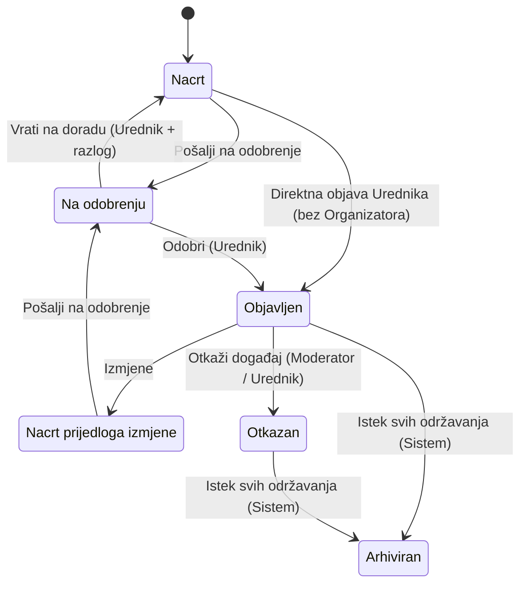

# Digital Kotor
# Functional Specification
## Modul: Kalendar kulture

**Status dokumenta:** Stable
**Verzija:** 1.0.0

---

# Istorija verzija

| Verzija / PATCH | Datum | Opis |
|-----------------|--------|------|
| 0.1 | 2026-07-26 | Uspostavljena metodologija rada Functional Specification modula Kalendar kulture. Usvojene tačke FS-001 / 1. Svrha, FS-001 / 2. Korisnici, FS-001 / 3. Preduslovi i Platformsko pravilo. |
| PATCH-FS-001 | 2026-07-26 | Terminološka migracija usklađena sa Business Modelom (PATCH-023): Termin = datum i vrijeme; Održavanje događaja = jedno konkretno održavanje. Poslovna logika nije proširena. |
| PATCH-FS-002 | 2026-07-26 | Usklađivanje sa BM PATCH-024: Datum održavanja je obavezan, a vrijeme može biti definisano. Usklađeni 5.4.2, 5.4.3, 5.5 i 5.5.3. |
| PATCH-FS-003 | 2026-07-26 | FS-001 / 5.7.1 Upravljanje terminima događaja – Approved. Usvojena poslovna pravila BR-056–BR-061. |
| PATCH-FS-004 | 2026-07-26 | FS-001 / 5.7.2 Upravljanje statusom događaja – Approved. Usvojena poslovna pravila BR-062–BR-066. |
| PATCH-FS-005 | 2026-07-26 | FS-001 / 5.7.3 Upravljanje statusom termina – Approved. Usvojena poslovna pravila BR-067–BR-069. |
| PATCH-FS-006 | 2026-07-26 | FS-001 / 5.8 Upravljanje moderatorima – Approved. Usvojena poslovna pravila BR-070–BR-073 (uklanjanje Moderatora). |
| PATCH-FS-007 | 2026-07-26 | FS-001 / 5.9 Upravljanje lokacijama – Approved. Usvojena poslovna pravila BR-074–BR-080. |
| PATCH-FS-008 | 2026-07-26 | FS-001 / 5.10 Upravljanje kategorijama i oznakama – Approved. Usvojena poslovna pravila BR-081–BR-085. |
| PATCH-FS-009 | 2026-07-26 | FS-001 / 5.11 Upravljanje medijima – Approved. Usvojena poslovna pravila BR-086–BR-091. |
| PATCH-FS-010 | 2026-07-26 | FS-001 / 5.12 Upravljanje manifestacijama – Approved. Usvojena poslovna pravila BR-092–BR-101. |
| PATCH-FS-011 | 2026-07-26 | FS-001 / 5.13 Javni portal — pregled, pretraga i prikaz – Approved. Usvojena poslovna pravila BR-102–BR-115. |
| PATCH-FS-012 | 2026-07-26 | FS-001 / 5.13 usklađen sa BM PATCH-025: BR-102–BR-115; uklonjeno sortiranje (BR-108); dodati BR-116 (javno objavljen sadržaj) i BR-117 (istaknuti događaj). |
| PATCH-FS-013 | 2026-07-26 | FS-001 / 5.14.1 Namjena i položaj Uredničkog portala – Approved. Usvojena poslovna pravila BR-118–BR-121. |
| PATCH-FS-014 | 2026-07-26 | FS-001 / 5.14.2 Korisnici, ovlašćenja i saradnja – Approved. Usvojena poslovna pravila BR-122–BR-125. |
| PATCH-FS-015 | 2026-07-26 | FS-001 / 5.14.3 Funkcionalni obuhvat Uredničkog portala – Approved. Usvojena poslovna pravila BR-126–BR-128. |
| PATCH-FS-016 | 2026-07-26 | FS-001 / 5.14: podpoglavlje 5.14.4 Primjena poslovnih pravila nije uvedeno. BM-EP-04, BM-EP-08 i BM-EP-10 već pokriveni BR-120, BR-121, BR-123 i BR-127; bez novih BR. Zadržana kontinuirana numeracija 5.14.1–5.14.3 i BR-001–BR-128. |
| PATCH-FS-017 | 2026-07-26 | Terminološko usklađivanje sa BM: „održavanje događaja“ = poslovni entitet; „termin" = isključivo datum i eventualno vrijeme. Usklađeni 5.7.1, 5.7.3, BR-056–BR-061, BR-065, BR-067–BR-069, BR-126, BR-127 i sadržaj. Poslovna logika nije mijenjana. |
| PATCH-FS-018 | 2026-07-26 | Terminološko usklađivanje: u jednom trenutku javni portal prikazuje jedan istaknuti događaj (usklađeno sa BM-PK-15 / BR-117). Ispravljeni množinski oblici u 1. Svrha i 5.3. |
| PATCH-FS-019 | 2026-07-26 | FS-001 / 5.4: oznake su dio V1 detalja događaja i prikazuju se na javnom portalu (usklađeno sa BM-KO-01, BM-PK-05, BM-PK-11, BR-106, BR-112). Uklonjena kontradikcija iz 5.4.9; dopunjen 5.4.2. |
| PATCH-FS-020 | 2026-07-26 | Metodološko usklađivanje hijerarhije dokumentacije: Business Model definiše poslovna pravila; Functional Specification razrađuje funkcionalne zahtjeve. Izmijenjen BR-121; dopunjena Pravila upravljanja Functional Specification. |
| PATCH-FS-021 | 2026-07-26 | Functional Specification je usklađen sa Business Model-om kroz definisanje funkcionalnog workflow-a statusa „Odgođen“ za održavanje događaja. Usklađeni BR-067 i BR-069; dodati BR-129–BR-131 (BM-TR-09, BM-TR-10, BM-TR-12–BM-TR-15). |
| PATCH-FS-022 | 2026-07-27 | Functional Specification usklađen sa Business Model-om kroz definisanje ovlašćenja za upravljanje statusima održavanja. Usklađen BR-061 (BM-TR-08); dodati BR-132–BR-134 (BM-TR-16–BM-TR-18). |
| PATCH-FS-023 | 2026-07-27 | FS-001 / 5.14.3: BR-126 dopunjen stavkom „pregled statusa entiteta“ radi potpunog prenosa BM-EP-03. |
| PATCH-FS-024 | 2026-07-27 | Usklađivanje sa BM PATCH-029: Organizator = poslovni entitet; zahtjev za kreiranje Organizatora sa predloženim Moderatorom; Urednik isključiva uloga; aktivni kontekst Organizatora (BR-047, BR-051, BR-132, BR-135–BR-137; Platformsko pravilo; 5.6). |
| PATCH-FS-025 | 2026-07-27 | BR-056 dopunjen potpunim prenosom BM-TR-02 (veza održavanja i događaja). |
| PATCH-FS-026 | 2026-07-27 | Prenos BM-ST-01: definicija životnog ciklusa događaja u 5.7.2; terminološko usklađivanje 5.5.1/5.5.2 (workflow izmjena umjesto „životni ciklus“). |
| PATCH-FS-027 | 2026-07-27 | Potpuni prenos BM-ST-03: početni status Nacrt; uređivanje nacrta sa/bez Organizatora (BR-013, BR-015, BR-021; 5.5.4.1). |
| PATCH-FS-028 | 2026-07-27 | Potpuni prenos BM-ST-04: direktna objava Urednika bez Organizatora kao jedini izuzetak od odobravanja (BR-018, BR-028, BR-045; dijagram 5.5.6a). |
| PATCH-FS-029 | 2026-07-27 | Prenos BM-ST-09: opšte pravilo promjene statusa događaja u uvodu §5.7.2. |
| PATCH-FS-030 | 2026-07-27 | §5.5.4.1 usklađen sa BR-021: uklonjena zastarjela rečenica o „drugim poslovnim pravilima“. |
| PATCH-FS-031 | 2026-07-27 | Potpuna funkcionalna specifikacija Newslettera (BM-13 / BM-NL-01–BM-NL-09 + V1 odluke): novo poglavlje 5.15, BR-138–BR-157. |
| PATCH-FS-032 | 2026-07-27 | Newsletter zasnovan na novoobjavljenim događajima (usklađeno sa BM PATCH-031): objavljivanje = okidač; periodična provjera; bez fiksnog sedmičnog perioda; BR-147–BR-153, BR-148, BR-149, BR-157 usklađeni; dodati BR-158–BR-159. |
| PATCH-FS-033 | 2026-07-27 | Newsletter: poslovno značajne promjene kao okidači (usklađeno sa BM PATCH-032); prioritetna obavještenja; publika = pretplatnici kojima je događaj već poslat; BR-138, BR-147–BR-150, BR-157–BR-159 usklađeni; dodati BR-160–BR-165. |
| PATCH-FS-034 | 2026-07-27 | Newsletter: višestruke poslovno značajne promjene → posljednje važeće stanje; objedinjavanje prioritetnih obavještenja uz blagovremenost; zabrana kontradiktornih poruka (usklađeno sa BM PATCH-033). Usklađeni BR-151, BR-163; dodati BR-166–BR-169. |
| PATCH-FS-035 | 2026-07-27 | Novo poglavlje 5.16 Evidencija aktivnosti (BM-14 / BM-AL-01–BM-AL-08): razgraničenje centralne evidencije i lokalnih tragova; kriterijum; V1 katalog (Organizatori, Moderator, događaji, Newsletter); granice V1. BR-170–BR-188. |
| PATCH-FS-036 | 2026-07-28 | Usklađivanje sa novom poslovnom odlukom deaktivacije Organizatora: Urednik može u bilo kojem trenutku deaktivirati Organizatora bez prethodnog zahtjeva Organizatora ili Moderatora. Usklađeni tok §5.6 i BR-049. |
| PATCH-FS-037 | 2026-07-28 | Ovlašćenja za otkazivanje i ponovnu objavu događaja (usklađeno sa BM PATCH-035 / N-DG-01): usklađeni BR-007, BR-063 i BR-064; dopunjen dijagram §5.5.6a. |
| PATCH-FS-038 | 2026-07-28 | Korekcija otkazivanja nakon deaktivacije Organizatora (usklađeno sa BM PATCH-036): usklađeni BR-007, BR-049, BR-050, BR-063 i napomene dijagrama §5.5.6a. |
| PATCH-FS-039 | 2026-07-29 | PO-DG-05: direktna objava Urednika isključivo bez Organizatora (usklađeni BR-018, BR-028; napomene §5.5.6a). PO-DG-06: Otkazan → Arhiviran nakon završetka svih održavanja (usklađeni BR-064, BR-065; dijagram §5.5.6a). Zatvoreni N-DG-05 i N-DG-06. |
| PATCH-FS-040 | 2026-07-29 | PO-MF-01–PO-MF-08: usklađivanje §5.12 (BR-092–BR-101) i dodavanje BR-189–BR-201; usklađeni BR-111 i BR-112 (izvedene kategorije/lokacije). |
| PATCH-FS-041 | 2026-07-29 | PO-MF-09–PO-MF-12: usklađeni BR-096–BR-098, BR-193, BR-201; dodati BR-202–BR-205; katalog Manifestacije u §5.16. Zatvoreni N-MF-01–N-MF-04; N-MF-05 evidentiran kao napomena. |
| PATCH-FS-042 | 2026-07-30 | PO-LOC-01–PO-LOC-07: potpuno usklađen §5.9 Upravljanje lokacijama (BR-074–BR-080) i dodata nova pravila BR-206–BR-223: centralni katalog kao jedini izvor istine, jedinstvenost i duplikati, ovlašćenja Moderator/Urednik/Admin platforme, lifecycle Aktivna/Deaktivirana, referencijalni integritet, atomski merge, audit i V1 granica (samo fizičke Lokacije). |
| PATCH-FS-043 | 2026-07-30 | Korekcija PO-LOC-01 i PO-LOC-05: centralni katalog Lokacija je opcioni katalog za ponovno korišćenje (nije obavezan i nije jedini izvor svih Lokacija); dozvoljen ručni unos naziva Lokacije; kataloška referenca opciona; merge i referencijalni integritet primjenjuju se kada postoji veza sa katalogom; potvrđeni BR-077 i opcionost Lokacije na Održavanju. Usklađeni BR-074, BR-075, BR-077, BR-078, BR-216, BR-217, BR-218, BR-219. |
| PATCH-FS-044 | 2026-07-30 | Documentation Consistency Patch (CR-003): terminološko pojašnjenje u §5.16 (BR-182) da ne postoji zaseban katalog Održavanja; aktivnosti nad Održavanjem evidentiraju se kroz katalog Događaji. Bez izmjene poslovnih pravila. |
| PATCH-FS-045 | 2026-07-30 | TS7-PO-01–TS7-PO-06: potpuno usklađen §5.10 Upravljanje kategorijama i oznakama (BR-081–BR-085) i dodata nova pravila BR-224–BR-236: poslovni katalog (ne ENUM), oznake u V1, lifecycle Aktivna/Neaktivna, bez migracije test podataka, bez kategorije „Nešto drugo“, ovlašćenja Urednik/Moderator/Organizator/Admin platforme. |
| PATCH-FS-046 | 2026-07-31 | TS8-01–TS8-09: potpuno usklađen §5.11 Upravljanje medijima (BR-086–BR-091) i dodata BR-237–BR-254; usklađeni §5.4.4 i BR-113 sa hijerarhijom prikaza i opsegom V1. |
| PATCH-FS-047 | 2026-07-31 | TS-009 faza 1 (IA-01, PO-TS9-03A, PO-TS9-04A, PO-TS9-05A, PO-TS9-05B; TD-TS9-01 u TS): evolutivni razvoj javnog portala; „Pretraga i pregled“; filteri; zadržavanje prikaza; lista vs kalendar. Usklađeni BR-104, BR-107–BR-109, §5.3, §5.4.1; dodati BR-255–BR-260. |
| PATCH-FS-048 | 2026-07-31 | TS-009 faza 2 (PO-TS9-06A–PO-TS9-06D): Hero statički identitet; istaknuti max 3; statistike 3 klikabilne kartice (treća = naziv izabranog mjeseca); lista ispod kalendara (naredni max 3 / dan; „Prikaži sve događaje“). Usklađeni §5.1–§5.3, BR-117; dodati BR-261–BR-264. |
| PATCH-FS-049 | 2026-07-31 | TS-009 faza 3 (PO-TS9-07A–PO-TS9-07E): Manifestacije na javnom portalu — navigacija, lista, detalj, program, veza ↔ Događaji. Usklađeni BR-105, BR-109, BR-192, §5.4; dodati BR-265–BR-269. |
| PATCH-FS-050 | 2026-07-31 | Formalno zatvaranje dokumenta: ažuriran Status razvoja (§1–§5.16 Approved); ispravljen Sadržaj/TOC; Platformsko pravilo — Status Approved; minimalno uklonjeno implementaciono curenje (`kk_admin`, ime rute, napomena o implementaciji). Bez novih BR i bez izmjene funkcionalnih/poslovnih pravila. Status dokumenta ostaje U IZRADI; verzija ostaje 0.1. |
| 0.5.0 | 2026-07-31 | Final Review. Završna dokumentaciona revizija: §1–§5.16 Approved; TOC i Platformsko pravilo usklađeni (PATCH-FS-050); BR-001…BR-269 neizmijenjeni; usvojene PO/IA odluke ugrađene; bez novih funkcionalnih pravila. Bez izmjene BM/TS/IS/Feature Registry/RG-001/implementacije. |
| 1.0.0 | 2026-08-01 | Stable. Functional Specification je uspješno prošao Final Review i predstavlja referentni funkcionalni dokument modula Kalendar kulture. Bez izmjene funkcionalnih pravila, numeracije, identifikatora ili sljedivosti. Bez izmjene BM/TS/IS/Feature Registry/RG-001/implementacije. |
| doc-CR-002 | 2026-08-01 | Dokumentaciona napomena §5.2: CR-001 Implemented; preostala klikabilnost treće kartice / `month` → CR-002 (IS-001 Faza 2). Bez novih BR. Bez izmjene implementacije. |
| doc-CR-002-impl | 2026-08-01 | Statusno usklađenje napomene §5.2: CR-002 Implemented (`c5d396f`; `month=YYYY-MM`). Bez novih BR. Bez izmjene funkcionalnih pravila. Verzija ostaje 1.0.0. |
| doc-CR-003 | 2026-08-01 | Dokumentaciona napomena uz BR-257: CR-003 Planned (filteri `q`/`category`/`location`; TS-009 §3.3; IS-001 §9.2.1; PO-CR3-01…08). Bez novih BR. Bez izmjene funkcionalnih pravila. Verzija ostaje 1.0.0. |
| doc-CR-003-impl | 2026-08-01 | Statusno usklađenje napomene uz BR-257: CR-003 Implemented (`595045a`; dokumentacija `fc35132`). Bez novih BR. Bez izmjene funkcionalnih pravila. Verzija ostaje 1.0.0. |
| doc-CR-004A | 2026-08-01 | Dokumentaciona napomena uz BR-114: CR-004A Planned (javni status badge; TS-009 §7.1; IS-001 §9.3.1; PO-CR4A-01…04). Bez novih BR. Bez izmjene funkcionalnih pravila. Verzija ostaje 1.0.0. |
| doc-CR-004A-impl | 2026-08-01 | Statusno usklađenje napomene uz BR-114: CR-004A Implemented (implementacija `0f73240`; dokumentaciona priprema `614706c`). Bez novih BR. Bez izmjene funkcionalnih pravila. Verzija ostaje 1.0.0. |
| PATCH-FS-051 | 2026-08-06 | CR-004B (javni prikaz otkazanih): usklađeni BR-001, BR-002, BR-004, BR-114, BR-116, BR-263; dodati/precizirani BR-270–BR-274 (portalna Arhiva ≠ archived; status ostaje cancelled); napomena doc-CR-004B. Bez izmjene BR-063 / BR-065. Bez javne dostupnosti archived. Bez izmjene implementacije. Verzija ostaje 1.0.0. |
| PATCH-FS-052 | 2026-08-06 | PO-N-TR-02-01–03 / BM PATCH-052: zatvaranje N-TR-02 — usklađeni BR-060 i BR-061 (generator dnevno/sedmično/mjesečno; završetak brojem ili krajnjim datumom; max 100; serija nije trajni objekat; ručna = generisana nakon generisanja). Bez novih BR identifikatora. Bez izmjene implementacije. Verzija ostaje 1.0.0. |
| PATCH-FS-053 | 2026-08-06 | Usklađivanje sa BM PATCH-053 / PO-DG-07: Otkazan terminalan (nema Otkazan → Objavljen); novi program = novi događaj; Odgođen = jedini mehanizam promjene termina; Otkazan = istorijski zapis (forma zaključana; izuzetak: razlog otkazivanja / napomena urednika). Usklađeni BR-007, BR-063, BR-064, BR-131, BR-182, BR-183; dijagram §5.5.6a; katalog §5.16. Bez izmjene BM/TS/Feature Registry/implementacije. Verzija ostaje 1.0.0. |
| PATCH-FS-054 | 2026-08-07 | PO-ORG-01–PO-ORG-04 / BM PATCH-054: katalog polja Organizatora V1 (BR-135); Moderator preko `user_id` (BR-275); kreiranje Org tek pri odobrenju; pristup portalu iz ovlašćenja bez nove platformske uloge (BR-276). ID-jevi BR-275/276 (ne BR-138/139 — ti su Newsletter). Bez izmjene implementacije. Verzija ostaje 1.0.0. |
| PATCH-FS-055 | 2026-08-08 | PO-AUTO-01 / PO-AUTO-02 / BM PATCH-055: otkazivanje Događaja automatski otkazuje Planirana i Odgođena Održavanja (BR-063, BR-064, BR-065); preciziran trenutak Planiran → Završen (BR-068). Bez novih BR identifikatora. Bez izmjene implementacije. Verzija ostaje 1.0.0. |
| PATCH-FS-056 | 2026-08-08 | PO-DG-08 / PO-DG-09 / BM PATCH-056: preciziran BR-052 (samo Objavljen + bez Org; jednosmjerno NULL → Aktivan Org; bez unlink/reassign); usklađen BR-018 (razdvajanje BR-045 / BR-052); statusna matrica uz BR-052. Bez novih BR identifikatora. Bez izmjene implementacije. Verzija ostaje 1.0.0. |
| PATCH-FS-057 | 2026-08-08 | PO-DG-10 / BM PATCH-057: pojednostavljeni V1 prvi Event review — usklađeni BR-022, BR-023, BR-033, BR-034, BR-037, BR-038 i tokovi §5.5.5–§5.5.6; Proposal tok neizmijenjen. Bez novih BR identifikatora. Bez izmjene implementacije. Verzija ostaje 1.0.0. |
| PATCH-FS-058 | 2026-08-08 | PO-N-TR-02-04 / BM PATCH-058: preciziran V1 generator Održavanja — BR-060/BR-061 (samo Nacrt; algoritmi; XOR; max 100; šablon; duplikati; atomičnost; bez preview/Proposal generatora). Bez novih BR identifikatora. Bez izmjene implementacije. Verzija ostaje 1.0.0. |
| PATCH-FS-059 | 2026-08-08 | **TS7-PO-07** / BM PATCH-059: konačni početni V1 katalog kategorija Događaja — dodati BR-277–BR-279; usklađen §5.10. Tehnički cutover legacy podataka ostaje TS-009. Bez izmjene implementacije. Verzija ostaje 1.0.0. |
| PATCH-FS-060 | 2026-08-09 | **Faza 6A** / BM PATCH-060: kartica multi-Održavanje; sistemsko sortiranje Pretrage; Odgođen na portalu; CAT-CUTOVER; V1 bez javnog `cancellation_reason`; potvrda PO-EV-01. Usklađeni BR-064, BR-110, BR-112, BR-272, BR-279; dodati BR-280–BR-284. Bez izmjene implementacije. Verzija ostaje 1.0.0. |
| PATCH-FS-061 | 2026-08-09 | **PO-6A11-01** / BM PATCH-061: kanonski javni status Događaja (multi-OCC) — dodat BR-285; usklađen BR-114. Bez izmjene lifecycle / arhive. Verzija ostaje 1.0.0. |
| PATCH-FS-062 | 2026-08-09 | **PO-6A09-01…06** / BM PATCH-062: Javna Arhiva vs interni Arhiviran — dodat BR-286; usklađeni BR-065, BR-066, BR-114, BR-274. Bez izmjene implementacije. Verzija ostaje 1.0.0. |
| PATCH-FS-063 | 2026-08-10 | **BM PATCH-063 / PO-U-01…19:** Urednički tok kreiranja, pripreme i neposrednog upravljanja Događajem. Usklađeni BR-013, BR-015, BR-016, BR-018, BR-021, BR-025, BR-028, BR-045, BR-063, BR-064, BR-067, BR-069, BR-130, BR-131, BR-272, BR-282, BR-284 i §5.5.3–§5.5.4 / §5.5.6a. Dodati BR-287–BR-295 (ručni Org; Sačuvaj i nastavi / U pripremi; brisanje prije objave; direktan edit Objavljenog; Odgođen bez novog termina; OCC/Entry razlozi opcion; Prvobitni termin; fail-closed). **Supersede:** dio BR-025 (samo Urednikov direktni tok); dio BR-284 / BR-064 / BR-063 / BR-272 (javni prikaz opcionog razloga). Moderator Nacrt/approval/Prijedlog ostaje. Bez izmjene BM/TS/Feature Registry/implementacije. Verzija ostaje 1.0.0. |
| PATCH-FS-064 | 2026-08-10 | **BM PATCH-064 / BM-PK-37 / PO-064:** Informativna naslovna vidljivost Odgođenog Događaja. Usklađeni BR-264, BR-280, BR-282, BR-285, BR-295; dodati BR-296–BR-297 (informativni režim; zajednički hronološki bazen „Naredni događaji“ max 3; ranking datum; jedan Događaj = jedan slot). Odgođeno ≠ Planirano/upcoming. Pretraga i detalj PATCH-063 neizmijenjeni. Bez izmjene BM/TS/Feature Registry/implementacije. Verzija ostaje 1.0.0. |
| PATCH-FS-065 | 2026-08-11 | **PO-6B-01…05 / 6B-DOC-01B:** dodat ugovor `tip` filtera (`Sve`/`Događaji`/`Manifestacije`) na „Pretrazi i pregledu“ sa fail-safe pravilom za nevalidan `tip`; korigovana semantika filtera po tipu sadržaja (PO-6B-04: event filteri dostupni samo za `tip=dogadjaji`); formalizovana MF `q` semantika (PO-6B-05: samo Naziv + Opis, partial/case-insensitive, bez derived pretrage kroz program); potvrđeno da MF nema sopstvenu/agregiranu lokaciju; definisana V1 javna vidljivost Arhivirane MF (van aktivne liste, dostupna preko direktnog URL-a) i potvrđeno da posebna lista „Arhiva Manifestacija“ nije V1 scope. Dodati BR-298–BR-303. Bez izmjene implementacije. Verzija ostaje 1.0.0. |
| PATCH-FS-066 | 2026-08-11 | **PO-6B-08 / PO-6B-09:** javna vidljivost Otkazane Manifestacije do isteka izvedenog perioda; Event→MF prikaz samo za javno dostupne MF (anti-leak); bez statusa MF na detalju Događaja; nezavisnost lifecycle-a. Usklađeni BR-266, BR-269; dodati BR-304–BR-305. Bez izmjene implementacije. Verzija ostaje 1.0.0. |
| PATCH-FS-067 | 2026-08-11 | **PO-6B-10:** globalno sortiranje Pretrage kada je Tip sadržaja = Sve — zajednički hronološki poredak Događaja i Manifestacija; NULL last; tie Naziv → tip (tehnički) → ID. Tip=Događaji zadržava BR-281; Tip=Manifestacije zadržava poredak aktivne MF liste. Dodat BR-306; usklađen BR-281. Bez izmjene PO-6B-01/04/05 semantike. Bez izmjene implementacije u ovom docs paketu. Verzija ostaje 1.0.0. |
| PATCH-FS-068 | 2026-08-11 | **PO-ORG-05 / BM PATCH-067:** napomena Urednika na zahtjevu za kreiranje Organizatora — approve opciono; reject obavezno (ne-prazno); fail-closed bez parcijalnog write-a. Usklađen BR-137; dodat BR-307. Verzija ostaje 1.0.0. |
| PATCH-FS-069 | 2026-08-11 | **PO-ORG-06 / BM PATCH-068:** privacy-safe Moderator invitation (ime+e-mail; waiting status; eligibility; resolver; neutral flash; emails; duplicates; REMOVE boundary). Usklađeni BR-053, BR-054, BR-135, BR-137, BR-275, BR-307; dodati BR-308–BR-320. Verzija ostaje 1.0.0. **Bez izmjene implementacije** (TARGET vs CURRENT). |
| PATCH-FS-070 | 2026-08-12 | **PO-MF-WF-01–04 / PO-EV-WF-01 / BM PATCH-070:** dva MF toka po porijeklu kreiranja. Usklađeni BR-100, BR-101, BR-190, BR-195, BR-196; dodati BR-321–BR-325. Event: potvrđen backend guard da Entry bez Organizatora ne koristi submit/approval (BR-018 KEEP). Bez novog DB statusa. Verzija ostaje 1.0.0. |
| PATCH-FS-071 | 2026-08-13 | **PO-ORG/MOD rejected request editor cleanup / BM PATCH-072:** Urednik može ukloniti odbijeni Org/Mod zahtjev iz redovne liste Zahtjevi (workspace dismiss). BR-055 / BR-073 retention KEEP. Dodati BR-326–BR-327. Verzija ostaje 1.0.0. |
| PATCH-FS-072 | 2026-08-14 | **PO-NL-01…PO-NL-22 / BM PATCH-073:** Newsletter pretplata, preference, odjava, reaktivacija, `User`/e-mail lifecycle, Manifestacija granica, testni legacy. Usklađeni tokovi §5.15 i BR-140–BR-142, BR-149–BR-150, BR-152, BR-154, BR-156, BR-157; dodati BR-328–BR-344. Verzija ostaje 1.0.0. Bez izmjene implementacije. |
| PATCH-FS-073 | 2026-08-14 | **NL-03 temporal eligibility + ledger boundary / BM PATCH-074:** prva pretplata i reaktivacija nijesu retroaktivne; candidate ≠ dostava; evidencija first_include samo nakon uspješne isporuke. Usklađeni tokovi §5.15 i BR-147, BR-148, BR-158, BR-334, BR-335, BR-341; dodati BR-345–BR-348. Verzija ostaje 1.0.0. Bez izmjene implementacije. |
| PATCH-FS-074 | 2026-08-14 | **F8-01 / TS-012 canonical freeze:** usklađen §5.16 katalog sa kasnijim usvojenim radnjama (PO-ORG-06 resolver; PO-AUTO-02 auto-finish OCC; PATCH-063 direktna izmjena objavljenog / brisanje nacrta; BR-184 Sistem). Eksplicitna isključenja (dismiss BR-326/327; invitation e-mail; kaskadno OCC; lokacije/kategorije/mediji; Newsletter ledger). Dodati BR-349–BR-350; usklađeni BR-177, BR-178, BR-182, BR-183, BR-184. Bez nove poslovne odluke. Bez izmjene BM. Verzija ostaje 1.0.0. Bez izmjene implementacije. |
| PATCH-FS-075 | 2026-08-15 | **MED-01–MED-28 / BM PATCH-075:** §5.11 preimenovan u Naslovna fotografija Događaja i Manifestacije. **SUPERSEDED:** BR-086–BR-091, BR-237–BR-254 (TS8 model). Dodati BR-351–BR-370. Usklađeni §5.4.4, BR-113, BR-197. TS-008 više nije aktivni FS SSOT. **PO ADOPTED / DOCS CANONICALIZED / IMPLEMENTATION PENDING.** Verzija ostaje 1.0.0. Bez izmjene koda. |
| PATCH-FS-076 | 2026-08-16 | **MED documentation closeout (status only):** MED-01–MED-28 = **PO ADOPTED / DOCS CANONICALIZED / IMPLEMENTATION COMPLETE / VERIFIED**. BR-351–BR-370 **KEEP**. BR-086–091 i BR-237–254 ostaju SUPERSEDED. **MED-I4B** = **DEFERRED / NON-BLOCKING PROJECT ASSET WORK**. Bez novih BR. Verzija ostaje 1.0.0. |

Napomena:

Ovo poglavlje služi isključivo za evidenciju razvoja dokumenta.

Kod svake naredne verzije dodaje se novi red u tabeli.

Ne mijenjaju se postojeći redovi.

Svaki PATCH dobija:

- jedinstvenu oznaku (PATCH-001, PATCH-002...),
- datum,
- kratak naziv,
- kratak opis izmjene.

Naziv PATCH-a predstavlja zvanični naziv izmjene i koristi se u istoriji verzija.

**Terminološka napomena (važeći pojam):** Istorijski zapisi (npr. PATCH-FS-003, Change Log) mogu koristiti raniji naziv „termini“ za upravljanje održavanjima. Važeći poslovni termin za tu cjelinu je **Održavanje** / **Održavanje događaja** (usklađeno sa Business Modelom). Istorijski redovi se ne mijenjaju.

---

## Svrha dokumenta

Dokument predstavlja referentnu funkcionalnu specifikaciju za planiranje, razvoj, testiranje i održavanje sistema.

---

# Status razvoja Functional Specification

| Poglavlje | Status |
|-----------|--------|
| FS-001 – §1 Svrha | Approved |
| FS-001 – §2 Korisnici | Approved |
| FS-001 – §3 Preduslovi | Approved |
| FS-001 – Platformsko pravilo | Approved |
| FS-001 – §4 Poslovna pravila | Approved |
| FS-001 – §5.1 Hero sekcija | Approved |
| FS-001 – §5.2 Statistički pokazatelji | Approved |
| FS-001 – §5.3 Izbor perioda i pregled sadržaja | Approved |
| FS-001 – §5.4 Detalj događaja | Approved |
| FS-001 – §5.5 Kreiranje i upravljanje događajem | Approved |
| FS-001 – §5.6 Upravljanje organizatorima | Approved |
| FS-001 – §5.7 Upravljanje održavanjima i statusima | Approved |
| FS-001 – §5.8 Upravljanje moderatorima | Approved |
| FS-001 – §5.9 Upravljanje lokacijama | Approved |
| FS-001 – §5.10 Upravljanje kategorijama i oznakama | Approved |
| FS-001 – §5.11 Naslovna fotografija Događaja i Manifestacije (istorijski: Upravljanje medijima) | Approved — kanonski PATCH-FS-075 / MED; TS8 BR SUPERSEDED |
| FS-001 – §5.12 Upravljanje manifestacijama | Approved |
| FS-001 – §5.13 Javni portal — pregled, pretraga i prikaz | Approved |
| FS-001 – §5.14 Urednički portal | Approved |
| FS-001 – §5.15 Newsletter | Approved |
| FS-001 – §5.16 Evidencija aktivnosti | Approved |

---

# Pravila upravljanja Functional Specification

1. Functional Specification predstavlja zvaničnu funkcionalnu specifikaciju modula Kalendar kulture.

2. Business Model je jedini izvor poslovnih pravila (Single Source of Truth za poslovni model). Functional Specification razrađuje i opisuje funkcionalne zahtjeve koji proizlaze iz Business Model-a. Functional Specification ne mijenja, ne proširuje niti redefiniše poslovna pravila Business Model-a. Implementacija mora biti usklađena sa Functional Specification-om, a Functional Specification mora biti usklađena sa Business Model-om.

3. Posljednja usvojena verzija Functional Specification predstavlja jedini izvor istine (Single Source of Truth) za funkcionalne zahtjeve.

4. Poglavlja i tačke sa statusom Approved mijenjaju se isključivo kroz PATCH koji predstavlja novu usvojenu odluku ili usvojenu izmjenu dokumenta.

5. Kompletan Functional Specification generiše se isključivo na izričit zahtjev.

6. Cursor ima ulogu urednika verzionisanog dokumenta i ne smije samostalno prepisivati, preformulisati ili reorganizovati usvojeni sadržaj.

7. Ako postoji razlika između implementacije sistema i Functional Specification, implementacija se usklađuje sa Functional Specification, osim ako se odlukom ne izmijeni sama Functional Specification.

---

# Upravljanje promjenama

Svaka izmjena Functional Specification mora biti rezultat usvojene odluke i evidentirana kroz odgovarajući PATCH.

---

## Pravilo verifikacije implementacije

Prilikom analize postojeće implementacije cilj nije pronaći što veći broj potencijalnih izmjena, već utvrditi da li implementacija ispunjava poslovnu svrhu definisanu Business Modelom.

Change Request otvara se isključivo kada postoji jedan od sljedećih razloga:

1. Implementacija nije usklađena sa usvojenim Business Modelom.
2. Implementacija može dovesti korisnika do pogrešnog razumijevanja ili pogrešne upotrebe sistema.
3. Postoji funkcionalna, tehnička ili bezbjednosna greška koja zahtijeva izmjenu ponašanja sistema.

Ako postojeća implementacija ispunjava poslovnu svrhu i ne postoji nijedan od navedenih razloga, ponašanje se smatra prihvatljivim i dokumentuje se u Functional Specification bez otvaranja Change Request-a.

---

## Sadržaj

1. FS-001 – Functional Specification (Modul: Kalendar kulture)
   - 1. Svrha
   - 2. Korisnici
   - 3. Preduslovi
   - Platformsko pravilo
   - 4. Poslovna pravila (BR-001–BR-005 i dalje po poglavljima)
   - 5.1 Hero sekcija
   - 5.2 Statistički pokazatelji
   - 5.3 Izbor perioda i pregled sadržaja
   - 5.4 Detalj događaja
   - 5.5 Kreiranje i upravljanje događajem
   - 5.6 Upravljanje organizatorima (BR-045–BR-055, BR-135–BR-137, BR-275–BR-276, BR-307–BR-320, BR-326)
   - 5.7.1 Upravljanje održavanjima događaja (BR-056–BR-061)
   - 5.7.2 Upravljanje statusom događaja (BR-062–BR-066)
   - 5.7.3 Upravljanje statusom održavanja (BR-067–BR-069, BR-129–BR-134)
   - 5.8 Upravljanje moderatorima (BR-070–BR-073, BR-327)
   - 5.9 Upravljanje lokacijama (BR-074–BR-080, BR-206–BR-223)
   - 5.10 Upravljanje kategorijama i oznakama (BR-081–BR-085, BR-224–BR-236, BR-277–BR-279)
   - 5.11 Naslovna fotografija Događaja i Manifestacije (BR-351–BR-370; istorijski BR-086–BR-091, BR-237–BR-254 SUPERSEDED)
   - 5.12 Upravljanje manifestacijama (BR-092–BR-101, BR-189–BR-205, BR-321–BR-325)
   - 5.13 Javni portal — pregled, pretraga i prikaz (BR-102–BR-117, BR-255–BR-274, BR-280–BR-286, BR-296–BR-306)
   - 5.14.1 Namjena i položaj Uredničkog portala (BR-118–BR-121)
   - 5.14.2 Korisnici, ovlašćenja i saradnja (BR-122–BR-125)
   - 5.14.3 Funkcionalni obuhvat Uredničkog portala (BR-126–BR-128)
   - 5.15 Newsletter (BR-138–BR-169, BR-328–BR-344)
   - 5.16 Evidencija aktivnosti (BR-170–BR-188, BR-349–BR-350, katalog Manifestacije; PATCH-FS-074 freeze)
2. Istorija verzija (zaglavlje dokumenta)
3. Change Log

---

# FS-001 – Functional Specification (Modul: Kalendar kulture)

## 1. Svrha

Početna stranica predstavlja osnovni pregled modula Kalendar kulture unutar platforme Digital Kotor. Korisnicima omogućava pregled objavljenih kulturnih događaja kroz statističke pokazatelje, mjesečni kalendar, listu ispod kalendara (naredni događaji ili događaji za izabrani dan) i istaknute događaje, kontaktne informacije, te pristup funkcionalnosti Newslettera u skladu sa poglavljem 5.15.

**Status:** Approved

---

## 2. Korisnici

Početnoj stranici mogu pristupiti korisnici Kalendara kulture koji imaju registrovan, aktivan i verifikovan korisnički nalog na platformi Digital Kotor.

Osnovni sadržaj početne stranice dostupan je:

* običnim registrovanim korisnicima bez posebnih ovlašćenja u modulu;
* Moderatorima;
* Urednicima Kalendara kulture;
* Administratoru platforme.

Organizator nije korisnik niti korisnička uloga i ne navodi se među korisnicima koji pristupaju stranici.

Pojedine navigacione i upravljačke akcije mogu se razlikovati u zavisnosti od ovlašćenja korisnika, ali se osnovni pregled objavljenih događaja ne mijenja.

**Status:** Approved

---

## 3. Preduslovi

Da bi korisnik mogao pristupiti početnoj stranici modula Kalendar kulture, moraju biti ispunjeni sljedeći preduslovi:

#### P-001

Korisnik ima registrovan, aktivan i verifikovan korisnički nalog na platformi Digital Kotor.

#### P-002

Korisnik je uspješno autentifikovan na platformi Digital Kotor.

#### P-003

Korisnik ima pravo pristupa modulu Kalendar kulture u skladu sa pravilima platforme Digital Kotor.

**Napomena:** Pravo pristupa modulu uređuje se na nivou platforme Digital Kotor i nije predmet ove funkcionalne specifikacije.

#### P-004

Modul Kalendar kulture je dostupan i operativan.

**Status:** Approved

---

## Platformsko pravilo

Svi korisnici Kalendara kulture moraju imati registrovan i aktivan korisnički nalog na platformi Digital Kotor.

Uloge Administrator platforme i Urednik Kalendara kulture dodjeljuju se kroz centralnu administraciju platforme Digital Kotor.

Organizator je poslovni entitet i nosilac sadržaja. Organizator nije korisnik sistema i nije korisnička uloga. Entitet Organizatora kreira se i njime se upravlja unutar modula Kalendar kulture.

Moderator je zasebna poslovna uloga registrovanog korisnika i nije isto što i Urednik. Moderator izvršava radnje u ime konkretnog Organizatora. Status Moderatora dodjeljuje se i njime se upravlja unutar modula Kalendar kulture, u skladu sa Business Modelom.

Urednik je isključiva administrativna uloga Uredničkog portala. Urednik nije Organizator, nije Moderator i ne kombinuje ulogu Urednika sa statusom običnog registrovanog korisnika u poslovnom modelu Kalendara kulture. Urednik uvijek postupa kao Urednik i ne mijenja aktivnu poslovnu ulogu.

Zahtjev za kreiranje Organizatora podnosi registrovani korisnik. Podnošenjem zahtjeva korisnik ne postaje Organizator niti Moderator. Nakon odobrenja Urednika, predloženi korisnik dobija ovlašćenje početnog Moderatora. Svakog narednog Moderatora predlaže postojeći Moderator; ovlašćenja dodjeljuje isključivo Urednik.

Funkcionalnost zahtjeva za kreiranje Organizatora usvojena je u Business Modelu i razrađena u ovoj specifikaciji. (Raniji naziv „Postani organizator“ zamijenjen je poslovno preciznijim nazivom.)

Urednička i moderatorska ovlašćenja ograničena su na modul Kalendar kulture i ne daju korisniku prava u drugim modulima platforme.

Administrator platforme pripada sistemskoj administraciji i nije običan registrovani korisnik, Organizator, Moderator ni Urednik.

**Status:** Approved

---

## 4. Poslovna pravila

### BR-001 – Prikaz javno dostupnih događaja na početnoj

Na početnoj stranici prikazuju se javno dostupni događaji u skladu sa BR-270: objavljeni (`published`) i otkazani (`cancelled`).

Događaji u statusima **Nacrt**, **Na odobrenju** i drugim statusima koji nisu dio javnog skupa dostupnosti nisu vidljivi korisnicima na početnoj stranici.

Sekcija Istaknutih događaja isključuje otkazane događaje iz javnog prikaza (BR-271), bez izmjene flaga isticanja.

---

### BR-002 – Jedinstven prikaz sadržaja

Svi korisnici kojima je dozvoljen pristup početnoj stranici vide isti skup javno dostupnih događaja, u skladu sa BR-001 i BR-270.

Korisnička uloga ne utiče na sadržaj početne stranice, već isključivo na dostupne navigacione i upravljačke funkcije unutar sistema.

---

### BR-003 – Hronološka tačnost

Prikaz događaja mora biti zasnovan na podacima koji su evidentirani u sistemu.

Prilikom prikaza koriste se termini (datumi i vremena) održavanja događaja, bez ručnih izmjena ili prilagođavanja prilikom prikaza.

---

### BR-004 – Automatska ažurnost

Početna stranica automatski odražava trenutno stanje javno dostupnih događaja (BR-001 / BR-270).

Nakon objave, izmjene, otkazivanja ili isteka događaja, sadržaj početne stranice mora biti usklađen sa trenutnim stanjem podataka u sistemu.

---

### BR-005 – Istek događaja

Događaj kojem su završena sva održavanja više se ne prikazuje među aktivnim ili predstojećim događajima.

Arhiviranje događaja obavlja sistem u skladu sa pravilima modula Kalendar kulture.

**Status:** Approved

---

## 5. Funkcionalni opis

### 5.1 Hero sekcija

#### FR-001 – Prikaz Hero sekcije

Početna stranica prikazuje Hero sekciju kao uvodni dio modula Kalendar kulture.

Hero sekcija je sastavni dio početne stranice i služi isključivo kao identitet modula Kalendara kulture (PO-TS9-06A / BR-261).

---

#### FR-002 – Statički sadržaj

Hero sekcija je statička.

Hero zadržava postojeći vizuelni identitet.

Hero nije uređiv iz administracije i ne koristi podatke iz baze.

Hero nema promotivne poruke, rotaciju sadržaja ni video sadržaj.

Sadržaj Hero sekcije nije zavisan od korisničke uloge.

---

#### FR-003 – Jedinstven prikaz

Svim korisnicima koji imaju pristup početnoj stranici prikazuje se ista Hero sekcija.

Korisnička uloga ne utiče na sadržaj Hero sekcije.

---

#### FR-004 – Bez navigacionih CTA

Hero sekcija nema CTA dugmadi niti drugih navigacionih akcija.

Hero sekcija sama po sebi ne dodjeljuje niti mijenja korisnička ovlašćenja.

---

#### FR-005 – Pozicija na stranici

Hero sekcija prikazuje se na početku sadržaja početne stranice, prije statističkih pokazatelja, kalendara i pregleda događaja.

**Status:** Approved

---

### 5.2 Statistički pokazatelji

#### Poslovna odluka

Statistički prikaz na početnoj stranici obuhvata tri kartice (PO-TS9-06C / BR-263):

* **Danas**
* **Ove sedmice**
* **Izabrani mjesec** — treća kartica prikazuje naziv trenutno izabranog mjeseca u kalendaru (ne fiksni naziv „Ovog mjeseca“).

Statistike prikazuju javno dostupne događaje (`published` | `cancelled`) u odgovarajućem vremenskom skupu, u skladu sa BR-270 i CR-004B.

Sve tri kartice su klikabilne. Klik vodi na stranicu „Pretraga i pregled“ sa odgovarajućim aktivnim datumskim filterom. Ako je vrijednost 0, kartica ostaje klikabilna.

Statistike ostaju na postojećem mjestu na početnoj stranici.

Napomena:

Ova odluka predstavlja usvojeno poslovno pravilo. Ako trenutna implementacija ne odgovara ovom ponašanju, potrebno je evidentirati Change Request prije izmjene koda.

**Status:** Approved

---

#### Statistički pokazatelji

Početna stranica Kalendara kulture prikazuje tri statističke kartice:

##### 1. Danas

Prikazuje broj javno dostupnih događaja (`published` | `cancelled`) koji se odnose na današnji datum, u skladu sa pravilima izračuna usvojenim za ovaj pokazatelj.

Klik otvara „Pretragu i pregled“ sa datumskim filterom za današnji dan.

---

##### 2. Ove sedmice

Prikazuje broj javno dostupnih događaja (`published` | `cancelled`) koji pripadaju tekućoj kalendarskoj sedmici, u skladu sa pravilima izračuna usvojenim za ovaj pokazatelj.

Klik otvara „Pretragu i pregled“ sa odgovarajućim datumskim filterom za tekuću sedmicu.

---

##### 3. Izabrani mjesec

Kartica prikazuje **naziv** mjeseca koji je trenutno izabran u kalendaru na početnoj stranici.

Prikazuje broj javno dostupnih događaja (`published` | `cancelled`) koji pripadaju tom mjesecu, u skladu sa pravilima izračuna usvojenim za ovaj pokazatelj.

Klik otvara „Pretragu i pregled“ sa odgovarajućim datumskim filterom za taj mjesec.

---

#### Napomena

CR-001 (IS-001 Faza 1; Implemented) uskladio je terminologiju, Hero, istaknute, kartice Danas/Ove sedmice, label treće kartice, listu ispod kalendara i „Prikaži sve događaje“.

CR-002 (IS-001 Faza 2; Implemented, commit `c5d396f`) implementirao je klikabilnu treću statističku karticu (Izabrani mjesec) sa mjesečnim filterom `month=YYYY-MM` na stranici „Pretraga i pregled“ (TS-009 §3.2).

**Status:** Approved

---

### 5.3 Izbor perioda i pregled sadržaja

#### Poslovna odluka

Početna stranica Kalendara kulture:

* nema tekstualnu pretragu;
* nema filtriranje;
* nema sortiranje;
* nema naprednu pretragu.

Njena svrha je:

* pregled aktuelnih događaja;
* navigacija kroz vrijeme izborom mjeseca i dana.

Napredna pretraga i filtriranje nisu dio početne stranice.

Centralno mjesto za pretragu i pregled događaja, uključujući filtere, je stranica „Pretraga i pregled“ (§5.13, BR-256–BR-257).

Mjesečni kalendar ostaje isključivo na početnoj stranici (BR-259).

Lista ispod kalendara uređena je pravilom BR-264 (PO-TS9-06D).

**Status:** Approved

---

#### 5.3.1 Izbor mjeseca

Početna stranica omogućava izbor mjeseca koji se prikazuje u kalendaru.

Podrazumijevani mjesec je tekući kalendarski mjesec.

Korisnik može izabrati mjesec u opsegu od tekućeg kalendarskog mjeseca do mjeseca koji je najviše 12 mjeseci unaprijed.

Ako je vrijednost izbora mjeseca nevažeća ili van dozvoljenog opsega, sistem primjenjuje tekući kalendarski mjesec.

Izbor mjeseca utiče na:

* prikaz mjesečnog kalendara;
* treću statističku karticu (naziv i broj za izabrani mjesec).

Izbor mjeseca ne utiče na pokazatelje „Danas“ i „Ove sedmice“, niti na sekciju istaknutih događaja.

---

#### 5.3.2 Izbor dana

Korisnik može izabrati dan iz prikazanog mjesečnog kalendara.

Za običnog korisnika:

* dan sa događajima je izaberiv;
* dan bez događaja nije izaberiv;
* nakon izbora dana, ispod kalendara prikazuje se lista „Događaji za izabrani datum“ (svi događaji za taj dan);
* ako za izabrani dan nema događaja, prikazuje se postojeća poruka o praznom stanju.

Za Urednika:

* klik na dan ne otvara listu događaja na početnoj stranici;
* klik na dan vodi u tok kreiranja događaja sa unaprijed popunjenim datumom početka.

Urednik Kalendara kulture **nije** Moderator; ove dvije uloge su poslovno razdvojene.

Dok nije izabran dan, ispod kalendara prikazuje se sekcija „Naredni događaji" — najviše tri (3) Događaja iz zajedničkog hronološkog bazena Planiranih i informativno Odgođenih kandidata (BR-264 / BR-297).

Na kraju liste (u oba režima) prikazuje se dugme „Prikaži sve događaje“ (BR-264).

---

#### 5.3.3 Uticaj izbora na sadržaj stranice

Izbor mjeseca utiče na:

* mjesečni kalendar;
* treću statističku karticu (izabrani mjesec).

Izbor dana utiče na:

* listu događaja ispod kalendara;
* zamjenu prikaza narednih događaja listom događaja za izabrani dan;
* cilj dugmeta „Prikaži sve događaje“ (sa ili bez datumskog filtera).

Izbor mjeseca i izbor dana ne utiču na:

* Hero sekciju;
* pokazatelj „Danas“;
* pokazatelj „Ove sedmice“;
* sekciju istaknutih događaja;
* pristup podešavanjima Newslettera (poglavlje 5.15);
* kontaktne informacije.

---

#### 5.3.4 URL i stanje stranice

Izabrani mjesec i izabrani dan prenose se kroz URL parametre početne stranice.

Nakon osvježavanja stranice zadržava se stanje izbora koje je sadržano u URL-u.

Link sa izabranim mjesecom i, po potrebi, izabranim danom može se dijeliti.

Browser Back i Forward vraćaju prethodno stanje stranice u skladu sa historijom URL-ova.

---

#### 5.3.5 Prazna stanja i nevažeći parametri

Kada je izabran dan za koji nema objavljenih događaja, sistem prikazuje poruku da nema događaja za odabrani datum.

Nevažeća vrijednost parametra mjeseca rezultuje primjenom tekućeg kalendarskog mjeseca.

Nevažeća vrijednost parametra dana rezultuje time da se lista događaja za dan ne prikazuje i da se zadržava podrazumijevani prikaz narednih događaja.

**Status:** Approved

---

### 5.4 Detalj događaja

Stranica detalja događaja omogućava korisniku pregled pojedinačnog objavljenog događaja sa osnovnim podacima potrebnim za informisanje o njegovom sadržaju, vremenu i mjestu održavanja.

**Status:** Approved

---

#### 5.4.1 Ulazak i pristup

Korisnik otvara detalj događaja izborom događaja sa:

* početne stranice Kalendara kulture;
* stranice „Pretraga i pregled“ (raniji naziv u navigaciji: „Pregled događaja“ — PO-TS9-03A);
* arhive događaja;
* programa Manifestacije (BR-268 / PO-TS9-07D).

Sistem prikazuje detalj isključivo za objavljeni događaj.

Ako događaj ne postoji ili nije objavljen, sistem ga ne prikazuje korisniku i vraća stanje nedostupne stranice.

Pristup detalju događaja podliježe opštim pravilima pristupa modulu Kalendar kulture.

---

#### 5.4.2 Prikazane informacije

Sistem na detalju događaja prikazuje sljedeći skup informacija.

Obavezne informacije na prikazu:

* naslov događaja;
* naslovnu fotografiju;
* najmanje jedno održavanje sa terminom (Datum održavanja je obavezan, a vrijeme može biti definisano.);
* kategoriju.

Opcione informacije, koje se prikazuju samo kada su unesene:

* dodatna održavanja (ako događaj ima više održavanja);
* vrijeme unutar termina, kada je uneseno;
* lokaciju održavanja;
* opis događaja;
* oznake.

Ako opcioni podatak nije unesen, sistem ne prikazuje odgovarajući red ili prikazuje jasno prazno stanje, u skladu sa pravilima ovog poglavlja.

Ako događaj pripada Manifestaciji, detalj prikazuje informativni blok „Ovaj događaj je dio manifestacije“ sa nazivom Manifestacije, periodom održavanja i dugmetom „Detalji manifestacije“ (BR-269 / PO-TS9-07E).

---

#### 5.4.3 Održavanja, termin i lokacija

Događaj ima jedno ili više održavanja. Svako održavanje ima termin. Datum održavanja je obavezan, a vrijeme može biti definisano. Termin nije samostalan poslovni entitet.

Sistem na detalju događaja prikazuje sva javno relevantna održavanja sa njihovim terminima i, kada su unesene, lokacijama. Odgođeno Održavanje ostaje vidljivo na detalju uz oznaku „Odgođeno“ (BR-282).

Na kartici Događaja u listama važi BR-280 (prvo naredno relevantno Planirano Održavanje; „+ još N termina"). Informativna naslovna vidljivost Odgođenog uređuje BR-296 / BR-297.

Za održavanje sa istim datumom početka i završetka sistem prikazuje taj datum.

Za održavanje čiji se datum početka i datum završetka razlikuju sistem prikazuje oba datuma u terminu.

Ako vrijeme nije uneseno u termin, sistem ne prikazuje informaciju o vremenu.

Ako je uneseno vrijeme početka, sistem ga prikazuje.

Ako su unesena vrijeme početka i vrijeme završetka, sistem prikazuje oba vremena.

Lokacija pripada održavanju i prikazuje se samo ako je unesena.

U V1 lokacija je tekstualni podatak.

Sistem ne prikazuje mapu niti obavezan GPS prikaz lokacije.

Napomena: Trenutna implementacija može čuvati datum, vrijeme i lokaciju direktno na događaju bez zasebnog modela održavanja. To je implementaciono odstupanje i evidentira se u Technical Overview-u; funkcionalni zahtjev ostaje usklađen sa Business Modelom.

---

#### 5.4.4 Fotografija događaja

Sistem prikazuje jednu naslovnu fotografiju događaja po hijerarhiji (MED-08 / BR-357):

1. naslovna fotografija Događaja;
2. statička Git-verzionisana fotografija primarne kategorije;
3. globalni placeholder Događaja.

Naslovna fotografija nije obavezna za objavu. Korisnik nikada ne vidi događaj bez prikazane fotografije.

Fallback nije poslovna veza i nije `CulturalMedia` zapis. Legacy `CulturalEvent.slika` nije SSOT. Galerija fotografija nije dio V1 detalja događaja.

U okvirima sa definisanim proporcijama koristi se `object-fit: cover` (MED-14 / BR-361).

---

#### 5.4.5 Opis događaja

Sistem prikazuje puni opis događaja kada je opis unesen.

Ako opis nije unesen, sistem prikazuje jasno prazno stanje.

Sistem ne prikazuje tehničku grešku zbog odsustva opisa.

---

#### 5.4.6 Navigacija nazad

Korisnik može se vratiti na prethodni relevantni pregled unutar Kalendara kulture.

Sistem ne koristi spoljne ili nedozvoljene povratne putanje.

Ako prethodna dozvoljena putanja nije dostupna, korisnik se vraća na pregled događaja.

---

#### 5.4.7 Nedostupna i prazna stanja

Nedostupan događaj:

* ako događaj ne postoji, sistem vraća stanje nedostupne stranice;
* ako događaj nije objavljen, sistem vraća stanje nedostupne stranice.

Događaj koji postoji, ali nema neki opcioni podatak:

* ako opis nije unesen, sistem prikazuje jasno prazno stanje za opis;
* ako lokacija nije unesena, sistem ne prikazuje lokaciju;
* ako vrijeme nije uneseno u terminu, sistem ne prikazuje vrijeme;
* ako fotografija nije unesena, sistem prikazuje podrazumijevanu fotografiju kategorije događaja kada postoji, inače globalni tehnički placeholder događaja.

---

#### 5.4.8 Responzivni prikaz

Detalj događaja mora biti čitljiv na desktop, tablet i mobilnim uređajima.

Fotografija i sadržaj prilagođavaju raspored širini ekrana.

Nijedna ključna informacija ne smije postati nedostupna na manjem ekranu.

---

#### 5.4.9 Granice funkcionalnosti V1

Sljedeće funkcije i podaci nisu dio V1 detalja događaja:

* galerija fotografija;
* mapa;
* GPS prikaz;
* dijeljenje;
* štampanje kao posebna funkcija;
* dodavanje u lični kalendar;
* podaci o organizatoru;
* kontakt podaci;
* internet stranica;
* društvene mreže;
* dokumenti;
* cijena;
* rezervacije;
* posebni SEO podaci specifični za događaj.

Odsustvo navedenih funkcija nije greška niti automatski Change Request.

Proširenje ovog opsega sprovodi se kroz buduću poslovnu odluku i Change Request.

**Status:** Approved

---

### 5.5 Kreiranje i upravljanje događajem

Poglavlje opisuje ciljni funkcionalni model kreiranja i upravljanja događajem u modulu Kalendar kulture.

Poglavlje opisuje funkcionalnosti koje proizvod treba da ima nakon implementacije usvojenog poslovnog modela i ne opisuje privremena tehnička ograničenja trenutne implementacije.

U skladu sa Business Modelom: događaj ima jedno ili više održavanja; svako održavanje ima termin (Datum održavanja je obavezan, a vrijeme može biti definisano.) i može imati lokaciju, status i druga svojstva. Termin nije samostalan poslovni entitet.

**Status:** Approved

---

#### 5.5.1 Workflow izmjena objavljenog događaja

Nakon što je događaj objavljen, Moderator može predložiti izmjene, ali one nisu odmah javno vidljive.

Sistem mora obezbijediti da javni portal uvijek prikazuje posljednju odobrenu verziju događaja.

Tok procesa:

1. Moderator uređuje objavljeni događaj.
2. Sistem čuva izmjene kao prijedlog.
3. Posljednja odobrena verzija ostaje javno vidljiva.
4. Urednik pregleda prijedlog izmjena.
5. Urednik može:

   * odobriti izmjene;
   * vratiti izmjene na doradu;
   * izvršiti dodatne uredničke izmjene prije odobravanja.
6. Nakon odobrenja nova verzija postaje javno vidljiva.
7. Ako se prijedlog vrati na doradu, javni portal nastavlja prikazivati posljednju odobrenu verziju.

**Status:** Approved

---

#### 5.5.2 Poslovna pravila izmjena objavljenog događaja

##### BR-006 – Javno vidljiva verzija događaja

Objavljen događaj uvijek prikazuje posljednju odobrenu verziju.

---

##### BR-007 – Opseg ovlašćenja Moderatora

Moderator može uređivati isključivo događaje svog Organizatora.

Moderator može samostalno otkazati objavljeni događaj isključivo dok Organizator ima status Aktivan i isključivo za Organizatora u čijem aktivnom kontekstu ima aktivno moderatorsko ovlašćenje, u skladu sa BR-063.

Deaktivacijom Organizatora prestaje moderatorski kontekst za tog Organizatora. Moderator tada više nema pravo otkazivanja niti drugih poslovnih radnji nad događajima tog Organizatora.

Moderator ne može samostalno objaviti sadržaj. Iz statusa **Otkazan** nije dozvoljen povratak u **Objavljen**. Moderator ne mijenja sadržaj otkazanog događaja.

---

##### BR-008 – Odobravanje izmjena prije objave

Moderatorove izmjene nisu javno vidljive dok ih Urednik ne odobri.

---

##### BR-009 – Ovlašćenja Urednika nad prijedlogom izmjena

Urednik može:

* odobriti izmjene;
* vratiti izmjene na doradu;
* dopuniti ili ispraviti sadržaj prije odobravanja.

---

##### BR-010 – Zamjena verzije nakon odobrenja

Nakon odobrenja nova verzija zamjenjuje prethodnu verziju na javnom portalu.

---

##### BR-011 – Vraćanje izmjena na doradu

Ako izmjene budu vraćene na doradu, javni portal i dalje prikazuje posljednju odobrenu verziju.

---

##### BR-012 – Jedan aktivan prijedlog izmjena

U jednom trenutku može postojati samo jedan aktivan prijedlog izmjena za isti događaj.

Dok postoji aktivan prijedlog izmjena koji čeka odluku Urednika, nije moguće otvoriti novi prijedlog izmjena za isti događaj.

**Status:** Approved

---

#### 5.5.3 Kreiranje događaja

Postoje **dva** funkcionalna toka kreiranja Događaja. Oni se ne spajaju.

**A) Moderator registrovanog Organizatora**

1. Moderator pokreće kreiranje novog događaja u ime svog Organizatora.
2. Sistem otvara obrazac za unos podataka.
3. Moderator unosi podatke o događaju; za slanje na odobrenje mora postojati najmanje jedno održavanje sa terminom (Datum održavanja je obavezan, a vrijeme može biti definisano.).
4. Moderator može:
   * sačuvati događaj kao **Nacrt**;
   * poslati događaj na odobrenje (**Pošalji na odobrenje**).
5. Ako je događaj sačuvan kao Nacrt: nije javno vidljiv; dostupan je Moderatorima Organizatora i Uredniku.
6. Ako je događaj poslat na odobrenje: ulazi u urednički proces; čeka Odobri / Vrati na doradu.

**B) Urednik (bez registrovanog Organizatora)**

1. Urednik pokreće kreiranje novog događaja.
2. Create forma **ne** prikazuje izbor registrovanog Organizatora (nema dropdown registrovanih Organizatora).
3. Urednik može opciono unijeti ručno naziv neregistrovanog Organizatora (samo tekstualni naziv) — BR-287 / BR-288.
4. Urednik koristi akciju **Sačuvaj i nastavi** (BR-289): Događaj se sačuva, nije javno objavljen, ne ide na odobravanje; prikazuje se kao **U pripremi**.
5. Urednik dopunjava podatke i Održavanja.
6. Kada su ispunjeni uslovi za objavu, Urednik koristi **Objavi** (direktna objava; bez Pošalji na odobrenje) — BR-018 / BR-291.

Napomena:

Ovo poglavlje opisuje ciljni poslovni model, a ne trenutnu implementaciju.

---

##### BR-013 – Opseg kreiranja događaja

**Moderator:** Svaki novi događaj Moderatorskog toka nastaje u statusu **Nacrt**. Moderator može kreirati novi događaj isključivo za Organizatora kojem pripada.

**Urednik:** Urednik kreira Događaj bez veze sa registrovanim Organizatorom (BM-UR-12 / BR-287). Taj Događaj se Uredniku prikazuje kao **U pripremi** (BR-289); **Nacrt** nije poslovna faza Urednikovog direktnog toka. „U pripremi“ nije novi status životnog ciklusa.

---

##### BR-014 – Automatska evidencija pri kreiranju

Prilikom kreiranja događaja sistem automatski evidentira:

* datum i vrijeme kreiranja;
* korisnika koji je kreirao događaj;
* Organizatora kojem događaj pripada, **kada** je Događaj Moderatorskog toka (registrovani Organizator).

Za Urednikov tok bez registrovanog Organizatora veza sa registrovanim Organizatorom se ne postavlja; opcion ručni naziv uređuje BR-288.

Navedene sistemske vrijednosti korisnik ne može ručno mijenjati.

---

##### BR-015 – Čuvanje nacrta / Sačuvaj i nastavi

**Moderator:** Sistem mora omogućiti čuvanje događaja kao **Nacrta** u bilo kojem trenutku, bez slanja na odobrenje. Događaj u statusu Nacrt može biti sačuvan bez svih podataka potrebnih za objavljivanje.

**Urednik:** Akcija **Sačuvaj i nastavi** (BR-289) čuva započeti Događaj bez objave i bez slanja na odobrenje. Događaj **U pripremi** može biti sačuvan bez svih podataka potrebnih za objavljivanje (uključujući bez Održavanja).

---

##### BR-016 – Vidljivost nacrta / U pripremi

**Nacrt** (Moderator) i **U pripremi** (Urednik) nisu javno vidljivi.

Nacrt mogu pregledati isključivo Moderatori Organizatora i Urednik.

Događaji **U pripremi** prikazuju se Uredniku na zajedničkoj listi **Događaji** (BR-289); nisu javno vidljivi.

---

##### BR-017 – Validacija prije slanja na odobrenje

Prije slanja događaja na odobrenje sistem mora provjeriti da li su popunjena sva obavezna polja, uključujući najmanje jedno održavanje sa terminom.

Ako validacija nije uspješna, slanje na odobrenje nije dozvoljeno.

Ovo pravilo važi za Moderatorski tok. Urednikov tok ne koristi slanje na odobrenje; uslovi direktne objave uređuju BR-291.

---

##### BR-018 – Pripadnost događaja Organizatoru i dva toka objave

Događaj registrovanog Organizatora povezan je sa tačno jednim registrovanim Organizatorom. Događaj nije moguće povezati sa više registrovanih Organizatora.

**Urednički tok:** Urednik kreira Događaj **bez** veze sa registrovanim Organizatorom (BR-287). U create toku Urednik **ne** bira registrovanog Organizatora. Može opciono unijeti ručni naziv neregistrovanog Organizatora (BR-288). Takav Događaj se ne šalje na odobrenje; Urednik ga direktno objavljuje kada su ispunjeni uslovi (BR-291). Događaj može biti objavljen i bez navedenog Organizatora.

**Moderatorski tok:** Događaj koji pripada registrovanom Organizatoru ne može biti direktno objavljen. Obavezan je standardni tok **Nacrt → Na odobrenju → Objavljen**. Moderator **ne** može direktno Objavi. Urednik **ne** zaobilazi Moderatora za događaje registrovanog Organizatora.

Naknadno povezivanje već Objavljenog događaja bez registrovanog Organizatora sa Aktivnim Organizatorom uređuje BR-052 (PO-DG-08 / PO-DG-09) i nije dio Urednikovog create toka.

Ovo je jedini poslovni izuzetak od standardnog procesa odobravanja.

---

##### BR-019 – Napuštanje obrasca bez čuvanja

Ako Moderator napusti obrazac prije čuvanja događaja, nijedna izmjena se ne evidentira.

Sistem ne kreira automatske nacrte osim ako takva funkcionalnost bude uvedena u nekoj budućoj verziji.

---

##### BR-020 – Broj nacrta i odnos prema BR-012

Moderator može istovremeno imati neograničen broj nacrta događaja za svog Organizatora.

Ograničenje iz BR-012 odnosi se isključivo na aktivne prijedloge izmjena istog već objavljenog događaja i ne primjenjuje se na kreiranje novih događaja.

**Status:** Approved

---

#### 5.5.4 Uređivanje događaja

Poglavlje opisuje tri poslovna scenarija uređivanja događaja.

Napomena:

Ovo poglavlje opisuje ciljni poslovni model, a ne trenutnu implementaciju.

---

##### 5.5.4.1 Uređivanje nacrta / U pripremi

Ako događaj ima registrovanog Organizatora, Moderator tog Organizatora može neograničeno uređivati događaj koji se nalazi u statusu **Nacrta**.

Ako događaj nema registrovanog Organizatora (Urednikov tok), Urednik uređuje Događaj **U pripremi**.

Može mijenjati sva polja događaja, uključujući:

* naslov;
* opis;
* opcion ručno uneseni naziv Organizatora (Urednikov tok);
* kategoriju;
* održavanja događaja (termin, lokaciju i ostala svojstva održavanja);
* fotografije;
* ostale podatke definisane događajem.

Nacrt i U pripremi nisu javno vidljivi.

Za Događaj **U pripremi** osnovne akcije na listi su **Uredi** i **Obriši** (BR-289 / BR-290). Objavljivanje se vrši iz samog Događaja akcijom **Objavi**.

---

##### 5.5.4.2 Uređivanje događaja koji čeka odobrenje

Nakon slanja događaja na odobrenje, Moderator može nastaviti uređivanje sve dok Urednik ne započne postupak pregleda.

Onog trenutka kada Urednik započne pregled prijedloga:

* sistem zaključava prijedlog za uređivanje;
* Moderator više ne može mijenjati sadržaj;
* zaključavanje traje do donošenja uredničke odluke.

Ako Urednik vrati događaj na doradu:

* zaključavanje se automatski uklanja;
* Moderator može nastaviti uređivanje;
* nakon izmjena ponovo šalje događaj na odobrenje.

---

##### 5.5.4.3 Uređivanje objavljenog događaja

**Moderator / registrovani Organizator:** Objavljen događaj se ne uređuje direktno. Sve izmjene nastaju kao novi **Prijedlog izmjene**. Javni portal tokom procesa prikazuje posljednju odobrenu verziju. Nova verzija postaje javno vidljiva tek nakon odobrenja Urednika.

**Urednik / Događaj bez registrovanog Organizatora:** Urednik može **direktno** uređivati dozvoljene sadržajne podatke Objavljenog Događaja (BR-292), bez Prijedloga izmjene i bez odobravanja. Odgađanje Održavanja, otkazivanje Održavanja, otkazivanje Događaja i druge radnje životnog ciklusa **ne** ulaze u običan „Uredi“ — ostaju posebne akcije.

---

##### BR-021 – Uređivanje nacrta / U pripremi

Ako događaj ima registrovanog Organizatora, Moderator tog Organizatora može neograničeno uređivati događaj koji se nalazi u statusu nacrta.

Ako događaj nema registrovanog Organizatora, Urednik uređuje Događaj **U pripremi** (BR-289).

---

##### BR-022 – Uređivanje dok traje čekanje odobrenja

**V1 / prvi tok Događaja (PO-DG-10 / BM-ST-10):** Dok je Događaj u statusu **Na odobrenju**, Moderator **ne** može uređivati sadržaj Događaja niti Održavanja. Slanjem na odobrenje Događaj postaje sadržajno zaključan do odluke Urednika (Odobri ili Vrati na doradu).

**Supersedovano za V1 prvi Event review:** ranija formulacija koja je dozvoljavala Moderatoru uređivanje „dok Urednik ne započne postupak pregleda“.

**Prijedlog izmjene Objavljenog:** uređivanje Prijedloga do početka uredničkog pregleda ostaje po postojećim pravilima toka Prijedloga (nije predmet ovog supersedovanja).

---

##### BR-023 – Zaključavanje prijedloga pri pokretanju pregleda

**Prvi tok Događaja (V1 / PO-DG-10):** Zaključavanje sadržaja Događaja nastupa **pri prelazu Nacrt → Na odobrenju**, bez posebne akcije „Počni pregled“. Zaključavanje traje do Odobri ili Vrati na doradu.

**Prijedlog izmjene Objavljenog:** Pokretanjem uredničkog pregleda Prijedloga sistem zaključava Prijedlog za uređivanje Moderatorom. Zaključavanje traje do donošenja uredničke odluke. Poseban početak pregleda Prijedloga ostaje aktivan.

---

##### BR-024 – Uklanjanje zaključavanja nakon vraćanja na doradu

Ako Urednik vrati događaj na doradu, zaključavanje se automatski uklanja i Moderator može nastaviti uređivanje.

---

##### BR-025 – Uređivanje objavljenog događaja

**Moderator / registrovani Organizator:** Objavljen događaj se ne uređuje direktno. Sve izmjene evidentiraju se kao novi prijedlog izmjena u skladu sa pravilima BR-006 do BR-012.

**Urednik / Događaj bez registrovanog Organizatora (PATCH-FS-063 / BM-UR-16):** Urednik **može direktno** uređivati dozvoljene sadržajne podatke Objavljenog Događaja (BR-292). **PATCH-FS-063 superseduje** apsolutnu zabranu direktnog uređivanja iz ranijeg BR-025 **isključivo** za taj urednički tok. Moderatorski Prijedlog izmjene **nije** ukinut.

---

##### BR-026 – Automatska evidencija izmjene

Svaka izmjena događaja automatski evidentira:

* datum i vrijeme posljednje izmjene;
* korisnika koji je izvršio izmjenu.

Ovi podaci služe za audit i nisu ručno izmjenjivi.

---

##### BR-027 – Odgovornost tokom uredničkog pregleda

**Prvi tok Događaja (V1 / PO-DG-10):** Od slanja na odobrenje Događaj je zaključan; Urednik donosi odluku bez paralelnog uređivanja sadržaja. Moderator ne uređuje dok je status Na odobrenju.

**Prijedlog izmjene Objavljenog:** Otvaranjem postupka uredničkog pregleda odgovornost za Prijedlog privremeno prelazi sa Moderatora na Urednika. Zaključavanje Prijedloga sprečava paralelne izmjene tokom pregleda.

**Status:** Approved

---

#### 5.5.5 Slanje na odobrenje

Tok procesa:

1. Moderator pokreće akciju **"Pošalji na odobrenje"**.
2. Sistem automatski provjerava:

   * obavezna polja;
   * poslovna pravila;
   * validnost unesenih podataka.
3. Ako validacija nije uspješna:

   * događaj ostaje u statusu nacrta;
   * prikazuju se greške;
   * slanje nije dozvoljeno.
4. Ako je validacija uspješna:

   * događaj prelazi u status **„Na odobrenju“**;
   * Događaj je **sadržajno zaključan** (PO-DG-10 / BM-ST-10);
   * Moderator **ne** uređuje sadržaj i **ne** povlači Događaj;
   * Urednik dobija obavještenje da postoji novi Događaj koji čeka odluku (Odobri / Vrati na doradu).

Napomena:

Ovo poglavlje opisuje prvi tok odobravanja Događaja. Tok Prijedloga izmjene Objavljenog Događaja ostaje zaseban.

---

##### BR-028 – Uslovi za slanje na odobrenje

Moderator može poslati događaj na odobrenje samo ako su ispunjeni svi obavezni uslovi.

Događaj koji je kreirao Moderator u ime registrovanog Organizatora ne može biti direktno objavljen; objavljivanje slijedi nakon postupka odobravanja. **Fail-closed:** Moderator **nema** akciju direktnog **Objavi**.

Događaj koji pripada registrovanom Organizatoru ne može biti direktno objavljen ni od strane Urednika. Direktna objava Urednika dozvoljena je isključivo za događaj bez registrovanog Organizatora, u skladu sa BR-018 / BR-291. **Fail-closed:** Urednik u svom create toku **ne** može vezati registrovanog Organizatora.

---

##### BR-029 – Validacija prije slanja

Prije slanja sistem automatski izvršava kompletnu validaciju događaja.

Ako validacija nije uspješna:

* događaj ostaje nacrt;
* prikazuju se greške;
* slanje nije dozvoljeno.

---

##### BR-030 – Prelazak u status „Na odobrenju“

Nakon uspješnog slanja događaj prelazi u status **"Na odobrenju"**.

---

##### BR-031 – Automatska evidencija slanja

Sistem automatski evidentira:

* datum i vrijeme slanja;
* Moderatora koji je poslao događaj na odobrenje.

Ovi podaci služe za audit i nisu ručno izmjenjivi.

---

##### BR-032 – Obavještavanje Urednika

Nakon uspješnog slanja sistem mora obavijestiti Urednika da postoji novi događaj koji čeka pregled.

Functional Specification definiše poslovnu obavezu obavještavanja.

Način isporuke obavještenja (e-mail, aplikacijska notifikacija, push i sl.) biće definisan u tehničkoj dokumentaciji ili tokom implementacije.

---

##### BR-033 – Povlačenje zahtjeva prije početka pregleda

**V1 / prvi tok Događaja (PO-DG-10):** Moderator **ne** može povući Događaj iz statusa Na odobrenju u Nacrt. Odluku o narednom prelazu donosi Urednik (Odobri ili Vrati na doradu).

**Status za prvi Event review:** VAN V1 / SUPERSEDOVANO (PO-DG-10).

**Prijedlog izmjene Objavljenog:** Moderator može povući Prijedlog prije početka uredničkog pregleda Prijedloga; povlačenjem Prijedlog se vraća u fazu nacrta Prijedloga po postojećim pravilima toka Prijedloga.

---

##### BR-034 – Zabranjeno povlačenje nakon početka pregleda

**V1 / prvi tok Događaja:** Nema posebnog „početka pregleda“ Događaja; povlačenje Događaja od strane Moderatora nije dozvoljeno uopšte dok je status Na odobrenju (vidi BR-033 / PO-DG-10).

**Prijedlog izmjene Objavljenog:** Ako je Urednik već započeo pregled Prijedloga, Prijedlog više nije moguće povući. Dalji tok određuje urednička odluka.

---

##### BR-035 – Interna napomena za Urednika

Prilikom slanja događaja na odobrenje Moderator može dodati internu napomenu namijenjenu Uredniku.

Interna napomena:

* nije javno vidljiva;
* nije dio sadržaja događaja;
* prikazuje se isključivo učesnicima uredničkog procesa;
* služi za internu komunikaciju između Moderatora i Urednika.

**Status:** Approved

---

#### 5.5.6 Pregled i odobravanje događaja

Tok procesa (**prvi tok Događaja — V1 / PO-DG-10**):

1. Događaj se nalazi u statusu **„Na odobrenju“** i sadržaj je zaključan.
2. Urednik pregleda Događaj (bez posebne akcije „Počni pregled“ i bez podstatusa pregleda).
3. Urednik **ne** uređuje sadržaj Događaja dok je Na odobrenju.
4. Urednik može:

   * **odobriti** Događaj → status **Objavljen**;
   * **vratiti** Događaj na doradu → status **Nacrt**, uz obavezan razlog.
5. Ako Urednik vrati na doradu:

   * Moderator ponovo preuzima uređivanje Nacrta;
   * `first_submitted_at` ostaje;
   * Moderator može ponovo poslati na odobrenje.
6. Sistem evidentira uredničke odluke u auditu (gdje je usvojeno).

U V1 ne postoji trajno odbijanje Događaja. Dozvoljene završne uredničke odluke za prvi tok su isključivo **odobri** i **vrati na doradu**. Status i akcija **„Odbijeno“ / „Odbij“** nisu dio V1.

**Napomena — Prijedlog izmjene Objavljenog:** zaseban tok (slanje Prijedloga, početak pregleda, uređivanje Prijedloga od Urednika, povlačenje prije pregleda) **nije** predmet PO-DG-10 i ostaje aktivan.

---

##### BR-036 – Pregled događaja na odobrenju

Urednik može pregledati svaki događaj koji se nalazi u statusu **„Na odobrenju“**. Za prvi tok V1 nije potrebna posebna akcija „Počni pregled“ (PO-DG-10).

---

##### BR-037 – Preuzimanje odgovornosti i zaključavanje

**Prvi tok Događaja (V1 / PO-DG-10):** Od trenutka prelaza u Na odobrenju Događaj je zaključan; Moderator ne uređuje i ne povlači Događaj. Urednik ne preuzima uređivanje sadržaja — donosi Odobri / Vrati na doradu.

**Status „Počni pregled“ za Event:** VAN V1 / SUPERSEDOVANO.

**Prijedlog izmjene Objavljenog:** Pokretanjem postupka pregleda Prijedloga Urednik preuzima odgovornost za Prijedlog, a sistem primjenjuje zaključavanje definisano u BR-023. Od tog trenutka Moderator ne može uređivati Prijedlog niti ga povući.

---

##### BR-038 – Uređivanje prijedloga tokom pregleda

**Prvi tok Događaja (V1 / PO-DG-10):** Urednik **ne** uređuje sadržaj Događaja dok je status Na odobrenju. Ako je potrebna sadržajna korekcija, vraća Događaj na doradu.

**Status za prvi Event review:** VAN V1 / SUPERSEDOVANO (PO-DG-10).

**Prijedlog izmjene Objavljenog:** Tokom pregleda Urednik može izmijeniti sadržaj Prijedloga prije donošenja uredničke odluke. Sve uredničke izmjene automatski se evidentiraju u auditu.

---
##### BR-039 – Odobravanje prijedloga

Urednik može odobriti prijedlog.

Ako se radi o:

* novom događaju — događaj postaje javno vidljiv;
* prijedlogu izmjene postojećeg događaja — nova odobrena verzija zamjenjuje prethodnu javno objavljenu verziju, u skladu sa BR-006 do BR-011.

---

##### BR-040 – Vraćanje na doradu

Urednik može vratiti prijedlog na doradu.

Prilikom vraćanja na doradu unos razloga vraćanja je obavezan.

---

##### BR-041 – Vidljivost razloga vraćanja

Razlog vraćanja na doradu:

* vidljiv je Moderatorima pripadajućeg Organizatora i Uredniku;
* predstavlja dio interne uredničke komunikacije;
* nije javno vidljiv;
* ne prikazuje se na javnom portalu.

---

##### BR-042 – Stanje nakon vraćanja na doradu

Nakon vraćanja prijedloga na doradu:

* zaključavanje se automatski uklanja;
* prijedlog se vraća u status **Nacrt**, u skladu sa postojećom terminologijom FS-a i Business Modelom (BM-ST-05);
* odgovornost se vraća Moderatoru;
* Moderator može nastaviti uređivanje i ponovo poslati prijedlog na odobrenje.

Ako se vraća prijedlog izmjene već objavljenog događaja, javni portal i dalje prikazuje posljednju odobrenu verziju, u skladu sa BR-006 i BR-011.

---

##### BR-043 – Audit uredničke odluke

Svaka urednička odluka automatski evidentira:

* Urednika koji je donio odluku;
* datum i vrijeme odluke;
* vrstu odluke.

Ovi audit podaci nisu ručno izmjenjivi.

---

##### BR-044 – Granice V1 uredničkih odluka

U V1 Urednik nema mogućnost trajnog odbijanja prijedloga.

Dozvoljene uredničke odluke su isključivo:

* odobravanje;
* vraćanje na doradu.

Ne uvoditi status **„Odbijeno“** niti akciju **„Odbij“**.

**Status:** Approved

---

#### 5.5.6a Dijagram uredničkog workflow-a

Objašnjenje:

* Dijagram predstavlja objedinjeni vizuelni prikaz već usvojenih poslovnih pravila iz poglavlja 5.5.1–5.5.6 (BR-006 do BR-044), izuzetka BR-018 te BR-063–BR-065; usklađen sa **PO-DG-10** za prvi Event review.
* Ne definiše nova poslovna pravila i ne mijenja postojeća.
* Služi lakšem razumijevanju kompletnog uredničkog workflow-a.
* Otkazivanje: Moderator samo dok je Organizator aktivan i u aktivnom kontekstu; Urednik za bilo koji objavljeni događaj, uključujući događaje deaktiviranog Organizatora (BR-063, BR-050).
* Status **Otkazan** je terminalan za povratak u **Objavljen**: prelaz Otkazan → Objavljen nije dozvoljen (BR-064).
* Deaktivacijom Organizatora prestaje moderatorski kontekst; Moderator više ne izvršava poslovne radnje nad događajima tog Organizatora (BR-049, BR-050).
* Automatsko arhiviranje: Sistem nakon što nijedno Održavanje nije Planiran/Odgođen — iz statusa Objavljen i iz statusa Otkazan (BR-065). Pri otkazivanju Događaja otvorena Održavanja (Planiran/Odgođen) prelaze u Otkazan (BR-063 / PO-AUTO-01).
* Može predstavljati osnovu za buduću implementaciju state machine modela.

Napomena:

* Za **prvi Event review (V1 / PO-DG-10)** status **Na odobrenju** je jedinstveno stanje čekanja odluke Urednika (Odobri / Vrati na doradu + razlog). Nema posebnog stanja, podstatusa niti koraka životnog ciklusa „Pregled Urednika“ / „Počni pregled“. Riječ „pregled“ u tekstu BR-ova opisuje radnju Urednika, ne zasebno stanje Eventa.
* Poseban početak pregleda, zaključavanje tokom pregleda i uređivanje sadržaja tokom pregleda ostaju aktivni samo za **Prijedlog izmjene Objavljenog** (BR-023/037/038 gdje važe za Proposal; TM-WF-06b) — **ne** za prvi Event review.
* Stanje **„Nacrt prijedloga izmjene“** vizuelno prikazuje radni prijedlog izmjene objavljenog događaja Moderatorskog toka (BR-025); javni portal tokom procesa zadržava posljednju odobrenu verziju (BR-006, BR-011). Direktan edit Objavljenog u uredničkom toku uređuje BR-292 i **nije** prikazan kao zasebno stanje na ovom dijagramu.
* Prelaz **Odobri** → **Objavljen** za prijedlog izmjene znači da nova odobrena verzija postaje javna (BR-010, BR-039).
* Prelaz **Vrati na doradu** → **Nacrt** usklađen je sa BR-042 i BM-ST-05.
* Prelaz **Nacrt → Objavljen** (direktna objava Urednika) na dijagramu predstavlja Urednikov tok **U pripremi → Objavi** bez registrovanog Organizatora (BR-018, BR-289, BR-291, BM-ST-04); događaj sa registrovanim Organizatorom ne može biti direktno objavljen. Urednik ne koristi „Pošalji na odobrenje“ u tom toku.

**Status:** Approved

---

### 5.6 Upravljanje organizatorima

#### Poslovna svrha

Organizator predstavlja poslovni entitet i nosioca sadržaja u Kalendaru kulture.

Organizator:

* nije korisnik sistema i nije korisnička uloga;
* nema korisnički nalog na osnovu statusa Organizatora;
* ne prijavljuje se i ne pristupa portalu kao Organizator;
* ne izvršava neposredno radnje u sistemu;
* može imati jednog ili više Moderatora;
* posjeduje istoriju svojih događaja;
* može biti aktivan ili deaktiviran.

Svi događaji vode se u ime registrovanog Organizatora, osim kada Urednik kreira i objavljuje događaj bez registrovanog Organizatora (BR-045 / BR-287). Naknadno povezivanje takvog već Objavljenog događaja sa Organizatorom uređuje BR-052.

Organizator ne pristupa uredničkom portalu.

Sve aktivnosti u ime Organizatora obavljaju njegovi Moderatori.

---

#### Poslovni tok

Tok procesa kreiranja Organizatora:

1. Registrovani korisnik podnosi zahtjev za kreiranje Organizatora (iniciranje zahtjeva).
2. Zahtjev sadrži podatke o predloženom Organizatoru, identifikaciju predloženog početnog Moderatora i podatak da li je predloženi Moderator sam podnosilac ili drugi registrovani korisnik.
3. Urednik pregleda zahtjev i odobrava ili odbija zahtjev.
4. Ako je zahtjev odobren:

   * kreira se, odnosno odobrava se novi entitet Organizatora;
   * predloženi korisnik dobija ovlašćenje početnog Moderatora za tog Organizatora;
   * uspostavlja se poslovna veza između Moderatora i Organizatora.
5. Ako je zahtjev odbijen:

   * Organizator se ne odobrava kao aktivan poslovni entitet;
   * predloženi korisnik ne dobija moderatorska ovlašćenja;
   * podnosilac ne dobija novu ulogu.

Tok procesa dodavanja narednog Moderatora:

1. Postojeći aktivni Moderator Organizatora podnosi zahtjev za novog Moderatora (iniciranje zahtjeva).
2. Moderator ne dodjeljuje ovlašćenja; samo podnosi zahtjev.
3. Urednik pregleda i odobrava ili odbija zahtjev (odobravanje zahtjeva).
4. Tek nakon odobrenja Urednik dodjeljuje pristup i ovlašćenja; novi Moderator postaje aktivan (dodjela ovlašćenja).

Tok procesa deaktivacije Organizatora:

1. Urednik pokreće deaktivaciju Organizatora.
2. Za deaktivaciju nije potreban prethodni zahtjev Organizatora niti Moderatora.
3. Sistem primjenjuje status Deaktiviran i posljedice definisane pravilima BR-049 i BR-050.

Napomena:

Ovo poglavlje opisuje ciljni poslovni model, a ne trenutnu implementaciju.

Raniji naziv funkcionalnosti „Postani organizator“ zamijenjen je nazivom „zahtjev za kreiranje Organizatora“.

---

##### BR-045 – Pripadnost događaja Organizatoru

Događaj registrovanog Organizatora mora biti povezan sa tačno jednim registrovanim Organizatorom.

Urednik samostalno kreira Događaj bez veze sa registrovanim Organizatorom radi ostvarivanja javnog interesa i pravovremenog informisanja građana. Takav Događaj se prikazuje kao **U pripremi** i može biti direktno objavljen, bez postupka odobravanja, u skladu sa BR-018 / BR-289 / BR-291. Urednik u create toku ne bira registrovanog Organizatora (BR-287).

---

##### BR-046 – Broj događaja po Organizatoru

Jedan Organizator može imati neograničen broj događaja.

---

##### BR-047 – Moderatori Organizatora

Jedan Organizator može imati jednog ili više Moderatora.

Najmanje jedan Moderator mora biti aktivan dok je Organizator aktivan.

Nakon odobrenja zahtjeva za kreiranje Organizatora, povezani eligible korisnik dobija ovlašćenje početnog Moderatora za tog Organizatora. Predloženi Moderator može biti podnosilac ili druga osoba (privacy-safe ime+e-mail — BR-135 / BR-275 / PO-ORG-06). Moderatorska ovlašćenja nastaju tek nakon odobrenja Urednika.

---

##### BR-048 – Pristup uredničkom portalu

Organizator nema mogućnost prijave niti pristupa uredničkom portalu.

Pristup uredničkom portalu ostvaruju isključivo Moderatori i Urednici.

---

##### BR-049 – Brisanje i deaktivacija Organizatora

Brisanje Organizatora nije dozvoljeno ako postoje povezani događaji.

Urednik može u bilo kojem trenutku deaktivirati Organizatora bez prethodnog zahtjeva Organizatora ili Moderatora.

Deaktivacijom Organizatora prestaje moderatorski kontekst za tog Organizatora.

Organizator može biti deaktiviran, ali istorijski podaci i veze sa događajima moraju ostati sačuvani.

---

##### BR-050 – Deaktiviran Organizator

Dok je Organizator deaktiviran:

* moderatorski kontekst za tog Organizatora ne postoji;
* Moderatori više nemaju pravo izvršavanja poslovnih radnji nad događajima tog Organizatora;
* Moderatori ne mogu u njegovo ime kreirati nove događaje;
* Moderatori ne mogu u njegovo ime slati nove prijedloge niti izmjene;
* Moderatori ne mogu otkazati događaje tog Organizatora;
* ako je potrebno otkazati događaj deaktiviranog Organizatora, tu radnju izvršava isključivo Urednik;
* postojeći objavljeni događaji ostaju dostupni u skladu sa pravilima arhiviranja i prikaza.

---

##### BR-051 – Aktivni kontekst Organizatora

U V1 jedan Moderator može biti povezan sa jednim ili više Organizatora.

Pri svakoj radnji Moderator postupa u kontekstu konkretnog Organizatora (aktivni kontekst Organizatora).

Sistem mora jasno evidentirati za kojeg Organizatora Moderator u datom trenutku izvršava radnju, kako bi se obezbijedili ispravan audit, pripadnost događaja i primjena poslovnih pravila.

Aktivni kontekst Organizatora nije isto što i izbor aktivne korisničke uloge. Ne propisivati tehnički način izbora aktivnog Organizatora u ovom poglavlju.

---

##### BR-052 – Naknadno povezivanje sa Organizatorom

Posebna operacija naknadnog povezivanja (PO-DG-08 / PO-DG-09 / BM-UR-07) omogućava **isključivo Uredniku** da jednokratno poveže već **Objavljen** događaj bez Organizatora sa **Aktivnim** Organizatorom.

**Polazno stanje (obavezno):**

* status događaja = Objavljen;
* događaj nema Organizatora (`organizer_id` nije postavljen).

**Cilj:**

* događaj je povezan sa izabranim Aktivnim Organizatorom;
* status ostaje Objavljen.

**Jednosmjernost (V1):**

* dozvoljeno isključivo: bez Organizatora → Aktivan Organizator;
* zabranjeno: uklanjanje Organizatora;
* zabranjeno: zamjena jednog Organizatora drugim;
* nakon uspješnog povezivanja operacija više nije dostupna za taj događaj.

**Organizator:**

* mora postojati;
* mora biti Aktivan.
* Poseban zahtjev ili saglasnost Organizatora nije potreban.

**Šta operacija ne mijenja:**

* sadržaj događaja;
* Održavanja;
* istaknutost (`featured`);
* `first_submitted_at`;
* prethodne javne verzije / istoriju događaja;
* ne kreira Prijedlog izmjene.

**Evidentiranje:** naknadno povezivanje se kasnije evidentira kroz centralnu Evidenciju aktivnosti (katalog Organizatori / §5.16; TS-012).

**Statusna matrica dostupnosti BR-052:**

| Status događaja | BR-052 |
| ----------------------- | -------------------------------- |
| Nacrt | NE — dodjela Organizatora ide kroz redovni CRUD Nacrta |
| Na odobrenju | NE |
| Objavljen + bez Organizatora | DA |
| Objavljen + Organizator postoji | NE |
| Otkazan | NE |
| Arhiviran | NE |

---

##### BR-053 – Predlaganje narednog Moderatora

Svaki naredni Moderator može biti predložen isključivo od strane postojećeg aktivnog Moderatora povezanog sa tim Organizatorom.

Moderator ne dodjeljuje ovlašćenja.

Moderator samo podnosi zahtjev.

Unos predloženog Moderatora (PO-ORG-06): **Ime i prezime *** i **E-mail *** — bez users dropdown / kataloga. Važe BR-308–BR-314 (waiting, eligibility, neutralna poruka, duplicate).

---

##### BR-054 – Dodjela ovlašćenja Moderatoru

Pristup i ovlašćenja novom Moderatoru dodjeljuje isključivo Urednik nakon pregleda i odobrenja zahtjeva koji je u stanju **Podnesen**.

Tek nakon odobrenja Urednika novi Moderator postaje aktivan.

Zahtjev u stanju **„Čeka registraciju Moderatora“** nije decision-ready (BR-309).

---

##### BR-055 – Audit zahtjeva za Organizatora i Moderatore

Sistem trajno evidentira za zahtjeve za kreiranje Organizatora i zahtjeve za dodjelu ovlašćenja Moderatoru:

* ko je podnio zahtjev;
* predloženo ime i e-mail Moderatora, gdje je primjenjivo;
* povezani korisnički nalog kada je resolve-ovan;
* datum i vrijeme podnošenja zahtjeva;
* status toka (uključujući waiting / Podnesen / terminalne);
* ko je odlučio o zahtjevu;
* datum i vrijeme odluke;
* napomenu Urednika kada je unesena.

Ovi podaci predstavljaju dio trajnog audita i nisu ručno izmjenjivi.

---

##### BR-135 – Sadržaj zahtjeva za kreiranje Organizatora

Zahtjev za kreiranje Organizatora sadrži:

* podatke o predloženom Organizatoru (V1): naziv (obavezno); opis, kontakt e-mail, kontakt telefon, web sajt (opciono);
* **Ime i prezime predloženog Moderatora *** (obavezno poslovno polje; **ne** koristi se za account matching — BR-311);
* **E-mail predloženog Moderatora *** (obavezno; matching isključivo preko normalizovanog e-maila — BR-310).

**Zabranjeno u UI/inputu (PO-ORG-06):** izbor iz liste korisnika; trusted `moderator_user_id` sa klijenta; prikaz statusa naloga / verification / activation.

Van V1 sadržaja zahtjeva / entiteta: PIB, matični broj, adresa, GPS, društvene mreže, logo i ostali pravni podaci.

Podnosilac može sebe predložiti za Moderatora unosom svog imena i e-maila, ali to nije obavezno. Samo podnošenje zahtjeva ne daje moderatorska ovlašćenja ni podnosiocu ni predloženom korisniku i **ne kreira** entitet Organizatora.

Ranija formulacija „identifikacija isključivo preko `user_id` postojećeg naloga pri submit-u“ **superseded** je odlukom PO-ORG-06 (BR-275).

---

##### BR-136 – Broj zahtjeva za kreiranje Organizatora

Jedan registrovani korisnik može podnijeti zahtjev za kreiranje neograničenog broja Organizatora.

Svaki zahtjev predstavlja poseban postupak i razmatra se nezavisno od drugih zahtjeva istog korisnika.

---

##### BR-137 – Odbijanje zahtjeva za kreiranje Organizatora

Ako Urednik odbije zahtjev za kreiranje Organizatora (samo dok je status **Podnesen**):

* Organizator se ne kreira kao poslovni entitet;
* predloženi korisnik ne dobija moderatorska ovlašćenja;
* podnosilac zahtjeva ne dobija novu ulogu niti druga posebna prava;
* Urednik **mora** unijeti napomenu odluke (BR-307 / PO-ORG-05);
* predloženi Moderator dobija rejection outcome e-mail koji **uključuje** Napomenu Urednika (BR-316).

Odbijanje ne sprečava podnošenje novog zahtjeva.

---

##### BR-307 – Napomena Urednika na zahtjevu za kreiranje Organizatora (PO-ORG-05)

Na ekranu odluke Urednika za zahtjev za kreiranje Organizatora:

1. **Odobrenje:** napomena Urednika je **opciona**; prazna vrijednost je dozvoljena; odobrenje teče atomski (Organizator + početni Moderator).
2. **Odbijanje:** napomena Urednika je **obavezna** i mora biti ne-prazna nakon trimovanja bjelina.
3. Ako Urednik pokuša odbijanje bez validne napomene: Sistem **ne** izvršava odbijanje; status zahtjeva ostaje **Podnesen**; ne kreira se Organizator; ne kreira se Moderator grant; nema parcijalnog upisa odluke; prikazuje se poruka: „Napomena je obavezna prilikom odbijanja zahtjeva.“
4. Unesena napomena trajno se čuva uz odluku (istorijski trag) i ulazi u rejection outcome e-mail (BR-316).
5. Urednik mora biti jasno informisan u decision UI da će napomena kod odbijanja biti poslata predloženom Moderatoru.
6. Odobreni/odbijeni zahtjev ostaje terminalan: bez ponovnog odlučivanja, bez editovanja napomene nakon odluke, bez reopen/resubmit u V1.

**PO-ORG-06 proširenje na ADD:** Za **subsequent Moderator ADD** reject, napomena je takođe **obavezna** (isti outcome-mail model; `decision_note` storage postoji — BR-317). REMOVE reject note **nije** predmet ovog pravila.

---

##### BR-275 – Identifikacija Moderatora

**Aktivan** Moderator Organizatora mora biti korisnik sa registrovanim, **verifikovanim** i **aktivnim** nalogom Digital Kotor; grant se vezuje na `user_id` nakon odobrenja Urednika.

**Predlaganje** (početni ili naredni) radi se privacy-safe unosom **imena i prezimena** te **e-maila**. Server interno resolve-uje nalog. Klijent **nikada** ne šalje trusted moderator `user_id` kao izbor.

Ranija zabrana unosa imena/e-maila i obaveza izbora iz postojećeg users kataloga prije submit-a **superseded** su odlukom PO-ORG-06.

---

##### BR-276 – Pristup uredničkom portalu za Moderatora

Moderator ima pristup uredničkom portalu Kalendara kulture na osnovu aktivnog moderatorskog ovlašćenja nad najmanje jednim aktivnim Organizatorom. Moderator nije nova platformska uloga. Platformska uloga Urednika ostaje isključivo `kk_admin`.

**Status:** Approved

---

##### BR-308 – Privacy-safe polja predloženog Moderatora (PO-ORG-06)

Za Organizer creation i subsequent ADD forme:

* ADD: „Ime i prezime predloženog Moderatora *“, „E-mail predloženog Moderatora *“;
* REMOVE iz UI: „Predloženi Moderator (postojeći nalog)“ / users select;
* NE prikazivati: users list, email list, user status, verification state, activation state;
* V1: nema email confirmation field; nema consent checkbox-a.

---

##### BR-309 – Stanje „Čeka registraciju Moderatora“ (PO-ORG-06-A)

Eksplicitno poslovno stanje zahtjeva (Org creation i ADD):

* zahtjev je sačuvan;
* nije spreman za Urednika;
* Urednik ga ne može odobriti/odbiti;
* nema Organizatora (za Org creation);
* nema Moderator granta.

Preferirani V1 editor contract: isključiti iz standardne decision liste; ne prikazivati Odobri/Odbij.

Kada predloženi Moderator postane eligible → automatski **Podnesen** → ulazi u standardni urednički tok.

Poslovni UI/business label ostaje „Čeka registraciju Moderatora“ (i kada postojeći nalog čeka verifikaciju/aktivaciju).

---

##### BR-310 – Normalizacija e-maila i eligibility (PO-ORG-06)

E-mail se normalizuje najmanje: **trim + lowercase**.

**REGISTERED:** postoji users red za normalizovani e-mail.
**VERIFIED:** `email_verified_at` nije null.
**ACTIVE:** `activation_status = active`.
**ELIGIBLE:** VERIFIED **AND** ACTIVE.

Postojanje users reda samo po sebi **nije** dovoljno. Unverified ili inactive → zahtjev ostaje „Čeka registraciju Moderatora“.

---

##### BR-311 – Ime ne identifikuje nalog (PO-ORG-06-E)

Ime i prezime su obavezno poslovno polje. Account matching radi **isključivo** preko normalizovanog e-maila. Razlika imena na zahtjevu i na nalogu **ne** blokira povezivanje. Nema name-match validacije.

---

##### BR-312 – Neutralna poruka podnosiocu (PO-ORG-06-G)

Sistem **ne** otkriva podnosiocu existence/verification/activation status. Ista poruka uvijek:

„Zahtjev je uspješno podnesen. Predloženi Moderator mora imati aktivan i verifikovan korisnički nalog na platformi Digital Kotor prije nego što zahtjev može biti dostavljen Uredniku na odlučivanje.“

---

##### BR-313 – Duplicate politika (PO-ORG-06-F)

* Isti Organizator + isti normalizovani e-mail + nezavršen ADD (Čeka / Podnesen) → **NOT ALLOWED**.
* Terminalni Odobren / Odbijen → ne blokiraju nužno novi istorijski tok nakon terminala, ali ne smiju stvoriti paralelni aktivni pending.
* Isti e-mail / različiti Organizatori → **ALLOWED**.
* Org creation (bez Org ID): ekvivalentna zaštita po identitetu nezavršenog Organizer requesta + normalizovanom e-mailu (TS implementaciona preporuka; bez inventisanja BM unique constraint-a).

---

##### BR-314 – Automatski resolver (PO-ORG-06)

Kada korisnik postane eligible, Sistem bind-uje `user_id` i prelazi odgovarajuće waiting zahtjeve u **Podnesen**. Resolver: idempotentan; case-insensitive / trim-normalized; safe za više pending različitih Organizatora; **ne** kreira grant; bez custom invitation tokena u V1 ako nije potreban. Registration link: `/register` (`route('register')`).

---

##### BR-315 – Invitation e-mail (PO-ORG-06)

Ako pri submit-u predloženi Moderator **nije** eligible: e-mail na predloženi e-mail (sender pattern `noreply@kotor.me`). Minimum: naziv Organizatora; objašnjenje da mora imati aktivan/verifikovan Digital Kotor nalog; link na registraciju; privacy-safe formulacija. Prelaz Čeka→Podnesen → **NO** ready e-mail (PO-ORG-06-C / BM-MOD-24).

---

##### BR-316 – Approval / rejection outcome e-mail — Org creation (PO-ORG-06)

* **APPROVED:** e-mail Moderatoru — Organizator; potvrda odobrenja; link na login/KK workspace samo ako već postoji deterministički usvojen URL (ne izmišljati novi).
* **REJECTED:** e-mail Moderatoru — Organizator; informacija da zahtjev nije odobren; **Napomena Urednika** (PO-ORG-05).

---

##### BR-317 – Subsequent ADD outcome e-mail i reject note (PO-ORG-06-B)

Ista matrica kao BR-315/BR-316 za ADD. Pri REJECT: napomena **obavezna** (storage `decision_note` postoji); ulazi u rejection e-mail; fail-closed kao BR-307. Approve note ostaje opciona.

---

##### BR-318 – REMOVE ugovor i REMOVE-approved e-mail (PO-ORG-06-D)

REMOVE: bira postojećeg aktivnog Moderatora; bez invitation; bez users listing platformskog kataloga za invitation; last-active-Moderator zaštita KEEP.

Nakon **odobrenog** REMOVE: e-mail uklonjenom Moderatoru — Organizator; informacija da moderatorsko ovlašćenje više nije aktivno.

Odbijeno REMOVE → **silence** (nema outcome e-maila).

---

##### BR-319 – Mail failure semantika (PO-ORG-06)

DB/business request se **ne** rollbackuje zbog email transport failure. Mail nakon uspješnog poslovnog zapisa. Failure: log; idempotent resend/retry; ne mijenjati status u pogrešno stanje; ne kreirati duplicate invitation.

---

##### BR-320 – Sigurnost privacy-safe invitation (PO-ORG-06)

* klijent ne šalje trusted `moderator_user_id`;
* server resolve preko normalizovanog e-maila;
* no user enumeration / existence-specific validation messages;
* neutral flash (BR-312);
* no Moderator grant before editor approval;
* no editor decision before eligibility;
* foreign Organizer access guards KEEP;
* CSRF/auth KEEP;
* no privilege escalation by arbitrary email;
* resolver ne kreira grant;
* nakon `user_id` bind-a: kanonska veza; no silent rebind pri promjeni e-maila na nalogu;
* pri approve: re-check eligibility.

---

##### BR-326 – Uklanjanje odbijenog zahtjeva za Organizatora iz uredničkog prikaza

Urednik (`kk_admin`) može ukloniti zahtjev za kreiranje Organizatora iz redovne radne liste **Zahtjevi** isključivo kada je status zahtjeva **Odbijen**.

**Odbijanje** = poslovna odluka (status postaje Odbijen; terminalno za taj zahtjev).

**Uklanjanje iz prikaza** = urednički workspace cleanup; **nije** brisanje zapisa.

Uklanjanje iz prikaza:

* ne mijenja status (ostaje Odbijen);
* ne briše request zapis;
* ne mijenja decision_user / decision_at / decision_note;
* ne briše ni ne mijenja User, Organizator ili Moderator grant;
* ne šalje novi outcome e-mail;
* ne utiče na mogućnost podnošenja novog zahtjeva (BR-136 / BM-ORG-11);
* bilježi ko i kada je uklonio zahtjev iz prikaza.

Server-side mora ponovo potvrditi status `rejected` prije upisa. UI skrivanje nije autorizacija.

Redovni urednički prikaz `Zahtjevi` ne prikazuje uklonjene odbijene zahtjeve. Trajni audit zapis ostaje sačuvan (BR-055).

**Status:** Approved

---

### 5.7.1 Upravljanje održavanjima događaja

#### BR-056 – Održavanja događaja

Događaj može imati jedno ili više održavanja.

Održavanje uvijek pripada jednom događaju. Održavanje ne može postojati samostalno niti može biti povezano sa više događaja.

---

#### BR-057 – Termin održavanja

Svako održavanje događaja ima svoj termin.

Datum održavanja je obavezan, a vrijeme može biti definisano.

---

#### BR-058 – Lokacija održavanja

Za svako održavanje događaja može biti određena lokacija.

Održavanje može biti definisano i bez lokacije.

---

#### BR-059 – Cjelodnevno održavanje

Održavanje događaja može biti označeno kao cjelodnevno.

Za cjelodnevno održavanje definiše se samo datum održavanja.

---

#### BR-060 – Ponavljanje održavanja

Održavanja događaja mogu se dodavati pojedinačno (ručno) ili kreirati korišćenjem jednokratnog generatora dnevnog, sedmičnog ili mjesečnog ponavljanja.

Serija / pravilo ponavljanja nije trajni poslovni objekat: generator završava rad odmah nakon kreiranja održavanja.

**Obuhvat V1 (PO-N-TR-02-04 / BM-TR-06):** Generator je dostupan **samo** dok je Događaj **Nacrt** (uključujući Nacrt vraćen na doradu). Nije dostupan na Na odobrenju, Objavljen, Otkazan niti Arhiviran. U V1 generator se ne povezuje sa Prijedlogom izmjena Objavljenog. Pravo korišćenja generatora ima samo korisnik koji već smije ručno dodavati Održavanja na tom Nacrtu (Moderator u aktivnom kontekstu / Urednik po pravilima).

**Tipovi:** dnevno (+1 kalendarski dan), sedmično (+7 dana, isti dan sedmice), mjesečno (izvorni broj dana; clamp na kraj kraćeg mjeseca bez trajne promjene izvornog ciljnog dana). Početni datum je obavezan i uvijek prvo Održavanje.

**Završetak (XOR):** tačno jedan od — (A) broj Održavanja = tačno N termina uključujući početni, ili (B) krajnji datum (početni i krajnji inkluzivni; nema termina poslije krajnjeg). Oba ili nijedan — odbijeno. Ako je krajnji < početni — odbijeno. Ako je krajnji = početni — jedno Održavanje.

**Max 100:** jedna operacija kreira najviše 100 Održavanja; prelazak odbija cijelu operaciju (bez djelimičnog rezultata).

**Šablon:** ista `vrijeme_od` / `vrijeme_do` / `cjelodnevno` / Lokacija (kataloška ili ručni naziv) kopira se na sva generisana Održavanja; razlikuju se prvenstveno po datumu. Validacija vremena i Lokacije = postojeća SSOT pravila Održavanja (bez paralelne validacije). Status svakog novog = **Planiran**.

**Duplikati:** potpuno identičan skup (datum, vrijeme_od, vrijeme_do, cjelodnevno, Lokacija) već postojeći na Događaju ili unutar batch-a → **odbij cijelu operaciju** (nema skip / djelimičnog rezultata). Dva Održavanja istog datuma sa različitim vremenom nisu automatski duplikati.

**Atomičnost:** sva N ili nijedno. Bez preview faze u V1. Serverski ponovo provjeriti da je Događaj i dalje Nacrt prije kreiranja (usklađeno sa PO-DG-10).

Van V1: RRULE, beskonačne serije, intervali (npr. svake dvije sedmice), napredna kalendarska pravila, trajna pravila ponavljanja, Edit entire series, Regenerate, generator na Objavljenom / Proposal toku.

Nakon generisanja sistem više ne razlikuje ručno dodato od generisanog; sva održavanja čine jedinstvenu listu održavanja događaja.

**Status:** Approved

---

#### BR-061 – Izmjena pojedinačnog održavanja

Pojedinačno održavanje događaja može biti izmijenjeno ili otkazano bez uticaja na ostala održavanja istog događaja.

Pomjeranje održavanja predstavlja promjenu njegovog termina.

Ne postoji izmjena cijele serije, regeneracija niti ponovno pokretanje generatora nad postojećim održavanjima. Generisana Održavanja su nakon kreiranja potpuno nezavisna; nema trajne serijske veze (PO-N-TR-02-04).

Izmjene podataka održavanja objavljenog događaja, osim postavljanja statusa **Planiran**, **Odgođen** i **Otkazan** uređenih pravilima BR-132 i BR-133, podliježu istim pravilima uređivanja i odobravanja koja važe za događaj.

**Status:** Approved

---

### 5.7.2 Upravljanje statusom događaja

Životni ciklus događaja predstavlja skup poslovnih statusa kroz koje događaj prolazi od kreiranja do automatskog arhiviranja u modulu Kalendara kulture.

Promjena statusa događaja može se izvršiti isključivo u skladu sa poslovnim pravilima modula Kalendara kulture i ovlašćenjima korisničkih uloga. Sistem ne dozvoljava promjenu statusa koja nije definisana poslovnim pravilima. Sistem ne dozvoljava prelaz iz statusa **Otkazan** u status **Objavljen**.

#### BR-062 – Status događaja

Događaj može imati jedan od sljedećih statusa:

- Nacrt
- Na odobrenju
- Objavljen
- Otkazan
- Arhiviran

---

#### BR-063 – Otkazivanje događaja

Objavljen događaj može biti otkazan.

Dok Organizator ima status Aktivan, Moderator može samostalno otkazati objavljeni događaj isključivo za Organizatora u čijem aktivnom kontekstu ima aktivno moderatorsko ovlašćenje.

Deaktivacijom Organizatora prestaje moderatorski kontekst za tog Organizatora. Moderator tada više nema pravo otkazivanja događaja tog Organizatora. Ako je potrebno otkazati događaj deaktiviranog Organizatora, tu radnju izvršava isključivo Urednik.

Urednik može otkazati bilo koji objavljeni događaj.

Otkazivanjem status događaja se mijenja u **Otkazan**.

U okviru iste atomske poslovne operacije otkazivanja Događaja (Objavljen → Otkazan), sva Održavanja koja su u tom trenutku u statusu **Planiran** ili **Odgođen** automatski prelaze u status **Otkazan**. Održavanja koja su već u statusu **Završen** ili **Otkazan** ostaju nepromijenjena. Nakon operacije na Otkazanom Događaju ne smije ostati Planirano niti Odgođeno Održavanje. To nije prelaz Planiran → Završen; to je posljedica otkazivanja roditeljskog Događaja (PO-AUTO-01 / BM-DG-11).

Otkazan događaj ostaje dostupan u skladu sa pravilima prikaza definisanim za javni portal i tretira se kao istorijski zapis. **Fail-closed:** Otkazan se ne briše (BR-290); Otkazan se ne može ponovo Objavi (BR-064).

Razlog otkazivanja Događaja je **opcion**: akcija Otkaži događaj omogućava unos razloga, ali razlog **nije** uslov za otkazivanje. Ako je razlog unesen, može se javno prikazati kao napomena, uz standardizovano sistemsko obavještenje (BR-272 / BR-295). **PATCH-FS-063 superseduje** ranije formulacije koje su zabranjivale javni prikaz teksta razloga ili zahtijevale zasebnu PO odluku za taj prikaz.

---

#### BR-064 – Terminalnost statusa Otkazan

Status **Otkazan** predstavlja terminalno stanje događaja u smislu povratka u **Objavljen**.

Iz statusa **Otkazan** nije dozvoljen povratak u status **Objavljen**.

Ako se isti kulturni program kasnije ponovo organizuje, ne reaktivira se postojeći događaj; kreira se novi događaj kao novi zapis sa novim životnim ciklusom.

Promjena termina postojećeg događaja koji nije otkazan vrši se isključivo kroz status **Odgođen** na održavanju, u skladu sa BR-067, BR-130 i BR-131.

Događaj u statusu **Otkazan** tretira se kao istorijski zapis. Nakon završene operacije otkazivanja (uključujući automatsko otkazivanje otvorenih Održavanja iz BR-063) forma događaja je funkcionalno zaključana: nije dozvoljena naknadna izmjena naziva, opisa, Organizatora, kategorije, datuma, vremena, lokacije, fotografija niti drugih sadržajnih podataka događaja ili povezanih održavanja.

Jedini izuzetak je razlog otkazivanja (napomena urednika), koji je **opcion** i koji Urednik može unijeti ili dopuniti. Ako je razlog unesen, **može se javno prikazati** kao napomena o otkazivanju, uz standardizovano sistemsko obavještenje (BR-272 / BR-295). **PATCH-FS-063 superseduje** ranije V1 pravilo BR-064 / BR-284 koje je zabranjivalo javni prikaz teksta razloga ili zahtijevalo zasebnu PO odluku. Terminalnost statusa Otkazan ostaje neizmijenjena. Otkazan Događaj se ne briše (BR-290).

---

#### BR-065 – Automatsko arhiviranje

Događaj se automatski arhivira nakon završetka svih njegovih održavanja, bez ručne intervencije.

„Završetak svih održavanja“ znači da nijedno Održavanje nije u statusu **Planiran** niti **Odgođen**. Održavanja u statusu **Završen** ili **Otkazan** ne sprečavaju arhiviranje.

Automatsko arhiviranje primjenjuje se na događaj u statusu **Objavljen** i na događaj u statusu **Otkazan**.

Otkazani događaj, nakon što su otvorena Održavanja zatvorena prema BR-063 (PO-AUTO-01) i kada je predikat ispunjen, prelazi u status **Arhiviran**.

Pri prelazu u **Arhiviran** Sistem mora pouzdano sačuvati iz kojeg relevantnog javnog statusa (**Objavljen** ili **Otkazan**) je Događaj arhiviran, radi istorijskog javnog prikaza (BR-286 / PO-6A09-02).

Izvršilac prelaza je **Sistem**.

---

#### BR-066 – Arhivirani događaji

Arhivirani događaji ostaju sačuvani u sistemu.

**Arhiviran** je interni lifecycle status. Prikaz na **Javnoj Arhivi** nije lista svih zapisa sa statusom Arhiviran — uređuje se pravilima javnog portala (**BR-286** / BM-PK-35).

**Status:** Approved

---

### 5.7.3 Upravljanje statusom održavanja

#### BR-067 – Status održavanja

Svako održavanje događaja ima sopstveni status, nezavisno od statusa ostalih održavanja istog događaja.

Status održavanja nije status događaja.

Održavanje može imati jedan od sljedećih statusa:

- **Planiran** — održavanje je aktivno i biće održano prema objavljenim podacima.
- **Odgođen** — održavanje neće biti održano u prvobitnom terminu. Novi termin **nije** obavezan u trenutku odgađanja; može ostati nepoznat dok se ne odredi (BR-293). Razlog odgađanja je opcion. Status **Odgođen** odnosi se isključivo na održavanje i nije status događaja.
- **Otkazan** — održavanje neće biti održano.
- **Završen** — održavanje je održano ili je prošao njegov termin.

---

#### BR-068 – Automatski završetak održavanja

Održavanje u statusu **Planiran** automatski dobija status **Završen** kada je termin istekao, prema aplikacionoj vremenskoj zoni sistema (PO-AUTO-02):

1. Ako je definisano **vrijeme završetka** (`vrijeme_do`) — Održavanje se smatra isteklim nakon trenutka **datum + vrijeme_do**.
2. Ako `vrijeme_do` nije definisano — Održavanje se smatra isteklim nakon **završetka kalendarskog dana** polja `datum`. To uključuje:
   * samo datum (bez vremena);
   * datum uz samo vrijeme početka (`vrijeme_od` bez `vrijeme_do`);
   * cjelodnevno Održavanje.

Sistem ne završava automatski Održavanja u statusu **Odgođen**, **Otkazan** ili **Završen**. Odgođeno Održavanje mora prvo preći u Planiran (novi termin) ili Otkazan.

Automatsko završavanje nije mehanizam zatvaranja Održavanja nakon otkazivanja Događaja; to uređuje BR-063 / PO-AUTO-01.

---

#### BR-069 – Status otkazanog održavanja

Otkazivanjem pojedinačnog održavanja njegov status se mijenja u **Otkazan**.

Održavanje može biti otkazano iz statusa **Planiran** ili iz statusa **Odgođen**.

Otkazivanje pojedinačnog održavanja **ne** mijenja status cijelog Događaja u Otkazan i ne utiče na statuse ostalih održavanja istog događaja (osim BR-063 pri otkazivanju cijelog Događaja).

Prvobitni datum ostaje vidljiv. Otkazano Održavanje više se ne tretira kao predstojeće aktivno Održavanje. Razlog otkazivanja Održavanja je **opcion**; ako je unesen, može se javno prikazati kao napomena (BR-294 / BR-295).

Napomena: automatsko otkazivanje svih otvorenih Održavanja pri otkazivanju cijelog Događaja uređeno je u BR-063 (PO-AUTO-01) i nije predmet ovog pravila.

---

#### BR-129 – Tranzicije iz statusa Planiran

Iz statusa **Planiran** održavanje može preći u status:

- **Odgođen**
- **Otkazan**
- **Završen**

---

#### BR-130 – Tranzicije iz statusa Odgođen

Iz statusa **Odgođen** održavanje može preći u status:

- **Planiran**, nakon određivanja novog termina
- **Otkazan**

Prelaz u **Odgođen** **ne** zahtijeva unos novog datuma (BR-293). Druge tranzicije iz statusa **Odgođen** nisu dozvoljene.

---

#### BR-131 – Povratak iz statusa Odgođen u Planiran

Prilikom prelaska iz statusa **Odgođen** u status **Planiran** radi se o istom održavanju događaja.

Novo održavanje se ne kreira. Unosi se novi datum/vrijeme; ne kreira se novi Događaj samo zbog pomjeranja termina.

Istorija održavanja ostaje sačuvana.

Status **Odgođen**, uz povratak u **Planiran** nakon određivanja novog termina, predstavlja jedini poslovni mehanizam za promjenu termina postojećeg događaja. Otkazani događaj se ne vraća u status **Objavljen** radi novog termina niti radi ponovne organizacije istog programa (BR-064).

---

#### BR-132 – Ovlašćenja za status održavanja sa registrovanim Organizatorom

Kada održavanje pripada događaju sa registrovanim Organizatorom:

* Moderator može u ime Organizatora zatražiti odgađanje ili promjenu termina.
* Organizator ne mijenja direktno status objavljenog održavanja (Organizator nije korisnik i ne izvršava radnje u sistemu).
* Moderator postavlja status **Odgođen**, **Planiran** (nakon određivanja novog termina) i **Otkazan**, u skladu sa poslovnim pravilima tranzicija statusa održavanja.

---

#### BR-133 – Ovlašćenja za status održavanja bez registrovanog Organizatora

Kada održavanje pripada događaju bez registrovanog Organizatora, ista ovlašćenja za postavljanje statusa **Odgođen**, **Planiran** (nakon određivanja novog termina) i **Otkazan** ima Urednik.

---

#### BR-134 – Obuhvat ovlašćenja za status održavanja

Pravila BR-132 i BR-133 odnose se isključivo na status održavanja.

Ne mijenjaju status događaja niti postojeći urednički workflow događaja.

**Status:** Approved

---

### 5.8 Upravljanje moderatorima

#### BR-070 – Pokretanje uklanjanja Moderatora

Moderator može pokrenuti zahtjev za uklanjanje drugog Moderatora istog Organizatora.

---

#### BR-071 – Odobrenje uklanjanja Moderatora

Zahtjev za uklanjanje Moderatora odobrava ili odbija Urednik.

Moderator se uklanja tek nakon odobrenja zahtjeva.

---

#### BR-072 – Zabrana uklanjanja posljednjeg aktivnog Moderatora

Nije dozvoljeno ukloniti posljednjeg aktivnog Moderatora Organizatora.

Organizator u svakom trenutku mora imati najmanje jednog aktivnog Moderatora.

---

#### BR-073 – Evidencija zahtjeva za uklanjanje Moderatora

Sistem vodi evidenciju svih zahtjeva za uklanjanje Moderatora, uključujući njihovo podnošenje, obradu i konačnu odluku.

**Status:** Approved

---

#### BR-327 – Uklanjanje odbijenog zahtjeva za Moderatora iz uredničkog prikaza

Urednik (`kk_admin`) može ukloniti zahtjev za dodjelu (ADD) ili uklanjanje (REMOVE) Moderatora iz redovne radne liste **Zahtjevi** isključivo kada je status zahtjeva **Odbijen**.

**Odbijanje** = poslovna odluka.

**Uklanjanje iz prikaza** = urednički workspace cleanup; **nije** brisanje zapisa.

Uklanjanje iz prikaza:

* ne mijenja status (ostaje Odbijen);
* ne briše request zapis;
* ne mijenja decision metadata;
* ne briše ni ne mijenja aktivni Moderator grant (posebno relevantno za rejected REMOVE);
* ne šalje novi outcome e-mail;
* ne mijenja duplicate / resubmission pravila (BR-313);
* bilježi ko i kada je uklonio zahtjev iz prikaza.

Isto pravilo važi za rejected ADD i rejected REMOVE. Server-side status guard je obavezan.

Redovni urednički prikaz `Zahtjevi` ne prikazuje uklonjene odbijene zahtjeve. Trajni audit zapis ostaje sačuvan (BR-055 / BR-073).

**Status:** Approved

---

### 5.9 Upravljanje lokacijama

#### BR-074 – Lokacija

Lokacija predstavlja mjesto na kojem se održava događaj.

Kataloška Lokacija je samostalan poslovni entitet centralnog kataloga Lokacija.

Centralni katalog Lokacija predstavlja opcioni katalog za ponovno korišćenje često korišćenih Lokacija.

Moderator može odabrati postojeću Lokaciju iz kataloga ili ručno unijeti naziv Lokacije.

Korišćenje kataloga nije obavezno za kreiranje ili uređivanje Događaja i Održavanja.

---

#### BR-075 – Korišćenje lokacije

Ista kataloška Lokacija može biti korišćena u više Događaja i Održavanja.

Postojeća Lokacija može se birati iz kataloga lokacija i ne kreira se ponovo.

---

#### BR-076 – Podaci o lokaciji

Naziv lokacije je obavezan.

Ostali podaci o lokaciji mogu biti definisani.

---

#### BR-077 – Određivanje lokacije

Lokacija može biti određena ili promijenjena naknadno.

Događaj može biti kreiran i bez određene lokacije.

Kada je Lokacija definisana, može biti odabrana iz kataloga ili unesena ručno.

---

#### BR-078 – Aktivnost lokacije

Kataloška Lokacija može imati status **Aktivna** ili **Deaktivirana**.

Samo kataloška Lokacija sa statusom Aktivna može biti izabrana za novu vezu iz događaja i održavanja.

Deaktiviranje kataloške Lokacije ne utiče na događaje i održavanja kojima je ta lokacija ranije dodijeljena.

---

#### BR-079 – Predlaganje nove lokacije

Moderator može predložiti dodavanje nove lokacije u katalog lokacija i radi u ime Organizatora.

Moderator nije obavezan da svaku ručno unesenu lokaciju prethodno doda u katalog.

Ručno unesena lokacija može naknadno biti predložena za unos u katalog radi buduće ponovne upotrebe.

Predložena lokacija nije dostupna za korišćenje dok ne bude odobrena.

---

#### BR-080 – Odobravanje nove lokacije

Urednik pregleda prijedlog nove lokacije i može ga odobriti ili odbiti.

Odobrena lokacija postaje dostupna za korišćenje u katalogu lokacija.

---

#### BR-206 – Jedinstvenost lokacija

Identične lokacije nijesu dozvoljene u centralnom katalogu.

Sistem provjerava postojeće lokacije pri kreiranju i izmjeni.

---

#### BR-207 – Mogući duplikati lokacija

Mogući duplikati lokacija prijavljuju se Uredniku.

Konačnu odluku o postupanju donosi Urednik.

---

#### BR-208 – Uloga Organizatora u upravljanju lokacijama

Organizator je poslovni entitet i nije operativna uloga.

Organizator ne kreira, ne predlaže, ne uređuje, ne odobrava i ne odbija lokacije.

---

#### BR-209 – Uloga Moderatora u upravljanju lokacijama

Moderator predlaže lokacije i radi u ime Organizatora.

Moderator nema pravo odobravanja, odbijanja, deaktivacije, ponovne aktivacije niti rješavanja duplikata.

---

#### BR-210 – Uloga Urednika u upravljanju lokacijama

Urednik odobrava, odbija i vraća na doradu prijedloge lokacija.

Urednik uređuje katalog lokacija, rješava moguće duplikate, deaktivira i ponovo aktivira lokacije.

---

#### BR-211 – Uloga Administratora platforme u upravljanju lokacijama

Administrator platforme nema redovnu poslovnu ulogu u upravljanju lokacijama.

Administrator platforme obavlja isključivo sistemsku administraciju.

---

#### BR-212 – Statusi lokacije

Lokacija može imati jedan od sljedećih statusa:

* Aktivna
* Deaktivirana

---

#### BR-213 – Posljedice statusa Aktivna

Samo lokacija sa statusom Aktivna može se koristiti za nove događaje i nova održavanja.

---

#### BR-214 – Posljedice statusa Deaktivirana

Deaktivirana lokacija ne može se koristiti za nove događaje i nova održavanja.

Deaktivirana lokacija ostaje povezana sa svim postojećim zapisima.

Istorijski podaci se ne mijenjaju.

---

#### BR-215 – Fizičko brisanje lokacije

Fizičko brisanje lokacije nije dio redovnog poslovnog procesa.

---

#### BR-216 – Stabilni identifikator lokacije

Referenca na centralni katalog lokacija je opciona.

Kada događaj ili održavanje koriste lokaciju iz kataloga, veza se čuva putem stabilnog identifikatora.

Kada je lokacija unesena ručno, referenca na katalog nije obavezna.

Odsustvo kataloške reference nije povreda referencijalnog integriteta.

---

#### BR-217 – Vidljivost izmjena lokacije

Izmjene podataka kataloške lokacije automatski su vidljive svim zapisima koji referenciraju tu katalošku lokaciju.

---

#### BR-218 – Spajanje lokacija (merge)

Merge pravila primjenjuju se samo na lokacije koje postoje u katalogu.

Spajanje lokacija automatski preusmjerava sve postojeće kataloške reference sa izvorne na ciljnu katalošku lokaciju.

Ručno uneseni tekst lokacije ne mijenja se automatski kroz merge kataloga.

---

#### BR-219 – Atomski merge lokacija

Spajanje lokacija mora biti atomska operacija.

Sistem ne smije ostaviti djelimično preusmjerene reference.

---

#### BR-220 – Audit događaji za lokacije

Sistem vodi istoriju za najmanje:

* kreiranje;
* izmjene;
* odobrenja;
* odbijanja;
* vraćanja na doradu;
* deaktivacije;
* aktivacije;
* merge.

---

#### BR-221 – Obavezni sadržaj audit zapisa lokacije

Audit zapis lokacije sadrži najmanje:

* datum i vrijeme;
* korisnika;
* vrstu radnje;
* staru vrijednost;
* novu vrijednost.

---

#### BR-222 – Nepromjenjivost audita lokacije

Audit zapise lokacija nije moguće mijenjati niti brisati kroz redovno korišćenje sistema.

Audit lokacija nije rollback mehanizam.

---

#### BR-223 – Opseg V1 za lokacije

V1 podržava isključivo fizičke lokacije.

Online i hibridne lokacije nijesu dio V1 i zahtijevaju novu Product Owner odluku.

**Status:** Approved

---

### 5.10 Upravljanje kategorijama i oznakama

#### BR-081 – Kategorije i oznake

Kategorije i oznake koriste se za klasifikaciju događaja.

Kategorije se vode kao zapisi poslovnog kataloga.

Kategorije ne predstavljaju tehničku ENUM listu.

Katalog kategorija i katalog oznaka su proširivi.

---

#### BR-082 – Primarna kategorija događaja

Događaj može biti kreiran bez određene kategorije dok je u statusu nacrta.

Prije slanja na odobrenje događaj mora imati jednu primarnu kategoriju iz kataloga kategorija.

Objavljen događaj mora imati jednu primarnu kategoriju iz kataloga kategorija.

---

#### BR-083 – Oznake događaja

Oznake ulaze u V1.

Događaju može biti dodijeljena jedna ili više oznaka iz kataloga oznaka.

Dodjela oznaka nije obavezna.

Oznake nisu zamjena za primarnu kategoriju.

---

#### BR-084 – Upravljanje katalogom kategorija i oznaka

Katalogom kategorija upravlja isključivo Urednik.

Katalogom oznaka upravlja isključivo Urednik.

Moderator koristi postojeće kategorije i oznake prilikom uređivanja događaja.

Moderator ne upravlja katalogom kategorija ni katalogom oznaka.

Ne uvodi se workflow za predlaganje kategorija.

Ne uvodi se workflow za predlaganje oznaka.

Ne uvode se dodatni statusi odobravanja ni dodatna ovlašćenja za upravljanje katalogom.

---

#### BR-085 – Aktivnost kategorija i oznaka

Kategorija ili oznaka može imati status **Aktivna** ili **Neaktivna**.

Nova kategorija i nova oznaka kreiraju se sa statusom Aktivna.

Dozvoljena je ponovna aktivacija (reaktivacija).

Neaktivna kategorija ili oznaka ne može biti dodijeljena novom događaju.

Deaktiviranje ne mijenja istorijske podatke.

Postojeći događaji zadržavaju referencu na kategoriju ili oznaku koja je kasnije deaktivirana.

Fizičko brisanje kategorije ili oznake nije dio redovnog poslovnog procesa.

---

#### BR-224 – Poslovni katalog umjesto ENUM modela

Kategorije i oznake definišu se kao novi poslovni katalog.

Ne radi se migracija postojećih test podataka.

Ne uvodi se kompatibilnost sa starim ENUM/string modelom.

Ne pravi se tranzicioni model.

Postojeće test kategorije nisu referentni poslovni podaci.

---

#### BR-225 – Zabrana kategorije „Nešto drugo“

Kategorija „Nešto drugo“ ne postoji u poslovnom modelu ni u funkcionalnoj specifikaciji.

Ako nijedna postojeća kategorija nije odgovarajuća, Urednik proširuje katalog novom kategorijom.

Oznake ne predstavljaju zamjenu za kategoriju.

---

#### BR-226 – Uloga Organizatora u upravljanju kategorijama i oznakama

Organizator je poslovni entitet i nije operativna uloga.

Organizator ne kreira, ne uređuje, ne deaktivira i ne upravlja katalogom kategorija ni katalogom oznaka.

---

#### BR-227 – Uloga Moderatora u korišćenju kategorija i oznaka

Moderator je poslovno ovlašćenje registrovanog korisnika.

Moderator pri uređivanju događaja bira postojeće Aktivne kategorije i Aktivne oznake iz kataloga.

Moderator ne upravlja katalogom.

---

#### BR-228 – Uloga Urednika u upravljanju kategorijama i oznakama

Urednik kreira, uređuje, deaktivira i ponovo aktivira zapise u katalogu kategorija.

Urednik kreira, uređuje, deaktivira i ponovo aktivira zapise u katalogu oznaka.

---

#### BR-229 – Uloga Administratora platforme u upravljanju kategorijama i oznakama

Administrator platforme nema redovnu poslovnu ulogu u upravljanju katalogom kategorija ni katalogom oznaka.

Administrator platforme obavlja isključivo sistemsku administraciju.

---

#### BR-230 – Izbor kategorije za nove veze

Za nove veze Događaja dostupne su isključivo kategorije sa statusom Aktivna.

---

#### BR-231 – Izbor oznaka za nove veze

Za nove veze Događaja dostupne su isključivo oznake sa statusom Aktivna.

---

#### BR-232 – Referenca Događaja na kategoriju

Događaj referencira kategoriju iz poslovnog kataloga.

Referenca se čuva tako da postojeći događaji zadrže vezu i nakon deaktivacije kategorije.

---

#### BR-233 – Reference Događaja na oznake

Događaj može referencirati nula ili više oznaka iz poslovnog kataloga oznaka.

Postojeće veze ostaju sačuvane i nakon deaktivacije oznake.

---

#### BR-234 – Kardinalnost primarne kategorije

Jedan događaj ima najviše jednu primarnu kategoriju.

Događaj ne može imati više primarnih kategorija.

---

#### BR-235 – Proširivost kataloga

Urednik može dodati novu kategoriju u katalog kategorija.

Urednik može dodati novu oznaku u katalog oznaka.

Proširenje kataloga ne zahtijeva izmjenu poslovnog modela uloga niti uvođenje ENUM liste.

---

#### BR-236 – Opseg V1 za oznake

Oznake su dio V1 opsega modula Kalendar kulture.

**Status:** Approved

---

#### BR-277 – Konačni početni V1 katalog kategorija Događaja (TS7-PO-07)

Product Owner je usvojio konačni početni V1 katalog kategorija Događaja. Redoslijed je usvojen za početni prikaz/inicijalni sadržaj kataloga.

Usvojeni redoslijed (1–14):

1. Koncerti
2. Predstave
3. Sportski događaji
4. Izložbe
5. Književni programi
6. Filmske projekcije
7. Dječiji programi
8. Konferencije
9. Radionice
10. Publikacije
11. Performansi
12. Prezentacije i predavanja
13. Paneli i tribine
14. Sajmovi

Ova lista **nije** tehnička ENUM lista. Kanonski izvor vrijednosti ostaje poslovni katalog (BR-081, BR-224). Urednik može kasnije dodati nove kategorije (BR-235). Poslovna značenja i razgraničenja: BM-KO-09 / BM-KO-10.

---

#### BR-278 – Kategorija nije Manifestacija niti tip Organizatora

Kategorija klasifikuje vrstu Događaja.

Manifestacija nije kategorija Događaja. Događaj unutar Manifestacije zadržava vlastitu kategoriju vrste.

Tip ili naziv Organizatora nije kategorija Događaja.

---

#### BR-279 – Legacy kategorije koje nijesu kanonske V1 vrijednosti

Sljedeće legacy string vrijednosti nijesu kanonske V1 kategorije Događaja:

* Filmski festivali;
* Likovne manifestacije;
* Manifestacije u organizaciji Mjesnih zajednica;
* Manifestacije u organizaciji NVU;
* Nešto drugo (zabranjeno BR-225).

Semantičko mapiranje (PO; ne implementacija cutover-a):

| Legacy | Kanonski V1 | Tip |
|--------|-------------|-----|
| Koncerti | Koncerti | 1:1 |
| Predstave | Predstave | 1:1 |
| Sportski događaji | Sportski događaji | 1:1 |
| Izložbe | Izložbe | 1:1 |
| Književne večeri | Književni programi | rename |
| Filmske projekcije | Filmske projekcije | 1:1 |
| Radionice | Radionice | 1:1 |
| Promocije publikacija | Publikacije | rename |
| Performansi | Performansi | 1:1 |
| Prezentacije | Prezentacije i predavanja | rename |
| Paneli o kulturi | Paneli i tribine | rename |
| Filmski festivali | — | ne prenosi se |
| Likovne manifestacije | — | ne prenosi se |
| Manifestacije u organizaciji Mjesnih zajednica | — | ne prenosi se |
| Manifestacije u organizaciji NVU | — | ne prenosi se |
| Nešto drugo | — | zabranjeno; bez automatskog fallback-a |

Nove kategorije bez legacy ekvivalenta: Dječiji programi; Konferencije; Sajmovi — bez automatskog mapiranja.

Tehnički cutover javnog portala (Faza 6A / TS-009): legacy `CulturalEvent` sadržaj je testni (PO-EV-01); **ne** migrira se; **ne** uvodi se dual-read/dual-write; **ne** uvodi se URL/legacy alias mapa kategorija; javni portal koristi isključivo kanonski katalog (BR-283). Semantičko mapiranje iznad ostaje referentno za razumijevanje rename-a, ne kao runtime adapter. Izbacivanje iz kanonskog kataloga ne briše automatski postojeće testne legacy događaje.

**Status:** Approved

---

### 5.11 Naslovna fotografija Događaja i Manifestacije

**Kanonski status:** PATCH-FS-075 / PATCH-FS-076 / MED-01–MED-28 / BM PATCH-075. **PO ADOPTED / DOCS CANONICALIZED / IMPLEMENTATION COMPLETE / VERIFIED.**

**MED-I4B:** finalni vizuelni resursi = **DEFERRED / NON-BLOCKING PROJECT ASSET WORK** (fallback resolver COMPLETE; nije funkcionalni blocker).

Mediji nijesu posebna poslovna cjelina. `CulturalMedia` je interni tehnički mehanizam, nije poslovni objekat.

Aktivna pravila: **BR-351–BR-370**. Pravila BR-086–BR-091 i BR-237–BR-254 su **ZASTARJELO / SUPERSEDED** (TS8 / PATCH-FS-046) i ostaju ispod radi sljedivosti.

---

#### BR-351 – Nije poslovna cjelina (MED-01)

Naslovna fotografija nije samostalna poslovna cjelina Kalendara kulture. Interni tehnički zapis nije katalog ni vlasnički entitet.

---

#### BR-352 – Kardinalnost (MED-02)

Događaj ima `0..1` naslovnu fotografiju. Manifestacija ima `0..1` naslovnu fotografiju. Nema galerije u V1.

---

#### BR-353 – Upload u kontekstu sadržaja (MED-03)

Fotografija se dodaje isključivo uploadom nove fotografije u kontekstu konkretnog Događaja ili Manifestacije. Nema biblioteke niti reuse-a postojećih fotografija.

---

#### BR-354 – Opcionost (MED-04)

Naslovna fotografija nije obavezna za objavu.

---

#### BR-355 – Prava i zaključavanje (MED-06, MED-18)

Prava nad fotografijom prate prava nad konkretnim Događajem ili Manifestacijom. Nema zasebnog Media authorization modela. Kada je sadržaj zaključan, zaključana je i fotografija. Kontrola je dostupna samo kada je sadržaj uređiv.

---

#### BR-356 – Bez poslovnih metapodataka (MED-07)

Korisnik ne unosi naziv, ALT, opis, autor, izvor, licenca, tagove, namjenu ili status fotografije. Sistem vodi samo potrebne tehničke podatke. Oznake Događaja ne pripadaju fotografiji.

---

#### BR-357 – Fallback Događaja (MED-08)

Prikaz Događaja: (1) naslovna fotografija; (2) statička Git-verzionisana fotografija primarne kategorije; (3) globalni placeholder Događaja. Fallback nije `CulturalMedia` zapis.

---

#### BR-358 – Fallback Manifestacije (MED-09)

Manifestacija bez naslovne koristi zasebni statički placeholder Manifestacije.

---

#### BR-359 – Formati i veličina (MED-10)

Dozvoljeni formati: JPEG/JPG, PNG, WebP. Maksimalna veličina: **2 MB**. Serverski se provjeravaju stvarni sadržaj, MIME i ekstenzija.

---

#### BR-360 – Obrada (MED-11, MED-12, MED-13)

Ako je duža strana >1920 px, proporcionalni resize na maksimalno 1920 px. Nema cropa; odnos stranica se čuva; manja se ne povećava. Čuva se samo konačna obrađena web fotografija. Format se ne konvertuje.

---

#### BR-361 – Prikaz u okviru (MED-14)

U UI prostorima sa definisanim proporcijama koristi se `object-fit: cover`.

---

#### BR-362 – Upozorenje <800 px (MED-15)

Ako je duža strana <800 px, korisniku se prikazuje informativno upozorenje. Upload nije blokiran.

---

#### BR-363 – Storage (MED-16)

Fotografije se čuvaju na Laravel `public` disku u `storage/app/public/cultural-media/`. MEGA se ne koristi za fotografije Kalendara kulture.

---

#### BR-364 – Nema ekrana Mediji (MED-17)

Poseban ekran/modul „Mediji“ uklanja se iz uredničkog portala. Nema samostalnog Media CRUD-a ni izbora postojećeg Medija.

---

#### BR-365 – Zamjena, uklanjanje i failure (MED-05, MED-21, MED-22)

Kod zamjene ili uklanjanja brišu se interni tehnički zapis i fizički fajl.

Kod zamjene nova fotografija mora potpuno uspjeti prije uklanjanja stare: validacija → obrada/resize → storage → DB promjena → cleanup stare. Ako nova operacija ne uspije, stara ostaje netaknuta.

Ako je nova uspješno postavljena, a fizičko brisanje stare ne uspije: nova ostaje važeća; rollback se ne radi; greška se evidentira; stari fajl je orphan kandidat.

---

#### BR-366 – Lifecycle sa sadržajem (MED-19, MED-20)

Trajno brisanje dozvoljenog never-published Događaja trajno briše naslovnu fotografiju, interni zapis i fajl. Arhiviranje ili otkazivanje ne briše fotografiju.

V1 nema poslovno trajno brisanje Manifestacije; ovo pravilo ne uvodi delete Manifestacije.

---

#### BR-367 – Cleanup (MED-23, MED-24, MED-25)

Usko ograničena serverska cleanup/reconciliation komanda samo za `storage/app/public/cultural-media/`. Podrazumijevani non-destructive pregledni režim i eksplicitni režim stvarnog brisanja. U V1 samo ručno; nema schedulera.

---

#### BR-368 – UX naslovne fotografije (MED-26)

Vizuelna upload kartica; drag & drop; standardni file picker; lokalni preview; Zamijeni; Ukloni; warning <800 px; JPEG/PNG/WebP; max 2 MB. **Odustani** ne izvršava trajnu promjenu postojeće fotografije.

---

#### BR-369 – Statički fallback resursi (MED-27)

14 kategorijskih fotografija, 1 globalni placeholder Događaja i 1 placeholder Manifestacije su statički Git-verzionisani fajlovi aplikacije. Nijesu `CulturalMedia` zapisi. Nema upload UI-ja za kategorijske fotografije.

**Napomena (PATCH-FS-076 / MED-I4B):** kanonski **model** resursa, ne tvrdnja da je fizički set kompletiran. Resolver COMPLETE / VERIFIED. Finalni vizueli = DEFERRED / NON-BLOCKING. MISSING: Dječiji programi, Konferencije, Sajmovi, zaseban MF placeholder. AMBIGUOUS (bez automatske PO odluke o legacy JPG): Književni programi, Publikacije, Prezentacije i predavanja, Paneli i tribine. Bezbjedni pad = globalni Event placeholder.

---

#### BR-370 – Audit kompatibilnost (MED-28)

Ne uvode se novi `media.*` audit kodovi. `TS12-MF-11` / `mf.cover.change` ostaje. TS-012 freeze katalog se ne otvara.

---

##### Istorijska pravila §5.11 (TS8 / PATCH-FS-046) — ZASTARJELO / SUPERSEDED

Tekst ispod nije aktivni SSOT. Brojevi se ne recikliraju.

#### BR-086 – Mediji

**ZASTARJELO / SUPERSEDED (PATCH-FS-075).** Istorijski: Medij je samostalan poslovni entitet tipa Fotografija i zajednički platformski resurs bez poslovnog vlasnika. U V1 mediji služe vizuelnom predstavljanju događaja, manifestacija i kategorija.

---

#### BR-087 – Povezivanje medija

**ZASTARJELO / SUPERSEDED (PATCH-FS-075).** Istorijski: Jedan medij može biti povezan sa jednim ili više događaja, manifestacija ili kategorija, u skladu sa svojom namjenom. U V1 ne postoje poslovne veze medija sa lokacijama niti organizatorima.

---

#### BR-088 – Namjena medija

**ZASTARJELO / SUPERSEDED (PATCH-FS-075).** Istorijski: Svaki medij ima tačno jednu poslovnu namjenu iz zatvorenog kataloga: naslovna događaja; naslovna manifestacije; podrazumijevana fotografija kategorije. Katalog namjena nije korisnički konfigurabilan.

---

#### BR-089 – Aktivnost medija

**ZASTARJELO / SUPERSEDED (PATCH-FS-075).** Istorijski: Medij ima status Aktivan ili Neaktivan. Soft delete se ne koristi. Neaktivan medij ne može dobiti nova poslovna povezivanja. Trajno brisanje dozvoljeno je isključivo kada medij nema nijednu poslovnu vezu.

---

#### BR-090 – Korišćenje medija

**ZASTARJELO / SUPERSEDED (PATCH-FS-075).** Istorijski: Upload tokom uređivanja događaja, manifestacije ili kategorije; Moderator samo veze; Urednik upravlja medij-zapisom i lifecycle-om.

---

#### BR-091 – Naslovna fotografija događaja

**ZASTARJELO / SUPERSEDED (PATCH-FS-075)** kao model Medija / `category_default` zapisa. Kanonski: BR-352, BR-354, BR-357.

Istorijski: Događaj 0..1 direktna naslovna; hijerarhija direktna → kategorija → placeholder; fallback nije poslovna veza.

---

#### BR-237 – Naslovna fotografija manifestacije

**ZASTARJELO / SUPERSEDED (PATCH-FS-075)** u dijelu Medija-zapisa. Kanonski: BR-352, BR-358, BR-197.

---

#### BR-238 – Podrazumijevana fotografija kategorije

**ZASTARJELO / SUPERSEDED (PATCH-FS-075).** Istorijski: kategorija 0..1 Media veza. Kanonski: BR-369.

---

#### BR-239 – Kardinalnost medija prema entitetima

**ZASTARJELO / SUPERSEDED (PATCH-FS-075).** Istorijski: reuse 1..N. Kanonski: BR-353.

---

#### BR-240 – Uklanjanje veze

**ZASTARJELO / SUPERSEDED (PATCH-FS-075).** Istorijski: uklanjanje veze ne briše medij ni fajl. Kanonski: BR-365.

---

#### BR-241 – Tip i formati

**ZASTARJELO / SUPERSEDED (PATCH-FS-075)** u dijelu 5 MB. Kanonski: BR-359 (2 MB).

---

#### BR-242 – Validacija datoteke

**ZASTARJELO / SUPERSEDED (PATCH-FS-075)** u dijelu 5 MB. Kanonski: BR-359.

---

#### BR-243 – Dimenzije i obrada

**ZASTARJELO / SUPERSEDED (PATCH-FS-075)** u dijelu „nema resize“. Kanonski: BR-360.

---

#### BR-244 – Vidljivost pri ponovnoj upotrebi

**ZASTARJELO / SUPERSEDED (PATCH-FS-075).** Istorijski: katalog po organizacionom kontekstu.

---

#### BR-245 – Pretraga medija

**ZASTARJELO / SUPERSEDED (PATCH-FS-075).**

---

#### BR-246 – Poslovni metapodaci

**ZASTARJELO / SUPERSEDED (PATCH-FS-075).** Istorijski: obavezni naziv i ALT. Kanonski: BR-356.

---

#### BR-247 – Tehnički metapodaci

**ZASTARJELO / SUPERSEDED (PATCH-FS-075)** kao katalogski model. Kanonski: samo potrebni tehnički podaci (BR-356).

---

#### BR-248 – Dupli upload

**ZASTARJELO / SUPERSEDED (PATCH-FS-075).** Istorijski: ponuda korišćenja postojećeg medija.

---

#### BR-249 – Ponovna provjera ovlašćenja

**ZASTARJELO / SUPERSEDED (PATCH-FS-075)** kao zaseban Media CRUD tok. Ovlašćenja prate sadržaj (BR-355).

---

#### BR-250 – Ponovna provjera prije trajnog brisanja

**ZASTARJELO / SUPERSEDED (PATCH-FS-075)** kao samostalno brisanje Medija. Kanonski: BR-365, BR-366.

---

#### BR-251 – Uloga Organizatora

**ZASTARJELO / SUPERSEDED (PATCH-FS-075)** kao zasebno Media pravilo. Organizator i dalje nije operativna uloga uredničkog portala.

---

#### BR-252 – Uloga Administratora platforme

**ZASTARJELO / SUPERSEDED (PATCH-FS-075)** kao zasebno Media pravilo.

---

#### BR-253 – Placeholderi

**ZASTARJELO / SUPERSEDED (PATCH-FS-075)** kao „nisu poslovni mediji u katalogu“. Kanonski: BR-369.

---

#### BR-254 – Opseg V1 za medije

**ZASTARJELO / SUPERSEDED (PATCH-FS-075)** kao SSOT samostalnog Medija. Galerija i dalje nije u V1 (BR-352).

**Status:** Approved

---

### 5.12 Upravljanje manifestacijama

#### BR-092 – Manifestacija

Manifestacija predstavlja programsku cjelinu koja objedinjuje povezane događaje pod zajedničkim identitetom.

Manifestacija, Događaj i Održavanje imaju nezavisne životne cikluse.

---

#### BR-093 – Događaji u manifestaciji

Manifestacija može sadržati jedan ili više događaja.

Manifestacija u statusu nacrta može biti kreirana bez događaja.

Prije slanja na odobrenje manifestacija mora sadržati najmanje jedan događaj.

---

#### BR-094 – Pripadnost događaja manifestaciji

Događaj može pripadati najviše jednoj manifestaciji.

Pripadnost događaja manifestaciji nije obavezna.

Istovremeno povezivanje jednog događaja sa više manifestacija nije dozvoljeno.

Promjena pripadnosti vrši se premještanjem događaja iz jedne manifestacije u drugu.

---

#### BR-095 – Održavanja i manifestacija

Manifestacija nema sopstvena održavanja.

Održavanja pripadaju isključivo događajima koji čine manifestaciju.

---

#### BR-096 – Trajanje manifestacije

Početak, završetak i trajanje manifestacije određuju se automatski. Ručni unos nije dozvoljen.

U izračun ulaze samo održavanja koja pripadaju Objavljenim događajima manifestacije, nijesu Otkazana, nijesu Odgođena bez potvrđenog novog termina i imaju definisan datum (vrijeme kada je uneseno; cjelodnevna po datumu).

Početak određuje najranije važeće održavanje. Završetak određuje najkasnije važeće održavanje.

Nakon potvrde novog termina odgođenog održavanja, to održavanje ponovo ulazi u izračun.

---

#### BR-097 – Automatsko arhiviranje manifestacije

Objavljena manifestacija se automatski arhivira nakon isteka planiranog trajanja.

Otkazana manifestacija ostaje u statusu **Otkazana** do isteka planiranog trajanja, nakon čega je Sistem automatski arhivira.

Manifestacija se ne arhivira ručno.

Arhiviranje manifestacije ne arhivira automatski događaje niti održavanja.

Manifestacija ostaje dostupna kroz arhivu i evidenciju aktivnosti.

---

#### BR-098 – Otkazivanje manifestacije

Manifestacija može biti otkazana.

Moderator u aktivnom kontekstu Organizatora može otkazati manifestaciju kojom taj Organizator upravlja.

Urednik može otkazati bilo koju manifestaciju.

Administrator platforme nema redovnu poslovnu ulogu u otkazivanju manifestacija.

Otkazana manifestacija ostaje evidentirana u sistemu.

Otkazivanje manifestacije ne briše događaje koji joj pripadaju i ne mijenja njihove statuse niti statuse njihovih održavanja.

---

#### BR-099 – Podaci manifestacije

Manifestacija ima sopstvene podatke, uključujući naziv, opis, opcionu naslovnu fotografiju i opciono polje Web stranica / Više informacije.

Podaci manifestacije ne nasljeđuju se od događaja.

SEO slug nije poslovni zahtjev V1.

---

#### BR-100 – Kreiranje manifestacije

Moderator može kreirati manifestaciju u ime svog Organizatora.

Urednik može kreirati manifestaciju u ime bilo kojeg Organizatora ili bez registrovanog Organizatora.

Organizator manifestacije je opcioni podatak.

Porijeklo lifecycle toka određuje akter kreiranja (BR-321), ne samo prisustvo Organizatora.

---

#### BR-101 – Nacrt i slanje manifestacije na odobrenje

Manifestacija u statusu nacrta može se uređivati.

**Moderator-kreirana:** prije slanja na odobrenje moraju biti ispunjena poslovna pravila definisana za manifestaciju, uključujući najmanje jedan povezani događaj.

**Urednik-kreirana:** ne šalje se na odobrenje; Urednik čuva Nacrt / U pripremi i direktno objavljuje kada su ispunjeni uslovi objave (BR-191 / BR-322).

---

#### BR-189 – Statusi manifestacije

Manifestacija može imati jedan od sljedećih statusa:

* **Nacrt**
* **Na odobrenju**
* **Vraćena na doradu**
* **Objavljena**
* **Otkazana**
* **Arhivirana**

Manifestacija nema status **Odgođena**. Odgađanje pripada isključivo održavanju.

Manifestacija može ostati u statusu **Objavljena** i kada su pojedina održavanja njenih događaja odgođena.

Statusi **Na odobrenju** i **Vraćena na doradu** pripadaju Moderator-kreiranom toku odobravanja; Urednik-kreirana Manifestacija ih ne koristi u redovnom toku (BR-322).

---

#### BR-190 – Organizator manifestacije

Organizator manifestacije je opcioni.

Kada Organizator postoji, predstavlja nosioca ili partnera manifestacije.

Kada Organizator nije definisan, manifestacija se smatra uredničkom odnosno platformskom manifestacijom kojom upravlja Urednik.

Manifestacija može objedinjavati događaje različitih Organizatora i događaje bez Organizatora.

Organizator manifestacije ne mora biti isti kao Organizator svih pripadajućih događaja.

Nepostojanje Organizatora ne sprečava kreiranje, objavu, otkazivanje ili arhiviranje manifestacije.

Dodjela Organizatora Urednik-kreiranoj manifestaciji ne pretvara je u Moderator-kreiranu ni ne uvodi approval tok (BR-321).

---

#### BR-191 – Uslovi za objavu manifestacije

Manifestacija može biti objavljena samo kada su ispunjena oba uslova:

1. Manifestacija ima najmanje jedan događaj.
2. Najmanje jedan pripadajući događaj ima status **Objavljen**.

---

#### BR-192 – Javni prikaz događaja u manifestaciji

Manifestacija može sadržati događaje u različitim statusima.

U programu Objavljene Manifestacije na javnom portalu prikazuju se događaji u statusu **Objavljen**.

Otkazani događaji ostaju prikazani u programu uz oznaku **Otkazano**.

Završeni objavljeni događaji ostaju prikazani.

Događaji u statusima Nacrt, Na odobrenju ili Vraćen na doradu nisu javno vidljivi u okviru manifestacije.

Neobjavljeni događaji mogu biti povezani sa manifestacijom u uredničkom portalu.

Program manifestacije može se postepeno dopunjavati.

Detaljna pravila rasporeda i prikaza programa na javnom portalu: BR-268 (PO-TS9-07D).

---

#### BR-193 – Dodavanje i uklanjanje događaja na objavljenoj manifestaciji

Objavljenoj manifestaciji može se dodati novi događaj i može se ukloniti postojeći događaj.

Dodavanje ili uklanjanje događaja ne mijenja status manifestacije; manifestacija ostaje **Objavljena**.

Dodavanje ili uklanjanje događaja ne pokreće ponovno odobravanje manifestacije.

Svaki događaj zadržava sopstveni životni ciklus.

Novi događaj mora proći svoj redovni urednički proces prije javne objave.

Uklanjanje događaja iz manifestacije ne briše događaj i ne mijenja njegov status.

Nije dozvoljeno ukloniti posljednji Objavljeni događaj iz Objavljene manifestacije. Sistem odbija radnju uz validacionu poruku.

---

#### BR-194 – Nezavisnost statusa

Promjena statusa manifestacije ne mijenja automatski status događaja niti status održavanja.

Sve statusne promjene događaja i održavanja izvršavaju se kroz njihove postojeće poslovne procese.

---

#### BR-195 – Vraćanje manifestacije na doradu

Urednik može vratiti **Moderator-kreiranu** manifestaciju sa statusa **Na odobrenju** u status **Vraćena na doradu**.

Manifestacija u statusu **Vraćena na doradu** može se uređivati i ponovo poslati na odobrenje kada ispunjava uslove.

Urednik **ne** vraća sopstvenu (Urednik-kreiranu) Manifestaciju na doradu (BR-323).

---

#### BR-196 – Objava i odobravanje manifestacije

**Moderator-kreirana (Na odobrenju):** Urednik odobrava i objavljuje kada su ispunjeni uslovi BR-191.

**Urednik-kreirana (Nacrt):** Urednik direktno objavljuje kada su ispunjeni uslovi BR-191 (BR-322); bez prolaska kroz Na odobrenju.

Objavljena manifestacija može se uređivati u skladu sa ovlašćenjima uloga, uključujući podatke manifestacije i povezivanje događaja prema BR-193.

---

#### BR-197 – Naslovna fotografija manifestacije

Manifestacija može imati najviše jednu naslovnu fotografiju (`0..1`).

Fotografija je opciona i nezavisna od fotografija događaja. Upload samo u kontekstu Manifestacije; nema reuse-a.

Promjena ili uklanjanje fotografije događaja ne utiče na fotografiju manifestacije.

Sistem ne preuzima automatski fotografiju događaja.

Kada fotografija nije postavljena, javni portal koristi **zasebni statički placeholder Manifestacije** (Git-verzionisani resurs; nije `CulturalMedia`). Detaljna pravila: §5.11 / BR-351–BR-370.

---

#### BR-198 – Web stranica / Više informacija

Manifestacija ima opciono polje Web stranica / Više informacije koje može sadržati eksterni URL.

Eksterni URL ne zamjenjuje podatke o terminima i lokacijama u sistemu.

---

#### BR-199 – Kategorije i lokacije

Manifestacija nema sopstvene kategorije.

Kategorije pripadaju događaju.

Manifestacija nema sopstvenu lokaciju.

Lokacija pripada održavanju.

---

#### BR-200 – Validacija eksternog URL-a

Ako je polje Web stranica / Više informacije popunjeno, vrijednost mora biti validan URL.

---

#### BR-201 – Premještanje događaja između manifestacija

Događaj koji pripada jednoj manifestaciji može biti premješten u drugu manifestaciju.

Premještanjem događaj prestaje pripadati prethodnoj manifestaciji i pripada novoj, uz poštovanje pravila da događaj pripada najviše jednoj manifestaciji.

Nije dozvoljeno premjestiti posljednji Objavljeni događaj iz Objavljene manifestacije ako bi ta manifestacija ostala bez javno dostupnog programa. Sistem odbija radnju uz validacionu poruku.

---

#### BR-202 – Trajni uslov Objavljene manifestacije

Objavljena manifestacija mora u svakom trenutku imati najmanje jedan Objavljeni događaj.

Prije uklanjanja ili premještanja događaja Sistem provjerava da li Objavljena manifestacija i dalje ima najmanje jedan Objavljeni događaj.

Ako uslov nije ispunjen, radnja se odbija.

Ovo pravilo ne mijenja nezavisni životni ciklus događaja.

---

#### BR-203 – Važeća održavanja za trajanje

Za izračun trajanja manifestacije važeća su održavanja Objavljenih događaja koja nijesu Otkazana i nijesu Odgođena bez potvrđenog novog termina.

Otkazana održavanja ne ulaze u izračun.

Odgođena održavanja bez potvrđenog novog termina ne ulaze; nakon potvrde novog termina ponovo ulaze.

---

#### BR-204 – Arhiviranje otkazane manifestacije

Otkazana manifestacija automatski prelazi u status **Arhivirana** nakon isteka planiranog trajanja manifestacije.

Izvršilac prelaza je **Sistem**.

---

#### BR-205 – Centralna evidencija Manifestacija

Manifestacija je ravnopravan poslovni entitet.

Poslovno značajne aktivnosti nad manifestacijom vode se u centralnoj Evidenciji aktivnosti, u katalogu Manifestacije (§5.16), u skladu sa BM-14.

**Status:** Approved

---

#### BR-321 – Porijeklo toka Manifestacije (PO-MF-WF-03)

Lifecycle tok Manifestacije određuje akter kreiranja (pouzdani zapis kreatora / uloga Urednik vs Moderator).

**Ne** koristi se isključivo odsustvo Organizatora kao kriterijum.

Dodjela Organizatora Urednik-kreiranoj Manifestaciji ne mijenja porijeklo toka.

---

#### BR-322 – Urednik-kreirana Manifestacija — direktna objava (PO-MF-WF-01)

Tok: create → sačuvaj Nacrt / U pripremi → direktna Objava (BR-191).

Zabranjene poslovne akcije nad Urednik-kreiranom Manifestacijom: Pošalji na odobrenje; ulazak u Na odobrenju kao redovan tok; Vrati na doradu (samoodobravanje / self-return).

UI i backend moraju biti usklađeni (sakrivanje akcije nije dovoljno).

---

#### BR-323 – Moderator-kreirana Manifestacija — odobravanje (PO-MF-WF-02)

Tok: create → Nacrt → Pošalji na odobrenje → Na odobrenju → Urednik Objavi **ili** Vrati na doradu → (ako vraćena) dorada → ponovo pošalji.

Organizer scope Moderatorskog konteksta ostaje neizmijenjen.

---

#### BR-324 – Zabranjeni backend self-submit / self-return (Manifestacija)

Direktni poziv submit / return nad Urednik-kreiranom Manifestacijom mora biti odbijen na domenskom / service sloju.

Urednik-kreirana Manifestacija ne smije legitimno završiti u statusu Na odobrenju kroz redovan tok.

---

#### BR-325 – Event bez Organizatora — bez submit/approval (PO-EV-WF-01)

Postojeći Event model ostaje: Urednik-kreirani Događaj bez registrovanog Organizatora → direktna Objava; Moderator / Događaj sa Organizatorom → approval tok.

Backend mora odbiti submit (Nacrt → Na odobrenju) za Događaj bez Organizatora; UI KEEP ako je već ispravan.

---

### 5.13 Javni portal — pregled, pretraga i prikaz

#### BR-102 – Portal Kalendara kulture

Javni portal Kalendara kulture predstavlja funkcionalni dio modula Kalendara kulture namijenjen pregledu, pretrazi i korišćenju sadržaja objavljenih u skladu sa poslovnim pravilima modula Kalendara kulture.

---

#### BR-103 – Odnos portala i platforme

Javni portal Kalendara kulture predstavlja funkcionalni dio platforme Digital Kotor.

Za korišćenje javnog portala zahtijeva se registracija korisnika.

Upravljanje korisničkim identitetom, registracijom, prijavom i korisničkim profilom nije dio poslovnog domena javnog portala, već platforme Digital Kotor.

---

#### BR-104 – Pregled događaja

Javni portal omogućava pregled događaja objavljenih u skladu sa poslovnim pravilima modula Kalendara kulture.

Pregled događaja obuhvata informacije potrebne za informisanje korisnika o održavanju kulturnih sadržaja.

Centralno mjesto za pretragu i pregled događaja je stranica „Pretraga i pregled“ (BR-256).

---

#### BR-105 – Pregled manifestacija

Javni portal omogućava pregled manifestacija objavljenih u skladu sa poslovnim pravilima modula Kalendara kulture.

Manifestacije predstavljaju zasebnu sadržajnu cjelinu javnog portala i ne predstavljaju se kroz kategorije događaja (BR-265).

Pregled obuhvata listu, detalj i program Manifestacije (BR-265–BR-269).

---

#### BR-106 – Detaljan prikaz

Javni portal omogućava pregled detaljnih informacija o objavljenim događajima i manifestacijama, uključujući sa njima povezana održavanja (sa terminima i lokacijama), kategorije, oznake, naslovnu fotografiju (sa fallbackom) i druge javno objavljene podatke u skladu sa poslovnim pravilima modula Kalendara kulture.

---

#### BR-107 – Pretraga

Javni portal omogućava pretragu objavljenih događaja i manifestacija.

Centralno mjesto za pretragu događaja je stranica „Pretraga i pregled“ (BR-256).

Pretraga i filtriranje nisu dio početne stranice (§5.3).

---

#### BR-108 – Filtriranje

Javni portal omogućava filtriranje objavljenih događaja i manifestacija.

Filteri su sastavni dio stranice „Pretraga i pregled“ i detaljno su definisani pravilom BR-257.

---

#### BR-109 – Načini prikaza

Javni portal omogućava prikaz objavljenih događaja i manifestacija kroz načine prikaza definisane ovom specifikacijom.

Zadržavaju se postojeći prikazi javnog portala; ne uvode se novi ekrani radi redizajna (BR-255, BR-258).

Stranica „Pretraga i pregled“ koristi isključivo prikaz liste. Mjesečni kalendar ostaje isključivo na početnoj stranici (BR-259).

Stranice liste i detalja Manifestacija predstavljaju usvojenu novu funkcionalnu cjelinu za već usvojeni poslovni entitet Manifestacija, a ne redizajn portala (BR-265).

---

#### BR-110 – Prikaz održavanja na portalu

Javni portal omogućava pregled javno relevantnih održavanja događaja, uključujući termin svakog održavanja.

Datum održavanja je obavezan, a vrijeme može biti definisano.

Na **Detalju Događaja** portal prikazuje sva javno relevantna Održavanja sa njihovim terminima i lokacijama.

Na **kartici Događaja** portal ne prikazuje kompletnu listu Održavanja; važi BR-280.

---

#### BR-111 – Prikaz lokacija

Javni portal omogućava pregled lokacija povezanih sa održavanjima objavljenih događaja, uključujući događaje koji pripadaju objavljenim manifestacijama, kada su lokacije definisane u skladu sa poslovnim pravilima.

Lokacija nije atribut manifestacije.

---

#### BR-112 – Prikaz kategorija i oznaka

Javni portal omogućava prikaz primarnih kategorija i oznaka povezanih sa objavljenim događajima.

Za objavljenu manifestaciju portal može prikazati kategorije i oznake samo kao izvedene iz njenih Objavljenih događaja; one nisu samostalno sačuvan atribut manifestacije.

Nakon cutover-a Faze 6A primarna kategorija i filter kategorija na javnom portalu dolaze isključivo iz kanonskog kataloga (BR-283).

---

#### BR-113 – Prikaz naslovne fotografije

Javni portal prikazuje naslovnu fotografiju objavljenog Događaja i objavljene Manifestacije.

**Događaj:** (1) naslovna fotografija; (2) statička kategorijska fotografija; (3) globalni placeholder Događaja.

**Manifestacija:** (1) naslovna fotografija; (2) statički placeholder Manifestacije.

U okvirima sa definisanim proporcijama koristi se `object-fit: cover`. U V1 portal ne prikazuje fotografije lokacija niti organizatora. Nema galerije. Nema `category_default` Media zapisa.

> **PATCH-FS-075** superseduje ranije tumačenje ovog pravila kao prikaz samostalnog kataloga Medija.

---

#### BR-114 – Prikaz otkazanih i arhiviranih

Javni portal omogućava prikaz otkazanih i arhiviranih događaja u skladu sa poslovnim pravilima modula Kalendara kulture.

Status otkazanog ili arhiviranog događaja mora biti jasno prikazan korisniku.

Za **javni prikaz otkazanih događaja** važe BR-270–BR-274 (CR-004B). Javni status badge uređuje CR-004A (TS-009 §7.1); kanonska multi-OCC agregacija uređuje **BR-285** (PO-6A11-01 / BM-PK-34).

**Javna Arhiva** (istorijski pogled) uređuje **BR-286** (PO-6A09-01…06 / BM-PK-35). Interni lifecycle status i javni status nisu isto. Korisnik za otkazani događaj uvijek vidi javni status **Otkazan**. Dok je interni status `cancelled`, Arhiva ga čita kao `cancelled` + prošli termin. Nakon prelaza u `archived`, istorijski badge ostaje **Otkazan** ili **Završen** prema sačuvanom izvornom statusu — ne „Arhiviran“. Aktivne javne površine ne čitaju `archived` globalno.

> **Napomena (doc-CR-004A-impl):** CR-004A (Implemented — `0f73240` / `614706c`) dokumentuje javni status badge u **TS-009 §7.1** (PO-CR4A-01…05). Interni statusi se ne prikazuju kao labela; `cancelled` → **Otkazan** (prioritet). Predstoji / U toku / Završen su izračunata stanja.

> **Napomena (doc-CR-004B):** CR-004B (IS-001 Faza 3) dokumentuje javnu dostupnost i portalni prikaz otkazanih u **TS-009 §7.2** i **IS-001 §9.3.2** (PO-CR4B-01…10; BR-270–BR-274). Historijski: otkazani zadržava `cancelled`; portalna Arhiva nije bila sinonim za interni `archived`; CR-004B nije otvarao sve `archived` zapise. Aktivni ugovor Javne Arhive: **BR-286** / BM-PK-35 (očuvanje Otkazan kroz arhiviranje).

> **Napomena (PO-6A11-01):** Kanonski Entry sa više Održavanja — agregatni javni status prema BR-285 / TS-009 §7.1.6.

> **Napomena (PO-6A09-01…06):** Kanonska Javna Arhiva — BR-286 / TS-009 §8 / §12; očuvanje izvornog statusa; istorijski badge Otkazan/Završen.

---

#### BR-115 – Povezani događaji i manifestacije

Javni portal može prikazivati međusobno povezane događaje i manifestacije u skladu sa njihovim poslovnim vezama definisanim u modulu Kalendara kulture.

---

#### BR-116 – Javno objavljen / javno dostupan sadržaj

Javni portal prikazuje isključivo javno dostupan sadržaj.

Javno dostupni događaji uključuju objavljene (`published`) i otkazane (`cancelled`) događaje u skladu sa BR-270–BR-274.

Interni lifecycle status nije isto što i javni status prikaza. Korisnik za otkazani događaj uvijek vidi javni status **Otkazan**.

---

#### BR-117 – Istaknuti događaji

Javni portal na početnoj stranici može imati istaknute događaje.

U jednom trenutku mogu biti istaknuta najviše tri (3) događaja.

Prikazuju se isključivo javno objavljeni i aktuelni događaji.

Urednik odlučuje koji događaji su istaknuti. Sistem ih ne bira automatski.

Isticanje događaja ne mijenja njegov osnovni status.

Događaj prestaje biti istaknut kada Urednik ukloni isticanje ili kada događaj više ne ispunjava uslove za javni prikaz (nije aktuelan).

Kartice istaknutih događaja zadržavaju postojeći izgled i prikazuju: naslovnu fotografiju; datum; vrijeme; lokaciju (ako postoji); naslov; kratak opis; link na detalj događaja.

Ako nema nijednog istaknutog događaja, prikazuje se neutralno prazno stanje. Na javnom portalu ne prikazuju se administrativne poruke.

Sekcija ostaje na postojećem mjestu; zadržava se postojeći raspored početne stranice.

---

#### BR-255 – Evolutivni razvoj javnog portala (IA-01)

Javni portal Kalendara kulture razvija se evolutivno.

Cilj nije redizajn portala, već evolucija postojećeg rješenja kroz minimalne i strogo neophodne izmjene.

Zadržavaju se postojeća struktura i korisnički tokovi, uz izmjene samo kada su neophodne za usklađivanje sa poslovnim i funkcionalnim pravilima.

---

#### BR-256 – Pretraga i pregled

Stranica „Pretraga i pregled“ predstavlja centralno mjesto za pretragu i pregled događaja na javnom portalu.

Raniji naziv iste funkcionalne stranice u navigaciji i implementaciji bio je „Pregled događaja“ (PO-TS9-03A).

---

#### BR-257 – Filteri na stranici Pretraga i pregled

Filteri su sastavni dio stranice „Pretraga i pregled“ i uvijek su vidljivi.

Podržani filteri su:

* datum;
* kategorija;
* lokacija;
* tip sadržaja.

Filteri se mogu kombinovati.

Postoji opcija „Poništi filtere“.

Aktivni filteri čuvaju se u URL parametrima.

Podržane vrijednosti filtera **tip sadržaja** su:

* Sve (podrazumijevano — bez `tip` parametra);
* Događaji (`tip=dogadjaji`);
* Manifestacije (`tip=manifestacije`).

Nevalidna vrijednost `tip` ne izaziva HTTP grešku i ignoriše se (fail-safe) — primjenjuje se podrazumijevano „Sve“.

Event-specifični filteri (`category`, `location`, `date`, `week_start`, `week_end`, `month`) dostupni su samo kada je `tip=dogadjaji`.

#### Napomena (CR-003)

CR-003 (IS-001 Faza 2; Implemented, commit `595045a`) isporučio je ne-datumske filtere na „Pretrazi i pregledu“ (`q`, `category`, `location`; filter zona; AND sa datumskim mehanizmom; aktivni filteri; „Poništi sve filtere“) u skladu sa **TS-009 §3.3**, **IS-001 §9.2.1** i PO-CR3-01…08. Dokumentacioni ugovor: `fc35132`. Bez izmjene BR-257 i bez novih BR identifikatora.

#### BR-298 – Tip sadržaja na Pretrazi i pregledu

Na stranici „Pretraga i pregled“ postoji filter „Tip sadržaja“ sa opcijama:

* Sve;
* Događaji;
* Manifestacije.

Podrazumijevana vrijednost je „Sve“.

Za `tip` vrijedi matrica dostupnih filtera:

* `Sve`: dostupan samo `q`;
* `Događaji`: dostupni `q`, `category`, `location`, `date`, `week_start`, `week_end`, `month`;
* `Manifestacije`: dostupan samo `q`.

#### BR-299 – URL ugovor filtera `tip`

URL ugovor V1:

* bez `tip` parametra → Sve;
* `tip=dogadjaji` → samo Događaji;
* `tip=manifestacije` → samo Manifestacije.

Nevalidna vrijednost `tip` se ignoriše bez HTTP greške i tretira kao podrazumijevano „Sve“.

Kada `tip` nije `dogadjaji`, event-specifični parametri (`category`, `location`, `date`, `week_start`, `week_end`, `month`) su non-applicable i ne utiču na rezultat.

Kada je `tip` = `Sve` i prisutan je `q`, isti tekstualni unos se primjenjuje po pravilima oba podskupa rezultata:

* podskup Događaja: postojeća 6A/CR-003 `q` semantika;
* podskup Manifestacija: BR-303.

#### BR-300 – Aktivna lista i detalj Arhivirane Manifestacije

Arhivirana Manifestacija ne prikazuje se u aktivnoj javnoj listi Manifestacija.

Javni detalj Arhivirane Manifestacije ostaje dostupan preko direktnog URL-a kao istorijski programski zapis.

#### BR-301 – Lokacija Manifestacije na javnom portalu

Manifestacija nema sopstvenu ni agregiranu lokaciju.

Na kartici i osnovnom dijelu detalja Manifestacije ne prikazuje se zbirna/podrazumijevana/dominantna lokacija Manifestacije.

Lokacija se prikazuje samo uz konkretnu programsku stavku (Događaj/Održavanje), kada je za tu stavku lokacija definisana.

Manifestacije se u V1 ne filtriraju izvedeno/agregirano preko lokacija, kategorija ili datumskih skupova povezanih Događaja/Održavanja.

#### BR-302 – V1 granica za Arhivu Manifestacija

V1 ne uvodi posebnu javnu listu/rutu „Arhiva Manifestacija“.

Lifecycle stanje Arhivirana ostaje važeće za Manifestaciju, uz pravila BR-300.

#### BR-303 – MF `q` searchable fields (PO-6B-05)

Kada je `tip=manifestacije`, tekstualni filter `q` pretražuje isključivo sopstvena tekstualna polja Manifestacije:

* `naziv`
* `opis`

Semantika pretrage:

* djelimično poklapanje;
* bez razlikovanja velikih i malih slova.

`q` za Manifestacije ne pretražuje:

* Organizatora;
* povezane Događaje i njihove nazive;
* Održavanja;
* lokacije Događaja/Održavanja;
* kategorije Događaja;
* Oznake Događaja;
* izvedeni period Manifestacije;
* druge izvedene/agregirane podatke iz povezanih Događaja/Održavanja.

Ako Opis nije unesen (NULL/prazan), Manifestacija normalno učestvuje u pretrazi preko polja Naziv; odsutan/prazan Opis ne predstavlja grešku.

Prazan/nedostajući/whitespace-only `q` ne predstavlja aktivni tekstualni filter.

#### BR-304 – Javna vidljivost Otkazane Manifestacije (PO-6B-08)

Manifestacija sa statusom Otkazana ostaje javno vidljiva do isteka njenog izvedenog perioda.

1. Otkazana Manifestacija ostaje na aktivnoj javnoj listi Manifestacija do isteka izvedenog perioda.
2. Kartica jasno prikazuje oznaku **Otkazana**.
3. Javni detalj Otkazane Manifestacije ostaje dostupan.
4. Na javnom detalju mora biti jasno označeno da je Manifestacija Otkazana.
5. Program Manifestacije ostaje vidljiv.
6. Otkazivanje Manifestacije **ne** mijenja automatski statuse povezanih Događaja ni Održavanja.
7. Nakon isteka izvedenog perioda, postojeći lifecycle mehanizam automatski prevodi Manifestaciju u status Arhivirana (BR-097 / BR-204 / BR-300).
8. Arhivirana Manifestacija više nije dio aktivne javne liste; njen direktni canonical javni detalj ostaje dostupan kao istorijski zapis (BR-300).

Otkazana nije obavezna međufaza: Objavljena → Arhivirana i Objavljena → Otkazana → Arhivirana su različiti legitimni tokovi.

Manifestacija u V1 nema status **Odgođena**. Odgađanje pripada Održavanju (BR-189 / BM-MF-11).

#### BR-305 – Javni prikaz veze Događaj → Manifestacija (PO-6B-09)

Ako Događaj pripada Manifestaciji, na javnom detalju Događaja informacija o pripadnosti Manifestaciji prikazuje se **samo** kada je povezana Manifestacija javno dostupna.

Matrica:

| Status Manifestacije | Prikaz | Link |
|----------------------|--------|------|
| Nacrt | Ne | Ne |
| Na odobrenju / Čeka odobrenje | Ne | Ne |
| Vraćena na doradu | Ne | Ne |
| Objavljena | Da | Da |
| Otkazana | Da | Da |
| Arhivirana | Da | Da |

Za javno dostupnu Manifestaciju prikazuje se semantički: oznaka pripadnosti + naziv Manifestacije koji vodi na canonical javni detalj Manifestacije.

Na detalju Događaja **ne** prikazuje se status Manifestacije uz naziv. Status Manifestacije vidi se na njenom javnom detalju. Otkazana Manifestacija **ne** znači Otkazan Događaj.

Za Nacrt / Na odobrenju / Vraćena na doradu ne smije procuriti naziv, link, status, identifikator ni drugi javni trag pripadnosti. Pravilo je serversko (poslovna vidljivost), ne samo CSS/UI skrivanje.

Životni ciklusi Manifestacije i Događaja ostaju nezavisni (BR-194): otkazivanje/arhiviranje/objavljivanje Manifestacije ne mijenja automatski status Događaja, i obrnuto, osim već definisanih derived period / maintenance pravila.

**Status:** Approved

---

#### BR-306 – Globalno sortiranje Pretrage kada je Tip sadržaja = Sve (PO-6B-10)

Kada je na stranici „Pretraga i pregled“ izabran Tip sadržaja **Sve**, rezultat sadrži Događaje i Manifestacije u **jednom** miješanom skupu i sortira se **zajedno** prema zajedničkom vremenskom ključu.

Vremenski ključ:

| Tip zapisa | Ključ sortiranja |
|------------|------------------|
| Događaj | prvo naredno relevantno Održavanje (ista semantika kao BR-281 / Faza 6A) |
| Manifestacija | početak izvedenog perioda Manifestacije (ista semantika perioda kao za aktivnu listu Manifestacija) |

Redoslijed:

1. zapisi sa definisanim vremenskim ključem prije zapisa bez ključa;
2. vremenski ključ rastuće (ASC);
3. Naziv rastuće (ASC);
4. Tip sadržaja isključivo kao **stabilni tehnički** tie-breaker (nije poslovni prioritet);
5. identifikator rastuće (ASC).

Zapisi bez vremenskog ključa (NULL) dolaze **na kraj**.

**Zabranjeno:** grupisanje rezultata kao „prvo svi Događaji, zatim sve Manifestacije“ ili obrnuto. Tip sadržaja nije poslovni prioritet za raspored slotova.

Obuhvat:

| Tip sadržaja | Sortiranje |
|--------------|------------|
| Sve | ovo pravilo (BR-306 / PO-6B-10) |
| Događaji | BR-281 nepromijenjen |
| Manifestacije | postojeći poredak aktivne liste Manifestacija (datum početka → naziv) nepromijenjen |

Filter matrica (PO-6B-04 / BR-298–BR-299), MF `q` polja (PO-6B-05 / BR-303) i tip URL ugovor (PO-6B-01 / BR-298–BR-299) ostaju neizmijenjeni ovim pravilom.

**Status:** Approved

---

#### BR-258 – Zadržavanje postojećih prikaza

Zadržavaju se postojeći prikazi javnog portala.

Ne uvode se novi ekrani radi proširenja informacione arhitekture van usvojenih odluka.

---

#### BR-259 – Lista na Pretrazi i pregledu; kalendar na početnoj

Stranica „Pretraga i pregled“ koristi isključivo prikaz liste.

Na stranici „Pretraga i pregled“ ne uvodi se dodatni kalendarski prikaz.

Mjesečni kalendar ostaje isključivo na početnoj stranici.

---

#### BR-260 – Referentna informaciona arhitektura javnog toka

Referentna informaciona arhitektura javnog korisničkog toka obuhvata postojeće javne prikaze (uključujući početnu stranicu, „Pretragu i pregled“, arhivu i detalj događaja) u skladu sa BR-255 i BR-258.

Zasebna stranica „Dan“ nije dio referentne informacione arhitekture javnog portala; njena tehnička uloga dokumentovana je u TS-009 (TD-TS9-01).

---

#### BR-261 – Hero sekcija početne stranice (PO-TS9-06A)

Hero sekcija je sastavni dio početne stranice.

Hero zadržava postojeći vizuelni identitet i ostaje statički.

Hero nije uređiv iz administracije, ne koristi podatke iz baze, nema CTA dugmadi, nema promotivnih poruka, nema rotacije sadržaja i nema video sadržaja.

Hero služi isključivo kao identitet modula Kalendara kulture.

---

#### BR-262 – Istaknuti događaji na početnoj (PO-TS9-06B)

Na početnoj stranici u jednom trenutku mogu biti istaknuta najviše tri (3) javno objavljena i aktuelna događaja.

Istaknute događaje određuje Urednik; sistem ih ne bira automatski.

Kartice zadržavaju postojeći izgled i sadrže: naslovnu fotografiju, datum, vrijeme, lokaciju (ako postoji), naslov, kratak opis i link na detalj.

Ako nema istaknutih događaja, prikazuje se neutralno prazno stanje bez administrativnih poruka na javnom portalu.

Detaljna pravila usklađena su sa BR-117 i BM-PK-15.

---

#### BR-263 – Statistike na početnoj (PO-TS9-06C)

Početna stranica prikazuje tri klikabilne statističke kartice: Danas; Ove sedmice; Izabrani mjesec (treća kartica prikazuje naziv trenutno izabranog mjeseca u kalendaru).

Klik na karticu vodi na „Pretragu i pregled“ sa odgovarajućim aktivnim datumskim filterom.

Kartica sa vrijednošću 0 ostaje klikabilna.

Statistike prikazuju javno dostupne događaje (`published` | `cancelled`) u odgovarajućem vremenskom skupu (CR-004B / BR-270) i ostaju na postojećem mjestu. Nema novih filtera ni URL parametara.

---

#### BR-264 – Lista ispod kalendara (PO-TS9-06D)

Lista ispod mjesečnog kalendara ostaje na postojećem mjestu.

Ako datum nije izabran: prikaz „Naredni događaji" — najviše tri (3) Događaja.

**PATCH-FS-064 / BM-PK-23 / BM-PK-37:** Kandidati za „Naredni događaji" ulaze u **zajednički hronološki bazen** (BR-297): Objavljeni sa narednim Planiranim Održavanjem **i** Objavljeni podobni za informativnu naslovnu vidljivost Odgođenog (BR-296). Limit max 3 **ostaje**. Tip kartice (Planirano vs informativno Odgođeno) **nema** automatski prioritet za slotove; redoslijed određuje ranking datum (BR-297).

Ako je datum izabran: prikaz „Događaji za izabrani datum" — svi događaji za taj datum.

Kartice zadržavaju postojeći izgled; informativna kartica Odgođenog jasno prikazuje „Odgođeno" i „Prvobitni termin" (BR-296), a ne važeći termin održavanja.

Na kraju liste postoji dugme „Prikaži sve događaje" koje otvara „Pretragu i pregled" bez datumskog filtera (ako datum nije izabran) ili sa istim datumskim filterom (ako je datum izabran).

Ako nema događaja, prikazuje se postojeća poruka o praznom stanju.

---

#### BR-265 – Manifestacije kao zasebna cjelina portala (PO-TS9-07A)

Manifestacije predstavljaju zasebnu sadržajnu cjelinu javnog portala.

Manifestacije se ne predstavljaju kroz kategorije događaja.

Glavna navigacija sadrži stavku „Manifestacije“.

Portal obezbjeđuje listu javno objavljenih Manifestacija, detalj Manifestacije i program Manifestacije.

Ne radi se redizajn portala; uvodi se samo nova funkcionalna cjelina za već usvojeni poslovni entitet Manifestacija.

---

#### BR-266 – Lista Manifestacija (PO-TS9-07B)

Stranica „Manifestacije“ prikazuje listu javno dostupnih Manifestacija koje nijesu Arhivirane.

U aktivnu listu ulaze Objavljene Manifestacije. Otkazane Manifestacije ostaju u aktivnoj listi do isteka izvedenog perioda, uz oznaku „Otkazana“ (BR-304 / PO-6B-08). Arhivirane Manifestacije ne ulaze u aktivnu listu (BR-300).

Sortiranje: (1) datum početka, (2) naziv.

Paginacija: 12 Manifestacija po stranici, standardna paginacija.

Kartica prikazuje: naslovnu fotografiju; naziv; period održavanja; kratak opis; broj objavljenih događaja u programu; link „Detalji manifestacije“. Za Otkazanu Manifestaciju kartica mora jasno prikazivati oznaku „Otkazana“.

U V1 lista nema pretragu ni filtere.

Ako nema Manifestacija, prikazuje se neutralna poruka.

---

#### BR-267 – Detalj Manifestacije (PO-TS9-07C)

Detalj Manifestacije prikazuje: naslovnu fotografiju; naziv; period održavanja; Organizatora (kada postoji); lokaciju kada je dostupna kao javna informacija (Manifestacija nema sopstvenu lokaciju — BR-199 / BM-MF-16; lokacije događaja u programu); zvaničnu web stranicu kada postoji; opis; program.

Program se prikazuje ispod osnovnih informacija. Ako program nije javno dostupan, prikazuje se odgovarajuća poruka.

U V1 se ne uvode: galerije; video; dijeljenje; rezervacije; komentari; dodatne multimedijalne funkcionalnosti.

---

#### BR-268 – Program Manifestacije (PO-TS9-07D)

Program je grupisan po datumima i hronološki sortiran: (1) datum, (2) vrijeme, (3) naziv.

Svako održavanje je zaseban unos sa: vremenom; nazivom događaja; lokacijom (ako postoji); linkom „Detalji događaja“.

Završeni događaji ostaju prikazani. Otkazani događaji ostaju prikazani uz oznaku „Otkazano“.

Ako vrijeme nije definisano, prikazuje se „Vrijeme nije definisano“.

Ako nema javnog programa, prikazuje se odgovarajuća poruka.

Pravila vidljivosti statusa događaja u programu: BR-192.

---

#### BR-269 – Veza Manifestacija ↔ Događaji na portalu (PO-TS9-07E)

Jedna Manifestacija može sadržati više događaja. Jedan događaj pripada najviše jednoj Manifestaciji. Događaj može postojati bez Manifestacije. Manifestacija je programski okvir; događaj ostaje osnovni poslovni entitet (BR-093, BR-094).

Na detalju događaja koji pripada Manifestaciji prikazuje se informacija o pripadnosti **samo kada je povezana Manifestacija javno dostupna** (BR-305 / PO-6B-09): oznaka pripadnosti + naziv Manifestacije sa linkom na canonical javni detalj. Status Manifestacije se ne prikazuje na detalju Događaja.

Program na detalju Manifestacije vodi na detalj događaja. Obezbijeđena je dvosmjerna navigacija kada su oba entiteta javno dostupna prema svojim pravilima.

Događaji ostaju vidljivi u Pretrazi i pregledu, kalendaru, statistikama i arhivi bez obzira na pripadnost Manifestaciji.

Uklanjanje ili arhiviranje Manifestacije ne briše događaje. Otkazivanje Manifestacije ne mijenja statuse Događaja ni Održavanja (BR-194 / BR-304).

**Status:** Approved

---

#### BR-270 – Javna dostupnost otkazanih događaja (CR-004B)

Otkazani događaj ostaje javno dostupan na portalu. Dok je interni status `cancelled`, ostaje `cancelled` i prije i nakon planiranog termina.

Do planiranog termina otkazani događaj prikazuje se na **aktivnim javnim površinama**:

* početnoj stranici;
* kalendaru;
* listi događaja za odabrani dan;
* listi narednih događaja;
* Pretrazi i pregledu;
* Detaljima događaja;
* direktnom URL-u detalja.

Za te površine, uz postojeće vremenske uslove, javno dostupni događaji uključuju `published` ili `cancelled`. Aktivne površine **ne** čitaju interni `archived`.

Nakon isteka planiranog termina otkazani se više ne prikazuje među narednim događajima; prikazuje se u **portalnoj / Javnoj Arhivi** na osnovu datuma, uz javni status „Otkazan" (BR-274 / BR-286).

Istaknuti isključuju otkazane događaje (BR-271), bez izmjene flaga isticanja.

**Historijski kontekst CR-004B:** portalna Arhiva nije bila sinonim za interni `archived`; CR-004B nije otvarao sve `archived` zapise niti implementirao `cancelled → archived`. **Aktivni ugovor:** lifecycle (BR-065) radi `cancelled → archived`; Javna Arhiva i očuvanje badge-a **Otkazan** uređuju **BR-286** / BM-PK-35.

---

#### BR-271 – Otkazani događaji i Istaknuti (CR-004B)

Otkazani događaji se ne prikazuju među Istaknutim događajima na početnoj stranici.

Flag isticanja se **ne mijenja** otkazivanjem. Portal samo isključuje otkazane događaje iz javnog prikaza sekcije Istaknutih.

---

#### BR-272 – Sistemsko obavještenje o otkazivanju na Detaljima (CR-004B)

Na stranici Detalja otkazanog događaja sistem prikazuje fiksno sistemsko obavještenje:

> Ovaj događaj je otkazan i neće biti održan u planiranom terminu.

Tekst obavještenja nije uređiv i nije dio opisa događaja.

Javni status badge (CR-004A) ostaje prikazan.

Ako je unesen opcion razlog otkazivanja, može se javno prikazati kao napomena uz sistemsko obavještenje (BR-295). **PATCH-FS-063 superseduje** raniju zabranu javnog prikaza iz BR-284 / ranijeg BR-272.

---

#### BR-273 – Otkazani događaji u Pretrazi bez posebnog moda (CR-004B)

Otkazani događaji učestvuju u Pretrazi i pregledu kao i ostali javno dostupni događaji.

Ne uvode se novi filteri, novi URL parametri ni novi search modovi za otkazane događaje.

Razlikuju se isključivo javnim status badge-om i sistemskim obavještenjem na Detaljima.

---

#### BR-274 – Otkazani događaji u portalnoj Arhivi (CR-004B)

Nakon isteka planiranog termina otkazani događaj prestaje da se prikazuje među narednim događajima i prikazuje se u portalnoj / Javnoj Arhivi uz javni status **Otkazan**.

Dok Događaj ostaje u internom statusu `cancelled`, Arhiva ga čita kao `cancelled` + prošli termin.

Kada lifecycle (BR-065) prebaci Događaj u `archived`, javni istorijski badge **Otkazan** ostaje obavezan putem sačuvanog izvornog statusa (BR-286 / PO-6A09-02 / PO-6A09-04). Javna Arhiva nije lista svih `archived` zapisa.

BR-065 / BM-DG-04 ostaju na snazi. CR-004B historijski nije implementirao `cancelled → archived` (PO-CR4B-09); kanonska Javna Arhiva sada zahtijeva očuvanje Otkazan kroz arhiviranje (BR-286).

---

#### BR-280 – Kartica Događaja sa više Održavanja

Na kartici Događaja, u **standardnom režimu**, prikazuje se **prvo naredno relevantno Planirano Održavanje**.

Ako Događaj ima dodatna relevantna **Planirana** Održavanja, kartica prikazuje oznaku **„+ još N termina"**, gdje je N broj dodatnih relevantnih Planiranih Održavanja.

Kartica ne prikazuje kompletnu listu Održavanja.

Na Detalju Događaja prikazuju se sva javno relevantna Održavanja (BR-110).

Rješenje se uklapa u postojeći dizajn kartice uz minimalne vizuelne izmjene (BR-255 / IA-01).

**PATCH-FS-064:** „Naredno relevantno Održavanje" za **standardni termin kartice** odnosi se na **Planirano** Održavanje. Odgođeno **ne** ulazi u taj pojam i **ne** postaje Planirano niti upcoming. Kada nema narednog Planiranog, a ispunjeni su uslovi informativne naslovne vidljivosti, važi BR-296 / BR-297 (zaseban mehanizam).

**Status:** Approved

---

#### BR-281 – Sortiranje Pretrage po narednom Održavanju

Događaji na stranici „Pretraga i pregled“ sortiraju se **rastuće** prema datumu (i vremenu, kada postoji) prvog narednog relevantnog Održavanja.

Za Događaj sa više Održavanja: dok postoji naredno relevantno Održavanje, ono određuje poziciju; kada jedno prođe, sljedeće naredno relevantno postaje ključ sortiranja.

Ovo je **sistemsko** sortiranje. Ne uvodi se korisnički izbor sortiranja (BR-108 ostaje bez korisničkog sortiranja).

**PATCH-FS-067 / PO-6B-10:** Ovo pravilo ostaje SSOT za rezultat **samo Događaja** (Tip sadržaja = Događaji). Kada je Tip sadržaja = Sve, važi BR-306.

**Status:** Approved

---

#### BR-282 – Odgođeno Održavanje na javnom portalu

Status **Odgođen** nije isto što i **Otkazan**. Odgođen ostaje status Održavanja.

Na **Detalju Događaja**, dok je Održavanje Odgođeno a novi termin još nije poznat, portal prikazuje oznaku **„Odgođeno"** i prethodni datum kao **„Prvobitni termin"**. Ne prikazuje se izmišljeni novi datum niti oznaka „uskoro“. Ako postoji razlog odgađanja, može se javno prikazati kao napomena (BR-293 / BR-295). Kada novi termin bude unesen i Održavanje ponovo postane Planiran, javno se prikazuje novi termin.

Na **kartici Događaja** u **standardnom režimu** (kada postoji naredno Planirano Održavanje): stari odgođeni termin **ne** prikazuje se kao važeći glavni termin. Kartica prikazuje prvo naredno relevantno **Planirano** Održavanje; za dodatna relevantna Planirana Održavanja važi BR-280.

**PATCH-FS-064:** Kada **nema** narednog Planiranog Održavanja, a ispunjeni su uslovi informativne naslovne vidljivosti, kartica na naslovnoj **može** prikazati Odgođeno isključivo kao **informativni** sadržaj („Odgođeno" / „Prvobitni termin"), prema BR-296. Prvobitni datum **nije** važeći termin održavanja; Odgođeno **ne** postaje Planirano niti upcoming.

**Status:** Approved

---
#### BR-283 – Kanonske kategorije na javnom portalu (CAT-CUTOVER)

Nakon prelaska Faze 6A javni portal koristi isključivo kanonski katalog kategorija.

Filter kategorija puni se dinamički iz aktivnog kanonskog kataloga. URL filter koristi kanonski naziv kategorije.

`CulturalEvent::CATEGORIES` nije izvor kategorija za kanonski javni portal. Ne uvodi se legacy alias mapa. Legacy kategorije se ne migriraju (PO-EV-01 / BR-279).

Preduslov cutover-a: svih 14 usvojenih početnih kategorija (BR-277) mora postojati u kanonskom katalogu.

**Status:** Approved

---

#### BR-284 – Sistemsko obavještenje i opcion razlog otkazivanja (izmijenjeno PATCH-FS-063)

Za otkazani Događaj ostaje BR-272 (standardizovano sistemsko obavještenje).

**PATCH-FS-063 superseduje** ranije V1 pravilo koje je zabranjivalo javni prikaz teksta razloga otkazivanja i koje je zahtijevalo zasebnu Product Owner odluku za taj prikaz.

Razlog otkazivanja Događaja je **opcion**. Ako je unesen, **može se javno prikazati** kao napomena (BR-295). Terminalnost statusa Otkazan (BR-064) ostaje neizmijenjena.

**Status:** Approved

---
#### BR-285 – Javni status Događaja sa više Održavanja (PO-6A11-01)

Javni status Događaja (Predstoji / U toku / Završen / Otkazan) nije isto što i status pojedinačnog Održavanja. Oznake Održavanja (Odgođeno / Otkazano / Završeno) ne postaju automatski status cijelog Događaja. **Odgođen** nije javni status Događaja.

**Otkazan (apsolutni prioritet):** Ako je interni status Događaja `cancelled`, javni status je uvijek **Otkazan**, bez obzira na Održavanja i datume. Razlog otkazivanja ne ulazi u određivanje statusa (BR-284 / BR-295).

**Objavljen Događaj — kanonski agregat:**

1. **U toku** — postoji najmanje jedno Planirano Održavanje koje trenutno traje (u važećem vremenskom intervalu). Prioritet nad drugim budućim Planiranim.
2. **Predstoji** — nijedno Planirano nije u toku i postoji najmanje jedno buduće Planirano Održavanje.
3. **Završen** — Događaj ima najmanje jedno Održavanje, ali nema Planiranog koje je u toku ili buduće. U obzir se uzima i vremenski istek Planiranog Održavanja (ne samo status `finished` na Održavanju). Pojedinačno Otkazano Održavanje ne čini Događaj Otkazanim.
4. **Bez vremenskog statusa (bez badge-a)** — Objavljen Događaj bez Održavanja, ili postponed-only (samo Odgođena Održavanja bez Planiranog koje omogućava pouzdano vremensko određivanje). Ne prikazuje se Predstoji / U toku / Završen / Odgođen kao status Događaja.

Odgođeno Održavanje ne koristi se kao zamjenski termin za javni vremenski status Događaja. Na Detalju i dalje važi BR-282. Kartična relevantnost Planiranog (BR-280) i informativna naslovna vidljivost Odgođenog (BR-296) ostaju **zasebna** pravila; BR-296 **ne** mijenja agregatni vremenski status iz ovog paragrafa.

Legacy flat status (postojeći model bez Održavanja) ostaje prema CR-004A / TS-009 §7.1.3 A–D i ne mijenja se ovim pravilom.

**Status:** Approved

---

#### BR-286 – Javna Arhiva Događaja (kanonski; PO-6A09-01…06)

**Arhiviran** je interni završni lifecycle status. **Javna Arhiva** je istorijski pogled na ranije javne Događaje, a ne lista svih zapisa sa statusom Arhiviran.

**Aktivne javne površine** koriste isključivo `published` | `cancelled`. Interni `archived` se ne dodaje u `publiclyVisible()` / aktivni public query.

**Javna Arhiva** koristi poseban archive-only ugovor koji može uključiti:

* `published` | `cancelled` sa prošlim terminima; i
* `archived` zapise koji su ranije bili javni, uz sačuvan izvorni status (`published` ili `cancelled`).

U oba slučaja obavezni su **i** dokazano prethodno javno stanje **i** istorijski kriterijum Održavanja. Samo `archived_from_status` nije dovoljan za ulazak u Javnu Arhivu.

Nacrt i Na odobrenju nikada ne ulaze. Draft/pending leakage je zabranjen.

**Očuvanje izvornog statusa:** Pri arhiviranju Sistem čuva izvorni javni status. Zabranjeno kao SSOT: `cancellation_reason`, OCC status, audit parsing.

**Javni badge:** nema „Arhiviran". Arhiviran iz `cancelled` → **Otkazan**; arhiviran iz `published` → **Završen**.

**Direct URL:** 200 ako zapis pripada dozvoljenom javnom istorijskom skupu; inače 404.

**Kartica:** posljednje relevantno istorijsko Održavanje po datumu/vremenu (ne `nextRelevant` za aktivne kartice).

**Sort:** posljednje istorijsko Održavanje DESC (datum, zatim vrijeme, tie-breaker). Scheduler vrijeme arhiviranja nije poslovni ključ.

**Status:** Approved

---

#### BR-287 – Urednik create forma bez registrovanog Organizatora

Urednikova create forma **ne** prikazuje izbor (dropdown) registrovanih Organizatora.

Urednik u create toku **ne** može vezati Događaj za registrovanog Organizatora.

**Fail-closed:** pokušaj vezivanja registrovanog Organizatora iz Urednikovog create toka mora biti odbijen.

**Acceptance:**
1. Create forma Urednika nema dropdown registrovanih Organizatora.
2. Urednik ne može kroz taj tok postaviti vezu sa registrovanim Organizatorom.

**Veza:** BM-UR-12 / BM-DG-08. **Status:** Approved

---

#### BR-288 – Ručno uneseni naziv neregistrovanog Organizatora

Urednik može opciono unijeti polje **Organizator** kao tekstualni naziv neregistrovanog Organizatora.

* polje je **opciono**;
* dozvoljen je **samo naziv** (tekst);
* ne unose se e-mail, telefon, veb-sajt, adresa, kontakt osoba ni drugi podaci Organizatora;
* ručni unos **ne** kreira zapis registrovanog Organizatora;
* ručni unos **ne** pokreće postupak odobravanja;
* Događaj može biti objavljen i bez navedenog Organizatora.

**Acceptance:**
1. Ručni naziv je opcion.
2. Ručni naziv je samo tekst.
3. Čuvanje sa ručnim nazivom ne kreira Organizatora.
4. Ručni unos ne pokreće approval.

**Veza:** BM-UR-13 / BM-DG-12. **Status:** Approved

---

#### BR-289 – Sačuvaj i nastavi / U pripremi

Akcija **Sačuvaj i nastavi** (Urednik):

* čuva započeti Događaj;
* **ne** objavljuje ga javno;
* **ne** šalje ga na odobrenje;
* omogućava nastavak uređivanja i dodavanje Održavanja;
* Događaj se Uredniku prikazuje kao **U pripremi**.

**U pripremi:**

* nije novi status životnog ciklusa;
* nije javno vidljiv;
* nalazi se na zajedničkoj listi **Događaji** (bez posebnog ekrana/navigacije);
* osnovne akcije: **Uredi**, **Obriši**;
* **Objavi** se vrši iz samog Događaja kada su ispunjeni uslovi (BR-291).

Moderatorski tok zadržava poslovni **Nacrt** i akciju **Pošalji na odobrenje**.

**Fail-closed:** Sačuvaj i nastavi nije javna objava.

**Acceptance:**
1. Sačuvaj i nastavi ne čini Događaj javnim.
2. Urednikov neobjavljeni Događaj prikazuje se kao „U pripremi“.
3. Moderator i dalje vidi/koristi „Nacrt“.

**Veza:** BM-UR-14 / BM-ST-03 / BM-EP-11. **Status:** Approved

---

#### BR-290 – Brisanje Događaja prije prve objave

Urednik može trajno obrisati Događaj **samo** ako taj Događaj **nikada nije bio objavljen** (stanje **U pripremi**).

**Dozvoljeno:** U pripremi → Obriši.

**Nije dozvoljeno (fail-closed):**

* Objavljen → Obriši;
* Otkazan → Obriši;
* Arhiviran → Obriši.

UI: akcija Obriši dostupna je Uredniku samo za Događaj U pripremi. Nakon uspješnog brisanja Događaj više nije na listi.

Autorizacija: samo Urednik u uredničkom toku; pokušaj brisanja nakon prve objave mora biti odbijen.

**Acceptance:**
1. Urednik može obrisati samo nikad objavljeni Događaj.
2. Objavljeni / Otkazani / Arhivirani se ne brišu.

**Veza:** BM-UR-15 / BM-DG-13. **Status:** Approved

---

#### BR-291 – Direktna objava Urednika (publish gate)

Urednik direktno objavljuje Događaj iz uredničkog toka akcijom **Objavi**.

Nema: Pošalji na odobrenje, approval, self-approval.

**Publish gate** (postojeća pravila ostaju):

* naslov;
* aktivna kategorija;
* najmanje jedno validno Održavanje (datum obavezan; vrijeme opciono; lokacija opciona);
* ostala usvojena validaciona pravila.

**Fail-closed:** Objavi ne prolazi ako publish gate nije ispunjen. Moderator nema direktni Objavi (BR-028).

**Acceptance:**
1. Urednik direktno Objavi svoj Događaj bez approval toka.
2. Moderator nema direct publish.
3. Objavi bez validnog Održavanja/uslova je odbijen.

**Veza:** BM-UR-06 / BM-ST-04. **Status:** Approved

---

#### BR-292 – Direktno uređivanje Objavljenog Događaja (Urednikov tok)

Urednik može **direktno** uređivati dozvoljene sadržajne podatke već Objavljenog Događaja bez registrovanog Organizatora:

* naslov, opis, ručno uneseni Organizator, kategorija, naslovni medij, oznake;
* druge obične sadržajne podatke koji nijesu lifecycle akcije.

Izmjena se neposredno primjenjuje: **ne** ide na odobrenje i **ne** zahtijeva Prijedlog izmjene.

Običan **Uredi** **ne** obuhvata: Odgodi Održavanje, Otkaži Održavanje, Otkaži događaj i druge lifecycle akcije — one ostaju posebne.

**Moderator:** Objavljen Događaj registrovanog Organizatora i dalje ide kroz **Prijedlog izmjene** (BR-006–BR-012 / BR-025). Direktan edit se **ne** proširuje na Moderatora.

**Acceptance:**
1. Urednik direktno uređuje dozvoljeni sadržaj Objavljenog.
2. Moderatorov published-change tok ostaje proposal.

**Veza:** BM-UR-16 / BM-ST-11. **Status:** Approved

---

#### BR-293 – Odgađanje Održavanja bez poznatog novog termina

Održavanje može postati **Odgođeno** i kada novi termin još nije poznat.

* novi datum **nije** obavezan pri odgađanju;
* razlog odgađanja je **opcion**;
* prvobitni termin ostaje evidentiran;
* kada je novi termin poznat, isto Održavanje dobija novi termin i vraća se u **Planiran** (BR-131).

Javni prikaz dok novi termin nije poznat: „Odgođeno“, „Prvobitni termin“, opcion razlog kao napomena (BR-282 / BR-295). Ne prikazivati izmišljeni datum niti „uskoro“.

**Acceptance:**
1. Odgođen može bez novog termina.
2. Razlog odgađanja je opcion.
3. Javna oznaka „Prvobitni termin“ kada novi termin nije poznat.

**Veza:** BM-TR-19 / BM-PK-31. **Status:** Approved

---

#### BR-294 – Otkazivanje pojedinačnog Održavanja (razlog i javni prikaz)

Otkazivanje jednog Održavanja **ne** otkazuje cijeli Događaj (BR-069).

Dodatno:

* razlog otkazivanja Održavanja je **opcion**;
* prvobitni datum ostaje vidljiv;
* javni status Održavanja = „Otkazano“;
* opcion razlog može biti prikazan kao napomena;
* otkazano Održavanje nije aktivno/predstojeće.

**Acceptance:**
1. OCC cancel razlog je opcion.
2. OCC cancel ne mijenja Entry u Otkazan.

**Veza:** BM-TR-20 / BM-DG-05. **Status:** Approved

---

#### BR-295 – Javni prikaz opcionih napomena i Prvobitnog termina

Kada je Održavanje **Odgođeno** a novi termin još nije poznat, javni portal prikazuje **Prvobitni termin** (BR-282 / BR-293).

Opcioni razlozi odgađanja Održavanja, otkazivanja Održavanja i otkazivanja Događaja, ako su unijeti, **mogu se javno prikazati** kao napomene. Razlozi nisu obavezni za izvršenje tih radnji.

Za otkazani Događaj ostaje i sistemsko obavještenje (BR-272). Terminalnost Otkazan ostaje (BR-064).

**PATCH-FS-064:** Isti pojmovi **Odgođeno** i **Prvobitni termin** koriste se i na informativnoj naslovnoj kartici (BR-296). Prvobitni termin i tada nije važeći termin održavanja. Pravila Pretrage i detalja iz PATCH-FS-063 ostaju.

**Acceptance:**
1. Entry cancel razlog je opcion.
2. Nema aktivnog BR koji zabranjuje javnu opcionu napomenu.
3. Otkazan ostaje terminalan.

**Veza:** BM-PK-36 / BM-DG-10. **Status:** Approved

---

#### BR-296 – Informativna naslovna vidljivost Odgođenog (PATCH-FS-064)

Poseban mehanizam **informativne naslovne vidljivosti** za Objavljeni Događaj koji nema naredno Planirano Održavanje, a ima Odgođeno Održavanje bez poznatog novog termina. Ovo **nije** standardni režim kartice (BR-280) i **ne** čini Odgođeno Planiranim niti upcoming.

**Uslov:** Objavljen; **nema** naredno Planirano Održavanje; ima najmanje jedno Odgođeno bez poznatog novog termina čiji prvobitni datum još nije istekao (prema lokalnom poslovnom datumu Kalendara kulture / postojećoj aplikacionoj vremenskoj zoni).

**Prikaz kartice:** jasno **„Odgođeno"** i **„Prvobitni termin: [datum]"**. Prvobitni datum **nije** važeći termin održavanja.

**Granica datuma:** do prvobitnog datuma **uključujući taj dan**. Primjer: prvobitni 17.08.2026. — 17.08. podoban; 18.08. taj prvobitni datum više nije podoban za informativnu naslovnu vidljivost.

**Jedno Odgođeno:** važi gornje pravilo za to Održavanje.

**Više Odgođenih bez Planiranog:** informativno relevantno je **najbliže Odgođeno** čiji prvobitni datum još nije istekao. Nakon isteka trenutnog, kartica prelazi na sljedeće takvo. Događaj ostaje informativno vidljiv dok postoji makar jedno takvo Održavanje.

**Novi termin:** povratak Odgođenog u Planirano (BR-131 / BR-293) prestaje informativni režim **tog** Održavanja; novi Planirani termin ulazi u standardni režim (BR-280); prvobitni datum se ne koristi kao aktivni termin kartice.

**Nakon posljednjeg:** nema naslovne vidljivosti po ovom osnovu; Događaj ostaje u „Pretraga i pregled" i na javnom detalju (PATCH-FS-063 / BR-282 / BR-295). Status Događaja se ne mijenja zbog isteka informativne vidljivosti.

**Ne mijenja:** lifecycle, Otkazano, arhivu, newsletter, Urednik/Moderator tokove, approval, Change Proposal, featured, Pretragu (osim potvrde dostupnosti), semantiku detalja PATCH-FS-063.

**Acceptance:**
1. Objavljen + jedno Planirano → standardna kartica (BR-280).
2. Isti Događaj Planirano + Odgođeno → samo Planirani režim; ulazi jednom (BR-297).
3. Jedno Odgođeno bez Planiranog, prvobitni = danas → informativna kartica vidljiva.
4. Isto, dan poslije prvobitnog → nema informativne kartice po tom osnovu.
5. Kartica prikazuje „Odgođeno".
6. Kartica prikazuje „Prvobitni termin".
7. Prvobitni se ne predstavlja kao važeći termin.
8. Više Odgođenih → najbliže neisteklo.
9. Nakon isteka prvog → sljedeće.
10. Nakon isteka posljednjeg → nema informativne naslovne kartice.
11. Novi Planirani termin → standardni režim.
12. Pretraga i detalj ostaju dostupni.
13. Odgođeno nije upcoming / nije uključeno u upcoming semantiku.
14. Otkazano ponašanje nije promijenjeno.

**Veza:** BM-PK-37 / BM-GL-26 / BM-PK-31 / BM-TR-19 / PO-064-01…14. **Status:** Approved

---

#### BR-297 – Zajednički hronološki bazen „Naredni događaji" (PATCH-FS-064)

Za listu „Naredni događaji" (BR-264) koristi se **zajednički hronološki bazen** kandidata:

* **A — Planirani kandidat:** Objavljeni Događaj sa narednim Planiranim Održavanjem; režim kartice = BR-280; **ranking datum** = datum prvog narednog relevantnog Planiranog Održavanja.
* **B — Informativno Odgođeni kandidat:** Objavljeni Događaj koji **nema** naredno Planirano Održavanje, ali ispunjava BR-296; režim kartice = informativni; **ranking datum** = prvobitni datum informativno relevantnog Odgođenog Održavanja (kod više Odgođenih: najbliže neisteklo).

Svi kandidati ulaze u **isti** bazen. Bazen se sortira **rastuće** po ranking datumu. Prikazuje se najviše **prva 3** Događaja. Limit max 3 **nije** povećan.

**Nema apsolutnog prioriteta tipa kartice:** Planirani nema automatski prioritet za slot; informativno Odgođeni nema automatski prioritet za slot. Redoslijed određuje isključivo ranking datum.

**Jedan Događaj = najviše jedan slot:** Ako Događaj ima naredno Planirano Održavanje, ulazi **samo** kao Planirani kandidat (ranking = Planirani datum). **Ne** ulazi dodatno kao informativno Odgođeni.

**Semantika ranking datuma:** Za informativno Odgođeni, ranking datum je funkcionalni ključ redoslijeda naslovne liste; **nije** važeći termin održavanja i **ne** tretira Odgođeno kao Planirano/upcoming.

**Primjer:** B Odgođeno/Prvobitni 13.08.; C Planirano 14.08.; A Planirano 15.08.; D Planirano 20.08. → naslovna: B, C, A (D ispod limita).

**Tie-breaker:** Postojeći FS **ne** definiše poslovni prioritet tipa kartice pri istom ranking datumu. Tip kartice (Planirano vs informativno Odgođeno) **ne** smije se koristiti kao poslovni tie-breaker. Stabilan tehnički tie-breaker (bez nove poslovne semantike) uređuje se u TS-u.

**Pretraga:** BR-281 i sortiranje Pretrage **nisu** izmijenjeni ovim pravilom. Naslovni ranking je posebna funkcija.

**Acceptance:**
1. Max 3 ostaje.
2. 3 Planirana + ranije informativno Odgođeni → zajedničko hronološko rangiranje može uvesti Odgođeni u top 3.
3. Informativno Odgođeni nema automatski prioritet.
4. Planirani nema automatski prioritet za naslovne slotove.
5. Redoslijed određuje ranking datum.
6. Isti Događaj se ne pojavljuje dva puta.
7. 4+ kandidata → prikazuju se prva tri nakon zajedničkog sortiranja.
8. Planirani + Odgođeni na istom Događaju → jedan ulaz, Planirani režim.

**Veza:** BM-PK-23 / BM-PK-37 / BM-PK-29 / PO odluka zajednički hronološki bazen. **Status:** Approved

---

### 5.14.1 Namjena i položaj Uredničkog portala

#### BR-118 – Namjena Uredničkog portala

Urednički portal omogućava upravljanje kulturnim sadržajem i sprovođenje uredničkog procesa od kreiranja sadržaja do njegovog objavljivanja.

---

#### BR-119 – Položaj Uredničkog portala

Urednički portal predstavlja dio modula Kalendara kulture u okviru platforme Digital Kotor.

---

#### BR-120 – Jedinstvena poslovna pravila

Urednički portal koristi iste poslovne entitete i poslovna pravila definisana za modul Kalendara kulture.

Korišćenje Uredničkog portala ne mijenja poslovna pravila koja se odnose na događaje, manifestacije, održavanja, lokacije, kategorije, oznake, medije i druge sadržaje modula.

---

#### BR-121 – Primjena poslovnih pravila

Poslovna pravila definiše Business Model.

Functional Specification opisuje funkcionalnu primjenu i razradu tih poslovnih pravila.

Sve radnje koje se obavljaju kroz Urednički portal primjenjuju poslovna pravila definisana Business Model-om kroz funkcionalne zahtjeve opisane u Functional Specification-u.

**Status:** Approved

---

### 5.14.2 Korisnici, ovlašćenja i saradnja

#### BR-122 – Korisnici Uredničkog portala

Urednički portal koriste Moderatori i Urednici u skladu sa poslovnim ulogama definisanim za modul Kalendara kulture.

Organizator nije korisnik portala i ne pristupa Uredničkom portalu.

Urednik je isključiva uloga Uredničkog portala i ne kombinuje je sa ulogom Moderatora niti sa statusom običnog registrovanog korisnika u poslovnom modelu Kalendara kulture.

---

#### BR-123 – Poslovna ovlašćenja

Korisnici Uredničkog portala obavljaju poslovne radnje u skladu sa ovlašćenjima definisanim za njihove poslovne uloge.

Urednički portal ne proširuje niti ograničava poslovna ovlašćenja definisana Business Model-om.

---

#### BR-124 – Poslovna odgovornost i vidljivost

Korisnicima Uredničkog portala dostupni su podaci i funkcionalnosti u skladu sa poslovnim ovlašćenjima njihove uloge.

Svaki korisnik odgovoran je za radnje koje obavlja u okviru svojih poslovnih ovlašćenja.

---

#### BR-125 – Saradnja poslovnih uloga

Moderatori i Urednici sarađuju kroz poslovne procese modula Kalendara kulture.

Svaka poslovna uloga izvršava isključivo radnje koje su joj dodijeljene Business Model-om.

**Status:** Approved

---

### 5.14.3 Funkcionalni obuhvat Uredničkog portala

#### BR-126 – Funkcionalni obuhvat Uredničkog portala

Urednički portal omogućava:

* upravljanje podacima Organizatora;
* upravljanje događajima;
* upravljanje manifestacijama;
* upravljanje održavanjima događaja;
* upravljanje medijima;
* pregled statusa entiteta;
* sprovođenje uredničkog procesa;
* pregled poslovnih obavještenja;
* pregled sistemskih informacija.

---

#### BR-127 – Primjena pravila funkcionalnih cjelina

Upravljanje Organizatorima, događajima, manifestacijama, održavanjima događaja i medijima kroz Urednički portal obavlja se u skladu sa poslovnim pravilima definisanim u odgovarajućim poglavljima Functional Specification-a.

Urednički portal omogućava primjenu tih pravila, ali ih ne mijenja niti ponovo definiše.

---

#### BR-128 – Poslovna obavještenja i sistemske informacije

Urednički portal omogućava Moderatorima i Urednicima pregled poslovnih obavještenja i sistemskih informacija.

Poslovna obavještenja Uredničkog portala nisu Newsletter. Newsletter je zasebna funkcionalna cjelina opisana u poglavlju 5.15 i ne koristi se za poslovnu komunikaciju između Organizatora, Moderatora, Urednika i Administratora platforme.

**Status:** Approved

---

### 5.15 Newsletter

#### Poslovna svrha

Newsletter predstavlja funkcionalnost modula Kalendara kulture namijenjenu informisanju registrovanih i verifikovanih korisnika platforme Digital Kotor o novoobjavljenim javno dostupnim kulturnim događajima i o poslovno značajnim promjenama događaja koje utiču na odluku o prisustvu.

Newsletter služi isključivo informisanju o kulturnim događajima i o njihovim poslovno značajnim promjenama u Kalendaru kulture.

Javno objavljivanje događaja predstavlja poslovni okidač za prvo uključivanje događaja u Newsletter. Događaj ne mora biti poslat istog trenutka kada je objavljen; postaje kandidat za naredni odgovarajući Newsletter samo ako ispunjava vremensku eligibility (BR-345–BR-347) i ostale uslove. Kandidat nije isto što i evidencija uspješne dostave (BR-348).

Otkazivanje, odlaganje, promjena datuma, vremena ili lokacije održavanja takođe predstavljaju Newsletter okidače. Ta obavještenja šalju se bez nepotrebnog odlaganja kako bi pretplatnici blagovremeno bili informisani.

Newsletter nije vezan za fiksni dan u sedmici niti za unaprijed definisanu kalendarsku sedmicu.

Newsletter nije dio uredničkog procesa i nije kanal poslovne komunikacije između Organizatora, Moderatora, Urednika i Administratora platforme.

Organizator je poslovni entitet i nije korisnička uloga. Moderator djeluje u ime Organizatora, ali nema ovlašćenja nad Newsletter pretplatnicima niti samostalno šalje Newsletter.

---

#### Odnos prema drugim funkcionalnim cjelinama

Newsletter je odvojen od:

* poslovnih obavještenja Uredničkog portala (BR-128);
* sistemskih informacija Uredničkog portala;
* uredničkog workflow-a odobravanja događaja;
* komunikacije Organizatora ili Moderatora prema korisnicima.

Pretplata na Newsletter nema uticaja na prava korisnika, korisničke uloge, statuse događaja niti na druge poslovne procese modula.

---

#### Funkcionalni tokovi

##### Tok prve pretplate

1. Prijavljeni korisnik sa verifikovanom aktuelnom e-mail adresom otvara podešavanja Newslettera.
2. Nijedan opseg nije unaprijed izabran.
3. Korisnik eksplicitno bira „Svi događaji“ ili „Odabrani organizatori“ sa validnim izborom (najmanje jedan Organizator i/ili „Bez organizatora“).
4. Korisnik izvršava akciju „Pretplati se“.
5. Sistem validira prijavu, verifikovanu e-mail adresu i izbor.
6. Ako validacija ne uspije, sistem prikazuje grešku u aplikaciji i ne aktivira pretplatu.
7. Ako validacija uspije, pretplata odmah postaje aktivna. Sistem ne šalje dodatni e-mail confirmation link niti obaveznu servisnu e-mail poruku.
8. Sistem prikazuje jasnu poruku o uspješnoj pretplati u aplikaciji.

##### Tok izmjene preferenci

1. Aktivni pretplatnik otvara podešavanja Newslettera.
2. Mijenja režim i/ili izbor sadržaja.
3. Izvršava akciju „Sačuvaj izmjene“ (odvojenu od „Odjavi se“).
4. Sistem validira izbor. Prazan ili nevalidan izbor se ne čuva i ne izaziva odjavu; sistem prikazuje grešku u aplikaciji.
5. Pri promjeni režima sistem tretira izbor kao novi kompletan izbor; prethodne preference drugog režima se ne zadržavaju kao skrivene aktivne preference i ne vraćaju se automatski.
6. Sistem novi izbor koristi pri budućim Newsletter slanjima.
7. Izmjena preferenci ne proizvodi retroaktivno prvo uključivanje ranije objavljenih događaja. Novi izbor djeluje ubuduće od trenutka uspješnog čuvanja (BR-341, BR-346).
8. Sistem prikazuje jasnu poruku o uspješnom čuvanju u aplikaciji. Obavezna servisna e-mail poruka se ne šalje.

##### Tok pripreme i slanja novoobjavljenih događaja

1. Sistem periodično pokreće provjeru Newsletter sadržaja.
2. Sistem razrješava kandidate za prvo uključivanje po paru Događaj + pretplata. Kandidat nije svaki Događaj koji nikada nije poslat. Uslovi: kanonski Event uslovi; pretplata i `User` imaju dozvoljenu isporuku; Događaj odgovara trenutnom opsegu; vremenska eligibility PASS (objava nije prije trenutne granice aktivacije niti prije trenutka od kojeg važi relevantna preferenca); ne postoji uspješno dostavljen zapis prvog uključivanja za taj par. Nepostojanje tog zapisa samo po sebi ne čini Događaj kandidatom.
3. Sistem zadržava samo događaje sa statusom **Objavljen**.
4. Sistem zadržava samo događaje sa najmanje jednim budućim terminom.
5. Sistem pronalazi pretplatnike sa aktivnom pretplatom i dozvoljenom isporukom kojima događaj odgovara prema važećem opsegu preferenci („Svi događaji“ ili „Odabrani organizatori“, uključujući „Bez organizatora“).
6. Sistem isključuje događaje koji su konkretnom pretplatniku već poslati kao novoobjavljeni sadržaj.
7. Sistem grupiše više odgovarajućih događaja u jednu poruku.
8. Sistem grupiše sadržaj po Organizatoru.
9. Sistem ne duplira događaj zbog više termina.
10. Sistem u jednoj stavci prikazuje relevantne buduće termine događaja.
11. Sistem dodaje link ka detaljima svakog događaja.
12. Sistem, kada Događaj ima registrovanog Organizatora, dodaje link ka objavljenom pregledu događaja tog Organizatora na portalu Kalendara kulture.
13. Sistem dodaje mogućnost odjave.
14. Sistem ne šalje poruku pretplatniku bez odgovarajućih događaja.
15. Sistem šalje jedan objedinjeni Newsletter svakom odgovarajućem pretplatniku.
16. Nakon uspješnog slanja sistem funkcionalno evidentira da su uključeni događaji dostavljeni tom pretplatniku kao novoobjavljeni sadržaj kako se ne bi ponovili u narednoj provjeri. Evidencija se ne upisuje pri samom razrješavanju kandidata.

##### Tok prioritetnog obavještenja o poslovno značajnoj promjeni

1. Nastaje jedna ili više uzastopnih poslovno značajnih promjena događaja: otkazivanje, odlaganje, promjena datuma, vremena ili lokacije održavanja.
2. Sistem utvrđuje da li se promjena odnosi na jedan termin ili na kompletan događaj.
3. Sistem pronalazi pretplatnike sa aktivnom pretplatom i dozvoljenom isporukom kojima je isti događaj prethodno bio uključen u Newsletter.
4. Sistem isključuje pretplatnike kojima je ista promjena istog događaja (ili istog termina) već poslata.
5. Ako je nad istim događajem nastalo više uzastopnih poslovno značajnih promjena prije slanja, sistem priprema jedinstveno obavještenje koje odražava posljednje važeće stanje; ne šalje istoriju niti međukorake.
6. Sistem ne priprema međusobno kontradiktorna obavještenja za isti događaj u okviru istog ciklusa pripreme.
7. Sistem šalje obavještenje bez nepotrebnog odlaganja; više gotovo istovremenih promjena može biti objedinjeno ako time nije ugrožena blagovremenost.
8. Sistem funkcionalno evidentira da je konačno poslovno stanje te promjene poslato tom pretplatniku.

##### Tok odjave

1. Pretplatnik bira akciju „Odjavi se“ kroz podešavanja pretplate ili kroz mogućnost odjave u Newsletter poruci.
2. Sistem traži jednostavnu potvrdu korisnika. Ne traži ponovni unos lozinke niti e-mail confirmation.
3. Nakon potvrde sistem pretplatu postavlja na neaktivnu, evidentira vrijeme odjave i uklanja aktivne preference, veze sa izabranim Organizatorima i aktivni izbor „Bez organizatora“. Zapis pretplate se ne briše.
4. Sistem potvrđuje uspješnu odjavu porukom u aplikaciji. Obavezna servisna e-mail poruka se ne šalje.
5. Korisnik zadržava Digital Kotor nalog i pristup drugim modulima platforme.

##### Tok ponovne pretplate

1. Ranije odjavljeni korisnik otvara podešavanja Newslettera.
2. Sistem koristi postojeći zapis pretplate; ne kreira novi.
3. Prethodne preference se ne vraćaju. Nijedan opseg nije unaprijed izabran.
4. Korisnik pravi novi kompletan izbor prema istim pravilima kao kod prve pretplate i izvršava „Pretplati se“.
5. Sistem reaktivira pretplatu i prikazuje poruku u aplikaciji. Reaktivacija postavlja novu vremensku granicu; ne proizvodi retroaktivno prvo uključivanje (BR-347).

##### Tok kada nema relevantnog sadržaja

1. Sistem priprema Newsletter za pretplatnika sa aktivnom pretplatom i dozvoljenom isporukom.
2. Ako nema sadržaja koji odgovara važećim preferencama, sistem ne šalje e-mail.
3. Pretplata i preference ostaju nepromijenjene.

---

#### Poslovna pravila

##### BR-138 – Definicija i svrha Newslettera

Newsletter predstavlja funkcionalnost modula Kalendara kulture namijenjenu informisanju zainteresovanih korisnika o novoobjavljenim javno dostupnim kulturnim događajima i o poslovno značajnim promjenama događaja koje utiču na odluku o prisustvu.

Newsletter služi isključivo informisanju korisnika o kulturnim događajima i o njihovim poslovno značajnim promjenama u Kalendaru kulture.

---

##### BR-139 – Dostupnost Newslettera

Newsletter je dostupan isključivo korisniku koji ima registrovan i verifikovan korisnički nalog na platformi Digital Kotor.

Newsletter nije dostupan anonimnom, neprijavljenom posjetiocu.

---

##### BR-140 – Dobrovoljna pretplata

Pretplata na Newsletter je dobrovoljna.

Registracija korisnika na Digital Kotor ne znači automatsku Newsletter pretplatu.

Pretplata na Newsletter nije uslov za korišćenje Kalendara kulture niti drugih modula platforme Digital Kotor.

Korisnik koji se nije pretplatio nije Newsletter pretplatnik, nema aktivnu pretplatu i ne prima Newsletter.

---

##### BR-141 – Upravljanje pretplatom

Registrovani i verifikovani prijavljeni korisnik može:

* aktivirati Newsletter pretplatu akcijom „Pretplati se“;
* mijenjati preference akcijom „Sačuvaj izmjene“;
* deaktivirati pretplatu akcijom „Odjavi se“;
* ponovo aktivirati ranije odjavljenu pretplatu, koristeći isti zapis pretplate.

---

##### BR-142 – Izbor opsega sadržaja

Pretplatnik bira tačno jedan režim:

* „Svi događaji“ — dinamički opseg koji obuhvata događaje svih postojećih i budućih registrovanih Organizatora i događaje iz grupe „Bez organizatora“; ili
* „Odabrani organizatori“ — jedan ili više registrovanih Organizatora i/ili izbor „Bez organizatora“.

Prazan selektivni izbor ne znači „Svi događaji“ i ne znači odjavu. Prazan selektivni izbor nije validan i ne može se aktivirati niti sačuvati.

„Svi događaji“ se ne implementira kao snimak svih trenutno postojećih Organizatora.

---

##### BR-143 – Izbor Organizatora kao filter sadržaja

Izbor Organizatora predstavlja isključivo filter sadržaja Newslettera.

Izbor Organizatora:

* ne daje nikakva prava nad Organizatorom;
* ne daje prava nad događajima;
* ne utiče na urednički workflow;
* ne utiče na statuse događaja;
* ne daje Organizatoru ili Moderatoru uvid u identitet pretplatnika;
* ne omogućava Organizatoru ili Moderatoru da šalju Newsletter;
* ne predstavlja komunikacioni kanal Organizatora prema korisnicima.

---

##### BR-144 – Odnos prema uredničkom procesu

Newsletter nije dio uredničkog procesa i ne koristi se za poslovnu komunikaciju između Organizatora, Moderatora, Urednika i Administratora platforme.

Organizator, Moderator i Urednik nemaju upravljanje Newsletter pretplatnicima, ne pokreću ručno slanje Newslettera i ne biraju ručno događaje za Newsletter.

---

##### BR-145 – Nezavisnost od poslovnih procesa

Pretplata na Newsletter nema uticaja na prava korisnika niti na poslovne procese definirane Business Modelom i Functional Specification-om.

Poslovni procesi funkcionišu nezavisno od prijave ili odjave korisnika na Newsletter.

---

##### BR-146 – Automatski izbor sadržaja

Sistem automatski bira događaje za Newsletter.

Ručni izbor pojedinačnih događaja od strane Urednika nije dio V1.

---

##### BR-147 – Dozvoljeni događaji u Newsletteru

Prvo uključivanje događaja u Newsletter kao novoobjavljenog sadržaja moguće je isključivo za događaje u statusu **Objavljen**.

Javno objavljivanje događaja predstavlja poslovni okidač za to prvo uključivanje.

Događaj može biti uključen kao novoobjavljeni sadržaj samo ako:

* ima status **Objavljen**;
* javno je dostupan u skladu sa pravilima portala;
* ima najmanje jedno buduće održavanje u trenutku pripreme Newslettera;
* odgovara važećem opsegu preferenci konkretnog pretplatnika;
* prolazi vremensku eligibility: trenutak relevantne prve objave Događaja nije prije trenutne granice aktivacije pretplate niti prije trenutka od kojeg važi relevantna preferenca (BR-345–BR-347);
* prethodno nije već uspješno dostavljen tom pretplatniku kao novoobjavljeni sadržaj.

Nepostojanje evidencije dostave samo po sebi ne čini Događaj kandidatom.

Kao novoobjavljeni sadržaj Newsletter ne uključuje događaje u statusima **Nacrt**, **Na odobrenju**, **Arhiviran** niti **Otkazan**.

Napomena o odnosu prema BR-114: javni portal može prikazati otkazane događaje sa jasnim statusom (BR-114). To pravilo ne proširuje prvo uključivanje u Newsletter. Prioritetno obavještenje o otkazivanju događaja ili termina koji je pretplatniku prethodno bio poslat nije isto što i prvo uključivanje novoobjavljenog sadržaja.

---

##### BR-148 – Periodična provjera i prioritetna obavještenja

Sistem periodično provjerava da li postoje novoobjavljeni događaji koji odgovaraju aktivnim pretplatama i, kada postoje, šalje objedinjeni Newsletter odgovarajućim pretplatnicima.

Newsletter nije vezan za fiksni dan u sedmici niti za unaprijed definisanu kalendarsku sedmicu.

Događaj ne mora biti poslat istog trenutka kada je objavljen; postaje kandidat za naredni odgovarajući Newsletter ako ispunjava sve uslove, uključujući vremensku eligibility. „Još nije poslat” ne znači automatski da je kandidat novom pretplatniku niti nakon reaktivacije ili širenja preferenci.

Više događaja objavljenih u kratkom vremenskom periodu može se objediniti u jednu Newsletter poruku.

Obavještenja o otkazivanju, odlaganju ili promjeni datuma, vremena ili lokacije predstavljaju prioritetna obavještenja i šalju se bez nepotrebnog odlaganja kako bi pretplatnici blagovremeno bili informisani.

---

##### BR-149 – Aktivna pretplata i dozvoljena isporuka

Aktivna pretplata postoji kada se korisnik dobrovoljno pretplatio i nije se odjavio.

Postojanje odgovarajućih događaja nije dio definicije aktivne pretplate.

Dozvoljena isporuka, pored aktivne pretplate, zahtijeva da `User` u trenutku slanja ima aktivan nalog i verifikovanu aktuelnu e-mail adresu.

Newsletter se šalje samo kada su ispunjeni aktivna pretplata, dozvoljena isporuka i postojanje relevantnog sadržaja.

---

##### BR-150 – Ne-slati prazan Newsletter

Ako za konkretnog pretplatnika sa aktivnom pretplatom i dozvoljenom isporukom u trenutku pripreme nema nijednog Newsletter-relevantnog sadržaja koji odgovara njegovim važećim preferencama, Newsletter mu se ne šalje.

Sistem ne smije dodavati događaje izvan važećih preferenci samo da bi Newsletter sadržao podatke.

Nepostojanje relevantnog sadržaja ne deaktivira pretplatu, nije greška i nije odjava.

---

##### BR-151 – Oblik sadržaja Newslettera

Newsletter sadrži kratak pregled događaja u samom e-mailu.

Prikazani podaci odražavaju posljednje poslovno važeće stanje događaja u trenutku pripreme poruke.

Za svaki događaj Newsletter sadrži najmanje:

* naziv događaja;
* datum održavanja;
* vrijeme održavanja, ako je definisano;
* lokaciju, ako je definisana;
* kratak pregled budućih termina relevantnih u trenutku pripreme Newslettera, kada događaj ima više termina;
* vezu ka detaljima događaja.

---

##### BR-152 – Veza ka pregledu Organizatora

Za svakog registrovanog Organizatora čiji se događaji prikazuju u Newsletteru, Newsletter sadrži vezu ka objavljenom pregledu događaja tog Organizatora na portalu Kalendara kulture.

Za grupu „Bez organizatora“ ne postoji veza ka pregledu registrovanog Organizatora.

---

##### BR-153 – Grupisanje i jedinstvenost

Kada Newsletter obuhvata više događaja:

* događaji sa registrovanim Organizatorom se grupišu po tom Organizatoru;
* događaji iz grupe „Bez organizatora“ se grupišu pod tim nazivom;
* isti događaj se ne prikazuje više puta;
* događaj se ne duplira zbog više termina;
* pretplatnik dobija jedan objedinjeni Newsletter, a ne poseban e-mail za svaki događaj niti nužno poseban e-mail za svakog Organizatora.

---

##### BR-154 – Odjava

Pretplatnik može izvršiti odjavu u svakom trenutku akcijom „Odjavi se“.

Odjava je dostupna iz Newsletter poruke i kroz korisnički interfejs podešavanja pretplate.

Prije izvršenja sistem traži jednostavnu potvrdu korisnika. Ne traži se ponovni unos lozinke niti e-mail confirmation.

Odjava:

* pretplatu postavlja na neaktivnu i evidentira vrijeme odjave;
* uklanja aktivne preference, veze sa izabranim Organizatorima i aktivni izbor „Bez organizatora“;
* ne briše zapis pretplate;
* ne briše Digital Kotor korisnički nalog;
* ne utiče na pristup drugim modulima;
* ne utiče na korisničke uloge.

Prazan izbor opsega nije odjava.

---

##### BR-155 – Mogućnost odjave u poruci

Svaki poslati Newsletter sadrži jasnu mogućnost odjave.

---

##### BR-156 – Potvrda u aplikaciji

Nakon uspješne aktivacije, uspješnog čuvanja preferenci i uspješne odjave sistem prikazuje jasnu poruku u aplikaciji.

Dodatni e-mail confirmation link za Newsletter pretplatu se ne zahtijeva. Double opt-in nije dio V1.

Za aktivaciju, izmjenu preferenci i odjavu sistem ne šalje obavezne servisne e-mail poruke.

---

##### BR-157 – Granice V1 Newslettera

Za V1 nisu dio opsega Newslettera:

* izbor kategorija događaja kao filter pretplate;
* personalizacija prema ponašanju korisnika;
* preporuke;
* automatsko profilisanje;
* ručni izbor pojedinačnih događaja od strane Urednika;
* posebne Newsletter kampanje Organizatora;
* ručno slanje Newslettera;
* različiti Newsletteri po ulozi korisnika;
* definisanje tačnog tehničkog intervala periodične ili prioritetne isporuke;
* kriterijum pretplate „Prati Manifestaciju“;
* automatska pretplata pri registraciji;
* e-mail-only pretplatnik nezavisan od korisničkog naloga;
* obavezne servisne e-mail poruke za aktivaciju, izmjenu preferenci i odjavu;
* migracija testnih pretplatnika postojeće implementacije.

---

##### BR-158 – Zaštita od ponovnog slanja prvog uključivanja

Isti događaj se istom pretplatniku ne šalje ponovo kao novoobjavljeni sadržaj samo zato što sistem ponovo izvršava periodičnu provjeru.

Događaj objavljen nakon prethodnog Newsletter slanja može biti uključen u naredno slanje, pod uslovom da je i dalje relevantan, da odgovara aktivnoj pretplati korisnika i da prolazi vremensku eligibility.

Nepostojanje evidencije dostave samo po sebi ne čini Događaj kandidatom. Evidencija prvog uključivanja nastaje tek nakon uspješne e-mail isporuke (BR-348).

---

##### BR-159 – Uređivačke izmjene nisu okidač

Ispravka pravopisnih grešaka, izmjena opisa, izmjena ili dodavanje fotografija, izmjena dodatnih informacija koje ne utiču na održavanje događaja i druge uređivačke izmjene koje ne mijenjaju način održavanja događaja ne predstavljaju Newsletter okidač.

---

##### BR-160 – Poslovno značajne promjene kao okidač

Sljedeće promjene predstavljaju poslovno značajne izmjene događaja i Newsletter okidače:

* otkazivanje događaja;
* odlaganje događaja;
* promjena datuma održavanja;
* promjena vremena održavanja;
* promjena lokacije održavanja.

---

##### BR-161 – Publika obavještenja o promjeni

Obavještenje o poslovno značajnoj promjeni događaja šalje se isključivo aktivnim pretplatnicima kojima je isti događaj prethodno bio uključen u Newsletter.

Pretplatnici koji nisu dobili prvobitnu informaciju o događaju ne dobijaju obavještenje o njegovom otkazivanju ili izmjeni.

---

##### BR-162 – Promjene kod događaja sa više termina

Ako je promijenjen ili otkazan samo jedan termin događaja sa više termina:

* obavještenje se odnosi samo na taj termin;
* ne tretira se kao otkazivanje cijelog događaja.

Ako promjena utiče na kompletan događaj:

* obavještenje se odnosi na cijeli događaj.

---

##### BR-163 – Prioritetna obavještenja

Obavještenja o otkazivanju, odlaganju ili promjeni datuma, vremena ili lokacije šalju se bez nepotrebnog odlaganja kako bi pretplatnici blagovremeno bili informisani.

Prioritetna obavještenja mogu biti objedinjena ako time nije ugrožena njihova blagovremenost.

Objedinjavanje više novoobjavljenih događaja u jednu poruku ostaje dozvoljeno za tip sadržaja prvog uključivanja.

---

##### BR-164 – Zaštita od ponovnog slanja iste promjene

Ista poslovno značajna promjena istog događaja (ili istog termina) ne smije biti više puta poslata istom pretplatniku.

Ovo pravilo je odvojeno od zaštite od ponovnog slanja prvog uključivanja događaja (BR-158).

---

##### BR-165 – Razlika tipova Newsletter sadržaja

Newsletter razlikuje:

1. prvo uključivanje novoobjavljenog događaja;
2. prioritetno obavještenje o poslovno značajnoj promjeni događaja koji je pretplatniku prethodno bio poslat;
3. uređivačke izmjene koje nisu Newsletter okidač.

---

##### BR-166 – Višestruke poslovno značajne promjene prije slanja

Ako prije slanja Newslettera nad istim događajem nastane više uzastopnih poslovno značajnih promjena, pretplatniku se dostavlja jedinstveno obavještenje koje odražava posljednje važeće stanje događaja.

Ne šalje se istorija svih promjena.

Ne šalju se međukoraci.

---

##### BR-167 – Posljednje važeće stanje

Newsletter i prioritetna obavještenja prikazuju posljednje poslovno važeće stanje događaja u trenutku pripreme poruke.

---

##### BR-168 – Objedinjavanje prioritetnih promjena

Prioritetna obavještenja mogu biti objedinjena ako time nije ugrožena njihova blagovremenost.

Više gotovo istovremenih poslovno značajnih promjena može biti predstavljeno jednom porukom, uz zadržavanje zahtjeva za blagovremenim informisanjem pretplatnika.

---

##### BR-169 – Zabranjena kontradiktorna obavještenja

Pretplatniku se ne šalju međusobno kontradiktorna obavještenja za isti događaj u okviru istog ciklusa pripreme Newslettera.

Korisnik dobija jedno konačno poslovno stanje događaja.

##### BR-328 – Jedna pretplata po korisniku

Jedan `User` može imati najviše jednu Newsletter pretplatu Kalendara kulture.

Pri reaktivaciji sistem ne kreira novu pretplatu.

##### BR-329 – Značenje „Bez organizatora“

„Bez organizatora“ je usvojeni kratki UI naziv.

Za Newsletter selekciju obuhvata Događaje koji nemaju kanonsku vezu sa registrovanim `CulturalOrganizer`, uključujući Događaj bez Organizatora i Događaj sa ručno upisanim nazivom neregistrovanog Organizatora bez veze sa `CulturalOrganizer`.

Ručni naziv Organizatora ostaje podatak Događaja, ne pretvara se u `CulturalOrganizer`, ne postaje zaseban Newsletter izvor i ne stvara virtualnog Organizatora.

Događaj sa registrovanim `CulturalOrganizer` ne pripada ovoj grupi.

##### BR-330 – Minimalni validni izbor

Aktivna pretplata mora imati validan opseg.

Dozvoljeno:

* „Svi događaji“; ili
* „Odabrani organizatori“ sa najmanje jednim Organizatorom i/ili „Bez organizatora“.

Dozvoljen je korisnik koji prati isključivo „Bez organizatora“.

Nije dozvoljeno aktivirati ili sačuvati „Odabrani organizatori“ bez ijednog izbora.

##### BR-331 – Prva pretplata

Prilikom prve pretplate nijedan opseg nije unaprijed izabran.

Korisnik mora eksplicitno izabrati validan opseg prije akcije „Pretplati se“.

##### BR-332 – Aktivacija pretplate

Korisnik mora biti prijavljen, imati verifikovanu aktuelnu e-mail adresu, napraviti validan izbor i eksplicitno izvršiti „Pretplati se“.

Pretplata tada odmah postaje aktivna. Dodatni e-mail confirmation link se ne zahtijeva.

##### BR-333 – Uređivanje preferenci

Akcija „Sačuvaj izmjene“ je odvojena od „Odjavi se“.

Promjena preferenci nije nova pretplata, nije odjava i ne mijenja kontinuitet aktivne pretplate.

Prazan ili nevalidan izbor ne može se sačuvati i ne izaziva automatsku odjavu.

##### BR-334 – Promjena režima

Promjena između „Svi događaji“ i „Odabrani organizatori“ je novi kompletan izbor sadržaja.

Prethodne preference drugog režima ne ostaju kao skrivene aktivne preference.

Pri prelasku na „Svi događaji“ prethodne pojedinačne veze sa Organizatorima više nijesu aktivne preference.

Pri prelasku na „Odabrani organizatori“ korisnik pravi novi izbor; sistem ne vraća automatski raniji selektivni izbor.

Prelazak sa „Odabrani organizatori“ na „Svi događaji“ ne pretvara retroaktivno ranije objavljene Događaje u kandidate za prvo uključivanje samo zato što sada ulaze u širi opseg. Novi opseg djeluje ubuduće od trenutka uspješnog čuvanja.

##### BR-335 – Ponovna pretplata

Pri ponovnoj pretplati koristi se postojeći zapis pretplate.

Prethodne preference se ne vraćaju.

Korisnik mora napraviti novi kompletan izbor prema istim validacionim pravilima kao kod prve pretplate.

Reaktivacija ne proizvodi retroaktivno prvo uključivanje. Događaj objavljen prije trenutka reaktivacije ne postaje kandidat za prvo uključivanje zbog reaktivacije. Reaktivacija postavlja novu vremensku granicu za buduću procjenu kandidata.

##### BR-336 – Deaktivirani Organizator

Ako Organizator kojeg korisnik prati postane neaktivan:

* preference se ne uklanjaju automatski;
* korisnik se ne odjavljuje;
* veza sa Organizatorom se čuva;
* neaktivni Organizator se ne koristi kao aktivan Newsletter izvor dok je neaktivan.

Ako Organizator ponovo postane aktivan, sačuvana preferenca ponovo važi.

Ako korisnik prati samo neaktivne Organizatore, pretplata ostaje aktivna i ništa se ne šalje dok nema relevantnog sadržaja.

##### BR-337 – Manifestacija nije kriterijum pretplate

U V1 Manifestacija nije poseban kriterijum Newsletter pretplate.

Ne uvodi se „Prati Manifestaciju“.

Događaj koji pripada Manifestaciji selektuje se prema sopstvenom Newsletter kriterijumu: registrovani Organizator ili „Bez organizatora“.

##### BR-338 – Promjena e-mail adrese

Newsletter pretplata pripada `User` nalogu. Aktuelni `User.email` je adresa za isporuku.

Ne vodi se zasebna Newsletter kopija e-mail adrese kao nezavisni izvor istine.

Ako novi e-mail nije verifikovan: pretplata i preference ostaju sačuvane; isporuka je privremeno blokirana.

Nakon verifikacije nove adrese isporuka se može nastaviti bez nove pretplate.

##### BR-339 – Deaktivacija korisničkog naloga

Deaktivacija `User` naloga nije Newsletter odjava.

Pretplata i preference ostaju. Isporuka je blokirana.

Ako se isti `User` legitimno reaktivira i ispunjava ostale uslove, postojeća pretplata može ponovo učestvovati u isporuci.

##### BR-340 – Trajno brisanje korisnika

Kod trajnog brisanja `User` naloga uklanja se njegova Newsletter pretplata, aktivne preference i veze prema Organizatorima.

Newsletter pretplata ne postoji kao zapis bez korisnika.

Istorijska evidencija već izvršenih isporuka nije predmet ovog pravila.

##### BR-341 – Dejstvo izmjene preferenci

Promjena Newsletter preferenci primjenjuje se od trenutka uspješnog čuvanja nadalje.

Nema retroaktivnog dejstva.

Promjena preference sama po sebi ne pokreće slanje ranije objavljenih Događaja koje korisnik ranije nije pratio.

Ako korisnik tek od trenutka čuvanja počne pratiti registrovanog Organizatora ili uključi „Bez organizatora“, Događaji tog izvora koji su objavljeni prije tog čuvanja ne postaju retroaktivno kandidati za prvo uključivanje. To je recipient eligibility pravilo; Događaj se ne briše niti se ignoriše kao javni sadržaj.

##### BR-342 – Greške i uspjeh u aplikaciji

Sistem prikazuje jasne poruke o uspjehu i grešci u aplikaciji za aktivaciju, čuvanje preferenci, odjavu i validaciju izbora.

##### BR-343 – Testna postojeća implementacija

Postojeća Newsletter implementacija je testna.

Nema obaveze migracije testnih pretplatnika niti kompatibilnosti sa starim e-mail-only ili fiksnim sedmičnim modelom.

Novi Newsletter projektuje se direktno prema kanonskom modelu. Kanonski model ima prednost.

##### BR-344 – Kanonski UI termini Newslettera

Kanonski UI termini su: Newsletter; Pretplati se; Odjavi se; Sačuvaj izmjene; Svi događaji; Odabrani organizatori; Bez organizatora.

Ne koristi se duži UI naziv „Uključi događaje bez Organizatora“.

##### BR-345 – Prva pretplata nije retroaktivna

Događaj objavljen prije nego što je korisnik prvi put aktivirao Newsletter pretplatu ne postaje kandidat za prvo uključivanje za tog pretplatnika.

Pretplata djeluje ubuduće od trenutka aktivacije.

To je recipient eligibility pravilo. Događaj se ne briše i ne gubi javnu vidljivost.

Primjer: Događaj objavljen 10.08., pretplata aktivirana 14.08. → Događaj nije kandidat za prvo uključivanje tog pretplatnika.

##### BR-346 – Promjena preferenci i širenje opsega nijesu retroaktivni

Vrijedi BR-341.

Prelazak Odabrani organizatori → Svi događaji, dodavanje Organizatora i uključivanje „Bez organizatora“ djeluju ubuduće od trenutka uspješnog čuvanja.

Ranije objavljeni Događaji koji nijesu pripadali prethodnom izboru ne postaju retroaktivno kandidati za prvo uključivanje.

##### BR-347 – Reaktivacija nije retroaktivna

Reaktivacija iste Newsletter pretplate ne proizvodi retroaktivno prvo uključivanje.

Događaj objavljen prije trenutka reaktivacije ne postaje kandidat za prvo uključivanje zbog reaktivacije.

Reaktivacija postavlja novu vremensku granicu za buduću procjenu kandidata. Prethodne preference se ne vraćaju (BR-335).

Primjer: odjava 01.08., Događaj objavljen 10.08., reaktivacija 14.08. → taj Događaj nije kandidat. Događaj objavljen 15.08. može biti kandidat ako ispunjava ostale uslove.

##### BR-348 – Kandidat nije evidencija dostave

Kandidat za prvo uključivanje znači da Događaj u trenutku pripreme ispunjava uslove da bude razmatran za naredni redovni Newsletter ciklus.

Kandidat nije queued, nije poslat i nije dostavljen.

Evidencija prvog uključivanja nastaje isključivo nakon uspješne e-mail isporuke. Ne upisuje se pri razrješavanju kandidata.

Postojanje uspješno dostavljenog zapisa prvog uključivanja za pretplatu i Događaj znači ALREADY DELIVERED → nije kandidat.

Nepostojanje tog zapisa samo po sebi ne znači da je Događaj kandidat.

### Matrica: nema retroaktivnog prvog uključivanja

| Scenario | Raniji Događaj postaje kandidat za prvo uključivanje? |
|----------|------------------------------------------------------|
| Prva pretplata nakon objave Događaja | NE |
| Organizator dodat nakon objave Događaja | NE |
| „Bez organizatora“ uključeno nakon objave | NE |
| Prelazak Odabrani organizatori → Svi događaji nakon objave | NE |
| Reaktivacija nakon objave | NE |
| Događaj objavljen nakon trenutne granice aktivacije / čuvanja preferenci i ispunjava ostale uslove | DA |

**Status:** Approved

---

### 5.16 Evidencija aktivnosti

**Feature ID:** FT-003
**Izvor:** BM-14 (BM-AL-01–BM-AL-08), BM-EP-09, BM-GL-09, BM-GL-20

#### Poslovna svrha

Evidencija aktivnosti predstavlja funkcionalnost modula Kalendara kulture namijenjenu dokumentovanju poslovno značajnih radnji, utvrđivanju odgovornosti korisnika te omogućavanju kontrole i naknadne provjere (revizije).

Evidencija aktivnosti nije sredstvo komunikacije i nije poslovno obavještenje.

Evidencija aktivnosti ne zamjenjuje tehničke sistemske logove platforme Digital Kotor.

---

#### Razgraničenje: centralna Evidencija aktivnosti i lokalni audit tragovi

Sistem razlikuje dva koncepta:

1. **Centralna Evidencija aktivnosti** — zaseban sistemski pregled poslovno značajnih aktivnosti modula Kalendar kulture. Direktan pristup ima isključivo **Administrator platforme**.
2. **Lokalni audit tragovi** — audit informacije kao sastavne dijelove poslovnog entiteta (npr. ko je kreirao događaj, kada je poslat na odobrenje, ko je donio uredničku odluku), vidljive ovlašćenim ulogama u okviru rada nad entitetom.

Prikaz lokalnih audit informacija na entitetu **ne smatra se direktnim pristupom** centralnoj Evidenciji aktivnosti u smislu BM-AL-06.

Postojeća pravila BR-014, BR-026, BR-031, BR-043, BR-055, BR-073 i slična ostaju lokalni funkcionalni audit tragovi. Radnja ulazi u centralnu Evidenciju aktivnosti samo ako pripada V1 katalogu ovog poglavlja.

---

#### Kriterijum poslovno značajne aktivnosti

U centralnu Evidenciju aktivnosti evidentiraju se isključivo poslovno značajne aktivnosti koje omogućavaju naknadno utvrđivanje ko je, kada i nad kojim poslovnim objektom izvršio radnju koja utiče na odgovornost, reviziju, poslovne odluke, prava korisnika ili javno dostupne podatke sistema.

Po pravilu ulaze: poslovne odluke; promjene statusa poslovnih objekata; promjene korisničkih ovlašćenja u modulu; administrativne intervencije u opsegu kataloga; radnje koje utiču na javno objavljeni sadržaj ili njegovu dostupnost; druge aktivnosti značajne za odgovornost, kontrolu i reviziju.

Po pravilu ne ulaze: tehnički logovi; serverski događaji; browser i user-agent podaci; session ID; sistemski tehnički događaji bez poslovnog značaja; lokalni audit tragovi samo zato što postoje na entitetu.

---

#### Funkcionalni tokovi

##### Tok automatskog evidentiranja

1. U modulu Kalendar kulture nastaje radnja iz V1 kataloga poslovno značajnih aktivnosti.
2. Sistem utvrđuje tip aktivnosti, poslovni objekat i izvršioca (korisnik ili **Sistem**).
3. Ako je radnja izvršena u kontekstu Organizatora, sistem bilježi aktivni kontekst Organizatora kao atribut zapisa, bez zasebnog zapisa o samoj promjeni konteksta.
4. Sistem kreira jedan ili više zapisa Evidencije aktivnosti, u skladu sa vrstom izvršene poslovne aktivnosti i pravilima definisanim katalogom.
5. Zapis postaje trajni dio evidencije u skladu sa BM-AL-04 (bez izmjene ili brisanja kroz redovno korišćenje).

##### Tok pristupa centralnoj Evidenciji aktivnosti

1. Administrator platforme pristupa centralnoj Evidenciji aktivnosti.
2. Organizator, Moderator, Urednik i obični registrovani korisnici nemaju direktan pristup centralnoj Evidenciji aktivnosti.
3. Ovlašćene uloge mogu i dalje vidjeti lokalne audit informacije na entitetima kojima pristupaju u skladu sa svojim ovlašćenjima.

Napomena: detaljni funkcionalni pregled (filteri, pretraga, sortiranje, izvoz, retention izuzeci) **nije dio opsega ovog PATCH-a** (vidi Granice V1).

---

#### V1 katalog poslovno značajnih aktivnosti

##### Van opsega kataloga — autentikacija i korisnički nalog

Sljedeće aktivnosti **ne ulaze** u V1 katalog Evidencije aktivnosti Kalendara kulture i ostaju u nadležnosti platforme Digital Kotor:

* uspješna i neuspješna prijava;
* odjava;
* zaključavanje i otključavanje korisničkog naloga;
* verifikacija naloga;
* reset i promjena lozinke;
* kreiranje naloga;
* izmjena osnovnih podataka profila;
* aktivacija i deaktivacija naloga;
* dodjela i ukidanje platformske uloge Urednik;
* dodjela i ukidanje uloge Administrator platforme.

Kalendar kulture koristi dodijeljene platformske uloge, ali ne preuzima audit odgovornost za njihovu dodjelu i ukidanje.

##### Katalog — Moderator (modulska ovlašćenja)

U centralnu Evidenciju ulaze:

* podnošenje prijedloga ili zahtjeva za dodjelu ovlašćenja Moderatora;
* odobravanje dodjele ovlašćenja Moderatora;
* odbijanje zahtjeva za dodjelu ovlašćenja Moderatora;
* pokretanje zahtjeva za uklanjanje ovlašćenja Moderatora;
* odobravanje uklanjanja ovlašćenja Moderatora;
* odbijanje zahtjeva za uklanjanje ovlašćenja Moderatora;
* automatski prelaz zahtjeva iz stanja „Čeka registraciju Moderatora“ u „Podnesen“ (izvršilac: **Sistem**; PO-ORG-06 / BR-314) — za subsequent ADD i, analogno, za predloženog početnog Moderatora na zahtjevu za kreiranje Organizatora.

Uključuju se i zahtjevi i konačne odluke. Svaka aktivnost je zaseban zapis. Ista aktivnost se ne duplira zbog pripadnosti oblasti „Korisnici i uloge“ i „Organizatori“.

Promjena aktivnog konteksta Organizatora **ne ulazi** u centralnu Evidenciju; kontekst se bilježi kao atribut drugih zapisa kada je primjenjivo.

Ne ulaze (pored opštih isključenja): invitation / outcome / REMOVE-approved e-mail i mail retry (BM-AL-08, BR-319); uklanjanje odbijenog zahtjeva iz uredničkog prikaza (BR-326 / BR-327 — lokalni trag na zahtjevu).

##### Katalog — Organizatori

U centralnu Evidenciju ulaze:

* podnošenje zahtjeva za kreiranje Organizatora;
* odobravanje zahtjeva za kreiranje Organizatora;
* odbijanje zahtjeva za kreiranje Organizatora;
* deaktivacija Organizatora;
* naknadno povezivanje događaja sa Organizatorom;
* izmjene poslovno značajnih podataka Organizatora koje utiču na identitet, status, odgovornost, javno predstavljanje, mogućnost upravljanja događajima ili druge poslovno ključne odnose.

Sitne tekstualne, tehničke ili redakcijske izmjene podataka Organizatora ne ulaze automatski u centralnu evidenciju.

Vraćanje zahtjeva za kreiranje Organizatora na dopunu ne ulazi (nije dio usvojenog V1 modela).

Ponovna aktivacija Organizatora ne ulazi: nije eksplicitno usvojena u BM/FS i ne uvodi se ovim poglavljem.

Uklanjanje odbijenog zahtjeva za kreiranje Organizatora iz uredničkog prikaza (BR-326) ne ulazi u centralnu Evidenciju; lokalni trag na zahtjevu ispunjava BM-ORG-20.

Pri odobrenju zahtjeva za kreiranje Organizatora nastaju **dva zapisa**:

1. odobrenje zahtjeva i kreiranje entiteta Organizatora;
2. dodjela početnog ovlašćenja Moderatora.

Ne smije postojati treći duplirani zapis iste dodjele Moderatora.

##### Katalog — Manifestacije

U centralnu Evidenciju ulaze:

* kreiranje manifestacije;
* slanje manifestacije na odobrenje;
* vraćanje manifestacije na doradu;
* odobravanje / objava manifestacije;
* otkazivanje manifestacije;
* automatsko arhiviranje manifestacije (izvršilac: **Sistem**);
* dodavanje događaja Manifestaciji;
* uklanjanje događaja iz Manifestacije;
* premještanje događaja između Manifestacija;
* promjena Organizatora Manifestacije;
* promjena naslovne fotografije Manifestacije;
* promjena polja Web stranica / Više informacije.

Ne ulaze u centralnu Evidenciju:

* sitne tekstualne ili redakcijske izmjene nacrta;
* pregled bez izmjena;
* brisanje Manifestacije (nije V1);
* posebna lista Arhiva Manifestacija / naslovni MF blok (portalni prikaz, nije poslovna radnja nad entitetom).

Napomena (N-MF-05): katalog Manifestacije nije Product Owner odluka već funkcionalna razrada ravnopravnog entiteta u skladu sa BM-14 / BM-MF-20. Direktna objava urednički kreirane Manifestacije (PO-MF-WF) evidentira se kao **odobravanje / objava**, ne kao novi tip.

##### Katalog — Događaji

U centralnu Evidenciju ulaze:

* kreiranje događaja;
* slanje događaja na odobrenje;
* vraćanje događaja na doradu;
* ponovno slanje događaja na odobrenje;
* odobravanje događaja;
* direktna objava događaja od strane Urednika (gdje je dozvoljena modelom);
* isticanje događaja;
* uklanjanje isticanja događaja;
* otkazivanje događaja;
* unos ili dopuna razloga otkazivanja (napomene urednika) na otkazanom događaju;
* odlaganje održavanja (status **Odgođen** na održavanju, u skladu sa BM-TR);
* otkazivanje pojedinačnog održavanja;
* promjena termina održavanja;
* promjena lokacije održavanja;
* podnošenje prijedloga izmjena objavljenog događaja;
* odobravanje prijedloga izmjena;
* vraćanje prijedloga izmjena na doradu;
* automatsko arhiviranje događaja (izvršilac: **Sistem**);
* automatsko završavanje Održavanja Planiran → Završen (izvršilac: **Sistem**; PO-AUTO-02 / BR-068);
* direktna izmjena objavljenog događaja od strane Urednika tamo gdje je dozvoljena (bez registrovanog Organizatora; BM-UR-16 / BR-292);
* trajno brisanje događaja koji nikad nije objavljen (BM-UR-15 / BR-290).

Ne ulaze u centralnu Evidenciju:

* uređivanje nacrta;
* sitne uređivačke izmjene i tekstualne korekcije;
* „Sačuvaj i nastavi“ / tehnički `draft` / U pripremi bez promjene poslovnog statusa ka odobrenju ili objavi;
* generator Održavanja na Nacrtu (BR-060 / BR-061);
* kaskadno otkazivanje Planiranih/Odgođenih Održavanja kao sastavni dio otkazivanja Događaja (PO-AUTO-01) — nije zaseban audit zapis;
* ručni naziv neregistrovanog Organizatora kao zasebna radnja (polje uz kreiranje/izmjenu);
* zaključavanje i otključavanje prijedloga;
* pregled događaja bez izmjena;
* pokušaj ponovne objave otkazanog događaja (nije dozvoljena poslovna radnja; BR-064);
* druge operativne radnje bez poslovnog značaja.

##### Katalog — Newsletter

U centralnu Evidenciju ulaze:

* aktivacija Newsletter pretplate;
* odjava sa Newsletter pretplate;
* ponovna aktivacija Newsletter pretplate;
* promjena izbora Organizatora koje korisnik prati;
* slanje redovnog Newslettera (izvršilac: **Sistem**);
* slanje prioritetnog Newsletter obavještenja (izvršilac: **Sistem**).

Ne ulaze:

* tehničke greške slanja i infrastrukturne greške, uključujući ponovne pokušaje isporuke;
* potvrda aktivacije kao zaseban audit zapis;
* pregled postavki bez izmjena;
* urednička poslovna obavještenja (BR-128);
* evidencija uspješne Newsletter isporuke (delivery ledger) — to nije centralna Evidencija aktivnosti.

Slanje Newslettera je zasebna aktivnost od promjena događaja i ne duplira zapise iz kataloga događaja.
Promjena pretplatničkih preferenci (uključujući „Svi događaji“, odabrane Organizatore i „Bez organizatora“) evidentira se kao **promjena izbora Organizatora** iz ovog kataloga — nije zaseban tip po svakom polju forme.

---

#### Poslovna pravila

##### BR-170 – Definicija centralne Evidencije aktivnosti

Centralna Evidencija aktivnosti predstavlja poslovni zapis o poslovno značajnim radnjama izvršenim u modulu Kalendara kulture.

Svrha je dokumentovanje izvršenih poslovnih radnji, utvrđivanje odgovornosti korisnika i omogućavanje kontrole i naknadne provjere.

Evidencija aktivnosti nije sredstvo komunikacije niti poslovno obavještenje.

Evidencija aktivnosti predstavlja centralnu i nezavisnu evidenciju, u skladu sa BM-AL-05. Poslovni procesi i moduli evidentiraju definisane aktivnosti, ali ne upravljaju sadržajem, integritetom niti životnim ciklusom već nastalih zapisa. Njeno postojanje niti sadržaj ne utiču na tok poslovnih procesa, poslovna pravila niti prava korisnika.

---

##### BR-171 – Razgraničenje od lokalnih audit tragova

Lokalne audit informacije na poslovnom entitetu i centralna Evidencija aktivnosti predstavljaju dva različita poslovna koncepta.

Lokalni tragovi (uključujući BR-014, BR-026, BR-031, BR-043, BR-055, BR-073) ne predstavljaju sami po sebi direktan pristup centralnoj Evidenciji aktivnosti.

---

##### BR-172 – Odnos prema tehničkim logovima

Centralna Evidencija aktivnosti ne zamjenjuje tehničke sistemske logove niti bezbjednosne logove platforme Digital Kotor.

---

##### BR-173 – Kriterijum poslovno značajne aktivnosti

U centralnu Evidenciju aktivnosti ulaze isključivo aktivnosti koje omogućavaju naknadno utvrđivanje ko je, kada i nad kojim poslovnim objektom izvršio radnju koja utiče na odgovornost, reviziju, poslovne odluke, prava korisnika u modulu ili javno dostupne podatke.

---

##### BR-174 – Pristup centralnoj Evidenciji aktivnosti

Direktan pristup centralnoj Evidenciji aktivnosti ima isključivo Administrator platforme.

Organizator, Moderator, Urednik i ostali korisnici nemaju direktan pristup centralnoj Evidenciji aktivnosti.

---

##### BR-175 – Značenje direktnog pristupa

Prikaz lokalnih audit informacija na poslovnom entitetu, potreban za rad ovlašćene uloge, ne smatra se direktnim pristupom centralnoj Evidenciji aktivnosti.

---

##### BR-176 – Van opsega: autentikacija, nalog i platformske uloge

Autentikacija, upravljanje korisničkim nalogom i dodjela ili ukidanje platformske uloge Urednik ili Administrator platforme nisu dio V1 kataloga Evidencije aktivnosti Kalendara kulture.

---

##### BR-177 – Katalog — Moderator

Sistem evidentira u centralnoj Evidenciji aktivnosti podnošenje, odobravanje i odbijanje zahtjeva za dodjelu ili uklanjanje ovlašćenja Moderatora, te automatski prelaz zahtjeva iz „Čeka registraciju Moderatora“ u „Podnesen“ (izvršilac: **Sistem**), u skladu sa katalogom ovog poglavlja.

---

##### BR-178 – Katalog — Organizatori

Sistem evidentira u centralnoj Evidenciji aktivnosti podnošenje, odobravanje i odbijanje zahtjeva za kreiranje Organizatora, deaktivaciju Organizatora, naknadno povezivanje događaja sa Organizatorom i izmjene poslovno značajnih podataka Organizatora, u skladu sa katalogom ovog poglavlja.

---

##### BR-179 – Dva zapisa pri odobrenju kreiranja Organizatora

Pri odobrenju zahtjeva za kreiranje Organizatora sistem kreira:

1. zapis o odobrenju i kreiranju Organizatora;
2. zaseban zapis o dodjeli početnog ovlašćenja Moderatora.

Ne smije se kreirati treći duplirani zapis iste dodjele Moderatora.

---

##### BR-180 – Jedinstvenost zapisa Moderator aktivnosti

Ista Moderator aktivnost evidentira se samo jednom. Ne duplira se zbog paralelne pripadnosti katalogu Organizatora i katalogu moderatorskih ovlašćenja.

---

##### BR-181 – Aktivni kontekst Organizatora

Promjena aktivnog konteksta Organizatora ne predstavlja zapis u centralnoj Evidenciji aktivnosti.

Kada je primjenjivo, aktivni kontekst Organizatora bilježi se kao atribut drugih poslovno značajnih aktivnosti.

---

##### BR-182 – Katalog — Događaji

Sistem evidentira u centralnoj Evidenciji aktivnosti aktivnosti navedene u katalogu Događaji ovog poglavlja, uključujući urednički tok, isticanje, otkazivanje, unos ili dopunu razloga otkazivanja (napomene urednika), odlaganje održavanja, promjenu termina i lokacije, prijedloge izmjena, automatsko arhiviranje, automatsko završavanje Održavanja, direktnu izmjenu objavljenog događaja gdje je dozvoljena i trajno brisanje nikad objavljenog događaja.

Ne postoji zaseban katalog Održavanja u okviru centralne Evidencije aktivnosti; aktivnosti nad Održavanjem evidentiraju se kroz katalog Događaji.

---

##### BR-183 – Događaji — aktivnosti van centralne evidencije

Uređivanje nacrta, sitne uređivačke izmjene, tekstualne korekcije, zaključavanje i otključavanje prijedloga, pregled bez izmjena, generator Održavanja na Nacrtu, kaskadno otkazivanje Održavanja kao sastavni dio otkazivanja Događaja te pokušaj ponovne objave otkazanog događaja (nije dozvoljena poslovna radnja; BR-064) ne ulaze u centralnu Evidenciju aktivnosti.

---

##### BR-184 – Izvršilac Sistem

Za automatsko arhiviranje događaja i Manifestacije, automatsko završavanje Održavanja, automatski prelaz zahtjeva Čeka registraciju → Podnesen, te za slanje redovnog ili prioritetnog Newslettera izvršilac u centralnoj Evidenciji aktivnosti je **Sistem**, a ne Administrator platforme niti drugi korisnik.

---

##### BR-185 – Katalog — Newsletter

Sistem evidentira u centralnoj Evidenciji aktivnosti aktivaciju, odjavu i ponovnu aktivaciju Newsletter pretplate, promjenu izbora Organizatora te slanje redovnog i prioritetnog Newslettera, u skladu sa katalogom ovog poglavlja.

---

##### BR-186 – Newsletter — aktivnosti van centralne evidencije

Tehničke greške slanja i infrastrukturne greške, uključujući ponovne pokušaje isporuke, potvrda aktivacije kao zaseban audit zapis, pregled postavki bez izmjena i urednička poslovna obavještenja (BR-128) ne ulaze u centralnu Evidenciju aktivnosti.

---

##### BR-187 – Nepromjenjivost kroz redovno korišćenje

Jednom evidentirana aktivnost u centralnoj Evidenciji aktivnosti ne može se naknadno mijenjati niti brisati kroz redovno korišćenje sistema, u skladu sa BM-AL-04.

---

##### BR-188 – Granice V1 ovog PATCH-a

Van opsega ovog PATCH-a (nije dio V1 razrade ovog poglavlja dok se posebno ne usvoji) jesu:

* katalog administrativnih sistemskih postavki i konfiguracija platforme u okviru Evidencije aktivnosti Kalendara;
* detaljna struktura polja zapisa (prethodno/novo stanje, IP, uređaj i sl.);
* povezani pregled istorije kao poslovne cjeline objekta (izvan hronološke liste zapisa);
* funkcionalni pregled sa filterima, pretragom, sortiranjem i izvozom;
* retention, arhiviranje zapisa, izuzeci od brisanja i anonimizacija;
* izvoz (PDF, Excel, CSV, štampa, API);
* Technical Specification i implementacija.

**Status:** Approved

---

##### BR-349 – F8-01 — Dodatne V1 aktivnosti usklađene sa kasnijim PATCH-evima

U V1 katalog centralne Evidencije aktivnosti ulaze i sljedeće radnje, izvedene iz već usvojenog BM/FS (bez nove poslovne odluke):

* automatski prelaz zahtjeva „Čeka registraciju Moderatora“ → „Podnesen“ (Sistem; PO-ORG-06 / BR-314 / BM-ORG-15 / BM-MOD-22);
* automatsko završavanje Održavanja Planiran → Završen (Sistem; PO-AUTO-02 / BR-068);
* direktna izmjena objavljenog događaja od strane Urednika gdje je dozvoljena (BM-UR-16 / BR-292);
* trajno brisanje događaja koji nikad nije objavljen (BM-UR-15 / BR-290).

Tehnička matrica identifikatora je u TS-012. Ovo pravilo ne širi BM-AL-07 na Lokacije, Kategorije, Medije niti na platformske naloge.

**Status:** Approved

---

##### BR-350 – F8-01 — Dodatna isključenja iz centralne Evidencije

Pored BR-176, BR-181, BR-183 i BR-186, u centralnu Evidenciju **ne ulaze**:

* uklanjanje odbijenog Org/Mod zahtjeva iz uredničkog prikaza (BR-326 / BR-327; lokalni trag ispunjava BM-ORG-20 / BM-MOD-27);
* invitation / outcome / REMOVE-approved e-mail i mail retry (komunikacija / tehnički log; BM-AL-08, BR-319);
* kaskadno otkazivanje Održavanja unutar otkazivanja Događaja (PO-AUTO-01) kao zaseban zapis;
* CRUD kataloga Lokacija, Kategorija i Medija (nije oblast BM-AL-07);
* Newsletter delivery ledger i tehnički retry slanja;
* pregledi, GET, validacione greške, autosave, cron tick bez poslovne radnje, Moderator/Urednik UX/navigacija;
* brisanje Manifestacije i ostale radnje eksplicitno van V1.

**Status:** Approved

---

## Change Log

| Datum | Izmjena |
|-------|---------|
| 2026-07-26 | Usvojene tačke: FS-001 / 1. Svrha; FS-001 / 2. Korisnici; FS-001 / 3. Preduslovi; Platformsko pravilo. |
| 2026-07-26 | FS-001 / 4. Poslovna pravila – Approved. |
| 2026-07-26 | FS-001 / 5.1 Hero sekcija – Approved. |
| 2026-07-26 | Usvojeno pravilo verifikacije implementacije i kriterijumi za otvaranje Change Request-a. |
| 2026-07-26 | FS-001 / 5.2 – Usvojena definicija statističkog pokazatelja „Predstojeći događaji“. |
| 2026-07-26 | FS-001 / 5.2 – Usvojena konačna struktura statističkih pokazatelja (četiri kartice). |
| 2026-07-26 | FS-001 / 5.3 Izbor perioda i pregled sadržaja – Approved. |
| 2026-07-26 | FS-001 / 5.4 Detalj događaja – Approved. |
| 2026-07-26 | Usklađivanje sa BM: Moderator kao zasebna uloga; napomena o neimplementiranoj funkciji „Postani organizator“; ispravka pravila naslovne fotografije (podrazumijevana fotografija kategorije); pojašnjenje da `kk_admin` odgovara Uredniku, a ne Moderatoru. |
| 2026-07-26 | FS-001 / 5.5 Kreiranje i upravljanje događajem – Approved. Usvojen životni ciklus objavljenog događaja (Moderator → prijedlog izmjena → odluka Urednika) i poslovna pravila BR-006–BR-012. |
| 2026-07-26 | FS-001 / 5.5.3 Kreiranje događaja – Approved. Usvojen tok kreiranja (nacrt / slanje na odobrenje) i poslovna pravila BR-013–BR-020. |
| 2026-07-26 | FS-001 / 5.5.4 Uređivanje događaja – Approved. Usvojena tri scenarija uređivanja (nacrt, na odobrenju, objavljen) i poslovna pravila BR-021–BR-027. |
| 2026-07-26 | FS-001 / 5.5.5 Slanje na odobrenje – Approved. Usvojen tok slanja, povlačenje zahtjeva, interna napomena i poslovna pravila BR-028–BR-035. |
| 2026-07-26 | Redakcijski usklađen tekst FS-001 / 5.5.5 sa BR-022, BR-023, BR-033 i BR-034; poslovni model i poslovna pravila nisu mijenjani. |
| 2026-07-26 | FS-001 / 5.5.6 Pregled i odobravanje događaja – Approved. Usvojen urednički tok (odobri / vrati na doradu) i poslovna pravila BR-036–BR-044; V1 bez trajnog odbijanja. |
| 2026-07-26 | Redakcijsko usklađivanje sa BR-044: iz BR-001 uklonjena referenca na status „Odbijen“; V1 model ne sadrži status niti akciju trajnog odbijanja. |
| 2026-07-26 | FS-001 / 5.5.6a – Dodat objedinjeni Mermaid dijagram uredničkog workflow-a radi lakšeg razumijevanja funkcionalnog modela; poslovna pravila nisu mijenjana. |
| 2026-07-26 | FS-001 / 5.6 Upravljanje organizatorima – Approved. Usvojen poslovni tok „Postani organizator“ i poslovna pravila BR-045–BR-051. |
| 2026-07-26 | Usklađivanje BM i FS sa izuzetkom za događaje bez registrovanog Organizatora (javni interes): izmijenjen BR-045, dodat BR-052, usklađen BR-018; proširenje poslovnog modela. |
| 2026-07-26 | Usklađivanje dokumentacije sa konačnim modelom upravljanja Moderatorima: prvi Moderator = podnosilac zahtjeva; naredne predlažu Moderatori; ovlašćenja dodjeljuje Urednik; BR-047/048 dopunjeni; dodati BR-053–BR-055 (audit). |
| 2026-07-26 | Terminološka migracija (usklađivanje sa BM PATCH-023): Termin = datum i vrijeme; Održavanje događaja = jedno konkretno održavanje. Usklađeni BR-003, BR-005, 5.4.2, 5.4.3, 5.5, 5.5.3, BR-017, 5.5.4.1. Poslovna logika nije proširena. |
| 2026-07-26 | Usklađivanje sa BM PATCH-024: Datum održavanja je obavezan, a vrijeme može biti definisano. Usklađeni 5.4.2, 5.4.3, 5.5 i 5.5.3. |
| 2026-07-26 | FS-001 / 5.7.1 Upravljanje terminima događaja – Approved. Usvojena poslovna pravila BR-056–BR-061. |
| 2026-07-26 | FS-001 / 5.7.2 Upravljanje statusom događaja – Approved. Usvojena poslovna pravila BR-062–BR-066. |
| 2026-07-26 | FS-001 / 5.7.3 Upravljanje statusom termina – Approved. Usvojena poslovna pravila BR-067–BR-069. |
| 2026-07-26 | FS-001 / 5.8 Upravljanje moderatorima – Approved. Usvojena poslovna pravila BR-070–BR-073 (uklanjanje Moderatora). |
| 2026-07-26 | FS-001 / 5.9 Upravljanje lokacijama – Approved. Usvojena poslovna pravila BR-074–BR-080. |
| 2026-07-26 | FS-001 / 5.10 Upravljanje kategorijama i oznakama – Approved. Usvojena poslovna pravila BR-081–BR-085. |
| 2026-07-26 | FS-001 / 5.11 Upravljanje medijima – Approved. Usvojena poslovna pravila BR-086–BR-091. |
| 2026-07-26 | FS-001 / 5.12 Upravljanje manifestacijama – Approved. Usvojena poslovna pravila BR-092–BR-101. |
| 2026-07-26 | FS-001 / 5.13 Javni portal — pregled, pretraga i prikaz – Approved. Usvojena poslovna pravila BR-102–BR-115. |
| 2026-07-26 | FS-001 / 5.13 usklađen sa BM PATCH-025: BR-102–BR-115; uklonjeno sortiranje (BR-108); dodati BR-116 (javno objavljen sadržaj) i BR-117 (istaknuti događaj). |
| 2026-07-26 | FS-001 / 5.14.1 Namjena i položaj Uredničkog portala – Approved. Usvojena poslovna pravila BR-118–BR-121. |
| 2026-07-26 | FS-001 / 5.14.2 Korisnici, ovlašćenja i saradnja – Approved. Usvojena poslovna pravila BR-122–BR-125. |
| 2026-07-26 | FS-001 / 5.14.3 Funkcionalni obuhvat Uredničkog portala – Approved. Usvojena poslovna pravila BR-126–BR-128. |
| 2026-07-26 | FS-001 / 5.14: podpoglavlje 5.14.4 Primjena poslovnih pravila nije uvedeno. BM-EP-04, BM-EP-08 i BM-EP-10 već pokriveni BR-120, BR-121, BR-123 i BR-127; bez novih BR. Zadržana kontinuirana numeracija 5.14.1–5.14.3 i BR-001–BR-128. |
| 2026-07-26 | Terminološko usklađivanje sa BM (PATCH-FS-017): „održavanje događaja" = poslovni entitet; „termin" = isključivo datum i eventualno vrijeme. Usklađeni 5.7.1, 5.7.3, BR-056–BR-061, BR-065, BR-067–BR-069, BR-126, BR-127 i sadržaj. Poslovna logika nije mijenjana. |
| 2026-07-26 | Terminološko usklađivanje (PATCH-FS-018): u jednom trenutku javni portal prikazuje jedan istaknuti događaj (usklađeno sa BM-PK-15 / BR-117). Ispravljeni množinski oblici u 1. Svrha i 5.3. |
| 2026-07-26 | FS-001 / 5.4 (PATCH-FS-019): oznake su dio V1 detalja događaja i prikazuju se na javnom portalu u skladu sa BM i BR-106/BR-112. Uklonjena kontradikcija iz 5.4.9; dopunjen 5.4.2. |
| 2026-07-26 | Metodološko usklađivanje (PATCH-FS-020): Business Model definiše poslovna pravila, Functional Specification razrađuje funkcionalne zahtjeve. Izmijenjen BR-121; dopunjena Pravila upravljanja Functional Specification. |
| 2026-07-26 | FS-001 / 5.7.3 (PATCH-FS-021): Functional Specification je usklađen sa Business Model-om kroz definisanje funkcionalnog workflow-a statusa „Odgođen“ za održavanje događaja. Usklađeni BR-067 i BR-069; dodati BR-129–BR-131. Konačni raspon BR-001–BR-131. |
| 2026-07-27 | FS-001 / 5.7 (PATCH-FS-022): Functional Specification usklađen sa Business Model-om kroz definisanje ovlašćenja za upravljanje statusima održavanja. Usklađen BR-061; dodati BR-132–BR-134. Konačni raspon BR-001–BR-134. |
| 2026-07-27 | FS-001 / 5.14.3 (PATCH-FS-023): BR-126 dopunjen stavkom „pregled statusa entiteta“ radi potpunog prenosa BM-EP-03. |
| 2026-07-27 | FS-001 (PATCH-FS-024): Usklađivanje sa BM PATCH-029 — Organizator kao poslovni entitet; zahtjev za kreiranje Organizatora; predloženi Moderator; Urednik isključiva uloga; aktivni kontekst Organizatora. BR-001–BR-137. |
| 2026-07-27 | FS-001 / 5.7.1 (PATCH-FS-025): BR-056 dopunjen potpunim prenosom BM-TR-02 (veza održavanja i događaja). |
| 2026-07-27 | FS-001 (PATCH-FS-026): Prenos BM-ST-01 — definicija životnog ciklusa događaja u 5.7.2; 5.5.1/5.5.2 preimenovani u workflow / poslovna pravila izmjena objavljenog događaja. |
| 2026-07-27 | FS-001 (PATCH-FS-027): Potpuni prenos BM-ST-03 — početni status Nacrt; uređivanje nacrta sa/bez registrovanog Organizatora (BR-013, BR-015, BR-021; 5.5.4.1). |
| 2026-07-27 | FS-001 (PATCH-FS-028): Potpuni prenos BM-ST-04 — direktna objava Urednika bez Organizatora kao jedini izuzetak od odobravanja (BR-018, BR-028, BR-045; dijagram 5.5.6a). |
| 2026-07-27 | FS-001 / 5.7.2 (PATCH-FS-029): Prenos BM-ST-09 — opšte pravilo promjene statusa događaja u uvodu §5.7.2. |
| 2026-07-27 | FS-001 / 5.5.4.1 (PATCH-FS-030): Opisni tekst usklađen sa BR-021 — uklonjena zastarjela rečenica o „drugim poslovnim pravilima“. |
| 2026-07-27 | FS-001 / 5.15 (PATCH-FS-031): Potpuna funkcionalna specifikacija Newslettera (BM-NL-01–BM-NL-09 + V1 odluke). Dodati BR-138–BR-157; usklađeni §1, §5.3.3 i BR-128 (odvajanje od uredničkih obavještenja). |
| 2026-07-27 | FS-001 / 5.15 (PATCH-FS-032): Newsletter zasnovan na novoobjavljenim događajima (usklađeno sa BM PATCH-031). Uklonjen fiksni sedmični model; dodati BR-158–BR-159. |
| 2026-07-27 | FS-001 / 5.15 (PATCH-FS-033): Newsletter — poslovno značajne promjene kao okidači (usklađeno sa BM PATCH-032). Usklađeni BR-138, BR-147–BR-150, BR-157–BR-159; dodati BR-160–BR-165. |
| 2026-07-27 | FS-001 / 5.15 (PATCH-FS-034): Newsletter — višestruke poslovno značajne promjene → posljednje važeće stanje; objedinjavanje prioritetnih obavještenja; zabrana kontradiktornih poruka (usklađeno sa BM PATCH-033). Usklađeni BR-151, BR-163; dodati BR-166–BR-169. |
| 2026-07-27 | FS-001 / 5.16 (PATCH-FS-035): Evidencija aktivnosti — razgraničenje centralne evidencije i lokalnih tragova; kriterijum; V1 katalog; BR-170–BR-188. Feature ID FT-003. |
| 2026-07-28 | FS-001 (PATCH-FS-036): Usklađivanje sa odlukom deaktivacije Organizatora — tok §5.6 i BR-049. |
| 2026-07-28 | FS-001 / 5.7.2 i §5.5.6a (PATCH-FS-037): Ovlašćenja za otkazivanje i ponovnu objavu događaja (BM PATCH-035). Usklađeni BR-007, BR-063, BR-064 i dijagram workflow-a. |
| 2026-07-28 | FS-001 (PATCH-FS-038): Korekcija otkazivanja nakon deaktivacije Organizatora (BM PATCH-036). Usklađeni BR-007, BR-049, BR-050, BR-063 i napomene §5.5.6a. |
| 2026-07-29 | FS-001 (PATCH-FS-039): PO-DG-05 direktna objava samo bez Organizatora; PO-DG-06 Otkazan → Arhiviran nakon isteka održavanja. Usklađeni BR-018, BR-028, BR-064, BR-065 i §5.5.6a. Zatvoreni N-DG-05 i N-DG-06. |
| 2026-07-29 | FS-001 / 5.12 (PATCH-FS-040): PO-MF-01–PO-MF-08 — usklađeni BR-092–BR-101; dodati BR-189–BR-201; usklađeni BR-111 i BR-112. |
| 2026-07-29 | FS-001 / 5.12 i §5.16 (PATCH-FS-041): PO-MF-09–PO-MF-12 — BR-096–098, BR-193, BR-201–BR-205; katalog Manifestacije. |
| 2026-07-30 | FS-001 / 5.9 (PATCH-FS-042): PO-LOC-01–PO-LOC-07 — centralni katalog Lokacija (jedini izvor istine), jedinstvenost i duplikati, ovlašćenja Moderator/Urednik/Admin platforme, lifecycle Aktivna/Deaktivirana, referencijalni integritet, atomski merge, audit i V1 granica (samo fizičke Lokacije). Dodati BR-206–BR-223. |
| 2026-07-30 | FS-001 / 5.9 (PATCH-FS-043): korekcija PO-LOC-01 i PO-LOC-05 — katalog Lokacija je opcioni za ponovno korišćenje; ručni unos Lokacije dozvoljen; kataloška referenca opciona; merge i referencijalni integritet primjenjuju se samo za postojeće kataloške veze. Usklađeni BR-074, BR-075, BR-077, BR-078, BR-216, BR-217, BR-218, BR-219. |
| 2026-07-30 | FS-001 / 5.16 (PATCH-FS-044): terminološko pojašnjenje da ne postoji zaseban katalog Održavanja; aktivnosti nad Održavanjem evidentiraju se kroz katalog Događaji. Bez izmjene poslovnih pravila. |
| 2026-07-30 | FS-001 / 5.10 (PATCH-FS-045): TS7-PO-01–TS7-PO-06 — poslovni katalog kategorija i oznaka (ne ENUM), oznake u V1, lifecycle Aktivna/Neaktivna, bez migracije test podataka, bez „Nešto drugo“, ovlašćenja Urednik/Moderator. Usklađeni BR-081–BR-085; dodati BR-224–BR-236. |
| 2026-08-08 | FS-001 / 5.10 (PATCH-FS-059): TS7-PO-07 / BM PATCH-059 — konačni početni V1 katalog kategorija (14); BR-277–BR-279; cutover = TS-009. Bez izmjene implementacije. |
| 2026-08-09 | FS-001 (PATCH-FS-060): Faza 6A / BM PATCH-060 — BR-280–BR-284; usklađeni BR-064, BR-110, BR-112, BR-272, BR-279; V1 bez javnog `cancellation_reason`. Bez izmjene implementacije. Verzija ostaje 1.0.0. |
| 2026-08-09 | FS-001 (PATCH-FS-061): PO-6A11-01 / BM PATCH-061 — BR-285 (kanonski multi-OCC javni status Događaja); usklađen BR-114. Verzija ostaje 1.0.0. |
| 2026-08-09 | FS-001 (PATCH-FS-062): PO-6A09-01…06 / BM PATCH-062 — BR-286 (Javna Arhiva vs interni Arhiviran); usklađeni BR-065, BR-066, BR-274. Verzija ostaje 1.0.0. |
| 2026-08-10 | FS-001 (PATCH-FS-063): BM PATCH-063 / PO-U — Urednički tok; BR-287–BR-295; usklađeni BR-013/015/016/018/021/025/028/045/063/064/067/069/130/131/272/282/284. Bez izmjene implementacije. Verzija ostaje 1.0.0. |
| 2026-08-10 | FS-001 (PATCH-FS-064): BM PATCH-064 / BM-PK-37 — informativna naslovna vidljivost Odgođenog; BR-296–BR-297; usklađeni BR-264/280/282/285/295; zajednički hronološki bazen max 3. Bez izmjene implementacije. Verzija ostaje 1.0.0. |
| 2026-07-31 | FS-001 / 5.11 (PATCH-FS-046): TS8-01–TS8-09 — Mediji kao samostalan entitet; zatvoreni katalog namjena; kardinalnosti i fallback; tip Fotografija; lifecycle; ovlašćenja; pretraga; metapodaci. Usklađeni BR-086–BR-091, §5.4.4, BR-113; dodati BR-237–BR-254. |
| 2026-07-31 | FS-001 / 5.13 (PATCH-FS-047): TS-009 faza 1 — IA-01, PO-TS9-03A/04A/05A/05B; TD-TS9-01 referenca. Usklađeni BR-104, BR-107–BR-109, §5.3, §5.4.1; dodati BR-255–BR-260. |
| 2026-07-31 | FS-001 / 5.1–5.3 i 5.13 (PATCH-FS-048): TS-009 faza 2 — PO-TS9-06A–06D. Usklađeni Hero, statistike (3 klikabilne kartice), istaknuti (max 3), lista ispod kalendara; BR-117; dodati BR-261–BR-264. |
| 2026-07-31 | FS-001 / 5.4 i 5.13 (PATCH-FS-049): TS-009 faza 3 — PO-TS9-07A–07E. Manifestacije na javnom portalu; usklađeni BR-105, BR-109, BR-192, §5.4; dodati BR-265–BR-269. |
| 2026-07-31 | FS-001 (PATCH-FS-050): Formalno zatvaranje — Status razvoja (§1–§5.16 Approved), ispravljen TOC, Platformsko pravilo Approved, minimalno uklonjeno implementaciono curenje. Bez novih BR. Status dokumenta ostaje U IZRADI; verzija 0.1. |
| 2026-07-31 | FS-001 Final Review v0.5.0: završna dokumentaciona revizija; Status dokumenta Final Review; BR-001…BR-269 neizmijenjeni; bez novih funkcionalnih pravila. |
| 2026-08-01 | FS-001 Stable v1.0.0: Functional Specification je uspješno prošao Final Review i predstavlja referentni funkcionalni dokument modula Kalendar kulture. Bez izmjene funkcionalnih pravila. |
| 2026-08-01 | FS-001 §5.2 napomena (doc-CR-002): CR-001 Implemented; preostalo usklađenje treće kartice → CR-002 / IS-001 Faza 2. Bez novih BR. |
| 2026-08-01 | FS-001 §5.2 napomena (doc-CR-002-impl): CR-002 Implemented (`c5d396f`; `month=YYYY-MM`). Statusno usklađenje bez izmjene BR/funkcionalnih pravila. Verzija ostaje 1.0.0. |
| 2026-08-01 | FS-001 BR-257 napomena (doc-CR-003): CR-003 Planned (`q`/`category`/`location`; TS-009 §3.3). Bez novih BR. Verzija ostaje 1.0.0. |
| 2026-08-01 | FS-001 BR-257 napomena (doc-CR-003-impl): CR-003 Implemented (`595045a`). Statusno usklađenje bez izmjene BR/funkcionalnih pravila. Verzija ostaje 1.0.0. |
| 2026-08-01 | FS-001 BR-114 napomena (doc-CR-004A): CR-004A Planned (javni status badge; TS-009 §7.1; PO-CR4A-01…04). Bez novih BR. Verzija ostaje 1.0.0. |
| 2026-08-01 | FS-001 BR-114 napomena (doc-CR-004A-impl): CR-004A Implemented (`0f73240`; dokumentacija `614706c`). Statusno usklađenje bez izmjene BR/funkcionalnih pravila. Verzija ostaje 1.0.0. |
| 2026-08-06 | FS-001 (PATCH-FS-051 / doc-CR-004B): CR-004B Planned — korektivni prolaz; usklađeni BR-001/002/004/114/116/263; BR-270–BR-274 (cancelled ostaje; portalna Arhiva vremenska); PO-CR4B-01…10. Bez izmjene BR-063 / BR-065. Bez izmjene implementacije. Verzija ostaje 1.0.0. |
| 2026-08-06 | FS-001 (PATCH-FS-052): PO-N-TR-02-01–03 — zatvoren N-TR-02; usklađeni BR-060 / BR-061 (generator; max 100; serija nije trajni objekat). Bez novih BR ID. Bez izmjene implementacije. Verzija ostaje 1.0.0. |
| 2026-08-06 | FS-001 (PATCH-FS-053): Usklađivanje sa BM PATCH-053 / PO-DG-07 — Otkazan terminalan; BR-007, BR-063, BR-064 (prepisan), BR-131, BR-182, BR-183; §5.5.6a; katalog §5.16. Bez izmjene BM/TS/Feature Registry/implementacije. Verzija ostaje 1.0.0. |
| 2026-08-07 | FS-001 (PATCH-FS-054): PO-ORG-01–PO-ORG-04 / BM PATCH-054 — BR-135 katalog polja; BR-275 `user_id`; BR-276 portal pristup bez nove platformske uloge; Org tek pri odobrenju. Bez izmjene implementacije. Verzija ostaje 1.0.0. |
| 2026-08-08 | FS-001 (PATCH-FS-055): PO-AUTO-01 / PO-AUTO-02 / BM PATCH-055 — BR-063 cascade otkazivanja Održavanja; BR-064/065 predikat arhive; BR-068 trenutak Planiran → Završen; §5.5.6a napomena. Bez novih BR ID. Bez izmjene implementacije. Verzija ostaje 1.0.0. |
| 2026-08-08 | FS-001 (PATCH-FS-056): PO-DG-08 / PO-DG-09 / BM PATCH-056 — preciziran BR-052 (Objavljen + bez Org; jednosmjerno; bez unlink/reassign); usklađen BR-018; statusna matrica. Bez novih BR ID. Bez izmjene implementacije. Verzija ostaje 1.0.0. |
| 2026-08-08 | FS-001 (PATCH-FS-057): PO-DG-10 / BM PATCH-057 — pojednostavljeni V1 prvi Event review; BR-022/023/027/033/034/037/038 i §5.5.5–§5.5.6; Proposal tok neizmijenjen. Bez novih BR ID. Bez izmjene implementacije. Verzija ostaje 1.0.0. |
| 2026-08-08 | FS-001 (PATCH-FS-058): PO-N-TR-02-04 / BM PATCH-058 — preciziran V1 generator Održavanja (BR-060/061); samo Nacrt; algoritmi; XOR; max 100; duplikati; atomičnost. Bez novih BR ID. Bez izmjene implementacije. Verzija ostaje 1.0.0. |
| 2026-08-11 | FS-001 (PATCH-FS-065): PO-6B-01…05 / 6B-DOC-01B — tip filter; MF q; Arhivirana MF; BR-298–BR-303. Bez izmjene implementacije. Verzija ostaje 1.0.0. |
| 2026-08-11 | FS-001 (PATCH-FS-066): PO-6B-08 / PO-6B-09 — Otkazana MF javna vidljivost; Event→MF anti-leak; BR-304–BR-305; usklađeni BR-266/BR-269. Bez izmjene implementacije. Verzija ostaje 1.0.0. |
| 2026-08-11 | FS-001 (PATCH-FS-067): PO-6B-10 — globalno Tip=Sve sortiranje; BR-306; usklađen BR-281. Bez izmjene implementacije u ovom docs paketu. Verzija ostaje 1.0.0. |
| 2026-08-11 | FS-001 (PATCH-FS-068): PO-ORG-05 / BM PATCH-067 — napomena Urednika na Org creation request; usklađen BR-137; dodat BR-307. Verzija ostaje 1.0.0. |
| 2026-08-11 | FS-001 (PATCH-FS-069): PO-ORG-06 / BM PATCH-068 — privacy-safe Moderator invitation; usklađeni BR-053/054/055/135/137/275/307; dodati BR-308–BR-320. TARGET vs CURRENT. Bez izmjene implementacije. Verzija ostaje 1.0.0. |
| 2026-08-12 | FS-001 (PATCH-FS-070): PO-MF-WF-01–04 / BM PATCH-070 — dual MF lifecycle by creator origin; usklađeni BR-100/101/190/195/196; dodati BR-321–BR-325; Event submit guard (BR-325 / BR-018). Verzija ostaje 1.0.0. |
| 2026-08-13 | FS-001 (PATCH-FS-071): PO-ORG/MOD rejected request editor cleanup / BM PATCH-072 — workspace dismiss odbijenih Org/Mod zahtjeva; BR-055/073 retention KEEP; dodati BR-326–BR-327. Verzija ostaje 1.0.0. |
| 2026-08-14 | FS-001 (PATCH-FS-072): PO-NL-01…PO-NL-22 / BM PATCH-073 — Newsletter pretplata i preference; usklađeni tokovi §5.15 i BR-140–BR-142, BR-149–BR-150, BR-152, BR-154, BR-156, BR-157; dodati BR-328–BR-344. Verzija ostaje 1.0.0. Bez izmjene implementacije. |
| 2026-08-14 | FS-001 (PATCH-FS-073): NL-03 temporal eligibility + ledger boundary / BM PATCH-074 — prva pretplata i reaktivacija nijesu retroaktivne; candidate ≠ dostava. Usklađeni tokovi §5.15 i BR-147, BR-148, BR-158, BR-334, BR-335, BR-341; dodati BR-345–BR-348. Verzija ostaje 1.0.0. Bez izmjene implementacije. |
| 2026-08-14 | FS-001 (PATCH-FS-074): F8-01 / TS-012 canonical freeze — usklađen §5.16 katalog; BR-349–BR-350; usklađeni BR-177/178/182/183/184. Bez nove poslovne odluke. Bez izmjene BM. Verzija ostaje 1.0.0. Bez izmjene implementacije. |
| 2026-08-15 | FS-001 (PATCH-FS-075): MED-01–MED-28 / BM PATCH-075 — §5.11 Naslovna fotografija; BR-351–BR-370; SUPERSEDED BR-086–091, BR-237–254; usklađeni §5.4.4, BR-113, BR-197. **DOCS CANONICALIZED / IMPLEMENTATION PENDING.** Verzija ostaje 1.0.0. Bez izmjene koda. |
| 2026-08-16 | FS-001 (PATCH-FS-076): MED documentation closeout — **IMPLEMENTATION COMPLETE / VERIFIED**; BR KEEP; MED-I4B deferred visual assets. Verzija ostaje 1.0.0. |
