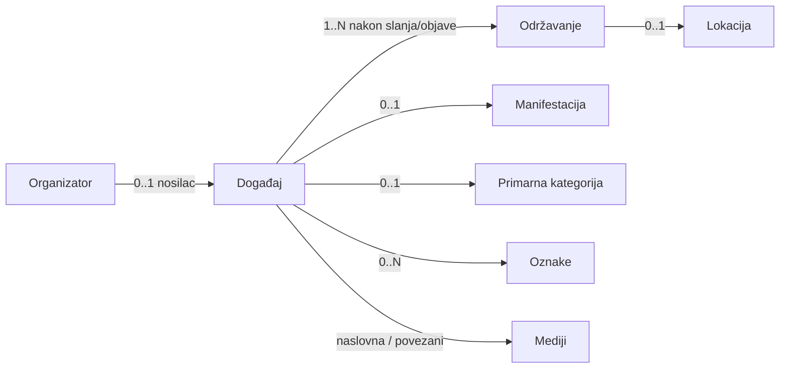
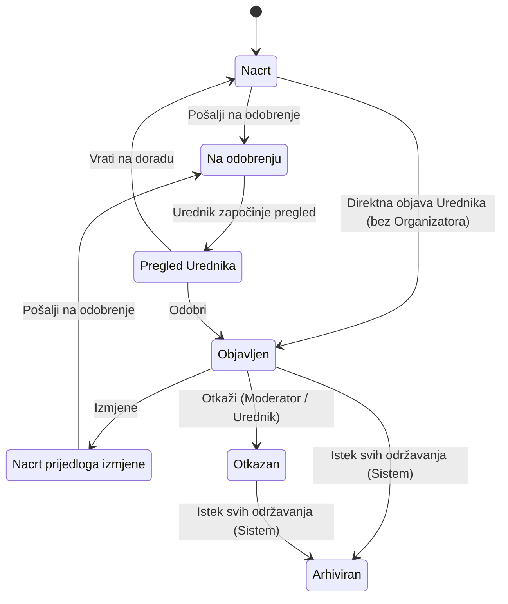
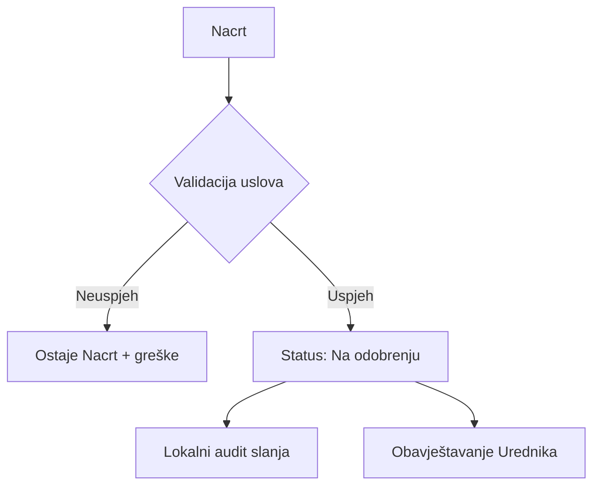
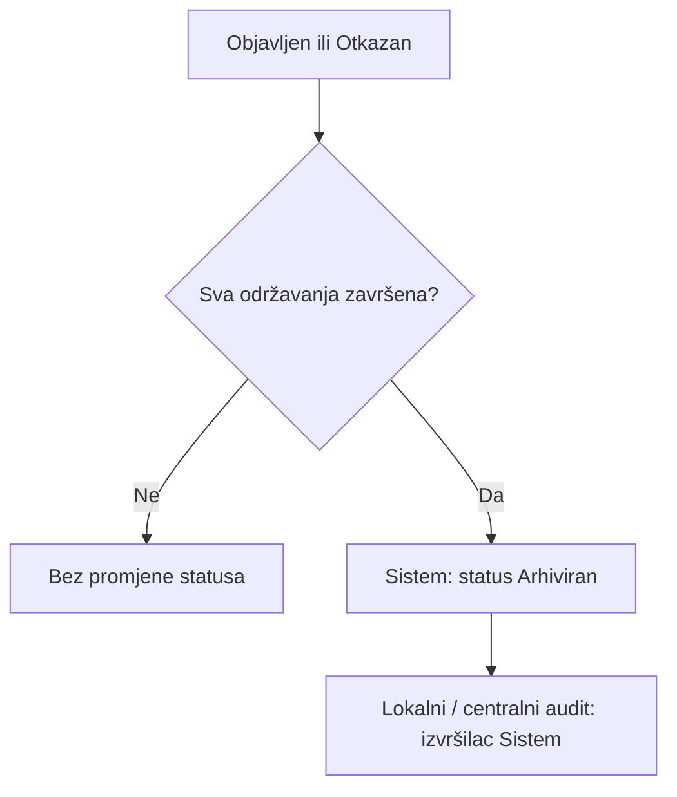
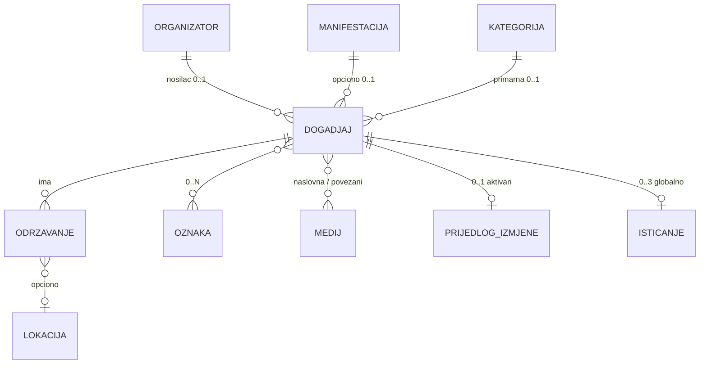

# Digital Kotor
# Technical Specification
## Događaj

**Feature ID:** FT-001  
**Oznaka dokumenta:** TS-003  
**Funkcionalna cjelina:** Događaj  
**Modul:** Kalendar kulture  
**Status dokumenta:** Usvojen  
**Verzija:** 0.1.4  
**Datum:** 2026-08-07

---

# Istorija verzija

| Verzija | Datum | Opis |
|---------|--------|------|
| 0.1 | 2026-07-29 | Initial draft. Prvi nacrt Technical Specification za funkcionalnu cjelinu Događaj. Usklađen sa BM-04, BM-10, BM-03 (relevantni dijelovi), FS §5.4–§5.5, §5.7.2, §5.16 (katalog Događaji), Feature Registry (FT-001 / plan TS-003), METHODOLOGY (M-TS-001–M-TS-005) i referentnim obrascom TS-001. Bez SQL, API, Laravel koda i bez novih poslovnih odluka. |
| 0.1.1 | 2026-07-29 | Administrativno: status dokumenta Usvojen (Product Owner). Bez promjene poslovnog, funkcionalnog niti tehničkog sadržaja. |
| 0.1.2 | 2026-08-07 | Usklađivanje sa BM PATCH-053 / PO-DG-07 i FS PATCH-FS-053: Otkazan terminalan (nema Otkazan → Objavljen); novi program = novi zapis; Odgođen = jedini mehanizam promjene termina (granica TS-004); Otkazan = istorijski zapis / read-only (izuzetak: razlog otkazivanja); uklonjena ponovna objava iz lifecycle, autorizacije, validacija i audita. Bez izmjene implementacije. |
| 0.1.3 | 2026-08-07 | **PO-EV-01** (implementaciona napomena §14): legacy `CulturalEvent` podaci su testni/prototipski; bez migracije/backfill/dual-write; novi model direktno prema TS. Bez izmjene BM/FS. Bez izmjene implementacije. |
| 0.1.4 | 2026-08-07 | Dokumentaciono usklađivanje isticanja sa BM-PK-15 / BR-117 / PO-TS9-06B: najviše **tri (3)** istaknuta događaja u jednom trenutku (umjesto zastarjelog „najviše jedan“ nakon PATCH-046 / PATCH-FS-048). Bez izmjene BM/FS/TS-009. |

Napomena:

Ovo poglavlje služi isključivo za evidenciju razvoja dokumenta.  
Kod svake naredne verzije dodaje se novi red u tabeli.  
Ne mijenjaju se postojeći redovi.

---

# Svrha dokumenta

Ovaj dokument opisuje kako će se usvojeni Business Model i Functional Specification za funkcionalnu cjelinu **Događaj** tehnički realizovati u okviru FT-001 – Kalendar kulture.

TS-003 obrađuje jednu logički zaokruženu funkcionalnu cjelinu unutar FT-001 i ne predstavlja kompletnu tehničku specifikaciju svih cjelina Feature-a FT-001.

Dokument:

* ne uvodi nova poslovna pravila;
* ne zamjenjuje Business Model niti Functional Specification;
* nije Technical Overview trenutne implementacije;
* nije Change Request;
* ne definiše SQL, migracije, Laravel kod niti konkretne API ugovore.

Izvori istine za poslovna pravila:

* `docs/business-model/Business_Model_Kalendar_kulture_MASTER.md` (BM-04, BM-10, BM-03 relevantni dijelovi, BM-UR-06/07/11, BM-MOD-16, BM-ORG-12; BM-DG-09/BM-DG-10 / BM PATCH-053)
* `docs/functional-specifications/Functional-Specification.md` (§5.4–§5.5, §5.7.1–§5.7.2 relevantno, §5.16 katalog Događaji, BR-006–BR-044, BR-045, BR-052, BR-056–BR-066, BR-117, BR-131, BR-182/BR-183; PATCH-FS-053)
* `docs/features/Feature-Registry.md` (FT-001)
* `docs/METHODOLOGY.md` (M-TS-001–M-TS-005)
* `docs/technical-specifications/Technical-Specification_Organizator.md` (TS-001 — referentni obrazac i granice prema Organizatoru / Moderatoru)

---

# Status razvoja Technical Specification

| Poglavlje | Status |
|-----------|--------|
| 1. Pregled funkcionalne cjeline | Usvojeno |
| 2. Arhitektonski principi | Usvojeno |
| 3. Tehnički model | Usvojeno |
| 4. Tokovi | Usvojeno |
| 5. Autorizacija i ovlašćenja | Usvojeno |
| 6. Model podataka | Usvojeno |
| 7. Validacije | Usvojeno |
| 8. Evidencija aktivnosti (Audit) | Usvojeno |
| 9. Integracije | Usvojeno |
| 10. Nefunkcionalni zahtjevi | Usvojeno |
| 11. Granice V1 (Out of Scope) | Usvojeno |
| 12. Otvorena pitanja | Usvojeno |
| 13. Matrica sljedivosti | Usvojeno |
| 14. Napomene za implementaciju | Usvojeno |

---

# Pravila upravljanja ovim dokumentom

1. TS-003 pripada FT-001 – Kalendar kulture.
2. Tehnički sadržaj mora ostati usklađen sa usvojenim BM i FS.
3. Nova poslovna pravila se ne uvode kroz Technical Specification.
4. Sve što nije definisano u BM ili FS evidentira se kao **Otvoreno pitanje**.
5. Product Owner donosi poslovne odluke; ovaj dokument ih ne pretpostavlja.
6. Izmjene usvojenog sadržaja u narednim verzijama evidentiraju se novim redom u istoriji verzija.
7. Zatvorena pitanja N-DG-01, N-DG-05 i N-DG-06 ne vraćaju se u §12.

---

# 1. Pregled funkcionalne cjeline

Izvori

Business Model:
- BM-DG-01–BM-DG-10
- BM-ST-01–BM-ST-09
- BM-UR-06, BM-UR-07, BM-UR-11
- BM-MOD-16, BM-ORG-12
- BM-TR-12 (referenca: Odgođen)

Functional Specification:
- §5.4 (prikaz događaja — relevantno)
- §5.5 (BR-006–BR-044)
- §5.7.1–§5.7.2 (BR-062–BR-066, BR-131)
- §5.16 katalog Događaji (BR-182, BR-183)

## 1.1 Svrha funkcionalne cjeline

Funkcionalna cjelina **Događaj** omogućava Kalendaru kulture da vodi osnovnu programsku jedinicu kulturnog sadržaja: od kreiranja nacrta, kroz uredničko odobravanje i objavu, do otkazivanja i automatskog arhiviranja.

Događaj:

* opisuje kulturni sadržaj;
* može imati jedno ili više **održavanja**;
* pripada Organizatoru, uz usvojeni izuzetak događaja bez registrovanog Organizatora;
* može biti dio najviše jedne Manifestacije;
* prolazi kroz usvojeni životni ciklus statusa.

## 1.2 Obuhvat dokumenta

Obuhvat TS-003:

* tehnički model entiteta Događaj;
* životni ciklus i dozvoljeni statusni prelazi;
* urednički tok (nacrt, slanje, pregled, odobrenje, vraćanje, direktna objava, izmjene objavljenog, otkazivanje, terminalnost statusa Otkazan / istorijski zapis, automatsko arhiviranje);
* logički model autorizacije za radnje nad događajem;
* konceptualni model podataka (bez SQL / migracija);
* lokalni audit tragovi i emisija događaja ka centralnoj Evidenciji (TS-012 / FT-003);
* integracione granice prema ostalim planiranim TS dokumentima FT-001.

Van obuhvata ovog dokumenta:

* implementacija, SQL, migracije, Laravel kod, API ugovori i rute;
* puni tehnički model Održavanja (TS-004), Manifestacije (TS-005), Lokacije (TS-006), Kategorija/oznaka (TS-007), Medija (TS-008), Javnog portala (TS-009), Uredničkog portala (TS-010), Newslettera (TS-011), Evidencije aktivnosti (TS-012);
* detaljan dizajn Organizatora / Moderatora (TS-001) — ovdje samo potrošačke veze.

## 1.3 Zavisnosti

| Zavisnost | Uloga u odnosu na TS-003 |
|-----------|---------------------------|
| TS-001 Organizator / Moderator | Pripadnost događaja Organizatoru; aktivni kontekst; ovlašćenja Moderatora; deaktivacija |
| Platforma Digital Kotor – korisnički nalozi | Identitet kreatora, Moderatora i Urednika |
| Platformska uloga Urednik | Objava, odobravanje, otkazivanje, unos/dopuna razloga otkazivanja, direktna objava bez Organizatora |
| Održavanje događaja (TS-004) | Preduslov za slanje/objavu; uslov za automatsko arhiviranje |
| Manifestacija (TS-005) | Opciona pripadnost |
| Lokacija (TS-006) | Preko održavanja, ne kao atribut događaja |
| Kategorije i oznake (TS-007) | Primarna kategorija i oznake |
| Mediji (TS-008) | Naslovna fotografija i povezani mediji |
| Javni portal (TS-009) | Prikaz posljednje odobrene / javne verzije |
| Urednički portal (TS-010) | Operativni prostor radnji |
| Newsletter (TS-011) | Potrošač statusnih promjena (granica) |
| Evidencija aktivnosti (TS-012) | Prima poslovno značajne događaje iz kataloga |

## 1.4 Veze sa BM, FS, FT-001 i TS-001

```
FT-001 Kalendar kulture
  → BM-04 Događaj (BM-DG-01–BM-DG-10)
  → BM-10 Status događaja (BM-ST-01–BM-ST-09)
  → BM-03 Urednik (BM-UR-06, BM-UR-07, BM-UR-11)
  → FS §5.4–§5.5, §5.7.2, §5.16
  → TS-001 (Organizator / Moderator — preduslov ovlašćenja)
  → TS-003 (ovaj dokument)
```

---

# 2. Arhitektonski principi

Izvori

Business Model:
- BM-DG-01–BM-DG-10
- BM-ST-01–BM-ST-09
- BM-ORG-04, BM-ORG-05, BM-ORG-12
- BM-UR-02, BM-UR-06, BM-UR-09
- BM-AL-07

Functional Specification:
- BR-006–BR-012
- BR-018, BR-025, BR-028
- BR-062–BR-066
- BR-131
- BR-182, BR-183

## 2.1 Događaj kao poslovni agregat sadržaja

Događaj je osnovna programska jedinica Kalendara kulture. Tehnički model tretira Događaj kao agregat čiji životni ciklus, javna vidljivost i uredničke odluke pripadaju ovoj cjelini.

Pojedinačna **održavanja** su povezani entiteti (granica TS-004), ali preduslovi nad njihovim brojem i završetkom direktno uslovljavaju prelaze događaja (slanje, objava, arhiviranje).

## 2.2 Razdvajanje sadržaja od nosioca

* **Organizator** je nosilac sadržaja (TS-001), ne izvršilac radnji.
* **Moderator** izvršava operativne radnje u aktivnom kontekstu aktivnog Organizatora.
* **Urednik** isključivo odobrava, objavljuje i otkazuje u skladu sa pravilima; ne vraća otkazani događaj u Objavljen.
* Događaj bez registrovanog Organizatora je usvojeni izuzetak (javni interes), ne alternativni model za događaje sa Organizatorom.

## 2.3 Jedna javna verzija

Javni portal uvijek vidi posljednju odobrenu verziju (BR-006).  
Prijedlozi izmjena objavljenog događaja ne mijenjaju javni prikaz dok Urednik ne odobri (BR-008, BR-011).

Tehnički način skladištenja verzija nije usvojen — **Otvoreno pitanje N-DG-04** (§12).

## 2.4 Zabranjeni zaobilazni tokovi

* Događaj koji pripada Organizatoru **ne može** biti direktno objavljen; obavezan je tok Nacrt → Na odobrenju → Objavljen (BM-ST-04, BR-018, BR-028).
* Direktna objava Nacrt → Objavljen dozvoljena je **isključivo** Uredniku i **isključivo** kada događaj nema Organizatora.
* Moderator ne može biti zaobiđen za događaje Organizatora.

## 2.5 Automatsko arhiviranje kao sistemska radnja

Arhiviranje nije ručna urednička radnja. Sistem arhivira događaj nakon završetka svih održavanja, iz statusa **Objavljen** i iz statusa **Otkazan** (BM-DG-04, BM-ST-08, BR-065).

## 2.6 Terminalnost statusa Otkazan

Status **Otkazan** je terminalan za povratak u **Objavljen** (BM-DG-09, BM-ST-07, BM-ST-09, BR-064).

* Prelaz Otkazan → Objavljen **nije** dozvoljen i mora biti odbijen validacijom.
* Jedini usvojeni izlaz iz Otkazan je Otkazan → Arhiviran (Sistem), kada su sva održavanja završena.
* Ako se isti kulturni program kasnije ponovo organizuje, kreira se **novi** događaj (novi zapis, novi lifecycle) — ne reaktivira se postojeći.
* Promjena termina postojećeg (neotkazanog) događaja vrši se isključivo kroz status **Odgođen** na održavanju (granica TS-004; BM-TR-12, BR-131).
* Događaj u statusu Otkazan je istorijski zapis: forma je **read-only**, osim razloga otkazivanja / napomene urednika (BM-DG-10, BR-064).

## 2.7 Auditabilnost i sljedivost

Svaka poslovno značajna radnja nad događajem mora ostaviti:

* lokalni trag gdje BM/FS to zahtijevaju (kreiranje, izmjena, slanje, urednička odluka);
* emisiju ka centralnoj Evidenciji za stavke kataloga Događaji (FS §5.16).

## 2.8 Modularnost unutar FT-001

TS-003 ne projektuje druge cjeline. Integracije su ugovori granica (§9), ne ugrađeni modeli drugih TS dokumenata.

---

# 3. Tehnički model

Izvori

Business Model:
- BM-DG-01–BM-DG-10
- BM-ST-01–BM-ST-09
- BM-DG-02, BM-DG-03, BM-DG-06

Functional Specification:
- BR-013–BR-018
- BR-025, BR-045, BR-052
- BR-056–BR-066
- BR-117
- BR-131

Tehnički model je logički. Ne definiše tabele, ORM klase ni fizičko skladištenje.

## 3.1 Entitet: Događaj

**Odgovornost**

Poslovni entitet koji predstavlja kulturni sadržaj Kalendara kulture i nosi status životnog ciklusa, pripadnost Organizatoru (ili izuzetak bez Organizatora), klasifikaciju i vezu ka održavanjima.

**Životni ciklus (statusi)**

```
Nacrt → Na odobrenju → Objavljen → Otkazan → Arhiviran
                ↘ (direktna objava, samo bez Organizatora)
Objavljen → Arhiviran (Sistem)
Otkazan → Arhiviran (Sistem)   // nema Otkazan → Objavljen
```

Detaljni prelazi: §4.

**Odnosi**

| Veza | Kardinalnost | Napomena |
|------|--------------|----------|
| Organizator | 0..1 | 0 samo za usvojeni izuzetak (BM-DG-08, BR-018, BR-045) |
| Održavanje | 0..N | 0 dozvoljeno samo u Nacrtu (BM-DG-01) |
| Manifestacija | 0..1 | Opciono; najviše jedna (BM-DG-02) |
| Primarna kategorija | 0..1 | Obavezna za slanje/objavu (BM-DG-07) |
| Oznake | 0..N | Opcione (BM-DG-06) |
| Mediji / naslovna fotografija | 0..N / 1 prikazna | Prikaz uvijek ima naslovnu (fallback kategorije — BM-MD-06 / FS §5.4) |
| Prijedlog izmjene | 0..1 aktivan | Max jedan aktivan prijedlog (BR-012) |

**Ograničenja**

* nije korisnik niti uloga;
* Lokacija nije atribut događaja (BM-DG-03);
* status se mijenja samo dozvoljenim prelazima (BM-ST-09);
* brisanje nije usvojeni V1 tok — događaj ostaje kroz statuse do arhive.

## 3.2 Poslovni kontekst — odnosi prema drugim cjelinama



* **Organizator** — nosilac; Moderatori rade u njegovo ime (TS-001).
* **Održavanje** — termin(i) događaja; lokacija na održavanju (TS-004 / TS-006).
* **Manifestacija** — opciono objedinjavanje (TS-005).
* **Kategorije / oznake** — klasifikacija (TS-007).
* **Mediji** — vizuelni sadržaj (TS-008).

TS-003 ne razrađuje tehničke modele tih cjelina.

## 3.3 Agregat i odgovornosti komponenti

| Komponenta (logička) | Odgovornost |
|----------------------|-------------|
| Agregat Događaj | Status, pripadnost, sadržaj, veze, javna verzija |
| Usluga prelaza statusa | Dozvoljeni prelazi, izvršioci, zabrane |
| Usluga odobravanja | Zaključavanje pregleda, odobrenje, vraćanje |
| Usluga arhiviranja | Sistemski prelaz nakon završetka svih održavanja |
| Integracioni adapteri | Emisija ka TS-012; čitanje konteksta iz TS-001 |

## 3.4 Prijedlog izmjene objavljenog događaja

Nije zaseban status događaja iz BM-ST-02.  
Predstavlja radni prijedlog nad objavljenim događajem (BR-025), sa pravilima BR-006–BR-012.

Dok prijedlog traje:

* javni portal zadržava posljednju odobrenu verziju;
* može postojati najviše jedan aktivan prijedlog.

## 3.5 Istaknuti događaj

Isticanje je urednička oznaka, ne status (BR-117):

* najviše tri istaknuta u jednom trenutku;
* mora biti javno objavljen;
* bira Urednik;
* ne mijenja lifecycle status.

---

# 4. Tokovi

Izvori

Business Model:
- BM-ST-01–BM-ST-09
- BM-DG-04, BM-DG-05, BM-DG-08, BM-DG-09, BM-DG-10
- BM-UR-06, BM-UR-11
- BM-MOD-16
- BM-TR-12 (referenca: Odgođen)

Functional Specification:
- BR-013–BR-044
- BR-062–BR-066
- BR-131
- §5.5.6a

Ovo poglavlje tehnički razrađuje lifecycle. „Vraćen na doradu“ nije status — radnja prelaza Na odobrenju → Nacrt.

## 4.1 Pregled lifecycle dijagrama



Napomena: stanja „Pregled Urednika“ i „Nacrt prijedloga izmjene“ su faze toka, ne statusi BM-ST-02. Prelaz Otkazan → Objavljen **nije** dio lifecycle-a (BR-064).

## 4.2 Matrica statusa

| Status | Svrha | Ulaz | Izlaz | Ko uvodi |
|--------|-------|------|-------|----------|
| **Nacrt** | Radna verzija; nije javna | Kreiranje; vraćanje na doradu; povlačenje zahtjeva prije pregleda | Slanje na odobrenje; direktna objava (samo bez Org.) | Moderator / Urednik (kreiranje); Urednik (vraćanje); Moderator (povlačenje) |
| **Na odobrenju** | Čeka uredničku odluku | Uspješno slanje | Odobrenje → Objavljen; vraćanje → Nacrt | Moderator (slanje); Urednik (odluka) |
| **Objavljen** | Javno vidljiv | Odobrenje; direktna objava | Otkazivanje; arhiviranje; pokretanje prijedloga izmjene | Urednik; Sistem (arhiviranje) |
| **Otkazan** | Otkazan, istorijski zapis (read-only) | Otkazivanje iz Objavljen | Samo arhiviranje (Sistem) | Moderator (uslovno) / Urednik; Sistem (arhiviranje) |
| **Arhiviran** | Završen lifecycle | Automatski nakon završetka svih održavanja | Nema usvojenog izlaza u V1 | Sistem |

## 4.3 Nacrt — kreiranje i uređivanje

**Tehnički tok**

1. Novi događaj nastaje u statusu **Nacrt** (BM-ST-03, BR-013).
2. Sistem automatski bilježi vrijeme kreiranja, kreatora i Organizatora (kada postoji) — nije ručno (BR-014).
3. Nacrt se može čuvati nepotpun (BR-015); nije javan (BR-016).
4. Moderator kreira/uređuje samo u aktivnom kontekstu svog aktivnog Organizatora (BR-007, BR-021).
5. Događaj bez Organizatora kreira i uređuje Urednik (BR-021, BM-UR-06).
6. Napuštanje obrasca bez čuvanja ne kreira zapis; nema automatske izrade nacrta (BR-019).

## 4.4 Slanje na odobrenje



**Tehnički tok**

1. Validacija obaveznih uslova (BR-017, BR-028, BR-029) — vidi §7.
2. Uspjeh → status **Na odobrenju** (BR-030).
3. Audit: vrijeme slanja + Moderator (BR-031).
4. Obavještavanje Urednika (BR-032); kanal — **Otvoreno pitanje N-DG-03**.
5. Do početka pregleda Moderator može povući zahtjev → nazad u Nacrt (BR-033).
6. Nakon početka pregleda povlačenje nije dozvoljeno (BR-034).
7. Opciona interna napomena Moderator → Urednik nije javna (BR-035).

**Zabrana:** događaj sa Organizatorom ne smije biti direktno objavljen umjesto ovog toka (BR-018, BR-028, BM-ST-04).

## 4.5 Urednički pregled, odobrenje i vraćanje

**Tehnički tok**

1. Urednik pregleda događaje Na odobrenju (BR-036).
2. Početak pregleda → zaključavanje; odgovornost privremeno na Uredniku; Moderator ne uređuje niti povlači (BR-023, BR-027, BR-037).
3. Urednik može mijenjati sadržaj tokom pregleda uz audit (BR-038).
4. **Odobri** → status **Objavljen**; nova verzija postaje javna (BR-039, BR-010, BM-ST-06).
5. **Vrati na doradu** → status **Nacrt**; razlog obavezan; nije javan; otključavanje; odgovornost vraća se Moderatoru (BR-040–BR-042, BM-ST-05).
6. Ako je vraćen prijedlog izmjene objavljenog događaja, javno ostaje prethodna odobrena verzija (BR-011, BR-042).
7. V1 nema trajnog odbijanja — samo odobri / vrati (BR-044).
8. Audit odluke: Urednik, vrijeme, vrsta odluke (BR-043).

## 4.6 Direktna objava (izuzetak)

```
Nacrt → Objavljen
```

**Uslovi (svi obavezni):**

* izvršilac = **Urednik**;
* događaj **nema** registrovanog Organizatora;
* ispunjeni uslovi za objavu (najmanje jedno održavanje, primarna kategorija, ostali uslovi validacije).

**Zabrane:**

* Moderator ne može direktno objaviti;
* Urednik ne može direktno objaviti događaj koji pripada Organizatoru;
* Moderator ne smije biti zaobiđen za događaje Organizatora (BM-ST-04, BR-018, BR-028).

## 4.7 Izmjene objavljenog događaja

1. Objavljeni događaj se ne uređuje direktno u javnom stanju (BR-025).
2. Nastaje prijedlog izmjene; max jedan aktivan (BR-012).
3. Izmjene Moderatora nisu javne dok Urednik ne odobri (BR-008).
4. Tok odobravanja prijedloga slijedi ista pravila odobravanja / vraćanja (BR-009–BR-011, BR-039–BR-042).

## 4.8 Otkazivanje

**Tehnički tok**

1. Ulaz: status **Objavljen**.
2. Izlaz: status **Otkazan** (BM-ST-07, BR-063).
3. **Moderator** smije otkazati samo ako:
   * Organizator ima status **Aktivan**;
   * radnja je u **aktivnom moderatorskom kontekstu** tog Organizatora (BM-DG-05, BM-MOD-16, BR-007, BR-063).
4. Deaktivacijom Organizatora moderatorski kontekst prestaje; Moderator više ne otkazuje događaje tog Organizatora (BM-ORG-12).
5. **Urednik** smije otkazati bilo koji objavljeni događaj, uključujući događaje deaktiviranog Organizatora (BM-UR-11, BR-063).
6. Otkazani događaj ostaje evidentiran kao **istorijski zapis**; prikaz po pravilima portala (BM-DG-10, BR-063, BR-064).
7. Nakon prelaska u Otkazan forma događaja je **read-only**, osim razloga otkazivanja / napomene urednika (§4.9).

## 4.9 Terminalnost statusa Otkazan (istorijski zapis)

**Tehnički tok / guard uslovi**

1. Ulaz: status **Otkazan**.
2. Jedini usvojeni statusni izlaz: **Otkazan → Arhiviran** (Sistem), kada su sva održavanja završena (BM-DG-04, BM-ST-08, BR-065).
3. Prelaz **Otkazan → Objavljen** nije dozvoljen; mora biti odbijen validacijom (BM-DG-09, BM-ST-07, BM-ST-09, BR-064).
4. Moderator ne može vratiti otkazani događaj u Objavljen; Urednik takođe ne može (BM-UR-11, BM-MOD-16).
5. Reaktivacija postojećeg otkazanog događaja ne postoji. Ako se isti kulturni program kasnije ponovo organizuje, kreira se **novi** događaj (novi zapis, novi lifecycle) (BM-DG-09).
6. Promjena termina postojećeg (neotkazanog) događaja nije radnja nad statusom događaja: vrši se isključivo kroz status **Odgođen** na održavanju (granica TS-004; BM-TR-12, BR-131).
7. Dok je status Otkazan, forma je **read-only**. Nije dozvoljena izmjena naziva, opisa, Organizatora, kategorije, datuma, vremena, lokacije, fotografija niti drugih sadržajnih podataka događaja ili povezanih održavanja (BM-DG-10, BR-064).
8. Jedini izuzetak: **Urednik** smije unijeti ili dopuniti **razlog otkazivanja (napomenu urednika)** radi tačnog informisanja javnosti (BM-DG-10, BM-UR-11, BR-063, BR-064).
9. Pokušaj izmjene bilo kog drugog polja dok je status Otkazan mora biti odbijen validacijom.

## 4.10 Automatsko arhiviranje



**Tehnički tok**

1. Ulazi: **Objavljen** ili **Otkazan** (BM-DG-04, BM-ST-08, BR-065).
2. Uslov: završetak **svih** održavanja događaja.
3. Izvršilac: **Sistem**.
4. Bez ručne intervencije.
5. Bez novog statusa.
6. Za događaj u statusu Otkazan ovo je jedini usvojeni izlaz iz terminalnog stanja (nema povratka u Objavljen).

## 4.11 Naknadno povezivanje sa Organizatorom

Urednik može naknadno povezati događaj kreiran bez Organizatora sa registrovanim Organizatorom (BM-UR-07, BR-052).

Tehničke posljedice:

* administrativna dopuna podataka;
* ne smije mijenjati audit, istoriju događaja niti javno objavljene verzije.

---

# 5. Autorizacija i ovlašćenja

Izvori

Business Model:
- BM-DG-05, BM-DG-08, BM-DG-09, BM-DG-10
- BM-ST-04, BM-ST-07, BM-ST-09
- BM-ORG-04, BM-ORG-05, BM-ORG-12
- BM-MOD-16
- BM-UR-02, BM-UR-06, BM-UR-07, BM-UR-09, BM-UR-11

Functional Specification:
- BR-007, BR-009, BR-013, BR-018, BR-021
- BR-028, BR-036–BR-040
- BR-045, BR-052
- BR-063, BR-064, BR-117

Logički model (bez middleware / framework detalja).

## 5.1 Matrica prava

| Radnja | Moderator | Urednik | Administrator platforme | Organizator (entitet) |
|--------|-----------|---------|-------------------------|------------------------|
| Kreirati događaj za svog Org. | Da — Aktivan Org. + aktivni kontekst | Da | Ne | Ne |
| Kreirati događaj bez Org. | Ne | Da (BM-UR-06) | Ne | Ne |
| Uređivati nacrt svog Org. | Da — kontekst | Da | Ne | Ne |
| Uređivati nacrt bez Org. | Ne | Da | Ne | Ne |
| Sačuvati nepotpun nacrt | Da | Da | Ne | Ne |
| Poslati na odobrenje | Da — svoj Org., validacija OK | Da (gdje model dozvoljava) | Ne | Ne |
| Povući zahtjev prije pregleda | Da | — | Ne | Ne |
| Pregledati Na odobrenju | Ne (osim sopstvenih nacrta/prijedloga po pravilima) | Da | Ne | Ne |
| Odobriti / vratiti na doradu | Ne | Da | Ne | Ne |
| Direktna objava Nacrt→Objavljen | Ne | Da — **samo bez Org.** | Ne | Ne |
| Pokrenuti prijedlog izmjene objavljenog | Da — svoj Org. | Da | Ne | Ne |
| Otkazati objavljeni | Da — Aktivan Org. + kontekst | Da — bilo koji | Ne | Ne |
| Urediti sadržaj otkazanog | Ne | Ne | Ne | Ne |
| Unijeti / dopuniti razlog otkazivanja | Ne | Da — dok je Otkazan | Ne | Ne |
| Vratiti Otkazan → Objavljen | Ne | Ne | Ne | Ne |
| Ručno arhivirati | Ne | Ne | Ne | Ne |
| Automatsko arhiviranje | — | — | — | Sistem |
| Istaknuti / ukloniti isticanje | Ne | Da (BR-117) | Ne | Ne |
| Naknadno povezati sa Org. | Ne | Da (BR-052) | Ne | Ne |
| Pristupiti kao Organizator | Ne | Ne | Ne | Ne — entitet nema prijavu |

## 5.2 Posebna pravila Moderatora

* Samo događaji **svog** Organizatora.
* Samo dok je Organizator **Aktivan**.
* Samo u **aktivnom moderatorskom kontekstu**.
* Ne objavljuje, ne direktno objavljuje, ne vraća otkazani događaj u Objavljen.
* Ne mijenja sadržaj otkazanog događaja niti razlog otkazivanja.
* Nakon deaktivacije Organizatora ne izvršava poslovne radnje nad događajima tog Organizatora (BR-007, BR-049/BR-050 veza preko TS-001).

## 5.3 Posebna pravila Urednika

* Pregled, odobravanje, vraćanje, objava.
* Direktna objava samo bez Organizatora.
* Otkazivanje bilo kojeg objavljenog događaja.
* Unos / dopuna razloga otkazivanja (napomene urednika) dok je status Otkazan.
* Ne vraća otkazani događaj u Objavljen; ne uređuje sadržajne podatke otkazanog događaja osim razloga otkazivanja.
* Ne kombinuje ulogu sa Moderatorom / običnim korisnikom u poslovnom modelu Kalendara (BM-UR-09).

## 5.4 Administrator platforme

Nije učesnik uredničkog toka događaja.  
Relevantan je isključivo kroz centralnu Evidenciju aktivnosti (TS-012 / FT-003) — van normativnog toka TS-003.

## 5.5 Organizator kao poslovni entitet

Organizator ne izvršava radnje.  
Ne prijavljuje se.  
Ne otkazuje, ne objavljuje i ne uređuje događaje.

---

# 6. Model podataka

Izvori

Business Model:
- BM-DG-01–BM-DG-10
- BM-ST-02
- BM-MD-06, BM-KO-02, BM-KO-03

Functional Specification:
- §5.4 (prikaz)
- BR-014, BR-018, BR-026, BR-045, BR-052
- BR-056–BR-062
- BR-064
- BR-117

Konceptualni model. Bez SQL, bez migracija, bez fizičkih tipova.

## 6.1 Dijagram odnosa



## 6.2 Potvrđeni atributi

Atributi / svojstva potvrđeni usvojenim BM/FS (konceptualno):

| Atribut / svojstvo | Obrazloženje | Izvor |
|--------------------|--------------|-------|
| Identitet događaja | Jedinstvena identifikacija | tehnička nužnost agregata |
| Status | Nacrt / Na odobrenju / Objavljen / Otkazan / Arhiviran | BM-ST-02, BR-062 |
| Organizator (referenca) | 0..1 | BM-DG-08, BR-018, BR-045 |
| Primarna kategorija | 0..1; obavezna za slanje/objavu | BM-DG-06/07, BR |
| Oznake | 0..N, opcione | BM-DG-06 |
| Manifestacija | 0..1, opciono | BM-DG-02 |
| Vrijeme kreiranja | Automatski | BR-014 |
| Kreator | Automatski | BR-014 |
| Vrijeme posljednje izmjene | Automatski | BR-026 |
| Korisnik posljednje izmjene | Automatski | BR-026 |
| Naslov | Potvrđen kao sadržaj prikaza / uređivanja | FS §5.4, §5.5.4 |
| Opis | Opcioni u prikazu | FS §5.4 |
| Naslovna fotografija / medij | Prikaz uvijek ima sliku (direktno ili fallback kategorije) | FS §5.4, BM-MD-06 |
| Indikator istaknutosti | Najviše tri istaknuta globalno | BR-117 |
| Postojanje ≥1 održavanja | Preduslov slanja/objave | BM-DG-01 |
| Razlog otkazivanja (napomena urednika) | Jedino sadržajno polje izmjenjivo dok je status Otkazan; Urednik | BM-DG-10, BR-063, BR-064 |

## 6.3 Referencirani atributi

Svojstva koja TS-003 referencira, a čiji puni model pripada drugim TS:

| Referenca | Vlasnik | Napomena za TS-003 |
|-----------|---------|-------------------|
| Održavanje (termin, status, lokacija) | TS-004 / TS-006 | Broj i završetak uslovljavaju validacije i arhivu |
| Kategorija / oznake | TS-007 | Primarna obavezna za slanje/objavu |
| Medij | TS-008 | Naslovna i povezani mediji |
| Organizator / kontekst Moderatora | TS-001 | Autorizacija i pripadnost |
| Javni prikaz | TS-009 | Potrošač javne verzije |

## 6.4 Otvoreni atributi

Tačan katalog polja obrasca događaja (obavezna/opciona, tipovi, ograničenja dužine, dodatna polja) **nije u potpunosti usvojen** — **Otvoreno pitanje N-DG-02** (§12).

Ne popunjava se pretpostavkama.

Takođe otvoreno:

* tehnički model skladištenja verzija / prijedloga izmjena — **N-DG-04**;
* dodatna polja van potvrđenog skupa iz §6.2.

## 6.5 Integritet

* Status samo iz dozvoljenog skupa.
* Kardinalnost Organizatora: 0 ili 1.
* Kardinalnost Manifestacije: 0 ili 1.
* Najviše jedan aktivan prijedlog izmjene.
* Najviše tri istaknuta događaja u sistemu u datom trenutku.
* Lokacija se ne čuva kao atribut događaja.
* Dok je status **Otkazan**, sadržajni atributi su neizmjenjivi osim razloga otkazivanja (BM-DG-10, BR-064).
* Prelaz Otkazan → Objavljen nije dio dozvoljenog skupa prelaza (BM-DG-09, BM-ST-09, BR-064).

---

# 7. Validacije

Izvori

Business Model:
- BM-DG-01, BM-DG-04, BM-DG-05, BM-DG-07, BM-DG-08, BM-DG-09, BM-DG-10
- BM-ST-04, BM-ST-07, BM-ST-08, BM-ST-09
- BM-TR-12 (referenca)

Functional Specification:
- BR-017–BR-019, BR-028–BR-030
- BR-033, BR-034, BR-040
- BR-063–BR-065
- BR-012, BR-018
- BR-131

## 7.1 Poslovna pravila — tehnička interpretacija

Za svako relevantno pravilo: implementaciona posljedica (bez kopiranja BM teksta).

| Oznaka | Tehnička interpretacija |
|--------|-------------------------|
| BM-DG-01 / BR-017 | Blokirati slanje/objavu ako nema ≥1 održavanje; dozvoliti 0 samo u Nacrtu |
| BM-DG-02 | Dozvoliti 0..1 vezu na Manifestaciju; zabraniti >1 |
| BM-DG-03 | Ne modelirati lokaciju na događaju; čitati je preko održavanja |
| BM-DG-04 / BR-065 | Job/proces Sistema: ako sva održavanja završena i status ∈ {Objavljen, Otkazan} → Arhiviran |
| BM-DG-05 / BR-063 | Autorizovati otkaz po matrici §5; ulaz samo Objavljen |
| BM-DG-06/07 | Zahtijevati primarnu kategoriju pri slanju/objavi; dozvoliti odsustvo u Nacrtu |
| BM-DG-08 / BR-018 / BR-045 | Enforce 0..1 Org.; direktna objava samo pri 0 |
| BM-DG-09 / BR-064 | Odbijati Otkazan → Objavljen; novi program = novi zapis; Odgođen (TS-004) = jedini mehanizam promjene termina |
| BM-DG-10 / BR-064 | Dok je Otkazan: read-only sadržaj; dozvoliti samo izmjenu razloga otkazivanja (Urednik) |
| BM-ST-04 / BR-028 | Zabraniti Nacrt→Objavljen ako Org. postoji |
| BM-ST-05 / BR-040 | Vraćanje zahtijeva razlog; status → Nacrt |
| BM-ST-07 | Otkaz po matrici; nema reaktivacije / ponovne objave |
| BM-ST-08 | Arhiva i iz Otkazan |
| BM-ST-09 | Svaki nedozvoljeni prelaz → odbijanje (uključujući Otkazan → Objavljen) |
| BM-TR-12 / BR-131 | Promjena termina postojećeg događaja samo preko Odgođen na održavanju (granica TS-004) |
| BR-012 | Odbiti drugi aktivni prijedlog izmjene |
| BR-019 | Bez autosave nacrta pri napuštanju |
| BR-033/034 | Povlačenje samo prije početka pregleda |
| BR-052 | Link-to-Org ne smije mutirati audit/istoriju/javne verzije |

## 7.2 Tabela validacija po toku

| Validacija | Kada | Ko / šta | Posljedica |
|------------|------|----------|------------|
| Kreator ovlašćen (Mod kontekst / Urednik) | Kreiranje | Sistem | Odbijanje ako nema prava |
| Org. Aktivan za Moderatorsko kreiranje | Kreiranje / uređivanje | Sistem | Odbijanje ako Org. deaktiviran |
| Nacrt može biti nepotpun | Čuvanje nacrta | Sistem | Dozvoljeno čuvanje |
| ≥1 održavanje | Slanje / objava / direktna objava | Sistem | Blokada + greške |
| Primarna kategorija izabrana | Slanje / objava / direktna objava | Sistem | Blokada + greške |
| Ostali obavezni uslovi (katalog polja) | Slanje / objava | Sistem | Blokada; tačan katalog = N-DG-02 |
| Događaj sa Org. ne ide Nacrt→Objavljen | Direktna objava | Sistem | Odbijanje |
| Direktna objava samo Urednik | Direktna objava | Sistem | Odbijanje za Moderatore |
| Status = Nacrt | Slanje | Sistem | Odbijanje inače |
| Povlačenje prije pregleda | Povlačenje | Sistem | Ako pregled počeo → odbijanje |
| Razlog vraćanja obavezan | Vraćanje na doradu | Sistem | Blokada bez razloga |
| Max 1 aktivan prijedlog | Pokretanje izmjene | Sistem | Odbijanje drugog |
| Status = Objavljen | Otkazivanje | Sistem | Odbijanje inače |
| Mod: Aktivan Org. + kontekst | Otkazivanje Moderatorom | Sistem | Odbijanje inače |
| Otkazan → Objavljen zabranjen | Pokušaj ponovne objave / reaktivacije | Sistem | Odbijanje (BR-064, BM-ST-09) |
| Status = Otkazan → sadržaj read-only | Izmjena sadržajnih polja | Sistem | Odbijanje (BM-DG-10) |
| Samo Urednik; samo razlog otkazivanja | Unos/dopuna razloga dok je Otkazan | Sistem | Odbijanje inače |
| Sva održavanja završena | Arhiviranje | Sistem | Prelaz; inače bez akcije |
| Status ∈ {Objavljen, Otkazan} | Arhiviranje | Sistem | Inače bez akcije |
| Nedozvoljen statusni prelaz | Bilo koja promjena statusa | Sistem | Odbijanje (BM-ST-09) |

## 7.3 Tehničke validacije

* Referencirani Organizator, kategorija, medij, održavanje moraju postojati kada su navedeni.
* Audit polja kreiranja / izmjene / odluke nisu ručno izmjenjiva nakon upisa.
* Istovremeni urednički pregled istog prijedloga ne smije proizvesti dvije kontradiktorne konačne odluke bez kontrolisanog ishoda (jedna važeća odluka).
* Mehanizam zaključavanja nije propisan u BM/FS — implementacioni izbor uz poštovanje BR-023/037.

---

# 8. Evidencija aktivnosti (Audit)

Izvori

Business Model:
- BM-AL-01–BM-AL-08 (okvir)
- BM-ST-07, BM-ST-08
- BM-DG-10

Functional Specification:
- BR-014, BR-026, BR-031, BR-043
- §5.16 katalog Događaji
- BR-171, BR-182, BR-183

TS-003 ne projektuje FT-003 / TS-012.

## 8.1 Lokalni audit tragovi

| Događaj | Ko | Kada | Šta se bilježi |
|---------|----|------|----------------|
| Kreiranje događaja | Moderator / Urednik | Pri kreiranju | creator, created_at, Organizator (ako postoji) — BR-014 |
| Izmjena sadržaja | Moderator / Urednik | Pri čuvanju (status ≠ Otkazan) | last_modified_at, user — BR-026 |
| Slanje na odobrenje | Moderator / Urednik | Pri uspješnom slanju | vrijeme, izvršilac — BR-031 |
| Urednička odluka | Urednik | Odobrenje / vraćanje | Urednik, vrijeme, vrsta; razlog ako vraćanje — BR-043 |
| Unos / dopuna razloga otkazivanja | Urednik | Dok je status Otkazan | vrijeme, Urednik; sadržaj napomene — BM-DG-10, BR-064 |
| Početak / kraj zaključavanja pregleda | Sistem / Urednik | Po BR-023/024 | lokalno za kontrolu toka; nije stavka centralnog kataloga |

Lokalni tragovi nisu ručno izmjenjivi i nisu zamjena za centralnu evidenciju (BR-171).

## 8.2 Emisija ka centralnoj Evidenciji (TS-012)

U skladu sa katalogom Događaji, TS-003 mora biti u stanju emitovati:

| Događaj | Izvršilac |
|---------|-----------|
| Kreiranje događaja | Moderator / Urednik |
| Slanje na odobrenje | Moderator / Urednik |
| Vraćanje na doradu | Urednik |
| Ponovno slanje na odobrenje | Moderator / Urednik |
| Odobravanje događaja | Urednik |
| Direktna objava Urednika | Urednik |
| Isticanje / uklanjanje isticanja | Urednik |
| Otkazivanje događaja | Moderator / Urednik |
| Unos / dopuna razloga otkazivanja | Urednik |
| Odlaganje održavanja | (granica TS-004; emisija događaja vezana za događaj) |
| Otkaz pojedinačnog održavanja | (granica TS-004) |
| Promjena termina / lokacije održavanja | (granica TS-004) |
| Podnošenje / odobravanje / vraćanje prijedloga izmjena | Moderator / Urednik |
| Automatsko arhiviranje | **Sistem** |

**Ne emituju se** u centralnu evidenciju: uređivanje nacrta, sitne korekcije, lock/unlock, pregled bez izmjena, pokušaj ponovne objave otkazanog događaja (nije dozvoljena poslovna radnja; BR-064), ostale operativne radnje bez poslovnog značaja (FS §5.16).

Emisija **„Ponovna objava događaja“** nije dio kataloga Događaji nakon PATCH-FS-053.

---

# 9. Integracije

Izvori

Business Model:
- BM-DG-01–BM-DG-10
- BM-ORG-04, BM-ORG-12
- BM-UR-06, BM-UR-07
- BM-TR-12 (referenca)

Functional Specification:
- BR-007, BR-018, BR-045, BR-052
- BR-056–BR-061
- BR-131
- BR-182

Samo granice. Bez tehničkih modela ciljnih TS dokumenata.

| TS | Granica prema TS-003 |
|----|----------------------|
| **TS-001** | Pripadnost Organizatoru; aktivni kontekst; status Org.; ovlašćenja Moderatora; deaktivacija → prestanak moderatorskih radnji; naknadno povezivanje |
| **TS-004** | Održavanja događaja; preduslov ≥1; završetak svih → signal za arhivu; statusi održavanja (Odgođen = jedini mehanizam promjene termina postojećeg događaja; otkaz termina) |
| **TS-005** | Opciona pripadnost Manifestaciji (0..1) |
| **TS-006** | Lokacija preko održavanja |
| **TS-007** | Primarna kategorija i oznake; fallback fotografije kategorije |
| **TS-008** | Naslovna i povezani mediji |
| **TS-009** | Potrošač javne / arhivirane vidljivosti; istaknuti događaj |
| **TS-010** | Operativni UI prostor radnji Moderatora i Urednika |
| **TS-011** | Potrošač poslovno značajnih promjena statusa/sadržaja (okidači Newslettera) — bez modela Newslettera ovdje |
| **TS-012** | Prima emisije iz §8.2; ne upravlja lifecycle događaja |

---

# 10. Nefunkcionalni zahtjevi

Izvori

Business Model:
- BM-AL-04, BM-AL-05
- BM-ST-09

Functional Specification:
- BR-012, BR-023, BR-037
- BR-065
- BR-182

## 10.1 Sigurnost

* Autorizacija po matrici §5; zabraniti cross-tenant pristup tuđim Organizatorima.
* Direktna objava strogo uslovljena odsustvom Organizatora.
* Audit zapisi odluka nisu izmjenjivi kroz redovno korišćenje.

## 10.2 Performanse

* Provjera ovlašćenja i statusnog prelaza mora biti dovoljno brza za Urednički portal.
* Automatsko arhiviranje mora moći obraditi skup događaja čija su održavanja istekla, bez ručne intervencije.
* Konkretni pragovi nisu usvojeni u BM/FS — ne uvode se ovdje.

## 10.3 Integritet

* Nedozvoljeni statusni prelazi moraju biti odbijeni, uključujući Otkazan → Objavljen.
* Javna verzija mora ostati konzistentna sa BR-006 tokom prijedloga izmjena.
* Arhiviranje ne smije ostaviti događaj u Objavljen/Otkazan ako su sva održavanja završena (konvergencija Sistema).
* Sadržaj otkazanog događaja mora ostati neizmjenjiv osim razloga otkazivanja (BM-DG-10).

## 10.4 Konkurentnost

* Jedan aktivan prijedlog izmjene (BR-012).
* Zaključavanje tokom pregleda (BR-023/037).
* Jedna važeća urednička odluka po prijedlogu.

## 10.5 Proširivost

* Model mora dozvoliti dopunu kataloga polja nakon zatvaranja N-DG-02 bez lomljenja lifecycle-a.
* Verzijski model (N-DG-04) mora se moći uvesti bez promjene usvojenih statusa.

## 10.6 Održavanje

* TS-003 ostaje usklađen sa BM/FS; nova poslovna pravila ulaze isključivo preko BM/FS.
* Odstupanja trenutne implementacije vode se u Technical Overview, ne u ovom dokumentu.

---

# 11. Granice V1 (Out of Scope)

Izvori

Business Model:
- BM-DG-*, BM-ST-*
- BM-04 / BM-10 usvojeno

Functional Specification:
- §5.4.9 (isključenja prikaza)
- BR-044
- §5.16 (šta ne ulazi u evidenciju)

Usvojene granice V1 za TS-003:

1. Ovaj dokument ne projektuje implementaciju (kod, Laravel, SQL, migracije, API ugovore i rute).
2. Puni tehnički modeli Održavanja, Manifestacije, Lokacije, Kategorija, Medija, Portala, Newslettera i Evidencije nisu dio TS-003 (samo granice §9).
3. Trajno odbijanje događaja nije dio V1 — samo odobrenje ili vraćanje na doradu (BR-044).
4. Ručno arhiviranje nije dio V1.
5. Izlaz iz statusa Arhiviran nije usvojen u V1.
6. Prelaz Otkazan → Objavljen, ponovna objava i reaktivacija otkazanog događaja nisu dio V1 (BM-DG-09, BR-064).
7. Funkcionalnosti prikaza isključene u FS §5.4.9 (galerija, mapa/GPS, share/print, lični kalendar, kontakt/web/društvene mreže Organizatora, dokumenti, cijena, rezervacije, SEO) nisu dio obuhvata ovog TS-a.
8. Autosave nacrta pri napuštanju obrasca nije dio V1 (BR-019).
9. Detaljan dizajn FT-003 / TS-012 nije dio TS-003.

---

# 12. Otvorena pitanja

Pitanja za odluku Product Ownera ili tehničku razradu koja **nije** zatvorena usvojenim BM/FS. Bez predloženih odgovora.

Ne vraćaju se: N-DG-01, N-DG-05, N-DG-06 (zatvorena).

Napomena: N-DG-01 (PATCH-035) je zatvoren; dio koji je dozvoljavao Otkazan → Objavljen supersedovan je odlukom PO-DG-07 / BM PATCH-053 / FS PATCH-FS-053 (terminalnost Otkazan).

1. **N-DG-02** — Koji je tačan katalog polja obrasca događaja (obavezna i opciona polja, ograničenja, tipovi) za V1, izvan već potvrđenih svojstava u §6.2?
2. **N-DG-03** — Kojim kanalom sistem obavještava Urednika o slanju događaja na odobrenje (BR-032), s obzirom da FS ostavlja kanal kao tehničku odluku?
3. **N-DG-04** — Kako se tehnički skladište i povezuju verzije događaja / aktivni prijedlog izmjene, uz poštovanje BR-006–BR-012 (javno uvijek posljednja odobrena verzija)?

---

# 13. Matrica sljedivosti

Rule-level i sekcijska sljedivost.

| TS sekcija | BM | FS / BR | FT | Ostali TS |
|------------|----|---------|----|-----------|
| §1 Pregled | BM-04, BM-10; BM-DG-01–BM-DG-10 | §5.4–§5.5, §5.7.1–§5.7.2; BR-131 | FT-001 | TS-001 (veza) |
| §2 Principi | BM-DG-08/09/10, BM-ST-04/07/08/09, BM-TR-12 | BR-006, BR-018, BR-028, BR-064, BR-065, BR-131 | FT-001 | TS-004 |
| §3 Tehnički model | BM-DG-01–BM-DG-10, BM-ST-02 | BR-013–BR-018, BR-025, BR-045, BR-056–BR-062, BR-117, BR-131 | FT-001 | TS-001, TS-004–TS-008 |
| §4.3 Nacrt | BM-ST-03 | BR-013–BR-021 | FT-001 | TS-001 |
| §4.4 Slanje | BM-ST-04, BM-DG-01, BM-DG-07 | BR-017, BR-028–BR-035 | FT-001 | TS-004, TS-007 |
| §4.5 Pregled / odobrenje | BM-ST-05, BM-ST-06 | BR-023, BR-027, BR-036–BR-044 | FT-001 | TS-010 |
| §4.6 Direktna objava | BM-ST-04, BM-DG-08, BM-UR-06 | BR-018, BR-028, BR-045 | FT-001 | TS-001 |
| §4.7 Izmjene objavljenog | — | BR-006–BR-012, BR-025 | FT-001 | — |
| §4.8 Otkazivanje | BM-DG-05, BM-DG-10, BM-ST-07, BM-MOD-16, BM-ORG-12, BM-UR-11 | BR-007, BR-063, BR-064 | FT-001 | TS-001 |
| §4.9 Terminalnost Otkazan | BM-DG-09, BM-DG-10, BM-ST-07, BM-ST-09, BM-UR-11, BM-TR-12 | BR-064, BR-131 | FT-001 | TS-004 |
| §4.10 Arhiviranje | BM-DG-04, BM-ST-08 | BR-065, BR-066 | FT-001 | TS-004 |
| §4.11 Naknadno povezivanje | BM-UR-07, BM-DG-08 | BR-052 | FT-001 | TS-001 |
| §5 Autorizacija | BM-DG-05/08/09/10, BM-ST-04/07/09, BM-MOD-16, BM-UR-* | BR-007, BR-018, BR-028, BR-063, BR-064, BR-117 | FT-001 | TS-001 |
| §6 Model podataka | BM-DG-*, BM-DG-10, BM-ST-02 | §5.4; BR-014, BR-018, BR-062, BR-064, BR-117 | FT-001 | TS-004–TS-008 |
| §7 Validacije | BM-DG-*, BM-DG-09/10, BM-ST-04/07/08/09, BM-TR-12 | BR-017–BR-019, BR-028–BR-030, BR-063–BR-065, BR-131 | FT-001 | TS-004 |
| §8 Audit | BM-AL-*, BM-ST-08, BM-DG-10 | BR-014, BR-026, BR-031, BR-043; §5.16; BR-182/183 | FT-001 / FT-003 | TS-012 |
| §9 Integracije | BM-DG-*, BM-ORG-12, BM-TR-12 | BR-045, BR-052, BR-056+, BR-131 | FT-001 | TS-001, TS-004–TS-012 |
| §10 NFR | BM-ST-09 | BR-012, BR-023, BR-064, BR-065 | FT-001 | — |
| §11 Granice V1 | BM-04/10, BM-DG-09 | BR-044, BR-064; §5.4.9 | FT-001 | — |
| §12 Otvorena | — | BR-032 (kanal); katalog polja; verzije | FT-001 | — |

---

# 14. Napomene za implementaciju

Ovo poglavlje je strogo nenormativno.

1. Pri implementaciji prvo uspostaviti statusni motor i matricu autorizacije (§4–§5), zatim sadržajna polja nakon zatvaranja N-DG-02.
2. Automatsko arhiviranje treba tretirati kao sistemski proces ovisan o signalu završetka održavanja iz TS-004.
3. Direktnu objavu implementirati kao zasebnu dozvoljenu tranziciju sa tvrdom provjerom odsustva Organizatora — ne kao opšti bypass odobravanja.
4. Status Otkazan tretirati kao terminalan za povratak u Objavljen; UI/API ne smiju nuditi ponovnu objavu niti uređivanje sadržaja osim razloga otkazivanja.
5. Verzijski model (N-DG-04) odabrati tako da javni portal nikada ne čita neodobrene prijedloge.
6. Trenutna implementacija i odstupanja ostaju u `docs/tehnicka-dokumentacija/cultural-calendar.md` (Technical Overview), ne u TS-003.
7. Emisije ka TS-012 držati usklađenim sa katalogom FS §5.16; ne proširivati katalog kroz TS; ne emitovati „Ponovna objava događaja“.
8. **PO-EV-01:** Postojeći `CulturalEvent` / `cultural_events` podaci su isključivo testni/prototipski i nisu predmet migracije ni backfill-a u novi model. Implementacija uspostavlja kanonski model Događaj (+ Održavanja prema TS-004) direktno prema ovom TS-u, bez dual-write i bez adaptera radi očuvanja legacy zapisa. Privremeni flat model ostaje samo do cutover-a na novi domen.
