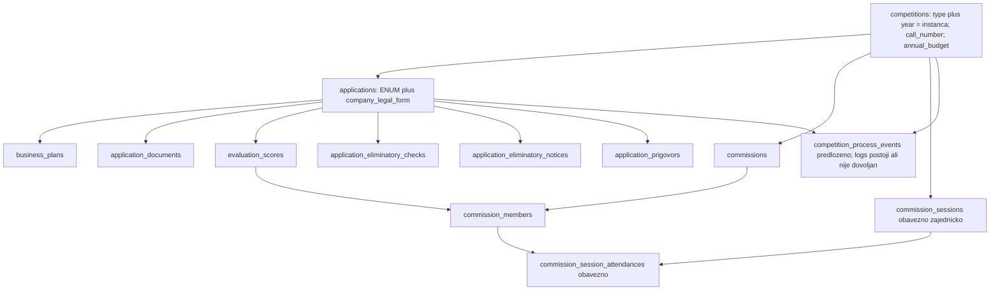

# Digital Kotor
# Tehnička specifikacija profila konkursa za podršku preduzetništvu mladih
## Modul: Konkursi

**Oznaka dokumenta:** KN-TS-002
**Naziv:** Tehnička specifikacija profila konkursa za podršku preduzetništvu mladih
**Modul:** Konkursi
**Namespace:** KN
**Tip konkursa:** Konkurs za podršku preduzetništvu mladih
**Status dokumenta:** USVOJEN
**Verzija:** 1.0.0
**Datum:** 2026-09-10

Povezani dokumenti:

* Registar oznaka: **KN-RG-001 v1.0.23** — `docs/reference/Registar-skracenica-i-oznaka-dokumentacije-Konkursi.md` (USVOJENO)
* Zajednički poslovni model modula Konkursi: **KN-BM-001 v0.2.11** — `docs/business-model/Business_Model_Konkursi.md` (USVOJENO)
* Poslovni profil mladih: **KN-BM-002 v1.0.5** — `docs/business-model/Business_Model_Konkursi_Mladi.md` (USVOJEN)
* Zajednička funkcionalna specifikacija modula Konkursi: **KN-FS-001 v0.2.13** — `docs/functional-specifications/Functional-Specification_Konkursi.md` (USVOJENO)
* Funkcionalni profil mladih: **KN-FS-002 v1.0.3** — `docs/functional-specifications/Functional-Specification_Konkursi_Mladi.md` (USVOJEN)
* Zajednička tehnička specifikacija modula Konkursi: **KN-TS-001 v0.1.0** — `docs/technical-specifications/Technical-Specification_Konkursi.md` (NACRT)
* Funkcionalna specifikacija ženskog preduzetništva: **KN-FS-003** — `docs/functional-specifications/Functional-Specification_Konkursi_Zensko_Preduzetnistvo.md` — **samo tehnički i strukturni obrazac**; nije SSOT profila mladih

Ovaj dokument **ne** mijenja `KN-BM-001`, `KN-BM-002`, `KN-FS-001`, `KN-FS-002`, `KN-FS-003` niti `KN-TS-001`.

Ovaj dokument **ne** tvrdi da je opisano ponašanje već implementirano na Platformi. Implementacija se usklađuje sa usvojenim BM i FS, a zatim sa ovom specifikacijom, a ne obrnuto (`docs/METHODOLOGY.md` §3.3).

---

# Istorija verzija

| Verzija | Datum | Opis |
|---------|--------|------|
| 0.1.0 | 2026-09-09 | Kreiran početni nacrt tehničke specifikacije profila konkursa za podršku preduzetništvu mladih; utvrđeni identitet, izvori, granica V1, odnos prema zajedničkoj infrastrukturi i plan tehničke razrade. |
| 0.1.1 | 2026-09-09 | Popunjena Poglavlja 4–6 tehničkom razradom godišnje instance i Poziva, klasifikacije i snapshot-a podnosioca, obrazaca M1a/M1b i M2, dokumentacionih paketa i company-block pravila. |
| 0.1.2 | 2026-09-09 | Popunjeno Poglavlje 9 tehničkim pristupom za M3, objedinjeno obavještenje, prigovor, odluku Komisije i konačnost eliminatornih razloga, korišćenjem postojećeg toka ženskog preduzetništva uz parametrizaciju pravilima profila mladih. |
| 0.1.3 | 2026-09-09 | Popunjena Poglavlja 7 i 8 tehničkom razradom podnošenja, roka i pet statusa prijave, te Komisije, sjednica, kvoruma i zamjene članova, uz parametrizaciju postojećeg tehničkog toka ženskog preduzetništva pravilima profila mladih. |
| 0.1.4 | 2026-09-09 | Popunjena Poglavlja 10–12 tehničkom razradom usmenog obrazloženja, individualnog ocjenjivanja i dodatnih bodova, rangiranja i raspodjele, drugog Poziva, te zaključivanja i arhiviranja, uz parametrizaciju postojećeg tehničkog toka pravilima profila mladih. |
| 0.1.5 | 2026-09-09 | Popunjena Poglavlja 13 i 14 tehničkim modelom podataka, minimalnim migracijama i kompatibilnošću postojećeg toka, testnim planom, nefunkcionalnim zahtjevima i granicom implementacije profila mladih. |
| 1.0.0 | 2026-09-10 | USVOJEN — Završena i odobrena prva tehnička specifikacija profila konkursa za podršku preduzetništvu mladih. Tehnički su razrađena Poglavlja 1–14, primjena KN-BM-002 v1.0.5 i KN-FS-002 v1.0.3, ponovna upotreba postojećeg tehničkog toka ženskog preduzetništva uz parametrizaciju pravilima profila mladih, minimalni model podataka, migracioni plan, testiranje i granica V1. |

Napomena:

Ovo poglavlje služi isključivo za evidenciju razvoja dokumenta.

Kod svake naredne verzije dodaje se novi red u tabeli.

Ne mijenjaju se postojeći redovi.

Prvo usvajanje ovog dokumenta **ne** izdaje PATCH. Naknadne izmjene usvojenog dokumenta, kada budu potrebne: `KN-PATCH-TS-*` (KN-RG-001 / DK-DS-001 §8).

---

# Status razvoja Technical Specification

Cijeli dokument ima status `USVOJEN`. Svih 14 poglavlja ima status `USVOJENO`.

| Poglavlje | Status |
|-----------|--------|
| 1. Identitet, svrha i izvori | USVOJENO — uneseno u v0.1.0 |
| 2. Tehničke granice i arhitektonski pristup | USVOJENO — uneseno u v0.1.0 |
| 3. Autorizacija, privatnost i revizijski trag | USVOJENO — uneseno u v0.1.0 |
| 4. Godišnja instanca i Poziv | USVOJENO — uneseno u v0.1.1 |
| 5. Klasifikacija podnosioca i snapshot prijave | USVOJENO — uneseno u v0.1.1 |
| 6. M1a, M1b, M2 i dokumentacioni paketi | USVOJENO — uneseno u v0.1.1 |
| 7. Podnošenje, rok i statusni model | USVOJENO — uneseno u v0.1.3 |
| 8. Komisija, sjednice, kvorum i zamjene | USVOJENO — uneseno u v0.1.3 |
| 9. M3, obavještenje, prigovor i konačnost | USVOJENO — uneseno u v0.1.2 |
| 10. Usmeno obrazloženje, ocjenjivanje i dodatni bodovi | USVOJENO — uneseno u v0.1.4 |
| 11. Rangiranje, raspodjela i drugi Poziv | USVOJENO — uneseno u v0.1.4 |
| 12. Zaključivanje i arhiviranje | USVOJENO — uneseno u v0.1.4 |
| 13. Model podataka, migracije i kompatibilnost | USVOJENO — uneseno u v0.1.5 |
| 14. Testiranje, nefunkcionalni zahtjevi i odložene teme | USVOJENO — uneseno u v0.1.5 |

Svih 14 poglavlja je sadržajno uneseno i ima status `USVOJENO`. Dokument ima status `USVOJEN`. Predložene kolone i tabele u Poglavlju 13 **nijesu** već implementirane u kodu; usvajanjem ovog dokumenta odobrena je njihova tehnička namjena.

---

# 1. Identitet, svrha i izvori

Status poglavlja: USVOJENO

## 1.1. Identitet dokumenta

`KN-TS-002` je tehnička specifikacija profila konkursa **Konkurs za podršku preduzetništvu mladih** u modulu **Konkursi**.

Dokument pripada namespace-u `KN`. Konkurs za podršku preduzetništvu mladih **nije** zaseban dokumentacioni modul. Poseban `OM-*` namespace ne postoji (`DK-DS-001` §1; KN-RG-001).

Document ID je `KN-TS-002`. Filename `Technical-Specification_Konkursi_Mladi.md` **nije** Document ID i nije SSOT.

Dokument se odnosi na **V1** profila mladih.

Ova verzija je usvojena tehnička specifikacija. Status dokumenta je `USVOJEN`. Svih 14 poglavlja ima status `USVOJENO`.

## 1.2. Svrha

`KN-TS-002` određuje kako će se usvojeni poslovni i funkcionalni profil mladih **tehnički realizovati** na Platformi.

Dokument:

* vezuje pravila profila mladih za runtime profil `omladinsko`;
* razdvaja zajedničku infrastrukturu od profilno različitog ponašanja;
* evidentira granicu V1 i funkcije koje se ne aktiviraju;
* postavlja pravila autorizacije, privatnosti i revizijskog traga;
* evidentira usvojenu tehničku realizaciju bez izmišljanja rješenja koja nijesu odobrena.

Dokument **nije**:

* poslovni model;
* funkcionalna specifikacija;
* opis trenutnog koda kao izvor pravila;
* Change Request;
* Technical Overview postojeće implementacije;
* prepis `KN-TS-001` niti `KN-FS-003`;
* dozvola za proširenje V1.

Tehnička specifikacija **ne smije** uvesti poslovno pravilo kojih nema u `KN-BM-002` / `KN-FS-002`, niti proširiti V1.

## 1.3. Normativni i dokumentacioni izvori

| ID | Naziv | Verzija | Status | Uloga u KN-TS-002 |
|----|-------|---------|--------|-------------------|
| DK-DS-001 | Digital Kotor Documentation Standard | 1.0.0 | USVOJENO | Document ID, tipovi, statusi, sljedivost, folderi |
| METHODOLOGY.md | Metodologija dokumentacije | 1.0 | AKTIVAN | BM → FS → TS → implementacija; kod nije izvor pravila |
| KN-RG-001 | Registar skraćenica i oznaka dokumentacije Konkursa | 1.0.23 | USVOJENO | evidencija Document ID-a ovog dokumenta |
| KN-BM-001 | Poslovni model Konkursa | 0.2.11 | USVOJENO | zajednička poslovna pravila modula Konkursi |
| KN-BM-002 | Poslovni profil konkursa za podršku preduzetništvu mladih | 1.0.5 | USVOJEN | **SSOT** poslovnih pravila mladih; `BM-ML-001`–`BM-ML-058` |
| KN-FS-001 | Funkcionalna specifikacija Konkursa | 0.2.13 | USVOJENO | zajednički funkcionalni sloj modula Konkursi |
| KN-FS-002 | Funkcionalna specifikacija konkursa za podršku preduzetništvu mladih | 1.0.3 | USVOJEN | **SSOT** funkcionalnog ponašanja mladih; 142 prihvatna kriterijuma |
| KN-TS-001 | Tehnička specifikacija Konkursa | 0.1.0 | NACRT | zajednička tehnička specifikacija; nije SSOT profila mladih |
| KN-FS-003 | Funkcionalna specifikacija: Konkurs za podršku ženskom preduzetništvu | vidi KN-RG-001 §5.1 | USVOJEN u izvornom zaglavlju | samo tehnički/strukturni obrazac; nije SSOT profila mladih |

Postojeći aplikativni kod, migracije i testovi ženskog toka smiju se koristiti **samo kao tehnički obrazac** postojeće infrastrukture. Oni **ne** smiju poništiti `KN-BM-002` ni `KN-FS-002`.

Verzije `KN-BM-001`, `KN-FS-001` i `KN-TS-001` uzete su iz aktuelnog `KN-RG-001` §5 i §8, a ne iz zastarjelih pokazivača u drugim dokumentima.

## 1.4. Hijerarhija

Dokumentacioni redoslijed sadržaja, kada postoji usvojeni pravni izvor, je: pravni izvor → poslovni model → funkcionalna specifikacija → tehnička specifikacija. `KN-RG-001` samo registruje Document ID i **nije** karika sadržaja.

Kanonski Odluka SSOT **nije** ovaj dokument:

```text
KN-PRO-001   (pravni okvir; NACRT)
        ↓
KN-BM-001    (poslovni model)
        ↓
KN-FS-001    (funkcionalna specifikacija)
        ↓
KN-TS-001    (zajednička tehnička specifikacija; NACRT)
```

Profil mladih je **sačuvani** lanac, odvojen od gornjeg Odluka SSOT-a:

```text
KN-BM-002    (poslovna pravila mladih)
        ↓
KN-FS-002    (funkcionalno ponašanje mladih)
        ↓
KN-TS-002    (tehnička realizacija profila mladih)
```

Značenje:

* `KN-BM-002` određuje **poslovna pravila mladih**.
* `KN-FS-002` određuje **funkcionalno ponašanje** profila mladih.
* `KN-TS-001` je zajednička tehnička specifikacija cjeline Konkursi; **nije** SSOT profila mladih.
* `KN-TS-002` određuje **tehničku realizaciju** profila mladih.
* `KN-FS-003` i kod ženskog toka su samo tehnički obrazac.

`KN-TS-002` **nije** umetnut u univerzalni Odluka SSOT lanac `KN-BM-001` → `KN-FS-001` → `KN-TS-001`. Ostaje profilni tehnički dokument, u skladu sa KN-RG-001 §5.1.

## 1.5. Pravila sljedivosti

1. `KN-BM-002` je SSOT za poslovna pravila mladih.
2. `KN-FS-002` je SSOT za funkcionalno ponašanje mladih.
3. `KN-TS-002` razrađuje samo usvojena pravila iz tih izvora u tehničku realizaciju.
4. TS **ne može** preglasati FS ni BM.
5. Kod, testovi i postojeći ženski tok **nijesu** izvor poslovne istine.
6. `KN-FS-003` i postojeći kod smiju biti obrazac postupka ili infrastrukture samo kada **nijesu** suprotni BM/FS profila mladih.
7. Sve što nije u BM ili FS evidentira se kao otvorena tehnička tema ili ostaje van V1. Ne izmišlja se poslovno pravilo.
8. Tehnički dokument **ne smije** proširiti V1.
9. Pitanja 3 i 10 iz `KN-BM-002` Poglavlja 4 ostaju `ODLOŽENO ZA KASNIJU FAZU`.
10. Nove interne tehničke oznake (`TR-ML-*`, `TS-ML-*` i slične) **nijesu** uvedene. Njihov format mora biti posebno odobren prije prve upotrebe.

Sljedivost: BM → FS → TS → implementacija → testovi, gdje je primjenjivo (`DK-DS-001` §11; `docs/METHODOLOGY.md`).

## 1.6. Istorija verzija

Istorija verzija ovog dokumenta vodi se u zaglavlju. Verzija `0.1.0` je početni nacrt. Verzija `1.0.0` je prvo usvajanje. PATCH se za ovo usvajanje ne izdaje.

---

# 2. Tehničke granice i arhitektonski pristup

Status poglavlja: USVOJENO

Ovo poglavlje određuje kako se profil mladih tehnički odvaja od ženskog toka i šta V1 smije aktivirati. **Ne** određuje konačne nazive klasa, tabela, ruta ni jobova.

## 2.1. Profil `omladinsko`

Runtime profil ovog dokumenta je vrijednost tipa konkursa **`omladinsko`**.

`omladinsko` označava Konkurs za podršku preduzetništvu mladih. Nije zaseban dokumentacioni modul i nije zaseban namespace.

Pravila profila mladih iz `KN-BM-002` i `KN-FS-002` primjenjuju se **samo** na konkurse tog profila. Ne postaju univerzalna KN pravila i ne mijenjaju ponašanje profila `zensko`.

U ovoj verziji `omladinsko` je identifikator profila, ne katalog ekrana i ne odobreni spisak ruta.

## 2.2. Zajednička infrastruktura i profilni servisi

Usvojeni arhitektonski pristup:

* zajednički kontroleri, rute i infrastruktura koriste se **gdje je ponašanje zajedničko**;
* poslovno različita ponašanja izdvajaju se u **profilne servise** prema `competition.type`;
* `zensko` zadržava postojeće ponašanje;
* `omladinsko` dobija konfiguraciju i pravila profila mladih;
* **ne** kopiraju se cijeli kontroleri;
* **ne** gomilaju se nepovezani `if` uslovi u zajedničkim ulaznim tačkama;
* promjena profila mladih **ne smije** izazvati regresiju ženskog toka.

Profilni servisi moraju pokrivati najmanje:

* klasifikaciju podnosioca;
* dokumentacione pakete;
* Komisiju i kvorum;
* M3 i prigovor, kao **parametrizaciju postojećeg zajedničkog toka**, ne kao novi paralelni sistem;
* bodove;
* rangiranje;
* raspodjelu;
* drugi Poziv;
* arhiviranje;
* V1 zabrane.

Zajednička infrastruktura smije obuhvatiti, bez pretvaranja ženskih parametara u pravila profila mladih:

* prijavu kao entitet postupka;
* čuvanje nacrta i podnošenje;
* priloge i pregled u Platformi;
* rok za prijave;
* elektronski obrazac administrativne provjere kao infrastrukturu tri stavke;
* objedinjeno obavještenje kao obrazac dostave;
* jedan zapis prigovora i predsjednikovo evidentiranje objedinjene odluke Komisije;
* individualne ocjene kao infrastrukturu deset kriterijuma.

Arhitektonski pristup profilnih servisa utvrđen je u ovom poglavlju. Detaljna primjena na postojeće tabele, kolone i zajednička proširenja razrađena je u Poglavljima 4–13. Konačni nazivi novih klasa, interfejsa i konfiguracionih ključeva **ne** izmišljaju se ovdje; implementacija koristi postojeće kontrolere i servise uz parametrizaciju prema `competition.type`.

## 2.3. Razdvajanje od profila `zensko`

Profil `zensko` ostaje zaseban tok. Ovaj dokument ga **ne** mijenja.

Ne prenose se na `omladinsko`:

* Komisija od pet članova;
* ženski kvorum i ženski `member_type` katalog;
* ženske labele M3, uključujući član 10 Odluke o ženskom preduzetništvu;
* ženski dodatni bodovi, uključujući poseban bod Zavoda ako nije pravilo profila mladih;
* javni PDF lifecycle službenih akata;
* bilo koje žensko pravilo koje je `KN-FS-002` izričito isključio.

Tehnički obrazac M3, objedinjenog obavještenja, jednog prigovora i predsjednikove evidencije objedinjene odluke Komisije **se ponovo koristi**. Ne projektuje se novi sistem prigovora za profil mladih. Razlike profila mladih su parametri postojećeg toka. Vidi Poglavlje 9.

`KN-FS-003` i postojeći kod smiju pokazati **obrazac** postupka (prijava, prilozi, M3 kao tri stavke, objedinjeno obavještenje, jedan prigovor). Ne smiju odrediti parametre profila mladih.

## 2.4. Granica V1

V1 tehnički obuhvat završava se **konačnim rezultatom, evidentiranjem raspodjele i arhiviranjem Poziva**, u skladu sa `KN-BM-002` §2.6 i `KN-FS-002` §1.2.

V1 obuhvata:

* godišnju instancu;
* prvi Poziv;
* drugi Poziv, kada se ispune uslovi `BM-ML-049`;
* pripremu, čuvanje i objavljivanje Poziva;
* podnošenje prijava;
* administrativnu provjeru;
* prigovore;
* usmeno obrazloženje u potvrđenoj granici;
* ocjenjivanje;
* dodatne bodove;
* eliminatorne kriterijume;
* rangiranje;
* evidentiranje raspodjele;
* arhiviranje konkursnog postupka.

Tehnička specifikacija **ne** uvodi ekrane, tokove, API niti poslove za procese van V1.

## 2.5. Funkcionalnosti koje se ne aktiviraju za V1 profila mladih

Za `omladinsko` u V1 **ne** aktiviraju se:

* zaključivanje ugovora;
* isplata;
* realizacija projekta;
* obrada M4/M4a;
* de minimis dokumentacija;
* praćenje ugovornih obaveza;
* javni PDF lifecycle službenih akata.

M4/M4a smiju biti evidentirani **samo** kao postojeća eliminatorna činjenica za ranije finansiranog korisnika (`BM-ML-018`; `BM-ML-035`). Operativni tok popunjavanja, uploada, obrade faktura, izvoda ili odobravanja izvještaja **ne** uvodi se.

`BM-ML-011` (naknadna registracija fizičkog lica najkasnije do ugovora iz člana 26) i `BM-ML-017` (neprihvatljivi troškovi i početak prihvatljivosti od ugovora) ostaju **van V1**. V1 ne uvodi ugovor, registraciju umjesto podnosioca ni kontrolu troškova prije ugovora.

Pitanje 3 (de minimis obrazac) i pitanje 10 (službeni akti) ostaju van V1.

Postojanje ugovornih, izvještajnih ili PDF ruta u zajedničkoj aplikaciji **nije** ovlašćenje da se one ponude na profilu `omladinsko`.

## 2.6. Trenutna pokrivenost i poznata odstupanja

Ova tačka evidentira **odstupanja postojeće implementacije** od usvojenog BM/FS profila mladih. Nije spisak otvorenih poslovnih pitanja. Ne rješava se kodom u ovoj verziji dokumenta.

Poznata odstupanja:

* `omladinsko` još nije potpuno aktivan runtime profil; javna lista konkursa i provjera Komisije i dalje prate ženski tok;
* trenutni `applicant_type` koristi `doo` / `ostalo` umjesto kategorije profila mladih privrednog društva;
* NVO, sportska organizacija, strana poslovna jedinica i drugi nepodržani oblici još nijesu isključeni vratima profila mladih;
* Komisija je hardkodirana na ženski model od pet članova; `profileProvidesCommission()` trenutno važi samo za `zensko`, pa `omladinsko` preskače provjeru kompletnosti;
* maksimalni broj članova i kvorum još nijesu parametrizovani prema `competition.type`;
* evidencija sjednice i prisustva na zajedničkom modelu Komisije još ne postoji;
* postojeći tok zatvaranja još može automatski postaviti `rejected` na nacrt, što pravila profila mladih zabranjuju;
* M3 koristi ženske labele umjesto M3 kriterijuma mladih;
* prigovor na postojećem jednom zapisu još nema izbor aktiviranih kriterijuma;
* preduslov da sva tri člana profila mladih odluče još nije parametrizovan na postojećoj evidenciji predsjednika;
* postojeći tok još ne postavlja `rejected` profila mladih u trenutku konačnosti;
* bodovi, rangiranje, limiti, drugi Poziv i 14 uslova arhive profila mladih nijesu implementirani;
* usmeno obrazloženje još nema evidenciju termina, prisustva i završetka na zajedničkom toku;
* dodatni bodovi još koriste ženski katalog, uključujući bod Zavoda;
* ugovor, izvještavanje i javni PDF tok moraju biti isključeni za `omladinsko`.

Ova odstupanja pripadaju kasnijoj parametrizaciji **postojećeg** toka i implementaciji. **Ne** mijenjaju usvojena poslovna ni funkcionalna pravila. **Ne** opravdavaju novi sistem prigovora, tabelu glasova, tri prigovora, scheduler ili novi poslovni postupak.

---

# 3. Autorizacija, privatnost i revizijski trag

Status poglavlja: USVOJENO

Ovo poglavlje određuje **ko** smije vidjeti i mijenjati podatke profila mladih na Platformi. Ne određuje konačne nazive middleware-a, Policy klasa, API ruta, audit tabele, enkripcije, storage provajdera ni rok čuvanja u godinama.

Izvori: `BM-ML-004`; `BM-ML-005`; `BM-ML-006`; `BM-ML-007`; `BM-ML-023`; `BM-ML-054`; `BM-ML-055`; `BM-ML-058`; `KN-FS-002` Poglavlja 3 i 11.

## 3.1. Uloge

Funkcionalni akteri V1, u smislu ovog dokumenta:

* podnosilac;
* administrator Konkursa;
* predsjednik Komisije;
* član Komisije;
* zamjenski član, samo uz važeće formalno ovlašćenje;
* javni korisnik, bez sadržaja prijave.

Administrator **nije** automatski član Komisije. Predsjednik **jeste** jedan od tri člana Komisije.

Tehnička imena uloga u bazi ili runtime katalogu **nisu** odobrena ovim poglavljem. Razrađuju se kada se vežu za postojeći katalog uloga, bez izmjene poslovnog sastava Komisije.

## 3.2. Opšta pravila autorizacije

1. Odsustvo ovlašćenja znači da radnja ili sadržaj **nijesu** dostupni kroz redovnu interakciju.
2. Vidljivost je ovlašćenje.
3. Ovlašćenja zavise od faze Poziva i statusa prijave.
4. Povezani član Komisije **ne** učestvuje (`BM-ML-006`).
5. Zamjenski član djeluje **samo** umjesto člana kojeg formalno mijenja, u obimu tog ovlašćenja (`BM-ML-007`).
6. Autorizacija se ne smije zaobići kroz direktan URL, download, izvoz ili administrativni pregled.
7. Ovo poglavlje ne uvodi nove poslovne uloge.

## 3.3. Podnosilac

Podnosilac:

* kreira i uređuje **samo** svoju prijavu u statusu nacrta, dok rok traje;
* podnosi samo svoju prijavu u roku;
* vidi samo svoje prijave, M1a/M1b, M2, priloge, svoje obavještenje i svoj prigovor;
* **ne** vidi tuđe prijave, ocjene, rang-listu, raspodjelu ni revizijski trag Komisije;
* **ne** mijenja podnesenu prijavu, uključujući prigovor kao pokušaj otključavanja.

## 3.4. Administrator

Administrator Konkursa:

* konfigurira, čuva i objavljuje Poziv;
* unosi zavodni broj i povezuje Komisiju u usvojenim granicama;
* **nema** sadržajni pristup prijavi, prilozima, M3 razlozima, prigovoru ni ocjenama **samo zato što** upravlja konkursom (`BM-ML-004`);
* **ne** odlučuje o M3, prigovoru, ocjenama, dodatnim bodovima, rangu ni raspodjeli;
* **ne** arhivira Poziv.

Arhivirani pregled, ako bude razrađen, ostaje ovlašćenje predviđeno BM/FS, a ne sadržajni uvid tokom postupka.

## 3.5. Predsjednik Komisije

Predsjednik:

* nema sadržaj prijava dok rok traje;
* nakon isteka vidi podnesene prijave konkretnog Poziva, ako je važeći aktivni član;
* evidentira rezultat administrativne provjere u elektronskom M3;
* ima samo **posebno usvojena** operativna prava: dodatni bodovi, rang, raspodjela i ručno arhiviranje nakon 14 preduslova;
* **evidentira objedinjenu odluku Komisije o prigovoru**, u ime Komisije, na postojećem jednom zapisu; ne unosi se tabela glasova. Poslovni preduslov `BM-ML-003` (sva tri člana) ostaje preduslov te evidencije, ne novi tehnički sistem.

## 3.6. Član Komisije

Član:

* nema sadržaj prijava prije isteka roka;
* nakon isteka vidi podnesene prijave samo ako je važeći aktivni član tog Poziva;
* učestvuje u kvorumu, prigovoru, usmenom obrazloženju i individualnom ocjenjivanju prema `BM-ML-002` i `BM-ML-003`;
* **ne** upisuje poseban stored glas na prigovoru; objedinjenu odluku evidentira predsjednik;
* **ne** vidi tuđe individualne ocjene prije usvojenog trenutka međusobnog uvida (`BM-ML-040`);
* **ne** arhivira Poziv i **ne** mijenja tuđe ocjene.

## 3.7. Zamjenski član

Zamjenski član:

* djeluje samo uz **važeće formalno ovlašćenje** za mjesto koje mijenja;
* ne spaja djelimične ocjene smijenjenog i novog člana;
* ne dobija trajna prava predsjednika osim ako formalno mijenja predsjednika;
* ostavlja revizijski trag zamjene.

Bez važećeg ovlašćenja zamjenski član ima isti položaj kao neovlašćeno lice.

## 3.8. Javni pristup

Javni korisnik **ne** vidi:

* prijave;
* M1a/M1b;
* M2;
* priloge;
* M3;
* obavještenja;
* prigovore;
* ocjene;
* rang-listu kao internu radnu listu Komisije;
* raspodjelu;
* revizijski trag.

Arhiviranje **nije** objavljivanje niti otvaranje dokumentacije javnosti (`BM-ML-058`).

Javni PDF lifecycle službenih akata **nije** V1 funkcija profila mladih.

## 3.9. Dokumenti i prilozi

Pregled priloga vrši se **u Platformi**.

Za V1 profila mladih **nisu** funkcije:

* redovni download;
* masovni download;
* izvoz paketa.

Podnosilac vidi samo svoje priloge. Komisija ih vidi tek nakon isteka roka, bez redovnog preuzimanja. Administrator ih ne vidi kao sadržaj postupka samo po osnovu administracije.

Tehnički način skladištenja, disk, provajder i enkripcija **nisu** određeni ovim poglavljem.

## 3.10. Revizijski trag

Platforma mora ostaviti sljediv trag najmanje za:

* podnošenje prijave;
* evidentiranje M3;
* slanje objedinjenog obavještenja;
* podnošenje prigovora;
* objedinjenu odluku Komisije koju predsjednik evidentira na jednom zapisu, sa ishodima po aktiviranim kriterijumima;
* zamjenu člana;
* zaključivanje individualne ocjene;
* dodatne bodove;
* potvrdu ranga i raspodjele;
* arhiviranje, uključujući rezultat provjere 14 preduslova.

Audit zapisi se **ne brišu** izmjenom statusa prijave ili arhiviranjem Poziva.

Predloženo zajedničko audit rješenje i odnos prema postojećoj tabeli `logs` razrađeni su u §13.10. Retention u godinama ostaje odložena infra tema prema §14.17.

## 3.11. Matrica pristupa

| Funkcija / podatak | Podnosilac | Administrator | Predsjednik | Član | Zamjenski član | Javno |
|---------------------|------------|---------------|-------------|------|----------------|-------|
| Kreiranje i uređivanje nacrta | Da, svoja, u roku | Ne sadržaj | Ne tokom roka | Ne tokom roka | Ne | Ne |
| Podnošenje | Da, svoja, u roku | Ne | Ne | Ne | Ne | Ne |
| Pregled prije roka | Svoja | Ne sadržaj | Ne | Ne | Ne | Ne |
| Pregled poslije roka | Svoja | Ne sadržaj postupka | Podnesene, ako važeći | Podnesene, ako važeći | Ako ovlašćen | Ne |
| Prilozi | Svoji; pregled u Platformi | Ne sadržaj postupka | Pregled u Platformi poslije roka | Pregled u Platformi poslije roka | Ako ovlašćen | Ne |
| M3 | Ne uređuje | Ne odlučuje i ne mijenja | Evidentira tri stavke | Vidi; ne potvrđuje umjesto predsjednika | Ako ovlašćen | Ne |
| Obavještenje | Svoje | Ne razlozi | Da | Da, za taj Poziv | Ako ovlašćen | Ne |
| Prigovor | Jedan, svoja | Ne | Ne podnosi | Ne podnosi | Ne podnosi | Ne |
| Odluka po kriterijumu | Vidi ishod svoje prijave | Ne | Evidentira objedinjenu odluku Komisije | Ne upisuje poseban glas | Ako ovlašćen umjesto predsjednika | Ne |
| Usmeno obrazloženje | Ne ocjenjuje | Ne | Da, sva tri | Da, sva tri | Ako ovlašćen | Ne |
| Individualne ocjene | Ne tuđe | Ne | Svoja kompletna ocjena | Samo svoja do uvida | Nova kompletna; bez spajanja | Ne |
| Međusobni uvid | Ne | Ne | Prema `BM-ML-040` | Tek u usvojenom trenutku | Ako ovlašćen | Ne |
| Dodatni bodovi | Ne | Ne | Da | Ne | Ne, osim ako mijenja predsjednika | Ne |
| Rang-lista | Ne javna | Ne operativna izrada | Da | Pregled kada je formirana | Ako ovlašćen | Ne |
| Raspodjela | Ne | Ne | Da | Pregled | Ako ovlašćen | Ne |
| Arhiviranje | Ne | Ne | Da, nakon 14 preduslova | Ne | Samo uz formalno ovlašćenje uloge | Ne |
| Revizijski trag | Ne | Ne sadržaj razloga | Operativni uvid | Ograničeno | Ograničeno | Ne |

## 3.12. Tehničke teme bez izmišljenih naziva

Ovo poglavlje **ne** izmišlja konkretna imena middleware-a, Policy klasa, API ruta niti format novih internih tehničkih oznaka (`TR-ML-*`, `TS-ML-*`).

Predloženo zajedničko audit rješenje i postojeća tabela `logs` razrađeni su u §13.10. Trajanje čuvanja u godinama, enkripcioni algoritam i storage provajder ostaju odložene infra teme prema §14.17 i §14.20.5. Te vrijednosti **ne** smiju se izmišljati u ovom dokumentu.

---

# 4. Godišnja instanca i Poziv

Status poglavlja: USVOJENO

Ovo poglavlje određuje tehnički model godišnje instance i Poziva za profil `omladinsko`. **Ne** uvodi posebnu tabelu godišnje instance. **Ne** određuje konačne fizičke nazive novih kolona; to ostaje Poglavlju 13.

Izvori: `KN-BM-002` Poglavlja 10 i 15; `BM-ML-033`; `BM-ML-049`–`BM-ML-053`; `KN-FS-002` Poglavlja 5, 6 i 22; F-02.

## 4.1. Tehnički model godišnje instance

Osnovni zapis Poziva je postojeći model odnosno tabela **`competitions`**, kao kod ženskog profila.

Godišnja instanca **nije** poseban entitet u zasebnoj tabeli. **Ne** uvodi se posebna kolona identifikatora instance.

Tehnički je instanca **grupa** od jednog ili dva zapisa `competitions` koji imaju isti `type = omladinsko` i istu `year`. Prvi i drugi Poziv razlikuje predloženi `call_number` (`1` ili `2`). Jedinstvena kombinacija profila mladih je `(type, year, call_number)`.

Stored podaci instance žive na zapisima Poziva (`type`, `year`, predloženi godišnji okvir). Izvedene činjenice se ne čuvaju kao zaseban STORED workflow instance.

Godišnja instanca **nema** zaseban STORED statusni tok. Njeno „postojanje“ je izvedeno iz postojanja najmanje jednog zapisa `competitions` sa tim `type` i `year`.

Ženski profil **ne** dobija obavezno grupisanje `(type, year)`, redni broj Poziva niti obaveznost drugog Poziva.

Izvor: `BM-KN-002`; `KN-BM-002` Poglavlje 15; `KN-FS-002` §5.9.1; ovaj dokument §2.2.

## 4.2. Prvi i drugi Poziv

Svaki Poziv je **zaseban zapis** u `competitions`.

Svaki Poziv ima sopstveni:

* identitet zapisa;
* redni broj `1` ili `2`;
* budžet Poziva;
* zavodni broj;
* datum i vrijeme objave;
* rok;
* prijave;
* rezultate;
* arhivu.

Prvi Poziv se raspisuje ručno, u drugom kvartalu, bez automatske objave. Datum objave ne bira Platforma (`BM-ML-053`; `KN-FS-002` §6.8.5–6.8.6).

Drugi Poziv postoji samo ako je ispunjen uslov `BM-ML-049` i ako ga Administrator ručno kreira (`BM-ML-051`).

Treći Poziv u istoj godišnjoj instanci **ne postoji**.

Izvor: `BM-ML-050`; `BM-ML-051`; `BM-ML-053`; `KN-FS-002` §5.9.2, Poglavlje 22.

## 4.3. Veza Poziva u istoj godišnjoj instanci

Prvi i drugi Poziv povezuje ista godišnja instanca: isti `type = omladinsko` i ista `year`. Razlikuje ih `call_number` `1` ili `2`.

Jedinstvenost u okviru profila `omladinsko`:

* kombinacija `(type, year, call_number)` je jedinstvena;
* ne mogu postojati dva prva ili dva druga Poziva u istoj instanci;
* drugi Poziv **ne može** postojati bez prvog iste godine i profila;
* drugi Poziv **ne smije** pripadati drugoj godini ili drugom profilu;
* drugi Poziv nasljeđuje `type`, `year` i godišnji okvir prvog Poziva; korisnik ih ne bira proizvoljno.

Izvor: `BM-ML-050`; `KN-FS-002` §5.9.2; `BM-ML-051`.

## 4.4. Godišnji budžet i budžet Poziva

Stored:

* godišnji budžetski okvir instance;
* budžet svakog Poziva.

Pravila:

* zbir budžeta prvog i drugog Poziva **ne smije** preći godišnji okvir;
* pokušaj da se sačuva ili objavi budžet koji bi prekoračio okvir se **blokira**;
* budžet drugog Poziva **ne smije** preći preostala godišnja sredstva u trenutku kreiranja i objave;
* ženski tok zadržava postojeće budžetsko ponašanje i **ne** dobija godišnji okvir profila mladih kao obavezu.

Izvor: `KN-BM-002` Poglavlje 15.1; `KN-FS-002` §5.9.3.

## 4.5. Preostala sredstva

Preostala godišnja sredstva su **izvedena činjenica**, ne zaseban STORED workflow.

Platforma ih izračunava iz godišnjeg okvira minus **potvrđenih raspodjela** povezanih Poziva te instance.

Platforma **ne** kreira automatski drugi Poziv.

Kada nakon zaključivanja prvog Poziva ostanu sredstva, Platforma ovlašćenom korisniku **prikazuje** da je drugi Poziv obavezan (`BM-ML-049`). Obaveznost je izvedena činjenica. Kreiranje nacrta ostaje ručna akcija Administratora (`BM-ML-051`).

Detalj raspodjele i potvrde iznosa razrađuje se u Poglavlju 11. Ovo poglavlje samo obavezuje da se preostala sredstva računaju iz potvrđenih raspodjela.

Izvor: `BM-ML-049`; `BM-ML-051`; `KN-FS-002` Poglavlje 22.

## 4.6. Ručno kreiranje i objavljivanje

Administrator:

* kreira prvi Poziv kao nacrt u `competitions` sa `type = omladinsko`, `year` tekuće instance i `call_number = 1`;
* čuva nacrt **bez** objave i **bez** početka roka (`BM-ML-033`; `KN-FS-002` §5.9.6);
* izričito objavljuje Poziv (`KN-FS-002` §6.8.1).

Prije objave obavezni su: pripadnost instanci, godina, profil, budžet Poziva, zavodni broj i podaci potrebni za prikaz (`KN-FS-002` §6.1).

Komisija **nije** blokirajući preduslov objave. Nekompletna Komisija daje **neblokirajuće** upozorenje (F-02; `KN-FS-002` §6.8.3–6.8.4). Blokada administrativne provjere bez tri mjesta ostaje Poglavlju 8.

Čuvanje nacrta **nije** objava. Nema automatske objave (`KN-FS-002` §6.8.6). Vanjski kanali nijesu integracije Platforme (`KN-FS-002` §6.8.12).

Izvor: `BM-ML-033`; `BM-ML-053`; F-02.

## 4.7. Rok Poziva

Svaki Poziv ima **sopstveni** rok.

Pravilo `BM-ML-033` / `KN-FS-002` §6.3:

* rok traje **20 kalendarskih dana**;
* dan objave se **ne** računa;
* istek je u **23:59:59** dvadesetog narednog kalendarskog dana;
* koristi se lokalno vrijeme Kotora;
* neradni dan **ne** pomjera rok;
* rok **nije** 480 sati od časa objave;
* vrijeme objave **ne** skraćuje posljednji dan.

Tehnički timezone identifikator ostaje Poglavlju 13. Poslovno važi lokalno vrijeme Kotora.

Nakon isteka novo podnošenje je zabranjeno. Nacrt koji nije podnesen ostaje `draft` i nije `rejected` (`BM-ML-024`; `KN-FS-002` §6.8.11). Statusni model prijave razrađuje Poglavlje 7.

Izvor: `BM-ML-033`; `BM-ML-024`; `KN-FS-002` §6.8.7–6.8.11.

## 4.8. Zavodni broj

Zavodni broj:

* ručno se unosi iz pisarnice;
* Platforma ga **ne** generiše;
* obavezan je **prije** objave;
* format i eksterna provjera **nijesu** određeni.

Svaki Poziv ima sopstveni zavodni broj. Drugi Poziv ne nasljeđuje zavodni broj prvog.

Izvor: `BM-ML-033`; `BM-ML-053`; `KN-FS-002` §5.9.4–5.9.5; §6.8.2.

## 4.9. Integritet i zabrane

Za `omladinsko` Platforma zabranjuje:

* drugi Poziv bez prvog;
* treći Poziv u istoj instanci;
* drugi Poziv sa drugim `type` ili drugom `year`;
* budžet čiji zbir prelazi godišnji okvir;
* budžet drugog Poziva iznad preostalih sredstava;
* automatsko kreiranje ili automatsku objavu Poziva;
* tihu izmjenu `type`, `year`, `call_number` ili objavljenog roka nakon objave;
* primjenu grupisanja profila mladih i obaveznog drugog Poziva na `zensko`.

Izvor: `BM-ML-049`–`BM-ML-053`; `KN-FS-002` Poglavlja 5, 6 i 22; ovaj dokument §2.3.

## 4.10. Tehnički prelazi

Ove činjenice **nisu** zaseban STORED workflow godišnje instance.

| Objekat | Stored / izvedeno | Akcija | Uslov | Rezultat | Uloga | Izvor |
|---------|-------------------|--------|-------|----------|-------|-------|
| Prvi Poziv | stored `competitions` | kreiranje | Administrator; `type = omladinsko`; `year`; `call_number = 1` | nacrt prvog Poziva | Administrator | `BM-ML-053`; §5.9.1–5.9.2 |
| Poziv | stored | čuvanje nacrta | nije objavljen | ostaje nacrt; rok ne kreće | Administrator | `BM-ML-033`; §5.9.6 |
| Poziv | stored | objava | zavodni broj i obavezna konfiguracija | objavljen; evidentirani datum/vrijeme; rok kreće | Administrator | `BM-ML-033`; §6.8.1–6.8.2 |
| Poziv | izvedeno | početak roka | objava | dan objave se ne računa | sistem | `BM-ML-033`; §6.3 |
| Poziv | izvedeno | istek roka | 23:59:59 dvadesetog narednog dana | novo podnošenje zabranjeno | sistem | `BM-ML-033`; §6.8.7–6.8.10 |
| Prvi Poziv | stored | zaključivanje / arhiva | preduslovi Poglavlja 12 | prvi Poziv arhiviran; prijave se ne brišu | predsjednik | F-05; Poglavlje 12 |
| Instanca | izvedeno | obračun preostalih sredstava | potvrđene raspodjele | preostali iznos | sistem | `BM-ML-049`; Poglavlje 11 |
| Drugi Poziv | stored | ručno kreiranje nacrta | postoji prvi Poziv istog `type` i `year`; nema trećeg; obaveznost prikazana ako ostanu sredstva | nacrt sa `call_number = 2` | Administrator | `BM-ML-051`; `BM-ML-050` |
| Drugi Poziv | stored | budžet | ≤ preostala godišnja sredstva; zbir ≤ godišnji okvir | sačuvan ili blokiran | sistem | §5.9.3; `BM-ML-049` |
| Drugi Poziv | stored | objava | isti uslovi kao prvi Poziv; sopstveni zavodni broj i rok | drugi Poziv objavljen | Administrator | `BM-ML-051`; `BM-ML-033` |
| Treći Poziv | — | kreiranje | bilo koji pokušaj | zabranjeno | sistem | `BM-ML-050` |
| Bilo koji Poziv | — | automatsko kreiranje | istekao rok, ostala sredstva, kraj kvartala | zabranjeno | sistem | `BM-ML-051`; §6.8.6 |

## 4.11. Prihvatni tehnički kriterijumi

### 4.11.1 — Nema posebne tabele instance

**Ako:** se modeluje godišnja instanca mladih.

**Kada:** bira se tehnički nosilac.

**Onda:** koristi se `competitions`. Posebna tabela godišnje instance se **ne** uvodi.

Izvor: usvojeni tehnički pristup; `KN-FS-002` §5.9.1.

### 4.11.2 — Dva zapisa, ista instanca

**Ako:** postoje prvi i drugi Poziv iste godine.

**Kada:** Platforma veže zapise.

**Onda:** to su zasebni `competitions` zapisi sa istim `type = omladinsko`, istom `year` i `call_number` 1 i 2. Nema posebne kolone identifikatora instance.

Izvor: `BM-ML-050`.

### 4.11.3 — Jedinstvenost

**Ako:** se čuva Poziv profila mladih.

**Kada:** već postoji zapis istog `(type, year, call_number)`.

**Onda:** čuvanje je blokirano.

Izvor: `BM-ML-050`; `KN-FS-002` §5.9.2.

### 4.11.4 — Nema drugog bez prvog

**Ako:** nema prvog Poziva instance.

**Kada:** korisnik pokuša kreirati drugi.

**Onda:** kreiranje je zabranjeno.

Izvor: `BM-ML-050`.

### 4.11.5 — Nema trećeg Poziva

**Ako:** instanca već ima Poziv 1 i Poziv 2.

**Kada:** korisnik pokuša kreirati treći.

**Onda:** kreiranje je zabranjeno.

Izvor: `BM-ML-050`.

### 4.11.6 — Budžetni zbir

**Ako:** zbir budžeta Poziva bi premašio godišnji okvir.

**Kada:** se čuva ili objavljuje budžet.

**Onda:** akcija je blokirana.

Izvor: `KN-FS-002` §5.9.3.

### 4.11.7 — Preostala sredstva i obaveznost

**Ako:** nakon zaključivanja prvog Poziva ostanu sredstva.

**Kada:** Platforma prikaže stanje instance.

**Onda:** izračuna preostali iznos iz potvrđenih raspodjela i prikaže da je drugi Poziv obavezan. **Ne** kreira ga automatski.

Izvor: `BM-ML-049`; `BM-ML-051`.

### 4.11.8 — Budžet drugog Poziva

**Ako:** se unosi budžet drugog Poziva.

**Kada:** iznos prelazi preostala godišnja sredstva.

**Onda:** čuvanje i objava su blokirani.

Izvor: `BM-ML-049`; `KN-FS-002` §5.9.3.

### 4.11.9 — Zavodni broj prije objave

**Ako:** zavodni broj nije unesen.

**Kada:** Administrator objavljuje Poziv.

**Onda:** objava je blokirana. Platforma broj ne generiše.

Izvor: `KN-FS-002` §5.9.4–5.9.5; §6.8.2.

### 4.11.10 — Rok

**Ako:** je Poziv objavljen.

**Kada:** se računa istek.

**Onda:** dan objave se ne računa; istek je 23:59:59 dvadesetog narednog kalendarskog dana po lokalnom vremenu Kotora; neradni dan i vrijeme objave ne pomjeraju ni ne skraćuju posljednji dan; rok nije 480 sati.

Izvor: `BM-ML-033`; `KN-FS-002` §6.8.7–6.8.9.

### 4.11.11 — Ženski profil

**Ako:** je `competition.type = zensko`.

**Kada:** se primjenjuju pravila instance profila mladih.

**Onda:** ženski tok ostaje nepromijenjen. Nema obaveznog grupisanja `(type, year)`, `call_number` profila mladih niti obaveznog drugog Poziva.

Izvor: ovaj dokument §2.3.

---

# 5. Klasifikacija podnosioca i snapshot prijave

Status poglavlja: USVOJENO

Ovo poglavlje određuje kako profil `omladinsko` utvrđuje tok podnosioca i šta se zaključava u snapshot-u. **Ne** određuje konačne fizičke nazive svih kolona. **Ne** migrira postojeće ženske zapise.

Izvori: `KN-BM-002` `BM-ML-009`–`BM-ML-014`, `BM-ML-021`, `BM-ML-025`; `KN-FS-002` Poglavlja 7 i 8; KN-PATCH-BM-014; KN-PATCH-FS-008; F-06.

## 5.1. Izvori identiteta

Za prijavu profila mladih Platforma čita kanonski identitet korisnika. `applicant_type` **nije** dokaz registracije i nije zamjena za identitet.

Živi registracioni status dolazi iz identiteta. Namjera, tok, faza, M1 i paket dolaze iz start-konteksta i snapshot-a prijave.

Profil `zensko` zadržava postojeće vrijednosti i **nije** predmet ovog encodinga.

Izvor: `BM-ML-009`; `KN-FS-002` §7.9.3; ovaj dokument §2.2.

## 5.2. Podržani tokovi

Samo ova četiri toka smiju kreirati `draft` profila mladih:

| Tok | Opis | `applicant_type` | Oblik društva | Namjera | Faza | M1 | Paket |
|-----|------|------------------|----------------|---------|------|----|-------|
| A | Neregistrovano fizičko lice koje planira preduzetnika | `fizicko_lice` | nema | budući preduzetnik | `započinjanje` | M1a | 1 |
| B | Neregistrovano fizičko lice koje planira privredno društvo | `privredno_drustvo` | `doo`, `ad`, `od` ili `kd` | planirano društvo | `započinjanje` | M1b | 3 |
| C | Registrovani preduzetnik | `preduzetnik` | nema | kanonski preduzetnik | `započinjanje` ili `razvoj` | M1a | 1 ili 2 |
| D | Registrovano društvo DOO, AD, OD ili KD | `privredno_drustvo` | `doo`, `ad`, `od` ili `kd` | kanonsko društvo | `započinjanje` ili `razvoj` | M1b | 3 ili 4 |

Drugi identiteti nijesu tok profila mladih. Vidi §5.9.

Izvor: `BM-ML-009`; `BM-ML-010`; `BM-ML-025`; `KN-FS-002` §7.9.6–7.9.7; §8.6.1–8.6.2; F-06.

## 5.3. `applicant_type`

Encoding za **nove prijave profila mladih**:

* `fizicko_lice` — neregistrovano fizičko lice (tok A);
* `preduzetnik` — registrovani preduzetnik (tok C);
* `privredno_drustvo` — registrovano ili planirano društvo nakon utvrđene namjere (tokovi B i D);
* `ostalo` **nije** dozvoljena kategorija profila mladih;
* `privredno_drustvo` se **ne** mapira u `ostalo`;
* ženske vrijednosti `preduzetnica`, `doo` i `ostalo` **ne** migrirati i **ne** mijenjati ovim korakom.

Izvor: `BM-ML-009`; F-06; `KN-FS-002` §7.9.7; KN-PATCH-FS-008.

## 5.4. Oblik privrednog društva

Za tokove B i D konkretan oblik se čuva **odvojeno** od `applicant_type`:

* `doo`;
* `ad`;
* `od`;
* `kd`.

DOO, AD, OD i KD **jesu** privredna društva. Nisu posebne kategorije profila mladih i nisu `ostalo`.

Fizički naziv kolone za oblik društva utvrđuje se u Poglavlju 13. Konceptualno je odvojeno stored polje.

Izvor: `BM-ML-009`; KN-PATCH-BM-014; `KN-FS-002` §7.9.6.

## 5.5. Namjera neregistrovanog fizičkog lica

Neregistrovano fizičko lice **prije** kreiranja nacrta bira:

* budućeg preduzetnika, ili
* planirano društvo, uz izbor `doo` / `ad` / `od` / `kd`.

Namjera se čuva u start-kontekstu i snapshot-u. Nakon kreiranja nacrta **ne** mijenja se ručno (`KN-FS-002` §7.9.6).

Bez izabrane namjere `draft` profila mladih se ne kreira.

Izvor: `BM-ML-009`; `BM-ML-025`; F-06; `KN-FS-002` §7.9.3.

## 5.6. Poslovna faza

* Tokovi A i B: samo `započinjanje`.
* Tokovi C i D: korisnik bira `započinjanje` ili `razvoj`.
* Platforma **ne** računa starost biznisa.
* Nema CRPS integracije ni formule 365 dana.
* Komisija provjerava izbor prema Odluci i dokumentaciji; Platforma čuva izbor.

Nakon kreiranja nacrta faza se ne mijenja ručno.

Izvor: `BM-ML-010`; `KN-FS-002` §7.9.3; KN-PATCH-FS-008.

## 5.7. Živi `is_registered`

Pri ponovnom otvaranju **nacrta** Platforma čita **aktuelno** stanje identiteta.

Promjena živog `is_registered`:

* utiče samo na prikaz i obaveznost dodatnih registracionih podataka (company-block i srodna polja);
* **ne** mijenja automatski namjeru, `applicant_type`, fazu, M1 ni paket.

Podnesena prijava se **nikada** ne mijenja zbog naknadne promjene naloga.

Neslaganje živog identiteta i zaključane namjere u nacrtu **ne** pretvara tok. Prikaz prati živi status; zaključani tok ostaje. Podnošenje i company-block razrađuju se u Poglavlju 6 i Poglavlju 7.

Izvor: `BM-ML-021`; `KN-FS-002` §7.9.3.

## 5.8. Zaključani snapshot

Snapshot prijave profila mladih najmanje obuhvata:

* identitet profila konkursa (`omladinsko`);
* namjeru;
* `applicant_type`;
* konkretan oblik društva, kada postoji;
* poslovnu fazu;
* M1 varijantu;
* dokumentacioni paket;
* stanje registracije relevantno za prikaz;
* identifikaciju korisnika;
* trenutak kreiranja;
* trenutak podnošenja, kada je prijava podnesena.

Namjera, tip, oblik, faza, M1 i paket zaključavaju se pri kreiranju nacrta. Korisnik ih ne bira ponovo u obrascu.

Konačni fizički nazivi svih kolona nijesu određeni ovim poglavljem.

Izvor: `BM-ML-021`; `BM-ML-023`; `KN-FS-002` §7.9.3; §10.5.4.

## 5.9. Nepodržani identitet

Ako identitet **nije** jedan od tokova A–D:

* ne koristi kategoriju profila mladih `ostalo`;
* ne određuje M1 niti paket;
* ne kreira `draft`;
* korisnik dobija jasnu poruku da ovaj konkurs ne prihvata taj identitet.

Zabrana važi **samo** za profil `omladinsko`. Ne mijenja prava korisnika na drugim konkursima.

Ne uvodi se nova poslovna lista nepodobnih subjekata. Tehnički se provjeravaju **dozvoljeni tokovi profila mladih** iz BM/FS. NVO, sportska organizacija, strana poslovna jedinica, ustanova i slični oblici nijesu tokovi A–D.

Izvor: F-06; `KN-FS-002` §7.9.7.

## 5.10. Integritet i validacija

Za `omladinsko` Platforma odbija:

* ručnu izmjenu namjere, `applicant_type`, oblika društva, faze, M1 ili paketa nakon kreiranja nacrta;
* `applicant_type = ostalo`;
* mapiranje društva u `ostalo`;
* oblik društva van `doo` / `ad` / `od` / `kd`;
* fazu `razvoj` na tokovima A i B;
* kreiranje nacrta bez namjere za neregistrovano lice;
* kreiranje nacrta za nepodržani identitet;
* migraciju ili prepis ženskih `doo` / `ostalo` / `preduzetnica` vrijednosti u prijave profila mladih ovim korakom.

Izvor: `KN-FS-002` §7.9.6–7.9.7; F-06.

## 5.11. Tehnički prelazi

| Objekat | Akcija | Uslov | Rezultat | Izvor |
|---------|--------|-------|----------|-------|
| Neregistrovano FL | izbor namjere preduzetnik | tok A | start-kontekst; M1a; paket 1 | `BM-ML-025` |
| Neregistrovano FL | izbor planiranog društva + oblik | tok B | start-kontekst; `privredno_drustvo`; M1b; paket 3 | `BM-ML-025` |
| Registrovani preduzetnik | izbor faze | tok C | `preduzetnik`; M1a; paket 1 ili 2 | `BM-ML-010` |
| Registrovano društvo | izbor faze | tok D; oblik DOO/AD/OD/KD | `privredno_drustvo`; M1b; paket 3 ili 4 | `BM-ML-009` |
| Prijava | kreiranje nacrta | jedan od tokova A–D | `draft`; snapshot zaključan | `BM-ML-021` |
| Nacrt | ponovno otvaranje | identitet se promijenio | živi `is_registered` ažuriran za prikaz; tok nepromijenjen | `KN-FS-002` §7.9.3 |
| Nacrt | pokušaj ručne izmjene toka | bilo koje polje toka | zabranjeno | §7.9.6 |
| Nepodržani identitet | pokušaj kreiranja | nije A–D | nema `draft`; poruka | §7.9.7 |
| Podnesena prijava | kasnija izmjena naloga | status nije `draft` | snapshot nepromijenjen | `BM-ML-023` |

## 5.12. Prihvatni tehnički kriterijumi

### 5.12.1 — Četiri toka

**Ako:** korisnik započinje prijavu profila mladih.

**Kada:** identitet i namjera odgovaraju toku A, B, C ili D.

**Onda:** Platforma kreira nacrt sa odgovarajućim `applicant_type`, oblikom, fazom, M1 i paketom iz tabele §5.2.

Izvor: `KN-FS-002` §7.9; §8.6.1–8.6.2.

### 5.12.2 — Nema `ostalo`

**Ako:** se određuje `applicant_type` profila mladih.

**Kada:** je identitet društvo ili nepodržani oblik.

**Onda:** društvo dobija `privredno_drustvo`. Nepodržani identitet ne dobija `ostalo` i ne kreira nacrt.

Izvor: `KN-FS-002` §7.9.7.

### 5.12.3 — Oblik društva

**Ako:** je tok B ili D.

**Kada:** se čuva prijava.

**Onda:** postoji konkretan oblik `doo`, `ad`, `od` ili `kd`, odvojen od `applicant_type`.

Izvor: KN-PATCH-FS-008.

### 5.12.4 — Namjera zaključana

**Ako:** je nacrt kreiran.

**Kada:** korisnik pokuša promijeniti namjeru, tip, oblik, fazu, M1 ili paket.

**Onda:** izmjena je zabranjena.

Izvor: `KN-FS-002` §7.9.6.

### 5.12.5 — Živi `is_registered`

**Ako:** se otvara nacrt.

**Kada:** se identitet u međuvremenu registrovao ili izmijenio.

**Onda:** prikaz i obaveznost registracionih polja prate živi status; namjera, tip, faza, M1 i paket ostaju.

Izvor: `KN-FS-002` §7.9.3.

### 5.12.6 — Podnesena prijava

**Ako:** je prijava podnesena.

**Kada:** se nalog kasnije promijeni.

**Onda:** snapshot prijave ostaje nepromijenjen.

Izvor: `BM-ML-023`.

### 5.12.7 — Ženski podaci

**Ako:** postoje ženske prijave sa `doo`, `ostalo` ili `preduzetnica`.

**Kada:** se uvodi encoding profila mladih.

**Onda:** ti zapisi se ne migriraju i ne prepisuju.

Izvor: ovaj dokument §2.3.

---

# 6. M1a, M1b, M2 i dokumentacioni paketi

Status poglavlja: USVOJENO

Ovo poglavlje određuje kako se iz zaključanog toka biraju obrasci, company-block i dokumentacioni paket. **Ne** određuje konačne nazive kolona priloga, storage provajdera, enkripciju, antivirus ni retention.

Izvori: `KN-BM-002` `BM-ML-014`, `BM-ML-025`–`BM-ML-032`; `KN-FS-002` Poglavlja 8–11; `BM-ML-054`; `BM-ML-055`.

## 6.1. Određivanje obrasca

M1 obrazac određuje Platforma iz zaključane namjere i pravnog oblika. Korisnik **ne** bira M1 ručno nakon utvrđivanja toka.

| Tok | M1 |
|-----|-----|
| A — budući preduzetnik | M1a |
| C — registrovani preduzetnik | M1a |
| B — planirano društvo | M1b |
| D — registrovano društvo DOO/AD/OD/KD | M1b |

Izvor: `BM-ML-025`; `KN-FS-002` §8.6.1–8.6.2.

## 6.2. M1a

M1a se prikazuje za tokove A i C.

Obavezna su polja koja `KN-FS-002` Poglavlje 8 propisuje, uključujući slobodno tekstualno polje oblasti i odvojeno polje djelatnosti, bez šifrarnika (`BM-ML-026`; §8.6.3–8.6.4).

M1a **nema** company-block društva.

Izvor: `BM-ML-025`; `BM-ML-026`.

## 6.3. M1b

M1b se prikazuje za tokove B i D.

M1b sadrži podatke nosioca i prijave prema FS. Company-block registrovanog društva je odvojen i važi samo za tok D, odnosno kada je živi `is_registered` za društvo tačan, u skladu sa §6.4.

Izvor: `BM-ML-025`; `KN-FS-002` §8.6.2.

## 6.4. Company-block

Company-block su registracioni podaci društva: PIB, CRPS, registrovano sjedište, formalni osnivač i formalni izvršni direktor, u obimu koji FS propisuje.

**Planirano društvo (tok B):**

* company-block se **ne** prikazuje;
* PIB, CRPS, sjedište, formalni osnivač i formalni izvršni direktor se **ne** zahtijevaju;
* njihovo odsustvo **ne** blokira podnošenje;
* ne stvaraju se lažni ni prazni registracioni zapisi.

**Registrovano društvo (tok D):**

* company-block se prikazuje;
* obavezni su podaci koje FS propisuje;
* Platforma kontroliše **popunjenost**;
* Komisija provjerava **istinitost i podobnost**;
* ovlašćeno lice naloga **nije** automatski nosilac (`BM-ML-012`; `BM-ML-013`).

Živi `is_registered` može prikazati company-block u nacrtu ako se identitet naknadno registruje. To **ne** mijenja zaključanu namjeru, M1 ni paket. Podnošenje bez FS-om zahtijevanih registracionih podataka, kada je društvo registrovano, blokira se. Planirano društvo ostaje bez lažnih zapisa.

Izvor: `KN-FS-002` §8.6.2; §10.5.1.

## 6.5. M2

Svaka prijava ima **jedan** poslovni plan (`BM-ML-014`).

M2:

* ima obavezna polja prema FS;
* tačka 7: tačno jedan odgovor; ako je „Drugo“, obavezan je tekst (`BM-ML-027`; §8.6.5–8.6.6);
* tabela nabavki je obavezna i nije nova tačka (`BM-ML-028`);
* najmanje jedna stavka; prazna tabela blokira podnošenje (§8.6.7–8.6.9);
* Platforma računa `UKUPNO` zbira stavki;
* **ne** izmišlja se automatska jednakost `UKUPNO` i traženog iznosa ako FS to ne zahtijeva;
* prihvatljivost konkretnog troška prema članu 13 Odluke utvrđuje Komisija; Platforma smije aritmetički sabirati, ali **ne** odlučuje da li je trošak opravdan (`BM-ML-016`);
* početak prihvatljivosti troškova i kontrola prije ugovora ostaju van V1 (`BM-ML-017`).

Nakon podnošenja M2 je zaključan.

Izvor: `BM-ML-014`; `BM-ML-016`; `BM-ML-017`; `BM-ML-027`; `BM-ML-028`; `BM-ML-023`.

## 6.6. Četiri dokumentaciona paketa

Paket određuje Platforma iz zaključanog tipa i faze. Korisnik ga **ne** bira. Nema kombinovanja paketa.

| Br. | Paket | Tok / faza |
|------|--------|------------|
| 1 | Preduzetnik u započinjanju | A; C sa `započinjanje` |
| 2 | Preduzetnik u razvoju | C sa `razvoj` |
| 3 | Društvo u započinjanju | B; D sa `započinjanje` |
| 4 | Društvo u razvoju | D sa `razvoj` |

Planirano društvo **uvijek** koristi paket 3.

Sadržaj paketa je katalog iz `KN-BM-002` `BM-ML-029` i `KN-FS-002` Poglavlja 9. Ovaj dokument ga ne prepisuje i ne uvodi peti paket.

Izvor: `BM-ML-029`; `KN-FS-002` §9.9.1; §7.9.5.

## 6.7. Pravila priloga

* jedan dokument po tipu priloga (`BM-ML-030`; §9.9.4);
* u nacrtu, dok rok traje, zamjena je dozvoljena (§9.9.5);
* gdje je propisano IOPPD ili potvrda Poreske uprave — **jedno od ta dva, ne oba** (`BM-ML-031`; §9.9.2);
* dokaz o žiro računu **nije** obavezan za početno podnošenje; odsustvo ne čini prijavu nepotpunom samo zbog toga (`BM-ML-032`; §9.9.3);
* prigovor **ne** dodaje, ne mijenja i ne uklanja priloge (`BM-ML-023`; §10.5.6);
* drugi Poziv dobija **novu** prijavu i novi paket, bez prenosa (`BM-ML-014`; `BM-ML-052`; §7.9.5).

Pregled je u Platformi. Redovni download, masovni download i izvoz paketa **nijesu** funkcije profila mladih (`BM-ML-055`; ovaj dokument §3.9).

Koristi se postojeći zaštićeni storage i pregled unutar Platforme kao osnovni obrazac. Konačni storage provider, enkripcija, antivirusni tok i retention ostaju Poglavljima 13–14.

Izvor: `BM-ML-030`–`BM-ML-032`; `BM-ML-055`.

## 6.8. Validacija prije podnošenja

Prije podnošenja Platforma:

* blokira ako nedostaju obavezna polja M1 i M2, uključujući praznu tabelu nabavki (`BM-ML-022`; §10.5.1; §8.6.9);
* **ne** blokira planirano društvo zbog odsustva PIB/CRPS/company-block (§10.5.1);
* blokira registrovano društvo ako company-block nije popunjen;
* za nedostajuće obavezne priloge **upozorava**, ali ne donosi konačnu odluku Komisije, kada FS tako propisuje (`BM-ML-022`; §10.5.2);
* ne tretira odsustvo žiro računa kao nepotpunost.

Konačna potpunost pripada M3 i Poglavlju 9, ne ovom poglavlju.

Izvor: `BM-ML-022`; `BM-ML-032`.

## 6.9. Zaključavanje

Nakon izričitog podnošenja:

* M1, M2 i prilozi su zaključani;
* izmjena, brisanje, povlačenje, ponovno podnošenje i zamjena priloga su zabranjeni;
* prigovor ne otključava prijavu.

Statusni prelaz u `submitted` razrađuje Poglavlje 7.

Izvor: `BM-ML-023`; `KN-FS-002` §10.5.3–10.5.6.

## 6.10. Tehnički prelazi

| Objekat | Akcija | Uslov | Rezultat | Izvor |
|---------|--------|-------|----------|-------|
| Prijava | utvrđen tok | snapshot | M1 i paket izvedeni, ne izabrani | `BM-ML-025`; `BM-ML-029` |
| M1b | prikaz company-block | tok D / registrovano društvo | block vidljiv i obavezan | §8.6.2 |
| M1b | sakrivanje company-block | tok B / planirano društvo | nema lažnih zapisa; podnošenje nije blokirano | §8.6.2; §10.5.1 |
| M2 | unos nabavki | ≥1 stavka | `UKUPNO` izračunato | `BM-ML-028` |
| M2 | prazna tabela | podnošenje | blokirano | §8.6.9 |
| Prilozi | paket 2 ili 4 | IOPPD i potvrda oba | odbijeno kombinovanje | `BM-ML-031` |
| Prilozi | žiro | nije priložen | nije samo zbog toga nepotpuna | `BM-ML-032` |
| Prilozi | nedostaje obavezni tip | podnošenje | upozorenje; nije M3 odluka | `BM-ML-022` |
| Prijava | podnošenje | u roku; obavezna polja | M1/M2/prilozi zaključani | `BM-ML-023` |
| Drugi Poziv | nova prijava | isti korisnik | novi paket; nema prenosa | `BM-ML-052` |

## 6.11. Prihvatni tehnički kriterijumi

### 6.11.1 — M1 iz toka

**Ako:** je tok utvrđen.

**Kada:** se prikazuje obrazac 1.

**Onda:** A i C vide M1a; B i D vide M1b. Korisnik ne bira M1 ručno.

Izvor: `KN-FS-002` §8.6.1–8.6.2.

### 6.11.2 — Planirano društvo bez company-block

**Ako:** je tok B.

**Kada:** se uređuje ili podnosi prijava.

**Onda:** PIB, CRPS, sjedište, formalni osnivač i formalni izvršni direktor se ne prikazuju, ne zahtijevaju i ne upisuju kao prazni registracioni zapisi. Podnošenje nije blokirano njihovim odsustvom.

Izvor: `KN-FS-002` §8.6.2; §10.5.1.

### 6.11.3 — Registrovano društvo sa company-block

**Ako:** je tok D.

**Kada:** se podnosi prijava.

**Onda:** company-block je prikazan. Platforma blokira podnošenje ako FS-om propisani podaci nijesu popunjeni. Istinitost provjerava Komisija.

Izvor: `KN-FS-002` §8.6.2; §10.5.1.

### 6.11.4 — Četiri paketa

**Ako:** je tip i faza zaključana.

**Kada:** se određuje katalog priloga.

**Onda:** Platforma dodijeli tačno jedan od četiri paketa iz §6.6. Planirano društvo dobija paket 3.

Izvor: `KN-FS-002` §9.9.1.

### 6.11.5 — IOPPD XOR

**Ako:** paket zahtijeva IOPPD ili potvrdu.

**Kada:** korisnik priloži oba ili nijedno gdje je XOR obavezan.

**Onda:** kombinovanje oba se odbija. Podnošenje slijedi FS pravilo XOR-a.

Izvor: `BM-ML-031`; `KN-FS-002` §9.9.2.

### 6.11.6 — Žiro

**Ako:** nedostaje dokaz o žiro računu.

**Kada:** se podnosi početna prijava.

**Onda:** prijava nije nepotpuna samo zbog toga.

Izvor: `BM-ML-032`; `KN-FS-002` §9.9.3.

### 6.11.7 — M2 nabavke

**Ako:** tabela nabavki nema stavku.

**Kada:** se podnosi prijava.

**Onda:** podnošenje je blokirano. Ako ima stavke, Platforma računa `UKUPNO` i ne nameće jednakost sa traženim iznosom osim ako FS to izričito zahtijeva.

Izvor: `BM-ML-028`; `KN-FS-002` §8.6.7–8.6.9.

### 6.11.8 — Pregled bez izvoza

**Ako:** Komisija ili podnosilac pregleda prilog.

**Kada:** je to redovan tok profila mladih.

**Onda:** pregled je u Platformi. Redovni download, masovni download i izvoz paketa nijesu dostupni.

Izvor: `BM-ML-055`; ovaj dokument §3.9.

### 6.11.9 — Zaključavanje i drugi Poziv

**Ako:** je prijava podnesena.

**Kada:** korisnik ili prigovor pokuša mijenjati M1, M2 ili priloge.

**Onda:** izmjena je zabranjena. Na drugom Pozivu kreira se nova prijava bez prenosa paketa.

Izvor: `BM-ML-023`; `BM-ML-052`; `KN-FS-002` §10.5.4; §7.9.5.

---

# 7. Podnošenje, rok i statusni model

Status poglavlja: USVOJENO

Ovo poglavlje određuje tehničku realizaciju nacrta, podnošenja, zaključavanja, roka i pet STORED statusa prijave za `omladinsko`. **Ne** uvodi paralelni sistem prijava. **Ne** određuje state-machine klasu ni fizičke nazive audit tabele.

Izvori: `KN-BM-002` `BM-ML-019`–`BM-ML-024`, `BM-ML-033`, `BM-ML-035`–`BM-ML-037`, `BM-ML-039`, `BM-ML-043`, `BM-ML-044`, `BM-ML-048`, `BM-ML-052`; `KN-FS-002` Poglavlja 4, 6, 10 i 12; KN-PATCH-BM-013; KN-PATCH-FS-007; ovaj dokument Poglavlja 4–6 i 9.

## 7.1. Ponovna upotreba postojećeg toka

Tehnički tok prijave realizuje se po **postojećem principu ženskog preduzetništva**.

Ponovo se koriste postojeći:

* model prijave i vlasništvo podnosioca;
* kreiranje, čuvanje, uređivanje i brisanje nacrta;
* kontrola obaveznih podataka prije podnošenja;
* izričita potvrda podnošenja;
* zaključavanje podnesene prijave;
* provjera da li je Poziv otvoren za prijave;
* zaštita od izmjene tuđe prijave.

Ženski tok ostaje nepromijenjen. Profil mladih **parametrizuje** isti tok već usvojenim obrascima, paketima, rokom i statusnim posljedicama iz `KN-BM-002` i `KN-FS-002`.

Ako postojeći kod još ne podržava neku od tih razlika, potrebna je **samo minimalna parametrizacija postojećeg toka**. Ne predlaže se novi poslovni postupak. Ne otvara se novo pitanje.

## 7.2. Kreiranje i čuvanje nacrta

Koristi se postojeće kreiranje prijave na objavljenom Pozivu, dok rok traje.

Za `omladinsko`:

* kreira se samo jedan od tokova A–D iz Poglavlja 5;
* namjera, `applicant_type`, oblik društva, faza, M1 i paket zaključavaju se pri kreiranju;
* čuvanje nacrta **nije** podnošenje (`BM-ML-019`);
* status je `draft`.

Bez podržanog identiteta i, za neregistrovano lice, bez izabrane namjere, `draft` se ne kreira.

Nacrt nije dostupan Komisiji.

Izvor: `BM-ML-019`; `BM-ML-021`; ovaj dokument Poglavlja 5–6.

## 7.3. Uređivanje i brisanje nacrta

Dok rok traje, vlasnik smije:

* pregledati, dopunjavati i mijenjati svoju prijavu `draft`;
* mijenjati priloge u granicama Poglavlja 6;
* obrisati nacrt.

Zabranjeno je:

* uređivanje ili brisanje tuđe prijave;
* ručna izmjena namjere, tipa, oblika, faze, M1 ili paketa;
* uređivanje ili brisanje nacrta nakon isteka roka.

Pri ponovnom otvaranju nacrta živi `is_registered` se čita iz identiteta. Zaključani tok se ne mijenja.

Izvor: `BM-ML-021`; `BM-ML-024`; ovaj dokument §5.7.

## 7.4. Kontrole prije podnošenja

Koristi se postojeća kontrola prije potvrde podnošenja, sa parametrima paketa i company-block iz Poglavlja 6.

Blokira se ako:

* obavezna polja M1 ili M2 nijesu popunjena;
* tabela nabavki nema stavku;
* registrovano društvo nema popunjen company-block;
* rok je istekao;
* prijava nije `draft`;
* prijava nije vlasništvo podnosioca.

Upozorenje, bez blokade podnošenja:

* nedostaju obavezni prilozi paketa, osim žiro računa (`BM-ML-022`; `BM-ML-032`).

Planirano društvo se **ne** blokira zbog odsustva PIB, CRPS, sjedišta, osnivača ili direktora.

Upozorenje da će prijava biti zaključana ostaje. Podnosilac može odustati ili izričito potvrditi.

Konačnu potpunost utvrđuje Komisija u M3, ne ova kontrola.

Izvor: `BM-ML-022`; ovaj dokument §6.8.

## 7.5. Konačno podnošenje

Koristi se postojeća izričita potvrda podnošenja.

`submitted` nastaje **samo** tom potvrdom, dok rok traje. Prijava ne prelazi automatski iz `draft` u `submitted`.

Na istom Pozivu podnosilac ima najviše jednu podnesenu prijavu. Ponovno podnošenje druge prijave na istom Pozivu je zabranjeno.

Čuvanje nacrta, istek roka i M3 nalaz **nisu** podnošenje.

Izvor: `BM-ML-019`; `BM-ML-023`.

## 7.6. Zaključavanje prijave

Nakon `submitted` prijava ostaje zaključana u svim kasnijim statusima.

Zabranjeno je:

* mijenjanje M1, M2 ili priloga;
* brisanje, povlačenje ili ponovno podnošenje na istom Pozivu;
* otključavanje kroz prigovor ili kasniju promjenu statusa;
* izmjena snapshot-a zbog kasnije promjene naloga.

Podnosilac zadržava pregled svoje prijave. Komisija vidi podnesene prijave tek nakon isteka roka.

Izvor: `BM-ML-023`; `BM-ML-005`; ovaj dokument Poglavlje 3.

## 7.7. Rok za prijave

Rok se provjerava **istim tehničkim mehanizmom** kao kod ženskog toka: kapija na kreiranju i podnošenju da je Poziv objavljen i da rok nije istekao.

Vrijednost profila mladih, već usvojena u §4.7 i `BM-ML-033`:

* istek u **23:59:59** dvadesetog narednog kalendarskog dana;
* dan objave se **ne** računa;
* lokalno vrijeme Kotora;
* neradni dan **ne** pomjera rok;
* rok **nije** 480 sati;
* vrijeme objave **ne** skraćuje posljednji dan.

Ako postojeći obračun roka još računa od `start_date` uključujući taj dan, za `omladinsko` se parametrizuje postojeće polje roka prema §4.7. Ne uvodi se novi scheduler.

Nakon isteka:

* novo podnošenje je blokirano;
* nacrt ostaje `draft`, samo za pregled;
* nacrt **nije** `rejected`.

Izvor: `BM-ML-033`; `BM-ML-024`; ovaj dokument §4.7.

## 7.8. Pet STORED statusa

Prijava ima tačno pet STORED statusa. UI oznake ne uvode drugi katalog.

| STORED status | UI oznaka |
|---------------|-----------|
| `draft` | U pripremi |
| `submitted` | Podnesena |
| `evaluated` | Ocijenjena |
| `approved` | Odobrena |
| `rejected` | Odbijena |

**Nisu** statusi prijave: `Potpuna`, `Nepotpuna`, `Eliminisana`, `Povučena`, `Arhivirana`.

Rezultat M3, prigovor, ocjene, bodovi, rang i iznos ostaju posebne činjenice. Pet statusa ih **ne** zamjenjuje.

`evaluated` ne znači podršku. Uz `rejected` se čuva tipiziran razlog.

Izvor: `BM-ML-020`; `KN-FS-002` §4.2.

## 7.9. Dozvoljeni statusni prelazi

| Prelaz | Uslov |
|--------|-------|
| kreiranje → `draft` | objavljen Poziv; rok traje; tok A–D |
| `draft` → `submitted` | izričito konačno podnošenje; rok traje; kontrole §7.4 |
| M3 bez konačnog razloga | ostaje `submitted` |
| otvoren rok za prigovor | ostaje `submitted` |
| blagovremen neriješen prigovor | ostaje `submitted` |
| svi eliminatorni razlozi otklonjeni | ostaje `submitted` |
| najmanje jedan konačni eliminatorni razlog | `submitted` → `rejected` |
| završene tri kompletne ocjene i završen obračun | `submitted` → `evaluated` |
| potvrđena podrška i evidentiran iznos | `evaluated` → `approved` |
| konačna nepodrška | `evaluated` → `rejected` |
| arhiviranje Poziva | status prijave se **ne** mijenja |
| drugi Poziv | nova prijava u `draft`; bez prenosa statusa |

`rejected` zbog eliminatornog razloga nastaje tek kada je taj razlog konačan, prema Poglavlju 9.

Izvor: `BM-ML-020`; `BM-ML-035`–`BM-ML-037`; `BM-ML-039`; `BM-ML-043`; `BM-ML-044`; `BM-ML-048`; `BM-ML-052`.

## 7.10. Zabranjeni statusni prelazi

Za `omladinsko` Platforma zabranjuje:

* `submitted` → `draft`;
* početni M3 nalaz → odmah `rejected`;
* `rejected` → `submitted`;
* `submitted` → `approved` bez ocjenjivanja i raspodjele;
* nacrt poslije isteka → automatski `rejected`;
* bilo koju promjenu statusa koja otključava podnesenu prijavu;
* automatski prenos statusa na prijavu drugog Poziva;
* `draft` → `submitted` bez izričite potvrde;
* `draft` → `evaluated` ili `approved`.

Ako postojeći tok zatvaranja Poziva još automatski postavlja `rejected` na nacrt, za `omladinsko` se to **ne** primjenjuje. To je parametrizacija postojećeg toka, ne novi postupak.

Izvor: `BM-ML-020`; `BM-ML-023`; `BM-ML-024`; `KN-FS-002` §4.2.

## 7.11. Evidencija statusnog događaja

Svaki dozvoljeni prelaz statusa ostavlja sljediv trag. Konceptualno se čuva:

* prijava;
* prethodni status;
* novi status;
* razlog prelaza;
* izvršilac ili sistemski događaj;
* datum i vrijeme;
* veza sa relevantnim M3, prigovorom, obračunom ili raspodjelom, kada postoji.

Koristi se postojeći revizijski obrazac ako već može sačuvati te činjenice. Ako ne može, dokumentuje se **minimalno proširenje zajedničkog** traga, ne poseban sistem samo za profil mladih.

Konačni fizički naziv tabele ostaje Poglavlju 13.

Izvor: ovaj dokument §3.10; `BM-ML-020`.

## 7.12. Tehnički prelazi

| Objekat | Akcija | Uslov | Rezultat | Izvor |
|---------|--------|-------|----------|-------|
| Prijava | kreiranje | objavljen Poziv; rok; tok A–D | `draft` | `BM-ML-019` |
| Nacrt | čuvanje | vlasnik; rok traje | ostaje `draft`; nije podnošenje | `BM-ML-019` |
| Nacrt | uređivanje / brisanje | vlasnik; rok traje | ostaje `draft` ili obrisan | `BM-ML-021` |
| Nacrt | pokušaj poslije roka | rok istekao | pregled; izmjena i podnošenje zabranjeni; ostaje `draft` | `BM-ML-024` |
| Prijava | konačno podnošenje | `draft`; rok; kontrole | `submitted`; zaključano | `BM-ML-023` |
| Prijava | tuđa izmjena | nije vlasnik | zabranjeno | ovaj dokument §3.3 |
| M3 | evidencija | `submitted`; rok istekao | ostaje `submitted` | `BM-ML-035` |
| Konačnost | konačan eliminatorni razlog | Poglavlje 9 | `rejected` | `BM-ML-037` |
| Ocjenjivanje | tri kompletne ocjene + obračun | smije ući u ocjenjivanje | `evaluated` | `BM-ML-039` |
| Raspodjela | potvrda podrške i iznosa | `evaluated` | `approved` | `BM-ML-048` |
| Raspodjela | konačna nepodrška | `evaluated` | `rejected` | `BM-ML-044` |
| Poziv | arhiviranje | 14 preduslova | status prijave nepromijenjen | `BM-ML-058` |
| Drugi Poziv | nova prijava | novi rok | nova `draft`; bez prenosa | `BM-ML-052` |

## 7.13. Prihvatni tehnički kriterijumi

### 7.13.1 — Isti tok

**Ako:** se realizuje prijava profila mladih.

**Kada:** se bira tehnički nosilac.

**Onda:** koriste se postojeći model, kontroler, rute i prikazi ženskog obrasca. Ne uvodi se paralelni sistem.

Izvor: ovaj dokument §7.1.

### 7.13.2 — Pet statusa

**Ako:** se čuva status prijave.

**Kada:** se određuje STORED vrijednost.

**Onda:** status je jedna od: `draft`, `submitted`, `evaluated`, `approved`, `rejected`. UI koristi U pripremi, Podnesena, Ocijenjena, Odobrena i Odbijena.

Izvor: `BM-ML-020`.

### 7.13.3 — Konačno podnošenje

**Ako:** podnosilac podnosi prijavu.

**Kada:** je rok otvoren i kontrole §7.4 prođu.

**Onda:** status postaje `submitted` i prijava se zaključava. Bez izričite potvrde ostaje `draft`.

Izvor: `BM-ML-023`.

### 7.13.4 — Rok

**Ako:** je Poziv objavljen.

**Kada:** se računa istek i kapija podnošenja.

**Onda:** koristi se isti mehanizam kao kod ženskog toka, sa vrijednostima §4.7. Novo podnošenje poslije isteka je blokirano.

Izvor: `BM-ML-033`.

### 7.13.5 — Nacrt poslije roka

**Ako:** rok istekne, a prijava je `draft`.

**Kada:** sistem ili administrator zatvara Poziv.

**Onda:** prijava ostaje `draft`, samo za pregled. Ne postaje `rejected`.

Izvor: `BM-ML-024`.

### 7.13.6 — `rejected` nije početni M3

**Ako:** predsjednik evidentira M3.

**Kada:** je aktiviran makar jedan kriterijum.

**Onda:** prijava ostaje `submitted` dok razlog ne postane konačan, prema Poglavlju 9.

Izvor: `BM-ML-035`; ovaj dokument §9.8.

### 7.13.7 — Ženski tok

**Ako:** je `competition.type = zensko`.

**Kada:** se primjenjuje parametrizacija profila mladih.

**Onda:** ženski tok prijave, roka i statusa ostaje nepromijenjen.

Izvor: ovaj dokument §2.3.

---

# 8. Komisija, sjednice, kvorum i zamjene

Status poglavlja: USVOJENO

Ovo poglavlje određuje tehničku realizaciju Komisije od tri mjesta, formalnog kompletiranja, sjednice, kvoruma i zamjene za `omladinsko`. **Ne** uvodi paralelni sistem Komisije. **Ne** određuje konačne fizičke nazive tabele sjednica.

Izvori: `KN-BM-002` `BM-ML-001`–`BM-ML-008`, `BM-ML-034`, `BM-ML-039`; `KN-FS-002` Poglavlja 3, 5, 12 i 13; odluka F-02; ovaj dokument Poglavlja 3 i 9.

## 8.1. Ponovna upotreba postojećeg modela Komisije

Tehnički model Komisije realizuje se po **postojećem principu ženskog preduzetništva**.

Ponovo se koriste postojeći:

* `Commission`;
* `CommissionMember`;
* mjesta članova;
* predsjednik;
* aktivno i neaktivno članstvo;
* zamjenski član;
* formalno imenovanje;
* postojeći kontroleri, prikazi i autorizacija Komisije.

Ženski tok ostaje nepromijenjen. Profil mladih parametrizuje broj mjesta, kvorum, preduslov kompletiranja i radnje sva tri člana prema `competition.type`.

Ne uvodi se nova Komisija samo za mlade, nova tabela glasova ni poseban workflow sjednica.

## 8.2. Profilna konfiguracija broja članova

Broj članova je parametar postojećeg modela, ne drugi entitet.

* `competition.type = zensko` zadržava postojeći broj članova i postojeći tok;
* `competition.type = omladinsko` ima **tačno tri** mjesta;
* maksimalni broj članova **ne smije** ostati hardkodiran na pet za sve profile.

`profileProvidesCommission()` **mora važiti** za `omladinsko`. Profil mladih **ne smije** automatski proći kao da Komisija nije potrebna.

Ako postojeća provjera kompletnosti pri `profileProvidesCommission() = false` vraća da je Komisija „potpuna“, za `omladinsko` se to mijenja parametrizacijom postojeće metode. Ne uvodi se drugi kontroler.

Izvor: `BM-ML-001`; ovaj dokument §2.2; F-02.

## 8.3. Tri mjesta i predsjednik

Za `omladinsko`:

* postoje tačno tri mjesta;
* predsjednik je **jedan od ta tri** člana, ne četvrto mjesto;
* dodatna polja ili potpisi na M3 nijesu članovi Komisije.

Predsjednik evidentira M3 i objedinjenu odluku o prigovoru u ime Komisije, prema Poglavlju 9.

Izvor: `BM-ML-001`; `BM-ML-002`; `BM-ML-035`.

## 8.4. Formalno kompletiranje Komisije

Razlikuju se tri sloja:

1. **formalno kompletiranje** — sva tri mjesta imaju važeće imenovanje, uključujući predsjednika;
2. **prisustvo na konkretnoj sjednici**;
3. **ovlašćenje za konkretnu radnju**.

Formalno kompletiranje:

* sva tri mjesta su popunjena;
* bez sva tri mjesta administrativna provjera **ne** počinje;
* objavljivanje Poziva bez kompletne Komisije ostaje dozvoljeno uz postojeće neblokirajuće upozorenje (F-02);
* sva tri mjesta moraju biti popunjena **najkasnije do isteka roka**.

Nakon isteka roka, postupak Komisije ostaje blokiran dok Komisija nije formalno kompletna. To je parametrizacija postojeće blokade postupka, ne novo stanje Poziva.

Izvor: `BM-ML-001`; F-02; `KN-FS-002` §3.2 i §5.7.

## 8.5. Sjednica i evidencija prisustva

Platforma evidentira rezultate rada sjednica. **Ne** vodi sjednicu kao poseban poslovni objekat umjesto Komisije i **ne** određuje tačan termin (`BM-ML-034`).

Postojeći `Commission` / `CommissionMember` **ne** čuvaju sjednicu konkretnog Poziva, prisutne članove ni trenutak evidencije. Zato je **obavezno zajedničko proširenje**: evidencija sjednica i povezana evidencija prisutnih članova, primjenjiva na sve profile. Ne pravi se tabela samo za profil mladih.

Mora se moći dokazati: koja Komisija, tip sjednice, datum i vrijeme, prisutni članovi, važeće ovlašćenje, kvorum i izvršene radnje. Fizički nazivi tabela navedeni su u Poglavlju 13; tabele još nijesu implementirane.

Izvor: `BM-ML-002`; `BM-ML-034`.

## 8.6. Kvorum prve sjednice

Kvorum prve sjednice je **prisustvo**, ne formalni broj imenovanja.

* evidentira se prisustvo;
* potrebno je **najmanje dva** prisutna člana;
* manje od dva → blokada početka; sjednica se odlaže;
* **nije** potrebno prisustvo sva tri člana;
* Platforma **ne** određuje potpunost prijave.

Formalna kompletnost sva tri mjesta ostaje preduslov da kvorum uopšte smije da se primijeni. Dva prisutna člana ne zamjenjuju treće nepopunjeno mjesto.

Postojeći `hasQuorum()` koji broji aktivne članove kao većinu od pet **nije** kvorum prve sjednice profila mladih. Parametrizuje se postojeća provjera: za `omladinsko` kvorum prve sjednice je prisustvo najmanje dva.

Izvor: `BM-ML-002`; `KN-FS-002` §3.2.

## 8.7. Radnje sva tri člana

Sva tri člana obavezna su za:

* odlučivanje o prigovoru;
* usmeno obrazloženje;
* završavanje individualnog ocjenjivanja;
* konačne odluke za koje BM/FS zahtijevaju sva tri.

Prigovor:

* poslovno odlučuju **sva tri člana** (`BM-ML-003`);
* po postojećem ženskom tehničkom principu **predsjednik evidentira objedinjenu odluku Komisije**;
* **ne** čuvaju se tri odvojena stored glasa;
* **ne** uvodi se posebna kolona snapshot-a sastava Komisije na prigovoru;
* sastav i prisustvo dokazuju se zajedničkom evidencijom Komisije, sjednice i prisustva, kao preduslov evidencije predsjednika;
* detaljni tok ostaje u Poglavlju 9.

Ako postojeća evidencija odluke još ne provjerava sastav tri člana, to je preduslov na postojećem `decide()`, ne tabela glasova.

Izvor: `BM-ML-003`; ovaj dokument §9.6.

## 8.8. Zamjenski član

Koristi se postojeći zamjenski član, vezan za **konkretno mjesto**.

* zamjenski član djeluje od važećeg imenovanja;
* prethodni i novi član ostaju u istoriji;
* zamjena ne briše istoriju rada prethodnog člana;
* zamjenski član učestvuje u daljim odlukama uz važeće ovlašćenje;
* bez važećeg ovlašćenja ima isti položaj kao neovlašćeno lice.

Izvor: `BM-ML-007`; ovaj dokument §3.7.

## 8.9. Ocjene prije i poslije zamjene

Za svaku prijavu i svako mjesto individualnu ocjenu svih deset kriterijuma daje **jedno** lice: redovni ili zamjenski član.

Ako je prethodni član **zaključao kompletnu** ocjenu:

* ta ocjena ostaje važeća;
* zamjenski član je ne ponavlja;
* zamjena prije treće sjednice **ne** poništava zaključanu ocjenu.

Ako prethodni član **nije** završio kompletnu ocjenu:

* nezavršeni nacrt ostaje u revizijskom tragu;
* nacrt **ne** ulazi u obračun;
* zamjenski član ocjenjuje **svih deset** kriterijuma za tu prijavu;
* djelimične ocjene se **ne** spajaju.

Zabranjeno je:

* dvije ocjene za isto mjesto i istu prijavu;
* prosjek od četiri ocjene;
* da redovni član ocijeni dio kriterijuma, a zamjenski ostatak.

Detalj obračuna deset kriterijuma ostaje Poglavlju 10. Ovdje se utvrđuje samo tehnička posljedica zamjene.

Izvor: `BM-ML-039`.

## 8.10. Revizijski trag

Revizijski trag Komisije najmanje evidentira:

* mjesto Komisije;
* redovnog i zamjenskog člana;
* početak i prestanak ovlašćenja;
* sjednicu;
* prisutne članove;
* izvršenu radnju;
* datum i vrijeme;
* zaključane ocjene koje su ostale važeće;
* nezavršene nacrte isključene iz obračuna.

Fizički nazivi ostaju Poglavlju 13.

Izvor: `BM-ML-007`; ovaj dokument §3.10.

## 8.11. Integritet i zabrane

Za `omladinsko` Platforma zabranjuje:

* četvrtog ili petog člana;
* da `omladinsko` preskoči Komisiju;
* hardkodiranih pet članova kao univerzalno pravilo;
* administrativnu provjeru bez formalno popunjena tri mjesta;
* početak prve sjednice sa manje od dva prisutna;
* tri stored glasa o prigovoru;
* spajanje djelimičnih ocjena;
* dvije važeće ocjene za isto mjesto i istu prijavu;
* da administrator bude automatski član Komisije;
* učešće povezanog člana (`BM-ML-006`).

Izvor: `BM-ML-001`–`BM-ML-003`; `BM-ML-006`; `BM-ML-039`; F-02.

## 8.12. Tehnički prelazi

| Objekat | Akcija | Uslov | Rezultat | Izvor |
|---------|--------|-------|----------|-------|
| Komisija | konfiguracija mjesta | `omladinsko` | tačno tri mjesta; predsjednik jedan od tri | `BM-ML-001` |
| Komisija | `profileProvidesCommission()` | `omladinsko` | Komisija je obavezna; nema preskakanja | F-02 |
| Poziv | objava bez kompletne Komisije | F-02 | objava dozvoljena; upozorenje | F-02 |
| Komisija | istekao rok; nijesu tri mjesta | formalno nekompletna | postupak Komisije blokiran | F-02 |
| Sjednica | početak prve | tri mjesta; ≥2 prisutna | M3 može početi | `BM-ML-002` |
| Sjednica | <2 prisutna | formalno kompletna | blokada; odlaganje | `BM-ML-002` |
| Prigovor | evidencija odluke | sva tri člana kao preduslov | predsjednik upisuje objedinjenu odluku; nema tabele glasova | `BM-ML-003`; §9.6 |
| Zamjena | imenovanje na mjesto | važeće ovlašćenje | zamjenski član aktivan; istorija sačuvana | `BM-ML-007` |
| Ocjena | zamjena uz zaključanu ocjenu | kompletnih 10 kriterijuma | ocjena ostaje važeća | `BM-ML-039` |
| Ocjena | zamjena uz nacrt | nije zaključano | nacrt isključen; zamjena ocjenjuje svih 10 | `BM-ML-039` |
| `zensko` | bilo koja radnja Komisije | `competition.type = zensko` | postojeći ženski tok | ovaj dokument §2.3 |

## 8.13. Prihvatni tehnički kriterijumi

### 8.13.1 — Isti model

**Ako:** se realizuje Komisija profila mladih.

**Kada:** se bira tehnički nosilac.

**Onda:** koriste se postojeći `Commission`, `CommissionMember`, kontroleri i prikazi. Ne uvodi se paralelni sistem.

Izvor: ovaj dokument §8.1.

### 8.13.2 — Tri mjesta

**Ako:** je `competition.type = omladinsko`.

**Kada:** se dodaju članovi.

**Onda:** postoje tačno tri mjesta. Predsjednik je jedan od njih. Pet članova je zabranjeno.

Izvor: `BM-ML-001`.

### 8.13.3 — Nema preskakanja

**Ako:** je profil `omladinsko`.

**Kada:** se provjerava da li Komisija postoji.

**Onda:** `profileProvidesCommission()` važi. Profil ne prolazi kao da Komisija nije potrebna.

Izvor: F-02; ovaj dokument §8.2.

### 8.13.4 — Objava i kompletiranje

**Ako:** Komisija nije formalno kompletna.

**Kada:** Administrator objavljuje Poziv.

**Onda:** objava je dozvoljena uz upozorenje. Administrativna provjera ostaje blokirana dok nijesu popunjena sva tri mjesta, najkasnije do isteka roka.

Izvor: F-02.

### 8.13.5 — Kvorum prve sjednice

**Ako:** su sva tri mjesta popunjena.

**Kada:** počinje prva sjednica.

**Onda:** potrebna su najmanje dva prisutna člana. Prisustvo sva tri nije uslov prve sjednice. Manje od dva blokira početak.

Izvor: `BM-ML-002`.

### 8.13.6 — Prigovor bez tri glasa

**Ako:** Komisija odlučuje o prigovoru.

**Kada:** se odluka upisuje.

**Onda:** preduslov su sva tri člana. Predsjednik evidentira objedinjenu odluku. Ne kreira se tabela glasova.

Izvor: `BM-ML-003`; ovaj dokument §9.6.

### 8.13.7 — Zamjena ocjena

**Ako:** se zamijeni član tokom ocjenjivanja.

**Kada:** postoji zaključana kompletna ocjena ili samo nacrt.

**Onda:** zaključana ocjena ostaje; nacrt se isključuje; zamjenski član ocjenjuje svih deset kriterijuma samo za nezavršenu prijavu. Djelimične ocjene se ne spajaju.

Izvor: `BM-ML-039`.

### 8.13.8 — Ženski tok

**Ako:** je `competition.type = zensko`.

**Kada:** se primjenjuje parametrizacija profila mladih.

**Onda:** ženski model od pet članova, postojeći kvorum i postojeći tok Komisije ostaju nepromijenjeni.

Izvor: ovaj dokument §2.3.

---


# 9. M3, obavještenje, prigovor i konačnost

Status poglavlja: USVOJENO

Ovo poglavlje određuje tehničku realizaciju M3, objedinjenog obavještenja, prigovora i konačnosti za `omladinsko`. **Ne** projektuje novi paralelni sistem za profil mladih. **Ne** uvodi tabelu glasova članova, tri odvojena prigovora, novi scheduler ni poseban način finalizacije.

Izvori: `KN-BM-002` `BM-ML-003`, `BM-ML-018`, `BM-ML-020`, `BM-ML-023`, `BM-ML-034`–`BM-ML-037`, `BM-ML-043`; `KN-FS-002` Poglavlja 13 i 14; KN-PATCH-BM-015; KN-PATCH-FS-009.

## 9.1. Tehnički obrazac postojećeg toka

Tehnički tok prigovora realizuje se po **postojećem principu ženskog preduzetništva**.

Ponovo se koriste postojeći:

* modeli administrativne provjere, objedinjenog obavještenja i prigovora;
* servisi i kontroleri tog toka;
* objedinjeno obavještenje, jedinstveno po prijavi;
* **jedan zapis prigovora** po prijavi;
* predsjednikovo evidentiranje **objedinjene odluke Komisije** na tom zapisu, uključujući ishode po kriterijumima na istom redu.

Ženski tok ostaje nepromijenjen. Profil mladih **parametrizuje** isti tok vrijednostima već usvojenim u `KN-BM-002` v1.0.5 i `KN-FS-002` v1.0.3:

* tekstovi tri eliminatorna kriterijuma profila mladih;
* Komisija od tri člana;
* rokovi prigovora i odluke profila mladih;
* osporavanje samo aktiviranih razloga;
* statusni prelazi profila mladih;
* konačnost i `rejected` tek nakon nje.

Ako postojeći kod još ne podržava neku od tih razlika, potrebna je **samo minimalna parametrizacija postojećeg toka**. Ne predlaže se novi poslovni postupak. Ne otvara se novo pitanje.

Izvor: ovaj dokument §2.2–§2.3; `KN-FS-002` Poglavlja 13–14.

## 9.2. M3 — tri eliminatorna kriterijuma

Koristi se postojeća infrastruktura tri odvojene stavke na jednom zapisu administrativne provjere.

Predsjednik evidentira M3. Prijava ostaje `submitted` (`BM-ML-035`; `KN-FS-002` §13.5.3).

Parametrizacija profila mladih postojećih tri stavke:

1. nepotpuna dokumentacija;
2. raniji korisnik nije dostavio M4/M4a za ranije finansirani plan — **samo kao eliminatorna činjenica**, bez operativnog toka M4/M4a;
3. biznis plan nije vezan za prioritetne oblasti iz **člana 12** Odluke o mladima, ne člana 10 ženske Odluke (`BM-ML-015`).

Sistemska provjera dokumenata **nije** konačna odluka Komisije (`KN-FS-002` §13.5.4). Administrator ne mijenja M3 (`BM-ML-004`).

Ženske labele se ne prenose na `omladinsko`. Fizički nazivi kolona ostaju postojeći; profil mladih mijenja prikaz i značenje, ne broj stavki.

Izvor: `BM-ML-035`; `BM-ML-015`; `BM-ML-018`; `KN-FS-002` §13.5.7–13.5.9.

## 9.3. Objedinjeno obavještenje

Koristi se postojeće objedinjeno obavještenje, jedinstveno po prijavi.

Ako je aktiviran najmanje jedan kriterijum, Platforma šalje **jedno** obavještenje na registrovanu e-mail adresu i evidenciju na portalu. Snapshot sadrži sve aktivirane razloge. Nije javno.

Ako nijedan kriterijum nije aktiviran, prigovorni tok se ne otvara.

Izvor: `BM-ML-036`; `KN-FS-002` §14.

## 9.4. Jedan prigovor

Koristi se postojeći **jedan** zapis prigovora po prijavi.

Podnosilac podnosi najviše jedan prigovor u ciklusu, samo preko digitalnog servisa, uz obavezno obrazloženje.

Prigovor **ne** otključava prijavu i **ne** mijenja priloge (`BM-ML-023`; `KN-FS-002` §10.5.6).

Tri odvojena prigovora, po jedan po kriterijumu, **ne** uvode se.

Izvor: `BM-ML-036`; `KN-FS-002` §14.

## 9.5. Aktivirani razlozi

Pravilo profila mladih: jedan prigovor može osporiti **jedan, više ili sve aktivirane** kriterijume. Neaktivirani se ne mogu osporavati (`KN-FS-002` §14).

Minimalna parametrizacija postojećeg jednog zapisa:

* na podnošenju se čuva skup osporavanih aktiviranih kriterijuma, na istom `application_prigovors` redu;
* postojeći naming stil je `criterion_1_remaining` / `criterion_2_remaining` / `criterion_3_remaining` za ishod **nakon** odluke;
* za izbor osporenog pri podnošenju predlažu se, u istom stilu, nullable boolean kolone `criterion_1_contested`, `criterion_2_contested`, `criterion_3_contested`;
* `criterion_*_remaining` **nije** zamjena za evidenciju onoga što je podnosilac osporio;
* zabranjuje se osporavanje neaktiviranog kriterijuma;
* nakon odluke se na istom zapisu čuvaju ishodi Otklonjen / Ostaje za originalno aktivirane razloge, kao u postojećem toku.

Ne uvodi se nova tabela osporavanja, tabela glasova ni treći prigovor.

Izvor: `BM-ML-036`; KN-PATCH-FS-009.

## 9.6. Objedinjena odluka koju evidentira predsjednik

Koristi se postojeće predsjednikovo evidentiranje odluke **u ime Komisije**.

Na jednom zapisu predsjednik evidentira:

* objedinjenu odluku Prihvaćen ili Odbijen;
* obavezno obrazloženje odluke Komisije;
* za svaki originalno aktiviran razlog, kada je odluka Prihvaćen: Otklonjen ili Ostaje;
* djelimično prihvatanje ostaje na istom zapisu.

Ne uvodi se tabela glasova. Član **ne** upisuje poseban stored glas. Ne uvodi se posebna kolona snapshot-a sastava Komisije na prigovoru.

Poslovno pravilo `BM-ML-003` ostaje: o prigovoru odlučuju **sva tri člana**. Tehnički se to ostvaruje kao **preduslov** da predsjednik smije evidentirati objedinjenu odluku, ne kao tri reda glasova. Sastav Komisije i prisustvo dokazuju se **zajedničkom evidencijom Komisije, sjednice i prisustva**, primjenjivom na oba profila. Detalj te evidencije pripada Poglavlju 8; ovdje se ne uvodi novi objekat ni paralelni zapis.

Izvor: `BM-ML-003`; `BM-ML-037`; postojeći obrazac odluke Komisije.

## 9.7. Rokovi profila mladih

Parametri postojećeg toka, već usvojeni u BM/FS:

* rok za prigovor: **3 dana** od evidentiranog slanja objedinjenog obavještenja (`BM-ML-036`);
* Komisija odlučuje u roku od **7 dana** od prijema prigovora (`BM-ML-034`);
* druga sjednica čeka neriješeni blagovremeni prigovor (`BM-ML-034`).

Rokovi se ne računaju od otvaranja poruke (`KN-FS-002` Poglavlje 24).

Ne uvodi se novi scheduler. Postojeća provjera otvorenog prozora na obavještenju i postojeća evidencija odluke ostaju mehanizam. Profil mladih samo vezuje usvojene statusne posljedice za te već postojeće trenutke.

Izvor: `BM-ML-034`; `BM-ML-036`.

## 9.8. Konačnost i `rejected`

STORED status prijave ostaje `submitted` dok traje rok za prigovor ili dok postoji neriješen blagovremen prigovor (`KN-FS-002` §13.5.9; §14).

`rejected` se postavlja **tek** kada je konačan makar jedan eliminatorni razlog, uz čuvanje svih konačnih aktivnih razloga (`BM-ML-020`; `BM-ML-037`; `BM-ML-043`).

Konačnost na postojećem toku:

* istek 3 dana **bez** prigovora: svi prethodno aktivirani razlozi postaju konačni; prijava `rejected`;
* prigovor Odbijen: aktivirani razlozi ostaju; prijava `rejected` ako ostaje makar jedan;
* prigovor Prihvaćen uz djelimično otklanjanje: `rejected` ako makar jedan razlog ostaje konačno aktivan;
* svi osporeni aktivirani razlozi otklonjeni i nijedan konačno aktivan ne ostaje: prijava ostaje `submitted` i može ući u ocjenjivanje.

Finalizacija se ne radi novim poslom ni posebnim workflow-om profila mladih. Koriste se postojeći trenuci: zatvaranje prozora na obavještenju, podnošenje prigovora, predsjednikova evidencija odluke, i postojeća kapija prije ocjenjivanja.

Nacrt koji nije podnesen i dalje **nije** `rejected` zbog isteka roka za prijave (`BM-ML-024`). To nije ovaj tok.

Izvor: `BM-ML-020`; `BM-ML-036`; `BM-ML-037`; `BM-ML-043`; `KN-FS-002` §14.

## 9.9. Integritet i zabrane

Za `omladinsko` Platforma zabranjuje:

* novi paralelni sistem prigovora;
* tabelu glasova članova;
* posebnu kolonu snapshot-a sastava Komisije na prigovoru;
* tri odvojena prigovora;
* novi scheduler ili poseban način finalizacije za profil mladih;
* prigovor na neaktiviran kriterijum;
* drugi prigovor na istu prijavu u istom ciklusu;
* izmjenu M3, priloga ili nacrta kroz prigovor;
* `rejected` prije konačnosti;
* prenos ženskih M3 labela;
* aktivaciju ugovora, M4 obrade ili javnog PDF toka iz ovog postupka.

Izvor: ovaj dokument §2.2–§2.5; `KN-FS-002` Poglavlja 13–14 i 25.

## 9.10. Tehnički prelazi

| Objekat | Akcija | Uslov | Rezultat | Izvor |
|---------|--------|-------|----------|-------|
| M3 | predsjednik evidentira tri stavke | Komisija profila mladih; rok istekao | zapis provjere; status ostaje `submitted` | `BM-ML-035` |
| Obavještenje | slanje | ≥1 aktiviran kriterijum | jedan portal+mail zapis; snapshot razloga; rok 3 dana | `BM-ML-036` |
| Prigovor | podnošenje | prozor otvoren; ≥1 aktiviran; izbor samo aktiviranih | jedan zapis; prijava `submitted` | `BM-ML-036` |
| Prigovor | pokušaj na neaktiviran | bilo koji | zabranjeno | `KN-FS-002` §14 |
| Odluka | predsjednik evidentira | preduslov tri člana; jedan zapis | Prihvaćen/Odbijen + ishodi po aktiviranim | `BM-ML-003`; `BM-ML-037` |
| Konačnost | istek 3 dana bez prigovora | postojeći prozor zatvoren | `rejected`; svi aktivirani razlozi | `BM-ML-036` |
| Konačnost | odluka sa makar jednim ostalim razlogom | postojeća evidencija predsjednika | `rejected`; svi konačni razlozi | `BM-ML-037` |
| Ocjenjivanje | pokušaj dok traje prigovor | prozor otvoren ili prigovor neriješen | zabranjeno; `submitted` | `BM-ML-035` |

## 9.11. Prihvatni tehnički kriterijumi

### 9.11.1 — Isti tok

**Ako:** se realizuje prigovor profila mladih.

**Kada:** se bira tehnički nosilac.

**Onda:** koriste se postojeći modeli, servisi i kontroleri ženskog obrasca. Ne uvodi se paralelni sistem.

Izvor: ovaj dokument §9.1.

### 9.11.2 — Jedan zapis

**Ako:** podnosilac podnosi prigovor.

**Kada:** za tu prijavu već postoji prigovor.

**Onda:** drugi se odbija.

Izvor: `BM-ML-036`.

### 9.11.3 — Aktivirani razlozi

**Ako:** podnosilac bira razloge.

**Kada:** pokuša osporiti neaktiviran kriterijum.

**Onda:** podnošenje je zabranjeno. Dozvoljen je izbor jednog, više ili svih aktiviranih.

Izvor: `KN-FS-002` §14.

### 9.11.4 — Predsjednik evidentira

**Ako:** Komisija odluči o prigovoru.

**Kada:** se odluka upisuje.

**Onda:** predsjednik evidentira objedinjenu odluku na postojećem zapisu. Ne kreira se tabela glasova. Sastav i prisustvo dokazuju se zajedničkom evidencijom sjednice.

Izvor: postojeći obrazac; `BM-ML-003` kao preduslov.

### 9.11.5 — Status do konačnosti

**Ako:** je aktiviran najmanje jedan razlog.

**Kada:** rok traje ili prigovor nije riješen.

**Onda:** prijava ostaje `submitted`. `rejected` se ne postavlja.

Izvor: `KN-FS-002` §13.5.9.

### 9.11.6 — `rejected` nakon konačnosti

**Ako:** je makar jedan razlog konačno aktivan.

**Kada:** istekne rok bez prigovora ili se evidentira odluka koja ostavlja razlog.

**Onda:** prijava postaje `rejected` uz sve konačne aktivne razloge, u postojećem toku, bez novog scheduler-a.

Izvor: `BM-ML-037`; `BM-ML-043`.

### 9.11.7 — Ženski tok

**Ako:** je `competition.type = zensko`.

**Kada:** se primjenjuje parametrizacija profila mladih.

**Onda:** ženski tok prigovora ostaje nepromijenjen.

Izvor: ovaj dokument §2.3.

---


# 10. Usmeno obrazloženje, ocjenjivanje i dodatni bodovi

Status poglavlja: USVOJENO

Ovo poglavlje određuje tehničku realizaciju usmenog obrazloženja, deset kriterijuma, tri kompletne ocjene i dodatnih bodova za `omladinsko`. **Ne** uvodi paralelni sistem ocjenjivanja. **Ne** određuje fizičke nazive kolona.

Izvori: `KN-BM-002` `BM-ML-003`, `BM-ML-034`, `BM-ML-038`–`BM-ML-044`; `KN-FS-002` Poglavlja 15–17 i 19; ovaj dokument Poglavlja 8 i 9.

## 10.1. Ponovna upotreba postojećeg toka

Ocjenjivanje se realizuje po **postojećem principu ženskog preduzetništva**.

Ponovo se koriste postojeći:

* prikaz prijave Komisiji;
* `EvaluationScore` i katalog kriterijuma;
* unos ocjena, čuvanje nacrta, završavanje i zaključavanje;
* evidencija dodatnih bodova;
* obračun i prikaz rezultata.

Ženski tok ostaje nepromijenjen. Profil mladih parametrizuje broj članova, katalog kriterijuma, dodatne bodove, prag i kapiju završetka ocjene.

Ako postojeći tok još ne evidentira termin, prisustvo i završetak usmenog obrazloženja, to je **minimalno proširenje zajedničkog toka**, jer `BM-ML-003` i `BM-ML-039` zahtijevaju da se konačno ocjenjivanje završi tek nakon evidentiranog usmenog. Ne pravi se poseban sistem samo za profil mladih. Fizički nazivi ostaju Poglavlju 13.

## 10.2. Zakazivanje usmenog obrazloženja

Predsjednik, za prijave bez konačno aktivnog eliminatornog razloga:

* određuje datum i vrijeme;
* evidentira mjesto ili način kao poslovni podatak, bez tehničke integracije kalendara, videa ili SMS-a;
* potvrđuje poziv; Platforma šalje obavještenje na registrovanu e-mail adresu.

Promjena termina mora imati razlog. Čuvaju se prvobitni i novi termin, lice, datum i vrijeme.

Platforma **ne** određuje termin umjesto Komisije i **ne** izmišlja novi termin (`BM-ML-034`). Druga sjednica čeka neriješeni blagovremeni prigovor.

Izvor: `KN-FS-002` §15.1; `BM-ML-034`.

## 10.3. Preduslovi i prisustvo

Za usmeno obrazloženje potrebna su **sva tri člana**. Predsjednik je jedan od ta tri.

Ako nijesu prisutna sva tri, usmeno se **ne** evidentira kao pravilno održano.

Zamjenski član sa važećim ovlašćenjem može učestvovati umjesto člana kojeg mijenja.

Usmeno **nije** izmjena zaključane prijave.

Izvor: `BM-ML-003`; ovaj dokument §8.7.

## 10.4. Evidencija održavanja i nedolaska

Predsjednik evidentira održavanje: stvarni datum i vrijeme, mjesto ili način, prisutna tri člana, podnosioca ili ovlašćenog predstavnika, napomenu i **završetak**.

Nacrt ocjene smije se unositi **prije** završetka usmenog. Radnja `Završi ocjenjivanje` je **blokirana** dok usmeno te prijave nije evidentirano kao završeno.

Nedolazak podnosioca predsjednik može evidentirati. Evidentira se lice, stvarni termin i razlog **samo ako je poznat**.

Nedolazak **ne** daje:

* automatsku eliminaciju;
* automatsku ocjenu kriterijuma 10;
* automatsku zabranu novog termina;
* novo STORED stanje prijave.

Platforma ne izmišlja novi termin. Eventualna izmjena ostaje opšta radnja iz §10.2.

Izvor: `KN-FS-002` §15.3–15.4; `BM-ML-039`.

## 10.5. Deset kriterijuma i skala

Koristi se postojeći unos po kriterijumu. Katalog za `omladinsko` je deset pozitivnih kriterijuma iz `BM-ML-038`. Kriterijum 1 ostaje jedan. Kriterijum 10 je usmeno obrazloženje.

Skala svakog kriterijuma: **1–5**. Nema pondera. Odluka ne daje posebne opise za 2, 3 i 4; dodatni opisi se ne uvode.

Svaki od tri člana daje **jednu kompletnu ocjenu** svih deset kriterijuma.

Ženski katalog kriterijuma se ne prenosi.

Izvor: `BM-ML-038`.

## 10.6. Nacrt individualne ocjene

Član može sačuvati i mijenjati nacrt dok ne potvrdi završetak. Platforma **ne** blokira unos nacrta prije usmenog i **ne** uvodi posebno otključavanje kriterijuma 10.

Opciona individualna napomena ostaje prema postojećem obrascu (`BM-ML-039`; `KN-FS-002` Poglavlje 16): nije obavezna, ne donosi bodove, zaključava se sa ocjenama.

Izvor: `BM-ML-039`.

## 10.7. Završavanje i zaključavanje ocjene

`Završi ocjenjivanje` dozvoljeno je samo kada:

* unesena su svih deset vrijednosti 1–5;
* usmeno te prijave je evidentirano kao završeno.

Prije potvrde prikazuje se upozorenje da izmjena više nije moguća.

Nakon potvrde ocjena je zaključana. Član, predsjednik i administrator je ne mijenjaju. Nema povratka u nacrt.

Ocjenjivanje prijave nije konačno dok sva tri člana ne potvrde kompletne ocjene.

Izvor: `BM-ML-039`; `KN-FS-002` §16.

## 10.8. Zamjena člana tokom ocjenjivanja

Primjenjuje se pravilo iz Poglavlja 8.

* zaključana kompletna ocjena prethodnog člana ostaje;
* nezavršeni nacrt ostaje u revizijskom tragu i **ne** ulazi u obračun;
* zamjenski član unosi svih deset kriterijuma za nezavršenu prijavu;
* djelimične ocjene se **ne** spajaju;
* po prijavi postoje **tačno tri** kompletne ocjene;
* nema četvrte ni kombinovane ocjene.

Zamjenski član ne vidi nezavršeni nacrt prethodnog člana i ne dobija prijevremeni uvid u tuđe ocjene.

Izvor: `BM-ML-039`; ovaj dokument §8.9.

## 10.9. Tajnost i međusobni uvid

Dok traje ciklus, član vidi samo svoje ocjene i napomene. Predsjednik nema privilegovan uvid u tuđe ocjene. Administrator i podnosilac ih ne vide.

Međusobni uvid otvara se tek kada su završene **sve tri ocjene svih prijava** u ciklusu. Završetak jedne prijave ili jednog člana **ne** otvara uvid.

Nakon otvaranja uvid je **samo za čitanje**. Zaključane ocjene se ne mijenjaju.

Izvor: `BM-ML-040`.

## 10.10. Obračun tri kompletne ocjene

U obračun ulaze tačno tri zaključene kompletne ocjene.

* prosjek po kriterijumu = zbir tri ocjene / 3;
* konačni osnovni broj bodova = zbir prosjeka deset kriterijuma;
* koristi se **puna računska vrijednost** izvedena iz izvornih `criterion_1`–`criterion_10`;
* postojeće `applications.final_score` (`decimal(5,2)`) ostaje prikazna i sačuvana vrijednost postojeće preciznosti;
* zaokruženi prikaz **ne** utiče na prag, rang ni izjednačenje;
* širenje kolone `final_score` **nije** obavezna migracija; ako implementacioni test pokaže da postojeća šema mijenja poslovni ishod, preciznost se rješava posebnim kontrolisanim korakom.

Nema pondera. Nema četvrte ocjene.

Izvor: `BM-ML-041`.

## 10.11. Dodatni bodovi

Dodatni bodovi profila mladih, prema `BM-ML-042` i `KN-FS-002` Poglavlju 17:

* **+1** — potvrđeno prisustvo Info danu **i** obuci za pisanje biznis plana; jedno prisustvo nije dovoljno; predsjednik evidentira bod tek uz obje potvrde organizatora;
* **+2** — fizičko lice koje tek planira registraciju biznisa;
* **+3** — jedna potvrđena inovativna i/ili zelena kategorija iz člana 20; ne dodjeljuje se 3+3 za istu ideju.

Maksimum dodatnih bodova je **6**. Ne preuzima se ženski bod Zavoda ni ženski maksimum 8.

Predsjednik evidentira i potvrđuje dodatne bodove. Platforma provjerava dozvoljene vrijednosti i maksimum, ali **ne** odlučuje poslovnu činjenicu.

Dodatni bodovi nijesu jedanaesti kriterijum člana.

Izvor: `BM-ML-042`; `KN-FS-002` Poglavlje 17.

## 10.12. Konačna ocjena i prag

`konačna ocjena = zbir prosjeka kriterijuma 1–10 + dodatni bodovi`

* maksimum osnovnih bodova: **50**;
* maksimum dodatnih: **6**;
* ukupni maksimum: **56**;
* prag: **30**;
* za prag se koristi puna nezaokružena vrijednost;
* 30 prolazi prag, ali **ne** garantuje podršku.

Nakon tri kompletne ocjene i obračuna prijava prelazi u `evaluated`. `evaluated` nije podrška.

Prijava sa konačno aktivnim eliminatornim razlogom **ne** ulazi u ocjenjivanje.

`approved` ili `rejected` nastaju tek pri potvrdi konačne rang-liste i raspodjele (Poglavlje 11).

Izvor: `BM-ML-044`; ovaj dokument §7.9.

## 10.13. Tehnički prelazi

| Objekat | Akcija | Uslov | Rezultat | Izvor |
|---------|--------|-------|----------|-------|
| Usmeno | zakazivanje | nema konačnog eliminatora | termin; obavještenje podnosiocu | `KN-FS-002` §15.1 |
| Usmeno | održavanje | sva tri člana prisutna | evidentiran završetak | `BM-ML-003` |
| Usmeno | nedolazak | predsjednik bilježi | evidencija; nema eliminacije ni automatske ocjene | `KN-FS-002` §15.4 |
| Nacrt ocjene | čuvanje | član; prijava u ocjenjivanju | nacrt; smije prije usmenog | `BM-ML-039` |
| Ocjena | `Završi ocjenjivanje` | 10 vrijednosti; usmeno završeno | zaključano | `BM-ML-039` |
| Ocjena | `Završi ocjenjivanje` | usmeno nije završeno | blokirano | `BM-ML-039` |
| Zamjena | nezavršena ocjena | važeće ovlašćenje | nacrt isključen; zamjena unosi 10 | `BM-ML-039` |
| Uvid | otvaranje | sve tri ocjene svih prijava ciklusa | čitanje; bez izmjene | `BM-ML-040` |
| Dodatni bodovi | potvrda | dozvoljene vrijednosti; zbir ≤ 6 | evidentirano; nije odluka Platforme | `BM-ML-042` |
| Prijava | obračun | tri kompletne ocjene | `evaluated` | `BM-ML-044` |
| Prijava | konačan eliminator | Poglavlje 9 | ne ulazi u ocjenjivanje | `BM-ML-043` |

## 10.14. Prihvatni tehnički kriterijumi

### 10.14.1 — Isti tok

**Ako:** se ocjenjuje prijava profila mladih.

**Kada:** se bira tehnički nosilac.

**Onda:** koriste se postojeći `EvaluationScore`, unos, nacrt, zaključavanje i prikaz. Ne uvodi se paralelni sistem.

Izvor: ovaj dokument §10.1.

### 10.14.2 — Deset × tri

**Ako:** se završava ocjenjivanje.

**Kada:** se računa rezultat.

**Onda:** postoje tačno deset kriterijuma i tačno tri kompletne ocjene. Nema pondera. Nema spajanja djelimičnih ocjena.

Izvor: `BM-ML-038`; `BM-ML-039`.

### 10.14.3 — Kapija usmenog

**Ako:** član pokrene `Završi ocjenjivanje`.

**Kada:** usmeno te prijave nije evidentirano kao završeno.

**Onda:** radnja je blokirana. Nacrt smije ostati sačuvan.

Izvor: `BM-ML-039`; `KN-FS-002` §15.3.

### 10.14.4 — Dodatni bodovi

**Ako:** se evidentiraju dodatni bodovi.

**Kada:** bi zbir prešao 6, ili se dodaje bod Zavoda, ili se +1 daje samo za Info dan, ili se +3 sabira kao 3+3.

**Onda:** Platforma odbija. Maksimum je 6. Predsjednik evidentira; Platforma ne odlučuje činjenicu.

Izvor: `BM-ML-042`.

### 10.14.5 — Prag

**Ako:** je obračun završen.

**Kada:** se provjerava prag.

**Onda:** koristi se puna nezaokružena vrijednost. 30 prolazi prag. Prikaz na dvije decimale ne mijenja ishod. Prijava postaje `evaluated`.

Izvor: `BM-ML-041`; `BM-ML-044`.

### 10.14.6 — Ženski tok

**Ako:** je `competition.type = zensko`.

**Kada:** se primjenjuje parametrizacija profila mladih.

**Onda:** ženski katalog ocjena i dodatnih bodova ostaje nepromijenjen.

Izvor: ovaj dokument §2.3.

---

# 11. Rangiranje, raspodjela i drugi Poziv

Status poglavlja: USVOJENO

Ovo poglavlje određuje tehničku realizaciju rang-liste, izjednačenja, raspodjele, limita 30/20/15% i drugog Poziva. **Ne** uvodi paralelni sistem rangiranja. **Ne** određuje indekse ni jobove.

Izvori: `KN-BM-002` `BM-ML-044`–`BM-ML-052`; `KN-FS-002` Poglavlja 20–22; ovaj dokument Poglavlja 4 i 7.

## 11.1. Preliminarna rang-lista

Koristi se postojeći tok rang-liste kao jedan objekat sa dvije faze.

Preliminarna lista nastaje tek kada sva tri člana završe ocjenjivanje **svih** prijava u ciklusu. Završetak jedne prijave je ne stvara.

Sadrži identitet prijave u dozvoljenom obimu, punu konačnu ocjenu i rang-poziciju. **Ne** sadrži odobrene iznose. Nije konačna odluka. Ne mijenja se proizvoljnim ručnim unosom bodova.

Izvor: `BM-ML-045`.

## 11.2. Konačna rang-lista

Na trećoj sjednici Komisija za svaki plan konstatuje podršku ili odbijanje i iznos. Nakon evidencije rang-lista prelazi u konačnu fazu.

Preliminarni sadržaj ostaje radi sljedivosti. Prelazak **ne** mijenja zaključane ocjene i **ne** računa bodove ponovo.

Javni PDF lifecycle službenih akata ostaje van V1.

Izvor: `BM-ML-045`; ovaj dokument §2.5.

## 11.3. Puna vrijednost i prikaz

Za rang, prag i izjednačenje koristi se **puna nezaokružena** konačna ocjena. Prikaz može imati dvije decimale. Zaokruženi prikaz ne smije promijeniti rang, prolaznost ni proizvesti lažno izjednačenje.

Izvor: `BM-ML-041`; `BM-ML-046`.

## 11.4. Izjednačeni rezultati

Ista puna ocjena daje istu poziciju. Numeracija je **standardno rangiranje sa preskakanjem**:

`1, 2, 2, 4`

To **nije** numeracija `1, 2, 2, 3`.

Redosljed prikaza unutar iste pozicije **ne** daje prednost. Ne koriste se kao automatski tie-break: ID prijave, vrijeme podnošenja, abecedni red, tehnički ID ni zaokružena vrijednost.

Bodovi se **ne** mijenjaju da bi se riješilo izjednačenje.

Izvor: `BM-ML-046`.

## 11.5. Dodatno odlučivanje kod nedovoljnih sredstava

Ako sredstva nijesu dovoljna za sve planove sa istim brojem bodova, primjenjuje se tačno `BM-ML-046` / član 22:

1. ako je samo jedan od izjednačenih planova plan za otpočinjanje biznisa, sredstva se dodjeljuju tom planu;
2. ako nijedan nije takav plan ili su svi takvi, Komisija odlučuje većinom glasova ukupnog broja članova.

Predsjednik evidentira tu odluku. Platforma je ne izmišlja. Rang-pozicija i bodovi ostaju.

Prijava iznad praga koja nije podržana zbog nedovoljnih sredstava postaje `rejected` uz poseban razlog; bodovi i rang ostaju.

Izvor: `BM-ML-046`; `BM-ML-044`.

## 11.6. Ručno određivanje iznosa

Platforma **ne** određuje iznos automatski i **ne** dodjeljuje maksimalni dozvoljeni iznos.

Komisija određuje iznos. Predsjednik ga evidentira u ime Komisije.

Manji iznos od traženog zahtijeva obrazloženje.

Potvrda čuva izvršioca, datum i vrijeme.

Zbir potvrđenih iznosa **ne smije** preći budžet Poziva. Potvrda koja krši ograničenja je blokirana, sa razlogom.

Izvor: `BM-ML-048`; `KN-FS-002` §21.3.

## 11.7. Budžetski limiti 30/20/15%

Limiti se preuzimaju tačno iz `BM-ML-047`, `BM-ML-048` i `KN-FS-002` §21.2. **Ne** zaključuju se iz ženskog koda. **Ne** koriste se ženski procenti.

* **30%** — start-up, odnosno inovativni tehnološki biznis;
* **20%** — fizičko lice, preduzetnik ili društvo kojem ranije nijesu dodjeljivana sredstva Opštine Kotor za podršku preduzetništvu mladih;
* **15%** — fizičko lice, preduzetnik ili društvo kojem su ranije dodjeljivana takva sredstva, uključujući ranije finansirano fizičko lice.

Osnovica je budžet **konkretnog Poziva**. Za drugi Poziv osnovica je njegov budžet, ne prvobitni godišnji okvir ako je raspoloživo manje.

Kada se kategorije preklapaju, primjenjuje se **najveći** odgovarajući procenat. Procenti se **ne** sabiraju.

Iznos ne smije preći:

1. traženi iznos;
2. odgovarajući procenat budžeta Poziva;
3. raspoloživi preostali budžet.

Izvor: `BM-ML-047`; `BM-ML-048`; `KN-FS-002` §21.2.

## 11.8. Preostala sredstva

Preostala sredstva su izvedena činjenica: godišnji okvir minus potvrđene raspodjele, prema Poglavlju 4. Ne čuvaju se kao zaseban workflow.

Nakon potvrde raspodjele prvog Poziva Platforma prikazuje preostali iznos. **Ne** kreira drugi Poziv.

Izvor: `BM-ML-049`; ovaj dokument §4.5.

## 11.9. Drugi Poziv

Koristi se model iz Poglavlja 4.

Drugi Poziv je **obavezan** kada nakon prvog ostanu sredstva (`BM-ML-049`). Platforma ga **ne** kreira ni objavljuje automatski.

Administrator ručno kreira novi zapis u `competitions`, u **istoj** godišnjoj instanci, sa sopstvenim budžetom, zavodnim brojem, objavom i rokom.

Nije dozvoljen treći Poziv. Drugi Poziv ne smije pripadati drugoj instanci.

Izvor: `BM-ML-049`–`BM-ML-051`; ovaj dokument §4.2–§4.9.

## 11.10. Nova prijava na drugom Pozivu

Prijava na drugom Pozivu je **nova** i počinje u `draft`. Ništa se ne prenosi sa prvog Poziva: obrasci, prilozi, M3, prigovor, ocjene, bodovi, rang ni odluka.

Isti podnosilac može ponovo podnijeti prijavu. Puni postupak se ponavlja. Ranije učešće samo po sebi ne zabranjuje konkurisanje.

Izvor: `BM-ML-052`; ovaj dokument §7.9.

## 11.11. Tehnički prelazi

| Objekat | Akcija | Uslov | Rezultat | Izvor |
|---------|--------|-------|----------|-------|
| Rang-lista | preliminarni nastanak | tri ocjene svih prijava ciklusa | pozicije; bez iznosa | `BM-ML-045` |
| Rang | ista puna ocjena | dvije ili više prijava | ista pozicija `1, 2, 2, 4` | `BM-ML-046` |
| Rang | pokušaj tie-break ID/vrijeme/abeceda | izjednačenje | zabranjeno | `BM-ML-046` |
| Raspodjela | unos iznosa | Komisija odredi | predsjednik evidentira | `BM-ML-048` |
| Raspodjela | iznos > traženog, procenta ili preostalog | potvrda | blokirano | `BM-ML-047`; `BM-ML-048` |
| Raspodjela | manji od traženog | obrazloženje | sačuvano | `KN-FS-002` §21 |
| Rang-lista | potvrda treće sjednice | iznosi valjani | konačna faza; `approved` / `rejected` | `BM-ML-044`; `BM-ML-045` |
| Prijava | prag ispunjen; nema sredstava | konačna raspodjela | `rejected` uz razlog; bodovi sačuvani | `BM-ML-044` |
| Drugi Poziv | ručno kreiranje | ostala sredstva; postoji prvi | nacrt poziva 2; ista instanca | `BM-ML-051` |
| Treći Poziv | kreiranje | bilo koji | zabranjeno | `BM-ML-050` |
| Prijava | drugi Poziv | novi rok | nova `draft`; bez prenosa | `BM-ML-052` |

## 11.12. Prihvatni tehnički kriterijumi

### 11.12.1 — Rang `1, 2, 2, 4`

**Ako:** dvije prijave imaju istu punu ocjenu.

**Kada:** se dodjeljuje pozicija.

**Onda:** dijele poziciju po obrascu `1, 2, 2, 4`. ID, vrijeme i abeceda ne daju prednost.

Izvor: `BM-ML-046`.

### 11.12.2 — Platforma ne određuje iznos

**Ako:** se raspodjeljuje budžet.

**Kada:** se unosi iznos.

**Onda:** Komisija određuje, predsjednik evidentira. Automatski maksimalni iznos se ne dodjeljuje.

Izvor: `BM-ML-048`.

### 11.12.3 — Limiti BM/FS

**Ako:** se provjerava iznos.

**Kada:** prijava pripada jednoj ili više kategorija 30/20/15.

**Onda:** koristi se mapiranje `BM-ML-047`. Ženski procenti se ne primjenjuju. Preklapanje daje najveći procenat, bez sabiranja.

Izvor: `BM-ML-047`; `KN-FS-002` §21.2.

### 11.12.4 — Drugi Poziv

**Ako:** nakon prvog ostanu sredstva.

**Kada:** se kreira drugi Poziv.

**Onda:** Administrator ga kreira ručno u istoj instanci. Platforma ga ne kreira. Treći Poziv je zabranjen. Nova prijava je `draft` bez prenosa.

Izvor: `BM-ML-049`–`BM-ML-052`.

### 11.12.5 — Ženski tok

**Ako:** je `competition.type = zensko`.

**Kada:** se primjenjuje parametrizacija profila mladih.

**Onda:** ženski tok rangiranja, limita i raspodjele ostaje nepromijenjen.

Izvor: ovaj dokument §2.3.

---

# 12. Zaključivanje i arhiviranje

Status poglavlja: USVOJENO

Ovo poglavlje određuje tehničku realizaciju ručnog arhiviranja Poziva nakon 14 preduslova. **Ne** uvodi paralelni sistem arhive. **Ne** određuje checklist tabelu ni automatski job.

Izvori: `KN-BM-002` `BM-ML-004`, `BM-ML-051`, `BM-ML-054`, `BM-ML-058`; `KN-FS-002` Poglavlje 23; odluka F-05; ovaj dokument Poglavlja 3, 4 i 7.

## 12.1. Ponovna upotreba postojećeg zatvaranja konkursa

Koristi se postojeća akcija zatvaranja ženskog konkursa kao tehnička osnova.

Za `omladinsko` se na tu akciju dodaje **profilna provjera** svih uslova iz `KN-FS-002` §23.2. Ne pravi se poseban sistem arhive.

Ako postojeće zatvaranje još nema tu listu, to je parametrizacija postojeće akcije, ne novi poslovni postupak.

## 12.2. Odgovorna uloga

Predsjednik Komisije **ručno** pokreće arhiviranje.

Administrator **ne** arhivira Poziv.

Zamjenski član samo uz važeće formalno ovlašćenje za tu ulogu.

Nema automatskog zatvaranja po datumu, potrošnji budžeta, isteku roka, završetku ocjenjivanja ili kraju kvartala.

Izvor: F-05; `BM-ML-004`; `KN-FS-002` §23.1.

## 12.3. Četrnaest preduslova

Predsjednik može zaključiti i arhivirati Poziv **tek kada su ispunjeni svi** uslovi iz `KN-FS-002` §23.2:

1. završena administrativna provjera svih podnesenih prijava;
2. nema neriješenih blagovremenih prigovora;
3. za prijave koje ulaze u ocjenjivanje završena su usmena obrazloženja u potvrđenoj granici;
4. završene su sve potrebne individualne ocjene;
5. postoje tačno tri kompletne ocjene po ocjenjivanoj prijavi;
6. dodatni bodovi su potvrđeni;
7. eliminatorni razlozi su konačno evidentirani;
8. obračun je završen;
9. sva relevantna izjednačenja su riješena;
10. konačna rang-lista je potvrđena;
11. konačni rezultati su evidentirani;
12. iznosi raspodjele su evidentirani i potvrđeni;
13. zbir iznosa ne premašuje budžet Poziva;
14. preostali iznos je evidentiran.

Petnaesti preduslov se **ne** uvodi. Ugovor, isplata, M4/M4a i službeni akti **nijesu** preduslov.

Izvor: `KN-FS-002` §23.2.

## 12.4. Tehnička provjera preduslova

Provjeru obavlja **profilni servis** prema `competition.type`.

Ako nedostaje makar jedan uslov, arhiviranje je **blokirano**. Korisniku se prikazuju **svi** neispunjeni uslovi, ne samo prvi.

Platforma **ne** izvršava djelimično arhiviranje i **ne** dovršava nedostajuće radnje umjesto Komisije.

Izvor: `KN-FS-002` §23.2; F-05.

## 12.5. Ručno zaključivanje

Ako su svi uslovi ispunjeni, Platforma prikazuje **upozorenje** da će Poziv biti zaključen i arhiviran.

Potrebna je **izričita potvrda** predsjednika. Bez nje arhiviranje se ne izvršava.

Izvor: `KN-FS-002` §23.3.

## 12.6. Arhiviranje i read-only režim

Nakon potvrde Poziv je **samo za pregled**. Nema izmjene ni ponovnog otvaranja bez posebnog odobrenog pravila.

Prijave, M1a/M1b, M2, prilozi, M3, obavještenja, prigovori, ocjene, rang i raspodjela ostaju sačuvani.

Izvor: `BM-ML-058`; `KN-FS-002` §23.3.

## 12.7. Arhiviranje nije brisanje

Arhiviranje **nije** brisanje. Nema automatskog brisanja zbog proteka vremena.

Rok čuvanja u godinama ostaje Poglavlju 13.

Izvor: `BM-ML-058`; `KN-FS-002` §23.4.

## 12.8. Privatnost arhive

Arhiviranje **nije** javna objava dokumentacije. Pristup ostaje prema Poglavlju 3 i `BM-ML-054`.

Izvor: `BM-ML-054`; `BM-ML-058`.

## 12.9. Odnos prema drugom Pozivu

Arhiviranje prvog Poziva **ne** kreira drugi Poziv. Preostala sredstva ostaju evidentirana. Administrator kreira drugi Poziv ručno prema Poglavlju 4 i §11.9.

Prvi Poziv ostaje arhiviran i ne otključava se. Arhiviranje drugog Poziva koristi iste preduslove.

Izvor: `BM-ML-049`; `BM-ML-051`; `KN-FS-002` §23.6.

## 12.10. Granica V1

Arhiviranje **ne** zavisi od:

* ugovora;
* isplate;
* realizacije;
* M4/M4a obrade;
* faktura i izvoda poslije realizacije;
* de minimis dokumentacije;
* praćenja ugovora;
* javnog PDF lifecycle-a službenih akata.

Postojeće rute i prikaze ugovora, izvještaja i službenih PDF akata **ne** aktivirati za `competition.type = omladinsko`.

Izvor: `KN-FS-002` §23.5; ovaj dokument §2.5.

## 12.11. Revizijski trag

Evidentiraju se: Poziv, godišnja instanca, odgovorno lice, datum i vrijeme, konačna rang-lista, konačni rezultati, raspodijeljeni iznos, preostali iznos i rezultat provjere 14 preduslova.

Status prijave se **ne** mijenja. Nema statusa `archived` na prijavi.

Izvor: `KN-FS-002` §23.3; `BM-ML-020`; `BM-ML-058`.

## 12.12. Tehnički prelazi

| Objekat | Akcija | Uslov | Rezultat | Izvor |
|---------|--------|-------|----------|-------|
| Poziv | pokušaj arhiviranja | Administrator | zabranjeno | F-05 |
| Poziv | pokušaj arhiviranja | nedostaje makar 1 od 14 | blokirano; svi razlozi prikazani | §23.2 |
| Poziv | pokretanje | svih 14 ispunjeno | upozorenje; čeka potvrdu | F-05 |
| Poziv | izričita potvrda | preduslovi i dalje ispunjeni | arhiviran; samo pregled | `BM-ML-058` |
| Prijava | arhiviranje Poziva | bilo koji status | status nepromijenjen | `BM-ML-058` |
| Poziv | automatsko zatvaranje | datum, budžet, kvartal | zabranjeno | F-05 |
| Drugi Poziv | arhiviranje prvog | ostala sredstva | preostali iznos evidentiran; drugi se ne kreira | `BM-ML-051` |
| `omladinsko` | ugovor / M4 / PDF | arhiva ili pregled | nije aktivirano | §2.5 |

## 12.13. Prihvatni tehnički kriterijumi

### 12.13.1 — Isti obrazac zatvaranja

**Ako:** se arhivira Poziv profila mladih.

**Kada:** se bira tehnička akcija.

**Onda:** koristi se postojeće zatvaranje, sa profilnom provjerom 14 preduslova. Ne uvodi se paralelni sistem.

Izvor: ovaj dokument §12.1.

### 12.13.2 — Predsjednik ručno

**Ako:** Administrator ili sistem pokuša arhivirati.

**Kada:** se pokrene akcija.

**Onda:** radnja nije dostupna. Predsjednik ručno potvrđuje.

Izvor: F-05.

### 12.13.3 — Svih 14

**Ako:** nedostaje makar jedan uslov iz §23.2.

**Kada:** predsjednik potvrđuje.

**Onda:** arhiviranje je blokirano. Prikazuju se svi neispunjeni uslovi. Nema djelimičnog arhiviranja.

Izvor: `KN-FS-002` §23.2.

### 12.13.4 — Status prijave

**Ako:** je Poziv arhiviran.

**Kada:** se čita prijava.

**Onda:** status ostaje `draft`, `submitted`, `evaluated`, `approved` ili `rejected`. Podaci ostaju. Arhiva nije brisanje ni javna objava.

Izvor: `BM-ML-058`.

### 12.13.5 — V1

**Ako:** ugovor, isplata, M4 ili službeni PDF nijesu završeni.

**Kada:** su ispunjena 14 preduslova.

**Onda:** arhiviranje nije blokirano tim procesima. Te rute se ne nude na `omladinsko`.

Izvor: `KN-FS-002` §23.5.

### 12.13.6 — Ženski tok

**Ako:** je `competition.type = zensko`.

**Kada:** se primjenjuje parametrizacija profila mladih.

**Onda:** postojeće zatvaranje ženskog konkursa ostaje nepromijenjeno.

Izvor: ovaj dokument §2.3.

---


# 13. Model podataka, migracije i kompatibilnost

Status poglavlja: USVOJENO

Ovo poglavlje utvrđuje postojeću šemu, šta se ponovo koristi i koje su **minimalne** izmjene potrebne da se usvojena pravila profila mladih sačuvaju bez paralelnog sistema. Predloženi nazivi kolona i novih zajedničkih tabela označeni su kao **predložene migracione kolone / tabele**. Nisu već implementirani u kodu. Usvajanjem ovog dokumenta odobrena je njihova tehnička namjena.

Izvori: `KN-BM-002` v1.0.5; `KN-FS-002` v1.0.3; ovaj dokument Poglavlja 2–12; postojeći ženski kod **samo kao tehnički obrazac**.

## 13.1. Načelo ponovne upotrebe postojeće šeme

Redoslijed odluke za svaku činjenicu:

1. ponovna upotreba postojeće kolone;
2. nova profilna vrijednost u postojećoj koloni;
3. minimalna nova kolona na postojećoj tabeli;
4. nova **zajednička** pomoćna tabela samo ako odnos ne može bezbjedno stati u postojeći model.

Ne prave se tabele sa prefiksom za profil mladih. Ne uvodi se nova tabela godišnje instance. **Ne** uvodi se posebna kolona identifikatora instance. Ne uvodi se tabela pojedinačnih glasova prigovora. Ne uvodi se novi scheduler samo za `omladinsko`.

Ženski podaci se **ne** masovno konvertuju. Nove vrijednosti važe samo za `competition.type = omladinsko`.

## 13.2. Postojeće tabele i modeli

Inventar **trenutno postojećih** objekata relevantnih za Konkurse. Polje koje ovdje nije navedeno **ne** smije se tretirati kao postojeće.

| Tabela | Model | Namjena u postojećem toku |
|--------|-------|----------------------------|
| `competitions` | `Competition` | Poziv; `type` ENUM `zensko\|omladinsko\|ostalo`; `year`; `budget`; `competition_number` (zavodni string, nije redni broj 1\|2); `deadline_days`; `published_at`; `closed_at`; `status`; `commission_id`; `max_support_percentage` |
| `applications` | `Application` | Prijava; `status`; `applicant_type` ENUM `preduzetnica\|doo\|fizicko_lice\|ostalo`; `business_stage`; `is_registered`; `registration_form` (slobodan string ženskih labela); snapshot kontaktnih polja; bodovi; `ranking_position`; `approved_amount`; `final_score`; `interview_scheduled_at`; odluka Komisije |
| `application_documents` | `ApplicationDocument` | Prilozi; `name`; `file_path`; `cloud_path`; `document_type`; MIME nije zasebna kolona; veličina nije zasebna kolona |
| `business_plans` | `BusinessPlan` | M2 / Obrazac 2 |
| `commissions` | `Commission` | Komisija; `year`; `status` `active\|inactive` |
| `commission_members` | `CommissionMember` | Članovi; `position` `predsjednik\|clan`; `member_type` ENUM `opstina\|udruzenje\|zene_mreza`; `is_substitute`; `replaces_member_number` 1–5; `status` |
| `evaluation_scores` | `EvaluationScore` | Živi unos ocjena; `criterion_1`–`criterion_10`; UNIQUE `(application_id, commission_member_id)` |
| `evaluation_criteria` | `EvaluationCriteria` | Katalog po konkursu; **nije** živi put ocjenjivanja |
| `application_scores` | `ApplicationScore` | Naslijeđeni paralelni model; **nije** živi put ocjenjivanja |
| `application_eliminatory_checks` | `ApplicationEliminatoryCheck` | M3; UNIQUE po prijavi; `criterion_1\|2\|3`; potvrda |
| `application_eliminatory_notices` | `ApplicationEliminatoryNotice` | Objedinjeno obavještenje; UNIQUE po prijavi; `reasons_snapshot` JSON |
| `application_prigovors` | `ApplicationPrigovor` | Jedan prigovor; UNIQUE po prijavi; `criterion_*_remaining`; nema kolona osporavanog skupa pri podnošenju |
| `notices` | `Notice` | Javna obavještenja; **ne** aktivirati kao javni PDF tok za `omladinsko` |
| `contracts` | `Contract` | Ugovor; **van V1** za `omladinsko` |
| `reports` | `Report` | M4/M4a; **van V1** za `omladinsko` |
| `competition_official_decision_copies` | `CompetitionOfficialDecisionCopy` | Službeni PDF; **van V1** za `omladinsko` |
| `competition_official_decision_lifecycle_events` | `CompetitionOfficialDecisionLifecycleEvent` | Audit službenih akata; **van V1** za `omladinsko` |

**Ne postoji** tabela sjednica, prisustva, godišnje instance ni glasova prigovora. Tabela `logs` postoji (`user_id`, `action`, `details`), ali **nema** model u `app/Models` i **nije** korišćena u tokovima konkursa; zato sama po sebi **nije** dovoljan revizijski trag konkursnog postupka. Lifecycle službenih PDF akata **nije** audit V1 profila mladih.

Jedinstvena ograničenja koja se ponovo koriste: UNIQUE ocjene po članu; UNIQUE M3, obavještenja i prigovora po prijavi. Na `competitions` **nema** unique `(type, year, call_number)`.

Cast-ovi relevantni za rang: `applications.final_score` i `evaluation_scores.average_score` / `final_score` su `decimal:2`. Živi ženski obračun zaokružuje na dvije decimale. Za prag i rang profila mladih to **nije** dovoljna preciznost bez izmjene.

## 13.3. Profilna konfiguracija

Profil **nije** zasebna aplikacija ni zasebna tabela. Parametre čita profilni servis prema `competition.type`.

Za `omladinsko` konfiguracija mora obezbijediti:

* broj članova **3**;
* kvorum prve sjednice **2** (prisustvo);
* deset kriterijuma, skala 1–5, bez pondera;
* dodatne bodove **+1 / +2 / +3**, maksimum **6**;
* ukupni maksimum **56**;
* prag **30** na punoj vrijednosti;
* rang `1, 2, 2, 4`;
* limite 30/20/15% iz `BM-ML-047` / `BM-ML-048` / `KN-FS-002` §21.2;
* drugi Poziv u istoj godišnjoj instanci;
* 14 preduslova arhiviranja;
* isključenje procesa van V1.

Ovo je kodna/konfiguraciona parametrizacija. **Ne** zahtijeva migraciju. Ženski `max_support_percentage` i ženski katalog `member_type` **ne** postaju parametri mladih.

Izvor: ovaj dokument Poglavlja 2, 8, 10–12; `KN-BM-002`; `KN-FS-002`.

## 13.4. Godišnja instanca i Poziv

Osnovni zapis ostaje `competitions`. Nova tabela instance **ne** uvodi se.

| Poslovna/funkcionalna činjenica | Postojeće mjesto čuvanja | Može se ponovo koristiti | Minimalna izmjena | Profilno ograničenje |
|---------------------------------|--------------------------|--------------------------|-------------------|----------------------|
| Profil Poziva | `competitions.type` | da, vrijednost `omladinsko` već postoji u ENUM | nema | samo `omladinsko` za ovaj profil |
| Kalendarska godina | `competitions.year` | da | nema | ista godina za oba Poziva instance |
| Budžet konkretnog Poziva | `competitions.budget` | da | nema | zbir ≤ godišnji okvir |
| Zavodni broj | `competitions.competition_number` | da, kao string zavodnog broja | **ne** koristiti kao redni broj 1\|2 | ručni unos; nije `call_number` |
| Objava i rok | `published_at`, `deadline_days`, `start_date`/`end_date` | da | parametrizacija 20 kalendarskih dana | Kotor lokalno vrijeme; Poglavlje 4 |
| Zatvaranje / vrijeme arhive | `closed_at`, `status` | da (`completed` + `closed_at`) | lice izvršioca: opciono u zajedničkom auditu | predsjednik; Administrator ne arhivira |
| Godišnja instanca | `competitions.type` + `competitions.year` | da; grupa zapisa istog profila i godine | **nema** posebne kolone identifikatora | isti `type` i `year` za oba Poziva |
| Redni broj Poziva 1\|2 | **ne postoji** kao 1\|2 | ne; `competition_number` je drugi semantički pojam | predloženo `call_number` | samo 1 ili 2; nema trećeg |
| Godišnji budžetski okvir | **ne postoji** | ne | predloženo `annual_budget` | kopira se na oba zapisa; zbir budžeta Poziva ≤ okvir |
| Potvrđeni preostali iznos | izvedeno: `annual_budget` − zbir potvrđenih `approved_amount` instance | da kao izvod | **nije** obavezna kolona; eventualni snapshot je audit | nije workflow instance |

Obavezne predložene kolone na `competitions` (odobreno ovim usvajanjem kao namjena, ne kao već izvršeni kod): `call_number`, `annual_budget`. Obje nullable radi ženskih redova. `remaining_amount` i kolona izvršioca arhive **nijesu** obavezne.

Ograničenja:

* unique `(type, year, call_number)` mora biti profilno bezbjedno: ženski redovi ostaju sa `call_number` NULL;
* `call_number` samo 1 ili 2;
* drugi Poziv zahtijeva postojeći prvi iste instance: isti `type` i `year`, `call_number = 1`;
* nema trećeg;
* oba zapisa imaju isti `type = omladinsko` i istu `year`;
* budžetski zbir ne prelazi `annual_budget`;
* Platforma ne kreira ni objavljuje drugi Poziv automatski.

Izvor: `BM-ML-049`–`BM-ML-053`; `KN-FS-002` Poglavlja 5, 6 i 22; ovaj dokument Poglavlje 4.

## 13.5. Prijava i snapshot klasifikacije

Osnovni zapis ostaje `applications`.

| Poslovna/funkcionalna činjenica | Postojeće mjesto čuvanja | Može se ponovo koristiti | Minimalna izmjena | Profilno ograničenje |
|---------------------------------|--------------------------|--------------------------|-------------------|----------------------|
| Pet statusa | `applications.status` string | da, runtime `draft\|submitted\|evaluated\|approved\|rejected` | profilni prelazi; bez migracije vrijednosti | zabranjeni prelazi Poglavlje 7 |
| `fizicko_lice` | `applicant_type` | da, vrijednost već postoji | nema | tok A |
| `preduzetnik` | `applicant_type` | **ne**; MySQL ENUM trenutno: `preduzetnica`, `doo`, `fizicko_lice`, `ostalo` | aditivno proširenje ENUM-a; **ne** pretvarati kolonu u VARCHAR | samo nove `omladinsko` prijave; žensko `preduzetnica` ostaje |
| `privredno_drustvo` | `applicant_type` | **ne**; ista ENUM lista | aditivno proširenje ENUM-a | tokovi B i D; **ne** mapirati u `ostalo` |
| Zabrana `ostalo` za nove prijave mladih | `applicant_type` | kolona da; vrijednost ženska ostaje | validacija profila | nove `omladinsko` prijave ne smiju `ostalo` |
| Oblik `doo\|ad\|od\|kd` | `registration_form` | **ne** bez narušavanja ženskog toka: kolona čuva duge UI labele | predloženo `company_legal_form`; obavezno kada je `applicant_type = privredno_drustvo` | odvojeno od `applicant_type`; ženski `registration_form` netaknut |
| Namjera | zaključani tok (`applicant_type` + faza + registracija) | da, izvedeno | **nije** obavezna kolona `applicant_intention` | zaključava se pri `draft` |
| M1 varijanta | zaključani `applicant_type` | da, izvedeno (`fizicko_lice`/`preduzetnik` → M1a; `privredno_drustvo` → M1b) | **nije** obavezna kolona `form_variant` | zaključano |
| Dokumentacioni paket 1–4 | `applicant_type` + `business_stage` | da, izvedeno | **nije** obavezna kolona `document_package` | zaključano |
| Poslovna faza | `business_stage` | da, `započinjanje\|razvoj` | validacija tokova A/B samo `započinjanje` | Poglavlje 5 |
| Živi `is_registered` | identitet + `applications.is_registered` | da za prikaz nacrta iz identiteta | servis ne mijenja zaključani tok | nakon `submitted` se ne prepisuje zbog naloga; naknadna registracija do ugovora je `BM-ML-011`, van V1 |
| Snapshot registracije | `is_registered` i zaključana polja prijave | da | **nije** obavezna kolona `registration_status_snapshot` | postojeći kontaktni snapshot ostaje |
| Kontakt i adresa | `physical_person_*`, `preduzetnik_*`, `doo_*` | da | company-block pravila Poglavlje 6 | `doo_*` polja su postojeća imena; **ne** znače kategoriju `doo` |
| Korisnik, vrijeme | `user_id`, `created_at`, `submitted_at` | da | nema | podnesena prijava se ne mijenja retroaktivno |
| Profil i Poziv | `competition_id` → `competitions.type` | da | nema | prijava drugog Poziva je novi red, `draft` |

Ženske vrijednosti `preduzetnica`, `doo` i `ostalo` **ne** migrirati. Ženski `registration_form` se **ne** pretvara u `doo\|ad\|od\|kd`.

Izvor: `BM-ML-009`–`BM-ML-014`, `BM-ML-021`, `BM-ML-025`; `KN-FS-002` Poglavlja 7–8; ovaj dokument Poglavlje 5.

## 13.6. M1a, M1b, M2 i dokumenti

Posebne tabele M1a/M1b **ne** uvode se. Podaci M1 ostaju na `applications`. M2 ostaje `business_plans`. Prilozi ostaju `application_documents` i postojeći zaštićeni storage.

| Poslovna/funkcionalna činjenica | Postojeće mjesto čuvanja | Može se ponovo koristiti | Minimalna izmjena | Profilno ograničenje |
|---------------------------------|--------------------------|--------------------------|-------------------|----------------------|
| Vrsta dokumenta | `document_type` | da, uz profilni katalog paketa | nove ENUM vrijednosti samo ako BM/FS uvede novi tip koji ne postoji | četiri paketa Poglavlje 6 |
| Originalni naziv | `name` | da | nema | — |
| Storage putanja | `file_path` / `cloud_path` | da | nema | nema javnog URL-a |
| MIME i veličina | nijesu kolone; provjera u upload toku | da, postojeća validacija | nema obavezne nove kolone | postojeća Laravel validacija |
| Vlasništvo | `application_id` | da | nema | horizontalna zaštita Poglavlje 3 |
| Audit zamjene u nacrtu | `updated_at` + postojeći trag ako ga ima | djelimično | događaj u predloženom zajedničkom auditu ako postojeća polja nijesu dovoljna | samo `draft` |
| Pregled | postojeći pregled dokumenata | da | nema | nije javna objava |

Izvor: `BM-ML-025`–`BM-ML-032`, `BM-ML-054`; `KN-FS-002` Poglavlja 8–11; ovaj dokument Poglavlje 6.

## 13.7. Komisija, sjednice i prisustvo

Ponovo se koriste `commissions` i `commission_members`. Broj mjesta parametrizuje se po profilu: 3 za `omladinsko`, bez kopiranja tabele.

`replaces_member_number` 1–5 ostaje na šemi; za `omladinsko` servis dozvoljava samo mjesta 1–3. Ženski `member_type` katalog se **ne** prenosi kao obavezna struktura mladih.

Tabele sjednice i prisustva **ne postoje**. Zato je **obavezno** zajedničko proširenje, primjenjivo na sve profile, ne samo na mlade:

* predloženo `commission_sessions`: `id`, `competition_id`, `commission_id`, `application_id` (nullable; za usmeno jedne prijave), `session_type`, `scheduled_at`, `held_at`, `completed_at`, `place_or_mode`, `recorded_by_user_id`, `notes`, timestamps;
* predloženo `commission_session_attendances`: `id`, `commission_session_id`, `commission_member_id`, `present`, `authorization_valid`, timestamps; UNIQUE `(commission_session_id, commission_member_id)`.

Mora se moći dokazati: koja sjednica, tip, datum i vrijeme, Komisija, prisutni članovi, važeće ovlašćenje, kvorum i izvršene radnje.

Tri stored glasa za prigovor **ne** uvode se. Prisustvo sva tri člana je preduslov evidencije predsjednika.

Izvor: `BM-ML-001`–`BM-ML-003`, `BM-ML-007`, `BM-ML-034`; ovaj dokument Poglavlje 8.

## 13.8. M3, obavještenje i prigovor

Ponovo se koriste `application_eliminatory_checks`, `application_eliminatory_notices`, `application_prigovors` i postojeći servisi.

| Poslovna/funkcionalna činjenica | Postojeće mjesto čuvanja | Može se ponovo koristiti | Minimalna izmjena | Profilno ograničenje |
|---------------------------------|--------------------------|--------------------------|-------------------|----------------------|
| Tri kriterijuma, zasebna aktivacija | `criterion_1\|2\|3` na M3 | da | profilne labele mladih, ne nove kolone | ženske labele se ne prenose |
| Snapshot razloga | `reasons_snapshot` | da | nema | jedno obavještenje |
| Jedan prigovor | UNIQUE `application_id` | da | nema | nema tri prigovora |
| Otklonjen/Ostaje | `criterion_*_remaining` | da | nema | djelimično prihvatanje na istom redu |
| Izbor osporenih pri podnošenju | **ne postoji**; `criterion_*_remaining` je ishod poslije odluke | ne | obavezno: predloženo `criterion_1_contested`, `criterion_2_contested`, `criterion_3_contested` na `application_prigovors` | zabranjen neaktivni |
| Sastav i prisustvo Komisije pri odluci | **ne postoji** kao kolona na prigovoru | ne kao dokaz tri člana na prigovoru | **nema** posebne kolone snapshot-a na prigovoru; dokaz preko postojeće Komisije i obavezne zajedničke evidencije sjednice i prisustva | preduslov `BM-ML-003`; ne tabela glasova |
| `rejected` nakon konačnosti | `applications.status` | da | parametrizacija trenutka | ne odmah pri M3 |
| Rokovi 3 i 7 dana | konstante na postojećim modelima | da kao parametrizacija | nema novog scheduler-a | postojeći trenuci ženskog toka |

Izvor: `BM-ML-035`–`BM-ML-037`; `KN-FS-002` Poglavlja 13–14; ovaj dokument Poglavlje 9.

## 13.9. Ocjene, bodovi, rang i raspodjela

Ponovo se koristi `evaluation_scores`. Živi katalog je deset `criterion_*` kolona. `evaluation_criteria` i `application_scores` **ne** postaju put ocjenjivanja profila mladih.

| Poslovna/funkcionalna činjenica | Postojeće mjesto čuvanja | Može se ponovo koristiti | Minimalna izmjena | Profilno ograničenje |
|---------------------------------|--------------------------|--------------------------|-------------------|----------------------|
| Jedna ocjena po članu i prijavi | UNIQUE `(application_id, commission_member_id)` | da | nema | zamjena = novi član, ne četvrti set u obračunu |
| Deset kriterijuma 1–5 | `criterion_1`–`criterion_10` | da | nema pondera | svih deset obavezno za komplet |
| Nacrt | nullable kriterijumi | da | servisno zaključavanje: `Završi` kada su svih deset popunjeni i usmeno završeno | nacrt zamijenjenog člana ostaje, ne ulazi u obračun |
| Zaključavanje | svih deset kriterijuma popunjeno | da uz profilni servis | `evaluation_scores.completed_at` **nije** obavezna kolona | zaključano se ne mijenja |
| Usmeno — termin | `interview_scheduled_at` | da za zakazivanje | ostalo na obaveznoj sjednici tipa usmeno | Platforma ne izmišlja termin |
| Usmeno — završetak, nedolazak, prisustvo tri člana | **ne postoji** | ne | obavezna sjednica + prisustvo; ne nova tabela samo za mlade | nema automatske eliminacije |
| Dodatni +1 Info dan i obuka | `bonus_info_day`, `bonus_training` | da, **zajedno** | profilni servis dodaje +1 samo ako su **oba** true | ne ženski info-dan sam |
| Dodatni +2 planirana registracija | `bonus_new_business` | da | profilno značenje BM-ML-042 | ne ženski „novi biznis“ izvan pravila mladih |
| Dodatni +3 inovativno/zeleno | `bonus_green_innovative` | da | maksimum jednom, ne 3+3 | `BM-ML-042` |
| Bod Zavoda | `bonus_zavod_nezaposleni` | kolona ostaje za `zensko` | profil mladih **ne čita** ovu kolonu | maksimum dodatnih 6, ne 8 |
| Konačni bodovi | `final_score` `decimal(5,2)` | da kao prikaz/sačuvani rezultat | **ne** širiti kolonu u ovom nacrtu; prag i rang iz izvornih ocjena | puna vrijednost za prag i rang; prikaz 2 decimale |
| Rang `1, 2, 2, 4` | `ranking_position` | da, integer može čuvati isti broj na dvije prijave | **nema** nove kolone; mijenja se algoritam | nema ID/vrijeme/abeceda tie-breaka |
| Odobreni iznos | `approved_amount` | da | Platforma ne računa iznos | Komisija određuje; predsjednik evidentira |
| Odluka | `commission_decision`, obrazloženje, potpisi | da | nema | manji iznos zahtijeva obrazloženje |

Obračun: profilni servis uzima tačno tri kompletna zaključana seta tekućih mjesta. Prosjek po kriterijumu = zbir / 3; osnovni bodovi = zbir deset prosjeka; plus dodatni. Nema spajanja nacrta.

Izvor: `BM-ML-038`–`BM-ML-048`; `KN-FS-002` Poglavlja 16–21; ovaj dokument Poglavlja 10–11.

## 13.10. Arhiviranje i revizijski trag

Ponovo se koristi postojeća akcija zatvaranja (`status` + `closed_at`), uz profilnu provjeru 14 preduslova. Poseban sistem arhive **ne** uvodi se.

| Poslovna/funkcionalna činjenica | Postojeće mjesto čuvanja | Može se ponovo koristiti | Minimalna izmjena | Profilno ograničenje |
|---------------------------------|--------------------------|--------------------------|-------------------|----------------------|
| Read-only Poziv | `status` `completed` / `closed` + `closed_at` | da kao obrazac | parametrizacija preduslova i uloge | 14 uslova; predsjednik |
| Izvršilac | `closed_at` nema lice; tabela `logs` nije dovoljna | ne kao konkursni trag | predloženi zajednički `competition_process_events`; kolona `archived_by_user_id` **nije** obavezna | Administrator ne arhivira |
| Rezultat 14 preduslova | **ne postoji** | ne | payload predloženog audita | svi neispunjeni uslovi pri blokadi |
| Preostala sredstva | izvod: godišnji okvir minus potvrđene raspodjele | da | `remaining_amount` **nije** obavezna kolona | statusi prijava se ne mijenjaju |
| Status prijave `archived` | — | ne uvodi se | nema | `BM-ML-058` |

Predloženi **zajednički** append-only zapis `competition_process_events` ostaje opravdan jer `logs` nema model, nema `competition_id`/`application_id` i nije korišćen u tokovima konkursa. Nije tabela samo za mlade. Retention se **ne** određuje.

Izvor: `KN-FS-002` §23.2–23.5; `BM-ML-020`; `BM-ML-058`; ovaj dokument Poglavlje 12.

## 13.11. Minimalne migracije

### 13.11.1 — Obavezne izmjene šeme

| Redoslijed | Postojeća tabela ili zajednička nova tabela | Svrha | Povratna kompatibilnost | Rizik | Rollback |
|------------|--------------------------------------------|-------|------------------------|-------|----------|
| 1 | `applications.applicant_type` MySQL ENUM | aditivno dodati `preduzetnik`, `privredno_drustvo`; zadržati `preduzetnica`, `doo`, `fizicko_lice`, `ostalo` | postojeći ženski redovi nepromijenjeni | **srednji**: MySQL ENUM; SQLite testovi nijesu dokaz | rollback koda **ne** sužava ENUM; vidi §13.11.3 |
| 2 | `applications.company_legal_form` | `doo\|ad\|od\|kd`; obavezno za nove `omladinsko` prijave sa `applicant_type = privredno_drustvo` | nullable; ženske prijave NULL | nisko | drop kolone |
| 3 | `competitions.call_number`, `competitions.annual_budget` | redni broj 1\|2; godišnji okvir različit od `budget` | nullable; ženski redovi NULL | unique NULL-siguran za `zensko` | drop kolona; unique drop |
| 4 | unique `(type, year, call_number)` | jedinstvenost Poziva profila mladih | ženski `call_number` NULL | srednji ako unique nije NULL-siguran | drop indeksa |
| 5 | `commission_sessions` + `commission_session_attendances` | **obavezno zajedničko** proširenje sjednice i prisustva | nove prazne tabele | srednji (novi odnos) | drop tabela |
| 6 | `application_prigovors.criterion_1_contested`, `criterion_2_contested`, `criterion_3_contested` | šta je podnosilac osporio; nije zamjena za `criterion_*_remaining` | nullable | nisko | drop kolona |

### 13.11.2 — Nije obavezna migracija

Ove stavke **nijesu** preduslov V1:

* `applicant_intention`, `form_variant`, `document_package`, `registration_status_snapshot` — izvode se iz zaključanog `applicant_type`, `business_stage` i postojećih polja;
* `remaining_amount` — izvod: godišnji okvir minus potvrđene raspodjele; snapshot pri zatvaranju je audit, ne osnovni tok;
* `evaluation_scores.completed_at` — kompletnost je 10/10 + servisno zaključavanje;
* širenje `applications.final_score` — prag i rang iz izvornih ocjena; `decimal(5,2)` ostaje prikaz;
* nova tabela godišnje instance;
* posebna kolona identifikatora instance;
* tabela pojedinačnih glasova;
* posebna kolona snapshot-a sastava Komisije na prigovoru — sastav i prisustvo dokazuju se zajedničkom evidencijom sjednice;
* kopije tabela samo za profil mladih;
* `archived_by_user_id` kao obavezna kolona.

`competition_process_events` je **predloženo zajedničko** audit rješenje. `logs` postoji, ali je trenutno nedovoljna za konkursni proces. Event tabela **nije** preduslov osnovnog toka V1; nije tabela samo za mlade.

### 13.11.3 — MySQL ENUM i rollback

`applications.applicant_type` je **stvarni MySQL ENUM**, ne validacioni katalog.

Trenutne vrijednosti: `preduzetnica`, `doo`, `fizicko_lice`, `ostalo`.

Migracija je **samo aditivno** proširenje sa `preduzetnik` i `privredno_drustvo`. Cijela kolona se **ne** pretvara u VARCHAR. Ženski redovi se ne mijenjaju. Nema masovne konverzije `doo` ili `ostalo`. Nove vrijednosti koriste samo nove prijave `omladinsko`.

Rollback aplikativnog koda **ne smije** automatski suziti ENUM. Nove ENUM vrijednosti ostaju u šemi da podaci ne postanu nečitljivi. Sužavanje ENUM-a dozvoljeno je samo kroz poseban kontrolisani korak, nakon potvrde da nema redova sa `preduzetnik` ili `privredno_drustvo`, ili uz odobrenu bezbjednu migraciju tih redova.

SQLite feature testovi **nijesu** dokaz ponašanja MySQL ENUM migracije. Plan mora uključiti test migracije na MySQL-kompatibilnom okruženju.

Migracija **ne** aktivira ugovor, M4/M4a ni javni PDF za `omladinsko`.

Bez migracije, samo profilni servis: validacija `ostalo`; kvorum 2 / članovi 3; dodatni bodovi 1+2+3 bez Zavoda; rang `1, 2, 2, 4`; limiti 30/20/15%; pet statusa.

## 13.12. Kompatibilnost ženskog toka

* postojeći ženski redovi se ne prepisuju;
* nema masovne konverzije `ostalo`;
* nema pretvaranja ženskog `doo` u `privredno_drustvo`;
* `bonus_zavod_nezaposleni` ostaje ženski;
* `member_type` i pet mjesta ostaju za `zensko`;
* `max_support_percentage` ostaje žensko značenje;
* nove nullable kolone ne kvare stare redove;
* unique/check moraju biti profilno bezbjedni;
* rollout dozvoljava vraćanje koda bez gubitka postojećih podataka.

Ženski tok ostaje nepromijenjen. Ovaj dokument **ne** mijenja kod.

## 13.13. Migracija i postojeći podaci

Nema backfill-a ženskih prijava. Nove vrijednosti se upisuju samo pri kreiranju novih `omladinsko` zapisa. Stare prijave zadržavaju svoje vrijednosti. Ako u bazi već postoji `type = omladinsko` bez `call_number`, implementacija **ne** smije nasilu dodijeliti drugi Poziv; Administrator ručno dopunjava nakon usvajanja TS-a.

## 13.14. Integritet, indeksi i jedinstvena ograničenja

Ponovo koristiti postojeće UNIQUE na ocjeni, M3, obavještenju i prigovoru.

Predloženo:

* unique `(type, year, call_number)` uz NULL-sigurnost za `zensko`;
* check `call_number IN (1, 2)` ili NULL;
* UNIQUE prisustva po sjednici i članu;
* `company_legal_form` samo `doo\|ad\|od\|kd` ili NULL.

Aplikativni integritet (drugi zahtijeva prvog; zbir budžeta; 14 preduslova) ostaje u profilnom servisu, ne u izmišljenom trigger jeziku.

## 13.15. Transakcije, konkurentnost i idempotentnost

Koristiti postojeće baze transakcija projekta (Laravel DB transakcija). Konkretan queue ili lock driver **ne** određuje se ovim dokumentom.

| Operacija | Transakciona granica | Šta se zaključava | Ponavljanje / dupli klik | Konkurentni korisnici | Rollback | Audit |
|-----------|----------------------|-------------------|--------------------------|----------------------|----------|-------|
| Konačno podnošenje | prijava + prilozi + snapshot | red prijave `draft` | drugi submit iste prijave se odbija ako status više nije `draft` | vlasnik jedini | sve ili ništa; ostaje `draft` | statusni prelaz |
| Potvrda M3 | M3 red | UNIQUE prijave | druga potvrda ažurira isti red po postojećem obrascu, uz profilna pravila | samo predsjednik | nema djelimičnog M3 | M3 |
| Kreiranje obavještenja | notice UNIQUE | prijava + M3 | drugi insert UNIQUE pada; vraća se postojeći | predsjednik | rollback inserta | slanje |
| Jedan prigovor | prigovor UNIQUE | prijava `submitted` + aktivni razlozi | UNIQUE sprečava drugi prigovor | vlasnik | rollback | prigovor |
| Objedinjena odluka | prigovor + status prijave | prigovor `podnesen` | druga odluka se odbija ako već odlučeno | predsjednik nakon preduslova tri člana | rollback | odluka |
| Završavanje ocjene | `evaluation_scores` | UNIQUE član+prijava | drugi `Završi` je no-op ako su svih deset već zaključani servisom | član vidi samo svoje | rollback nacrta ostaje | zaključavanje |
| Obračun bodova | tri kompletna seta → `final_score`, `evaluated` | prijava | idempotentan preracun ako su setovi isti | ne paralelni ručni unos bodova | bez djelimičnog `evaluated` | obračun |
| Potvrda rang-liste | `ranking_position` svih ocjenjenih | Poziv | druga potvrda no-op ako je lista potvrđena | predsjednik | rollback pozicija | rang |
| Potvrda raspodjele | `approved_amount` + odluka | Poziv + zbir ≤ budžet | dupli upis istog iznosa no-op | predsjednik evidentira; Komisija određuje | rollback iznosa | raspodjela |
| Kreiranje drugog Poziva | novi `competitions` red | isti `type` i `year`; `call_number=2` UNIQUE | UNIQUE sprečava treći/dupli drugi | Administrator | rollback novog reda; prvi ostaje | kreiranje Poziva |
| Arhiviranje | Poziv + 14 preduslova | Poziv | druga arhiva se odbija ako već `completed` | predsjednik | nema djelimične arhive | arhiva |

## 13.16. Tehnički dijagram veza



Ugovor, `reports` i službeni PDF **postoje** u šemi, ali se za `omladinsko` **ne** aktiviraju.

## 13.17. Prihvatni tehnički kriterijumi

### 13.17.1 — Nema paralelne šeme

**Ako:** se čuva činjenica profila mladih.

**Kada:** postoji postojeća tabela ili kolona.

**Onda:** koristi se ona. Nova tabela samo uz obrazloženje iz §13.1.

Izvor: ovaj dokument §2.2.

### 13.17.2 — Nema tabele instance

**Ako:** se povezuju prvi i drugi Poziv.

**Kada:** se bira model.

**Onda:** oba su redovi `competitions` sa istim `type` i `year` i `call_number` 1 i 2. Nema tabele instance ni posebne kolone identifikatora.

Izvor: ovaj dokument Poglavlje 4.

### 13.17.3 — Encoding bez ženske migracije

**Ako:** se proširuje `applicant_type`.

**Kada:** se uvode `preduzetnik` i `privredno_drustvo`.

**Onda:** ženske `preduzetnica`, `doo` i `ostalo` ostaju. Nove `omladinsko` prijave nemaju stored `ostalo`.

Izvor: ovaj dokument §5.3.

### 13.17.4 — Nema glasova prigovora

**Ako:** Komisija odlučuje o prigovoru.

**Kada:** se bira zapis.

**Onda:** ostaje jedan `application_prigovors` red. Nema tabele glasova. Sastav i prisustvo dokazuju se zajedničkom evidencijom Komisije, sjednice i prisustva.

Izvor: ovaj dokument Poglavlje 9.

### 13.17.5 — Tri kompletne ocjene

**Ako:** se obračunava prijava.

**Kada:** postoje nacrti i zamjena.

**Onda:** u obračun ulaze tačno tri zaključana seta. Nacrt zamijenjenog člana ostaje u tabeli, ali ne ulazi.

Izvor: `BM-ML-041`.

### 13.17.6 — Rang bez nove kolone

**Ako:** dvije prijave imaju istu punu ocjenu.

**Kada:** se upisuje `ranking_position`.

**Onda:** dijele poziciju `1, 2, 2, 4`. ID, vrijeme i abeceda nijesu ključ.

Izvor: `BM-ML-046`.

### 13.17.7 — Ženski tok

**Ako:** je `competition.type = zensko`.

**Kada:** se primijene migracije ovog poglavlja.

**Onda:** ženski podaci i ponašanje ostaju nepromijenjeni.

Izvor: ovaj dokument §2.3.

## 13.18. Matrica sljedivosti Poglavlja 13

| Tema | KN-TS-002 | BM | FS | Napomena |
|------|-----------|----|----|----------|
| Instanca i Pozivi | §4, §13.4 | `BM-ML-049`–`053` | Poglavlja 5, 6, 22 | instanca = `(type, year)`; `call_number`; bez tabele instance |
| Klasifikacija | §5, §13.5 | `BM-ML-009`–`014`; `BM-ML-011` van V1 | Poglavlja 7–8 | F-06; registracija do ugovora van V1 |
| Obrasci i dokumenti | §6, §13.6 | `BM-ML-025`–`032`; `BM-ML-016`; `BM-ML-017` van V1 | Poglavlja 8–11 | M2 aritmetika; troškovi od ugovora van V1 |
| Statusi | §7, §13.5 | `BM-ML-019`–`024` | §4.2 | pet statusa |
| Komisija | §8, §13.7 | `BM-ML-001`–`007` | §3.2 | kvorum 2; tri člana; obavezna sjednica |
| M3 i prigovor | §9, §13.8 | `BM-ML-035`–`037`; `BM-ML-015` | Poglavlja 13–14 | član 12; contested na jednom prigovoru |
| Ocjene i bodovi | §10, §13.9 | `BM-ML-038`–`042` | Poglavlja 15–17 | max 56; prag 30 |
| Rang i raspodjela | §11, §13.9 | `BM-ML-044`–`048` | Poglavlja 20–21 | limiti BM/FS |
| Arhiva i audit | §12, §13.10 | `BM-ML-058` | §23.2 | 14 preduslova; `logs` nedovoljan |
| V1 granica | §2.4–2.5, §13.11 | §2.6; `BM-ML-011`; `BM-ML-017` | §1.2, §25, §28 | pitanja 3 i 10 van V1 |

Grupisano prema `BM-ML-001`–`058` i skupu 142: ovo poglavlje ne kopira sve redove; sljedivost je kroz navedena poglavlja FS-a i prethodna poglavlja ovog TS-a.

---


# 14. Testiranje, nefunkcionalni zahtjevi i odložene teme

Status poglavlja: USVOJENO

Ovo poglavlje određuje testnu strategiju, nefunkcionalne zahtjeve koji su već provjerljivi na projektu i granicu implementacije V1. Ne izmišlja latenciju, SLA, retention godine, enkripcijski algoritam, antivirusnog dobavljača, storage provajdera ni RPO/RTO.

Izvori: `KN-FS-002` Poglavlja 24–28 i skup 142; `KN-BM-002` Poglavlja 2 i 4; ovaj dokument Poglavlja 2–13.

## 14.1. Strategija testiranja

Testovi prate usvojena pravila, ne postojeći ženski hardkod. Redoslijed: unit profilnih servisa → feature tokova → autorizacija/privatnost → regresija `zensko`.

Nove testne klase se dodaju uz postojeće. Ne pravi se poseban testni okvir samo za profil mladih.

Kod se u ovom koraku **ne** piše. Putanje ispod su inventar postojećih testova i plan pokrivenosti.

## 14.2. Ponovna upotreba postojećih testova

Postojeći testovi koji se **ponovo koriste** kao osnova ili regresija:

* `tests/Unit/KnApplicationClassificationTest.php`
* `tests/Feature/KnV1ApplicationClassificationRuntimeTest.php`
* `tests/Feature/KnV1ApplicationStartContextTest.php`
* `tests/Feature/KonkursApplicantTypeCompatibilityTest.php`
* `tests/Feature/ApplicationFinalSubmitDeadlineTest.php`
* `tests/Feature/ApplicationEliminatoryCheckTest.php`
* `tests/Feature/ApplicationEliminatoryNoticeAndPrigovorTest.php`
* `tests/Feature/CompetitionCommissionTimingTest.php`
* `tests/Feature/ApplicationDocumentViewTest.php`
* `tests/Feature/ApplicationDocumentMultipagePdfUploadTest.php`
* `tests/Feature/DocumentLibraryStorageAndLimitsTest.php`
* `tests/Feature/DocumentLibraryStoreTest.php`

Postojeći testovi službenih akata **ostaju** kao dokaz da se javni PDF lifecycle **ne** nudi na `omladinsko`:

* `tests/Feature/CompetitionOfficialDecisionCopyFoundationTest.php`
* `tests/Feature/CompetitionOfficialDecisionLifecycleActionsTest.php`
* `tests/Feature/CompetitionOfficialDecisionLifecycleAuditFoundationTest.php`
* `tests/Feature/CompetitionOfficialDecisionPermanentDeleteTest.php`
* `tests/Feature/CompetitionOfficialDecisionPublicationTest.php`
* `tests/Feature/CompetitionOfficialDecisionUploadTest.php`

Nema posebnog postojećeg test fajla za rang `1, 2, 2, 4`, dodatne bodove mladih, drugi Poziv ni 14 preduslova arhive. Ti testovi se **planiraju**, ne izdaju se u ovom dokumentu kao već napisani.

## 14.3. Unit testovi profilnih servisa

Minimalni unit obuhvat:

* encoding A–D i zabrana `ostalo`;
* MySQL ENUM aditivno proširenje (test na MySQL-kompatibilnom okruženju, ne samo SQLite);
* DOO/AD/OD/KD odvojeno od `applicant_type`;
* kvorum 2 i obaveza tri člana;
* +1 samo uz Info dan **i** obuku; +2; +3; maksimum 6; Zavod = 0;
* formula pune vrijednosti; prag 30; maksimum 56;
* rang `1, 2, 2, 4` bez ID tie-breaka;
* limiti 30/20/15% i najveći primjenjivi procenat;
* 14 preduslova arhive, svi razlozi pri blokadi.

Izvori: Poglavlja 5, 8, 10–12; `BM-ML-009`, `BM-ML-041`, `BM-ML-042`, `BM-ML-046`–`048`; `KN-FS-002` §23.2.

## 14.4. Feature testovi tokova

Feature testovi pokrivaju četiri toka podnosioca, M1a/M1b/M2, četiri paketa, company-block, rok 20 kalendarskih dana i privatnost. Svaki scenario navodi BM/FS/TS izvor u assert poruci ili komentaru testa.

## 14.5. Autorizacioni i privatnosni testovi

* vlasnik vidi samo svoju prijavu;
* član Komisije vidi prijave svog Poziva prema Poglavlju 3;
* Administrator ne arhivira i ne mijenja M3;
* nema horizontalnog ID nagađanja;
* pregled dokumenta bez javnog URL-a.

Izvor: ovaj dokument Poglavlje 3; `BM-ML-054`; `KN-FS-002` Poglavlje 24.

## 14.6. Testovi statusnih prelaza

Pet STORED statusa i sve zabranjene prelaze iz Poglavlja 7, uključujući: nema `submitted` → `draft`; M3 ne postavlja odmah `rejected`; nacrt poslije roka ostaje `draft`; `evaluated` nije podrška.

Izvor: `BM-ML-019`–`024`; `KN-FS-002` §4.2.

## 14.7. Testovi Komisije i zamjene

* tri mjesta kao preduslov administrativne provjere;
* kvorum dva prisutna;
* radnje sva tri člana;
* zamjena po mjestu; istorija ostaje;
* zaključana ocjena prethodnog člana ostaje; nacrt se ne spaja.

Izvor: `BM-ML-001`–`007`; ovaj dokument Poglavlje 8.

## 14.8. Testovi M3 i prigovora

* tri kriterijuma pojedinačno i zajedno;
* objedinjeno obavještenje;
* jedan prigovor na jedan, više ili sve aktivne razloge;
* zabrana neaktivnog;
* objedinjena odluka predsjednika;
* preduslov tri člana preko evidencije sjednice i prisustva;
* nema tabele glasova ni posebne kolone snapshot-a sastava na prigovoru;
* djelimično prihvatanje;
* istek bez prigovora;
* `rejected` tek nakon konačnosti;
* nema novog scheduler-a.

Izvor: `KN-FS-002` Poglavlja 13–14; ovaj dokument Poglavlje 9.

## 14.9. Testovi ocjenjivanja i bodova

* deset kriterijuma × tri kompletne ocjene;
* skala 1–5;
* `Završi ocjenjivanje` blokiran dok usmeno nije završeno;
* nedolazak bez automatske ocjene;
* dodatni 1+2+3, maksimum 6, ukupno 56, prag 30, puna vrijednost.

Izvor: `BM-ML-038`–`042`; ovaj dokument Poglavlje 10.

## 14.10. Testovi ranga, raspodjele i drugog Poziva

* rang `1, 2, 2, 4`;
* nema ID/vrijeme/abeceda tie-breaka;
* Platforma ne određuje iznos;
* limiti iz BM/FS, ne ženski procenti;
* zbir ≤ budžet Poziva;
* drugi Poziv ručan, ista instanca, nova `draft` prijava, ništa se ne prenosi;
* zabrana trećeg Poziva.

Izvor: `BM-ML-044`–`053`; ovaj dokument Poglavlja 4 i 11.

## 14.11. Testovi arhiviranja

* svih 14 preduslova;
* prikaz svih neispunjenih;
* predsjednik ručno; Administrator odbijen;
* nema djelimične arhive;
* statusi prijava nepromijenjeni;
* arhiva nije brisanje ni javna objava;
* procesi van V1 ne blokiraju.

Izvor: `KN-FS-002` §23.2–23.5; ovaj dokument Poglavlje 12.

## 14.12. Regresija ženskog toka

Obavezna. Postojeći ženski scenariji (pet članova, ženski `applicant_type`, bod Zavoda, ženski M3, zatvaranje) moraju ostati zeleni. `KonkursApplicantTypeCompatibilityTest` i ženski M3/prigovor testovi su ulazna kapija.

Izvor: ovaj dokument §2.3.

## 14.13. Sigurnost dokumenata

Ponovo koristiti `ApplicationDocumentViewTest` i upload testove. Za `omladinsko` dodatno: paket 1–4, zabrana javnog URL-a, MIME i veličina, zamjena samo u `draft`.

Izvor: `BM-ML-054`; `KN-FS-002` Poglavlje 11.

## 14.14. Performanse i konkurentnost

Provjerljivo na projektu: strančenje lista; zabrana N+1 na listama prijava i ranga; transakcije iz §13.15; UNIQUE kao zaštita od duplog klika.

Ne izmišlja se ciljna milisekundna latencija ni broj istovremenih korisnika.

## 14.15. Evidencija i nadzor

Kritične akcije iz §13.10 ostavljaju audit. Ne određuje se log infrastruktura ni retention. E-mail transport ostaje postojeći; tehnički status isporuke nije novi poslovni tok.

## 14.16. Pristupačnost i lokalizacija

Korisnički tekst na crnogorskom (ijekavica, latinica). Pristupačne oznake polja i validacione poruke. Nema izmišljenog WCAG broja bez izvora.

## 14.17. Backup, oporavak i zadržavanje

Backup, RPO/RTO, enkripcijski algoritam i broj godina zadržavanja su **odložene operativne/infra teme**. Arhiviranje u V1 znači read-only postupak, ne politiku brisanja.

## 14.18. Procesi van V1

Testovi moraju dokazati da se za `competition.type = omladinsko` **ne** aktiviraju rute/prikazi:

* ugovora;
* isplate;
* operativne M4/M4a obrade;
* de minimis;
* ugovornog praćenja;
* javnog PDF lifecycle-a službenih akata.

Kriterijum 2 M3 samo čita istorijsku činjenicu o ranije finansiranom korisniku. To **nije** operativni tok M4/M4a.

Izvor: `KN-FS-002` §1.2, §25, §28; ovaj dokument §2.5.

## 14.19. Redoslijed implementacije

Bez izmjene koda u ovom koraku. Predložene faze:

| Faza | Sadržaj | Ulazne zavisnosti | Minimalni testovi |
|------|---------|-------------------|-------------------|
| 1 | Profilna konfiguracija i encoding | usvojeni BM/FS; ovaj TS | unit encoding; zabrana `ostalo`; regresija ženskog `applicant_type` |
| 2 | Godišnja instanca i Pozivi | faza 1; migracija `competitions` | unique `(type, year, call_number)`; nema trećeg |
| 3 | Klasifikacija, snapshot, obrasci | faza 2 | tokovi A–D; DOO/AD/OD/KD; company-block |
| 4 | Statusi i podnošenje | faza 3 | pet statusa; rok 20 dana; zaključani snapshot |
| 5 | Komisija i pristup | faza 2 | tri mjesta; kvorum 2; zamjena |
| 6 | M3, obavještenje, prigovor | faze 4–5 | tri razloga; jedan prigovor; konačnost |
| 7 | Usmeno i ocjene | faze 5–6 | 10×3; kapija usmenog; bez spajanja nacrta |
| 8 | Bodovi i rang | faza 7 | 1+2+3; max 6; 56; prag 30; `1, 2, 2, 4` |
| 9 | Raspodjela i drugi Poziv | faze 2 i 8 | ručni iznos; limiti BM/FS; nova `draft` |
| 10 | Arhiva | faze 6–9 | 14 preduslova; predsjednik |
| 11 | Audit, sigurnost, regresija | faze 1–10 | privatnost; dokumenti; ženski tok |
| 12 | Završna verifikacija | faze 1–11 | matrica §14.20; procesi van V1 isključeni |

## 14.20. Kriterijumi spremnosti za implementaciju

Implementacija profila mladih smije početi tek kada:

* ovaj dokument i BM/FS nijesu u sukobu;
* predložene migracije iz Poglavlja 13 odobrene su ovim usvajanjem kao tehnička namjena, ne kao već izvršeni kod;
* ženski tok ima zeleni regresioni skup;
* procesi van V1 nijesu u opsegu sprinta.

Kod se **ne** mijenja ovim poglavljem.

### 14.20.1 — Testna matrica obaveznih tokova

| Tok | Izvor | Status plana |
|-----|-------|--------------|
| Pet statusa i zabranjeni prelazi | `KN-FS-002` §4.2; TS §7 | planirano |
| Četiri toka podnosioca | `BM-ML-009`; TS §5.2 | proširiti postojeće KnV1 testove |
| DOO/AD/OD/KD | KN-PATCH-FS-008; TS §5.4 | planirano |
| Zabrana `ostalo` | `KN-FS-002` §7.9.7 | planirano |
| Nepodržani identitet bez `draft` | F-06 | planirano |
| Planirano društvo bez company-blocka | TS §6 | planirano |
| Registrovano društvo sa company-blockom | TS §6 | planirano |
| Živi `is_registered` vs snapshot | `BM-ML-021` | planirano |
| M1a/M1b/M2 i četiri paketa | TS §6 | planirano |
| Rok 20 kalendarskih dana | `BM-ML-033`; TS §4 | proširiti `ApplicationFinalSubmitDeadlineTest` |
| Privatnost prije i poslije roka | TS §3 | planirano |
| Komisija 3 / kvorum 2 / sva tri / zamjena | TS §8 | planirano |
| Tri M3; objedinjeno obavještenje; jedan prigovor | TS §9 | proširiti postojeće M3/prigovor testove |
| Deset × tri ocjene; bez spajanja nacrta | TS §10 | planirano |
| Dodatni 1+2+3, max 6, max 56, prag 30, puna vrijednost | `BM-ML-041`–`042` | planirano |
| Rang `1, 2, 2, 4`; limiti BM/FS; ručni iznos | TS §11 | planirano |
| Drugi Poziv; zabrana trećeg | TS §4, §11.9 | planirano |
| 14 uslova arhive | `KN-FS-002` §23.2 | planirano |
| Procesi van V1 i odsustvo javnog PDF toka | TS §2.5 | planirano uz postojeće PDF testove kao negativne za `omladinsko` |
| Regresija ženskog profila | TS §2.3 | obavezno |

### 14.20.2 — Ulaz u V1

Ulazi u implementaciju V1: profil `omladinsko`; prijava i dokumenti; pet statusa; Komisija; M3 i prigovor; usmeno; ocjenjivanje; dodatni bodovi; rang; raspodjela; drugi Poziv; arhiva; audit i testovi tih funkcija.

### 14.20.3 — Ne ulazi u V1

Ne ulazi: ugovor; isplata; operativna obrada M4/M4a; de minimis; ugovorno praćenje; javni PDF lifecycle službenih akata.

### 14.20.4 — Nefunkcionalni zahtjevi (samo provjerljivi)

* autorizacija na serverskoj strani;
* zaštita od horizontalnog pristupa;
* CSRF i postojeće Laravel zaštite;
* validacija MIME-a i veličine;
* privatni storage;
* pregled bez javnog URL-a;
* zaštita osjetljivih ličnih i poslovnih podataka;
* idempotentne kritične akcije;
* transakcije;
* revizijski trag;
* lokalno vrijeme Kotora;
* stabilan obračun decimala (puna vrijednost u servisu; prikaz 2 decimale);
* strančenje lista;
* zabrana N+1 na velikim listama;
* kontrolisane greške bez otkrivanja podataka;
* pristupačne oznake i validacione poruke;
* crnogorski korisnički tekst;
* regresiona zaštita ženskog profila.

### 14.20.5 — Odložene infra teme

Bez izvora, pa **nisu** NFR ovog TS-a: ciljna milisekundna latencija; broj istovremenih korisnika; retention godine; konkretan enkripcijski algoritam; antivirusni dobavljač; storage provajder; SLA; RPO/RTO.

### 14.20.6 — Ženski tok

**Ako:** je `competition.type = zensko`.

**Kada:** se dodaju testovi i migracije profila mladih.

**Onda:** ženski tok ostaje nepromijenjen i ima obaveznu regresiju.

Izvor: ovaj dokument §2.3.

## 14.21. Matrica sljedivosti Poglavlja 14

| Tema | KN-TS-002 | BM | FS | Skup 142 |
|------|-----------|----|----|----------|
| Testna strategija | §14.1–14.12 | `BM-ML-001`–`058` grupisano | Poglavlja 24 i 26 | prihvatni kriterijumi odgovarajućih poglavlja |
| Dokumenti i privatnost | §14.5, §14.13 | `BM-ML-054` | Poglavlje 24 | kriterijumi privatnosti |
| V1 / van V1 | §14.18, §14.20, §14.22 | §2.6; `BM-ML-011`; `BM-ML-017` | §25, §28 | pitanja 3 i 10; registracija i troškovi od ugovora van V1 |
| Implementacione faze | §14.19 | — | — | zavisi od usvojenog TS-a |
| NFR | §14.20.4 | — | §28.3 kao odložene tehničke teme | samo provjerljivo |

Ne uvode se `TR-ML-*` ni `TS-ML-*`. Prvo usvajanje ovog dokumenta **ne** izdaje PATCH.

## 14.22. Usvojena granica verzije 1.0.0

Verzija `1.0.0` usvaja:

* arhitektonski pristup zajedničkog toka i profilne parametrizacije;
* godišnju instancu kao `(type, year)`;
* prvi i drugi Poziv kao zasebne `competitions` zapise;
* `call_number` 1|2;
* minimalni model podataka;
* klasifikaciju i snapshot;
* M1a/M1b/M2 i pakete;
* pet statusa;
* Komisiju od tri člana i kvorum dva;
* zajedničku evidenciju sjednica i prisustva;
* M3, objedinjeno obavještenje i jedan prigovor;
* objedinjenu odluku Komisije koju evidentira predsjednik;
* usmeno, ocjenjivanje i dodatne bodove;
* rang, raspodjelu i drugi Poziv;
* 14 preduslova arhive;
* audit, testni plan i NFR;
* regresionu zaštitu ženskog profila.

Van V1 ostaju:

* ugovor;
* isplata;
* realizacija;
* operativna obrada M4/M4a;
* de minimis;
* ugovorno praćenje;
* javni PDF lifecycle službenih akata.

Pitanja 3 i 10 ostaju odložena. Njihovo odlaganje je usvojena granica, a ne greška dokumenta.

Ne uvodi se novo tehničko pravilo niti nova interna oznaka.

---

**Kraj dokumenta KN-TS-002 v1.0.0**
