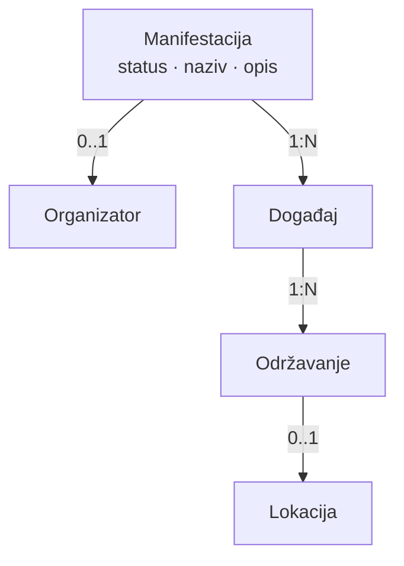
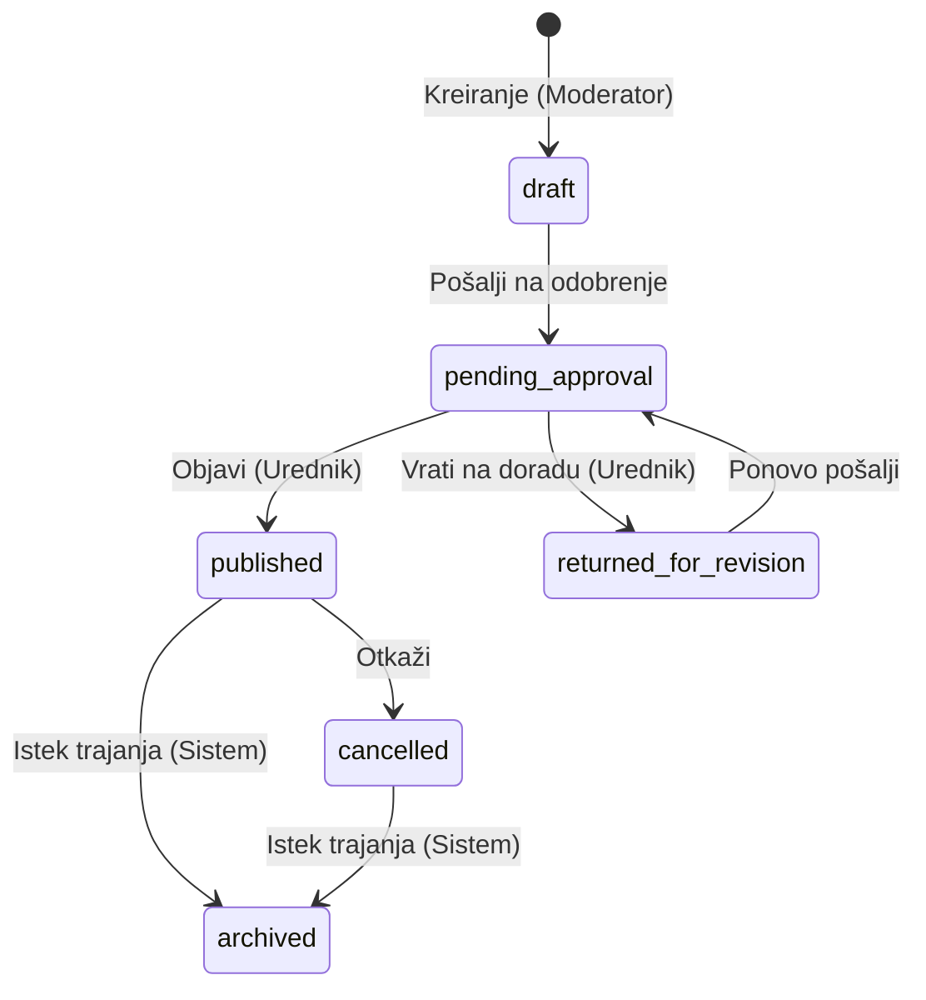
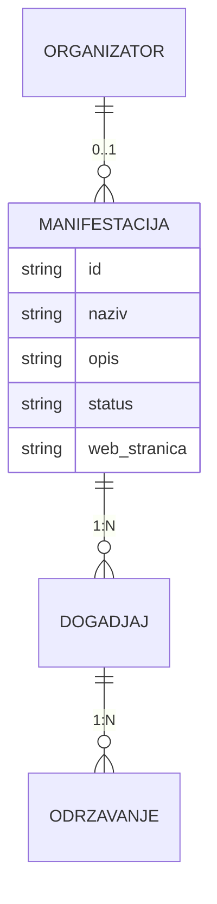

# Digital Kotor
# Technical Specification
## Manifestacija

**Feature ID:** FT-001  
**Oznaka dokumenta:** KK-TS-005  
**Funkcionalna cjelina:** Manifestacija  
**Modul:** Kalendar kulture  
**Status dokumenta:** Usvojen  
**Verzija:** 0.1.7
**Datum:** 2026-08-16

---

# Istorija verzija

| Verzija | Datum | Opis |
|---------|--------|------|
| 0.1 | 2026-07-29 | Initial draft. Prvi nacrt Technical Specification za funkcionalnu cjelinu Manifestacija. Usklađen sa BM-05 (BM-MF-01–BM-MF-18), FS §5.12 (BR-092–BR-101, BR-189–BR-201), BR-105/111/112, PO-MF-01–PO-MF-08, Feature Registry (FT-001 / plan TS-005), METHODOLOGY (M-TS-001–M-TS-005), TS-001, TS-003 i TS-004 (granice). Bez SQL, API, Laravel koda i bez novih poslovnih odluka van usvojenih PO-MF. |
| 0.1.1 | 2026-07-29 | PO-MF-09–PO-MF-12; zatvoreni N-MF-01–N-MF-04; N-MF-05 evidentiran kao napomena (centralna evidencija). Status dokumenta: Usvojen. |
| 0.1.2 | 2026-07-31 | Usklađenje javnog programa sa BM-MF-13 / BR-192 / PO-TS9-07D: Objavljeni + Otkazani (oznaka „Otkazano“); završeni ostaju. Detalj UI-ja na TS-009. Bez novih poslovnih odluka van usvojenih. |
| 0.1.3 | 2026-08-11 | 6B-DOC-01 status sync (PO-6B-01…03): potvrđene granice TS-005 prema TS-009 — Manifestacija nema sopstvenu ni agregiranu lokaciju; javni detalj Arhivirane MF ostaje portalni ugovor TS-009; bez posebne MF Arhive u V1. Bez SQL/API/Laravel detalja i bez izmjene poslovnih pravila. |
| 0.1.4 | 2026-08-11 | PO-6B-08/09 status sync: potvrđeno da javna vidljivost Otkazane MF i Event→MF anti-leak pripadaju TS-009 §6.7–§6.8; domain lifecycle ostaje — Otkazana do isteka perioda → Arhivirana; Objavljena→Arhivirana bez obavezne Otkazane međufaze; MF nema status Odgođena; MF/Event lifecycle nezavisni. Bez izmjene SQL/API/Laravel i bez novih portalnih UI pravila u TS-005. |
| 0.1.5 | 2026-08-12 | **PO-MF-WF-01–04 / BM PATCH-070 / FS PATCH-FS-070:** razdvojeni EDITOR-CREATED vs MODERATOR-CREATED lifecycle; porijeklo = `created_by` → uloga `kk_admin` (ne `organizer_id`); tehnički statusi KEEP (`draft`, `pending_approval`, `returned_for_revision`, `published`, …); §4 tokovi/matrica/autorizacija usklađeni. Bez nove kolone/migracije. |
| 0.1.6 | 2026-08-15 | **MED-01–MED-28:** naslovna fotografija Manifestacije `0..1`; upload samo kroz Manifestaciju; bez reuse-a; opciona; zaseban statički MF placeholder; prava i lock prate Manifestaciju; arhiva/otkaz ne brišu cover. V1 **nema** trajno brisanje Manifestacije (MED-19 se ne uvodi kao nova delete operacija). TS-008 SUPERSEDED. **DOCS CANONICALIZED / IMPLEMENTATION PENDING.** Bez izmjene koda. |
| 0.1.7 | 2026-08-16 | **MED documentation closeout:** MF cover upload/lifecycle/lock **IMPLEMENTATION COMPLETE / VERIFIED**. MED-19 i dalje **nije** MF destroy. Fallback resolver COMPLETE; **zaseban finalni MF placeholder fajl = MED-I4B DEFERRED** (privremeni compatibility path na globalni Event PNG; nije kanonizacija Event cover-a kao MF sadržaja). |
| — | 2026-08-17 | Administrativna migracija dokumentacionog ID-a na `KK-*` namespace. Poslovni i tehnički sadržaj, status i closeout ostaju nepromijenjeni. |

Napomena:

Ovo poglavlje služi isključivo za evidenciju razvoja dokumenta.  
Kod svake naredne verzije dodaje se novi red u tabeli.  
Ne mijenjaju se postojeći redovi.

---

# Svrha dokumenta

Ovaj dokument opisuje kako će se usvojeni Business Model i Functional Specification za funkcionalnu cjelinu **Manifestacija** tehnički realizovati u okviru FT-001 – Kalendar kulture.

KK-TS-005 obrađuje jednu logički zaokruženu funkcionalnu cjelinu unutar FT-001 i ne predstavlja kompletnu tehničku specifikaciju svih cjelina Feature-a FT-001.

Dokument:

* ne uvodi nova poslovna pravila;
* ne zamjenjuje Business Model niti Functional Specification;
* nije Technical Overview trenutne implementacije;
* nije Change Request;
* ne definiše SQL, migracije, Laravel kod niti konkretne API ugovore;
* ne projektuje KK-TS-003 (Događaj), KK-TS-004 (Održavanje), KK-TS-006–KK-TS-012 — samo granice.

Izvori istine za poslovna pravila:

* `docs/business-model/Business_Model_Kalendar_kulture_MASTER.md` (BM-05 BM-MF-01–BM-MF-20; BM-GL-11; BM-PK-04, BM-PK-10/11; BM-09 referenca; BM-14)
* `docs/functional-specifications/Functional-Specification.md` (§5.12 BR-092–BR-101, BR-189–BR-205; BR-105, BR-111, BR-112; §5.16 katalog Manifestacije)
* `docs/features/Feature-Registry.md` (FT-001)
* `docs/METHODOLOGY.md` (M-TS-001–M-TS-005)
* `docs/technical-specifications/Technical-Specification_Organizator.md` (KK-TS-001)
* `docs/technical-specifications/Technical-Specification_Dogadjaj.md` (KK-TS-003)
* `docs/technical-specifications/Technical-Specification_Odrzavanje.md` (KK-TS-004)

Usvojene Product Owner odluke: **PO-MF-01**–**PO-MF-12** i odluka da Manifestacija nema sopstvene kategorije / lokacije.

---

# Status razvoja Technical Specification

| Poglavlje | Status |
|-----------|--------|
| 1. Pregled funkcionalne cjeline | Usvojeno |
| 2. Arhitektonski principi | Usvojeno |
| 3. Tehnički model | Usvojeno |
| 4. Tokovi | Usvojeno |
| 5. Autorizacija i ovlašćenja | Usvojeno |
| 6. Model podataka | Usvojeno |
| 7. Validacije | Usvojeno |
| 8. Evidencija aktivnosti (Audit) | Usvojeno |
| 9. Integracije | Usvojeno |
| 10. Nefunkcionalni zahtjevi | Usvojeno |
| 11. Granice V1 (Out of Scope) | Usvojeno |
| 12. Otvorena pitanja | Usvojeno |
| 13. Matrica sljedivosti | Usvojeno |
| 14. Napomene za implementaciju | Usvojeno |

---

# Pravila upravljanja ovim dokumentom

1. KK-TS-005 pripada FT-001 – Kalendar kulture.
2. Tehnički sadržaj mora ostati usklađen sa usvojenim BM i FS.
3. Nova poslovna pravila se ne uvode kroz Technical Specification.
4. Sve što nije definisano u BM ili FS evidentira se kao **Otvoreno pitanje**.
5. Product Owner donosi poslovne odluke; ovaj dokument ih ne pretpostavlja.
6. Izmjene usvojenog sadržaja u narednim verzijama evidentiraju se novim redom u istoriji verzija.
7. Veze prema Događaju i Održavanju moraju ostati konzistentne sa KK-TS-003 i KK-TS-004.
8. Status **Odgođena** ne postoji na Manifestaciji.
9. Zatvorena pitanja N-MF-01–N-MF-04 ne vraćaju se u §12.
10. N-MF-05 nije Product Owner odluka — evidentiran je kao napomena o centralnoj evidenciji.

---

# 1. Pregled funkcionalne cjeline

Izvori

Business Model:
- BM-MF-01–BM-MF-20
- BM-GL-11

Functional Specification:
- §5.12 (BR-092–BR-101, BR-189–BR-205)
- BR-105, BR-111, BR-112
- §5.16 katalog Manifestacije

## 1.1 Svrha funkcionalne cjeline

Funkcionalna cjelina **Manifestacija** omogućava Kalendaru kulture da vodi programsku cjelinu koja grupiše Događaje pod zajedničkim nazivom i identitetom, sa sopstvenim životnim ciklusom, opcionim Organizatorom i izvedenim trajanjem.

Podjela odgovornosti:

```text
Manifestacija = programska cjelina koja grupiše Događaje
Događaj = sadržaj i programska stavka
Održavanje = konkretan termin izvođenja
```

## 1.2 Obuhvat dokumenta

Obuhvat KK-TS-005:

* tehnički model entiteta Manifestacija;
* životni ciklus i dozvoljeni statusni prelazi;
* urednički tok (nacrt, slanje, vraćanje, objava, uređivanje, dodavanje/uklanjanje Događaja, otkazivanje, automatsko arhiviranje);
* logički model autorizacije;
* konceptualni model podataka (bez SQL / migracija);
* lokalni audit tragovi i emisija ka centralnoj Evidenciji (granica KK-TS-012);
* javni prikaz (granica KK-TS-009);
* integracione granice prema KK-TS-001, KK-TS-003, KK-TS-004 i ostalim planiranim TS.

Van obuhvata:

* implementacija, SQL, migracije, Laravel kod, API;
* puni modeli Događaja, Održavanja, Lokacije, Kategorija, Portala, Newslettera, Evidencije;
* SEO slug kao poslovna funkcionalnost V1.

## 1.3 Zavisnosti

| Zavisnost | Uloga u odnosu na KK-TS-005 |
|-----------|---------------------------|
| KK-TS-001 Organizator / Moderator | Opcioni Organizator; aktivni kontekst Moderatora |
| KK-TS-003 Događaj | hasMany / belongsTo 0..1; uslovi objave; nezavisni lifecycle |
| KK-TS-004 Održavanje | Izvedeno trajanje i uslov arhive; bez direktne relacije |
| KK-TS-006 Lokacija | Samo posredno preko Održavanja |
| KK-TS-007 Kategorije | Samo izvedeno iz Objavljenih Događaja |
| Naslovna fotografija (MED / BM-09) | Opciona naslovna `0..1`; upload samo kroz Manifestaciju |
| KK-TS-009 Javni portal | Prikaz Objavljene MF; program: Objavljeni + Otkazani (oznaka); detalj UI → KK-TS-009 |
| KK-TS-010 Urednički portal | Operativni prostor |
| KK-TS-012 Evidencija | Prima poslovno značajne događaje (katalog — otvoreno ako nije u FS) |

## 1.4 Veze sa BM, FS, FT-001

```
FT-001 Kalendar kulture
  → BM-05 Manifestacija (BM-MF-01–BM-MF-20)
  → FS §5.12 (BR-092–BR-101, BR-189–BR-201)
  → PO-MF-01–PO-MF-12
  → KK-TS-005 (ovaj dokument)
  → granice: KK-TS-001, KK-TS-003, KK-TS-004
```

---

# 2. Arhitektonski principi

Izvori

Business Model:
- BM-MF-01–BM-MF-20

Functional Specification:
- BR-092, BR-189–BR-205

## 2.1 Manifestacija kao programska cjelina

Manifestacija grupiše Događaje; ne zamjenjuje Događaj niti Održavanje.

## 2.2 Nezavisni životni ciklusi

Promjena statusa Manifestacije ne mijenja automatski statuse Događaja ni Održavanja (PO-MF-06, BM-MF-15, BR-194).

## 2.3 Opcioni Organizator

Organizator nije obavezan. Platformska Manifestacija (bez Org.) upravlja Urednik (PO-MF-02, BM-MF-12, BR-190).

## 2.4 Bez sopstvenih kategorija, lokacija i održavanja

Kategorije → Događaj. Lokacija → Održavanje. Održavanje → Događaj (PO-MF / BM-MF-16).

## 2.5 Javna vidljivost događaja u programu

Program na javnom portalu prikazuje Objavljene Događaje; Otkazani Događaji ostaju prikazani uz oznaku „Otkazano“; završeni Objavljeni ostaju prikazani (PO-MF-04, BM-MF-13, BR-192, PO-TS9-07D). Nacrti i događaji na odobrenju / vraćeni na doradu nisu javno vidljivi. Detalj rasporeda i UI: KK-TS-009.

## 2.6 Bez statusa Odgođena

Odgađanje pripada Održavanju. Manifestacija ostaje Objavljena i kada su održavanja odgođena (PO-MF-01).

## 2.7 Modularnost

KK-TS-005 ne projektuje druge cjeline; integracije su ugovori granica (§9).

---

# 3. Tehnički model

Izvori

Business Model:
- BM-MF-01–BM-MF-20

Functional Specification:
- BR-092–BR-101, BR-189–BR-205

Tehnički model je logički. Ne definiše tabele, ORM klase ni fizičko skladištenje.

## 3.1 Entitet: Manifestacija

**Odgovornost**

Poslovni entitet koji predstavlja programsku cjelinu Kalendara kulture: grupiše Događaje, nosi sopstveni status, opcionog Organizatora i sopstvene podatke (naziv, opis, fotografija, eksterni URL).

**Životni ciklus (statusi)**

```
Nacrt → Na odobrenju → Objavljena → Otkazana → Arhivirana
                ↘ Vraćena na doradu ↗
```

Statusi: Nacrt | Na odobrenju | Vraćena na doradu | Objavljena | Otkazana | Arhivirana.  
**Nema** statusa Odgođena.

**Veze**

| Veza | Kardinalnost | Napomena |
|------|--------------|----------|
| Događaj | 1 : N (hasMany) | Događaj 0..1 Manifestacija |
| Organizator | 0..1 | Opciono |
| Održavanje | — | Nema direktne veze |
| Lokacija | — | Nema direktne veze |
| Kategorija | — | Nema direktne veze; izvedeno prikazom |

## 3.2 Poslovni kontekst — odnosi



## 3.3 Izvedeno trajanje

Početak / završetak Manifestacije sistem izvodi iz **važećih** održavanja Objavljenih Događaja (PO-MF-10, BM-MF-05, BR-096, BR-203). Ručni unos nije poslovni zahtjev.

U izračun ulaze održavanja koja:

* pripadaju Objavljenim Događajima Manifestacije;
* nijesu Otkazana;
* nijesu Odgođena bez potvrđenog novog termina;
* imaju definisan datum (vrijeme kada je uneseno; cjelodnevna po datumu).

Početak = najranije važeće. Završetak = najkasnije važeće. Nakon potvrde novog termina, odgođeno održavanje ponovo ulazi.

## 3.4 Agregat i odgovornosti

| Komponenta (logička) | Odgovornost |
|----------------------|-------------|
| Entitet Manifestacija | Podaci, status, opcioni Org., veze na Događaje |
| Usluga statusnih prelaza | Dozvoljene tranzicije |
| Izračun trajanja | Min/max termina održavanja |
| Signal arhive | Automatski prelaz u Arhivirana |

---

# 4. Tokovi

Izvori

Business Model:
- BM-MF-02, BM-MF-06–BM-MF-07, BM-MF-09–BM-MF-15, BM-MF-21–BM-MF-22

Functional Specification:
- BR-093, BR-097–BR-098, BR-100–BR-101, BR-189–BR-196, BR-201, BR-321–BR-324

## 4.0 Porijeklo toka (PO-MF-WF-03)

Tehnički kriterijum: `created_by` → korisnik → uloga.

| Porijeklo | Uslov | Lifecycle |
|-----------|-------|-----------|
| **EDITOR-CREATED** | creator.role = `kk_admin` | `draft` → `published` (direktna objava) |
| **MODERATOR-CREATED** | nije EDITOR-CREATED | `draft` → `pending_approval` → `published` **ili** `returned_for_revision` → (edit) → `pending_approval` → … |

**Ne** koristiti `organizer_id === null` kao jedini kriterijum. Dodjela Organizatora EDITOR-CREATED zapisu ne mijenja porijeklo.

Tehnički statusi (DB) ostaju: `draft`, `pending_approval`, `returned_for_revision`, `published`, `cancelled`, `archived`. UI oznaka „U pripremi“ može mapirati na `draft` za urednički tok; **ne** uvodi se novi DB status.

## 4.1 Lifecycle dijagrami

### 4.1.1 EDITOR-CREATED

```mermaid
stateDiagram-v2
  [*] --> draft : Kreiranje (kk_admin)
  draft --> published : Direktna objava (Urednik; BR-191)
  published --> cancelled : Otkaži
  published --> archived : Istek trajanja (Sistem)
  cancelled --> archived : Istek trajanja (Sistem)
```

Zabranjeno u redovnom toku: `draft` → `pending_approval`; self-return.

### 4.1.2 MODERATOR-CREATED



Napomena: Otkazana → Arhivirana usklađeno sa PO-MF-11 / BR-204.

## 4.2 Matrica statusa

| Status (tehnički) | UI | Svrha | Ulaz | Izlaz | Ko / napomena |
|-------------------|----|-------|------|-------|---------------|
| **draft** | Nacrt / U pripremi | Radna verzija | Kreiranje; (Editor: samo create/save) | EDITOR: `published`; MOD: `pending_approval` | Kreator po porijeklu |
| **pending_approval** | Na odobrenju | Čeka odluku | MOD submit / resubmit | `published`; `returned_for_revision` | Samo MODERATOR-CREATED |
| **returned_for_revision** | Vraćena na doradu | Potrebne izmjene | Urednik return | `pending_approval` | Samo MODERATOR-CREATED |
| **published** | Objavljena | Javna; ≥1 Objavljen DG | Direct publish (Editor) ili approve (Mod pending) | `cancelled`; `archived` | Urednik / Sistem |
| **cancelled** | Otkazana | Otkazana do isteka | Otkaz | `archived` | Mod (Org.) / Urednik; Sistem |
| **archived** | Arhivirana | Istorija | Sistem | — | Sistem |

## 4.3 Kreiranje i Nacrt

1. Moderator kreira u kontekstu svog Organizatora, ili Urednik kreira sa Org. ili bez Org. (BR-100).
2. Nacrt može biti bez Događaja (BR-093).
3. Uređivanje nacrta: naziv, opis, Org. (opciono), fotografija, URL, povezivanje Događaja.
4. `created_by` se postavlja pri create i određuje porijeklo (BR-321).

## 4.4 Slanje na odobrenje (samo MODERATOR-CREATED)

1. Validacija: ≥1 Događaj (BM-MF-02, BR-101); porijeklo ≠ EDITOR-CREATED (BR-324).
2. Status → **pending_approval**.
3. EDITOR-CREATED: domain odbija submit.

## 4.5 Vraćanje na doradu i objava

1. Urednik vraća **samo** MODERATOR-CREATED `pending_approval` → **returned_for_revision** (BR-195 / BR-323).
2. Urednik objavljuje MODERATOR-CREATED pending samo ako BR-191 → **published**.
3. Urednik direktno objavljuje EDITOR-CREATED `draft` ako BR-191 → **published** (BR-322); isti publish gate.
4. EDITOR-CREATED self-return zabranjen.

## 4.6 Uređivanje objavljene i program

1. Podaci Manifestacije mogu se uređivati u skladu sa ovlašćenjima (BR-196).
2. Dodavanje / uklanjanje Događaja: status ostaje **Objavljena**; bez ponovnog odobravanja (PO-MF-03, BR-193); zabranjeno uklanjanje/premještanje posljednjeg Objavljenog Događaja (PO-MF-09, BR-202).
3. Novi Događaj prolazi sopstveni urednički tok prije javne vidljivosti.
4. Premještanje Događaja između Manifestacija: BR-201 / BR-202.

## 4.7 Otkazivanje

Status → **Otkazana**. Moderator u aktivnom kontekstu Organizatora MF može otkazati tu MF; Urednik bilo koju; Admin platforme nema redovnu ulogu (PO-MF-12, BR-098). Događaji i Održavanja ne mijenjaju status (BR-194).

## 4.8 Automatsko arhiviranje

Sistem postavlja **Arhivirana** nakon isteka planiranog trajanja — iz **Objavljena** i iz **Otkazana** (PO-MF-11, BM-MF-06, BR-097, BR-204). Ne arhivira Događaje ni Održavanja. Otkazana nije obavezna međufaza za svaku Manifestaciju. Javni portalni prikaz Otkazane / Arhivirane MF: KK-TS-009 §6.6–§6.7 (PO-6B-03 / PO-6B-08).

---

# 5. Autorizacija i ovlašćenja

Izvori

Business Model:
- BM-MF-09, BM-MF-12, BM-MF-21–BM-MF-22
- BM-02 / BM-03 (uloge)

Functional Specification:
- BR-100, BR-190, BR-195–BR-196, BR-321–BR-324

Organizator (entitet) ne izvršava radnje.

| Radnja | Moderator (aktivan Org. kontekst) | Urednik | Administrator platforme |
|--------|-----------------------------------|---------|-------------------------|
| Kreirati MF sa Org. | Da — svoj Org. | Da | Ne |
| Kreirati MF bez Org. | Ne | Da | Ne |
| Uređivati Nacrt / Vraćena na doradu | Da — MF svog Org. (MOD-CREATED) | Da | Ne |
| Slanje na odobrenje | Da — MOD-CREATED MF svog Org. | Ne — EDITOR-CREATED; ne self-submit | Ne |
| Direktna objava draft→published | Ne | Da — samo EDITOR-CREATED + BR-191 | Ne |
| Vraćanje / odobrenje pending | Ne | Da — samo MOD-CREATED pending | Ne |
| Dodati / ukloniti Događaj (Objavljena) | Da — MF svog Org. | Da | Ne |
| Otkaži | Da — MF svog Org. (aktivan kontekst) | Da — bilo koja | Ne — nema redovnu poslovnu ulogu |
| Automatska arhiva | Ne | Ne | Ne — Sistem |
| Direktni pristup centralnoj Evidenciji | Ne | Ne | Da (FT-003 / KK-TS-012) |

Napomena: platformska Manifestacija bez Organizatora — otkaz isključivo Urednik.

---

# 6. Model podataka

Izvori

Business Model:
- BM-MF-08, BM-MF-12, BM-MF-16–BM-MF-18

Functional Specification:
- BR-099, BR-190, BR-197–BR-200

Konceptualni model. Bez SQL / migracija / fizičkih tipova.

## 6.1 Dijagram odnosa



## 6.2 Potvrđeni atributi

| Atribut / svojstvo | Obrazloženje | Izvor |
|--------------------|--------------|-------|
| Identitet | Jedinstvena identifikacija | tehnička nužnost |
| Naziv | Obavezan poslovni naziv | BM-MF-08 |
| Opis | Sopstveni opis | BM-MF-08 |
| Status | Jedan od šest statusa | BM-MF-11, BR-189 |
| Organizator (ref.) | 0..1 | BM-MF-12, BR-190 |
| Naslovna fotografija | 0..1, opciono; upload u kontekstu MF; bez reuse-a; interni `cover_media_id` nije poslovni objekat | BM-MF-08, BR-197, MED-02–MED-04 |
| Web stranica / Više informacije | Opcioni eksterni URL | BM-MF-18, BR-198 |
| Početak / završetak | Izvedeno, ne ručni unos | BM-MF-05 |
| Audit / vremenske oznake | U skladu sa standardom KK-TS-003/004 | tehnička nužnost |

**Nije atribut V1:** SEO slug; kategorija; lokacija; direktna veza na Održavanje.

## 6.3 Relacije

* `Manifestacija` hasMany `Događaj`
* `Događaj` belongsTo optional `Manifestacija` (0..1)
* `Manifestacija` belongsTo optional `Organizator`
* Nema `Manifestacija`–`Održavanje`

Implementacija mora spriječiti da Događaj pripada više od jedne Manifestacije.

## 6.4 Integritet

* Status samo iz dozvoljenog skupa.
* Objava samo uz BR-191.
* Javni prikaz programa: Objavljeni Događaji; Otkazani uz oznaku „Otkazano“ (BM-MF-13 / BR-192).
* URL ako postoji — validan (BR-200).

---

# 7. Validacije

Izvori

Business Model:
- BM-MF-02, BM-MF-13, BM-MF-14, BM-MF-18

Functional Specification:
- BR-093, BR-101, BR-191–BR-193, BR-197–BR-200

| Pravilo | Trenutak | Izvršilac | Ishod |
|---------|----------|-----------|-------|
| Nacrt može biti bez Događaja | Kreiranje / čuvanje | Sistem | Dozvoljeno |
| ≥1 Događaj | Slanje na odobrenje | Sistem | Blokada |
| ≥1 Događaj AND ≥1 Objavljen | Objava | Sistem | Blokada |
| Objavljena zadržava ≥1 Objavljen DG | Uklanjanje / premještanje | Sistem | Blokada + poruka |
| Događaj već u drugoj MF | Dodavanje / premještanje | Sistem | Blokada ili premještanje po BR-201 |
| Uklanjanje ne briše Događaj | Uklanjanje | Sistem | Samo raskid veze |
| Validan URL ako unesen | Čuvanje | Sistem | Blokada |
| Najviše jedna naslovna fotografija | Upload | Sistem | Blokada |
| Bez statusa Odgođena | Statusni prelaz | Sistem | Odbijanje |

---

# 8. Evidencija aktivnosti (Audit)

Izvori

Business Model:
- BM-14 (referenca)

Functional Specification:
- §5.16 (katalog Manifestacije nije eksplicitno usvojen — granica)

Lokalni tragovi (kao KK-TS-003/004) za najmanje:

* kreiranje;
* slanje na odobrenje;
* vraćanje na doradu;
* odobrenje / objava;
* otkazivanje;
* automatsko arhiviranje (Sistem);
* promjena Organizatora;
* dodavanje / uklanjanje / premještanje Događaja;
* promjena naslovne fotografije;
* promjena eksternog URL-a.

Centralna Evidencija: Manifestacija je ravnopravan entitet; emisija prema katalogu Manifestacije u FS §5.16 (BM-MF-20, BR-205). N-MF-05 nije Product Owner odluka.

---

# 9. Integracije

| Dokument | Ugovor granice |
|----------|----------------|
| **KK-TS-001** | Opcioni Org.; kontekst Moderatora |
| **KK-TS-003** | Veza 0..1; uslov Objavljen za objavu MF; nezavisni lifecycle |
| **KK-TS-004** | Trajanje i arhiva iz održavanja; bez direktne relacije |
| **KK-TS-006** | Lokacije samo preko Održavanja Objavljenih Događaja |
| **KK-TS-007** | Izvedene kategorije iz Objavljenih Događaja |
| **KK-TS-008** | **SUPERSEDED / HISTORICAL** — nije aktivni SSOT |
| **KK-TS-009** | Javni prikaz: naziv, opis, naslovna ili **zasebni statički MF placeholder**, Org. ako postoji, URL, izvedeno trajanje; program: Objavljeni + Otkazani (oznaka „Otkazano“) + javna održavanja/lokacije; UI detalj → KK-TS-009 |
| **KK-TS-010** | Uredničke radnje §4–§5 |
| **KK-TS-012** | Audit emisije (nakon kataloga) |

### 9.1 Javni prikaz (sažetak)

Prikazuje se: naziv; opis; naslovna fotografija ili placeholder; Organizator kada postoji; Web stranica / Više informacije kada postoji; izvedeno trajanje kada je utvrdivo; u programu Objavljeni Događaji (završeni ostaju) i Otkazani Događaji uz oznaku „Otkazano“, sa javnim terminima i lokacijama. Manifestacija nema sopstvenu ni agregiranu lokaciju na kartici/osnovnom detalju. Detalj UI: KK-TS-009.

Ne prikazuje se: Nacrti; događaji Na odobrenju / Vraćeni na doradu; interni urednički statusi i podaci; zbirna/agregirana lokacija Manifestacije.

### 9.2 Urednički portal (sažetak)

Pregled; kreiranje; uređivanje; povezivanje/uklanjanje Događaja; fotografija; eksterni URL; slanje; vraćanje; odobravanje/objava; otkazivanje; statusi i validacione greške.

---

# 10. Nefunkcionalni zahtjevi

## 10.1 Integritet

* Zabraniti M:N Događaj–Manifestacija.
* Zabraniti javni prikaz neobjavljenih Događaja u programu MF.
* Validacija URL-a. Sigurno upravljanje naslovnom fotografijom prema MED / KK-TS-010 (KK-TS-008 SUPERSEDED).

## 10.2 Autorizacija

* Pristup po ulozi i vlasništvu / platformskoj MF.
* Zaštita od direktnog pristupa nedozvoljenim zapisima.

## 10.3 Konzistentnost sa KK-TS-003/004

* Ne mijenjati lifecycle Događaja ni Održavanja.
* Ne uvoditi Odgođena na MF.

## 10.4 Proširivost

* Bez ugradnje SEO slug-a u V1.
* Bez sopstvenih kategorija/lokacija.

---

# 11. Granice V1 (Out of Scope)

1. SQL, API, Laravel, migracije.
2. SEO slug kao poslovna funkcionalnost.
3. Sopstvene kategorije / lokacije / održavanja Manifestacije.
4. Automatsko preuzimanje fotografije Događaja.
5. Automatsko otkazivanje / arhiviranje Događaja i Održavanja pri otkazu / arhivi MF.
6. Status Odgođena na Manifestaciji.
7. M:N veza Događaj–Manifestacija.
8. Ponovno odobravanje MF nakon svakog dodavanja/uklanjanja Događaja.
9. Zahtjev da svi Događaji budu Objavljeni prije objave MF (dovoljan je ≥1 Objavljen).

---

# 12. Otvorena pitanja

Nema otvorenih Product Owner pitanja za KK-TS-005.

Zatvoreno usvojenim odlukama:

* **N-MF-01** → PO-MF-09 (trajni uslov ≥1 Objavljen Događaj; radnja se odbija, bez automatske promjene statusa).
* **N-MF-02** → PO-MF-10 (važeća održavanja Objavljenih Događaja).
* **N-MF-03** → PO-MF-11 (Otkazana → Arhivirana nakon isteka trajanja).
* **N-MF-04** → PO-MF-12 (ovlašćenja otkaza).

Napomena (**N-MF-05**, nije Product Owner odluka): Manifestacija se vodi u centralnoj Evidenciji aktivnosti (§5.16 katalog Manifestacije; BM-MF-20; BR-205).

---

# 13. Matrica sljedivosti

| KK-TS-005 | BM | FS | PO | FT | Ostalo |
|--------|----|----|----|----|--------|
| §1 Pregled | BM-MF-01 | BR-092 | PO-MF-06 | FT-001 | KK-TS-003, KK-TS-004 |
| §2 Principi | BM-MF-11–16 | BR-189–199 | PO-MF-01–02, 04, 06 | FT-001 | |
| §3 Model / trajanje | BM-MF-03–05, 08, 12, 19 | BR-094–096, 190, 203 | PO-MF-02, 05, 07–08, 10 | FT-001 | |
| §4 Tokovi | BM-MF-02, 06–07, 10, 13–15, 19 | BR-101, 189–196, 202–204 | PO-MF-01, 03, 04, 09, 11 | FT-001 | |
| §5 Autorizacija | BM-MF-07, 09, 12 | BR-098, 100, 190 | PO-MF-02, 12 | FT-001 | KK-TS-001 |
| §6 Podaci | BM-MF-08, 16–18 | BR-099, 197–200 | PO-MF-07–08 | FT-001 | MED / KK-TS-010 (KK-TS-008 SUPERSEDED) |
| §7 Validacije | BM-MF-02, 13–14, 19 | BR-191–193, 200–202 | PO-MF-03–04, 09 | FT-001 | |
| §8 Audit | BM-MF-20, BM-14 | BR-205, §5.16 | — (N-MF-05 napomena) | FT-003 | KK-TS-012 |
| §9 Integracije | BM-PK-*, BM-MF-04 | BR-105, 111–112, 192 | PO-MF-04 | FT-001 | KK-TS-003–KK-TS-010 |
| §11 Out of Scope | BM-MF-16 | BR-199 | PO-MF-01, 05–08 | FT-001 | |
| §12 Otvorena | — | — | zatvoreno PO-MF-09–12 | FT-001 | |

---

# 14. Napomene za implementaciju

1. Događaj: jedna opciona referenca na Manifestaciju (unique constraint po Događaju).
2. Objava MF: provjera ≥1 Objavljen Događaj u trenutku odobrenja.
3. Javni API/view programa: `status_dogadjaja IN (Objavljen, Otkazan)`; Otkazani sa oznakom „Otkazano“ (detalj UI: KK-TS-009).
4. Trajanje: izračun u upitu/servisu, ne kao ručna polja za unos.
5. Placeholder fotografije Manifestacije: zaseban statički Git-verzionisani resurs (MED-09 / MED-27); nije `CulturalMedia`. **MED-I4B:** finalni dedicated MF placeholder fajl = DEFERRED / NON-BLOCKING; resolver COMPLETE (privremeni compatibility path na globalni Event PNG dok I4B ne isporuči zaseban fajl).
6. Ne uvoditi trajno brisanje Manifestacije u V1 zbog naslovne fotografije (MED-19 se ne primjenjuje dok delete MF ne postoji).
7. Ne uvoditi slug polje u V1 šemu zbog poslovnog zahtjeva.
8. Odstupanja trenutne implementacije vode se u Technical Overview, ne u KK-TS-005.
