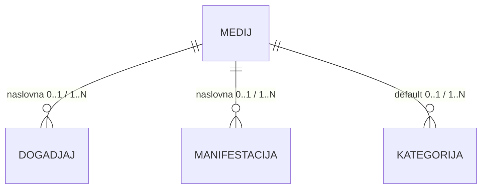

# Digital Kotor
# Technical Specification
## Mediji (istorijski)

**Feature ID:** FT-001  
**Oznaka dokumenta:** TS-008  
**Funkcionalna cjelina:** Mediji (istorijski)
**Modul:** Kalendar kulture
**Status dokumenta:** **SUPERSEDED / HISTORICAL / ZASTARJELO**
**Verzija:** 0.1.1
**Datum:** 2026-08-15

> **Ovaj dokument nije aktivni SSOT za V1.**
>
> TS-008 (v0.1.0, Usvojen 2026-07-31) opisivao je samostalnu poslovnu cjelinu **Mediji**. Taj model je **supersedovan** PO paketom **MED-01–MED-28** (BM PATCH-075 / FS PATCH-FS-075).
>
> Status **Usvojen** kao aktivna V1 funkcionalna cjelina **više ne važi**.
>
> Kanonska pravila su raspoređena u:
>
> * **TS-003** — naslovna fotografija Događaja (`0..1`, upload u kontekstu, lifecycle);
> * **TS-005** — naslovna fotografija Manifestacije (`0..1`, MF placeholder);
> * **TS-007** — statičke Git kategorijske fotografije (nije `CulturalMedia`);
> * **TS-009** — javni fallback i `object-fit: cover`;
> * **TS-010** — UX naslovne fotografije (nema ekrana Mediji);
> * **TS-012** — samo audit kompatibilnost (`TS12-MF-11` / `mf.cover.change` KEEP; bez novih `media.*` kodova).
>
> Poglavlja 1–14 ispod ostaju **istorijski zapis** TS8-01–TS8-09 / BM-MD-01–17. Ne koristiti ih kao aktivnu specifikaciju za implementaciju.
>
> **PO ADOPTED / DOCS CANONICALIZED / IMPLEMENTATION PENDING** za MED paket. Ovaj dokument **ne** tvrdi da je MED implementacija COMPLETE.

---

# Istorija verzija

| Verzija | Datum | Opis |
|---------|--------|------|
| 0.1.0 | 2026-07-31 | Prva kompletna tehnička specifikacija za Medije. Ugrađene usvojene Product Owner odluke TS8-01–TS8-09 i usklađene sa BM-09 (PATCH-044), FS §5.11 (PATCH-FS-046) i TS pravilima projekta. Bez SQL, API ugovora, Laravel koda i migracija. |
| 0.1.1 | 2026-08-15 | **SUPERSEDED / HISTORICAL:** TS-008 povučen kao aktivni SSOT. Kanonski model = MED-01–MED-28 (BM PATCH-075 / FS PATCH-FS-075). Nova pravila u TS-003, TS-005, TS-007, TS-009, TS-010; TS-012 samo audit kompatibilnost. Istorijski sadržaj poglavlja 1–14 zadržan radi sljedivosti. **IMPLEMENTATION PENDING** za MED. Bez izmjene koda. |

---

# Svrha dokumenta

**Ovaj dokument je istorijski zapis.** Nije aktivni SSOT za implementaciju.

Do v0.1.0 opisivao je tehničku realizaciju tadašnje funkcionalne cjeline **Mediji** (TS8-01–TS8-09). Taj model je **SUPERSEDED** paketom **MED-01–MED-28**.

Poglavlja 1–14 ispod ostaju radi sljedivosti. Ne koristiti ih kao aktivnu specifikaciju.

Kanonski SSOT: BM PATCH-075, FS PATCH-FS-075, TS-003, TS-005, TS-007, TS-009, TS-010; TS-012 samo audit kompatibilnost.

Istorijski izvori (v0.1.0):

* BM-09 BM-MD-01–BM-MD-17, BM-GL-15, BM-PK-12 (sada SUPERSEDED / zamijenjeni PATCH-075)
* FS §5.11 BR-086–BR-091, BR-237–BR-254 (SUPERSEDED PATCH-FS-075)
* TS8-01 .. TS8-09

---

# Status razvoja Technical Specification

**Dokument:** SUPERSEDED / HISTORICAL. Poglavlja ispod su istorijski Usvojena za TS8 model i **nisu** aktivni V1 cilj.

| Poglavlje | Status |
|-----------|--------|
| 1. Pregled funkcionalne cjeline | Istorijski Usvojeno — SUPERSEDED |
| 2. Arhitektonski principi | Istorijski Usvojeno — SUPERSEDED |
| 3. Tehnički model | Istorijski Usvojeno — SUPERSEDED |
| 4. Tokovi | Istorijski Usvojeno — SUPERSEDED |
| 5. Autorizacija i ovlašćenja | Istorijski Usvojeno — SUPERSEDED |
| 6. Model podataka | Istorijski Usvojeno — SUPERSEDED |
| 7. Validacije | Istorijski Usvojeno — SUPERSEDED |
| 8. Evidencija aktivnosti (Audit) | Istorijski Usvojeno — SUPERSEDED |
| 9. Integracije | Istorijski Usvojeno — SUPERSEDED |
| 10. Nefunkcionalni zahtjevi | Istorijski Usvojeno — SUPERSEDED |
| 11. Granice V1 (Out of Scope) | Istorijski Usvojeno — SUPERSEDED |
| 12. Otvorena pitanja | Istorijski Usvojeno — SUPERSEDED |
| 13. Matrica sljedivosti | Istorijski Usvojeno — SUPERSEDED |
| 14. Napomene za implementaciju | Istorijski Usvojeno — SUPERSEDED |

---

# Pravila upravljanja ovim dokumentom

1. TS-008 je **historijski** dokument FT-001. Nije aktivni SSOT.
2. Istorijski sadržaj se ne briše radi sljedivosti.
3. Nova poslovna pravila se **ne** uvode kroz TS-008. Kanonski model = MED-01–MED-28.
4. Izmjene ovog dokumenta smiju samo održavati supersession/status, ne reaktivirati TS8 model.

---

# 1. Pregled funkcionalne cjeline

> **Istorijski TS8 sadržaj (SUPERSEDED).** Ne koristiti kao aktivnu specifikaciju.

## 1.1 Svrha funkcionalne cjeline

Medij je **samostalan poslovni entitet** tipa **Fotografija**, **zajednički platformski resurs** bez poslovnog vlasnika.

U V1 medij nosi tačno jednu namjenu iz zatvorenog kataloga i povezuje se sa događajima, manifestacijama ili kategorijama u skladu sa namjenom.

## 1.2 Obuhvat dokumenta

TS-008 obuhvata:

* entitet Medij i poslovne veze;
* zatvoreni katalog namjena;
* kardinalnosti i hijerarhiju prikaza (fallback);
* tip Fotografija, formate, veličinu i validaciju;
* lifecycle Aktivan / Neaktivan (bez soft delete);
* ovlašćenja Moderator / Urednik;
* vidljivost i pretragu;
* poslovne i tehničke metapodatke;
* dupli upload;
* granice V1.

## 1.3 Zavisnosti

| Zavisnost | Uloga u odnosu na TS-008 |
|-----------|---------------------------|
| TS-001 Organizator / Moderator | Organizacioni kontekst Moderatora; vidljivost medija |
| TS-003 Događaj | Veza 0..1 naslovna fotografija; hijerarhija prikaza |
| TS-005 Manifestacija | Veza 0..1 naslovna fotografija; placeholder MF |
| TS-007 Kategorije i oznake | Veza 0..1 podrazumijevana fotografija kategorije |
| TS-009 Javni portal | Potrošač prikaza fotografija |
| TS-010 Urednički portal | UI za uređivanje entiteta i upravljanje medij-zapisom |
| TS-012 Evidencija aktivnosti | Audit poslovno značajnih radnji nad medijima |

---

# 2. Arhitektonski principi

## 2.1 Samostalan entitet bez vlasnika

Medij nije prilog koji pripada isključivo jednom entitetu. Nema poslovnog vlasnika. Creator služi auditu/istoriji/logovima.

## 2.2 Namjena ≠ tip ≠ format

* Poslovni tip V1: Fotografija.
* Namjena: zatvoreni katalog (tri vrijednosti).
* Format / MIME / ekstenzija: tehnička validacija prijema.

## 2.3 Upload kroz uređivanje entiteta

Ne postoji poseban ekran isključivo za upload. Upload se vrši tokom uređivanja događaja, manifestacije ili kategorije.

## 2.4 Fallback nije veza

Hijerarhija prikaza događaja ne kreira poslovnu vezu događaj–medij za kategorijski default niti za tehnički placeholder.

## 2.5 Soft delete se ne koristi

Statusi: Aktivan / Neaktivan. Trajno brisanje samo bez poslovnih veza.

---

# 3. Tehnički model

## 3.1 Entitet Medij

Konceptualno sadrži:

* stabilni identifikator;
* poslovnu namjenu (tačno jedna);
* status (Aktivan / Neaktivan);
* poslovne metapodatke (BM-MD-14 / BR-246);
* tehničke metapodatke (BM-MD-15 / BR-247);
* referencu na fizičku datoteku / storage putanju;
* kreatora (audit);
* vremenske oznake.

## 3.2 Zatvoreni katalog namjena

| Namjena | Povezivi entiteti | Kardinalnost entitet → medij | Kardinalnost medij → entiteti |
|---------|-------------------|------------------------------|-------------------------------|
| Naslovna fotografija događaja | Događaj | 0..1 | 1..N događaja |
| Naslovna fotografija manifestacije | Manifestacija | 0..1 | 1..N manifestacija |
| Podrazumijevana fotografija kategorije | Kategorija | 0..1 | 1..N kategorija |

Jedan medij-zapis ima tačno jednu namjenu. Ista fizička datoteka u dvije namjene = dva medij-zapisa.

## 3.3 Hijerarhija prikaza događaja

```text
1. Direktna naslovna fotografija događaja (poslovna veza 0..1)
2. Podrazumijevana fotografija primarne kategorije (nije veza događaja)
3. Globalni tehnički placeholder događaja (statički UI resurs)
```

## 3.4 Placeholderi

* Globalni tehnički placeholder događaja — nije medij-zapis.
* Placeholder manifestacije — nije medij-zapis.
* Format placeholdera definiše implementacija; nije dio korisničkog allowlist-a uploada.

## 3.5 Formati i veličina

| Stavka | Vrijednost |
|--------|------------|
| Tip | Fotografija |
| Formati | JPEG, PNG, WebP |
| Ekstenzije | `.jpg`, `.jpeg`, `.png`, `.webp` |
| MIME | `image/jpeg`, `image/png`, `image/webp` |
| Max veličina | 5 MB (5120 KB) |
| Zabranjeno | SVG, GIF, BMP, TIFF, HEIC/HEIF, animacije, ostalo |

Serverska validacija: sadržaj ↔ MIME ↔ ekstenzija; čitljiva slika; max 5 MB.

Tehničko ograničenje max dimenzija/piksela dozvoljeno kao zaštita resursa (nije novo poslovno pravilo).

V1 bez obaveznog resize/thumbnail/kompresije/konverzije. Dozvoljena bezbjedna normalizacija metapodataka bez izmjene poslovnog sadržaja fotografije.

---

# 4. Tokovi

## 4.1 Upload tokom uređivanja entiteta

1. Korisnik uređuje događaj / manifestaciju / kategoriju.
2. Bira upload nove fotografije ili povezivanje postojećeg medija (u skladu sa vidljivošću).
3. Sistem validira format/MIME/ekstenziju/veličinu/sadržaj.
4. Provjera identične datoteke (dupli upload): upozorenje → nastavi ili koristi postojeći.
5. Kreira se medij-zapis (ako novi) sa namjenom koja odgovara kontekstu uređivanja.
6. Uspostavlja se poslovna veza 0..1 na entitetu (zamjena prethodne veze ako postoji).

## 4.2 Uklanjanje veze

1. Korisnik uklanja vezu sa entiteta.
2. Briše se samo veza.
3. Medij i fajl ostaju.
4. Za događaj: prikaz prelazi na fallback hijerarhiju.

## 4.3 Deaktivacija / reaktivacija (samo Urednik)

1. Urednik postavlja status Neaktivan / Aktivan.
2. Neaktivan: bez novih veza; postojeće veze i prikaz ostaju.
3. Fajl i veze se ne brišu.

## 4.4 Trajno brisanje (samo Urednik)

1. Ponovna provjera: nema poslovnih veza; ostali uslovi.
2. Ako uslovi nisu ispunjeni → odbijanje.
3. Ako jesu → trajno brisanje zapisa i fizičkog fajla.
4. Soft delete se ne koristi.

## 4.5 Pretraga

* Moderator: naziv, opis; opseg = organizacioni kontekst.
* Urednik: kompletan katalog; filteri status, namjena, organizator, kreator.
* Prikaz: kartice; navigacija load more / infinite scroll.

---

# 5. Autorizacija i ovlašćenja

Organizator (entitet) ne izvršava radnje. Administrator platforme nema redovnu poslovnu ulogu.

| Radnja | Moderator (org. kontekst) | Urednik |
|--------|---------------------------|---------|
| Upload tokom uređivanja entiteta | Da — svoj kontekst | Da — svoja ovlašćenja |
| Povezati postojeći medij | Da — vidljivi u svom kontekstu | Da — kompletan katalog |
| Zamijeniti / ukloniti vezu | Da — na entitetima svog konteksta | Da |
| Mijenjati medij-zapis (metapodaci) | Ne | Da |
| Aktivirati / deaktivirati / reaktivirati | Ne | Da |
| Trajno obrisati | Ne | Da — samo bez veza |
| Pretraga | Svoj kontekst | Kompletan katalog + filteri |

Vidljivost pri reuse **nije** vlasništvo (TS8-06.3 / BM-MD-12).

Prije svake izmjene i prije trajnog brisanja: ponovna provjera ovlašćenja i uslova (TS8-09.4, TS8-09.5).

---

# 6. Model podataka

Konceptualno (bez SQL):

## 6.1 Medij

* id
* namjena (enum zatvorenog kataloga)
* status (Aktivan | Neaktivan)
* naziv (obavezno)
* alt_tekst (obavezno)
* opis, autor, izvor, licenca (opciono)
* tagovi (u modelu; bez V1 UI)
* originalni_naziv, interni_naziv, mime, format, dimenzije, velicina
* storage_referenca
* creator_id (audit)
* created_at, updated_at

## 6.2 Veze

* Događaj → Medij (naslovna) 0..1
* Manifestacija → Medij (naslovna) 0..1
* Kategorija → Medij (default) 0..1
* Medij → N entiteta iste namjene

## 6.3 Dijagram (konceptualno)



---

# 7. Validacije

| Pravilo | Trenutak | Ishod |
|---------|----------|-------|
| Dozvoljen format/MIME/ekstenzija + podudarnost sadržaja | Upload | Blokada |
| Max 5 MB | Upload | Blokada + jasna poruka |
| Čitljiva slika | Upload | Blokada |
| Namjena usklađena sa tipom veze | Povezivanje | Blokada |
| Max 1 veza namjene po entitetu | Povezivanje | Zamjena ili blokada duplog |
| Samo Aktivan za nove veze | Povezivanje | Blokada |
| Moderator samo svoj kontekst | Sve moderatorske radnje | Odbijanje |
| Trajno brisanje samo bez veza | Brisanje | Odbijanje |
| Ponovna provjera ovlašćenja | Svaka izmjena / brisanje | Odbijanje |

---

# 8. Evidencija aktivnosti (Audit)

Poslovno značajne radnje (kreiranje medija, izmjena medij-zapisa, povezivanje/uklanjanje veze, deaktivacija/reaktivacija, trajno brisanje) evidentiraju se u skladu sa BM-14 / FS §5.16 i budućim TS-012.

Creator i vremenske oznake ostaju na mediju radi lokalne istorije.

---

# 9. Integracije

| Integracija | Opis |
|-------------|------|
| TS-003 | Naslovna događaja; prikaz |
| TS-005 | Naslovna MF; placeholder |
| TS-007 | Default fotografija kategorije |
| TS-009 / TS-010 | Prikaz i urednički UI |
| Storage | Fizičko skladištenje fotografija (javni disk / ekvivalent) |

---

# 10. Nefunkcionalni zahtjevi

* Serverska validacija mjerodavna bez obzira na klijentski `accept`.
* Sigurno upravljanje fajlovima: uklanjanje veze ≠ brisanje fajla; brisanje fajla uz trajno brisanje medija bez veza.
* Tehnička zaštita od uređivanja istog zapisa u više browser tabova dozvoljena kao implementacija; **nije** poslovno pravilo (TS8-09.6).
* Dozvoljeno tehničko ograničenje max piksela radi zaštite resursa.

---

# 11. Granice V1 (Out of Scope)

* galerije; dokumenti; video; audio;
* mediji lokacija / organizatora;
* proizvoljne / uređive namjene;
* soft delete;
* automatski resize / thumbnail / kompresija / konverzija kao poslovni zahtjev;
* provjera sličnih (neidentičnih) fotografija;
* poseban ekran isključivo za upload;
* poslovni scenario „dva Urednika“;
* SQL / API ugovori / Laravel kod u ovom dokumentu.

---

# 12. Otvorena pitanja

**Istorijski (v0.1.0):** za tadašnji TS8 model nije bilo otvorenih PO pitanja; TS8-01–TS8-09 su bile usvojene.

**Aktuelno:** TS8 model je **SUPERSEDED** MED-01–MED-28. Ne otvarati nova TS-008 pitanja. Implementacija ide prema MED paketu.

---

# 13. Matrica sljedivosti

| PO | BM | FS | TS-008 |
|----|----|----|--------|
| TS8-01 | BM-MD-01, BM-GL-15 | BR-086 | §2.1, §3.1 |
| TS8-02 | BM-MD-03 | BR-088 | §3.2 |
| TS8-03 | BM-MD-02, BM-MD-06–BM-MD-10 | BR-087, BR-091, BR-237–BR-240 | §3.2–3.4, §4 |
| TS8-04 | BM-MD-11 | BR-241–BR-243 | §3.5, §7 |
| TS8-05 | BM-MD-04 | BR-089 | §2.5, §4.3–4.4 |
| TS8-06.1–06.5 | BM-MD-05, BM-MD-12 | BR-090, BR-244, BR-251–BR-252 | §5 |
| TS8-07 | BM-MD-13 | BR-245 | §4.5 |
| TS8-08 | BM-MD-14, BM-MD-15 | BR-246–BR-247 | §6.1 |
| TS8-09.1–09.5 | BM-MD-04, BM-MD-06, BM-MD-16 | BR-089, BR-091, BR-248–BR-250 | §4, §7 |
| TS8-09.6 | BM-MD-17 | BR-254 | §10, §11 |

---

# 14. Napomene za implementaciju

> **ZASTARJELO / SUPERSEDED.** Sljedeće tačke su istorijske napomene TS8 modela. **Ne implementirati** ih kao važeća pravila. Važeći ugovor: MED-01–MED-28 (npr. MED-05 briše fajl pri zamjeni/uklanjanju; nema Media kataloga; Urednik ne upravlja samostalnim medij-zapisom).

1. Ne tretirati `CulturalEvent.slika` string kao trajni poslovni model Medija.
2. Ne uvoditi Spatie/collections kao poslovni zahtjev — izbor tehnologije je implementacioni.
3. Ne brisati fizički fajl pri uklanjanju veze.
4. Ne dozvoliti hard delete medija dok postoje veze.
5. Ne uvoditi soft delete.
6. Ne uvoditi medije lokacija/organizatora u V1.
7. Fallback kategorije i placeholderi ne smiju kreirati lažne veze događaj–medij.
8. Uskladiti mapiranje default fotografije sa katalogom kategorija (TS-007), ne sa ENUM stringom.
9. HTML `accept="image/*"` nije dovoljan; koristiti strogi serverski allowlist JPEG/PNG/WebP.
10. Implementacija mora ostati usklađena sa: Organizator = entitet; Moderator = ovlašćenje u kontekstu; Urednik upravlja medij-zapisom i lifecycle-om.
