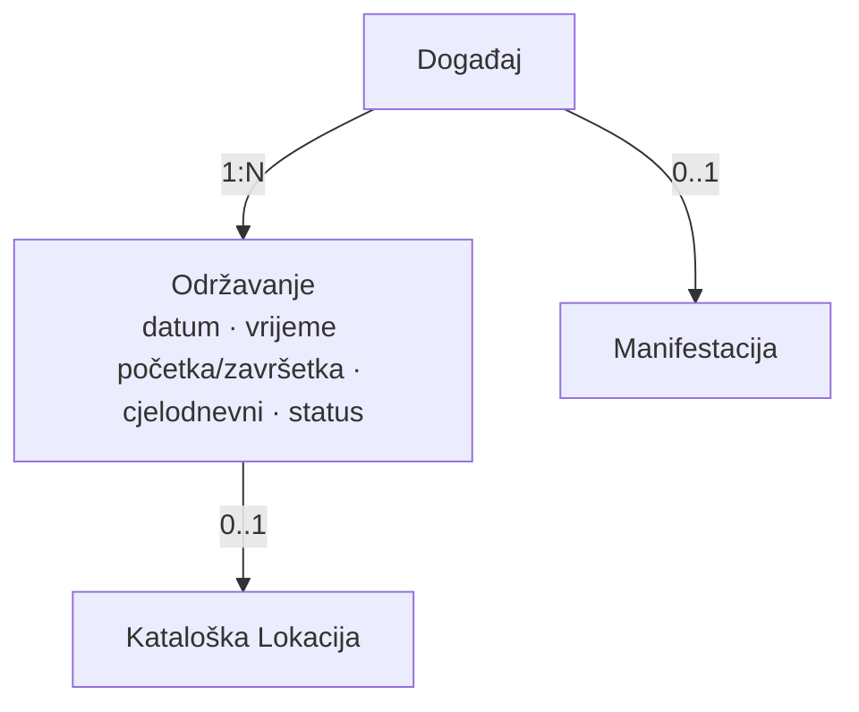
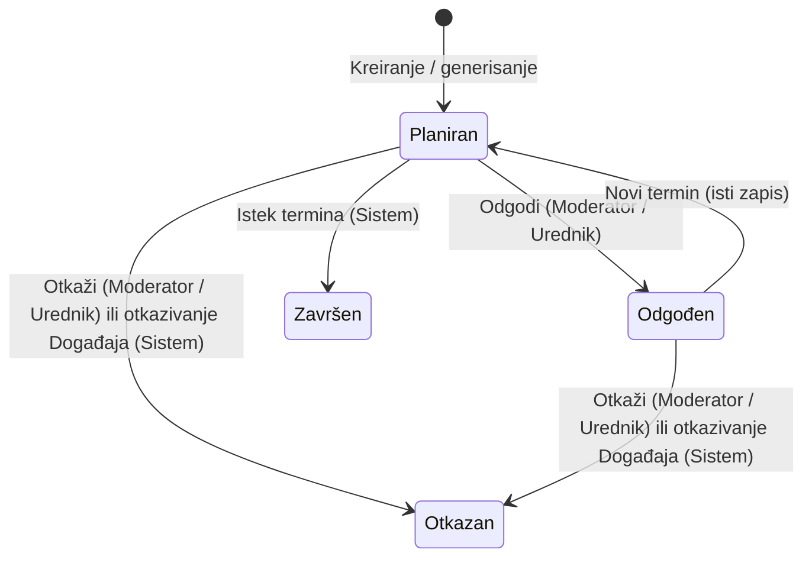
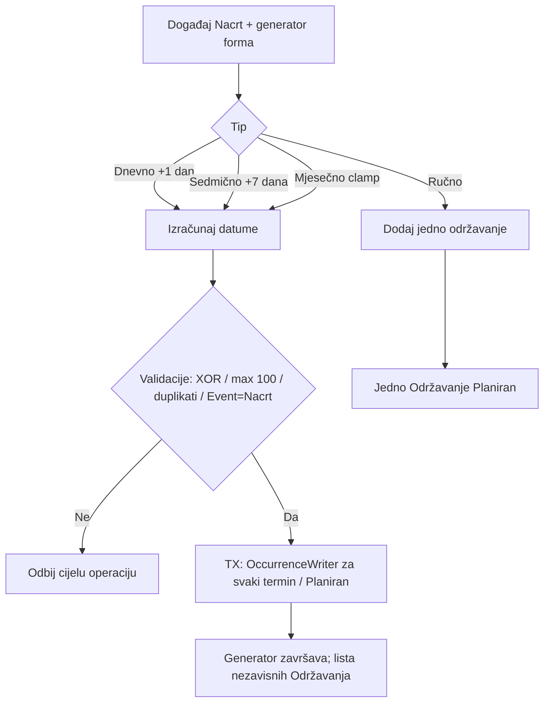
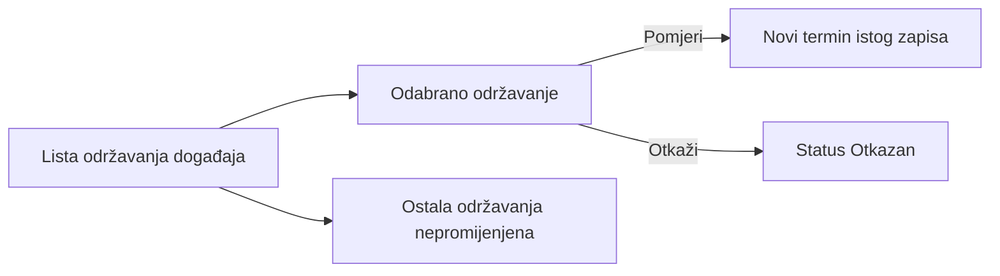
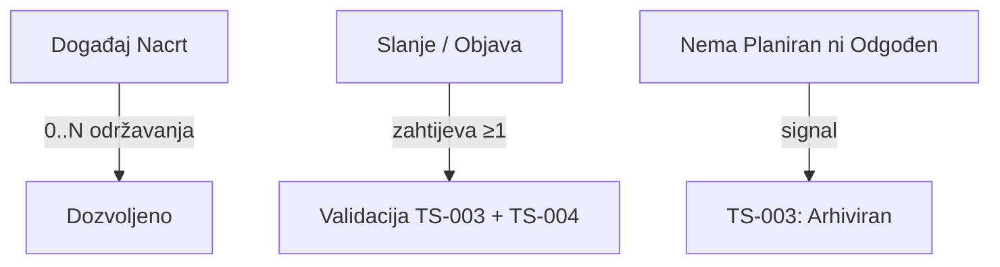
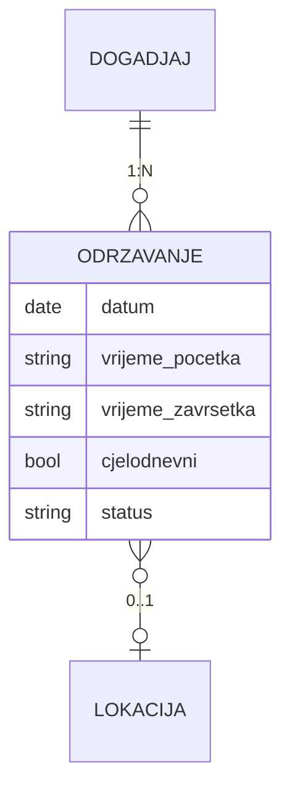

# Digital Kotor
# Technical Specification
## Održavanje događaja

**Feature ID:** FT-001  
**Oznaka dokumenta:** TS-004  
**Funkcionalna cjelina:** Održavanje događaja  
**Modul:** Kalendar kulture  
**Status dokumenta:** Usvojen  
**Verzija:** 0.1.8  
**Datum:** 2026-08-08

---

# Istorija verzija

| Verzija | Datum | Opis |
|---------|--------|------|
| 0.1 | 2026-07-29 | Initial draft. Prvi nacrt Technical Specification za funkcionalnu cjelinu Održavanje događaja. Usklađen sa BM-06 (BM-TR-01–BM-TR-18), BM-DG-01/03/04, BM-07 (referenca), FS §5.7.1 / §5.7.3 (BR-056–BR-061, BR-067–BR-069, BR-129–BR-134), FS §5.4.3 (prikaz), §5.16 (relevantne emisije), Feature Registry (FT-001 / plan TS-004), METHODOLOGY (M-TS-001–M-TS-005), TS-001 i TS-003 (granice). Bez SQL, API, Laravel koda i bez novih poslovnih odluka. |
| 0.1.1 | 2026-07-29 | Zatvoreno N-TR-03 (uslov arhiviranja). Potvrđeno: Termin nije poslovni ni konceptualni entitet V1 — samo skup vremenskih atributa Održavanja. Usklađeni dijagrami i §6. Status dokumenta: Usvojen. |
| 0.1.2 | 2026-07-30 | Terminološko usklađivanje sa TS-006 (korekcije PO-LOC-01/05): jasno razdvojeni pojmovi kataloška Lokacija i ručno uneseni naziv Lokacije; precizirane formulacije referenci i validacija bez promjene poslovnih pravila. |
| 0.1.3 | 2026-08-06 | Zatvoreno N-TR-01: model jednog održavanja (jedan kalendarski datum; vrijeme početka/završetka; cjelodnevno; bez raspona datuma). Usklađeni §3.3, §6, §7. Bez novih BM/FS pravila. Bez izmjene implementacije. |
| 0.1.4 | 2026-08-06 | Zatvoreno N-TR-04: fizičko uklanjanje održavanja samo iz Nacrta prije prvog uredničkog postupka; nakon prvog slanja na odobrenje — isključivo izmjena/statusi. Bez soft delete, novog statusa ili audita. Bez izmjene BM/FS. Bez izmjene implementacije. |
| 0.1.5 | 2026-08-06 | Zatvoreno N-TR-02 (PO-N-TR-02-01–03 / BM PATCH-052 / FS PATCH-FS-052): generator nije entitet; dnevno/sedmično/mjesečno; završetak brojem ili krajnjim datumom; max 100; ručna = generisana. Usklađeni §3.5, §4.4, §6, §7, §12. Bez izmjene implementacije. |
| 0.1.6 | 2026-08-07 | **PO-EV-01** (implementaciona napomena §14): legacy flat termini na `CulturalEvent` nisu predmet migracije/backfill/dual-write; novi model Održavanja direktno prema TS. Bez izmjene BM/FS. Bez izmjene implementacije. |
| 0.1.7 | 2026-08-08 | **PO-AUTO-01 / PO-AUTO-02** (BM PATCH-055 / FS PATCH-FS-055): preciziran trenutak Planiran → Završen (§4.8); otkazivanje roditeljskog Događaja otkazuje Planirana/Odgođena Održavanja (§4.9); usklađene matrice i validacije. Bez izmjene implementacije. |
| 0.1.8 | 2026-08-08 | **PO-N-TR-02-04** (BM PATCH-058 / FS PATCH-FS-058): preciziran V1 generator — samo Nacrt; algoritmi dnevno/sedmično/mjesečno; XOR; max 100; šablon; duplikati; atomičnost; bez preview/Proposal. Usklađeni §3.5, §4.4, §5.1, §7. Bez izmjene implementacije. |

Napomena:

Ovo poglavlje služi isključivo za evidenciju razvoja dokumenta.  
Kod svake naredne verzije dodaje se novi red u tabeli.  
Ne mijenjaju se postojeći redovi.

---

# Svrha dokumenta

Ovaj dokument opisuje kako će se usvojeni Business Model i Functional Specification za funkcionalnu cjelinu **Održavanje događaja** tehnički realizovati u okviru FT-001 – Kalendar kulture.

TS-004 obrađuje jednu logički zaokruženu funkcionalnu cjelinu unutar FT-001 i ne predstavlja kompletnu tehničku specifikaciju svih cjelina Feature-a FT-001.

Dokument:

* ne uvodi nova poslovna pravila;
* ne zamjenjuje Business Model niti Functional Specification;
* nije Technical Overview trenutne implementacije;
* nije Change Request;
* ne definiše SQL, migracije, Laravel kod niti konkretne API ugovore;
* ne projektuje TS-003 (Događaj), TS-006 (Lokacije) niti ostale cjeline — samo granice.

Izvori istine za poslovna pravila:

* `docs/business-model/Business_Model_Kalendar_kulture_MASTER.md` (BM-06 BM-TR-01–BM-TR-18; BM-DG-01, BM-DG-03, BM-DG-04, BM-DG-11; BM PATCH-055; BM-07 referenca)
* `docs/functional-specifications/Functional-Specification.md` (§5.7.1, §5.7.3; §5.4.3; §5.16 relevantno; BR-056–BR-061, BR-063, BR-065, BR-067–BR-069, BR-129–BR-134; PATCH-FS-055)
* `docs/features/Feature-Registry.md` (FT-001)
* `docs/METHODOLOGY.md` (M-TS-001–M-TS-005)
* `docs/technical-specifications/Technical-Specification_Organizator.md` (TS-001 — kontekst / ovlašćenja)
* `docs/technical-specifications/Technical-Specification_Dogadjaj.md` (TS-003 — referentna veza Događaj ↔ Održavanje)

**Terminološko pravilo (BM-16 / BM-06; V1):** pojam **Termin** označava isključivo skup vremenskih atributa entiteta Održavanje (datum, vrijeme, cjelodnevnost i druga vremenska svojstva). Termin nije poslovni entitet, nije zaseban domeni objekat i nije zaseban konceptualni entitet. Nije sinonim za entitet Održavanje.

---

# Status razvoja Technical Specification

| Poglavlje | Status |
|-----------|--------|
| 1. Pregled funkcionalne cjeline | Usvojeno |
| 2. Arhitektonski principi | Usvojeno |
| 3. Tehnički model | Usvojeno |
| 4. Tokovi | Usvojeno |
| 5. Autorizacija i ovlašćenja | Usvojeno |
| 6. Model podataka | Usvojeno |
| 7. Validacije | Usvojeno |
| 8. Evidencija aktivnosti (Audit) | Usvojeno |
| 9. Integracije | Usvojeno |
| 10. Nefunkcionalni zahtjevi | Usvojeno |
| 11. Granice V1 (Out of Scope) | Usvojeno |
| 12. Otvorena pitanja | Usvojeno |
| 13. Matrica sljedivosti | Usvojeno |
| 14. Napomene za implementaciju | Usvojeno |

---

# Pravila upravljanja ovim dokumentom

1. TS-004 pripada FT-001 – Kalendar kulture.
2. Tehnički sadržaj mora ostati usklađen sa usvojenim BM i FS.
3. Nova poslovna pravila se ne uvode kroz Technical Specification.
4. Sve što nije definisano u BM ili FS evidentira se kao **Otvoreno pitanje**.
5. Product Owner donosi poslovne odluke; ovaj dokument ih ne pretpostavlja.
6. Izmjene usvojenog sadržaja u narednim verzijama evidentiraju se novim redom u istoriji verzija.
7. Veze prema Događaju moraju ostati konzistentne sa TS-003.

---

# 1. Pregled funkcionalne cjeline

Izvori

Business Model:
- BM-TR-01–BM-TR-18
- BM-DG-01, BM-DG-03, BM-DG-04
- BM-LK-01–BM-LK-05 (referenca)

Functional Specification:
- §5.7.1 (BR-056–BR-061)
- §5.7.3 (BR-067–BR-069, BR-129–BR-134)
- §5.4.3 (prikaz)
- BR-065 (arhiviranje događaja — uslov)

## 1.1 Svrha funkcionalne cjeline

Funkcionalna cjelina **Održavanje događaja** omogućava da se za jedan Događaj evidentira jedno ili više konkretnih održavanja, svako sa sopstvenim terminom, opcionom lokacijom i sopstvenim statusom.

Održavanje:

* nije samostalan programski sadržaj;
* uvijek pripada tačno jednom Događaju;
* nosi termin (jedan kalendarski datum obavezan; vrijeme početka/završetka opciono — §3.3);
* može biti cjelodnevno;
* može nastati ručno ili kroz pravilo ponavljanja (dnevno / sedmično / mjesečno);
* može biti izmijenjeno, odgođeno ili otkazano bez uticaja na ostala održavanja istog događaja.

## 1.2 Obuhvat dokumenta

Obuhvat TS-004:

* tehnički model entiteta Održavanje;
* životni ciklus statusa održavanja (Planiran, Odgođen, Otkazan, Završen);
* veza prema Događaju (kardinalnost, preduslovi objave/arhive);
* termin i cjelodnevnost;
* opciona lokacija: kataloška Lokacija ili ručno uneseni naziv Lokacije (model = TS-006);
* ponavljanje i izuzeci;
* autorizacija statusnih prelaza;
* konceptualni model podataka;
* validacije;
* lokalni audit i emisije ka TS-012;
* integracione granice.

Van obuhvata:

* implementacija, SQL, migracije, Laravel, API;
* puni model Događaja (TS-003), Lokacije (TS-006), Manifestacije (TS-005), portala, Newslettera, Evidencije;
* napredni RRULE / iCalendar modeli;
* ulaznice i cijena (BM-TR-11).

## 1.3 Zavisnosti

| Zavisnost | Uloga u odnosu na TS-004 |
|-----------|---------------------------|
| TS-003 Događaj | Roditeljski agregat; preduslov ≥1 održavanje za slanje/objavu; signal završetka svih održavanja za arhivu |
| TS-001 Organizator / Moderator | Kontekst i ovlašćenja za statusne radnje kada događaj ima Organizatora |
| TS-006 Lokacije | Model kataloške Lokacije i pravila za ručni unos naziva Lokacije; TS-004 koristi taj model bez redefinisanja |
| TS-005 Manifestacija | Posredno: trajanje Manifestacije iz termina održavanja događaja |
| TS-009 / TS-010 | Prikaz i operativni prostor |
| TS-011 Newsletter | Potrošač odlaganja / promjene termina / lokacije / otkaza održavanja |
| TS-012 Evidencija | Prima emisije iz kataloga |

## 1.4 Veze sa BM, FS, FT-001 i TS-003

```
FT-001 Kalendar kulture
  → BM-06 Održavanje događaja (BM-TR-01–BM-TR-18)
  → BM-04 (BM-DG-01, BM-DG-03, BM-DG-04)
  → FS §5.7.1, §5.7.3, §5.4.3
  → TS-003 Događaj (roditelj)
  → TS-004 (ovaj dokument)
```

---

# 2. Arhitektonski principi

Izvori

Business Model:
- BM-TR-01, BM-TR-02, BM-TR-09, BM-TR-12, BM-TR-18
- BM-DG-01, BM-DG-03, BM-DG-04

Functional Specification:
- BR-056, BR-061, BR-065
- BR-067, BR-134

## 2.1 Održavanje nije samostalan sadržaj

Održavanje ne postoji bez Događaja. Tehnički model ne smije dozvoliti „siročad“ održavanja niti vezu jednog održavanja na više događaja (BM-TR-02, BR-056).

## 2.2 Termin nije entitet

Termin predstavlja skup vremenskih atributa entiteta Održavanje i nije zaseban poslovni entitet niti zaseban konceptualni entitet.

U V1 se ne uvodi Termin kao domeni objekat. Vremenska svojstva (jedan kalendarski datum; opciono vrijeme početka i završetka; cjelodnevnost) pripadaju isključivo Održavanju (BM-06 napomena, BM-16; §3.3).

## 2.3 Status održavanja ≠ status događaja

Statusi Planiran / Odgođen / Otkazan / Završen pripadaju isključivo održavanju (BM-TR-09, BM-TR-12, BR-067, BR-134).  
Ne mijenjaju urednički workflow događaja iz TS-003.

## 2.4 Lokacija je opciona i pripada održavanju

Lokacija nije atribut Događaja (BM-DG-03).  
Održavanje može imati katalošku Lokaciju, ručno uneseni naziv Lokacije ili biti bez definisane Lokacije (BM-TR-04, BR-058).  
Pun model kataloške Lokacije i pravila razdvajanja od ručnog unosa su u TS-006.

## 2.5 Izuzeci su lokalni

Izmjena, pomjeranje ili otkaz jednog održavanja ne smije mijenjati ostala održavanja istog događaja (BM-TR-07, BR-061).

## 2.6 Usklađenost sa TS-003

* Nacrt događaja: 0 održavanja dozvoljeno.
* Slanje / objava / direktna objava: ≥1 održavanje obavezno (BM-DG-01, TS-003 §7).
* Automatska arhiva događaja: nakon završetka svih održavanja (BM-DG-04, BR-065, TS-003 §4.10).

## 2.7 Modularnost

TS-004 ne ugrađuje modele drugih TS; integracije su ugovori granica (§9).

---

# 3. Tehnički model

Izvori

Business Model:
- BM-TR-01–BM-TR-10
- BM-DG-01, BM-DG-03

Functional Specification:
- BR-056–BR-061
- BR-067–BR-069

Tehnički model je logički. Ne definiše tabele, ORM ni fizičko skladištenje.

## 3.1 Entitet: Održavanje

**Odgovornost**

Poslovni entitet koji predstavlja jedno konkretno održavanje jednog Događaja, sa sopstvenim terminom, opcionom lokacijom (kataloška Lokacija ili ručno uneseni naziv Lokacije) i sopstvenim statusom.

**Životni ciklus (statusi)** — potvrđeni u BM/FS:

```
Planiran → Odgođen → Planiran (isti zapis, novi termin)
    │         │
    ├→ Otkazan
    └→ Završen (Sistem)
         Odgođen → Otkazan
```

Detaljni prelazi: §4.

**Odnosi**

| Veza | Kardinalnost | Napomena |
|------|--------------|----------|
| Događaj | N : 1 | Obavezno; ne samostalno (BM-TR-02) |
| Kataloška Lokacija | 0..1 | Opciono (BM-TR-04); kada postoji, važi model TS-006 |
| Manifestacija | — | Posredno preko Događaja (TS-005) |

**Ograničenja**

* nije korisnik niti uloga;
* nije Događaj;
* status nezavisan od statusa drugih održavanja;
* fizičko uklanjanje dozvoljeno isključivo po §4.3a (N-TR-04 zatvoren); nije isto što otkazivanje.

## 3.2 Poslovni kontekst — odnosi



* **Događaj (TS-003)** — roditelj.
* **Kataloška Lokacija (TS-006)** — opciona referenca kada se koristi katalog.
* **Ručno uneseni naziv Lokacije** — tekst na nivou Održavanja, bez obavezne kataloške reference.
* **Manifestacija (TS-005)** — posredno; početak/završetak Manifestacije iz vremenskih atributa održavanja (BM-MF-05).

## 3.3 Model jednog održavanja (N-TR-01 — zatvoreno)

**Odluka:** V1 zatvara formalni katalog vremenskih polja jednog održavanja. Ne uvodi se raspon datuma (`datum od` / `datum do`). Ne uvode se nova poslovna pravila ni novi statusi. Usklađeno sa BM-TR-03 / BR-057 / BM-TR-05 / BR-059 i ponašanjem prikaza FS §5.4.3.

Jedno održavanje predstavlja **jedan konkretan termin događaja na jednom kalendarskom datumu**.

Svako održavanje pripada tačno jednom događaju (BM-TR-02, BR-056).

Termin predstavlja skup vremenskih atributa entiteta Održavanje i nije zaseban poslovni entitet niti zaseban konceptualni entitet.

### 3.3.1 Polja

**Obavezno**

* datum održavanja

**Opciono**

* vrijeme početka
* vrijeme završetka
* oznaka cjelodnevnog održavanja
* lokacija prema postojećem modelu TS-004 (§2.4 / §6.2; BM-TR-04, BR-058)

### 3.3.2 Dozvoljene kombinacije

**Samo datum**

* Datum postoji.
* Vrijeme nije definisano.

**Datum + vrijeme početka**

* Vrijeme završetka nije obavezno.

**Datum + početak + završetak**

* Predstavlja vremenski interval **unutar istog datuma**.

**Cjelodnevno**

* Samo datum.
* Vrijeme početka i završetka se ne unose.

### 3.3.3 Validaciona pravila (vremenska polja)

* Datum je obavezan.
* Vrijeme završetka ne može postojati bez vremena početka.
* Ako postoje oba vremena, završetak mora biti nakon početka.
* Kod cjelodnevnog održavanja vremena se ne unose.

Ne uvode se druga vremenska validaciona pravila u ovoj odluci.

### 3.3.4 Višednevni događaj

Višednevni događaj modeluje se pomoću **više održavanja**.

Jedno održavanje **ne** koristi:

* datum od;
* datum do.

Ne uvodi se raspon datuma.

### 3.3.5 Veza sa TS-010

TS-010 (urednički portal) koristi ovaj model održavanja **bez redefinisanja**. Sadržajni katalog događaja (TS-010 §9 / N-DG-02) sadrži relaciju prema održavanjima; vremenska polja ostaju u TS-004.

## 3.4 Agregat i odgovornosti

| Komponenta (logička) | Odgovornost |
|----------------------|-------------|
| Entitet Održavanje | Vremenski atributi, lokacija-ref, status, veza na Događaj |
| Generator ponavljanja | Jednokratno kreira N održavanja (dnevno/sedmično/mjesečno); nije entitet (§3.5) |
| Usluga statusnih prelaza | Dozvoljene tranzicije Planiran/Odgođen/Otkazan/Završen |
| Signal završetka | Obavještava TS-003 kada više nema održavanja u statusu Planiran ili Odgođen |

## 3.5 Generator ponavljanja (N-TR-02 — zatvoreno; PO-N-TR-02-04)

**Odluka (PO-N-TR-02-01–03; preciziranje PO-N-TR-02-04):** Generator / „serija“ **nije** poslovni entitet niti dio modela održavanja kao trajni objekat. Generator je **jednokratno** pravilo koje kreira više nezavisnih Održavanja, zatim **završava rad**.

### Obuhvat V1

* Dostupan **samo** dok je Događaj **Nacrt** (novi ili vraćen na doradu).
* **Nije** dostupan: Na odobrenju (PO-DG-10), Objavljen, Otkazan, Arhiviran.
* U V1 **nema** generatora kroz Prijedlog izmjena Objavljenog.
* Pravo = isto kao ručno dodavanje Održavanja na tom Nacrtu (Moderator u kontekstu / Urednik).

### Šta generator nije

Ne postoji:

* trajni objekat Serija;
* lifecycle / status Serije;
* Edit entire series;
* Regenerate;
* ponovno pokretanje generatora nad postojećim održavanjima;
* preview / privremeni skup termina;
* interval > 1, RRULE, beskonačno ponavljanje, multi-day-of-week.

### Ulaz (šablon)

Obavezno:

* početni datum (uvijek prvo Održavanje);
* tip ∈ {dnevno, sedmično, mjesečno};
* završetak **XOR**: broj Održavanja **ili** krajnji datum.

Opciono (kopira se na sva):

* `vrijeme_od`, `vrijeme_do`, `cjelodnevno`;
* `location_id` **ili** ručni naziv Lokacije (postojeća međusobna isključivost).

### Algoritam datuma (kalendarska matematika; `config('app.timezone')`)

**Dnevno:** `datum_i = početni + (i-1)` dana.

**Sedmično:** `datum_i = početni + (i-1)×7` dana (isti dan sedmice).

**Mjesečno:** čuva se **izvorni broj dana** (npr. 31). Za mjesec `M` cilj = taj broj; ako mjesec nema taj dan → **posljednji dan** mjeseca. Clamp **ne** mijenja izvorni cilj (31.1 → 28/29.2 → 31.3).

**Broj N:** tačno N termina, uključujući početni.

**Krajnji datum:** uključeni početni i krajnji (ako termin pada na krajnji); nema termina poslije krajnjeg. Krajnji < početni → odbij. Krajnji = početni → jedno Održavanje.

**Max 100:** ako bi rezultat bio > 100 → odbij cijelu operaciju (bez prvih 100).

### Duplikati i atomičnost

* Potpuno identično Održavanje = isti `datum` + `vrijeme_od` + `vrijeme_do` + `cjelodnevno` + Lokacija (`location_id` ili normalizovani ručni naziv).
* Duplikat sa postojećim na Događaju **ili** unutar batch-a → **odbij cijelu operaciju**.
* Operacija je **atomska**: sva N ili nijedno.
* Prije upisa: ponovo provjeriti da je Event i dalje **Nacrt**; lock order **Event → Occurrence**.
* Svako Održavanje prolazi isti SSOT put kao ručno kreiranje (`OccurrenceWriter` / ekvivalent); **nema** bulk insert bypass-a.
* Status svakog novog = **Planiran**.

### Nakon generisanja

* nastaju **nezavisna** Održavanja;
* ručno dodata i generisana **više se ne razlikuju**;
* izmjena / otkaz / pomjeranje jednog ne utiče na ostala (BM-TR-07, BR-061);
* nema trajne serijske veze.

Van V1: RRULE, beskonačne serije, intervali (npr. svake 2 sedmice), napredna kalendarska pravila, trajna pravila, generator na Objavljenom/Proposal.

---

# 4. Tokovi

Izvori

Business Model:
- BM-TR-06–BM-TR-08
- BM-TR-10, BM-TR-13–BM-TR-17
- BM-DG-01, BM-DG-04

Functional Specification:
- BR-056–BR-061
- BR-065, BR-067–BR-069
- BR-129–BR-134

## 4.1 Lifecycle dijagram



Napomena (PO-AUTO-01): prelaz Planiran/Odgođen → Otkazan može nastati i kao **posljedica otkazivanja roditeljskog Događaja** (Objavljen → Otkazan), u okviru iste atomske poslovne operacije. To **nije** Planiran → Završen.

## 4.2 Matrica statusa

| Status | Svrha | Ulaz | Izlaz | Ko uvodi |
|--------|-------|------|-------|----------|
| **Planiran** | Aktivno, biće održano po objavljenim podacima | Kreiranje; povratak iz Odgođen | Odgođen; Otkazan; Završen | Moderator / Urednik; Sistem (Završen); Sistem pri otkazivanju Događaja (Otkazan) |
| **Odgođen** | Neće biti u starom terminu; očekuje se novi termin | Iz Planiran | Planiran (novi termin); Otkazan | Moderator / Urednik; Sistem pri otkazivanju Događaja (Otkazan) |
| **Otkazan** | Neće biti održano | Iz Planiran ili Odgođen | Nema usvojenog izlaza | Moderator / Urednik; Sistem (otkazivanje roditeljskog Događaja) |
| **Završen** | Održano ili prošao termin | Iz Planiran (automatski) | Nema usvojenog izlaza | Sistem |

Napomena: iz **Otkazan** i **Završen** nema usvojenih povratnih tranzicija u BM/FS.

## 4.3 Kreiranje pojedinačnog održavanja

1. Održavanje se kreira isključivo u kontekstu postojećeg Događaja (BM-TR-02).
2. Datum je obavezan; vrijeme početka/završetka opciono (BR-057; §3.3).
3. Cjelodnevno → samo datum; vremena se ne unose (BR-059; §3.3).
4. Lokacija opciona (BR-058); ako se bira, mora biti aktivna (BM-LK-05 — granica TS-006).
5. Početni status: **Planiran** (iz definicije BM-TR-10 / uobičajeni ulaz kreiranja).
6. Validacije vremenskih polja: §3.3.3 / §7.

## 4.3a Fizičko uklanjanje održavanja iz nacrta (N-TR-04 — zatvoreno)

**Odluka (V1, kanonski):** Fizičko uklanjanje održavanja dozvoljeno je isključivo dok događaj postoji kao **Nacrt** i još nikada nije bio predmet uredničkog postupka. Nakon prvog slanja na odobrenje održavanje više nije moguće ukloniti; njegove promjene evidentiraju se kroz postojeći model statusa, prijedloga izmjena i odobravanja.

### Dozvoljeno fizičko uklanjanje

Fizičko uklanjanje održavanja dozvoljeno je samo kada je status Događaja **Nacrt** i istovremeno važe svi uslovi:

* događaj **nikada** nije bio poslat Uredniku;
* događaj **nije** bio predmet uredničkog pregleda;
* događaj **nije** bio objavljen.

U tom slučaju uklanjanje briše zapis održavanja iz nacrta (npr. pogrešno dodato održavanje prije prvog slanja). Događaj u Nacrtu može ostati sa 0 održavanja (BM-DG-01).

### Nakon prvog slanja na odobrenje

Nakon što je događaj **bar jednom** poslat na odobrenje, fizičko uklanjanje održavanja **nije dozvoljeno**.

Umjesto toga koriste se isključivo:

* izmjena podataka održavanja;
* status **Planiran**;
* status **Odgođen**;
* status **Otkazan**;
* status **Završen**;

u skladu sa postojećim BM/FS (BM-TR-07–BM-TR-10, BM-TR-13–BM-TR-17; BR-061, BR-067–BR-069, BR-129–BR-133).

Ne uvodi se novi status. Ne uvodi se soft delete, hard delete kao opšti mehanizam, recycle bin ni lifecycle Delete.

### Brisanje iz nacrta ≠ otkazivanje

| Radnja | Smisao |
|--------|--------|
| **Fizičko uklanjanje iz nacrta** (§4.3a) | Zapis održavanja nestaje iz nacrta; samo prije prvog uredničkog postupka |
| **Otkazivanje** (BR-069) | Zapis ostaje; status postaje **Otkazan**; „neće biti održano“ |

Ove radnje nisu iste i ne smiju se miješati.

### Obrazloženje zabrane nakon uredničkog postupka

Zabrana fizičkog uklanjanja nakon prvog slanja / uredničkog postupka služi:

* očuvanju istorije;
* auditu (postojeći tragovi i katalog Događaji — FS §5.16; bez novih audit mehanizama);
* konzistentnosti workflow-a;
* nepromjenjivosti poslovnih zapisa.

## 4.4 Generisanje održavanja (ponavljanje)



**Tehnički tok (PO-N-TR-02-04)**

1. Guard: Event **Nacrt**; ovlašćenje = ručno dodavanje Održavanja; tip ∈ {dnevno, sedmično, mjesečno}.
2. Ulaz: početni datum + šablon vremena/lokacije + **XOR** (broj **ili** krajnji datum).
3. Izračun datuma po §3.5; N ≤ 100; inače odbij bez djelimičnog rezultata.
4. Provjera duplikata (postojeći + unutar batch-a) → pri pogotku odbij cijelu operaciju.
5. Jedna transakcija; lock **Event → Occurrence**; re-check Event = Nacrt.
6. Za svaki termin: isti SSOT put kao ručno kreiranje; status **Planiran**.
7. Pri prvoj grešci: rollback svih. Bez preview entiteta.
8. Generator odmah završava; nema Serije / Regenerate / edit-all.
9. Objavljen / Na odobrenju / Otkazan / Arhiviran / Proposal generator: **van V1 / zabranjeno**.

## 4.5 Izuzeci: pomjeranje i otkaz jednog održavanja



**Tehnički tok**

1. Pomjeranje = promjena termina (datum i/ili vrijeme početka/završetka) odabranog održavanja (BM-TR-07, BR-061; §3.3).
2. Otkaz = status **Otkazan** (BR-069); ne utiče na ostala; **nije** fizičko uklanjanje (§4.3a).
3. Ostala održavanja ostaju nepromijenjena.
4. Nema izmjene „cijele serije“ niti regeneracije (§3.5).

## 4.6 Izmjene podataka na objavljenom događaju

Izmjene termina, lokacije ili drugih podataka održavanja objavljenog događaja, **osim** postavljanja statusa Planiran / Odgođen / Otkazan po BR-132/133, podliježu istom uredničkom toku odobravanja kao Događaj (BM-TR-08, BR-061, TS-003).

Statusni prelazi Planiran ↔ Odgođen / Otkazan su zasebna ovlašćenja (§5).

## 4.7 Odgađanje i povratak

1. Planiran → Odgođen (BR-129).
2. Odgođen → Planiran tek nakon određivanja **novog termina**; isti zapis; istorija sačuvana; novo održavanje se ne kreira (BR-130, BR-131, BM-TR-15).
3. Odgođen → Otkazan dozvoljeno; druge tranzicije iz Odgođen nisu dozvoljene (BR-130).

## 4.8 Automatski završetak

Sistem automatski izvršava **Planiran → Završen** isključivo za Održavanje u statusu **Planiran**, kada je termin istekao prema aplikacionoj vremenskoj zoni (`config('app.timezone')`) (PO-AUTO-02 / BM-TR-10 / BR-068).

### Pravilo isteka

1. **Definisano `vrijeme_do`:** ako Održavanje ima `datum` i `vrijeme_do`, smatra se isteklim nakon trenutka **datum + vrijeme_do**.
2. **Bez `vrijeme_do`:** Održavanje se **ne** smatra završenim odmah nakon `vrijeme_od`. Smatra se isteklim tek nakon **završetka kalendarskog dana** polja `datum`. To uključuje:
   * samo `datum` (bez vremena);
   * `datum` + `vrijeme_od` (bez `vrijeme_do`);
   * cjelodnevno Održavanje (`cjelodnevno = true`).

### Šta Sistem ne obrađuje

Sistem **ne** izvršava automatsko završavanje za Održavanja u statusu:

* **Odgođen** (mora prvo Odgođen → Planiran sa novim terminom, ili Odgođen → Otkazan);
* **Otkazan**;
* **Završen**.

Automatsko završavanje **nije** mehanizam zatvaranja Održavanja nakon otkazivanja Događaja; to uređuje §4.9 / PO-AUTO-01.

## 4.9 Signal ka TS-003 — arhiviranje događaja i otkazivanje roditelja

Događaj ispunjava uslov za automatsko arhiviranje kada više ne postoji nijedno održavanje u statusu **Planiran** ili **Odgođen**. Održavanja u statusima **Završen** i **Otkazan** smatraju se konačno obrađenim i ne sprečavaju automatsko arhiviranje događaja.

Kada je uslov ispunjen, TS-004 omogućava Sistemu da izvrši arhiviranje Događaja iz statusa **Objavljen** ili **Otkazan**, u skladu sa BM-DG-04, BR-065 i TS-003 §4.10.

### Otkazivanje roditeljskog Događaja (PO-AUTO-01)

Kada roditeljski Događaj prelazi **Objavljen → Otkazan**, u okviru **iste atomske poslovne operacije** otkazivanja:

* sva Održavanja u statusu **Planiran** prelaze u **Otkazan**;
* sva Održavanja u statusu **Odgođen** prelaze u **Otkazan**;
* Održavanja u statusu **Završen** ostaju **Završen**;
* Održavanja u statusu **Otkazan** ostaju **Otkazan**.

To **nije** automatski Planiran → Završen. Nakon operacije na Otkazanom Događaju ne smije ostati Planirano niti Odgođeno Održavanje (BM-DG-11 / BR-063; TS-003 §4.8).

## 4.10 Veza kardinalnosti sa Događajem



---

# 5. Autorizacija i ovlašćenja

Izvori

Business Model:
- BM-TR-08, BM-TR-16–BM-TR-18
- BM-ORG-04 (operativne radnje Moderatora)

Functional Specification:
- BR-061, BR-132–BR-134
- BR-007 (opseg Moderatora — preko TS-001/TS-003)

Logički model (bez middleware).

## 5.1 Matrica prava

| Radnja | Moderator (Org. događaj) | Urednik | Administrator platforme | Organizator (entitet) |
|--------|--------------------------|---------|-------------------------|------------------------|
| Dodati / uređivati održavanje u Nacrtu | Da — Aktivan Org. + kontekst | Da | Ne | Ne |
| Generisati ponavljanje | Da — kontekst; **samo Nacrt** | Da — **samo Nacrt** | Ne | Ne |
| Pomjeriti termin (podaci) na objavljenom | Kroz prijedlog / odobrenje događaja (BR-061) | Da / odobrava | Ne | Ne |
| Postaviti Odgođen | Da (BR-132) | Da (i za događaj bez Org. — BR-133) | Ne | Ne |
| Vratiti Odgođen → Planiran (novi termin) | Da (BR-132) | Da (BR-133 bez Org.) | Ne | Ne |
| Otkaćiti pojedinačno održavanje | Da (BR-132) | Da (BR-133 bez Org.) | Ne | Ne |
| Ručno postaviti Završen | Nije usvojeno | Nije usvojeno | Ne | Ne |
| Automatski Završen | — | — | — | Sistem |
| Brisati održavanje | Nije usvojeno kao zasebna radnja | Nije usvojeno | Ne | Ne |

## 5.2 Posebna pravila

* Statusne radnje sa Organizatorom: Moderator u aktivnom kontekstu; Organizator ne izvršava radnje (BR-132).
* Bez Organizatora: Urednik (BR-133).
* BR-132/133 ne mijenjaju status događaja ni workflow TS-003 (BR-134).
* Izmjene podataka (osim navedenih statusa) na objavljenom događaju idu kroz odobravanje događaja (BR-061).

## 5.3 Administrator platforme

Nije učesnik toka održavanja; relevantan samo preko TS-012.

---

# 6. Model podataka

Izvori

Business Model:
- BM-TR-01–BM-TR-06
- BM-TR-09, BM-TR-10
- BM-DG-03
- BM-LK-01–BM-LK-05 (referenca)

Functional Specification:
- BR-056–BR-060
- BR-067
- §5.4.3

Konceptualni model. Bez SQL / migracija / fizičkih tipova.

## 6.1 Dijagram odnosa



## 6.2 Potvrđeni atributi

Termin predstavlja skup vremenskih atributa entiteta Održavanje i nije zaseban poslovni entitet niti zaseban konceptualni entitet.

Atributi / svojstva potvrđeni usvojenim BM/FS i zatvorenim N-TR-01 (konceptualno):

| Atribut / svojstvo | Obrazloženje | Izvor |
|--------------------|--------------|-------|
| Identitet održavanja | Jedinstvena identifikacija | tehnička nužnost |
| Referenca na Događaj | Obavezna N:1 | BM-TR-02, BR-056 |
| Datum | Obavezan; jedan kalendarski datum | BM-TR-03, BR-057; §3.3 |
| Vrijeme početka | Opciono | BM-TR-03, BR-057; §3.3 (N-TR-01) |
| Vrijeme završetka | Opciono; samo uz vrijeme početka; isti datum | §3.3 (N-TR-01); FS §5.4.3 prikaz |
| Oznaka cjelodnevno | Ako da — samo datum; bez vremena | BM-TR-05, BR-059; §3.3 |
| Referenca na katalošku Lokaciju | 0..1 | BM-TR-04, BR-058 |
| Ručno uneseni naziv Lokacije | 0..1 | BM-TR-04, BR-058 |
| Status | Planiran / Odgođen / Otkazan / Završen | BM-TR-10, BR-067 |

## 6.3 Referencirani atributi

| Referenca | Vlasnik | Napomena |
|-----------|---------|----------|
| Kataloška Lokacija (naziv, status Aktivna/Deaktivirana, ostali podaci) | TS-006 | V1 prikaz: tekstualni podatak; bez obaveznog GPS/mape (§5.4.3) |
| Ručno uneseni naziv Lokacije | TS-004 (u skladu sa TS-006 razdvajanjem modela) | Tekst na nivou konkretnog Održavanja; bez obavezne kataloške veze |
| Događaj / status događaja | TS-003 | Preduslovi i arhiva |
| Prikaz datuma i vremena početka/završetka | FS §5.4.3 | Prikaz nad atributima §3.3 / §6.2; višednevni program = više održavanja |
| Urednički portal | TS-010 | Koristi model §3.3 bez redefinisanja |

## 6.4 Otvoreni atributi

* GPS koordinate nisu usvojen atribut održavanja; prikaz mape/GPS van V1 (§5.4.3 / §5.4.9). Eventualni GPS na kataloškoj Lokaciji = TS-006, ne TS-004.

## 6.5 Integritet

* Svako održavanje ima tačno jedan Događaj.
* Status samo iz dozvoljenog skupa.
* Jedno održavanje = jedan kalendarski datum (bez `datum od` / `datum do`).
* Cjelodnevno ⇒ vremena se ne unose.
* Vrijeme završetka ⇒ mora postojati vrijeme početka; završetak > početak.
* Fizičko uklanjanje samo po §4.3a; nakon prvog slanja na odobrenje zapis ostaje (izmjena / statusi).
* Deaktivirana kataloška Lokacija ne smije se birati za **nove kataloške veze** iz održavanja (BM-LK-05); postojeće istorijske veze ostaju.

---

# 7. Validacije

Izvori

Business Model:
- BM-TR-02–BM-TR-07
- BM-TR-13–BM-TR-15
- BM-DG-01, BM-DG-04
- BM-LK-05

Functional Specification:
- BR-056–BR-061
- BR-068–BR-069
- BR-129–BR-131

## 7.1 Poslovna pravila — tehnička interpretacija

| Oznaka | Tehnička interpretacija |
|--------|-------------------------|
| BM-TR-01 / BR-056 | Kreirati samo kao dijete Događaja |
| BM-TR-02 | Zabraniti orphan i multi-parent |
| BM-TR-03 / BR-057 | Validirati obavezan datum; vremena opciona (§3.3) |
| BM-TR-04 / BR-058 | Dozvoliti: katalošku Lokaciju, ručno uneseni naziv Lokacije ili bez lokacije |
| BM-TR-05 / BR-059 | Cjelodnevno ⇒ samo datum; vremena se ne unose |
| BM-TR-06 / BR-060 | Generator: samo Nacrt; dnevno/sedmično/mjesečno; XOR završetak; max 100; šablon; Planiran; duplikati odbijaju cijelu ops; atomičnost; nije entitet (§3.5 / PO-N-TR-02-04) |
| BM-TR-07 / BR-061 | Mutacije samo na odabranom ID-u |
| BM-TR-08 / BR-061 | Podaci na objavljenom → approval tok događaja (izuzev statusa BR-132/133) |
| BM-TR-10 / BR-067 | Enforce četiri statusa |
| BM-TR-13 / BR-129 | Dozvoliti samo Planiran→{Odgođen,Otkazan,Završen} |
| BM-TR-14 / BR-130 | Dozvoliti samo Odgođen→{Planiran,Otkazan}; Planiran zahtijeva novi termin |
| BM-TR-15 / BR-131 | Povratak = update istog zapisa, ne insert |
| BM-TR-16/17 / BR-132/133 | Autorizacija po postojanju Organizatora |
| BR-068 | Sistem: Planiran→Završen prema PO-AUTO-02 (vrijeme_do ako postoji; inače kraj dana `datum`; app timezone) |
| BM-DG-01 | TS-003 validacija ≥1 pri slanju/objavi — TS-004 obezbjeđuje brojanje |
| BM-DG-04 / BR-065 | Signal ka TS-003 kada nema održavanja u statusu Planiran ili Odgođen |
| BM-DG-11 / BR-063 | Pri otkazivanju Događaja: Planiran/Odgođen → Otkazan (atomski sa Event cancel) |

## 7.2 Tabela validacija po toku

| Validacija | Kada | Ko / šta | Posljedica |
|------------|------|----------|------------|
| Događaj postoji | Kreiranje | Sistem | Odbijanje orphan |
| Datum obavezan | Kreiranje / izmjena termina | Sistem | Blokada |
| Vrijeme završetka bez početka | Kreiranje / izmjena | Sistem | Odbijanje |
| Završetak nakon početka | Kreiranje / izmjena (oba vremena) | Sistem | Odbijanje ako nije |
| Cjelodnevno bez vremena | Kreiranje / izmjena | Sistem | Odbijanje vremena |
| Kataloška Lokacija Aktivna (ako nova kataloška veza) | Dodjela kataloške Lokacije | Sistem | Odbijanje Deaktivirane kataloške Lokacije |
| Tip ponavljanja ∈ {dnevno, sedmično, mjesečno} | Generisanje | Sistem | Odbijanje ostalog |
| Završetak generatora: broj XOR krajnji datum | Generisanje | Sistem | Blokada bez uslova / oba |
| Max 100 održavanja po generisanju | Generisanje | Sistem | Odbijanje preko limita (bez djelimičnog) |
| Event status = Nacrt (re-check) | Generisanje | Sistem | Odbijanje ako nije Nacrt |
| Potpuni duplikat (postojeći ili batch) | Generisanje | Sistem | Odbijanje cijele operacije |
| Krajnji < početni | Generisanje | Sistem | Odbijanje |
| ≥1 održavanje | Slanje/objava događaja | TS-003 + TS-004 | Blokada događaja |
| Nedozvoljen statusni prelaz | Promjena statusa | Sistem | Odbijanje |
| Novi termin pri Odgođen→Planiran | Povratak | Sistem | Blokada bez novog termina |
| Otkaz samo iz Planiran/Odgođen | Otkaz | Sistem | Odbijanje inače |
| Izmjena samo odabranog | Pomjeranje / otkaz | Sistem | Ostala nepromijenjena |
| Autorizacija Mod/Urednik | Statusne radnje | Sistem | Odbijanje |
| Podaci na objavljenom kroz approval | Izmjena podataka | TS-003 tok | Blokada direktnog bypass-a |
| Istek termina | Završetak | Sistem | Planiran→Završen (PO-AUTO-02) |
| Otkazivanje Događaja | Event cancel | Sistem / TS-003 | Planiran/Odgođen→Otkazan (PO-AUTO-01) |
| Nema održavanja u statusu Planiran ili Odgođen | Arhiva događaja | Sistem | Emituje signal ka TS-003 za automatsko arhiviranje |
| Fizičko uklanjanje — samo Nacrt bez uredničkog postupka | Uklanjanje (§4.3a) | Sistem | Odbijanje inače |
| Fizičko uklanjanje nakon prvog slanja | Uklanjanje | Sistem | Odbijanje; koristiti izmjenu/status |

## 7.3 Tehničke validacije

* Referenca na Događaj mora postojati.
* Ako se koristi kataloška Lokacija, referenca na kataloški zapis mora postojati i biti validna.
* Ručno uneseni naziv Lokacije ne zahtijeva katalošku referencu.
* Statusni prelazi samo iz §4.2.
* Automatski Završen ne smije dirati Otkazan ni Odgođen (nema usvojene tranzicije Otkazan→Završen / Odgođen→Završen).
* Automatsko završavanje koristi aplikacionu vremensku zonu; predikat PO-AUTO-02.
* Vremenska polja: §3.3.3 (datum obavezan; završetak samo uz početak; završetak > početak; cjelodnevno bez vremena).
* Jedno održavanje = jedan kalendarski datum; bez `datum od` / `datum do`.
* Fizičko uklanjanje: §4.3a (N-TR-04); brisanje ≠ otkazivanje.
* Generator: §3.5 / §4.4 (N-TR-02; PO-N-TR-02-04); nije entitet; samo Nacrt; max 100; atomičnost; nema Regenerate / preview / Proposal generator.

---

# 8. Evidencija aktivnosti (Audit)

Izvori

Functional Specification:
- §5.16 katalog Događaji (odlaganje, otkaz pojedinačnog, promjena termina, promjena lokacije)
- BR-171

TS-004 ne projektuje TS-012.

## 8.1 Lokalni audit tragovi

| Događaj | Ko | Kada | Šta se bilježi |
|---------|----|------|----------------|
| Kreiranje / generisanje održavanja | Moderator / Urednik / Sistem | Pri upisu | izvršilac, vrijeme, događaj |
| Promjena termina (pomjeranje) | Moderator / Urednik | Pri izmjeni | stari/novi termin, izvršilac |
| Promjena lokacije | Moderator / Urednik | Pri izmjeni | stara/nova kataloška referenca i/ili stari/novi ručno uneseni naziv, izvršilac |
| Status Odgođen / Planiran / Otkazan | Moderator / Urednik | Pri prelazu | stari/novi status, izvršilac |
| Automatski Završen | Sistem | Pri isteku | vrijeme, izvršilac Sistem |

## 8.2 Emisija ka centralnoj Evidenciji (TS-012)

U skladu sa katalogom Događaji, relevantne emisije koje TS-004 podržava / pokreće:

| Događaj | Izvršilac |
|---------|-----------|
| Odlaganje održavanja (Odgođen) | Moderator / Urednik |
| Otkazivanje pojedinačnog održavanja | Moderator / Urednik |
| Promjena termina održavanja | Moderator / Urednik |
| Promjena lokacije održavanja | Moderator / Urednik |

Automatsko arhiviranje **događaja** emituje TS-003 (izvršilac Sistem), nakon signala iz TS-004.

**Ne emituju se** sitne operativne radnje bez poslovnog značaja, u skladu sa FS §5.16.

---

# 9. Integracije

Izvori

Business Model:
- BM-TR-*, BM-DG-01/03/04, BM-MF-05, BM-LK-*

Functional Specification:
- BR-056–BR-061, BR-065, BR-132–BR-134

Samo granice.

| TS | Granica prema TS-004 |
|----|----------------------|
| **TS-003** | Roditelj Događaj; ≥1 za objavu; signal za arhivu; approval tok za podatke na objavljenom |
| **TS-001** | Kontekst Moderatora / status Organizatora za autorizaciju |
| **TS-005** | Posredno: traženje min/max termina održavanja događaja Manifestacije |
| **TS-006** | Entitet kataloška Lokacija; status Aktivna/Deaktivirana; izbor iz kataloga ili ručni unos naziva Lokacije |
| **TS-007** | Nema direktne veze (kategorija na događaju) |
| **TS-008** | Nema direktne veze (mediji na događaju/lokaciji) |
| **TS-009** | Prikaz termina i lokacije (§5.4.3) |
| **TS-010** | UI za unos/statuse |
| **TS-011** | Okidači: odlaganje, otkaz termina, promjena datuma/vremena/lokacije |
| **TS-012** | Prima emisije §8.2 |

---

# 10. Nefunkcionalni zahtjevi

Izvori

Business Model:
- BM-TR-09, BM-DG-04

Functional Specification:
- BR-068, BR-065

## 10.1 Sigurnost

* Statusne radnje po matrici §5.
* Zabraniti izmjenu tuđih događaja / održavanja van konteksta.

## 10.2 Performanse

* Generisanje ponavljanja mora biti predvidivo za uobičajene serije.
* Job automatskog Završen i signal arhive događaja mora raditi bez ručne intervencije.
* Konkretni pragovi nisu usvojeni — ne uvode se.

## 10.3 Integritet

* Nema orphan održavanja.
* Lokalni izuzeci ne smiju korumpirati ostala održavanja.
* Povratak Odgođen→Planiran ne smije kreirati duplikat.

## 10.4 Konkurentnost

* Paralelne izmjene istog održavanja moraju imati jedan važeći ishod.
* Statusni prelaz i izmjena termina ne smiju ostaviti Odgođen bez usklađenog termina pri povratku.

## 10.5 Proširivost

* Katalog vremenskih polja termina zatvoren u §3.3 (N-TR-01); proširenja van V1 zahtijevaju BM/FS PATCH.
* Bez ugradnje RRULE u V1; generator = §3.5 (N-TR-02 zatvoren).

## 10.6 Održavanje

* TS-004 ostaje usklađen sa BM/FS i TS-003.
* Odstupanja trenutne implementacije (npr. termin na događaju umjesto na održavanju) vode se u Technical Overview.

---

# 11. Granice V1 (Out of Scope)

Izvori

Business Model:
- BM-TR-11
- BM-06 otvorena: nema dodatnih tema bez PATCH-a

Functional Specification:
- §5.4.3 / §5.4.9 (GPS/mapa)
- BR-060 (generator: dnevno/sedmično/mjesečno; max 100; van V1: RRULE / beskonačno / intervali)

Usvojene granice V1 za TS-004:

1. Nema implementacionog dizajna (SQL, API, Laravel, migracije).
2. Ulaznice i cijena nisu dio V1 (BM-TR-11).
3. Napredni RRULE / iCalendar / proizvoljni recurrence izrazi, beskonačne serije, intervali i trajna pravila ponavljanja nisu dio V1 (N-TR-02 zatvoren — §3.5).
4. Obavezni GPS / mapa prikaza lokacije nisu dio V1 (§5.4.3 / §5.4.9).
5. Puni model Lokacije nije dio TS-004 (TS-006).
6. Puni model Događaja nije dio TS-004 (TS-003).
7. Ručno postavljanje statusa Završen nije usvojeno — samo Sistem (BR-068).
8. Fizičko uklanjanje održavanja dozvoljeno je **samo** po §4.3a (Nacrt prije prvog uredničkog postupka). Soft delete, hard delete kao opšti mehanizam, recycle bin i lifecycle Delete **nisu** dio V1. Nakon prvog slanja — isključivo izmjena / statusi (N-TR-04 zatvoren).
9. Status **Odgođen** nije status događaja i ne uvodi se na nivo Događaja.
10. Edit entire series i Regenerate nisu dio V1.

---

# 12. Otvorena pitanja

Pitanja koja ostaju nakon analize BM/FS. Bez predloženih odgovora.

Ne vraćaju se zatvorene odluke o: lokaciji opcionoj, cjelodnevnom, dnevnom/sedmičnom/mjesečnom generisanju (N-TR-02 **ZATVORENO** — §3.5 / PO-N-TR-02-01–03), lokalnim izuzecima, statusima Planiran/Odgođen/Otkazan/Završen, ovlašćenjima Mod/Urednik, vezi ≥1 održavanje / arhiva događaja, uslovu automatskog arhiviranja (N-TR-03 zatvoren), modelu jednog održavanja / katalogu vremenskih polja (N-TR-01 zatvoren — §3.3), fizičkom uklanjanju iz nacrta prije prvog uredničkog postupka (N-TR-04 **ZATVORENO** — §4.3a).

Za TS-004 trenutno **nema** otvorenih pitanja.

---

# 13. Matrica sljedivosti

| TS sekcija | BM | FS / BR | FT | Ostali TS |
|------------|----|---------|----|-----------|
| §1 Pregled | BM-06, BM-DG-01/03/04 | §5.7.1, §5.7.3 | FT-001 | TS-003 |
| §2 Principi | BM-TR-01/02/09/12/18, BM-DG-03 | BR-056, BR-067, BR-134 | FT-001 | TS-003 |
| §3 Tehnički model | BM-TR-01–BM-TR-10 | BR-056–BR-060, BR-067; §5.4.3 | FT-001 | TS-003, TS-006, TS-010 |
| §4.1–4.2 Lifecycle | BM-TR-10, BM-TR-13–15 | BR-067–BR-069, BR-129–131 | FT-001 | — |
| §4.3 Kreiranje | BM-TR-02–05 | BR-056–BR-059 | FT-001 | TS-003 |
| §4.3a Uklanjanje iz nacrta | BM-DG-01 | BR-056; §5.16 (istorija/audit); N-TR-04 ZATVORENO | FT-001 | TS-003 |
| §4.4 Generisanje | BM-TR-06 | BR-060; N-TR-02 ZATVORENO | FT-001 | — |
| §4.5 Izuzeci | BM-TR-07 | BR-061, BR-069 | FT-001 | — |
| §4.6 Izmjene objavljenog | BM-TR-08 | BR-061 | FT-001 | TS-003 |
| §4.7 Odgađanje | BM-TR-14/15 | BR-130/131 | FT-001 | — |
| §4.8 Auto Završen | BM-TR-10, BM-TR-13; PO-AUTO-02 | BR-068, BR-129 | FT-001 | — |
| §4.9 Arhiva / cancel cascade | BM-DG-04, BM-DG-11; PO-AUTO-01 | BR-063, BR-065 | FT-001 | TS-003 |
| §5 Autorizacija | BM-TR-16–18 | BR-132–134, BR-061 | FT-001 | TS-001, TS-003 |
| §6 Model podataka | BM-TR-01–06, BM-LK-* | BR-056–060, §5.4.3 | FT-001 | TS-006 |
| §7 Validacije | BM-TR-*, BM-DG-01/04 | BR-056–061, BR-068/069, BR-129–131 | FT-001 | TS-003 |
| §8 Audit | — | §5.16 katalog | FT-001 / FT-003 | TS-012 |
| §9 Integracije | BM-TR-*, BM-MF-05 | BR-056+, BR-065 | FT-001 | TS-001, TS-003, TS-005–TS-012 |
| §10 NFR | BM-DG-04 | BR-068 | FT-001 | — |
| §11 Granice V1 | BM-TR-11 | §5.4.3/§5.4.9 | FT-001 | — |
| §12 Otvorena | — | — (nema otvorenih) | FT-001 | — |

---

# 14. Napomene za implementaciju

Ovo poglavlje je strogo nenormativno.

1. Prvo uspostaviti vezu Događaj 1—N Održavanje i statusni motor (§4), zatim generator ponavljanja.
2. Signal arhive ka TS-003 držati eksplicitnim ugovorom; ne ugrađivati arhivu događaja u TS-004.
3. Statusne radnje (Odgođen/Otkazan/Planiran) razdvojiti od approval toka za podatke (BR-061 vs BR-132/133).
4. Ne implementirati RRULE u V1.
5. Trenutna implementacija koja drži termin/lokaciju na događaju je odstupanje — Technical Overview, ne TS-004.
6. GPS/mapu ne uvoditi kroz TS-004.
7. **PO-EV-01:** Postojeći flat termini/lokacije na `CulturalEvent` nisu predmet migracije ni backfill-a u Održavanja. Implementacija uspostavlja kanonski model 1 Događaj — N Održavanja direktno prema ovom TS-u (uz TS-003), bez dual-write i bez adaptera radi očuvanja legacy zapisa. Privremeni flat model ostaje samo do cutover-a.
