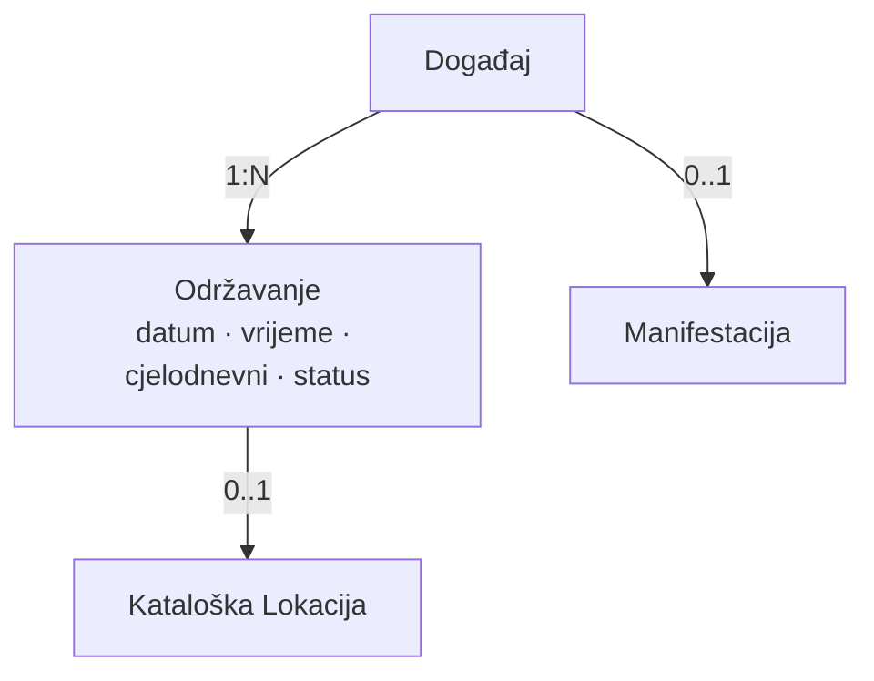
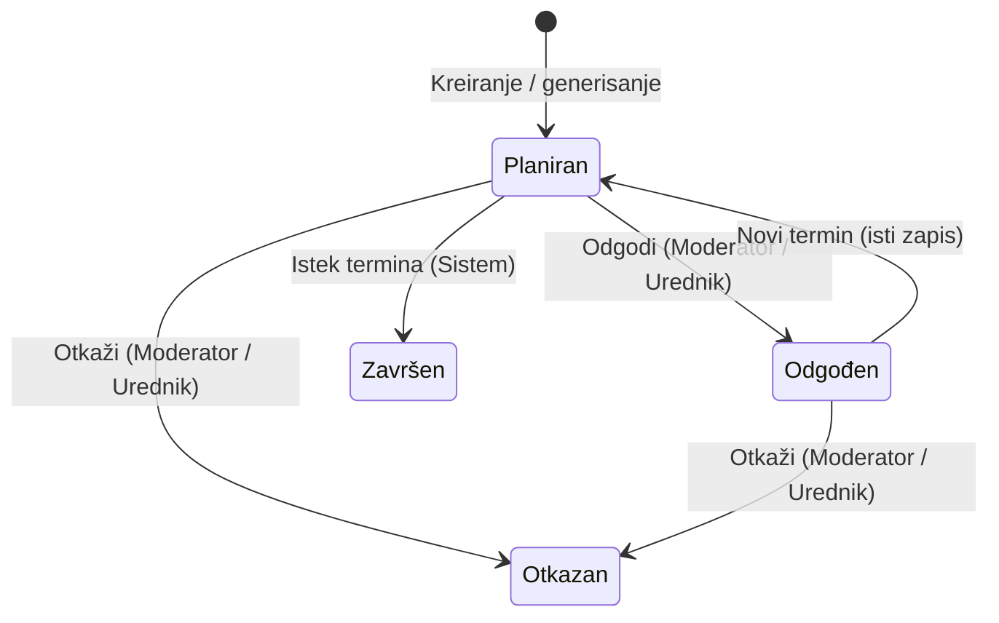
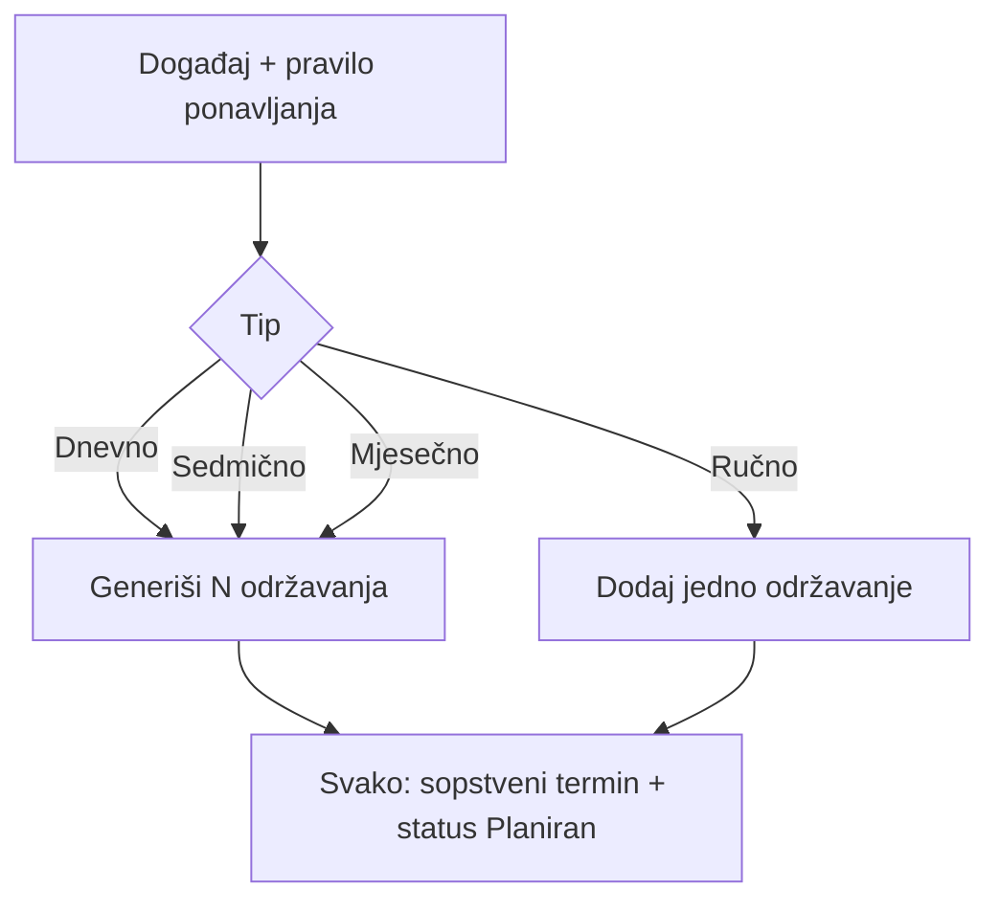
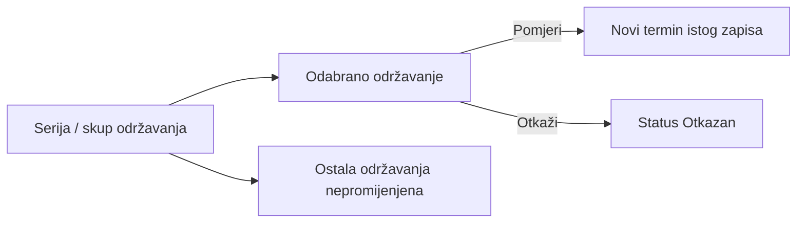
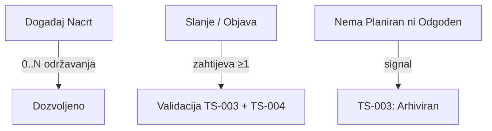
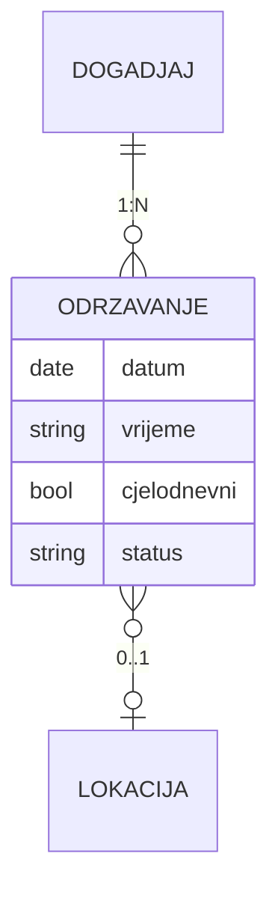

# Digital Kotor
# Technical Specification
## Održavanje događaja

**Feature ID:** FT-001  
**Oznaka dokumenta:** TS-004  
**Funkcionalna cjelina:** Održavanje događaja  
**Modul:** Kalendar kulture  
**Status dokumenta:** Usvojen  
**Verzija:** 0.1.2  
**Datum:** 2026-07-30

---

# Istorija verzija

| Verzija | Datum | Opis |
|---------|--------|------|
| 0.1 | 2026-07-29 | Initial draft. Prvi nacrt Technical Specification za funkcionalnu cjelinu Održavanje događaja. Usklađen sa BM-06 (BM-TR-01–BM-TR-18), BM-DG-01/03/04, BM-07 (referenca), FS §5.7.1 / §5.7.3 (BR-056–BR-061, BR-067–BR-069, BR-129–BR-134), FS §5.4.3 (prikaz), §5.16 (relevantne emisije), Feature Registry (FT-001 / plan TS-004), METHODOLOGY (M-TS-001–M-TS-005), TS-001 i TS-003 (granice). Bez SQL, API, Laravel koda i bez novih poslovnih odluka. |
| 0.1.1 | 2026-07-29 | Zatvoreno N-TR-03 (uslov arhiviranja). Potvrđeno: Termin nije poslovni ni konceptualni entitet V1 — samo skup vremenskih atributa Održavanja. Usklađeni dijagrami i §6. Status dokumenta: Usvojen. |
| 0.1.2 | 2026-07-30 | Terminološko usklađivanje sa TS-006 (korekcije PO-LOC-01/05): jasno razdvojeni pojmovi kataloška Lokacija i ručno uneseni naziv Lokacije; precizirane formulacije referenci i validacija bez promjene poslovnih pravila. |

Napomena:

Ovo poglavlje služi isključivo za evidenciju razvoja dokumenta.  
Kod svake naredne verzije dodaje se novi red u tabeli.  
Ne mijenjaju se postojeći redovi.

---

# Svrha dokumenta

Ovaj dokument opisuje kako će se usvojeni Business Model i Functional Specification za funkcionalnu cjelinu **Održavanje događaja** tehnički realizovati u okviru FT-001 – Kalendar kulture.

TS-004 obrađuje jednu logički zaokruženu funkcionalnu cjelinu unutar FT-001 i ne predstavlja kompletnu tehničku specifikaciju svih cjelina Feature-a FT-001.

Dokument:

* ne uvodi nova poslovna pravila;
* ne zamjenjuje Business Model niti Functional Specification;
* nije Technical Overview trenutne implementacije;
* nije Change Request;
* ne definiše SQL, migracije, Laravel kod niti konkretne API ugovore;
* ne projektuje TS-003 (Događaj), TS-006 (Lokacije) niti ostale cjeline — samo granice.

Izvori istine za poslovna pravila:

* `docs/business-model/Business_Model_Kalendar_kulture_MASTER.md` (BM-06 BM-TR-01–BM-TR-18; BM-DG-01, BM-DG-03, BM-DG-04; BM-07 referenca)
* `docs/functional-specifications/Functional-Specification.md` (§5.7.1, §5.7.3; §5.4.3; §5.16 relevantno; BR-056–BR-061, BR-065, BR-067–BR-069, BR-129–BR-134)
* `docs/features/Feature-Registry.md` (FT-001)
* `docs/METHODOLOGY.md` (M-TS-001–M-TS-005)
* `docs/technical-specifications/Technical-Specification_Organizator.md` (TS-001 — kontekst / ovlašćenja)
* `docs/technical-specifications/Technical-Specification_Dogadjaj.md` (TS-003 — referentna veza Događaj ↔ Održavanje)

**Terminološko pravilo (BM-16 / BM-06; V1):** pojam **Termin** označava isključivo skup vremenskih atributa entiteta Održavanje (datum, vrijeme, cjelodnevnost i druga vremenska svojstva). Termin nije poslovni entitet, nije zaseban domeni objekat i nije zaseban konceptualni entitet. Nije sinonim za entitet Održavanje.

---

# Status razvoja Technical Specification

| Poglavlje | Status |
|-----------|--------|
| 1. Pregled funkcionalne cjeline | Usvojeno |
| 2. Arhitektonski principi | Usvojeno |
| 3. Tehnički model | Usvojeno |
| 4. Tokovi | Usvojeno |
| 5. Autorizacija i ovlašćenja | Usvojeno |
| 6. Model podataka | Usvojeno |
| 7. Validacije | Usvojeno |
| 8. Evidencija aktivnosti (Audit) | Usvojeno |
| 9. Integracije | Usvojeno |
| 10. Nefunkcionalni zahtjevi | Usvojeno |
| 11. Granice V1 (Out of Scope) | Usvojeno |
| 12. Otvorena pitanja | Usvojeno |
| 13. Matrica sljedivosti | Usvojeno |
| 14. Napomene za implementaciju | Usvojeno |

---

# Pravila upravljanja ovim dokumentom

1. TS-004 pripada FT-001 – Kalendar kulture.
2. Tehnički sadržaj mora ostati usklađen sa usvojenim BM i FS.
3. Nova poslovna pravila se ne uvode kroz Technical Specification.
4. Sve što nije definisano u BM ili FS evidentira se kao **Otvoreno pitanje**.
5. Product Owner donosi poslovne odluke; ovaj dokument ih ne pretpostavlja.
6. Izmjene usvojenog sadržaja u narednim verzijama evidentiraju se novim redom u istoriji verzija.
7. Veze prema Događaju moraju ostati konzistentne sa TS-003.

---

# 1. Pregled funkcionalne cjeline

Izvori

Business Model:
- BM-TR-01–BM-TR-18
- BM-DG-01, BM-DG-03, BM-DG-04
- BM-LK-01–BM-LK-05 (referenca)

Functional Specification:
- §5.7.1 (BR-056–BR-061)
- §5.7.3 (BR-067–BR-069, BR-129–BR-134)
- §5.4.3 (prikaz)
- BR-065 (arhiviranje događaja — uslov)

## 1.1 Svrha funkcionalne cjeline

Funkcionalna cjelina **Održavanje događaja** omogućava da se za jedan Događaj evidentira jedno ili više konkretnih održavanja, svako sa sopstvenim terminom, opcionom lokacijom i sopstvenim statusom.

Održavanje:

* nije samostalan programski sadržaj;
* uvijek pripada tačno jednom Događaju;
* nosi termin (datum obavezan; vrijeme opciono);
* može biti cjelodnevno;
* može nastati ručno ili kroz pravilo ponavljanja (dnevno / sedmično / mjesečno);
* može biti izmijenjeno, odgođeno ili otkazano bez uticaja na ostala održavanja istog događaja.

## 1.2 Obuhvat dokumenta

Obuhvat TS-004:

* tehnički model entiteta Održavanje;
* životni ciklus statusa održavanja (Planiran, Odgođen, Otkazan, Završen);
* veza prema Događaju (kardinalnost, preduslovi objave/arhive);
* termin i cjelodnevnost;
* opciona lokacija: kataloška Lokacija ili ručno uneseni naziv Lokacije (model = TS-006);
* ponavljanje i izuzeci;
* autorizacija statusnih prelaza;
* konceptualni model podataka;
* validacije;
* lokalni audit i emisije ka TS-012;
* integracione granice.

Van obuhvata:

* implementacija, SQL, migracije, Laravel, API;
* puni model Događaja (TS-003), Lokacije (TS-006), Manifestacije (TS-005), portala, Newslettera, Evidencije;
* napredni RRULE / iCalendar modeli;
* ulaznice i cijena (BM-TR-11).

## 1.3 Zavisnosti

| Zavisnost | Uloga u odnosu na TS-004 |
|-----------|---------------------------|
| TS-003 Događaj | Roditeljski agregat; preduslov ≥1 održavanje za slanje/objavu; signal završetka svih održavanja za arhivu |
| TS-001 Organizator / Moderator | Kontekst i ovlašćenja za statusne radnje kada događaj ima Organizatora |
| TS-006 Lokacije | Model kataloške Lokacije i pravila za ručni unos naziva Lokacije; TS-004 koristi taj model bez redefinisanja |
| TS-005 Manifestacija | Posredno: trajanje Manifestacije iz termina održavanja događaja |
| TS-009 / TS-010 | Prikaz i operativni prostor |
| TS-011 Newsletter | Potrošač odlaganja / promjene termina / lokacije / otkaza održavanja |
| TS-012 Evidencija | Prima emisije iz kataloga |

## 1.4 Veze sa BM, FS, FT-001 i TS-003

```
FT-001 Kalendar kulture
  → BM-06 Održavanje događaja (BM-TR-01–BM-TR-18)
  → BM-04 (BM-DG-01, BM-DG-03, BM-DG-04)
  → FS §5.7.1, §5.7.3, §5.4.3
  → TS-003 Događaj (roditelj)
  → TS-004 (ovaj dokument)
```

---

# 2. Arhitektonski principi

Izvori

Business Model:
- BM-TR-01, BM-TR-02, BM-TR-09, BM-TR-12, BM-TR-18
- BM-DG-01, BM-DG-03, BM-DG-04

Functional Specification:
- BR-056, BR-061, BR-065
- BR-067, BR-134

## 2.1 Održavanje nije samostalan sadržaj

Održavanje ne postoji bez Događaja. Tehnički model ne smije dozvoliti „siročad“ održavanja niti vezu jednog održavanja na više događaja (BM-TR-02, BR-056).

## 2.2 Termin nije entitet

Termin predstavlja skup vremenskih atributa entiteta Održavanje i nije zaseban poslovni entitet niti zaseban konceptualni entitet.

U V1 se ne uvodi Termin kao domeni objekat. Vremenska svojstva (datum, opciono vrijeme, cjelodnevnost) pripadaju isključivo Održavanju (BM-06 napomena, BM-16).

## 2.3 Status održavanja ≠ status događaja

Statusi Planiran / Odgođen / Otkazan / Završen pripadaju isključivo održavanju (BM-TR-09, BM-TR-12, BR-067, BR-134).  
Ne mijenjaju urednički workflow događaja iz TS-003.

## 2.4 Lokacija je opciona i pripada održavanju

Lokacija nije atribut Događaja (BM-DG-03).  
Održavanje može imati katalošku Lokaciju, ručno uneseni naziv Lokacije ili biti bez definisane Lokacije (BM-TR-04, BR-058).  
Pun model kataloške Lokacije i pravila razdvajanja od ručnog unosa su u TS-006.

## 2.5 Izuzeci su lokalni

Izmjena, pomjeranje ili otkaz jednog održavanja ne smije mijenjati ostala održavanja istog događaja / serije (BM-TR-07, BR-061).

## 2.6 Usklađenost sa TS-003

* Nacrt događaja: 0 održavanja dozvoljeno.
* Slanje / objava / direktna objava: ≥1 održavanje obavezno (BM-DG-01, TS-003 §7).
* Automatska arhiva događaja: nakon završetka svih održavanja (BM-DG-04, BR-065, TS-003 §4.10).

## 2.7 Modularnost

TS-004 ne ugrađuje modele drugih TS; integracije su ugovori granica (§9).

---

# 3. Tehnički model

Izvori

Business Model:
- BM-TR-01–BM-TR-10
- BM-DG-01, BM-DG-03

Functional Specification:
- BR-056–BR-061
- BR-067–BR-069

Tehnički model je logički. Ne definiše tabele, ORM ni fizičko skladištenje.

## 3.1 Entitet: Održavanje

**Odgovornost**

Poslovni entitet koji predstavlja jedno konkretno održavanje jednog Događaja, sa sopstvenim terminom, opcionom lokacijom (kataloška Lokacija ili ručno uneseni naziv Lokacije) i sopstvenim statusom.

**Životni ciklus (statusi)** — potvrđeni u BM/FS:

```
Planiran → Odgođen → Planiran (isti zapis, novi termin)
    │         │
    ├→ Otkazan
    └→ Završen (Sistem)
         Odgođen → Otkazan
```

Detaljni prelazi: §4.

**Odnosi**

| Veza | Kardinalnost | Napomena |
|------|--------------|----------|
| Događaj | N : 1 | Obavezno; ne samostalno (BM-TR-02) |
| Kataloška Lokacija | 0..1 | Opciono (BM-TR-04); kada postoji, važi model TS-006 |
| Manifestacija | — | Posredno preko Događaja (TS-005) |

**Ograničenja**

* nije korisnik niti uloga;
* nije Događaj;
* status nezavisan od statusa drugih održavanja;
* brisanje kao zasebna poslovna radnja nije usvojeno — vidi §11 / §12.

## 3.2 Poslovni kontekst — odnosi



* **Događaj (TS-003)** — roditelj.
* **Kataloška Lokacija (TS-006)** — opciona referenca kada se koristi katalog.
* **Ručno uneseni naziv Lokacije** — tekst na nivou Održavanja, bez obavezne kataloške reference.
* **Manifestacija (TS-005)** — posredno; početak/završetak Manifestacije iz vremenskih atributa održavanja (BM-MF-05).

## 3.3 Vremenski atributi održavanja

Termin predstavlja skup vremenskih atributa entiteta Održavanje i nije zaseban poslovni entitet niti zaseban konceptualni entitet.

Potvrđeno (BM-TR-03, BR-057, BM-TR-05, BR-059):

* **Datum** — obavezan.
* **Vrijeme** — može biti definisano (opciono).
* **Cjelodnevno** — oznaka; tada se definiše samo datum.

FS §5.4.3 opisuje prikaz:

* mogućnost datuma početka i datuma završetka kada se razlikuju;
* mogućnost vremena početka i vremena završetka kada su unesena.

Formalni katalog vremenskih polja (jedan datum vs raspon; jedno vrijeme vs početak/završetak) nije u potpunosti sveden u BM-TR-03 — **Otvoreno pitanje N-TR-01** (§12).

## 3.4 Agregat i odgovornosti

| Komponenta (logička) | Odgovornost |
|----------------------|-------------|
| Entitet Održavanje | Vremenski atributi, lokacija-ref, status, veza na Događaj |
| Generator ponavljanja | Kreira N održavanja iz dnevnog/sedmičnog/mjesečnog pravila |
| Usluga statusnih prelaza | Dozvoljene tranzicije Planiran/Odgođen/Otkazan/Završen |
| Signal završetka | Obavještava TS-003 kada više nema održavanja u statusu Planiran ili Odgođen |

## 3.5 Serija ponavljanja

Pravilo ponavljanja (BM-TR-06, BR-060) **generiše** više održavanja.  
Svako dobija sopstveni termin i može kasnije biti izuzetak (BM-TR-07).

Napredni RRULE nije u V1 (§11).

---

# 4. Tokovi

Izvori

Business Model:
- BM-TR-06–BM-TR-08
- BM-TR-10, BM-TR-13–BM-TR-17
- BM-DG-01, BM-DG-04

Functional Specification:
- BR-056–BR-061
- BR-065, BR-067–BR-069
- BR-129–BR-134

## 4.1 Lifecycle dijagram



## 4.2 Matrica statusa

| Status | Svrha | Ulaz | Izlaz | Ko uvodi |
|--------|-------|------|-------|----------|
| **Planiran** | Aktivno, biće održano po objavljenim podacima | Kreiranje; povratak iz Odgođen | Odgođen; Otkazan; Završen | Moderator / Urednik; Sistem (Završen) |
| **Odgođen** | Neće biti u starom terminu; očekuje se novi termin | Iz Planiran | Planiran (novi termin); Otkazan | Moderator / Urednik |
| **Otkazan** | Neće biti održano | Iz Planiran ili Odgođen | Nema usvojenog izlaza | Moderator / Urednik |
| **Završen** | Održano ili prošao termin | Iz Planiran (automatski) | Nema usvojenog izlaza | Sistem |

Napomena: iz **Otkazan** i **Završen** nema usvojenih povratnih tranzicija u BM/FS.

## 4.3 Kreiranje pojedinačnog održavanja

1. Održavanje se kreira isključivo u kontekstu postojećeg Događaja (BM-TR-02).
2. Datum je obavezan; vrijeme opciono (BR-057).
3. Cjelodnevno → samo datum (BR-059).
4. Lokacija opciona (BR-058); ako se bira, mora biti aktivna (BM-LK-05 — granica TS-006).
5. Početni status: **Planiran** (iz definicije BM-TR-10 / uobičajeni ulaz kreiranja).

## 4.4 Ponavljanje



**Tehnički tok**

1. Ulaz: dnevno / sedmično / mjesečno ili ručno (BM-TR-06, BR-060).
2. Svako generisano održavanje dobija sopstveni termin.
3. Nakon generisanja, održavanja su nezavisna za izuzetke.

Parametri opsega serije (datum kraja, broj ponavljanja) nisu eksplicitno katalogizovani u BM/FS — **Otvoreno pitanje N-TR-02** (§12).

## 4.5 Izuzeci: pomjeranje i otkaz jednog održavanja



**Tehnički tok**

1. Pomjeranje = promjena termina (datum i/ili vrijeme) odabranog održavanja (BM-TR-07, BR-061).
2. Otkaz = status **Otkazan** (BR-069); ne utiče na ostala.
3. Ostala održavanja ostaju nepromijenjena.

## 4.6 Izmjene podataka na objavljenom događaju

Izmjene termina, lokacije ili drugih podataka održavanja objavljenog događaja, **osim** postavljanja statusa Planiran / Odgođen / Otkazan po BR-132/133, podliježu istom uredničkom toku odobravanja kao Događaj (BM-TR-08, BR-061, TS-003).

Statusni prelazi Planiran ↔ Odgođen / Otkazan su zasebna ovlašćenja (§5).

## 4.7 Odgađanje i povratak

1. Planiran → Odgođen (BR-129).
2. Odgođen → Planiran tek nakon određivanja **novog termina**; isti zapis; istorija sačuvana; novo održavanje se ne kreira (BR-130, BR-131, BM-TR-15).
3. Odgođen → Otkazan dozvoljeno; druge tranzicije iz Odgođen nisu dozvoljene (BR-130).

## 4.8 Automatski završetak

1. Sistem postavlja **Završen** nakon isteka datuma i vremena termina (BR-068).
2. Ako vrijeme nije definisano — nakon isteka datuma (BR-068).
3. Ulaz u Završen iz Planiran (BR-129).

## 4.9 Signal ka TS-003 — arhiviranje događaja

Događaj ispunjava uslov za automatsko arhiviranje kada više ne postoji nijedno održavanje u statusu **Planiran** ili **Odgođen**. Održavanja u statusima **Završen** i **Otkazan** smatraju se konačno obrađenim i ne sprečavaju automatsko arhiviranje događaja.

Kada je uslov ispunjen, TS-004 omogućava Sistemu da izvrši arhiviranje Događaja iz statusa **Objavljen** ili **Otkazan**, u skladu sa BM-DG-04, BR-065 i TS-003 §4.10.

## 4.10 Veza kardinalnosti sa Događajem



---

# 5. Autorizacija i ovlašćenja

Izvori

Business Model:
- BM-TR-08, BM-TR-16–BM-TR-18
- BM-ORG-04 (operativne radnje Moderatora)

Functional Specification:
- BR-061, BR-132–BR-134
- BR-007 (opseg Moderatora — preko TS-001/TS-003)

Logički model (bez middleware).

## 5.1 Matrica prava

| Radnja | Moderator (Org. događaj) | Urednik | Administrator platforme | Organizator (entitet) |
|--------|--------------------------|---------|-------------------------|------------------------|
| Dodati / uređivati održavanje u Nacrtu | Da — Aktivan Org. + kontekst | Da | Ne | Ne |
| Generisati ponavljanje | Da — kontekst | Da | Ne | Ne |
| Pomjeriti termin (podaci) na objavljenom | Kroz prijedlog / odobrenje događaja (BR-061) | Da / odobrava | Ne | Ne |
| Postaviti Odgođen | Da (BR-132) | Da (i za događaj bez Org. — BR-133) | Ne | Ne |
| Vratiti Odgođen → Planiran (novi termin) | Da (BR-132) | Da (BR-133 bez Org.) | Ne | Ne |
| Otkaćiti pojedinačno održavanje | Da (BR-132) | Da (BR-133 bez Org.) | Ne | Ne |
| Ručno postaviti Završen | Nije usvojeno | Nije usvojeno | Ne | Ne |
| Automatski Završen | — | — | — | Sistem |
| Brisati održavanje | Nije usvojeno kao zasebna radnja | Nije usvojeno | Ne | Ne |

## 5.2 Posebna pravila

* Statusne radnje sa Organizatorom: Moderator u aktivnom kontekstu; Organizator ne izvršava radnje (BR-132).
* Bez Organizatora: Urednik (BR-133).
* BR-132/133 ne mijenjaju status događaja ni workflow TS-003 (BR-134).
* Izmjene podataka (osim navedenih statusa) na objavljenom događaju idu kroz odobravanje događaja (BR-061).

## 5.3 Administrator platforme

Nije učesnik toka održavanja; relevantan samo preko TS-012.

---

# 6. Model podataka

Izvori

Business Model:
- BM-TR-01–BM-TR-06
- BM-TR-09, BM-TR-10
- BM-DG-03
- BM-LK-01–BM-LK-05 (referenca)

Functional Specification:
- BR-056–BR-060
- BR-067
- §5.4.3

Konceptualni model. Bez SQL / migracija / fizičkih tipova.

## 6.1 Dijagram odnosa



## 6.2 Potvrđeni atributi

Termin predstavlja skup vremenskih atributa entiteta Održavanje i nije zaseban poslovni entitet niti zaseban konceptualni entitet.

Atributi / svojstva potvrđeni usvojenim BM/FS (konceptualno):

| Atribut / svojstvo | Obrazloženje | Izvor |
|--------------------|--------------|-------|
| Identitet održavanja | Jedinstvena identifikacija | tehnička nužnost |
| Referenca na Događaj | Obavezna N:1 | BM-TR-02, BR-056 |
| Datum | Obavezan vremenski atribut | BM-TR-03, BR-057 |
| Vrijeme (opciono) | Može biti definisano | BM-TR-03, BR-057 |
| Oznaka cjelodnevno | Ako da — samo datum | BM-TR-05, BR-059 |
| Referenca na katalošku Lokaciju | 0..1 | BM-TR-04, BR-058 |
| Ručno uneseni naziv Lokacije | 0..1 | BM-TR-04, BR-058 |
| Status | Planiran / Odgođen / Otkazan / Završen | BM-TR-10, BR-067 |

## 6.3 Referencirani atributi

| Referenca | Vlasnik | Napomena |
|-----------|---------|----------|
| Kataloška Lokacija (naziv, status Aktivna/Deaktivirana, ostali podaci) | TS-006 | V1 prikaz: tekstualni podatak; bez obaveznog GPS/mape (§5.4.3) |
| Ručno uneseni naziv Lokacije | TS-004 (u skladu sa TS-006 razdvajanjem modela) | Tekst na nivou konkretnog Održavanja; bez obavezne kataloške veze |
| Događaj / status događaja | TS-003 | Preduslovi i arhiva |
| Prikaz datuma/vremena početka i završetka | FS §5.4.3 | Ponašanje prikaza nad atributima Održavanja; formalni katalog = N-TR-01 |

## 6.4 Otvoreni atributi

* Formalni raspored vremenskih polja (jedan datum vs početak/završetak; jedno vrijeme vs početak/završetak) — **N-TR-01**.
* Parametri pravila ponavljanja (kraj serije, broj) — **N-TR-02**.
* GPS koordinate nisu usvojen atribut održavanja; prikaz mape/GPS van V1 (§5.4.3 / §5.4.9). Eventualni GPS na kataloškoj Lokaciji = TS-006, ne TS-004.
* Soft-delete / hard-delete održavanja — nije usvojeno.

## 6.5 Integritet

* Svako održavanje ima tačno jedan Događaj.
* Status samo iz dozvoljenog skupa.
* Cjelodnevno ⇒ bez vremena (ili vrijeme se ne koristi).
* Deaktivirana kataloška Lokacija ne smije se birati za **nove kataloške veze** iz održavanja (BM-LK-05); postojeće istorijske veze ostaju.

---

# 7. Validacije

Izvori

Business Model:
- BM-TR-02–BM-TR-07
- BM-TR-13–BM-TR-15
- BM-DG-01, BM-DG-04
- BM-LK-05

Functional Specification:
- BR-056–BR-061
- BR-068–BR-069
- BR-129–BR-131

## 7.1 Poslovna pravila — tehnička interpretacija

| Oznaka | Tehnička interpretacija |
|--------|-------------------------|
| BM-TR-01 / BR-056 | Kreirati samo kao dijete Događaja |
| BM-TR-02 | Zabraniti orphan i multi-parent |
| BM-TR-03 / BR-057 | Validirati obavezan datum; vrijeme opciono |
| BM-TR-04 / BR-058 | Dozvoliti: katalošku Lokaciju, ručno uneseni naziv Lokacije ili bez lokacije |
| BM-TR-05 / BR-059 | Cjelodnevno ⇒ samo datum |
| BM-TR-06 / BR-060 | Generator: dnevno/sedmično/mjesečno + ručno |
| BM-TR-07 / BR-061 | Mutacije samo na odabranom ID-u |
| BM-TR-08 / BR-061 | Podaci na objavljenom → approval tok događaja (izuzev statusa BR-132/133) |
| BM-TR-10 / BR-067 | Enforce četiri statusa |
| BM-TR-13 / BR-129 | Dozvoliti samo Planiran→{Odgođen,Otkazan,Završen} |
| BM-TR-14 / BR-130 | Dozvoliti samo Odgođen→{Planiran,Otkazan}; Planiran zahtijeva novi termin |
| BM-TR-15 / BR-131 | Povratak = update istog zapisa, ne insert |
| BM-TR-16/17 / BR-132/133 | Autorizacija po postojanju Organizatora |
| BR-068 | Sistemski job: Planiran→Završen po isteku |
| BM-DG-01 | TS-003 validacija ≥1 pri slanju/objavi — TS-004 obezbjeđuje brojanje |
| BM-DG-04 / BR-065 | Signal ka TS-003 kada nema održavanja u statusu Planiran ili Odgođen |

## 7.2 Tabela validacija po toku

| Validacija | Kada | Ko / šta | Posljedica |
|------------|------|----------|------------|
| Događaj postoji | Kreiranje | Sistem | Odbijanje orphan |
| Datum obavezan | Kreiranje / izmjena termina | Sistem | Blokada |
| Cjelodnevno bez vremena | Kreiranje / izmjena | Sistem | Odbijanje vremena ili ignorisanje po pravilu |
| Kataloška Lokacija Aktivna (ako nova kataloška veza) | Dodjela kataloške Lokacije | Sistem | Odbijanje Deaktivirane kataloške Lokacije |
| Tip ponavljanja ∈ {dnevno, sedmično, mjesečno} | Generisanje | Sistem | Odbijanje ostalog |
| ≥1 održavanje | Slanje/objava događaja | TS-003 + TS-004 | Blokada događaja |
| Nedozvoljen statusni prelaz | Promjena statusa | Sistem | Odbijanje |
| Novi termin pri Odgođen→Planiran | Povratak | Sistem | Blokada bez novog termina |
| Otkaz samo iz Planiran/Odgođen | Otkaz | Sistem | Odbijanje inače |
| Izmjena samo odabranog | Pomjeranje / otkaz | Sistem | Ostala nepromijenjena |
| Autorizacija Mod/Urednik | Statusne radnje | Sistem | Odbijanje |
| Podaci na objavljenom kroz approval | Izmjena podataka | TS-003 tok | Blokada direktnog bypass-a |
| Istek termina | Završetak | Sistem | Planiran→Završen |
| Nema održavanja u statusu Planiran ili Odgođen | Arhiva događaja | Sistem | Emituje signal ka TS-003 za automatsko arhiviranje |

## 7.3 Tehničke validacije

* Referenca na Događaj mora postojati.
* Ako se koristi kataloška Lokacija, referenca na kataloški zapis mora postojati i biti validna.
* Ručno uneseni naziv Lokacije ne zahtijeva katalošku referencu.
* Statusni prelazi samo iz §4.2.
* Automatski Završen ne smije dirati Otkazan (nema usvojene tranzicije Otkazan→Završen).

---

# 8. Evidencija aktivnosti (Audit)

Izvori

Functional Specification:
- §5.16 katalog Događaji (odlaganje, otkaz pojedinačnog, promjena termina, promjena lokacije)
- BR-171

TS-004 ne projektuje TS-012.

## 8.1 Lokalni audit tragovi

| Događaj | Ko | Kada | Šta se bilježi |
|---------|----|------|----------------|
| Kreiranje / generisanje održavanja | Moderator / Urednik / Sistem | Pri upisu | izvršilac, vrijeme, događaj |
| Promjena termina (pomjeranje) | Moderator / Urednik | Pri izmjeni | stari/novi termin, izvršilac |
| Promjena lokacije | Moderator / Urednik | Pri izmjeni | stara/nova kataloška referenca i/ili stari/novi ručno uneseni naziv, izvršilac |
| Status Odgođen / Planiran / Otkazan | Moderator / Urednik | Pri prelazu | stari/novi status, izvršilac |
| Automatski Završen | Sistem | Pri isteku | vrijeme, izvršilac Sistem |

## 8.2 Emisija ka centralnoj Evidenciji (TS-012)

U skladu sa katalogom Događaji, relevantne emisije koje TS-004 podržava / pokreće:

| Događaj | Izvršilac |
|---------|-----------|
| Odlaganje održavanja (Odgođen) | Moderator / Urednik |
| Otkazivanje pojedinačnog održavanja | Moderator / Urednik |
| Promjena termina održavanja | Moderator / Urednik |
| Promjena lokacije održavanja | Moderator / Urednik |

Automatsko arhiviranje **događaja** emituje TS-003 (izvršilac Sistem), nakon signala iz TS-004.

**Ne emituju se** sitne operativne radnje bez poslovnog značaja, u skladu sa FS §5.16.

---

# 9. Integracije

Izvori

Business Model:
- BM-TR-*, BM-DG-01/03/04, BM-MF-05, BM-LK-*

Functional Specification:
- BR-056–BR-061, BR-065, BR-132–BR-134

Samo granice.

| TS | Granica prema TS-004 |
|----|----------------------|
| **TS-003** | Roditelj Događaj; ≥1 za objavu; signal za arhivu; approval tok za podatke na objavljenom |
| **TS-001** | Kontekst Moderatora / status Organizatora za autorizaciju |
| **TS-005** | Posredno: traženje min/max termina održavanja događaja Manifestacije |
| **TS-006** | Entitet kataloška Lokacija; status Aktivna/Deaktivirana; izbor iz kataloga ili ručni unos naziva Lokacije |
| **TS-007** | Nema direktne veze (kategorija na događaju) |
| **TS-008** | Nema direktne veze (mediji na događaju/lokaciji) |
| **TS-009** | Prikaz termina i lokacije (§5.4.3) |
| **TS-010** | UI za unos/statuse |
| **TS-011** | Okidači: odlaganje, otkaz termina, promjena datuma/vremena/lokacije |
| **TS-012** | Prima emisije §8.2 |

---

# 10. Nefunkcionalni zahtjevi

Izvori

Business Model:
- BM-TR-09, BM-DG-04

Functional Specification:
- BR-068, BR-065

## 10.1 Sigurnost

* Statusne radnje po matrici §5.
* Zabraniti izmjenu tuđih događaja / održavanja van konteksta.

## 10.2 Performanse

* Generisanje ponavljanja mora biti predvidivo za uobičajene serije.
* Job automatskog Završen i signal arhive događaja mora raditi bez ručne intervencije.
* Konkretni pragovi nisu usvojeni — ne uvode se.

## 10.3 Integritet

* Nema orphan održavanja.
* Lokalni izuzeci ne smiju korumpirati ostala održavanja.
* Povratak Odgođen→Planiran ne smije kreirati duplikat.

## 10.4 Konkurentnost

* Paralelne izmjene istog održavanja moraju imati jedan važeći ishod.
* Statusni prelaz i izmjena termina ne smiju ostaviti Odgođen bez usklađenog termina pri povratku.

## 10.5 Proširivost

* Model mora dozvoliti dopunu kataloga polja termina (N-TR-01) bez lomljenja statusa.
* Bez ugradnje RRULE u V1.

## 10.6 Održavanje

* TS-004 ostaje usklađen sa BM/FS i TS-003.
* Odstupanja trenutne implementacije (npr. termin na događaju umjesto na održavanju) vode se u Technical Overview.

---

# 11. Granice V1 (Out of Scope)

Izvori

Business Model:
- BM-TR-11
- BM-06 otvorena: nema dodatnih tema bez PATCH-a

Functional Specification:
- §5.4.3 / §5.4.9 (GPS/mapa)
- BR-060 (samo dnevno/sedmično/mjesečno + ručno)

Usvojene granice V1 za TS-004:

1. Nema implementacionog dizajna (SQL, API, Laravel, migracije).
2. Ulaznice i cijena nisu dio V1 (BM-TR-11).
3. Napredni RRULE / iCalendar / proizvoljni recurrence izrazi nisu dio V1.
4. Obavezni GPS / mapa prikaza lokacije nisu dio V1 (§5.4.3 / §5.4.9).
5. Puni model Lokacije nije dio TS-004 (TS-006).
6. Puni model Događaja nije dio TS-004 (TS-003).
7. Ručno postavljanje statusa Završen nije usvojeno — samo Sistem (BR-068).
8. Zasebna radnja „brisanje održavanja“ nije usvojena u BM/FS (koristi se otkaz / uređivanje u okviru događaja).
9. Status **Odgođen** nije status događaja i ne uvodi se na nivo Događaja.

---

# 12. Otvorena pitanja

Pitanja koja ostaju nakon analize BM/FS. Bez predloženih odgovora.

Ne vraćaju se zatvorene odluke o: lokaciji opcionoj, cjelodnevnom, dnevnom/sedmičnom/mjesečnom ponavljanju, lokalnim izuzecima, statusima Planiran/Odgođen/Otkazan/Završen, ovlašćenjima Mod/Urednik, vezi ≥1 održavanje / arhiva događaja, uslovu automatskog arhiviranja (N-TR-03 zatvoren).

1. **N-TR-01** — Koji je tačan katalog polja termina za V1: jedan datum ili datum početka/završetka; jedno vrijeme ili vrijeme početka/završetka — kako uskladiti BM-TR-03/BR-057 sa ponašanjem prikaza u FS §5.4.3?
2. **N-TR-02** — Koji su obavezni parametri pravila ponavljanja (npr. datum kraja serije, maksimalan broj generisanih održavanja, ograničenja opsega)?
3. **N-TR-04** — Da li V1 dozvoljava uklanjanje (brisanje) održavanja iz Nacrta događaja kao zasebnu radnju, ili se upravlja isključivo izmjenom/otkazom?

---

# 13. Matrica sljedivosti

| TS sekcija | BM | FS / BR | FT | Ostali TS |
|------------|----|---------|----|-----------|
| §1 Pregled | BM-06, BM-DG-01/03/04 | §5.7.1, §5.7.3 | FT-001 | TS-003 |
| §2 Principi | BM-TR-01/02/09/12/18, BM-DG-03 | BR-056, BR-067, BR-134 | FT-001 | TS-003 |
| §3 Tehnički model | BM-TR-01–BM-TR-10 | BR-056–BR-060, BR-067 | FT-001 | TS-003, TS-006 |
| §4.1–4.2 Lifecycle | BM-TR-10, BM-TR-13–15 | BR-067–BR-069, BR-129–131 | FT-001 | — |
| §4.3 Kreiranje | BM-TR-02–05 | BR-056–BR-059 | FT-001 | TS-003 |
| §4.4 Ponavljanje | BM-TR-06 | BR-060 | FT-001 | — |
| §4.5 Izuzeci | BM-TR-07 | BR-061, BR-069 | FT-001 | — |
| §4.6 Izmjene objavljenog | BM-TR-08 | BR-061 | FT-001 | TS-003 |
| §4.7 Odgađanje | BM-TR-14/15 | BR-130/131 | FT-001 | — |
| §4.8 Auto Završen | BM-TR-10, BM-TR-13 | BR-068, BR-129 | FT-001 | — |
| §4.9 Signal arhive | BM-DG-04 (uslov: nema Planiran/Odgođen) | BR-065 | FT-001 | TS-003 |
| §5 Autorizacija | BM-TR-16–18 | BR-132–134, BR-061 | FT-001 | TS-001, TS-003 |
| §6 Model podataka | BM-TR-01–06, BM-LK-* | BR-056–060, §5.4.3 | FT-001 | TS-006 |
| §7 Validacije | BM-TR-*, BM-DG-01/04 | BR-056–061, BR-068/069, BR-129–131 | FT-001 | TS-003 |
| §8 Audit | — | §5.16 katalog | FT-001 / FT-003 | TS-012 |
| §9 Integracije | BM-TR-*, BM-MF-05 | BR-056+, BR-065 | FT-001 | TS-001, TS-003, TS-005–TS-012 |
| §10 NFR | BM-DG-04 | BR-068 | FT-001 | — |
| §11 Granice V1 | BM-TR-11 | §5.4.3/§5.4.9 | FT-001 | — |
| §12 Otvorena | — | §5.4.3 vs BR-057; N-TR-01, N-TR-02, N-TR-04 | FT-001 | — |

---

# 14. Napomene za implementaciju

Ovo poglavlje je strogo nenormativno.

1. Prvo uspostaviti vezu Događaj 1—N Održavanje i statusni motor (§4), zatim generator ponavljanja.
2. Signal arhive ka TS-003 držati eksplicitnim ugovorom; ne ugrađivati arhivu događaja u TS-004.
3. Statusne radnje (Odgođen/Otkazan/Planiran) razdvojiti od approval toka za podatke (BR-061 vs BR-132/133).
4. Ne implementirati RRULE u V1.
5. Trenutna implementacija koja drži termin/lokaciju na događaju je odstupanje — Technical Overview, ne TS-004.
6. GPS/mapu ne uvoditi kroz TS-004.
