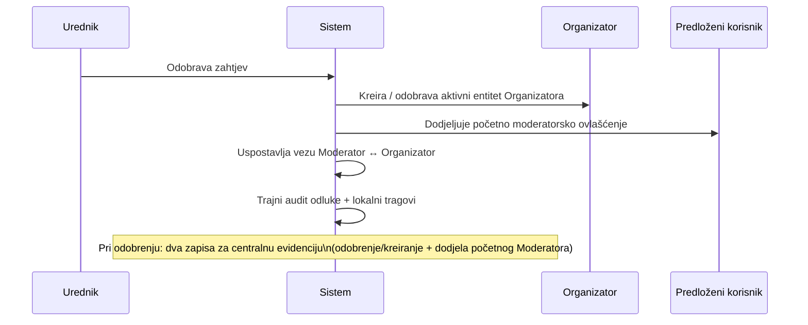
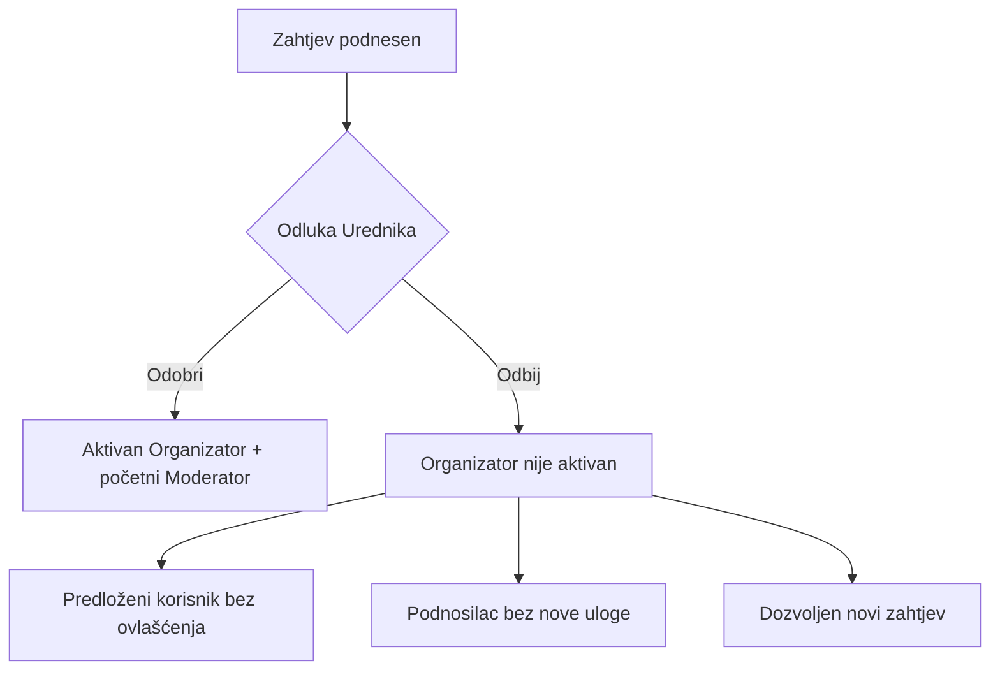
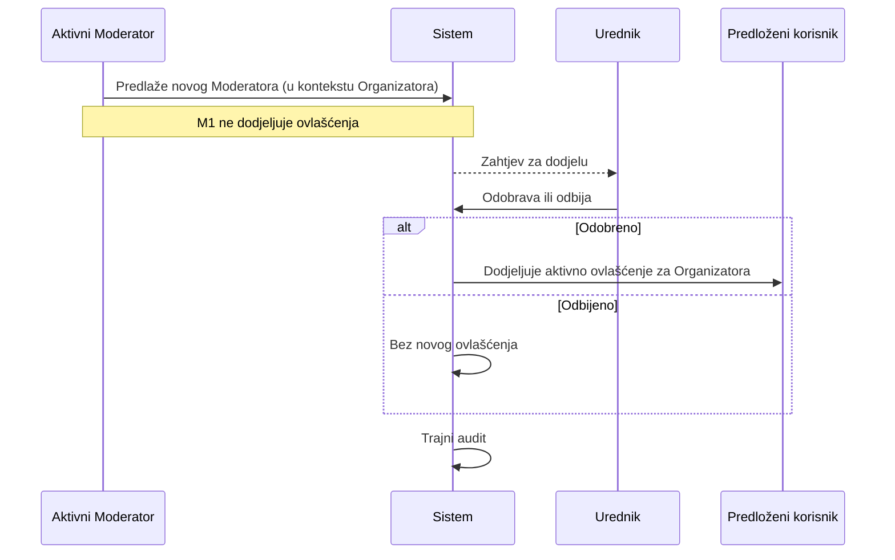
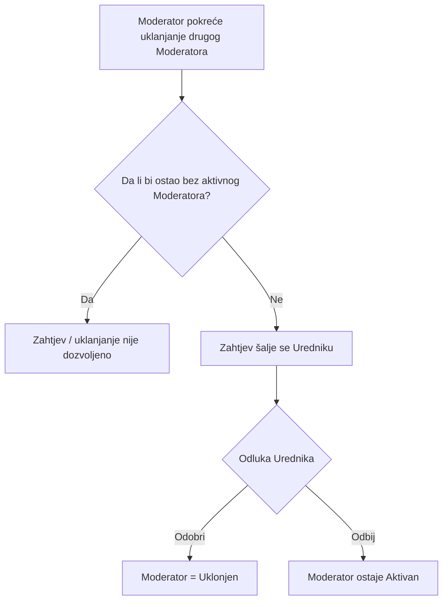
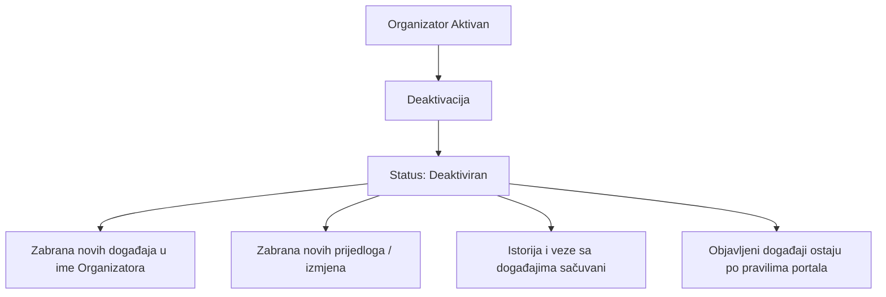
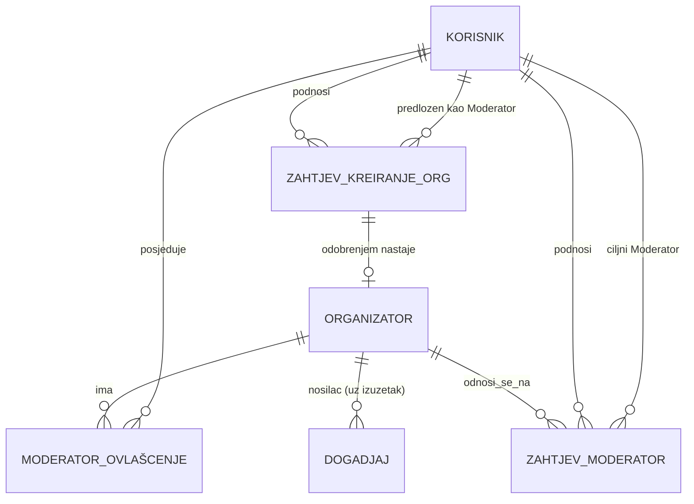

# Digital Kotor
# Technical Specification
## Organizator, Moderator i zahtjev za kreiranje Organizatora

**Feature ID:** FT-001  
**Oznaka dokumenta:** TS-001  
**Funkcionalna cjelina:** Organizator, Moderator i zahtjev za kreiranje Organizatora  
**Modul:** Kalendar kulture  
**Status dokumenta:** Usvojen  
**Verzija:** 0.4.2
**Datum:** 2026-08-13

---

# Istorija verzija

| Verzija | Datum | Opis |
|---------|--------|------|
| 0.1 | 2026-07-28 | Prva verzija Technical Specification za funkcionalnu cjelinu Organizator / Moderator / Zahtjev za kreiranje Organizatora. Dokument usklađen sa usvojenim BM-01, BM-02, BM-03 (relevantni dijelovi), FS §5.6, §5.8 i Platformskim pravilom. Bez implementacionog dizajna baze, API-ja i koda. |
| 0.2 | 2026-07-28 | Redakcijsko usklađivanje strukture dokumenta sa M-TS-005 (standardna struktura TS). Bez izmjene poslovnih i funkcionalnih pravila. |
| 0.2.1 | 2026-07-30 | Documentation Consistency Patch (CR-001): usklađene statusne oznake dokumenta i status razvoja poglavlja sa stvarnim stanjem finalizovanog TS sadržaja. Bez izmjene poslovnih i funkcionalnih pravila. |
| 0.3.0 | 2026-08-07 | Ugrađene usvojene Product Owner odluke PO-ORG-01–PO-ORG-04: katalog polja Organizatora V1; identifikacija Moderatora preko `user_id`; kreiranje entiteta tek pri odobrenju; pristup uredničkom portalu iz aktivnog moderatorskog ovlašćenja bez nove platformske uloge. Zatvorena otvorena pitanja 1, 2, 3 i 15. Usklađeno sa BM PATCH-054 / FS PATCH-FS-054. Bez implementacije. |
| 0.3.1 | 2026-08-11 | **PO-ORG-05:** napomena Urednika — approve opciono; reject obavezno; storage `decision_note` (nullable u DB); server-side validacija; fail-closed. Usklađeno sa BM PATCH-067 / FS PATCH-FS-068 / BR-307. |
| 0.4.0 | 2026-08-11 | **PO-ORG-06:** privacy-safe Moderator invitation — schema delta; waiting status; resolver (Verified + catch-up); mailables; editor gating; duplicates; outcome/REMOVE emails; supersede PO-ORG-02 selection model. Usklađeno sa BM PATCH-068 / FS PATCH-FS-069 / BR-308–BR-320. **TARGET contract; CURRENT production još koristi users dropdown.** Bez implementacije u ovom docs paketu. |
| 0.4.1 | 2026-08-12 | **PO-ORG-06 PRODUCTION CLOSEOUT (status sync):** Packages 1–5 implementirani i produkciono potvrđeni; schema migracija RAN; discoverable CTA „Zahtjev za Organizatora“ (`814ff96`). Normativni ugovor §15 neizmijenjen. Optional durable mail retry / `invitation_sent_at` ostaje non-blocking OUT OF SCOPE. |
| 0.4.2 | 2026-08-13 | **PO-ORG/MOD rejected request editor cleanup:** `Ukloni` = workspace dismiss (`editor_dismissed_at` / `editor_dismissed_by_user_id`); samo `rejected`; samo `kk_admin`; **ne** hard delete; default `Zahtjevi` filter `editor_dismissed_at IS NULL`; show route KEEP. Usklađeno sa BM PATCH-072 / FS PATCH-FS-071 / BR-326–BR-327 / TS-010 v1.0.9. |

Napomena:

Ovo poglavlje služi isključivo za evidenciju razvoja dokumenta.  
Kod svake naredne verzije dodaje se novi red u tabeli.  
Ne mijenjaju se postojeći redovi.

---

# Svrha dokumenta

Ovaj dokument opisuje kako će se usvojeni Business Model i Functional Specification za funkcionalnu cjelinu **Organizator**, **Moderator** i **Zahtjev za kreiranje Organizatora** tehnički realizovati u okviru FT-001 – Kalendar kulture.

TS-001 obrađuje jednu logički zaokruženu funkcionalnu cjelinu unutar FT-001 i ne predstavlja kompletnu tehničku specifikaciju svih cjelina Feature-a FT-001.

Dokument:

* ne uvodi nova poslovna pravila;
* ne zamjenjuje Business Model niti Functional Specification;
* nije Technical Overview trenutne implementacije;
* nije Change Request;
* ne definiše SQL, migracije, Laravel kod niti konkretne API ugovore.

Izvori istine za poslovna pravila:

* `docs/business-model/Business_Model_Kalendar_kulture_MASTER.md` (BM-01, BM-02, BM-03 i povezana pravila)
* `docs/functional-specifications/Functional-Specification.md` (Platformsko pravilo; §5.6; §5.8; relevantna pravila o događajima i auditu)
* `docs/features/Feature-Registry.md` (FT-001)
* `docs/METHODOLOGY.md`

---

# Status razvoja Technical Specification

| Poglavlje | Status |
|-----------|--------|
| 1. Pregled funkcionalne cjeline | Usvojeno |
| 2. Arhitektonski principi | Usvojeno |
| 3. Tehnički model | Usvojeno |
| 4. Tokovi | Usvojeno |
| 5. Autorizacija i ovlašćenja | Usvojeno |
| 6. Model podataka | Usvojeno |
| 7. Validacije | Usvojeno |
| 8. Evidencija aktivnosti (Audit) | Usvojeno |
| 9. Integracije | Usvojeno |
| 10. Nefunkcionalni zahtjevi | Usvojeno |
| 11. Granice V1 (Out of Scope) | Usvojeno |
| 12. Otvorena pitanja | Usvojeno |
| 13. Matrica sljedivosti | Usvojeno |
| 14. Napomene za implementaciju | Usvojeno |
| 15. PO-ORG-06 privacy-safe invitation | Usvojeno (IMPLEMENTED / PRODUCTION VERIFIED) |

---

# Pravila upravljanja ovim dokumentom

1. TS-001 pripada FT-001 – Kalendar kulture.
2. Tehnički sadržaj mora ostati usklađen sa usvojenim BM i FS.
3. Nova poslovna pravila se ne uvode kroz Technical Specification.
4. Sve što nije definisano u BM ili FS evidentira se kao **Otvoreno pitanje**.
5. Product Owner donosi poslovne odluke; ovaj dokument ih ne pretpostavlja.
6. Izmjene usvojenog sadržaja u narednim verzijama evidentiraju se novim redom u istoriji verzija.

---

# 1. Pregled funkcionalne cjeline

Izvori

Business Model:
- BM-ORG-01–BM-ORG-19
- BM-MOD-01–BM-MOD-26
- BM-UR-01, BM-UR-05, BM-UR-08, BM-UR-09, BM-UR-10
- BM-EP-02, BM-EP-03, BM-EP-06

Functional Specification:
- Platformsko pravilo
- §5.6 (BR-045–BR-055, BR-135–BR-137, BR-275–BR-276, BR-307–BR-320)
- §5.8 (BR-070–BR-073)
- §5.16 (BR-178–BR-181)

## 1.1 Svrha funkcionalne cjeline

Funkcionalna cjelina omogućava da Kalendar kulture vodi **Organizatora** kao poslovni entitet i nosioca sadržaja, a da operativne radnje u njegovo ime obavljaju **Moderatori** — registrovani korisnici sa ovlašćenjem za konkretnog Organizatora.

Organizator:

* nije korisnik sistema;
* nije korisnička uloga;
* nema korisnički nalog na osnovu statusa Organizatora;
* ne prijavljuje se i ne pristupa portalu kao Organizator;
* ne izvršava neposredno radnje u sistemu.

Kreiranje Organizatora pokreće se **zahtjevom za kreiranje Organizatora**, koji podnosi registrovani korisnik. Ovlašćenja Moderatora nastaju isključivo nakon odobrenja Urednika.

## 1.2 Obuhvat dokumenta

Obuhvat TS-001:

* tehnički model Organizatora kao poslovnog entiteta;
* tehnički model ovlašćenja Moderatora u odnosu na Organizatora;
* tehnički model zahtjeva za kreiranje Organizatora;
* tehnički tokovi odobravanja / odbijanja, dodjele i uklanjanja Moderatora, te deaktivacije Organizatora;
* konceptualni model podataka (bez SQL / migracija);
* logički model autorizacije (bez middleware / Laravel koda);
* lokalni audit tragovi vezani za ovu cjelinu;
* integracione tačke prema korisnicima platforme, Uredničkom portalu, događajima i Evidenciji aktivnosti.

Van obuhvata ovog dokumenta:

* implementacija;
* migracije i fizički model baze;
* Laravel kod, rute, kontroleri, middleware;
* detaljni dizajn FT-003 (centralna Evidencija aktivnosti);
* workflow događaja u punoj širini (obrađen u FS §5.5 / §5.7; ovdje samo veze pripadnosti);
* Newsletter, lokacije, kategorije, mediji, javni portal — osim gdje utiču na Organizatora / Moderatora.

## 1.3 Zavisnosti

| Zavisnost | Uloga u odnosu na TS-001 |
|-----------|---------------------------|
| Platforma Digital Kotor – korisnički nalozi | Identitet podnosioca, predloženog Moderatora, aktivnog Moderatora i Urednika |
| Platformske uloge (Urednik / Administrator platforme) | Dodjela van Kalendara kulture; Kalendar koristi već dodijeljenu ulogu Urednika |
| Urednički portal | Operativni prostor Moderatora i Urednika |
| Događaji / Manifestacije | Pripadaju Organizatoru; Moderatori rade u aktivnom kontekstu Organizatora |
| Evidencija aktivnosti (FT-003) | Prima poslovno značajne događaje iz kataloga FS §5.16; TS-001 ne projektuje FT-003 |
| Technical Overview (`cultural-calendar.md`) | Opisuje trenutno stanje; nije izvor istine za ciljni model |

## 1.4 Veze sa BM, FS i FT-001

```
FT-001 Kalendar kulture
  → BM-01 Organizator
  → BM-02 Moderator organizatora
  → BM-03 Urednik (relevantni dijelovi)
  → FS Platformsko pravilo
  → FS §5.6 Upravljanje organizatorima (BR-045–BR-055, BR-135–BR-137, BR-275–BR-276)
  → FS §5.8 Upravljanje moderatorima (BR-070–BR-073)
  → FS §5.16 Evidencija aktivnosti (katalog Organizatori / Moderator; bez projektovanja FT-003)
  → TS-001 (ovaj dokument)
```

Trenutna implementacija još ne sadrži ovu cjelinu; odstupanja se vode u Technical Overview, ne u TS-001.

---

# 2. Arhitektonski principi

Izvori

Business Model:
- BM-ORG-01, BM-ORG-04, BM-ORG-06
- BM-ORG-12
- BM-MOD-02, BM-MOD-04, BM-MOD-11
- BM-UR-09, BM-UR-10
- BM-AL-07

Functional Specification:
- Platformsko pravilo
- BR-047, BR-049, BR-051, BR-055
- BR-073
- BR-178–BR-181

## 2.1 Razdvajanje platformskih uloga od poslovnih entiteta

Platformske uloge (npr. Urednik Kalendara kulture, Administrator platforme, običan registrovani korisnik) ostaju u nadležnosti platforme Digital Kotor.

Organizator je **poslovni entitet modula**, ne platformska uloga i ne korisnički nalog.

Moderator je **poslovno ovlašćenje** registrovanog korisnika za konkretnog Organizatora, koje se dodjeljuje i ukida unutar Kalendara kulture.

Tehnički model ne smije tretirati Organizatora kao user role niti izjednačavati Moderatora sa Urednikom.

## 2.2 Modularnost

Cjeline Organizator, Moderator i Zahtjev predstavljaju zasebne logičke tehničke odgovornosti unutar FT-001.

Promjene u ovoj cjelini ne smiju zahtijevati izmjenu poslovnog značenja platformskih uloga drugih modula.

## 2.3 Proširivost

Model mora podržati:

* više Moderatora po Organizatoru;
* više Organizatora za koje isti korisnik može biti Moderator;
* buduće dopune atributa Organizatora bez promjene osnovnog odnosa nosilac sadržaja ↔ ovlašćeni Moderator;
* buduće vrste zahtjeva vezanih za ovlašćenja, bez miješanja sa platformskim ulogama.

Konkretan katalog tipova Organizatora nije usvojen u BM/FS — vidi Otvorena pitanja.

## 2.4 Auditabilnost

Svaki zahtjev i svaka urednička odluka o Organizatoru / Moderatoru mora ostaviti trajni, neizmjenjivi lokalni trag u skladu sa BR-055 i BR-073.

Poslovno značajne radnje iz V1 kataloga FS §5.16 moraju biti dostupne za upis u centralnu Evidenciju aktivnosti, bez projektovanja FT-003 u ovom dokumentu.

## 2.5 Sljedivost

Za svaku poslovno značajnu radnju sistem mora moći odgovoriti:

* ko je pokrenuo radnju;
* u ime kojeg Organizatora (aktivni kontekst, kada je primjenjivo);
* kada je radnja izvršena;
* koja je odluka donijeta (gdje postoji odobravanje).

## 2.6 Minimalan uticaj na postojeći sistem

Uvođenje cjeline mora:

* zadržati postojeći model platformskih korisnika i uloga;
* ne mijenjati značenje postojeće uloge Urednika (`kk_admin` u trenutnoj implementaciji = poslovni Urednik);
* omogućiti postepeno uvođenje bez redefinisanja drugih modula platforme;
* sačuvati postojeće događaje i omogućiti kasnije usklađivanje sa pripadnošću Organizatoru u skladu sa BR-045 / BR-052.

---

# 3. Tehnički model

Izvori

Business Model:
- BM-ORG-01–BM-ORG-12
- BM-MOD-01–BM-MOD-15
- BM-UR-01, BM-UR-05, BM-UR-08, BM-UR-09, BM-UR-10
- BM-GL-06, BM-GL-07, BM-GL-08

Functional Specification:
- BR-045–BR-055
- BR-070–BR-073
- BR-135–BR-137

Tehnički model je logički. Ne definiše tabele, ORM klase ni fizičko skladištenje.

## 3.1 Organizator

**Odgovornost**

Poslovni entitet i nosilac sadržaja u Kalendaru kulture. Predstavlja subjekt u čije ime se vode događaji i povezani sadržaj.

**Životni ciklus (ciljni model usklađen sa FS)**

```
[Zahtjev u obradi] → Aktivan → Deaktiviran
```

* **Aktivan** — Organizator je odobren; Moderatori mogu raditi u njegovo ime u skladu sa pravilima.
* **Deaktiviran** — Moderatori ne mogu kreirati nove događaje niti slati nove prijedloge/izmjene u ime tog Organizatora; postojeći objavljeni događaji ostaju dostupni po pravilima otkazivanja i arhiviranja (BM-ORG-12, BM-UR-10, BR-049, BR-050).

Brisanje Organizatora nije dozvoljeno ako postoje povezani događaji (BM-ORG-12, BM-UR-10, BR-049).  
Istorijski podaci i veze sa događajima moraju ostati sačuvani pri deaktivaciji (BM-ORG-12, BM-UR-10, BR-049, BR-050).

**Odnosi**

* 1 Organizator : N Moderator ovlašćenja (najmanje jedno aktivno dok je Organizator aktivan — BR-047, BM-MOD-07).
* 1 Organizator : N Događaja (BR-046), uz izuzetak događaja bez registrovanog Organizatora (BR-045).
* Nastaje kao ishod odobrenog zahtjeva za kreiranje Organizatora.

**Ograničenja**

* nije korisnik ni uloga;
* ne pristupa Uredničkom portalu;
* ne dodjeljuje ovlašćenja Moderatorima;
* ne objavljuje sadržaj.

**Nastanak entiteta (PO-ORG-03)**

Organizator **ne nastaje** podnošenjem zahtjeva. Tehnički zapis Organizatora kreira se **tek nakon odobrenja** zahtjeva od strane Urednika. Pri odobrenju sistem atomično: kreira Organizatora (status Aktivan), dodjeljuje početnog Moderatora i označava zahtjev kao odobren. Odbijeni zahtjev ne kreira entitet Organizatora.

## 3.2 Moderator (ovlašćenje)

**Odgovornost**

Poslovno ovlašćenje registrovanog korisnika da u aktivnom kontekstu konkretnog Organizatora obavlja operativne radnje (kreiranje/uređivanje sadržaja, predlaganje Moderatora, pokretanje uklanjanja, upravljanje podacima Organizatora u skladu sa BM-GL-07), osim samostalne objave.

**Životni ciklus**

```
Predložen (zahtjev) → Na odobrenju → Aktivan → Uklonjen
```

* Ovlašćenja nastaju tek nakon odobrenja Urednika.
* Uklanjanje važi tek nakon odobrenja Urednika (BR-071, BM-MOD-09).
* Nije dozvoljeno ukloniti posljednjeg aktivnog Moderatora (BR-072, BM-MOD-10).

**Odnosi**

* N : 1 prema Korisniku (isti korisnik može biti Moderator više Organizatora — BM-MOD-02, BR-051).
* N : 1 prema Organizatoru.
* Početni Moderator nastaje iz odobrenog zahtjeva za kreiranje Organizatora.
* Naredni Moderatori nastaju iz zahtjeva koje podnosi postojeći aktivni Moderator istog Organizatora.

**Identifikacija i predlaganje (PO-ORG-06 supersede PO-ORG-02 selection)**

**Aktivan** Moderator mora biti korisnik sa registrovanim, **verifikovanim** i **aktivnim** nalogom; grant se vezuje na stabilni `user_id` **nakon** odobrenja Urednika.

**Predlaganje** (početni / naredni ADD): privacy-safe unos **imena i prezimena** + **e-maila**. Server resolve-uje nalog preko normalizovanog e-maila. Klijent **ne** šalje trusted moderator `user_id`. Zahtjev **može** postojati prije `user_id` binding-a (status waiting).

Raniji PO-ORG-02 model „biraj samo iz postojećeg users kataloga pri submit-u“ je **superseded** za input UX; grant i dalje koristi `user_id` nakon resolve + approve.

**Pristup uredničkom portalu (PO-ORG-04)**

Moderator ima pristup uredničkom portalu Kalendara kulture. To **nije** nova platformska uloga. Pravo pristupa proizlazi iz **aktivnog moderatorskog ovlašćenja** nad najmanje jednim **aktivnim** Organizatorom. Platformska uloga Urednika ostaje isključivo `kk_admin`.

**Ograničenja**

* nije Urednik;
* nije Organizator;
* nije nova platformska uloga;
* ne dodjeljuje ovlašćenja — samo predlaže;
* ne može samostalno objaviti sadržaj;
* pri radnji postupa isključivo u aktivnom kontekstu jednog Organizatora.

## 3.3 Zahtjev za kreiranje Organizatora

**Odgovornost**

Poslovni postupak kojim registrovani korisnik predlaže novi entitet Organizatora i predloženog početnog Moderatora. Podnošenje zahtjeva samo po sebi ne stvara aktivnog Organizatora niti Moderatora.

**Životni ciklus**

```
Čeka registraciju Moderatora → Podnesen → Odobren
                                      ↘ Odbijen
```

* **Čeka registraciju Moderatora** (tehnički predlog statusa: `awaiting_moderator_eligibility`) — zahtjev sačuvan; nije decision-ready; nema Org; nema grant; invitation mail ako nije eligible.
* **Podnesen** (`submitted`) — eligible + bound `user_id`; Urednik može odlučivati.
* **Odobren** — nastaje Organizator; početni Moderator grant; approval email.
* **Odbijen** — bez Org/grant; rejection email + Napomena Urednika (PO-ORG-05).

**Sadržaj zahtjeva (BR-135 / BM-ORG-07 / PO-ORG-01 / PO-ORG-06)**

* podaci o predloženom Organizatoru (katalog V1 — vidi §6.2): naziv (obavezno); opis, kontakt e-mail, kontakt telefon, web sajt (opciono);
* `proposed_moderator_name` (obavezno);
* `proposed_moderator_email` (obavezno; store normalized);
* `proposed_moderator_user_id` (nullable FK; bind kada eligible).

**Odnosi**

* 1 zahtjev : 1 podnosilac (registrovani korisnik);
* 1 zahtjev : 1 predloženi Moderator (ime+email; 0..1 bound user);
* 1 zahtjev : 0..1 aktivni Organizator (nastaje pri odobrenju);
* 1 korisnik : N zahtjeva (BR-136).

**Ograničenja**

* podnošenje ne mijenja platformske uloge;
* Urednik odobrava ili odbija **samo** Podnesen (BM-UR-01 / BR-309);
* napomena Urednika: **opciona** pri odobrenju; **obavezna** (ne-prazna) pri odbijanju (PO-ORG-05 / BR-307 / BM-ORG-14);
* storage: `decision_note` (nullable u bazi — obaveznost je server-side validacija, ne DB NOT NULL);
* fail-closed: odbijanje bez napomene ne mijenja status (ostaje submitted) i ne kreira Organizator/grant;
* validaciona poruka: „Napomena je obavezna prilikom odbijanja zahtjeva.“;
* trajni audit obavezan (BR-055, BM-ORG-09), uključujući sačuvanu napomenu kada postoji;
* neutral flash podnosiocu (BR-312).
* **Uklanjanje iz uredničkog prikaza (BM-ORG-20 / BR-326):** samo status `rejected`; samo Urednik; upis `editor_dismissed_at` + `editor_dismissed_by_user_id`; status i decision metadata **ne** mijenjaju se; **nema** hard delete; default lista `Zahtjevi` / Org indeks filtrira `editor_dismissed_at IS NULL`; show ruta ostaje dostupna `kk_admin`-u.

## 3.4 Zahtjev za dodjelu / uklanjanje Moderatora

Iako naziv dokumenta ističe zahtjev za kreiranje Organizatora, BM/FS zahtijevaju i zahtjeve za Moderatore. Tehnički model ih tretira kao zasebne postupke vezane za isto ovlašćenje.

**Zahtjev za dodjelu ovlašćenja Moderatora**

* pokreće postojeći aktivni Moderator Organizatora (BR-053);
* UI: ime + e-mail (bez users dropdown) — BR-308;
* isti waiting / Podnesen / eligibility model kao Org creation;
* odobrava / odbija isključivo Urednik nad **Podnesen** (BR-054, BM-UR-08);
* reject note **obavezna** (PO-ORG-06 / BR-317; `decision_note` postoji);
* tek nakon odobrenja novo ovlašćenje postaje aktivno (`source=subsequent`).

**Zahtjev za uklanjanje Moderatora**

* pokreće Moderator za drugog **postojećeg aktivnog** Moderatora istog Organizatora (BR-070);
* **ne** koristi invitation / name+email matching;
* odobrava / odbija Urednik (BR-071);
* uklanjanje važi tek nakon odobrenja → REMOVE-approved email (BR-318);
* reject REMOVE → silence;
* zabranjeno ako bi ostao bez aktivnog Moderatora (BR-072);
* trajna evidencija (BR-073).
* **Uklanjanje iz uredničkog prikaza (BM-MOD-27 / BR-327):** isto pravilo za rejected ADD i rejected REMOVE — workspace dismiss metadata; grant netaknut; **ne** hard delete; default Mod lista filtrira dismissed.

## 3.5 Aktivni kontekst Organizatora

Kada korisnik ima moderatorska ovlašćenja za više Organizatora, svaka radnja izvršava se u kontekstu tačno jednog Organizatora (BM-MOD-04, BR-051).

Aktivni kontekst:

* nije izbor platformske uloge;
* nije isto što i uloga Urednika;
* mora biti dovoljno određen da sistem primijeni pripadnost sadržaja, ovlašćenja i audit.

Tehnički mehanizam izbora / čuvanja konteksta nije propisan u FS — **Otvoreno pitanje** (§12).

## 3.6 Urednik (u odnosu na ovu cjelinu)

Urednik je isključiva administrativna uloga Uredničkog portala (BM-UR-09).

U okviru TS-001 Urednik (platformska uloga `kk_admin`):

* odobrava / odbija zahtjeve za kreiranje Organizatora;
* odobrava / odbija dodjelu i uklanjanje Moderatora;
* dodjeljuje pristup novom Moderatoru (ovlašćenje, ne platformska uloga);
* ne postaje Moderator niti Organizator kroz ove tokove;
* ne mijenja aktivnu poslovnu ulogu;
* ostaje jedina platformska uloga Urednika (PO-ORG-04).

---

# 4. Tokovi

Izvori

Business Model:
- BM-ORG-02, BM-ORG-03, BM-ORG-08, BM-ORG-11
- BM-ORG-12
- BM-MOD-08, BM-MOD-09, BM-MOD-10, BM-MOD-13, BM-MOD-14
- BM-UR-01, BM-UR-05, BM-UR-08, BM-UR-10

Functional Specification:
- BR-047, BR-049, BR-050
- BR-053, BR-054, BR-055
- BR-070–BR-073
- BR-135–BR-137

## 4.1 Podnošenje zahtjeva za kreiranje Organizatora

```mermaid
sequenceDiagram
  participant K as Registrovani korisnik
  participant S as Sistem (Kalendar kulture)
  participant M as Predloženi Moderator

  K->>S: Podnosi zahtjev (Org podaci + ime + e-mail Moderatora)
  S->>S: Normalize email; internal lookup; eligibility
  alt Eligible
    S->>S: Bind user_id; status Podnesen
  else Not eligible
    S->>S: status Čeka registraciju Moderatora
    S-->>M: Invitation email (+ /register)
  end
  S-->>K: Neutral flash (BR-312)
  Note over K,S: Nema Org; nema grant; Urednik vidi samo Podnesen
```

**Tehnički tok**

1. Sistem potvrđuje da je podnosilac registrovan, aktivan i verifikovan.
2. Sistem prima sadržaj zahtjeva u skladu sa BR-135 (name+email; **ne** trusted user_id).
3. Normalize email (trim+lowercase); lookup; ako eligible → bind + `submitted`; inače → `awaiting_moderator_eligibility` + invitation mail.
4. Sistem ne dodjeljuje platformske uloge niti moderatorska ovlašćenja.
5. Neutral flash (BR-312) — bez enumeration.
6. Mail failure ne rollbackuje request (BR-319).

## 4.2 Odobravanje zahtjeva, kreiranje Organizatora i dodjela početnog Moderatora



**Tehnički tok**

1. Urednik pregleda zahtjev.
2. Pri odobrenju sistem:
   * uspostavlja Organizatora kao aktivan poslovni entitet;
   * dodjeljuje predloženom korisniku početno moderatorsko ovlašćenje;
   * uspostavlja poslovnu vezu Moderator ↔ Organizator;
   * bilježi Urednika i vrijeme odluke.
3. Podnosilac ne dobija posebnu ulogu „Organizator“.
4. Moderatorska ovlašćenja nastaju tek u ovom koraku.

## 4.3 Odbijanje zahtjeva



**Tehnički tok**

1. Urednik odbija zahtjev.
2. Sistem ne aktivira Organizatora.
3. Sistem ne dodjeljuje moderatorska ovlašćenja.
4. Sistem bilježi odluku i vrijeme.
5. Podnosilac može kasnije podnijeti novi zahtjev (BR-137).

## 4.4 Dodjela dodatnog Moderatora



**Tehnički tok**

1. Samo aktivni Moderator datog Organizatora može predložiti narednog.
2. Predlaganje se vrši u aktivnom kontekstu tog Organizatora.
3. Urednik odlučuje i, ako odobri, isključivo on dodjeljuje pristup.
4. Novo ovlašćenje postaje aktivno tek nakon odobrenja.

## 4.5 Uklanjanje Moderatora



**Tehnički tok**

1. Moderator pokreće zahtjev za uklanjanje drugog Moderatora istog Organizatora.
2. Sistem provjerava zabranu uklanjanja posljednjeg aktivnog Moderatora.
3. Urednik odobrava ili odbija.
4. Status uklonjen nastaje tek nakon odobrenja.
5. Sistem vodi evidenciju podnošenja, obrade i odluke (BR-073).

## 4.6 Deaktivacija Organizatora



**Tehnički tok**

1. Organizator prelazi u status Deaktiviran.
2. Moderatori gube mogućnost kreiranja novih događaja i slanja novih prijedloga/izmjena u ime tog Organizatora (BM-ORG-12, BM-UR-10, BR-049, BR-050).
3. Brisanje nije alternativa deaktivaciji kada postoje povezani događaji (BM-ORG-12, BM-UR-10, BR-049).
4. Deaktivacija je poslovno značajna aktivnost za lokalni trag i za katalog Evidencije aktivnosti.

Deaktivaciju Organizatora pokreće Urednik bez prethodnog zahtjeva Organizatora ili Moderatora (BM-ORG-12, BM-UR-10, BR-049, BR-050).

---

# 5. Autorizacija i ovlašćenja

Izvori

Business Model:
- BM-ORG-02, BM-ORG-04, BM-ORG-05, BM-ORG-12
- BM-MOD-08, BM-MOD-11, BM-MOD-13
- BM-UR-01, BM-UR-02, BM-UR-05, BM-UR-08, BM-UR-09, BM-UR-10
- BM-EP-03

Functional Specification:
- Platformsko pravilo
- BR-048, BR-049, BR-051, BR-053, BR-054
- BR-070, BR-071
- BR-135, BR-137

Logički model ovlašćenja (bez middleware / framework detalja).

| Radnja | Ko smije | Napomena / izvor |
|--------|----------|------------------|
| Podnijeti zahtjev za kreiranje Organizatora | Registrovani aktivni korisnik platforme | BM-ORG-02, BR-135, Platformsko pravilo |
| Odobriti zahtjev za kreiranje Organizatora | Urednik | BM-UR-01 |
| Odbiti zahtjev za kreiranje Organizatora | Urednik | BM-UR-01, BR-137 |
| Deaktivirati Organizatora | Urednik | BM-ORG-12, BM-UR-10, BR-049, BR-050 |
| Predložiti dodatnog Moderatora | Aktivni Moderator istog Organizatora | BR-053, BM-MOD-13 |
| Odobriti / odbiti dodjelu Moderatora | Urednik | BR-054, BM-UR-08 |
| Pokrenuti uklanjanje Moderatora | Aktivni Moderator (za drugog Moderatora istog Organizatora) | BR-070, BM-MOD-08 |
| Odobriti / odbiti uklanjanje Moderatora | Urednik | BR-071, BM-UR-05 |
| Upravljati podacima Organizatora | Moderator u aktivnom kontekstu; Urednik kroz Urednički portal | BM-GL-07, BM-EP-03; **obim izmjena — Otvoreno pitanje** |
| Kreirati / uređivati događaj u ime Organizatora | Aktivni Moderator tog Organizatora; Urednik po pravilima događaja | BM-ORG-04, BM-MOD-05 |
| Poslati događaj na odobrenje | Aktivni Moderator Organizatora | FS §5.5.5 |
| Objaviti događaj | Isključivo Urednik | BM-ORG-05, BM-UR-02 |

Dodatna pravila autorizacije:

* Urednik ne kombinuje ulogu sa Moderatorom / običnim korisnikom u poslovnom modelu Kalendara kulture.
* Moderator bez aktivnog konteksta Organizatora ne smije izvršavati radnje koje zahtijevaju pripadnost Organizatoru.
* Deaktiviran Organizator onemogućava moderatorske radnje kreiranja i slanja novih prijedloga/izmjena (BM-ORG-12, BM-UR-10, BR-049, BR-050).
* Organizator kao entitet nema ovlašćenja za prijavu ni radnje.

---

# 6. Model podataka

Izvori

Business Model:
- BM-ORG-01, BM-ORG-07, BM-ORG-09
- BM-MOD-02, BM-MOD-07, BM-MOD-10, BM-MOD-15
- BM-GL-06, BM-GL-07

Functional Specification:
- BR-046, BR-047, BR-049, BR-050
- BR-051, BR-053, BR-054, BR-055
- BR-070–BR-073
- BR-135–BR-137

Konceptualni model. Bez SQL, bez migracija, bez fizičkih tipova.

## 6.1 Dijagram odnosa



## 6.2 Entitet: Organizator

**Svrha:** nosilac sadržaja.

**Ključni atributi (konceptualno; PO-ORG-01 / BM-ORG-13)**

| Atribut / svojstvo | Obavezno | Obrazloženje |
|--------------------|----------|--------------|
| Identitet entiteta | Da | Jedinstvena identifikacija Organizatora u modulu |
| Naziv | Da | Poslovni naziv Organizatora |
| Opis | Ne | Kratki opis |
| Kontakt e-mail | Ne | Kontakt Organizatora |
| Kontakt telefon | Ne | Kontakt Organizatora |
| Web sajt | Ne | URL |
| Status | Da | Aktivan / Deaktiviran (BM-ORG-12) |
| Sistemski datumi | Da | created_at / updated_at (i vrijeme nastanka aktivnog entiteta) |
| Veza na odobravajući zahtjev | Da | Sljedivost prema zahtjevu |

**Van V1 kataloga polja (PO-ORG-01):** PIB, matični broj, adresa, GPS, društvene mreže, logo i ostali pravni podaci — ne uvode se.

**Veze / kardinalnosti**

* 0..1 zahtjev za kreiranje ↔ 1 Organizator (nakon odobrenja);
* 1 Organizator : 1..N aktivnih Moderatora dok je aktivan (poslovno pravilo minimuma);
* 1 Organizator : 0..N događaja.

**Poslovna ograničenja**

* nije korisnički nalog;
* ne briše se ako ima povezane događaje;
* deaktivacija čuva istoriju (BM-ORG-12, BM-UR-10, BR-049, BR-050).

## 6.3 Entitet: Moderator ovlašćenje

**Svrha:** veza korisnik ↔ Organizator sa statusom ovlašćenja.

**Ključni atributi**

| Atribut / svojstvo | Obrazloženje |
|--------------------|--------------|
| Referenca na korisnika | Registrovani korisnik platforme — `user_id` na **grantu** (nakon approve) |
| Referenca na Organizatora | Konkretni Organizator |
| Status | Aktivan / Uklonjen (i prelazna stanja kroz zahtjev) |
| Tip nastanka | Početni (iz zahtjeva za kreiranje) / Naredni (iz zahtjeva za dodjelu) |
| Vrijeme aktivacije | Nakon odobrenja Urednika |
| Vrijeme uklanjanja | Nakon odobrenja uklanjanja |

**Veze / kardinalnosti**

* N ovlašćenja : 1 korisnik;
* N ovlašćenja : 1 Organizator;
* u jednom trenutku korisnik ima najviše jedno aktivno ovlašćenje po Organizatoru (**tehničko ograničenje radi integriteta; nije eksplicitno BM pravilo — potvrditi u §12 ako treba poslovna potvrda**).

**Poslovna ograničenja**

* aktivacija samo nakon odobrenja;
* uklanjanje samo nakon odobrenja;
* zabranjeno uklanjanje posljednjeg aktivnog.

## 6.4 Entitet: Zahtjev za kreiranje Organizatora

**Svrha:** postupak predlaganja novog Organizatora i početnog Moderatora.

**Ključni atributi**

| Atribut / svojstvo | Obrazloženje |
|--------------------|--------------|
| Podnosilac | Registrovani korisnik |
| proposed_moderator_name | Obavezno poslovno polje (ne za matching) |
| proposed_moderator_email | Obavezno; store normalized (trim+lowercase) |
| proposed_moderator_user_id | Nullable FK; bind kada eligible |
| Predloženi podaci Organizatora | Sadržaj zahtjeva (katalog V1) |
| Status | `awaiting_moderator_eligibility` / `submitted` / `approved` / `rejected` |
| Urednik odluke | Popunjava se pri odluci |
| decision_note | Nullable; required on reject (PO-ORG-05) |
| Datum/vrijeme podnošenja | BM-ORG-09, BR-055 |
| Datum/vrijeme odluke | BM-ORG-09, BR-055 |

**Veze / kardinalnosti**

* N zahtjeva : 1 podnosilac;
* 1 zahtjev : 1 predloženi Moderator;
* 1 odobren zahtjev : 1 Organizator.

## 6.5 Entitet: Zahtjev za Moderatora (dodjela / uklanjanje)

**Svrha:** postupci predlaganja dodjele ili uklanjanja ovlašćenja.

**Ključni atributi**

| Atribut / svojstvo | Obrazloženje |
|--------------------|--------------|
| Vrsta | Dodjela / Uklanjanje |
| Organizator | Kontekst zahtjeva |
| Podnosilac | Aktivni Moderator |
| proposed_moderator_name / email | ADD only; obavezno; email normalized |
| target_user_id | ADD: nullable do eligibility bind; REMOVE: postojeći aktivni Moderator (bound) |
| Status | `awaiting_moderator_eligibility` (ADD) / `submitted` / `approved` / `rejected` |
| decision_note | Nullable; **required on ADD reject** (PO-ORG-06 / BR-317); Org-create rule PO-ORG-05 KEEP |
| Urednik odluke | Pri odluci |
| Datum/vrijeme podnošenja i odluke | BM-MOD-15, BR-055, BR-073 |

**Veze / kardinalnosti**

* N zahtjeva : 1 Organizator;
* 1 zahtjev : 1 podnosilac;
* 1 zahtjev : 1 ciljni korisnik.

## 6.6 Koncept: Aktivni kontekst

Nije samostalni poslovni entitet u BM/FS, ali je obavezan tehnički koncept.

**Svrha:** određivanje Organizatora u čije ime Moderator izvršava radnju.

**Obavezna svojstva pri radnji**

* identifikator Organizatora u kontekstu;
* korisnik izvršilac;
* potvrda da postoji aktivno moderatorsko ovlašćenje za taj par.

Mehanizam perzistencije konteksta — **Otvoreno pitanje**.

---

# 7. Validacije

Izvori

Business Model:
- BM-ORG-02, BM-ORG-08, BM-ORG-10, BM-ORG-11
- BM-ORG-12
- BM-MOD-10, BM-MOD-13, BM-MOD-14
- BM-UR-01, BM-UR-10

Functional Specification:
- BR-049, BR-050
- BR-053, BR-054, BR-055
- BR-070–BR-073
- BR-135–BR-137

## 7.1 Obavezna polja / sadržaj

Za **zahtjev za kreiranje Organizatora** (BR-135 / PO-ORG-01 / PO-ORG-06):

* naziv Organizatora (obavezno);
* opis, kontakt e-mail, kontakt telefon, web sajt (opciono);
* `proposed_moderator_name` (obavezno);
* `proposed_moderator_email` (obavezno; valid email format; normalize);
* **zabranjeno** trusted `proposed_moderator_user_id` sa klijenta.

Zabranjeno u V1: PIB, matični broj, adresa, GPS, društvene mreže, logo i ostali pravni podaci.

Za **zahtjev za dodjelu Moderatora (ADD)**:

* Organizator (kontekst);
* podnosilac (aktivni Moderator);
* `proposed_moderator_name` + `proposed_moderator_email`;
* duplicate guard (BR-313).

Za **zahtjev za uklanjanje Moderatora (REMOVE)**:

* Organizator;
* podnosilac;
* ciljni aktivni Moderator (`target_user_id` bound);
* provjera da ciljni nije posljednji aktivni Moderator.

## 7.2 Poslovne validacije

* Podnosilac zahtjeva za kreiranje mora biti registrovan, aktivan i verifikovan (Platformsko pravilo, BM-ORG-02).
* Predloženi Moderator se predlaže imenom+e-mailom; eligibility = verified AND active (BM-ORG-16, BR-310).
* Podnošenje zahtjeva ne smije automatski aktivirati Organizatora ni Moderatora (BM-ORG-02, BM-ORG-08, BR-137).
* Odobrenje mora atomično (logički nedjeljivo) uspostaviti aktivnog Organizatora i početno ovlašćenje, ili u potpunosti odbiti ishod (BM-ORG-03, BM-ORG-08, BR-047, BR-137); **re-check eligibility** pri approve.
* Dodatnog Moderatora smije predložiti samo aktivni Moderator istog Organizatora (BM-MOD-13, BR-053).
* Deaktivaciju Organizatora pokreće Urednik i za nju nije potreban prethodni zahtjev Organizatora niti Moderatora (BM-ORG-12, BM-UR-10, BR-049, BR-050).
* Uklanjanje posljednjeg aktivnog Moderatora mora biti odbijeno (BM-MOD-10, BR-072).
* Radnje Moderatora nad sadržajem dozvoljene su samo za Organizatora iz aktivnog konteksta (BM-MOD-04, BR-051).
* Za deaktiviranog Organizatora zabranjeno je kreiranje novih događaja i slanje novih prijedloga/izmjena (BM-ORG-12, BM-UR-10, BR-049, BR-050).
* Brisanje Organizatora sa povezanim događajima nije dozvoljeno (BM-ORG-12, BM-UR-10, BR-049).
* Editor query: exclude `awaiting_moderator_eligibility` from decision-ready lists (BR-309).
* Duplicate ADD: same organizer + same normalized email + unfinished statuses (BR-313).

## 7.3 Tehničke validacije

* Referencirani korisnici moraju postojati u platformskom registru korisnika.
* Statusni prelazi zahtjeva i ovlašćenja smiju slijediti samo definisane tokove iz §4.
* Audit polja odluke ne smiju biti ručno izmjenjiva nakon upisa (BR-055).
* Aktivni kontekst, kada je potreban, mora biti postavljen prije autorizovane poslovne radnje.
* Isti korisnik ne smije dobiti duplo aktivno ovlašćenje za istog Organizatora (integritet veze).

## 7.4 Ograničenja

* Broj zahtjeva za kreiranje Organizatora po korisniku: neograničen (BR-136).
* Broj Moderatora po Organizatoru: jedan ili više; minimum jedan aktivan dok je Organizator aktivan.
* Broj Organizatora po Moderatoru: jedan ili više.
* Organizator nema pristup Uredničkom portalu.
* Moderator ne može samostalno objaviti sadržaj.

---

# 8. Evidencija aktivnosti (Audit)

Izvori

Business Model:
- BM-ORG-09
- BM-ORG-12
- BM-MOD-15
- BM-AL-01–BM-AL-08
- BM-EP-09
- BM-UR-10

Functional Specification:
- BR-049, BR-055
- BR-073
- BR-178–BR-181

Ovo poglavlje definiše **logičke događaje** koje ova cjelina mora evidentirati. Ne projektuje FT-003.

## 8.1 Lokalni audit tragovi (obavezni po BM/FS)

| Događaj | Ko pokreće | Kada nastaje | Šta se bilježi |
|---------|------------|--------------|----------------|
| Podnošenje zahtjeva za kreiranje Organizatora | Registrovani korisnik | Pri uspješnom podnošenju | Podnosilac; predloženi Moderator; datum/vrijeme podnošenja |
| Odluka o zahtjevu za kreiranje Organizatora | Urednik | Pri odobrenju ili odbijanju | Urednik; datum/vrijeme odluke; ishod; napomena (`decision_note`) kada je unesena (obavezna pri odbijanju — BR-307) |
| Podnošenje zahtjeva za dodjelu Moderatora | Aktivni Moderator | Pri podnošenju | Podnosilac; predloženi Moderator; Organizator; vrijeme |
| Odluka o dodjeli Moderatora | Urednik | Pri odobrenju/odbijanju | Urednik; vrijeme; ishod |
| Podnošenje zahtjeva za uklanjanje Moderatora | Aktivni Moderator | Pri podnošenju | Podnosilac; ciljni Moderator; Organizator; vrijeme |
| Odluka o uklanjanju Moderatora | Urednik | Pri odobrenju/odbijanju | Urednik; vrijeme; ishod |

Lokalni tragovi nisu ručno izmjenjivi (BR-055).

**Editor workspace dismiss (BM-ORG-20 / BM-MOD-27):** upis `editor_dismissed_at` / `editor_dismissed_by_user_id` **ne** briše lokalni audit trag; status i decision polja ostaju. Dismiss ≠ delete.

## 8.2 Poslovno značajni događaji relevantni za Evidenciju aktivnosti

U skladu sa FS §5.16 katalogom (bez projektovanja FT-003), ova cjelina mora biti u stanju emitovati najmanje:

| Događaj | Izvršilac | Napomena |
|---------|-----------|----------|
| Podnošenje zahtjeva za kreiranje Organizatora | Korisnik | |
| Odobravanje zahtjeva za kreiranje Organizatora | Urednik | Uz kreiranje/aktivaciju entiteta |
| Odbijanje zahtjeva za kreiranje Organizatora | Urednik | |
| Dodjela početnog ovlašćenja Moderatora | Urednik / sistemski ishod odobrenja | Drugi zapis pri odobrenju kreiranja (BR-179) |
| Podnošenje / odobravanje / odbijanje dodjele Moderatora | Moderator / Urednik | Zasebni zapisi |
| Podnošenje / odobravanje / odbijanje uklanjanja Moderatora | Moderator / Urednik | Zasebni zapisi |
| Deaktivacija Organizatora | Urednik | BM-ORG-12, BM-UR-10, BR-049, BR-050, BR-178 |
| Izmjene poslovno značajnih podataka Organizatora | Moderator / Urednik | Kriterijum „poslovno značajno“ iz FS |
| Naknadno povezivanje događaja sa Organizatorom | Urednik | BR-052; ne smije mijenjati postojeći audit događaja |

Ne ulazi u centralnu evidenciju kao zaseban događaj:

* sama promjena aktivnog konteksta Organizatora (bilježi se kao atribut drugih radnji kada je primjenjivo).

---

# 9. Integracije

Izvori

Business Model:
- BM-ORG-04
- BM-UR-06, BM-UR-07, BM-UR-10
- BM-EP-02, BM-EP-03, BM-EP-06
- BM-GL-09

Functional Specification:
- Platformsko pravilo
- BR-045, BR-048, BR-049, BR-050, BR-051, BR-052
- BR-178

## 9.1 Korisnici Digital Kotora

* Svi učesnici tokova moraju imati registrovan i aktivan nalog.
* Identitet podnosioca, Moderatora i Urednika dolazi iz platformskog korisničkog registra.
* Dodjela platformske uloge Urednik ostaje van Kalendara kulture.
* Kalendar ne smije tretirati Organizatora kao platformsog korisnika.

## 9.2 Urednički portal

* Operativni prostor Moderatora i Urednika (BM-EP-02).
* Omogućava upravljanje podacima Organizatora, pregled statusa i uredničke odluke (BM-EP-03).
* Organizator ne pristupa portalu.
* Pristup podacima ograničen ovlašćenjima i aktivnim kontekstom (BM-EP-06, BR-051).

## 9.3 Događaji

* Događaj pripada tačno jednom Organizatoru, uz izuzetak događaja bez registrovanog Organizatora (BR-045).
* Moderator kreira/uređuje događaje samo za Organizatora iz aktivnog konteksta.
* Deaktivacija Organizatora ograničava nove događaje i nove prijedloge/izmjene (BM-ORG-12, BM-UR-10, BR-049, BR-050).
* Naknadno povezivanje događaja sa Organizatorom ne smije mijenjati audit, istoriju ni javne verzije (BR-052).

## 9.4 Evidencija aktivnosti

* TS-001 obezbjeđuje izvore događaja iz §8.2.
* FT-003 definiše centralnu evidenciju, pristup Administratora platforme i detalje skladištenja — van obuhvata ovog dokumenta.
* Lokalni audit tragovi ostaju na entitetima/zahtjevima i ne zamjenjuju centralnu evidenciju.

## 9.5 Ostali moduli platforme

* Moderatorska i urednička ovlašćenja ograničena su na Kalendar kulture i ne daju prava u drugim modulima (Platformsko pravilo).
* Administrator platforme nije učesnik uredničkog procesa ove cjeline.
* Drugi moduli ne smiju direktno mijenjati status Organizatora / Moderatora mimo definisanih tokova.

---

# 10. Nefunkcionalni zahtjevi

Izvori

Business Model:
- BM-GL-18, BM-GL-20
- BM-AL-04, BM-AL-05

Functional Specification:
- BR-049, BR-050, BR-051
- BR-055, BR-072, BR-073
- BR-178–BR-181

## 10.1 Sigurnost

* Autorizacija mora biti zasnovana na poslovnom modelu (entitet + ovlašćenje + kontekst), ne na tretmanu Organizatora kao uloge.
* Urednik i Moderator moraju biti strogo razdvojeni.
* Audit zapisi odluka ne smiju biti izmjenjivi kroz redovno korišćenje.
* Pristup tuđim Organizatorima preko pogrešnog konteksta mora biti spriječen.

## 10.2 Performanse

* Provjera aktivnog ovlašćenja i aktivnog konteksta mora biti dovoljno brza za redovne radnje u Uredničkom portalu.
* Broj zahtjeva i Moderatora po Organizatoru nije poslovno ograničen; tehničko rješenje mora podnijeti rast bez promjene poslovnog modela.
* Konkretni pragovi performansi nisu usvojeni u BM/FS — **Otvoreno pitanje** ako su potrebni za prihvatanje.

## 10.3 Integritet podataka

* Odobrenje zahtjeva za kreiranje mora rezultirati konzistentnim stanjem: aktivan Organizator + aktivno početno ovlašćenje, ili nikakav djelimični ishod.
* Minimum jednog aktivnog Moderatora mora biti očuvan dok je Organizator aktivan.
* Veze događaj ↔ Organizator moraju ostati sačuvane pri deaktivaciji (BM-ORG-12, BM-UR-10, BR-049, BR-050).
* Naknadno povezivanje događaja ne smije falsifikovati istoriju.

## 10.4 Konkurentnost izmjena

* Dva Urednika ne smiju proizvesti kontradiktorne konačne odluke nad istim zahtjevom bez kontrolisanog ishoda (jedna važeća odluka).
* Paralelni zahtjevi za uklanjanje ne smiju zaobići zabranu uklanjanja posljednjeg aktivnog Moderatora.
* Promjena aktivnog konteksta ne smije uzrokovati upis radnje pod pogrešnim Organizatorom.

Detaljan mehanizam zaključavanja nije propisan u BM/FS — tehnički izbor ostaje za kasniju implementacionu razradu, uz poštovanje gornjih ishoda.

## 10.5 Proširivost

* Model ovlašćenja Moderatora mora dozvoliti buduće dodatne vrste zahtjeva bez pretvaranja Organizatora u korisničku ulogu.
* Atributi Organizatora moraju moći biti prošireni nakon usvajanja kataloga polja.
* Više portala / budući kanali pristupa ne smiju narušiti pravilo da Organizator nema sopstvenu prijavu.

## 10.6 Održavanje

* TS-001 ostaje usklađen sa BM/FS; odstupanja implementacije vode se u Technical Overview.
* Izmjene poslovnih pravila ulaze isključivo preko BM/FS, zatim usklađivanja TS.
* FT-003 i detalji događajskog workflow-a razvijaju se kao zasebne specifikacije / poglavlja, uz stabilne integracione tačke iz §9.

---

# 11. Granice V1 (Out of Scope)

Izvori

Business Model:
- BM-ORG-01–BM-ORG-12
- BM-MOD-01–BM-MOD-15

Functional Specification:
- §5.6, §5.8
- §5.16 (posebno BR-176 i BR-188)

Ovo poglavlje navodi usvojene granice obuhvata TS-001 za V1.

1. Ovaj dokument ne projektuje implementaciju (kod, Laravel komponente, SQL, migracije, API ugovore i rute).
2. Detaljni dizajn centralne Evidencije aktivnosti (FT-003) nije dio obuhvata TS-001.
3. Tehnički model workflow-a događaja u punoj širini nije dio obuhvata TS-001; u ovom dokumentu navode se samo veze koje su nužne za cjelinu Organizator / Moderator.
4. Funkcionalnosti Newsletter-a, lokacija, kategorija, medija i javnog portala nisu dio obuhvata TS-001, osim tačaka koje direktno utiču na poslovna pravila Organizatora i Moderatora.
5. Van opsega ovog TS-a ostaju i aktivnosti koje FS §5.16 eksplicitno isključuje iz V1 kataloga centralne Evidencije aktivnosti (npr. autentikacija/platformske aktivnosti), jer nisu predmet ove funkcionalne cjeline.
6. Nema dodatnih usvojenih isključenja van V1 osim onih navedenih u BM i FS izvorima.

---

# 12. Otvorena pitanja

## 12.1 Zatvoreno usvojenim PO odlukama (2026-08-07)

| # | Pitanje | Odluka |
|---|---------|--------|
| 1 | Katalog polja Organizatora | **PO-ORG-01** — naziv (obavezno); opis, e-mail, telefon, web (opciono); status; sistemski datumi. Bez PIB/MB/adrese/GPS/mreža/loga/pravnih podataka. |
| 2 | Identifikacija predloženog Moderatora | **PO-ORG-02** (istorijski): postojeći `user_id` pri submit-u. **PO-ORG-06 supersede** selection model → ime+e-mail invitation; bind `user_id` kada eligible; grant i dalje na `user_id` nakon approve. |
| 3 | Kada nastaje zapis Organizatora | **PO-ORG-03** — tek nakon odobrenja Urednika (atomično sa početnim Moderatorom). |
| 15 | Platformska uloga za Moderatora | **PO-ORG-04** — nije nova platformska uloga; pristup portalu iz aktivnog ovlašćenja; `kk_admin` = jedina platformska uloga Urednika. |
| 18 | Privacy-safe invitation / waiting / emails | **PO-ORG-06** — BM PATCH-068 / FS PATCH-FS-069 / ovaj TS v0.4.0. |
| 13 | Isti e-mail na više istovremenih pending | **PO-ORG-06-F:** isti e-mail / različiti Org = ALLOWED; isti Org + isti e-mail + unfinished ADD = NOT ALLOWED. |

## 12.2 Ostaje otvoreno (nije blokator Koraka 1)

Pitanja za kasnije PO odluke ili implementacioni izbor u okviru usvojenih granica. **Ne blokiraju** additive Korak 1 (zahtjev → odobrenje → Org + prvi Mod; Urednik deaktivacija; lokalni tragovi).

4. Da li V1 uključuje ponovnu aktivaciju deaktiviranog Organizatora?
5. Da li V1 uključuje arhivski status Organizatora odvojen od deaktivacije?
6. Ko smije mijenjati koje podatke Organizatora nakon odobrenja (obim Moderatora vs Urednika)?
7. Da li Urednik može kreirati Organizatora bez zahtjeva registrovanog korisnika?
8. Da li podnosilac može povući zahtjev prije odluke Urednika?
9. Da li Moderator može pokrenuti uklanjanje samog sebe?
10. Šta se dešava sa otvorenim zahtjevima za Moderatore i aktivnim ovlašćenjima pri deaktivaciji Organizatora?
11. Kako korisnik bira i mijenja aktivni kontekst Organizatora (UX) — tipično uz TS-010?
12. Tipovi / vrste Organizatora u V1?
14. Vidljivost odbijenog zahtjeva podnosiocu / Uredniku?
16. Poslovna potvrda zabrane više istovremenih aktivnih ovlašćenja istog para User–Org (tehnički invariant već predviđen)?
17. Nefunkcionalni pragovi prihvatanja V1?
19. Consent / legal notice pri predlaganju treće osobe e-mailom (van current SSOT — gap ako zakonski zahtjev nastane)?

Napomena: pitanje **13** zatvoreno u §12.1 odlukom PO-ORG-06-F.

---
# 13. Matrica sljedivosti

| Oblast | BM | FS / BR | TS |
|--------|----|---------|-----|
| Organizator kao poslovni entitet | BM-ORG-01–BM-ORG-19, BM-GL-06 | Platformsko pravilo; §5.6; BR-045–BR-052; BR-135–BR-137; BR-275–BR-276; BR-307–BR-320 | §1, §3, §6, §15 |
| Moderator ovlašćenje | BM-MOD-01–BM-MOD-26, BM-GL-07 | Platformsko pravilo; BR-047; BR-051; BR-053–BR-055; BR-275–BR-276; BR-308–BR-320; §5.8 BR-070–BR-073 | §3, §5, §6, §15 |
| Zahtjev za kreiranje Organizatora | BM-ORG-02, BM-ORG-07–BM-ORG-19 | BR-135–BR-137; BR-275; BR-307–BR-320; §5.6 tok | §3, §4, §6, §7, §15 |
| Privacy-safe invitation | BM-ORG-15–19, BM-MOD-17, BM-MOD-20–26 | BR-308–BR-320 | §15 |
| Uredničke odluke | BM-UR-01, BM-UR-05, BM-UR-08, BM-UR-09, BM-UR-10 | BR-049, BR-054, BR-071, BR-137, BR-309 | §4, §5, §15 |
| Deaktivacija | BM-ORG-12, BM-UR-10 | BR-049, BR-050 | §3, §4, §5, §7, §8 |
| Aktivni kontekst | BM-MOD-04 | BR-051 | §3, §5, §6 |
| Audit zahtjeva | BM-ORG-09, BM-MOD-15, BM-AL-07 | BR-055, BR-073; §5.16 katalog | §8, §9 |
| Urednički portal | BM-EP-02, BM-EP-03, BM-EP-06 | BR-048; FS §5.14 (povezano) | §9 |

---

# 14. Napomene za implementaciju

1. Osnovni tok Org/Mod zahtjeva **postoji** u produkciji; **PO-ORG-06** privacy-safe invitation ugovor je **IMPLEMENTED / PRODUCTION VERIFIED** (Packages 1–5; schema migracija RAN; smoke PO-confirmed; CTA discoverability `814ff96`).
2. Ne uvoditi novu platformsku ulogu za Moderatora; `kk_admin` ostaje Urednik (PO-ORG-04).
3. Ne kreirati Organizatora pri podnošenju zahtjeva (PO-ORG-03).
4. Predlaganje = ime+e-mail; grant = `user_id` nakon resolve + approve (PO-ORG-06 supersede PO-ORG-02 selection).
5. Katalog polja V1: PO-ORG-01 — ne širiti pravnim/geo podacima.
6. Napomena: Org creation reject REQUIRED (PO-ORG-05); ADD reject REQUIRED (PO-ORG-06 / BR-317) — `decision_note` storage postoji na oba modela.
7. FK Događaj → Organizator: TS-003. Pun UI Moderatorskog rada: TS-010. Centralni audit: TS-012.
8. Trenutna implementacija i odstupanja: `docs/tehnicka-dokumentacija/cultural-calendar.md` (Technical Overview).
9. Detaljni implementacioni ugovor PO-ORG-06: **§15**.
10. Optional polish (non-blocking): durable mail retry / outbox / `invitation_sent_at` — **nije** V1 blocker; **nije** lažno označen kao implementiran.

---

# 15. PO-ORG-06 — Privacy-safe invitation (implementacioni ugovor)

**Status:** **IMPLEMENTED / PRODUCTION VERIFIED** (Packages 1–5; produkciona migracija RAN; produkcioni smoke PO-confirmed; ordinary-user CTA „Zahtjev za Organizatora“ discoverable — `814ff96`). Normativni ugovor ispod ostaje važeći. Optional durable mail retry / `invitation_sent_at` = OUT OF SCOPE (non-blocking).

## 15.1 CURRENT vs TARGET

| Aspekt | Pre-PO-ORG-06 (istorijski) | CURRENT produkcija (PO-ORG-06) |
|--------|----------------------------|--------------------------------|
| Org create UI | `<select>` do 200 users (name+email) | ime + e-mail fields; discoverable CTA „Zahtjev za Organizatora“ |
| Mod ADD UI | isti users listing | ime + e-mail fields |
| user FK | NOT NULL | nullable do eligibility |
| Statusi | submitted/approved/rejected | + `awaiting_moderator_eligibility` |
| Editor | svi submitted decision-ready | samo Podnesen (waiting bez Odobri/Odbij) |
| Mail | nema invitation/outcome matrice | §15.6 |

## 15.2 Schema delta (IMPLEMENTED — Package 1 produkciona migracija RAN)

**`cultural_organizer_creation_requests`:**

* `proposed_moderator_user_id` → **nullable** FK;
* dodati `proposed_moderator_name` (string, required);
* dodati `proposed_moderator_email` (string, required; store **normalized**);
* status enum/string proširiti: `awaiting_moderator_eligibility` | `submitted` | `approved` | `rejected`;
* index preporuka: `(proposed_moderator_email, status)` za resolver; app-level duplicate/idempotency po request identity + email.

**`cultural_moderator_requests` (ADD):**

* `target_user_id` → **nullable** za ADD waiting (REMOVE ostaje bound na postojećeg aktivnog Moderatora);
* dodati `proposed_moderator_name`, `proposed_moderator_email` (normalized) za `type=add`;
* isti status waiting;
* unique/app guard: unfinished ADD per `(organizer_id, normalized_email)`.

**Existing rows:** već imaju user IDs → tretirati kao resolved / editor-ready (`submitted`); **bez** destructive backfill; name/email mogu se backfill-ovati iz `users` opciono (non-blocking).

**REMOVE:** ostaje kompatibilan sa bound `target_user_id`; ne koristi name/email invitation kolone kao input.

## 15.3 Status transition

| From | To | Trigger |
|------|-----|---------|
| (new) | awaiting_moderator_eligibility | submit + not eligible |
| (new) | submitted | submit + eligible (bind) |
| awaiting_moderator_eligibility | submitted | resolver (Verified / catch-up) |
| submitted | approved / rejected | Editor decision |
| awaiting_* | approved/rejected | **FORBIDDEN** |

## 15.4 Eligibility / normalization

* normalize: `Str::lower(trim($email))`;
* eligible: user exists AND `email_verified_at !== null` AND `activation_status === 'active'` (reuse `CulturalPortalAccess::isPlatformUserActive` semantika);
* name mismatch: ignore for match.

## 15.5 Resolver

* **Primary:** Laravel `Illuminate\Auth\Events\Verified` listener;
* **Secondary/catch-up:** safe re-check when user becomes `active` (npr. activation service hook / scheduled catch-up / explicit admin activation path);
* actions: find unfinished requests matching normalized email → bind user_id → set `submitted`;
* idempotent; no grant; no duplicate invitation; multi-org same email OK;
* no custom invitation token in V1.

## 15.6 Mail

* Sender: reuse project pattern `noreply@kotor.me` (npr. postojeći Mailable `from`);
* sync `Mail::send` / Mailable ok; queue **nije** poslovni zahtjev;
* failure: log + idempotent retry/resend marker; **no** DB rollback of request;
* types: Invitation (not eligible); Approval; Rejection (+ note); REMOVE-approved;
* **no** „ready for editor“ mail (PO-ORG-06-C).

## 15.7 Editor gating

* decision index/show: `status = submitted` only for Org creation and ADD;
* waiting: no Odobri/Odbij;
* approve: re-check eligibility; refuse if not eligible;
* reject Org: note required (PO-ORG-05); reject ADD: note required (PO-ORG-06); inform UI that reject note is emailed to proposed Moderator.

## 15.8 Duplicate / idempotency (TS preporuka)

* ADD: app validation (+ optional partial unique index) on `(organizer_id, proposed_moderator_email)` where status in (`awaiting_moderator_eligibility`,`submitted`) and type=add;
* Org creation: one email per request row; allow same email on **different** unfinished Org-creation requests (different future orgs); prevent double-processing of the **same** request (idempotent store/resolver); optional soft guard against identical spam resubmit (same submitter + same org name + same email) — implementer’s choice within BM-MOD-20;
* mail: store `invitation_sent_at` (or equivalent) to avoid duplicate invitation on retry — **optional polish / OUT OF SCOPE** for V1 closeout (non-blocking; not falsely marked implemented).

## 15.9 Security

* ignore/strip client-provided moderator user_id;
* no existence-specific validation errors;
* authorize organizer context for ADD/REMOVE;
* CSRF + auth middleware KEEP.

## 15.10 Tests (obavezni scenariji — IMPLEMENTED)

* submit eligible → submitted + no invitation;
* submit not eligible → waiting + invitation;
* Verified → bind + submitted + no ready mail;
* editor cannot decide waiting;
* approve/reject emails; reject includes note;
* ADD duplicate unfinished blocked; cross-org allowed;
* name mismatch still binds;
* REMOVE approved email; reject REMOVE silence;
* mail failure does not rollback;
* existing NOT NULL rows remain decision-ready after migration.
* ordinary-user nav CTA „Zahtjev za Organizatora“ → create route (discoverability corrective).

## 15.11 Deployment implications

* Package 1 migration additive/safe — **produkciono RAN**;
* controlled deploy (maintenance → code → migrate → caches → up) — **COMPLETED**;
* after deploy: confirm no users listing PII leak on create forms — **PO smoke PASS**;
* ordinary-user create CTA discoverability corrective — **PRODUCTION VERIFIED** (`814ff96`).

## 15.12 Implementation package sequence (COMPLETED)

1. Schema migration + model fillable/casts + status enum — **Package 1** (`c6cd96e`);
2. Org create privacy-safe submit + neutral flash + invitation mail — **Package 2** (`28ee67f`);
3. Verified listener + activation catch-up resolver — **Package 3** (`cab1edb`);
4. Editor query gating + approve re-check + outcome mails (Org) — **Package 4** (`28d02ff`);
5. Subsequent ADD parity + reject note required + mails — **Package 5** (`ce51ee9`);
6. REMOVE-approved mail — **Package 5**;
7. Regression suite + PII leak tests — Packages 1–5;
8. Discoverable ordinary-user CTA — corrective (`814ff96`).

**PO-ORG-06 core V1 = CLOSED.** Optional durable mail retry / `invitation_sent_at` ostaje future/non-blocking.
