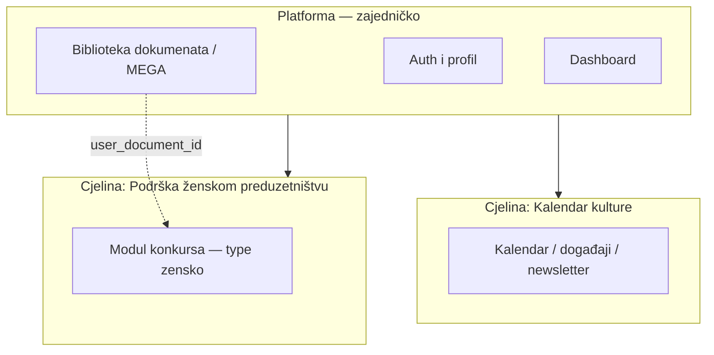

# Arhitektura — pregled

**Poslednje ažuriranje:** 2026-06-30  
**Izvor u kodu:** `composer.json`, `package.json`, `bootstrap/app.php`

---

## Šta je aplikacija

**digital.kotor.me** — digitalna platforma Opštine Kotor: zajednički korisnički i dokumentacioni sloj na kojem rade poslovne **cjeline** (moduli). Trenutno u produkciji: biblioteka dokumenata, kalendar kulturnih događaja i konkurs „Podrška ženskom preduzetništvu“.

---

## Konceptualni model projekta (važeće)

Projekat se poslovno i tehnički posmatra u **tri nivoa**. Ovo je službeni koncept; nove cjeline na platformu dodaju se **samo uz eksplicitno obavještenje** — do tada ih ne pretpostavljati u dokumentaciji niti implementaciji.

### 1. Platforma (zajednički sloj)

Horizontalna osnova za sve cjeline:

| Komponenta | Namjena | Dokumentacija |
|------------|---------|---------------|
| Registracija, login, verifikacija emaila | Identitet korisnika | [authentication-and-registration.md](authentication-and-registration.md) |
| Profil, uloge, aktivacija naloga | Korisnik i pristup | [roles-and-permissions.md](roles-and-permissions.md) |
| Dashboard | Ulazni panel nakon prijave | `HomeController@dashboard` |
| **Biblioteka dokumenata** | Upload, MEGA, kvota; dokumenti se **ponovo koriste** u cjelinama (npr. prijava na konkurs preko `user_document_id`) | [document-library-and-mega.md](document-library-and-mega.md) |

Platforma **nije** zaseban paket u repou — dijeli `auth` / `verified` / `module_access_restrict` middleware, `User` model i zajedničke rute (`/dashboard`, `/profile`, `/documents`).

### 2. Cjelina: Kalendar kulturnih događaja

Samostalan poslovni modul:

- rute `/kalendar-kulture/*`
- admin uloga `kk_admin` (izolovan `RestrictRoleModuleAccess`-om)
- newsletter, javni pregled događaja

Dokumentacija: [cultural-calendar.md](cultural-calendar.md).

### 3. Cjelina: Podrška ženskom preduzetništvu

Produkcijska **instanca modula konkursa** — u kodu generički framework `Competition` / `Application` / evaluacija / komisija, u UI i poslovnom smislu fokus na `Competition.type = 'zensko'`.

Obuhvata: Obrazac 1a/1b, biznis plan, dokumentacija, evaluaciju, ugovore, izvještaje, admin konkursa i komisije.

Dokumentacija: [application-lifecycle.md](application-lifecycle.md), [business-rules.md](business-rules.md), korisničko [../UPUTSTVO_ZENSKO_PREDUZETNISTVO.md](../UPUTSTVO_ZENSKO_PREDUZETNISTVO.md).

### Dijagram



### Buduće cjeline na platformi

Na platformu će se dodavati nove cjeline (npr. drugi konkursi, servisi). **Pravilo:** nova cjelina se unosi u dokumentaciju i razvoj tek kad je eksplicitno najavljena. Do tada: ne nagađati scope.

Stubovi na platformi (plaćanja, tenderi, obavještenja) nisu objavljene cjeline — v. [stubs-and-future-modules.md](stubs-and-future-modules.md).

### Razvoj i objava na jednom serveru (važeće)

Na `digital.kotor.me` **nema odvojenog staging domena**. Kod stiže sa **lokalnih računara** → GitHub (`main`) → Plesk deploy.

- **Razvoj:** lokalni računari tima (ne direktno na serveru).
- **Platforma** i **objavljene cjeline** — korisnici ih vide.
- **Cjeline u izradi** — kod može biti na serveru, ali **bez** pristupa korisnicima (nema linka na dashboardu).
- **Objava:** odluka tima → tipično **polje/ikonica/link na Dashboard-u**.

Tok, Git, tim: [project-operations.md](project-operations.md). Cron i Toolkit: [deployment-and-cron.md](deployment-and-cron.md).

### Kako se koncept mapira na kod (bez zasebnih paketa)

| Koncept | Realnost u repou |
|---------|------------------|
| Platforma | Horizontalni sloj: auth, `UserDocument`, zajednički middleware |
| Kalendar | Odvojene rute, kontroleri, `kk_admin` |
| Žensko preduzetništvo | Modul konkursa + filter `type=zensko`; baza podržava i `omladinsko`, ali to nije aktivna cjelina dok se ne obavijesti |

---

## Tech stack (važeće)

| Sloj | Tehnologija |
|------|-------------|
| Backend | PHP ^8.2, Laravel ^12 |
| Auth UI | Laravel Breeze (dev dependency) + custom registracija u `HomeController` |
| Frontend | Blade, Vite 7, Tailwind CSS 4, axios |
| Baza | MySQL/MariaDB (produkcija); sqlite u `composer` skriptama za lokalni bootstrap |
| Queue | `database` driver (`QUEUE_CONNECTION`) |
| Session | `database` |
| Cloud storage | MEGA.nz preko `megajs` (Node) + browser upload |
| Obrada dokumenata | PHP Imagick / ImageMagick CLI / GD; opciono Python Pillow (`scripts/process_document.py`) |
| Mail | Laravel Mail (`MAIL_*`); custom `VerifyEmailNotification` |

**Nije u projektu:** payment gateway SDK, Sanctum API, Filament admin.

---

## Slojevi aplikacije

```
Browser (Blade + Vite + megajs)
        ↓
routes/web.php (+ auth.php)
        ↓
Middleware: auth, verified, module_access_restrict, role:*
        ↓
Controllers (app/Http/Controllers/)
        ↓
Models (app/Models/) + Services (app/Services/)
        ↓
MySQL + local storage (storage/app/) + MEGA.nz
```

---

## Vanjski servisi

| Servis | Konfiguracija | Namjena |
|--------|---------------|---------|
| MEGA.nz | `config/services.php` → `MEGA_*` | Trajno skladištenje PDF/slika korisnika |
| SMTP / mail | `config/mail.php` | Verifikacija emaila, newsletter, komisija |
| Node.js | `NODE_BINARY` (env, default `node`) | `scripts/upload-to-mega.js`, `delete-expired-mega.js` |

---

## Produkcija vs stub

| Dubina implementacije | Moduli |
|----------------------|--------|
| Puna | konkursi, prijave, evaluacija, ugovori/izvještaji, dokumenti/MEGA, kalendar, admin |
| Stub / placeholder | plaćanja, tenderi, obavještenja |

Detalji: [stubs-and-future-modules.md](stubs-and-future-modules.md).

---

## Poznati arhitektonski rizici

1. **Duplikat auth ruta** — `routes/web.php` i `routes/auth.php` oba definišu `login`/`register`. Pri izmjenama auth-a provjeriti koja ruta je aktivna.
2. **MEGA kredencijali** — sesija za browser upload dobija credentials sa servera; v. [document-library-and-mega.md](document-library-and-mega.md).
3. **Cron** — većina održavanja dokumenata ide preko Plesk PHP skripti u root-u, ne preko Laravel schedulera (osim newslettera).

---

## Povezani dokumenti

- [modules-and-routes.md](modules-and-routes.md)
- [database-entities.md](database-entities.md)
- [deployment-and-cron.md](deployment-and-cron.md)
